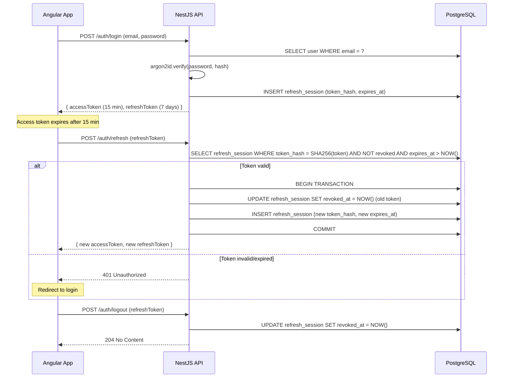
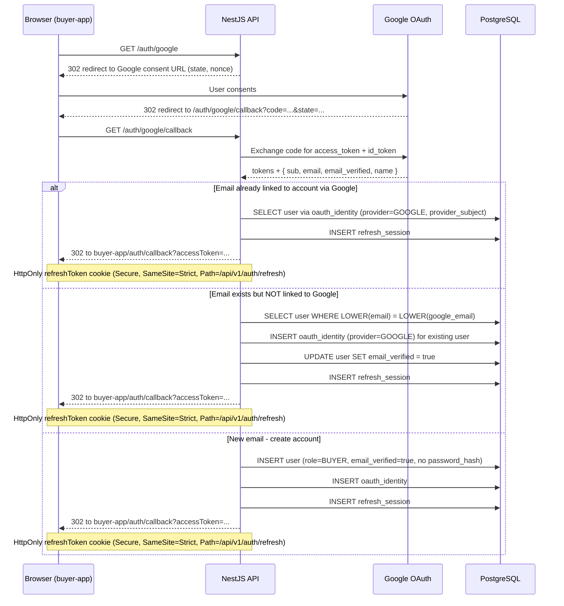

# Auth & JWT Design

**Status:** Draft  
**Source of truth:** [BRD v1.2](../phase-1/requirements/BRD.md), [implementation-specs](../phase-1/technical-design/implementation-specs.md), [api-design](../phase-1/technical-design/api-design.md)

---

## Summary

- [1. JWT payload structure](#jwt-payload-structure)
- [2. Refresh token rotation flow](#refresh-token-rotation-flow)
- [3. OAuth flow — Google (buyer portal only)](#oauth-flow-google)
- [4. OAuth flow — Facebook (buyer portal only)](#oauth-flow-facebook)
- [5. Seller portal auth constraints](#seller-portal-auth-constraints)
- [6. Admin portal auth constraints](#admin-portal-auth-constraints)
- [7. Auth guards](#auth-guards)
- [8. Rate limiting](#rate-limiting)
- [9. Security headers](#security-headers)
- [10. Password hashing](#password-hashing)
- [11. Email verification token design](#email-verification-token-design)
- [12. Password reset token design](#password-reset-token-design)
- [13. Token revocation — immediate status enforcement](#token-revocation)
- [14. Design Decisions](#design-decisions)

<a id="jwt-payload-structure"></a>
## 1. JWT payload structure

### 1.1 Access token (short-lived)

```json
{
  "sub": "01930abc-...",
  "roles": ["BUYER"],
  "email_verified": true,
  "account_type": "B2C",
  "seller_kyc_status": "APPROVED",
  "seller_suspension_status": "ACTIVE",
  "iat": 1724000000,
  "exp": 1724000900
}
```

| Claim | Type | Notes |
|-------|------|-------|
| `sub` | `string` (UUIDv7) | `identity.user.id` — never exposes email or PII |
| `roles` | `string[]` | Always an array. Values: `BUYER`, `SELLER`, `ADMIN`. A user may hold `BUYER` + `SELLER` simultaneously; `ADMIN` is never co-held with others. |
| `email_verified` | `boolean` | `true` after email verification or OAuth login (OAuth = pre-verified). |
| `account_type` | `"B2C" \| "B2B"` | Buyer account classification. |
| `seller_kyc_status` | `"PENDING_KYC" \| "APPROVED" \| "REJECTED" \| null` | `null` when user is not a seller. Immutable after a final KYC decision. |
| `seller_suspension_status` | `"ACTIVE" \| "SUSPENDED" \| null` | `null` when user is not a seller. Independent of `seller_kyc_status`. Both claims embedded so guards avoid a DB lookup per request. |
| `iat` | `number` | Issued at (Unix seconds). |
| `exp` | `number` | Access token TTL: **15 minutes** from issue. |

**Signing:** `HS256` using `JWT_SECRET` env var (min 32 bytes, generated per environment). `JWT_ALGORITHM=HS256` is the V1 default; RS256 requires key rotation infrastructure deferred to V2.

### 1.2 Refresh token (long-lived)

The refresh token is an **opaque** random string (32 bytes, `crypto.randomBytes(32).toString('hex')`). It is never a JWT. Only its `SHA-256` hash is stored in `identity.refresh_session.token_hash`.

| Property | Value |
|----------|-------|
| TTL | **7 days** from issue |
| Storage | `identity.refresh_session` (hashed) |
| Rotation | Every `/auth/refresh` call issues a new pair and revokes the old refresh token atomically |
| Revocation on password reset | All refresh sessions for the user are hard-deleted |
| Revocation on password change | All refresh sessions except the current one are hard-deleted |
| Expired row cleanup | `pg_cron` daily job — see [data-lifecycle.md § refresh_session](./data-lifecycle.md) |

### 1.3 Token storage (client side)
- `accessToken`: in-memory (JavaScript variable, not localStorage). Reduces XSS token theft surface.
- `refreshToken`: `HttpOnly; Secure; SameSite=Strict` cookie OR `localStorage` with content-security-policy mitigation — **[DESIGN DECISION]** using `HttpOnly` cookie for refresh token. Cookie path `/api/v1/auth/refresh` to minimize CSRF surface.

---

<a id="refresh-token-rotation-flow"></a>
## 2. Refresh token rotation flow



**Reuse detection:** If a revoked refresh token is presented again (token reuse attack), the server revokes ALL sessions for that user and returns 401. This forces a full re-login. Reuse detection requires the revoked row to remain until its `expires_at` — do not hard-delete on rotation. Rows are cleaned by the daily `pg_cron` job once expired.

---

<a id="oauth-flow-google"></a>
## 3. OAuth flow — Google (buyer portal only)



**State validation:** `state` param is a CSRF token stored in a short-lived session cookie; validated on callback before processing.

---

<a id="oauth-flow-facebook"></a>
## 4. OAuth flow — Facebook (buyer portal only)

Same callback transport as Google: `accessToken` as query param, `refreshToken` via `HttpOnly; Secure; SameSite=Strict` Set-Cookie. Differences:
- Provider: `FACEBOOK`
- Passport strategy: `passport-facebook`
- Profile fields requested: `id`, `email`, `name`
- Email: Facebook does not guarantee an email is returned. If no email is present in the callback, the user is prompted to supply one before their account is created. **[DESIGN DECISION]** Require email for account creation; reject accounts without a verified email from Facebook.

---

<a id="seller-portal-auth-constraints"></a>
## 5. Seller portal auth constraints

The seller portal uses **email/password only**. No OAuth. Reasons:
- KYC process requires a verified local identity with a set password.
- OAuth-only accounts must call `POST /auth/set-password` before applying as a seller (enforced in the `POST /seller/register` guard).

---

<a id="admin-portal-auth-constraints"></a>
## 6. Admin portal auth constraints

- Email/password only. No registration endpoint.
- Admin accounts are **seeded in the database** (`pnpm run seed`); no self-service sign-up.
- Admin session TTL: same 15-min access / 7-day refresh, but `roles: ["ADMIN"]` is never mixed with BUYER or SELLER.
- No password reset UI in V1; password changes require direct DB update.

---

<a id="auth-guards"></a>
## 7. Auth guards

### 7.1 Guard definitions

| Guard name | Implementation | Check |
|------------|---------------|-------|
| `JwtAuthGuard` | NestJS `AuthGuard('jwt')` + Redis revocation check | Validates signature + expiry of Bearer token; then checks `auth:revoke_before:{sub}` in Redis — rejects if `iat < revokeTimestamp` |
| `RolesGuard` | Custom decorator + guard | Checks `decodedToken.roles` contains required role(s) |
| `EmailVerifiedGuard` | Custom guard | Checks `decodedToken.email_verified === true` |
| `SellerApprovedGuard` | Custom guard | Checks `decodedToken.seller_kyc_status === 'APPROVED'` |
| `SellerNotSuspendedGuard` | Custom guard | Checks `decodedToken.seller_suspension_status !== 'SUSPENDED'` |

**Note on `SellerApprovedGuard` (`KycApprovedGuard`):** `SellerApprovedGuard` reads `seller_kyc_status` from the decoded JWT access token claim (field: `seller_kyc_status`, already present in access token per §1.1 JWT claims). It does NOT make an API round-trip to fetch the seller profile. The guard is a pure synchronous check on the decoded JWT payload.

Guards are applied via decorators:
```typescript
@UseGuards(JwtAuthGuard, RolesGuard, EmailVerifiedGuard)
@Roles('BUYER')
```

### 7.2 Guard evaluation matrix

Maintained alongside each Phase API spec since it references phase-specific endpoints.

---

<a id="rate-limiting"></a>
## 8. Rate limiting

NestJS `@nestjs/throttler` with per-endpoint overrides.

| Endpoint | Limit | Window |
|----------|-------|--------|
| `POST /auth/register` | 5 requests | 15 minutes per IP |
| `POST /auth/login` | 10 requests | 15 minutes per IP |
| `POST /auth/forgot-password` | 3 requests | 1 hour per email (extracted from body) |
| `POST /auth/resend-verification` | 3 requests | 1 hour per authenticated user |
| `POST /auth/reset-password` | 5 requests | 1 hour per token |
| `GET /auth/google`, `GET /auth/facebook` | 20 requests | 1 minute per IP |
| Default API | 100 requests | 1 minute per IP |

Rate limit headers returned: `X-RateLimit-Limit`, `X-RateLimit-Remaining`, `Retry-After` (on 429).

---

<a id="security-headers"></a>
## 9. Security headers

Applied globally via `helmet()` in NestJS bootstrap:

| Header | Value |
|--------|-------|
| `Strict-Transport-Security` | `max-age=31536000; includeSubDomains` |
| `X-Content-Type-Options` | `nosniff` |
| `X-Frame-Options` | `DENY` |
| `Content-Security-Policy` | `default-src 'self'; script-src 'self'; style-src 'self' 'unsafe-inline'; img-src 'self' data: https:; connect-src 'self'` |
| `Referrer-Policy` | `no-referrer` |
| `Permissions-Policy` | `camera=(), microphone=(), geolocation=()` |
| `X-XSS-Protection` | `1; mode=block` (legacy browsers) |

CORS: origin restricted to `BUYER_APP_URL`, `SELLER_APP_URL`, `ADMIN_APP_URL` env vars. `credentials: true` to support cookie-based refresh token.

---

<a id="password-hashing"></a>
## 10. Password hashing

- Algorithm: **argon2id** (`@node-rs/argon2` or `argon2` npm package)
- Parameters: `memoryCost: 65536` (64 MiB), `timeCost: 3`, `parallelism: 4`
- Hash stored in `identity.user.password_hash`; raw password never logged or persisted
- OAuth-only accounts: `password_hash` is `NULL`; login via local password returns 401 with message "Invalid Credentials."

---

<a id="email-verification-token-design"></a>
## 11. Email verification token design

- Token: `crypto.randomBytes(32).toString('hex')` — 64-hex-char string
- Storage: hashed in a dedicated `identity.email_verification_token` table (or as a column on `identity.user`)
- TTL: **24 hours**, single-use
- On verify: set `user.email_verified = true`, delete token row
- On resend: invalidate previous token (delete row), generate new token

**[DESIGN DECISION]** Token stored separately from the user row to avoid locking the user row during verification. A table `identity.email_verification_token (user_id, token_hash, expires_at)` with a unique index on `user_id` (one active token per user).

---

<a id="password-reset-token-design"></a>
## 12. Password reset token design

- Token: `crypto.randomBytes(32).toString('hex')`
- Storage: table `identity.password_reset_token (user_id, token_hash, expires_at, used_at)`
- TTL: **60 minutes**, single-use
- On use: set `used_at = NOW()`, then update `user.password_hash`, revoke all refresh sessions
- Token inclusion in email: `${BASE_URL}/reset-password?token=<raw_token>`

---


<a id="token-revocation"></a>
## 13. Token revocation — immediate status enforcement

Redis per-user revocation timestamp ensures `seller_kyc_status` and `seller_suspension_status` changes take effect on the next API request, without waiting for the 15-min access token to expire.

### 13.1 Mechanism

**Redis key:** `auth:revoke_before:{userId}` → Unix timestamp in seconds  
**TTL:** 960 s (access token max lifetime 900 s + 60 s clock-skew buffer)

**On status change** — write the revocation timestamp:
```typescript
// Called by SellerService.updateKycStatus() and updateSuspensionStatus()
await redis.set(
  `auth:revoke_before:${userId}`,
  Math.floor(Date.now() / 1000),
  'EX',
  960,
);
```

**JwtAuthGuard extended check** — runs after signature + expiry validation:
```typescript
const revokeTs = await redis.get(`auth:revoke_before:${payload.sub}`);
if (revokeTs && payload.iat < Number(revokeTs)) {
  throw new UnauthorizedException('Token revoked');
}
```

**On next `/auth/refresh`** — server re-reads `seller_kyc_status` and `seller_suspension_status` from DB and embeds fresh values in the new access token. New token's `iat > revokeTimestamp`, so it passes the check.

### 13.2 Revocation triggers

| Event | Redis write | Notes |
|-------|-------------|-------|
| Admin suspends seller | Yes | Blocks seller routes immediately |
| Admin lifts suspension | Yes | Forces token refresh so fresh `ACTIVE` claim is embedded |
| KYC approved | Yes | Token refresh embeds `APPROVED` claim immediately |
| KYC rejected | Yes | Blocks seller routes immediately |
| Admin force-logout user | Yes | Paired with refresh session hard-delete |

### 13.3 Performance

Redis `GET` on every authenticated request. Key is absent for the vast majority of requests (happy path = cache miss, no revocation). Redis round-trip ~0.1–0.5 ms within same datacenter. Key auto-expires — no manual cleanup required.

### 13.4 Refresh flow interaction

The Angular `auth` interceptor already handles 401 → `POST /auth/refresh` → retry. When a revoked token returns 401:
1. Interceptor calls `/auth/refresh` with the `HttpOnly` refresh token cookie.
2. Server re-reads user record from DB and builds a new access token with current `seller_kyc_status` / `seller_suspension_status`.
3. New `iat` > Redis revoke timestamp → passes future checks.
4. If the seller is now suspended/rejected, the new access token embeds the new status → `SellerApprovedGuard` / `SellerNotSuspendedGuard` rejects on the retry, returning 403.

---

<a id="design-decisions"></a>
## 14. [DESIGN DECISIONS]

- **[DESIGN DECISION]** `seller_kyc_status` and `seller_suspension_status` are both embedded in the JWT as independent claims, replacing the previous single `seller_status` field. This allows guards to check each independently (e.g. a seller can be KYC-approved but suspended, or KYC-rejected regardless of suspension). Status changes take effect immediately via Redis per-user revocation — see §14.
- **[DESIGN DECISION]** Refresh token stored as `HttpOnly` cookie on path `/api/v1/auth/refresh`. The Angular `auth` interceptor handles 401 → refresh → retry automatically.
- **[DESIGN DECISION]** Reuse detection: presenting a previously revoked refresh token triggers full session revocation for the user. Tradeoff: aggressive but safe.
- **[DESIGN DECISION]** Token revocation uses a per-user Redis timestamp (`auth:revoke_before:{userId}`) rather than a per-token JTI blocklist. Rationale: status changes (KYC, suspension) affect the user, not a specific token — invalidating all in-flight tokens for that user is the correct semantic. JTI blocklist would require storing one key per issued token; user-timestamp requires one key per revocation event. Redis key TTL matches the access token TTL (≤ 15 min), so no unbounded growth.
