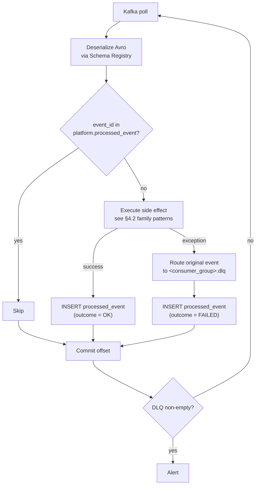

# Kafka Event Conventions

**Status:** Complete  
**Source of truth:** [BRD v1.2](../phase-1/requirements/BRD.md)

Phase-specific event schemas and topic summary: [phase-1/technical-design/kafka-events.md](../phase-1/technical-design/kafka-events.md)

---

## Summary

- [1. Event envelope (all events)](#event-envelope)
- [2. Schema registry](#schema-registry)
- [3. Partition keys](#partition-keys)
- [4. Consumer idempotency template](#consumer-idempotency-template)
- [5. DLQ topology](#dlq-topology)
- [6. BACKWARD compatibility protocol](#backward-compatibility-protocol)

<a id="event-envelope"></a>
## 1. Event envelope (all events)

Every Avro record includes the following envelope fields as the outer record. Topic-specific `payload` is a nested record within the envelope.

```json
{
  "namespace": "com.aliceut.events",
  "type": "record",
  "name": "<EventName>",
  "fields": [
    { "name": "event_id",      "type": "string", "doc": "UUIDv7 — globally unique event identifier" },
    { "name": "event_type",    "type": "string", "doc": "Fully-qualified event type e.g. seller.kyc.submitted" },
    { "name": "event_version", "type": "int",    "doc": "Schema version starting at 1; increment on BACKWARD-compatible changes" },
    { "name": "occurred_at",   "type": "string", "doc": "ISO 8601 UTC timestamp of domain event" },
    { "name": "correlation_id","type": "string", "doc": "UUIDv7 propagated from the originating HTTP request or job" },
    { "name": "payload",       "type": { "type": "record", "name": "Payload", "fields": [...] } }
  ]
}
```

---

<a id="schema-registry"></a>
## 2. Schema registry

- One `<topic>-value` subject per topic in Confluent Schema Registry.
- Compatibility mode: `BACKWARD` on all subjects.
- **BACKWARD compat rules:** adding optional fields (`"default": null` on union `["null", "..."]`) is allowed; removing or renaming fields or changing a field type is a breaking change that requires a new `event_version` and coordinated consumer migration.
- Avro schemas committed to `libs/contracts/avro/` inside `aliceut-ecom-backend/` and registered to Schema Registry by CI before deployment.

---

<a id="partition-keys"></a>
## 3. Partition keys

Each topic uses a partition key to co-locate related events and preserve ordering within an aggregate. Partition key per topic is defined in the phase-specific event catalog.

---

<a id="consumer-idempotency-template"></a>
## 4. Consumer idempotency template

```
1. Check platform.processed_event(consumer_group, event_id)
   → if found: skip (already processed)
2. Execute side effect (write Postgres row, send email, update ES, etc.)
3. INSERT INTO platform.processed_event (consumer_group, event_id, processed_at, outcome)
4. Commit Kafka offset
```

On unhandled exception: route to `<consumer_group>.dlq`, then commit offset. DLQ non-empty triggers alert.

### 4.1 Processing flow diagram



### 4.2 Consumer family patterns

Each consumer group belongs to one family. The idempotency wrapper (§4) applies to all; the steps below are the side-effect body (step 2 above).

---

#### `notification.*` — email + in-app notification

```
1. Resolve recipient email
     - Prefer payload field (e.g. seller_email, buyer_id → look up in DB)
2. Render email template (ET-XX defined in email-templates.md)
3. Send via SMTP/mailer with 3× retry + exponential backoff (100 ms, 500 ms, 2 s)
     - On 3× failure: route to email.outbound.dlq (do NOT route main event to DLQ)
4. If consumer also creates in-app notification:
     a. INSERT notifications (user_id, type, payload, created_at) in Postgres
```

---

#### `search.*` — Elasticsearch index update

```
1. Build ES document / partial update from event payload
2. Call ES index / update / delete API
     - CREATED / UPDATED  →  upsert (index with _id = entity_id)
     - DEACTIVATED / REMOVED / soft_deleted  →  delete or partial update (active = false)
3. On ES 409 version conflict: retry once with fresh read from Postgres
4. On persistent ES error: route to DLQ
```

---

#### `audit` — MongoDB write

```
1. Map envelope + payload fields to audit_logs or activity_events schema
     (schema defined in data-model-mongodb.md)
2. db.audit_logs.insertOne(doc)  OR  db.activity_events.insertOne(doc)
3. On MongoDB write failure: route to DLQ
```

---

#### `inventory.*` — Postgres inventory adjustment

```
1. BEGIN transaction
2. SELECT ... FOR UPDATE on inventory.stock row (pessimistic lock)
3. Apply adjustment (mark reservation CONSUMED, restore stock, etc.)
4. COMMIT
5. On constraint violation or deadlock: retry up to 3× with 50 ms back-off
6. On 3× failure: route to DLQ
```

---

#### `orders.*` — Postgres order/fulfillment state update

```
1. BEGIN transaction
2. UPDATE orders.fulfillment SET status = ? WHERE fulfillment_id = ?
3. Check follow-up condition (e.g. all sibling fulfillments DELIVERED?)
4. If condition met: INSERT outbox event row in same transaction
5. COMMIT
6. Outbox relay picks up and emits downstream Kafka event
7. On DB error: rollback, route to DLQ
```

---

<a id="dlq-topology"></a>
## 5. DLQ topology

Each consumer group has a dedicated DLQ topic: `<consumer_group>.dlq`

- DLQ message includes the original event envelope + error metadata (`error_type`, `error_message`, `failed_at`, `attempt_count`).
- DLQ non-empty → alert (Kafka UI monitoring or a health check endpoint exposed by workers).
- SMTP failures: retry 3× with exponential backoff, then route to `email.outbound.dlq`.

---

<a id="backward-compatibility-protocol"></a>
## 6. BACKWARD compatibility protocol

When adding a new field to an existing event payload:
1. Add it as a union with null and a default: `"type": ["null", "string"], "default": null`
2. Increment `event_version`
3. Update the Schema Registry subject; validate BACKWARD compatibility passes before deploying
4. Update all consumers to handle the new field (null-safe)

When removing a field, changing a type, or renaming: this is a **breaking change**. Create a new topic `<topic>.v2` or bump the major version; deprecate the old topic after all consumers migrate.
