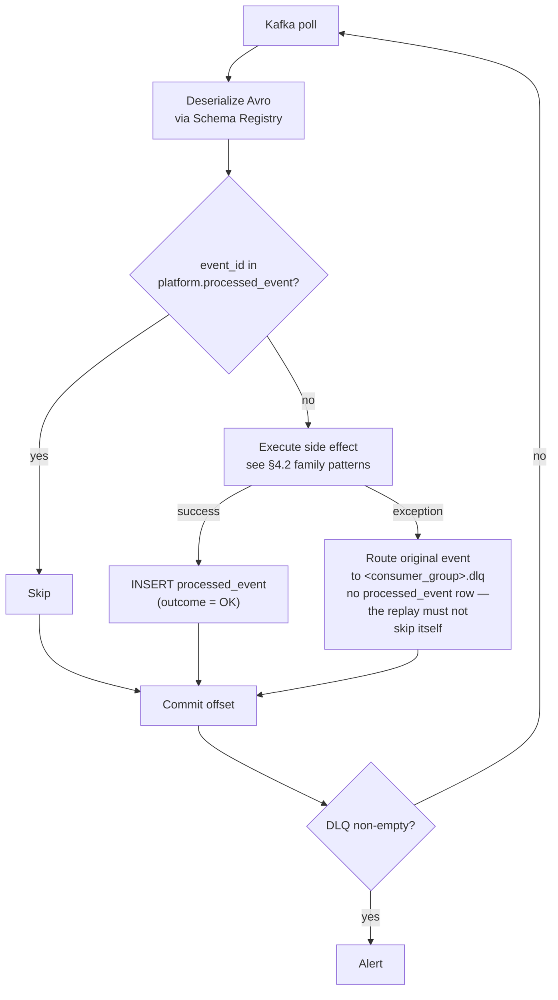

# Kafka Event Conventions

**Status:** Complete  
**Source of truth:** [BRD v1.2](../phase-1/requirements/BRD.md)

Phase-specific event schemas and topic summary: [phase-1/technical-design/kafka-events.md](../phase-1/technical-design/kafka-events.md)

Which consumer writes which field, and the event field that supplies it: [phase-1/technical-design/consumer-field-matrix.md](../phase-1/technical-design/consumer-field-matrix.md). A payload change is not complete until that matrix says which consumer the new field serves.

---

## Summary

- [1. Event envelope (all events)](#event-envelope)
- [2. Schema registry](#schema-registry)
- [3. Partition keys](#partition-keys)
- [4. Consumer idempotency template](#consumer-idempotency-template)
- [5. DLQ topology](#dlq-topology)
- [6. BACKWARD compatibility protocol](#backward-compatibility-protocol)

<a id="event-envelope"></a>
## 1. Event envelope (all events)

Every Avro record includes the following envelope fields as the outer record. Topic-specific `payload` is a nested record within the envelope.

```json
{
  "namespace": "com.aliceut.events",
  "type": "record",
  "name": "<EventName>",
  "fields": [
    { "name": "event_id",      "type": "string", "doc": "UUIDv7 — globally unique event identifier" },
    { "name": "event_type",    "type": "string", "doc": "Fully-qualified event type e.g. seller.kyc.submitted" },
    { "name": "event_version", "type": "int",    "doc": "Schema version starting at 1; increment on BACKWARD-compatible changes" },
    { "name": "occurred_at",   "type": "string", "doc": "ISO 8601 UTC timestamp of domain event" },
    { "name": "correlation_id","type": "string", "doc": "UUIDv7 propagated from the originating HTTP request or job" },
    { "name": "payload",       "type": { "type": "record", "name": "Payload", "fields": [...] } }
  ]
}
```

`Payload` above is a placeholder, not a literal name. Every event shares the single namespace `com.aliceut.events`, so two payload records both named `Payload` would resolve to the same fully-qualified type and break Avro code generation. Each event names its payload record after itself — `FulfillmentPlacedPayload`, `SellerKycSubmittedPayload` — and that name is declared with the schema in the phase-specific event catalog. This convention owns the envelope field list, the envelope semantics and the namespace; the payload record's name and fields belong to the event.

---

<a id="schema-registry"></a>
## 2. Schema registry

- One `<topic>-value` subject per topic in Confluent Schema Registry.
- Compatibility mode: `BACKWARD` on all subjects.
- **BACKWARD compat rules.** `BACKWARD` asks one question: can a reader holding the *new* schema decode data written under the *old* one? Three consequences follow, and they are not symmetrical:
  - **Adding a field** is allowed **only with a default** — `["null", "..."]` with `"default": null`, or a non-null default on a field every producer writes. Without one, the new reader has nothing to put in the field when it meets an old record, and the registry rejects the schema.
  - **Removing a field** is allowed, whether or not that field had a default: the new reader simply ignores the extra value in an old record. It is a breaking change for *consumers still on the previous schema*, which keep reading the field until they are redeployed, so a removal is coordinated even though the registry permits it.
  - **Renaming a field or changing its type** is a removal plus an addition, so it passes the registry only when the new name carries a default — and a reader on the old schema loses the value either way. Treat it as breaking.
- **An Avro enum that mirrors a Postgres enum names it, and two enums are never interchangeable.** A field whose values land in a Postgres enum column declares that type in its `doc`, and its symbol list is that type's symbols plus `UNKNOWN` as the schema `"default"`. `UNKNOWN` is a decode fallback and never a value to persist: a consumer that meets it routes the event to the DLQ (§4) rather than inserting a symbol the column rejects. That applies to the consumers writing the mirrored column, which is what the rule is about — an audit consumer storing the payload verbatim in a schemaless document has no column to reject it, and for that family an unrecognised symbol is recorded rather than dead-lettered, because dead-lettering would discard the only record of the event. A third position needs no handling at all: a consumer that neither persists the symbol nor branches on it can decode `UNKNOWN` and proceed — `search.offer-changed` reads `change_type` for nothing and takes index membership from `status` ([kafka-events.md § `offer.changed`](../phase-1/technical-design/kafka-events.md)), so an undecodable symbol cannot leave a deactivated offer searchable. These three cases are exhaustive; do not read the DLQ rule as a default for every non-audit consumer. A consumer may choose to be stricter than its position requires — `notification.listing-removed` DLQs `UNKNOWN` even though `removal_category` lands in a `TEXT` column that would accept it — which is a local decision, not a rule. Where two fields on the same lifecycle carry overlapping symbols — a case's origin and an admin's removal category share `PROHIBITED_CATEGORY` — each field's `doc` names the one Postgres type it mirrors, and copying a value from one field into the other is a defect even though it type-checks.
- **Never remove a symbol from an Avro enum. Deleting one is prohibited, and the registry will not stop you.** The asymmetry is that a symbol list is checked against the reader's `"default"`, not against the data: adding a symbol is BACKWARD-safe at the registry because an old record never carries it, while removing one *passes* compatibility precisely because `"default": "UNKNOWN"` gives the new reader something to return for the symbol it no longer knows. The schema registers, CI is green, and every record still on the topic that carried the deleted symbol now decodes as `UNKNOWN` — the value is not reported lost, it is silently replaced, and a consumer following the rule above then DLQs events that were valid when written. **Deprecate in place instead: leave the symbol in the list, say in the field's `doc` that it is no longer produced and from when, and stop producing it.** A symbol may only leave the list once no record carrying it remains anywhere it can still be read: after the source topic's retention has passed — per topic in [kafka-events.md § 3](../phase-1/technical-design/kafka-events.md#topic-retention) — and after the retention of every DLQ that may hold one of those records has passed as well. Which DLQ that is comes from §5 below, and its retention — the longest among its source topics' — is stated in that same § 3. Both are figures a reader can look up; nothing else in this design keeps a decoded record where it can be read again. In V1 that condition is never met while the topic exists, so the list only ever grows.
- **Adding a symbol passes the registry and still breaks if it ships in the wrong order.** Registry compatibility is not the whole check: by the mirroring rule above the symbol lands in a Postgres enum column, so three things ship, in this order — (1) the `ALTER TYPE <type> ADD VALUE '<symbol>'` migration, (2) every consumer of the topic, redeployed onto the schema that carries the symbol, (3) the producer that emits it. Out of that order the event is valid and lost anyway: a consumer still on the old schema decodes the new symbol as `UNKNOWN` and routes a well-formed event to the DLQ, and a consumer on the new schema whose database has not had the migration fails the insert instead. `ALTER TYPE … ADD VALUE` is its own migration file — Postgres will not let the added value be used in the transaction that adds it — so it is never bundled with the migration or the deploy that first uses it. On a topic whose only consumer is an audit consumer both of those failure modes are unreachable, because neither writes the column: the wrong order there yields a permanently degraded audit document and **no operational signal at all** — no DLQ entry, no failed insert, nothing to alert on. Quieter, not better, and still a defect rather than an acceptable steady state. Step (1) still binds, via the producer's own module.
- Avro schemas committed to `libs/contracts/avro/` inside `aliceut-ecom-backend/` and registered to Schema Registry by CI before deployment.
- **A schema that has never been registered has no compatibility obligation.** Before the first CI registration of a subject there is no previous schema to be compatible with and no consumer holding one, so a correction to an unregistered `event_version: 1` schema is an amendment to the initial version rather than an evolution of a live one: `event_version` stays at `1` and no `.v2` topic is created. The rules above bind from the first registration onward.

---

<a id="partition-keys"></a>
## 3. Partition keys

Each topic uses a partition key to co-locate related events and preserve ordering within an aggregate. Partition key per topic is defined in the phase-specific event catalog.

Partition count and replication factor are properties of the broker deployment rather than of the event contract, so they are declared per topic in that same catalog and are not fixed here — for Phase 1, in [kafka-events.md § 3](../phase-1/technical-design/kafka-events.md#topic-retention). A single-node V1 broker cannot exceed a replication factor of 1, and the value that is correct there is a data-loss setting on the Phase 2 Strimzi cluster. What this convention requires is that every topic state both values explicitly instead of inheriting a broker default.

**Every topic is created explicitly — with its partition count, replication factor and retention — before any producer or consumer starts.** Broker auto-creation is disabled, because a topic the broker invents takes the broker's defaults, and a default retention silently overrides a retention the design chose for a security reason: the `auth.*` topics carry a raw single-use credential token and are held to 24 hours against a broker default of seven days. The provisioning step for Phase 1 is the `kafka-init` container in [docker-compose-topology.md § 6](../phase-1/technical-design/docker-compose-topology.md#docker-compose-yml); it is idempotent, it runs to completion before `api` and `workers` start, and it creates the DLQ topics (§5) as well as the event topics — a DLQ nobody created is a failure nobody sees.

---

<a id="consumer-idempotency-template"></a>
## 4. Consumer idempotency template

```
1. Check platform.processed_event(consumer_group, event_id)
   → if found: skip (already processed)
2. Execute side effect (write Postgres row, send email, update ES, etc.)
3. INSERT INTO platform.processed_event (consumer_group, event_id, processed_at, outcome = 'OK')
4. Commit Kafka offset
```

On unhandled exception: route to `<consumer_group>.dlq`, then commit offset. DLQ non-empty triggers alert.

**A failure writes no dedupe row.** Step 3 runs on the success path only, and `outcome` is therefore always `'OK'` — the column records *which* result was recorded, not whether one was. A row written on the exception path would make the message look processed: a DLQ exists so a fixed consumer can replay the event, and a replay that finds its own `event_id` in `platform.processed_event` skips the side effect and commits the offset, discarding the very message the DLQ was holding. The 14-day dedupe window would then be the window in which replay is guaranteed to fail. The offset still commits after the DLQ route, because the message has been moved somewhere durable; what must not happen is claiming the side effect ran.

### 4.1 Processing flow diagram


```mermaid
flowchart TD
    A[Kafka poll] --> B[Deserialize Avro\nvia Schema Registry]
    B --> C{event_id in\nplatform.processed_event?}
    C -- yes --> D[Skip]
    D --> G[Commit offset]
    C -- no --> E[Execute side effect\nsee §4.2 family patterns]
    E -- success --> F["INSERT processed_event\n(outcome = OK)"]
    F --> G
    E -- exception --> H["Route original event\nto &lt;consumer_group&gt;.dlq\nno processed_event row —\nthe replay must not\nskip itself"]
    H --> G
    G --> J{DLQ non-empty?}
    J -- yes --> K[Alert]
    J -- no --> A
```

### 4.2 Consumer family patterns

Each consumer group belongs to one family. The idempotency wrapper (§4) applies to all; the steps below are the side-effect body (step 2 above).

**A consumer's inputs are its payload and the document or row it is updating.** No consumer in any family below reads another module's tables, and none makes an enrichment call to fill a gap: a field a consumer needs belongs in the event. Where that leaves a field unsupplied, the event is fattened at the producer — which composes its payload from the tables it owns plus values obtained through the owning module's exported `ApplicationService`, inside the producing transaction. The field-by-field account of what each consumer writes and which payload field supplies it is [phase-1/technical-design/consumer-field-matrix.md](../phase-1/technical-design/consumer-field-matrix.md), which also records the one bounded exception (the admin roster, which is role membership rather than event data).

---

#### `notification.*` — email + in-app notification

```
1. Resolve recipient from the payload
     - Email address: the payload's own recipient field (seller_email, buyer_email, email)
     - In-app recipient_user_id: the payload's identity.user id (buyer_id, seller_user_id)
     - Never a DB lookup: a seller_id is a seller_profile_id and addresses no user row,
       which is why every notification topic carries the recipient's user id and address
2. Render email template (ET-XX defined in email-templates.md)
3. Send via SMTP/mailer with 3× retry + exponential backoff (100 ms, 500 ms, 2 s)
     - On 3× failure: route to email.outbound.dlq (do NOT route main event to DLQ)
4. If consumer also creates in-app notification:
     a. INSERT notifications (user_id, type, payload, created_at) in Postgres
```

---

#### `search.*` — Elasticsearch index update

```
1. Build ES document / partial update from event payload
2. Call ES index / update / delete API
     - CREATED / UPDATED  →  upsert (index with _id = entity_id)
     - DEACTIVATED / REMOVED / soft_deleted  →  delete or partial update (active = false)
3. On ES 409 version conflict: retry once with fresh read from Postgres
4. On persistent ES error: route to DLQ
```

---

#### `platform.audit` — MongoDB write

```
1. Map envelope + payload fields to audit_logs or activity_events schema
     (schema defined in data-model-mongodb.md)
2. db.audit_logs.insertOne(doc)  OR  db.activity_events.insertOne(doc)
3. On MongoDB write failure: route to DLQ
```

---

#### `inventory.*` — Postgres inventory adjustment

```
1. BEGIN transaction
2. SELECT ... FOR UPDATE on inventory.stock row (pessimistic lock)
3. Apply adjustment (mark reservation CONSUMED, restore stock, etc.)
4. COMMIT
5. On constraint violation or deadlock: retry up to 3× with 50 ms back-off
6. On 3× failure: route to DLQ
```

---

#### `orders.*` — Postgres order/fulfillment state update

```
1. BEGIN transaction
2. UPDATE orders.fulfillment SET status = ? WHERE fulfillment_id = ?
3. Check follow-up condition (e.g. all sibling fulfillments DELIVERED?)
4. If condition met: INSERT outbox event row in same transaction
5. COMMIT
6. Outbox relay picks up and emits downstream Kafka event
7. On DB error: rollback, route to DLQ
```

---

<a id="dlq-topology"></a>
## 5. DLQ topology

Each consumer group has a dedicated DLQ topic: `<consumer_group>.dlq`

- **A DLQ is per consumer group, not per topic.** A group that consumes more than one topic has one DLQ covering all of them, so the number of DLQ topics equals the number of consumer groups and is never derived from the topic count. The tally for a given phase is in that phase's event catalog — for Phase 1, in [kafka-events.md § 4](../phase-1/technical-design/kafka-events.md#dlq-topics).
- DLQ message includes the original event envelope + error metadata (`error_type`, `error_message`, `failed_at`, `attempt_count`).
- DLQ non-empty → alert (Kafka UI monitoring or a health check endpoint exposed by workers).
- SMTP failures: retry 3× with exponential backoff, then route to `email.outbound.dlq`.

---

<a id="backward-compatibility-protocol"></a>
## 6. BACKWARD compatibility protocol

When adding a new field to an existing event payload:
1. Add it as a union with null and a default: `"type": ["null", "string"], "default": null`
2. Increment `event_version`
3. Update the Schema Registry subject; validate BACKWARD compatibility passes before deploying
4. Update all consumers to handle the new field (null-safe)

When removing a field: the registry permits it under `BACKWARD` (§2), and the sequence is consumer-first — redeploy every consumer that reads the field, then register the schema without it, then stop producing it. Done in that order it needs no new topic and no `event_version` bump. Done in the other order it is an outage: a consumer still projecting the field reads `null` and writes a document or a document update that is silently missing a value.

**The paragraph above is about fields. Removing a symbol from an enum is a different change and consumer-first ordering does not make it safe** — it is prohibited outright (§2). The field recipe works because the only thing at risk is a consumer still reading the field, and redeploying it first removes that risk. A deleted symbol damages records that are already written: they decode as `UNKNOWN` against the new schema no matter which order the deploy ran in, and no redeploy sequence can reach them. Deprecate the symbol in place instead, and see §2 for the mechanism and for the one condition under which a symbol may eventually leave the list.

**Adding a symbol to an enum is also not the four steps above**, because the symbol has to exist in the Postgres enum column before it can be persisted: the `ALTER TYPE … ADD VALUE` migration ships first, then the consumers, then the producer. Ordering and failure modes are in §2.

When changing a type or renaming: this is a **breaking change**. Create a new topic `<topic>.v2` or bump the major version; deprecate the old topic after all consumers migrate.
