# Buyer Purchase Journey

**References:** US-B-00, US-B-01, US-B-02, US-B-03, US-B-04, US-B-05, US-B-06, US-B-07, US-B-08, US-B-09, US-B-10, US-B-11, US-B-12  
**Email templates:** ET-01 (order summary), ET-02 (shipped), ET-03 (delivered), ET-04 (refunded), ET-05 (all-delivered), ET-18 (verification)  

## Key invariants

- Cart re-resolves prices on page entry; stale/inactive-offer items block checkout CTA (US-B-06)
- Guest cart merges to server cart after auth; unauthenticated users redirected to `/login?next=/checkout` (US-B-08, US-B-00)
- Price re-resolved at submit; if changed beyond tolerance, submission halts and buyer must confirm new prices (US-B-09)
- Checkout processes each seller/currency group independently; one group failing does not block others
- `unit_price`, `currency`, `tax`, `fx_rate_used_at_capture` snapshotted at reservation — never re-derived post-checkout (FR-P-03)
- Email verification required before placing orders; OAuth accounts pre-verified; email/password can browse without verifying

## Diagram

```mermaid
graph TD
    A([Guest visits AliceUT]) --> B[Search by keyword or browse catalog]
    B --> C[Apply filters and sort]
    C --> D[Product Detail Page]
    D --> E{In stock?}
    E -- No --> F[OOS badge shown\nAdd to cart disabled]
    E -- Yes --> G[Select variant + quantity]
    G --> H[Add to cart\nCart badge increments]
    H --> I{Continue shopping?}
    I -- Yes --> B
    I -- No --> J[View cart page]
    J --> K[Cart re-resolves current prices on page entry]
    K --> L{Stale items in cart?\nInactive offer}
    L -- Yes --> M[Stale items labelled Unavailable\nCheckout CTA disabled]
    M --> N{Buyer removes all stale items?}
    N -- No --> M
    N -- Yes --> O{Cart empty?}
    L -- No --> O
    O -- Yes --> P([Empty cart state])
    O -- No --> Q[Proceed to Checkout]
    Q --> R{Authenticated?}
    R -- No --> S[Redirect to /login?next=/checkout\nSign in to complete your purchase]
    S --> T{Login or register?}
    T -- Login --> U{Valid credentials?}
    U -- No --> T
    U -- Yes --> V{Email verified?}
    V -- No --> W[Verification pending prompt\nCannot place orders until verified]
    W -- Verify --> V
    V -- Yes --> X[Authenticated session established]
    T -- Register --> Y[Create account\nemail/password or OAuth]
    Y --> Z{OAuth provider?}
    Z -- Yes --> X
    Z -- No --> AA[ET-18 Verification email sent]
    AA --> AB{Email verified?}
    AB -- No --> W
    AB -- Yes --> X
    X --> AC[Guest cart merged into server cart]
    AC --> AD{Purchasable items\nafter merge?}
    AD -- No --> P
    AD -- Yes --> AE[Checkout page]
    R -- Yes --> AE
    AE --> AF[Step 1: Shipping address]
    AF --> AG[Step 2: Shipping method]
    AG --> AH[Step 3: Payment method - mock]
    AH --> AI[Review order summary]
    AI --> AJ[Submit: Place Order]
    AJ --> AK[Validate address]
    AK --> AL[Exclude inactive-offer items as skipped_items\nSkipped items remain in cart]
    AL --> AM{Valid items remain?}
    AM -- No --> AN[Error: No purchasable items in cart]
    AN --> AE
    AM -- Yes --> AO[Re-resolve effective price per valid line item]
    AO --> AP{Any price changed\nbeyond tolerance?}
    AP -- Yes --> AQ[Halt submission\nPrice updated - show changed items and new prices]
    AQ --> AR{Buyer confirms\nupdated prices?}
    AR -- No --> AI
    AR -- Yes --> AS[Resubmit with confirmed prices]
    AS --> AT
    AP -- No --> AT[Create Order: ORD-xxxxxxxx]
    AT --> AU[Process each seller/currency group independently]
    AU --> AV[Reserve inventory - hold TTL 15 min]
    AV --> AW{Reservation OK?}
    AW -- Yes --> AX[Snapshot unit_price / currency / tax / fx_rate\nFulfillment: PENDING\nAssign TRK-xxxxxxxx\nClear cart items atomically]
    AW -- No --> AY[Group failed\nCart items remain in cart]
    AX --> AZ{More seller/currency\ngroups?}
    AY --> AZ
    AZ -- Yes --> AU
    AZ -- No --> BA{All groups succeeded?}
    BA -- Yes --> BB[Placement: FULLY_PLACED]
    BA -- No --> BC[Placement: PARTIALLY_PLACED\nFailed items stay in cart]
    BB --> BD[Confirmation page\nPlaced / Skipped / Failed sections]
    BC --> BD
    BD --> BE[ET-01: Order Summary email - async]
    BE --> BF[Order history at /orders]
    BF --> BG[Fulfillment status: PENDING]
    BG --> BH{Seller marks shipped?}
    BH --> BI[Fulfillment status: SHIPPED]
    BI --> BJ[ET-02: Fulfillment Shipped email - async]
    BJ --> BK{Mock delivery scheduler\nreaches ETA?}
    BK --> BL[Fulfillment status: DELIVERED]
    BL --> BM[ET-03: Fulfillment Delivered email - async]
    BM --> BN{Order has 2 or more fulfillments\nand all DELIVERED?}
    BN -- Yes --> BO[ET-05: Order Completed email - async]
    BN -- No --> BP[ET-03 is final notification\nfor single-fulfillment order]
    BO --> BQ([Order status: COMPLETED])
    BP --> BQ
```

