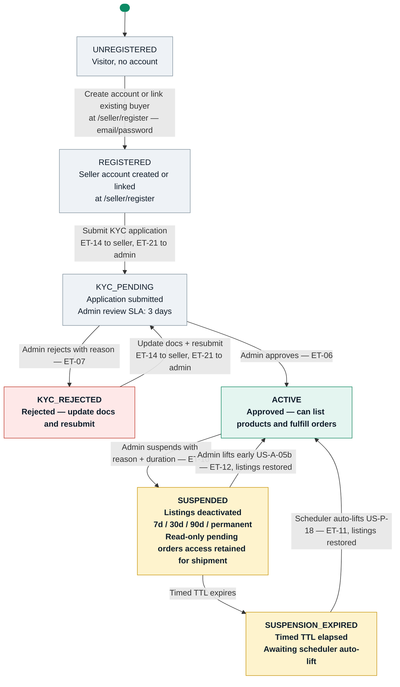

# Seller Account Lifecycle

**References:** US-S-00, US-S-01, US-S-02, US-A-01, US-A-02, US-A-05, US-A-05b, US-P-18  
**Email templates:** ET-06 (KYC approved), ET-07 (KYC rejected), ET-10 (suspended), ET-11 (auto-reinstated), ET-12 (admin reinstated), ET-14 (KYC received — to seller), ET-21 (KYC alert — to admin)  

## Key invariants

- Seller registration at `/seller/register` — no buyer account required; existing buyer accounts can link SELLER role via same form (must authenticate with password; OAuth-only buyers set password first via US-B-15)
- KYC submit fires ET-14 to seller AND ET-21 to admin; ET-21 includes SLA deadline (submitted_at + 72 hours / 3 calendar days); applies to resubmissions too
- Suspension deactivates all listings; seller retains read-only access to PENDING orders for fulfillment only (US-A-05)
- On reinstatement: only listings deactivated by the suspension are restored; independently-removed listings remain REMOVED (US-A-05b)
- Timed suspensions (7/30/90 days) auto-lift via scheduler (US-P-18); listings reactivated automatically + ET-11 to seller
- Permanent suspension requires explicit admin confirmation dialog; no auto-lift path

## Diagram

