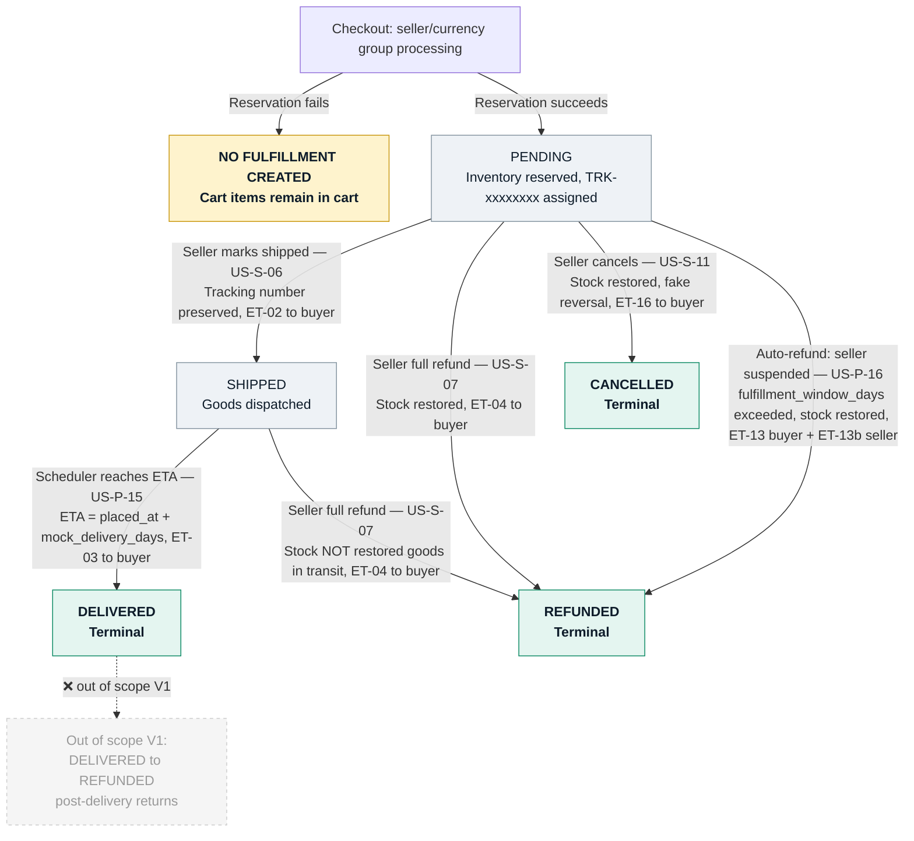

# Fulfillment Lifecycle

**References:** US-S-05, US-S-05b, US-S-06, US-S-07, US-S-11, US-P-15, US-P-16, US-B-09, US-B-12  
**Email templates:** ET-02 (shipped), ET-03 (delivered), ET-04 (refunded), ET-13 (auto-refund — buyer), ET-13b (auto-refund — seller), ET-16 (cancelled by seller)  

## Key invariants

- One Fulfillment = one seller/currency group within an order; created on successful inventory reservation
- Tracking number (TRK-xxxxxxxx) assigned at Fulfillment creation — NOT at shipment; must not generate a second one on SHIPPED transition (US-S-06)
- PENDING refund restores stock; SHIPPED refund does NOT (goods already dispatched) (US-S-07)
- Auto-refund triggers when seller suspended AND fulfillment_window_days exceeded without shipment (US-P-16)
- Cancellation (US-S-11) only valid from PENDING; creates fake payment reversal + restores stock
- Post-delivery returns (DELIVERED → REFUNDED) are out of scope for V1 (BRD §3.2)

## Diagram

