# Admin Moderation Workflows

**References:** US-A-00, US-A-01, US-A-02, US-A-03, US-A-04, US-A-04b, US-A-05, US-A-06, US-S-03, US-S-04, US-S-10  
**Email templates:** ET-06 (KYC approved), ET-07 (KYC rejected), ET-08 (listing flagged — to seller + CC admin), ET-09 (listing removed digest), ET-21 (KYC alert — to admin with SLA deadline)  

## Key invariants

- Admin receives ET-21 (with SLA deadline = submitted_at + 3 business days) when seller submits or resubmits KYC; SLA badge in queue turns red after 3 days (US-A-01)
- All document views are logged for audit (NFR-09, US-A-02)
- ET-08 CC'd to admin on every auto-flag — passive awareness without a dedicated admin action email (US-A-03)
- ET-09 (removal digest) aggregates all same-day removals per seller; Kafka consumer batches by daily time window (US-A-04)
- Listing removal is irreversible; seller may create new compliant listing but cannot reactivate a removed one
- Cleared listings skip the same auto-flag rule unless listing content changes (US-A-04b)
- Pending orders on removed or flagged listings remain active; seller still responsible for fulfillment (US-A-04)

## Diagram

```mermaid
graph TD

subgraph KYC["SECTION 1 - KYC REVIEW QUEUE"]
    KA(["Seller submits KYC application\nET-21 alert fires to admin"])
    KA --> KB["Application enters pending queue\nsorted by submitted_at"]
    KB --> KC{"Pending over 3 days?"}
    KC -->|Yes| KD["SLA badge turns RED"]
    KC -->|No| KE["SLA badge normal"]
    KD --> KF["Admin opens application"]
    KE --> KF
    KF --> KG["View docs inline - PDF / image"]
    KG --> KH[("Doc views logged for audit")]
    KH --> KI{"Admin decision"}
    KI -->|Approve| KJ["Seller status: ACTIVE"]
    KJ --> KK["ET-06 sent - approval email"]
    KI -->|"Reject with reason"| KL["ET-07 sent - rejection email"]
    KL --> KM{"Seller resubmits?"}
    KM -->|Yes| KN["New pending application\nlinked to prior rejection\nPrevious rejection reason shown to seller"]
    KN --> KB
end

subgraph LISTING["SECTION 2 - LISTING MODERATION QUEUE"]
    LA_C(["Seller creates listing"])
    LA_E(["Seller edits listing"])
    LA_C --> LB_C{"Auto-flag check\n(creation)"}
    LB_C -->|"Keyword blocklist hit\nor prohibited category"| LC_REJ["HTTP 422 — submit rejected\nNo listing created"]
    LB_C -->|"No flags"| LD(["Listing goes live normally"])
    LA_E --> LB_E{"Auto-flag check\n(edit save)"}
    LB_E -->|"Keyword blocklist hit\nor prohibited category"| LC["Listing auto-flagged\nhidden from search"]
    LB_E -->|"No flags"| LD
    LC --> LF["ET-08 sent to seller + CC admin\nper flagged listing"]
    LF --> LG["Flagged listing enters moderation queue\nsorted by flagged_at desc"]
    LG --> LH["Admin reviews flagged listing"]
    LH --> LI{"Admin decision"}
    LI -->|"Remove with reason\nprohibited / IP / misleading / other"| LJ["Listing removed from catalog and search"]
    LJ --> LK["Pending orders remain active"]
    LK --> LL["ET-09 sent to seller - daily digest"]
    LI -->|"Clear - false positive"| LM["Listing stays live"]
    LM --> LN["Flag resolved"]
    LN --> LO["Cleared listing skips same rule\nunless content changes"]
end
```

