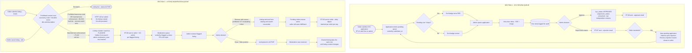

# Admin Moderation Workflows

**References:** US-A-00, US-A-01, US-A-02, US-A-03, US-A-04, US-A-04b, US-A-05, US-A-06, US-S-03, US-S-04, US-S-10  
**Email templates:** ET-06 (KYC approved), ET-07 (KYC rejected), ET-08 (listing flagged — to seller + CC admin), ET-09 (listing removed digest), ET-21 (KYC alert — to admin with SLA deadline)  

## Key invariants

- Admin receives ET-21 (with SLA deadline = `kyc_application.review_due_at` — 3 business days, BRD §12 #14) when seller submits or resubmits KYC; SLA badge in queue turns red once `NOW() > review_due_at` (US-A-01)
- KYC approval sets `seller.seller_profile.kyc_status = 'APPROVED'` only. `suspension_status` is an independent column and is never derived from it — the two are set by different actions (US-P-05, `data-model-erd.md` § `seller.seller_profile`)
- All document views are logged for audit (NFR-09, US-A-02)
- **Prohibited content is two-tier, and the tier comes from the matched blocklist term's stored `enforcement`, not from how precisely the text matched or from create-versus-edit** (FR-P-06c, [BRD § Amendments](../requirements/BRD.md#amendments)). Prohibited taxonomy node or an `enforcement = BLOCK` term → 422 at submit, no listing created and no edit persisted. An `enforcement = FLAG` term → listing created or saved as `FLAGGED` with an `admin.moderation_case` row. The strictest matched tier wins. `match_type` (`SUBSTRING` / `WORD` / `REGEX`) is an independent column — every matching mode exists on both tiers. The seller-facing halves of the two outcomes are in [seller-portal.md § Prohibited-content outcomes on save](../ui-design/seller-portal.md#screen-6-create-edit-product)
- The soft (`FLAG`) tier is the only input to FR-A-03's moderation queue; the hard tier produces no queue item because no listing exists
- ET-08 CC'd to admin on every auto-flag — passive awareness without a dedicated admin action email (US-A-03)
- ET-09 (removal digest) aggregates all same-day removals per seller; Kafka consumer batches by daily time window (US-A-04)
- Listing removal is irreversible; seller may create new compliant listing but cannot reactivate a removed one
- Cleared listings skip the same auto-flag rule unless listing content changes (US-A-04b)
- Pending orders on removed or flagged listings remain active; seller still responsible for fulfillment (US-A-04)

## Diagram

```mermaid
graph TD

subgraph KYC["SECTION 1 - KYC REVIEW QUEUE"]
    KA(["Seller submits KYC application\nET-21 alert fires to admin"])
    KA --> KB["Application enters pending queue\nsorted by submitted_at"]
    KB --> KC{"Pending over 3 days?"}
    KC -->|Yes| KD["SLA badge turns RED"]
    KC -->|No| KE["SLA badge normal"]
    KD --> KF["Admin opens application"]
    KE --> KF
    KF --> KG["View docs inline - PDF / image"]
    KG --> KH[("Doc views logged for audit")]
    KH --> KI{"Admin decision"}
    KI -->|Approve| KJ["kyc_status: APPROVED\nsuspension_status untouched - two independent columns"]
    KJ --> KK["ET-06 sent - approval email"]
    KI -->|"Reject with reason"| KL["ET-07 sent - rejection email"]
    KL --> KM{"Seller resubmits?"}
    KM -->|Yes| KN["New pending application\nlinked to prior rejection\nPrevious rejection reason shown to seller"]
    KN --> KB
end

subgraph LISTING["SECTION 2 - LISTING MODERATION QUEUE"]
    LA_C(["Seller submits listing - create"])
    LA_E(["Seller saves listing - edit"])
    LA_C --> LB{"Prohibited-content scan\ntaxonomy node + blocklist terms\ntitle and description"}
    LA_E --> LB
    LB -->|"No match"| LD(["Listing live - status ACTIVE"])
    LB -->|"Prohibited taxonomy node\nOR matched term enforcement = BLOCK\nhard tier - strictest match wins"| LC_REJ["HTTP 422 at submit\nNo listing created\nNo edit persisted"]
    LB -->|"Matched term enforcement = FLAG\nsoft tier"| LC["Listing created / saved as FLAGGED\nhidden from search\nadmin.moderation_case row inserted"]
    LC --> LF["ET-08 sent to seller + CC admin\nper flagged listing"]
    LF --> LG["Moderation queue\nsorted by flagged_at desc\nFR-A-03 input"]
    LG --> LH["Admin reviews flagged listing"]
    LH --> LI{"Admin decision"}
    LI -->|"Remove with reason\nprohibited / IP / misleading / other"| LJ["Listing removed from catalog and search\nirreversible"]
    LJ --> LK["Pending orders remain active\nseller still owes fulfillment"]
    LK --> LL["ET-09 sent to seller - daily digest\nbatched per seller per day"]
    LI -->|"Clear - false positive"| LM["Listing back to ACTIVE"]
    LM --> LN["Moderation case resolved"]
    LN --> LO["Cleared listing skips the same rule\nuntil listing content changes"]
end
```
