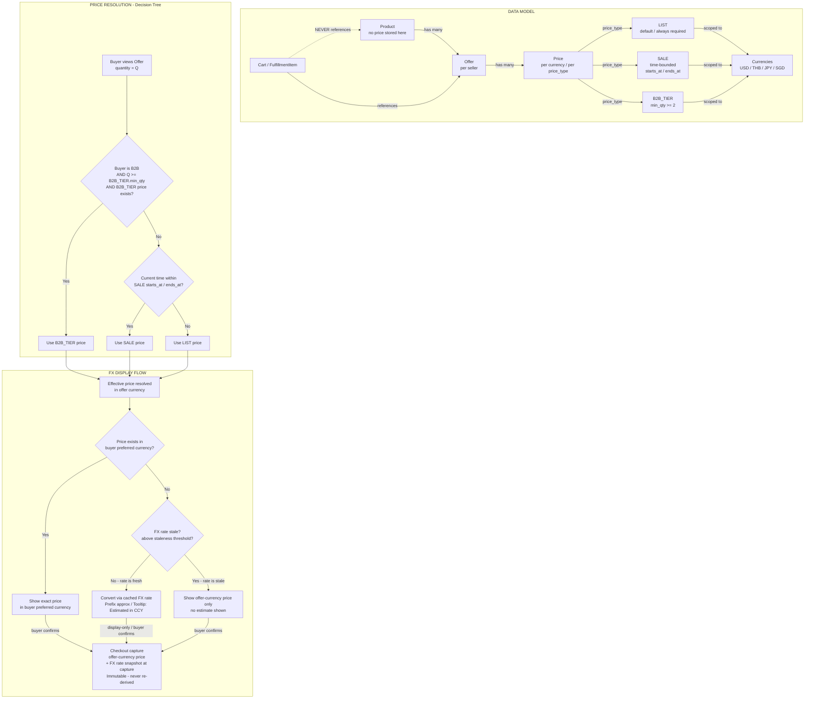

# Pricing Model and Price Resolution

**References:** US-P-01, US-P-02, US-S-03, US-S-04b, US-B-06  

## Key invariants

- Cart and FulfillmentItem reference **Offer**, never Product; price is never stored on Product (FR-P-01)
- Seller pricing currencies: USD, THB, JPY, SGD only (FR-P-06a); buyer display currency may differ — converted via FX, never stored
- Checkout captures offer-currency price + FX rate at capture time; display conversions are ephemeral and never stored (FR-P-03)
- Price priority: B2B_TIER (B2B buyer + qty >= min_qty) beats SALE (within time window) beats LIST
- SALE must have starts_at < ends_at; system auto-reverts to LIST after ends_at; overlapping SALE periods for same currency rejected
- At most one active LIST price per offer per currency; second LIST in same currency rejected with explicit error
- FX stale: show offer-currency price only, no estimate — prevents misleading display conversions

## Diagram

