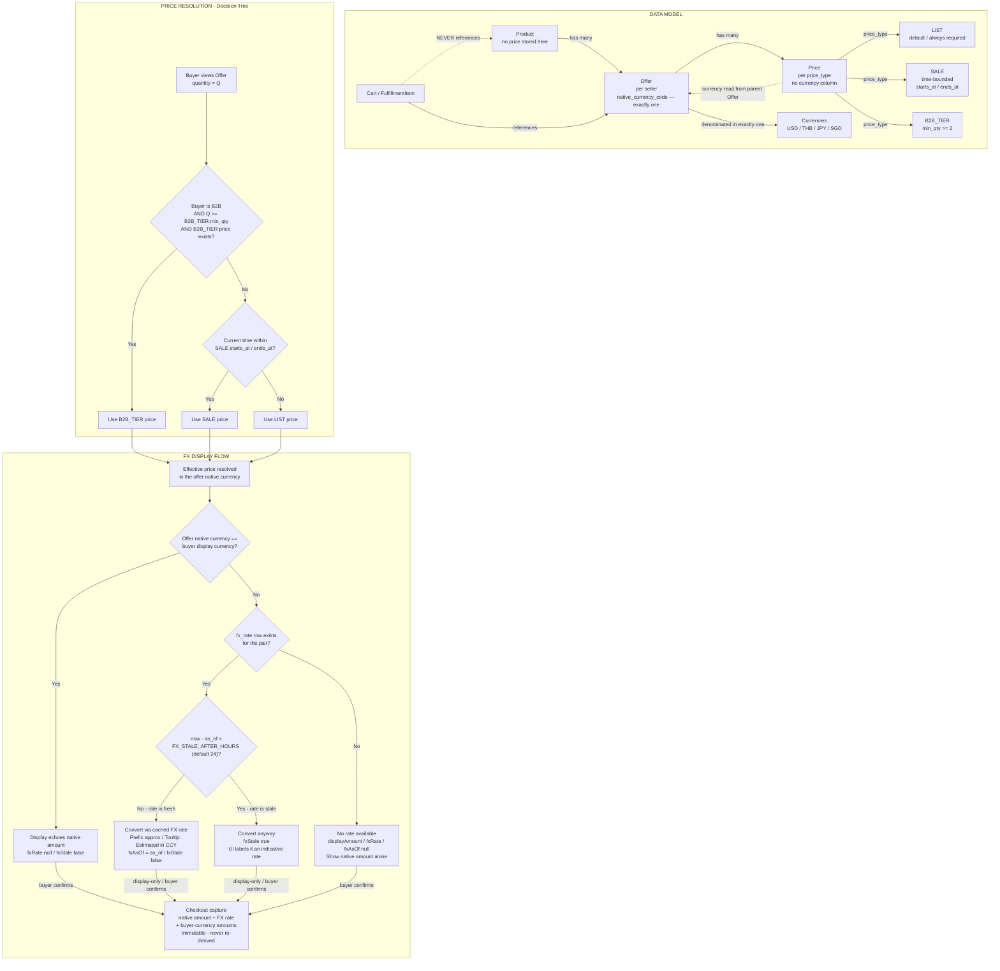

# Pricing Model and Price Resolution

**References:** US-P-01, US-P-02, US-S-03, US-S-04b, US-B-06  

## Key invariants

- Cart and FulfillmentItem reference **Offer**, never Product; price is never stored on Product (FR-P-01)
- **One pricing currency per offer**, held on the offer as `catalog.offer.native_currency_code`. `pricing.offer_price` has **no currency column** — every price row inherits the parent offer's currency. Selling the same product in a second currency means a second offer
- Seller pricing currencies: USD, THB, JPY, SGD only (FR-P-06a); buyer display currency may differ — converted server-side via FX for display, never stored on the offer
- Checkout captures the offer-currency price, the FX rate used, and the resulting buyer-currency amounts at capture time; browse-time display conversions are ephemeral and never stored (FR-P-03)
- Price priority: B2B_TIER (B2B buyer + qty >= min_qty) beats SALE (within time window) beats LIST
- SALE must have starts_at < ends_at; system auto-reverts to LIST after ends_at; overlapping SALE periods on the same offer rejected
- At most one active LIST price per offer; a second one is rejected with an explicit error. Currency is not part of this key, because the offer has only one
- FX stale (`now() - as_of > FX_STALE_AFTER_HOURS`, env, whole hours, default `24`): the converted amount is **still returned**, flagged `fxStale: true`, and the UI labels it an indicative rate. The conversion is omitted only when the currency pair has no FX row at all

## Diagram

```mermaid
graph TD
    subgraph DM["DATA MODEL"]
        PRODUCT["Product\nno price stored here"]
        OFFER["Offer\nper seller\nnative_currency_code — exactly one"]
        PRICE["Price\nper price_type\nno currency column"]
        PT_LIST["LIST\ndefault / always required"]
        PT_SALE["SALE\ntime-bounded\nstarts_at / ends_at"]
        PT_B2B["B2B_TIER\nmin_qty >= 2"]
        CCY["Currencies\nUSD / THB / JPY / SGD"]
        CART["Cart / FulfillmentItem"]
        PRODUCT -->|"has many"| OFFER
        OFFER -->|"has many"| PRICE
        OFFER -->|"denominated in exactly one"| CCY
        PRICE -->|"price_type"| PT_LIST
        PRICE -->|"price_type"| PT_SALE
        PRICE -->|"price_type"| PT_B2B
        PRICE -. "currency read from parent Offer" .-> OFFER
        CART -->|"references"| OFFER
        CART -. "NEVER references" .-> PRODUCT
    end

    subgraph PR["PRICE RESOLUTION - Decision Tree"]
        BV["Buyer views Offer\nquantity = Q"]
        B2B_Q{"Buyer is B2B\nAND Q >= B2B_TIER.min_qty\nAND B2B_TIER price exists?"}
        SALE_T{"Current time within\nSALE starts_at / ends_at?"}
        EP_B2B["Use B2B_TIER price"]
        EP_SALE["Use SALE price"]
        EP_LIST["Use LIST price"]
        BV --> B2B_Q
        B2B_Q -->|"Yes"| EP_B2B
        B2B_Q -->|"No"| SALE_T
        SALE_T -->|"Yes"| EP_SALE
        SALE_T -->|"No"| EP_LIST
    end

    subgraph FX["FX DISPLAY FLOW"]
        EFF["Effective price resolved\nin the offer native currency"]
        CCY_Q{"Offer native currency ==\nbuyer display currency?"}
        ROW_Q{"fx_rate row exists\nfor the pair?"}
        STALE_Q{"now - as_of >\nFX_STALE_AFTER_HOURS (default 24)?"}
        EXACT["Display echoes native amount\nfxRate null / fxStale false"]
        APPROX["Convert via cached FX rate\nPrefix approx / Tooltip: Estimated in CCY\nfxAsOf = as_of / fxStale false"]
        INDICATIVE["Convert anyway\nfxStale true\nUI labels it an indicative rate"]
        OFFER_ONLY["No rate available\ndisplayAmount / fxRate / fxAsOf null\nShow native amount alone"]
        CHECKOUT["Checkout capture\nnative amount + FX rate\n+ buyer-currency amounts\nImmutable - never re-derived"]
        EFF --> CCY_Q
        CCY_Q -->|"Yes"| EXACT
        CCY_Q -->|"No"| ROW_Q
        ROW_Q -->|"No"| OFFER_ONLY
        ROW_Q -->|"Yes"| STALE_Q
        STALE_Q -->|"No - rate is fresh"| APPROX
        STALE_Q -->|"Yes - rate is stale"| INDICATIVE
        EXACT -->|"buyer confirms"| CHECKOUT
        APPROX -->|"display-only / buyer confirms"| CHECKOUT
        INDICATIVE -->|"display-only / buyer confirms"| CHECKOUT
        OFFER_ONLY -->|"buyer confirms"| CHECKOUT
    end

    EP_B2B --> EFF
    EP_SALE --> EFF
    EP_LIST --> EFF
```
