# Authentication Portals

**References:** US-B-00, US-B-01, US-B-15, US-S-01, US-A-00b  
**Email templates:** ET-18 (email verification — buyer), ET-21 (KYC alert — to admin)  

## Key invariants

- Three separate portals: buyer (`/login`, `/register`), seller (`/seller/login`, `/seller/register`), admin (`/admin/login` — no self-registration)
- OAuth (Google/Facebook) available on buyer portal only; seller and admin portals are email/password exclusively
- One account may hold BUYER + SELLER roles, accessed via respective portals independently; ADMIN is never co-held
- Seller `/seller/register`: new email creates new account; existing buyer email requires password auth to link SELLER role; OAuth-only buyer must set local password first (US-B-15)
- Admin accounts seeded directly in database (`admin@aliceut.dev`, hashed password in DB); no registration path exists in the UI
- All three portals issue the same JWT format (`sub`, `roles`, `email_verified`); refresh token rotation applies to all sessions

## Diagram

```mermaid
graph TD

subgraph BUYER_P["BUYER PORTAL — /login · /register"]
    BP1(["Visitor"]) --> BP2{"Register or Login?"}
    BP2 -->|"Register email/password"| BP3["Create account\nFull name + email + password"]
    BP2 -->|"Register OAuth\nGoogle or Facebook"| BP4["Account created\nPre-verified"]
    BP2 -->|"Login"| BP5["Email/Password OR OAuth"]
    BP3 --> BP6["ET-18 Verification email\nCan browse, cannot place orders until verified"]
    BP6 -->|"Email verified"| BP7["Session: BUYER role\nBuyer home"]
    BP4 --> BP7
    BP5 --> BP7
end

subgraph SELLER_P["SELLER PORTAL — /seller/login · /seller/register"]
    SP0(["Prospective Seller"]) --> SP1{"Account?"}
    SP1 -->|"No account — create new"| SP2["Email/Password + Full name\nNo OAuth on seller portal"]
    SP1 -->|"Existing buyer account\nhas local password"| SP3["Authenticate with password\nSELLER role linked to account"]
    SP1 -->|"Existing buyer account\nOAuth-only — no local password"| SP4["Set password first via\nBuyer Account Settings\nUS-B-15"]
    SP4 --> SP3
    SP2 --> SP5["KYC documents form"]
    SP3 --> SP5
    SP5 --> SP6["Submit KYC\nET-14 to seller · ET-21 to admin"]
    SP6 --> SP7["KYC_PENDING — awaiting admin review"]
    SP_L(["Login"]) --> SP_LF["Email/Password only\nNo OAuth buttons"]
    SP_LF --> SP_S["Session: SELLER role\nSeller dashboard"]
end

subgraph ADMIN_P["ADMIN PORTAL — /admin/login  (no self-registration)"]
    AP1["Account seeded in database\nadmin@aliceut.dev\nHashed password in DB"] --> AP2
    AP2(["Login"]) --> AP3["Email/Password only\nNo OAuth buttons"]
    AP3 --> AP4["Session: ADMIN role\nAdmin dashboard\nHTTP 403 for non-ADMIN tokens on /admin/*"]
end

subgraph DUAL_P["DUAL-ROLE ACCOUNTS"]
    D1["One account may hold BUYER + SELLER roles\nLog in via respective portals independently\nADMIN role is never co-held with other roles"]
end

classDef sessionNode fill:#E4F5F0,stroke:#0C8A64,color:#0E1C2A,font-weight:600
classDef warningNode fill:#FEE8E8,stroke:#C0392B,color:#0E1C2A
classDef infoNode fill:#FEF3CD,stroke:#C8960C,color:#0E1C2A

class BP7,SP_S,AP4 sessionNode
class SP4 warningNode
class D1 infoNode
```

