# Admin API — Administration

**Module:** `Admin`  
**Parent:** [API Design Index](../api-design.md)  
**Source of truth:** [BRD v1.1](../../requirements/BRD.md), [ERD](../data-model-erd.md)

> **Auth note:** Routes under `/admin/*` return `HTTP 403` for both unauthenticated requests (no/invalid token) and unauthorized requests (valid token but not ADMIN role), to avoid leaking the existence of admin-only routes.

---

## Summary

- [Endpoint Index](#endpoint-index)
- [DB Mapping](#db-mapping)
- [Endpoints](#endpoints)

<a id="endpoint-index"></a>
## Endpoint Index

> All `/admin/*` endpoints return `403` for both unauthenticated (missing/invalid token) and unauthorized (valid token, role ≠ ADMIN) requests.

| Group | Method | Path | Auth | Description |
|-------|--------|------|------|-------------|
| KYC | `GET` | [`/admin/kyc`](#list-kyc-applications) | ADMIN | List KYC applications (offset-paginated) |
| KYC | `GET` | [`/admin/kyc/:id`](#get-kyc-application-detail) | ADMIN | KYC detail — view logged to MongoDB |
| KYC | `POST` | [`/admin/kyc/:id/decide`](#decide-kyc-application) | ADMIN | Approve or reject KYC — decision logged to MongoDB |
| Sellers | `GET` | [`/admin/sellers`](#list-sellers) | ADMIN | List all sellers |
| Sellers | `GET` | [`/admin/sellers/:id`](#get-seller-detail-admin) | ADMIN | Seller detail |
| Sellers | `POST` | [`/admin/sellers/:id/suspend`](#suspend-seller) | ADMIN | Suspend seller — logged to MongoDB |
| Sellers | `POST` | [`/admin/sellers/:id/reinstate`](#reinstate-seller) | ADMIN | Reinstate suspended seller |
| Moderation | `GET` | [`/admin/moderation`](#list-moderation-queue) | ADMIN | List moderation queue |
| Moderation | `GET` | [`/admin/moderation/:id`](#get-moderation-case) | ADMIN | Moderation case detail |
| Moderation | `POST` | [`/admin/moderation/:id/decide`](#decide-moderation-case) | ADMIN | REMOVE or DISMISS listing |
| Moderation | `POST` | [`/admin/moderation`](#create-moderation-case-manual-flag) | ADMIN | Manually flag a listing |
| Stats | `GET` | [`/admin/dashboard/stats`](#admin-dashboard-stats) | ADMIN | Dashboard counts |

---

<a id="db-mapping"></a>
## DB Mapping

| Endpoint | Primary DB | Tables / Notes |
|----------|-----------|----------------|
| `GET /admin/kyc` | Postgres | `seller.kyc_application`, `seller.seller_profile` |
| `GET /admin/kyc/:id` | Postgres + **MongoDB** | `seller.kyc_application` (read); document view logged to `audit_logs` collection |
| `POST /admin/kyc/:id/decide` | Postgres + **MongoDB** | `seller.kyc_application`, `seller.seller_profile`, `platform.outbox_event` (`seller.kyc.decided`); decision logged to `audit_logs` |
| `GET /admin/sellers` | Postgres | `seller.seller_profile`, `identity.user`, `catalog.offer` (counts) |
| `GET /admin/sellers/:id` | Postgres | `seller.seller_profile`, `identity.user` |
| `POST /admin/sellers/:id/suspend` | Postgres + **MongoDB** | `seller.seller_profile`, `catalog.offer` (deactivate), `platform.outbox_event` (`seller.suspended`); logged to `audit_logs` |
| `POST /admin/sellers/:id/reinstate` | Postgres | `seller.seller_profile`, `catalog.offer` (re-enable), `platform.outbox_event` (`seller.reinstated`) |
| `GET /admin/moderation` | Postgres | `admin.moderation_case`, `catalog.offer` |
| `GET /admin/moderation/:id` | Postgres | `admin.moderation_case` |
| `POST /admin/moderation/:id/decide` | Postgres | `admin.moderation_case`, `catalog.offer` (status → REMOVED), `platform.outbox_event` (`moderation.listing.removed`); ES deindex async via consumer |
| `POST /admin/moderation` | Postgres | `admin.moderation_case` (manual flag insert) |
| `GET /admin/dashboard/stats` | Postgres | `seller.kyc_application`, `admin.moderation_case`, `seller.seller_profile` (counts) |

---

<a id="endpoints"></a>
## Endpoints

### List KYC applications

```
GET /admin/kyc
Tag: Admin
Auth: ADMIN
Pagination: offset
```
**Query params:** `status` (`PENDING | APPROVED | REJECTED`), `country` (ISO 3166-1 alpha-2 filter), `limit`, `offset`  
**Response 200**
```json
{
  "data": [{
    "id": "uuid",
    "sellerId": "uuid",
    "businessName": "string",
    "country": "string (ISO 3166-1)",
    "status": "PENDING",
    "submittedAt": "ISO8601"
  }],
  "meta": { "total": 15, "limit": 20, "offset": 0 }
}
```

#### Sequence

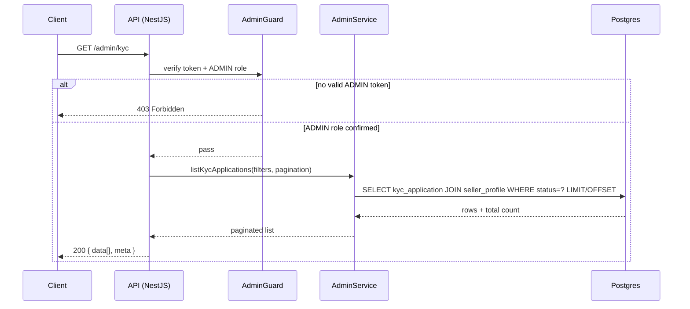

---

### Get KYC application detail

```
GET /admin/kyc/:applicationId
Tag: Admin
Auth: ADMIN
```
**Response 200**
```json
{
  "data": {
    "id": "uuid",
    "seller": { "id": "uuid", "businessName": "string", "taxId": "REDACTED_UNLESS_ADMIN" },
    "submittedData": {},
    "documentUrls": ["signed-url (short TTL)"],
    "status": "PENDING",
    "submittedAt": "ISO8601"
  }
}
```
Document view logged to MongoDB `audit_logs`.

#### Sequence

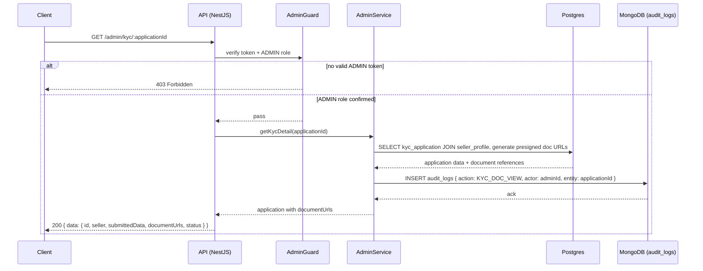

---

### Decide KYC application

```
POST /admin/kyc/:applicationId/decide
Tag: Admin
Auth: ADMIN
```
**Request body**
```json
{ "decision": "APPROVED | REJECTED", "reason": "string (required if REJECTED)" }
```
**Response 200** `{ "data": { "status": "APPROVED | REJECTED" } }`  
Side effects: `seller.kyc.decided` event, `SellerProfile.kyc_status` updated  
**Errors:** 409 already decided

#### Sequence

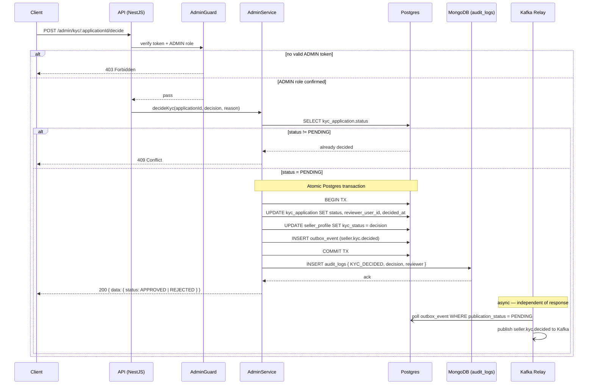

---

### List sellers

```
GET /admin/sellers
Tag: Admin
Auth: ADMIN
Pagination: offset
```
**Query params:** `kycStatus` (`PENDING_KYC | APPROVED | REJECTED`), `suspensionStatus` (`ACTIVE | SUSPENDED`), `q` (free-text search across `business_name`, `email`, `tax_id`), `limit`, `offset`  
**Response 200**
```json
{
  "data": [{
    "id": "uuid",
    "businessName": "string",
    "email": "string",
    "country": "string (ISO 3166-1)",
    "kycStatus": "APPROVED",
    "suspensionStatus": "ACTIVE",
    "activeListingsCount": 0,
    "removedListingsCount": 0,
    "submittedAt": "ISO8601"
  }],
  "meta": { "total": 42, "limit": 20, "offset": 0 }
}
```

#### Sequence

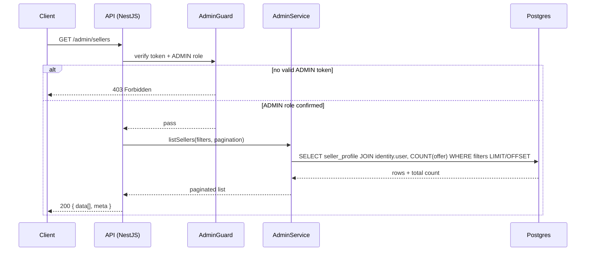

---

### Get seller detail (admin)

```
GET /admin/sellers/:sellerId
Tag: Admin
Auth: ADMIN
```
**Response 200**
```json
{
  "data": {
    "id": "uuid",
    "businessName": "string",
    "taxId": "string",
    "email": "string",
    "country": "string (ISO 3166-1)",
    "kycStatus": "APPROVED",
    "suspensionStatus": "ACTIVE",
    "rejectionReason": "string | null",
    "submittedData": {},
    "activeListingsCount": 0,
    "removedListingsCount": 0,
    "createdAt": "ISO8601"
  }
}
```
**Errors:** 404

#### Sequence

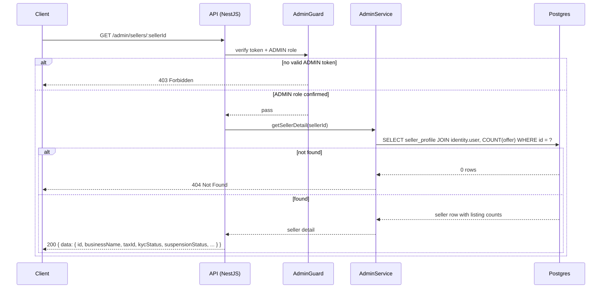

---

### Suspend seller

```
POST /admin/sellers/:sellerId/suspend
Tag: Admin
Auth: ADMIN
```
**Request body**
```json
{
  "reason": "string",
  "durationDays": "number | null (null = permanent; valid values: 7, 30, 90, null)"
}
```
**Response 200** `{ "data": { "status": "SUSPENDED" } }`  
Side effects: `seller.suspended` event; moderation logged to MongoDB `audit_logs`  
**Errors:** 409 already suspended, 422 invalid `durationDays` value

#### Sequence

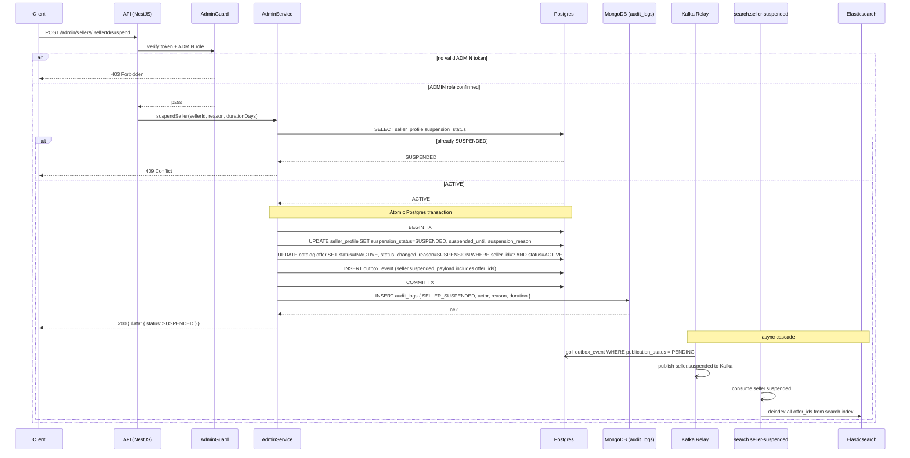

---

### Reinstate seller

```
POST /admin/sellers/:sellerId/reinstate
Tag: Admin
Auth: ADMIN
```
**Response 200** `{ "data": { "suspensionStatus": "ACTIVE" } }`  
Side effects: `seller.reinstated` Kafka event emitted; search consumer re-enables seller's active offers in Elasticsearch  
**Errors:** 409 seller not currently suspended

#### Sequence

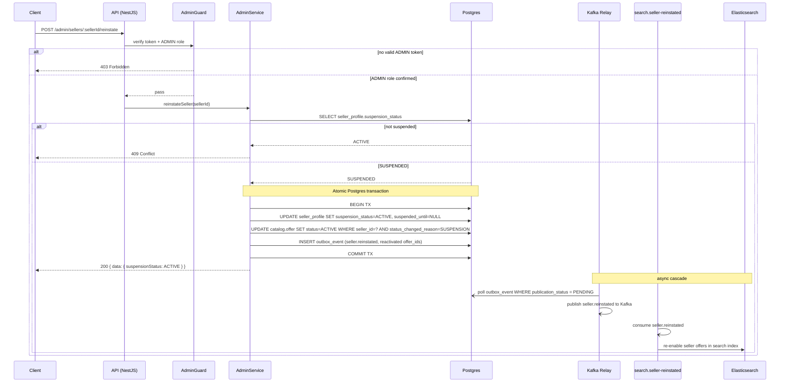

---

### List moderation queue

```
GET /admin/moderation
Tag: Admin
Auth: ADMIN
Pagination: offset
```
**Query params:** `status` (`OPEN | RESOLVED | DISMISSED`), `limit`, `offset`  
**Response 200**
```json
{
  "data": [{
    "id": "uuid",
    "offerId": "uuid",
    "productTitle": "string",
    "sellerName": "string",
    "reason": "string",
    "source": "AUTOMATED | MANUAL",
    "status": "OPEN",
    "createdAt": "ISO8601"
  }],
  "meta": { "total": 3, "limit": 20, "offset": 0 }
}
```

#### Sequence

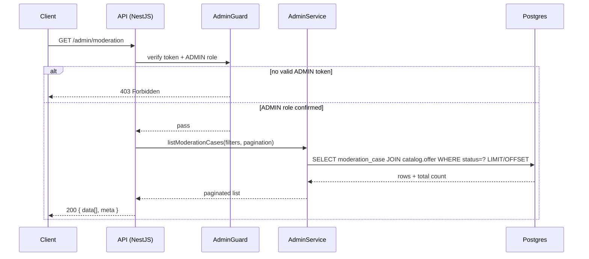

---

### Get moderation case

```
GET /admin/moderation/:caseId
Tag: Admin
Auth: ADMIN
```

#### Sequence

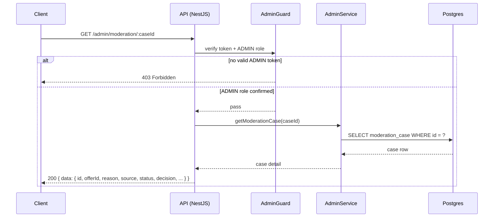

---

### Decide moderation case

```
POST /admin/moderation/:caseId/decide
Tag: Admin
Auth: ADMIN
```
**Request body** `{ "decision": "REMOVE | DISMISS", "reason": "string" }`  
**Response 200**  
Side effects: if `REMOVE` → `offer.status = REMOVED`, `moderation.listing.removed` Kafka event emitted; Elasticsearch deindex happens **async** via `search.listing-removed` consumer  
**Errors:** 409 already decided

#### Sequence

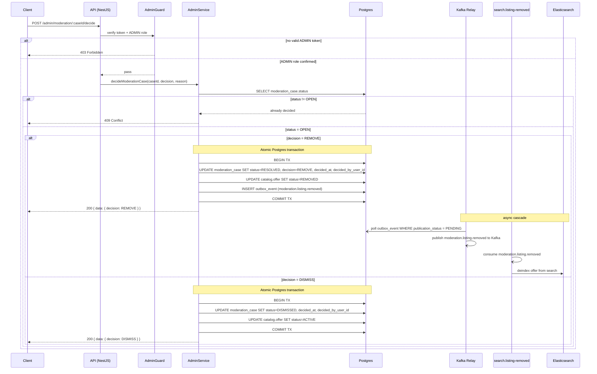

---

### Create moderation case (manual flag)

```
POST /admin/moderation
Tag: Admin
Auth: ADMIN
```
**Request body** `{ "offerId": "uuid", "reason": "string", "source": "MANUAL" }`  
**Response 201**

#### Sequence

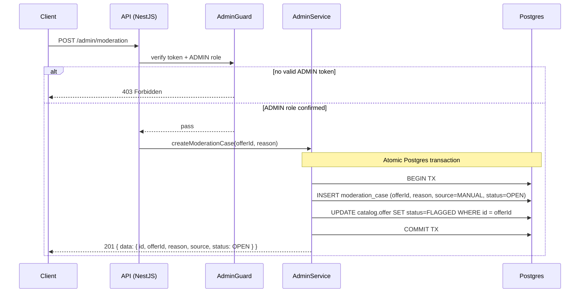

---

### Admin dashboard stats

```
GET /admin/dashboard/stats
Tag: Admin
Auth: ADMIN
```
**Response 200**
```json
{
  "data": {
    "pendingKyc": 0,
    "flaggedListings": 0,
    "activeSuspensions": 0,
    "openModerationCases": 0
  }
}
```

#### Sequence

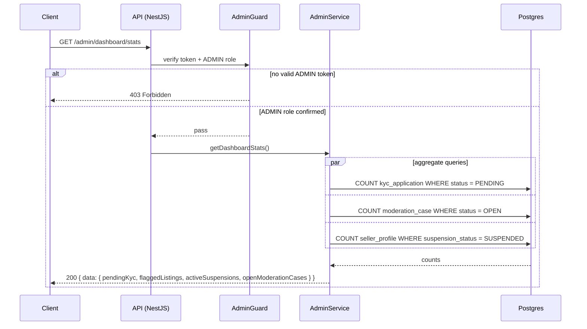
