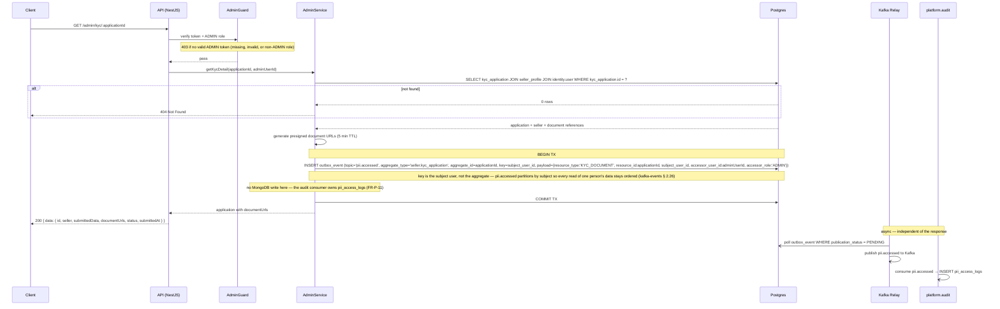
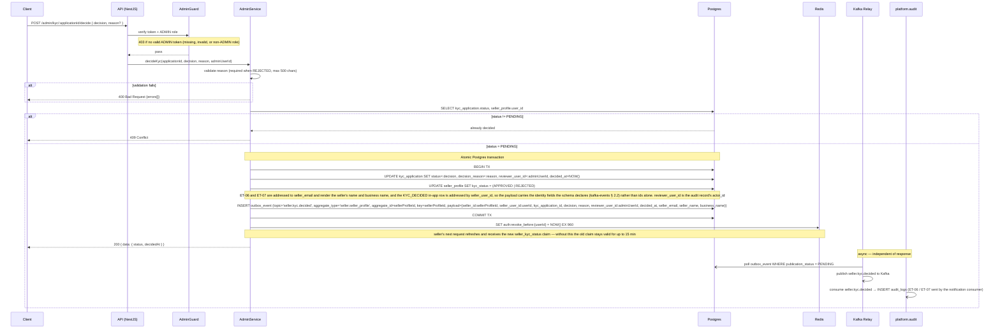
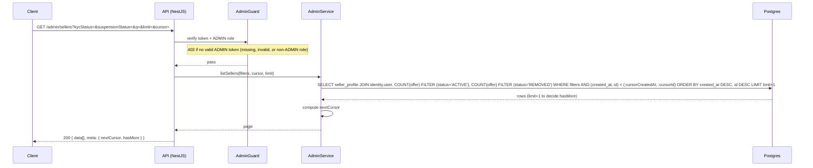
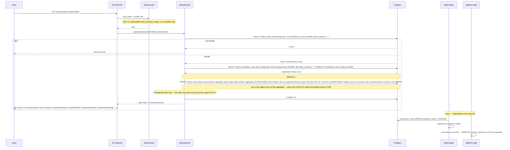
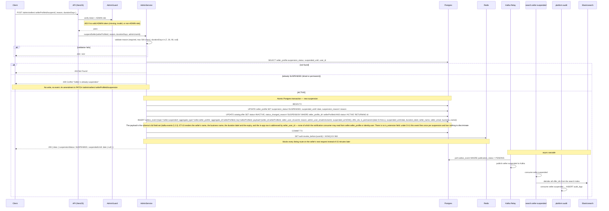
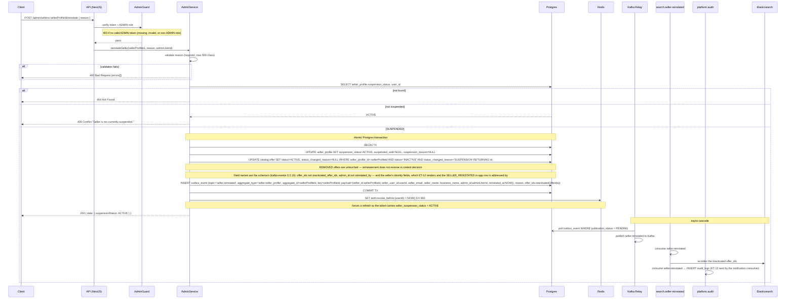
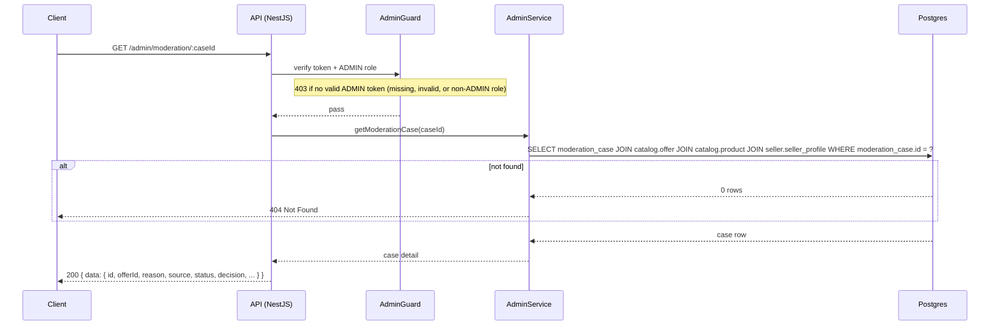
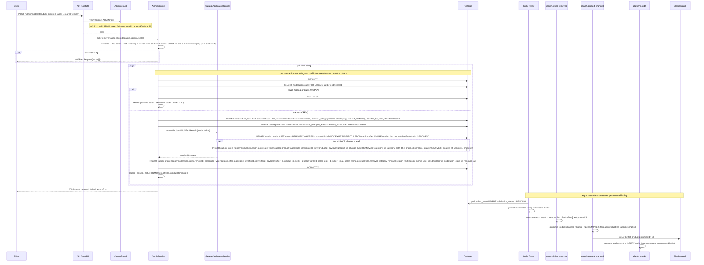
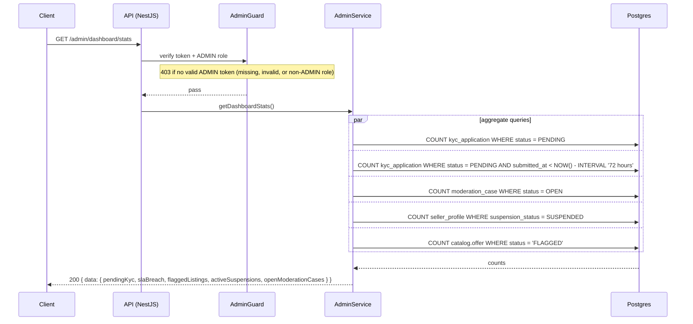

# Admin API — Administration

**Module:** `Admin`  
**Parent:** [API Design Index](../api-design.md)  
**Source of truth:** [BRD v1.2](../../requirements/BRD.md), [ERD](../data-model-erd.md)

> **Auth note:** Routes under `/admin/*` return `HTTP 403` for both unauthenticated requests (no/invalid token) and unauthorized requests (valid token but not ADMIN role), to avoid leaking the existence of admin-only routes.

> **Conventions:** every endpoint accepts an `X-Correlation-ID` request header, generates a UUIDv7 when it is absent, echoes it on the response, and carries the same value into every log line and into the `correlation_id` of every `platform.outbox_event` row and Kafka envelope it writes — see [observability.md § Correlation ID Propagation](../../../conventions/observability.md#correlation-id). Error bodies use the envelope and code table in [api-conventions.md § Standard Error Shape](../../../conventions/api-conventions.md#standard-error-shape). Every list endpoint uses the cursor envelope of [api-conventions.md § Pagination](../../../conventions/api-conventions.md#pagination) — `cursor` + `limit` (default 20, max 100), `meta: { nextCursor, hasMore }`, and **no `total`**.

> **Audit records are written by consumers, never by a handler.** No endpoint in this document writes to MongoDB. Every auditable action writes a `platform.outbox_event` row inside the same Postgres transaction as the domain change; the `platform.audit` consumer group reads the event and writes the `audit_logs` document (FR-P-11, [data-model-mongodb.md](../data-model-mongodb.md)). A handler that wrote MongoDB directly would put a second store on the request's success path and would bypass the outbox, so a rolled-back transaction could still leave an audit record claiming the action happened. The consumer masks every payload key matching `DEFAULT_SENSITIVE_KEYS` — `tax_id` among them — before insert. That masking rule governs the `audit_logs` write, whose payloads can carry a sensitive key; the `pii.accessed` payloads behind `pii_access_logs` carry no tax ID and no document content in the first place, so on that topic there is nothing to mask rather than something masked. A reader who expects a masked field in a `pii_access_logs` document will not find one.

> **Outbox rows.** Every `INSERT outbox_event` below populates `aggregate_type`, `aggregate_id`, `topic`, `key` (= `aggregate_id`), `event_type`, `event_version`, `payload`, `correlation_id`, `occurred_at`, `created_at`, `updated_at` and `publication_status='PENDING'`, in the same transaction as the domain change. The sequences abbreviate the argument list for legibility; the full column set is never optional. `pii.accessed` is the one exception to `key` — it partitions by `subject_user_id`, per [kafka-events.md § 2.26](../kafka-events.md#226-piiaccessed).

> **Idempotency.** Every mutating endpoint in this document accepts an optional `Idempotency-Key` header with the semantics defined in [api-conventions.md § Idempotency](../../../conventions/api-conventions.md#idempotency): the same key with the same body replays, and the same key with a **different** body is `409`. A replay returns the **current state** of the resource the key transitioned, re-read at replay time — no idempotency row stores a response body, so a replay can legitimately report a later state than the original call did. Keys are stored in `orders.idempotency_key`, keyed `(actor_user_id, key)` against the admin's own user id — one table serves buyer, seller and admin mutations ([`data-model-erd.md`](../data-model-erd.md#table-orders-idempotency-key)). The header is a retry safeguard rather than the primary protection: every mutation here is also guarded by the state it transitions from, so a genuine double-submit without a key still cannot apply twice — it returns `409 already decided`, `409 already suspended`, or a per-row no-op on a bulk remove.

---

## Summary

- [Endpoint Index](#endpoint-index)
- [DB Mapping](#db-mapping)
- [Endpoints](#endpoints)

<a id="endpoint-index"></a>
## Endpoint Index

> All `/admin/*` endpoints return `403` for both unauthenticated (missing/invalid token) and unauthorized (valid token, role ≠ ADMIN) requests.

| Group | Method | Path | Auth | Description |
|-------|--------|------|------|-------------|
| KYC | `GET` | [`/admin/kyc`](#list-kyc-applications) | ADMIN | List KYC applications (cursor-paginated) |
| KYC | `GET` | [`/admin/kyc/:applicationId`](#get-kyc-application-detail) | ADMIN | KYC detail — document read emits `pii.accessed` |
| KYC | `POST` | [`/admin/kyc/:applicationId/decide`](#decide-kyc-application) | ADMIN | Approve or reject KYC |
| Sellers | `GET` | [`/admin/sellers`](#list-sellers) | ADMIN | List all sellers |
| Sellers | `GET` | [`/admin/sellers/:sellerProfileId`](#get-seller-detail-admin) | ADMIN | Seller detail with moderation history — tax-ID read emits `pii.accessed` |
| Sellers | `POST` | [`/admin/sellers/:sellerProfileId/suspend`](#suspend-seller) | ADMIN | Suspend a seller — `409` if one is already in force |
| Sellers | `PATCH` | [`/admin/sellers/:sellerProfileId/suspension`](#amend-suspension) | ADMIN | Amend an active suspension's end date or reason |
| Sellers | `POST` | [`/admin/sellers/:sellerProfileId/reinstate`](#reinstate-seller) | ADMIN | Reinstate suspended seller |
| Moderation | `GET` | [`/admin/moderation`](#list-moderation-queue) | ADMIN | List moderation queue |
| Moderation | `GET` | [`/admin/moderation/:caseId`](#get-moderation-case) | ADMIN | Moderation case detail |
| Moderation | `POST` | [`/admin/moderation/:caseId/decide`](#decide-moderation-case) | ADMIN | REMOVE or DISMISS one listing |
| Moderation | `POST` | [`/admin/moderation/bulk-remove`](#bulk-remove-listings) | ADMIN | REMOVE several listings in one action |
| Moderation | `POST` | [`/admin/moderation`](#create-moderation-case-manual-flag) | ADMIN | Manually flag a listing |
| Blocklist | `GET` | [`/admin/keyword-blocklist`](#list-keyword-blocklist) | ADMIN | List blocklist terms |
| Blocklist | `POST` | [`/admin/keyword-blocklist`](#create-keyword-blocklist-term) | ADMIN | Add a blocklist term |
| Blocklist | `PATCH` | [`/admin/keyword-blocklist/:termId`](#update-keyword-blocklist-term) | ADMIN | Edit a blocklist term |
| Blocklist | `DELETE` | [`/admin/keyword-blocklist/:termId`](#deactivate-keyword-blocklist-term) | ADMIN | Deactivate a blocklist term |
| Stats | `GET` | [`/admin/dashboard/stats`](#admin-dashboard-stats) | ADMIN | Dashboard counts |

**Immediate status enforcement.** Four admin actions change a claim embedded in a live access token — KYC approve, KYC reject, suspend, and reinstate. Each writes `auth:revoke_before:{userId}` in Redis inside its handler, so the seller's next request fails `JwtAuthGuard`, refreshes, and receives a token carrying the new `seller_kyc_status` / `seller_suspension_status`. Without that write a suspended seller keeps listing for up to fifteen minutes ([auth-jwt-design § 10.2](../../../conventions/auth-jwt-design.md#token-revocation)).

**Reason lengths.** Every reason field on every endpoint here is capped at **500 characters** (US-A-02, US-A-04, US-A-04b, US-A-05, US-A-05b). Mandatory where the story says mandatory; the table on each endpoint says which.

---

<a id="db-mapping"></a>
## DB Mapping

| Endpoint | Primary DB | Tables / Notes |
|----------|-----------|----------------|
| `GET /admin/kyc` | Postgres | `seller.kyc_application`, `seller.seller_profile` |
| `GET /admin/kyc/:applicationId` | Postgres | `seller.kyc_application` (read), `platform.outbox_event` (`pii.accessed`) |
| `POST /admin/kyc/:applicationId/decide` | Postgres + **Redis** | `seller.kyc_application`, `seller.seller_profile`, `platform.outbox_event` (`seller.kyc.decided`); `auth:revoke_before:{userId}` |
| `GET /admin/sellers` | Postgres | `seller.seller_profile`, `identity.user`, `catalog.offer` (counts) |
| `GET /admin/sellers/:sellerProfileId` | Postgres | `seller.seller_profile`, `identity.user`, `catalog.offer`, `admin.moderation_case` (history), `platform.outbox_event` (`pii.accessed`, `SELLER_TAX_ID`) |
| `POST /admin/sellers/:sellerProfileId/suspend` | Postgres + **Redis** | `seller.seller_profile`, `catalog.offer` (deactivate), `platform.outbox_event` (`seller.suspended`); `auth:revoke_before:{userId}` |
| `PATCH /admin/sellers/:sellerProfileId/suspension` | Postgres | `seller.seller_profile` (`suspended_until`, `suspension_reason`), `platform.outbox_event` (`seller.suspension_amended`). No `catalog.offer` write and no Redis key — the seller stays suspended |
| `POST /admin/sellers/:sellerProfileId/reinstate` | Postgres + **Redis** | `seller.seller_profile`, `catalog.offer` (re-enable), `platform.outbox_event` (`seller.reinstated`); `auth:revoke_before:{userId}` |
| `GET /admin/moderation` | Postgres | `admin.moderation_case`, `catalog.offer`, `catalog.product`, `seller.seller_profile` |
| `GET /admin/moderation/:caseId` | Postgres | `admin.moderation_case` |
| `POST /admin/moderation/:caseId/decide` | Postgres | `admin.moderation_case`, `catalog.offer` (status → `REMOVED` on REMOVE, `ACTIVE` on DISMISS), `CatalogApplicationService.removeProductIfNoOffersRemain` (`catalog.product` status → `REMOVED` when every offer is removed, + `product.changed`), `platform.outbox_event` (`moderation.listing.removed` on REMOVE); on DISMISS `CatalogApplicationService.republishOffer` writes the `offer.changed` row |
| `POST /admin/moderation/bulk-remove` | Postgres | Same tables and the same application-service call as the single decide, one case and one `moderation.listing.removed` per listing, plus one `product.changed` per product the cascade emptied |
| `POST /admin/moderation` | Postgres | `admin.moderation_case` (manual flag insert), `catalog.offer` (status → `FLAGGED`), `platform.outbox_event` (`listing.flagged`); `CatalogApplicationService.republishOffer` writes the `offer.changed` row |
| `GET`/`POST`/`PATCH`/`DELETE /admin/keyword-blocklist*` | Postgres | `admin.keyword_blocklist`, `platform.outbox_event` (audited mutation) |
| `GET /admin/dashboard/stats` | Postgres | `seller.kyc_application`, `admin.moderation_case`, `seller.seller_profile`, `catalog.offer` (counts) |

Elasticsearch is never written by a handler here. Every de-index and re-index is performed by a `search.*` consumer reading the events above (FR-P-10).

---

<a id="endpoints"></a>
## Endpoints

### List KYC applications

```
GET /admin/kyc
Tag: Admin
Auth: ADMIN
Pagination: cursor
```
**Query params:** `status` (`PENDING | UNDER_REVIEW | APPROVED | REJECTED`), `country` (ISO 3166-1 alpha-2), `sortDir` (`asc | desc`, default `asc`), `limit`, `cursor`

**Default sort is `submitted_at ASC`** — oldest first, so the admin processes the longest-waiting application first (US-A-01). The sort key is the tuple `(submitted_at, id)`, which is what the cursor encodes.

`status` accepts all four `kyc_status` values. `UNDER_REVIEW` is included because the enum defines it; no V1 endpoint writes it, so the filter returns an empty page until one does.

`country` lives inside `kyc_application.submitted_data` JSONB, not in a column. The filter reads `submitted_data->>'country'` and the column is indexed as an expression index on that path. Codes are **ISO 3166-1 alpha-2** — two characters (`"TH"`), matching every other address and KYC field in the system.

**Response 200**
```json
{
  "data": [{
    "id": "uuid",
    "sellerProfileId": "uuid",
    "businessName": "string",
    "country": "TH",
    "status": "PENDING",
    "submittedAt": "ISO8601",
    "daysPending": 4,
    "slaBreached": true,
    "isResubmission": true,
    "priorRejectionReason": "string | null",
    "priorRejectedAt": "ISO8601 | null"
  }],
  "meta": { "nextCursor": "string | null", "hasMore": true }
}
```

| Field | Derivation |
|-------|-----------|
| `daysPending` | `NOW() - submitted_at`, whole days, computed for `PENDING` and `UNDER_REVIEW` rows; `null` once decided |
| `slaBreached` | `NOW() > submitted_at + INTERVAL '72 hours'` — the red SLA badge (US-A-01). 72 hours in UTC, not business days |
| `isResubmission` | An earlier `kyc_application` row exists for the same `seller_profile_id` |
| `priorRejectionReason`, `priorRejectedAt` | `decision_reason` and `decided_at` of the most recent prior `REJECTED` application for that seller, so the admin sees what was already refused without opening a second record (US-A-01) |

**Empty state:** no pending applications returns `{ "data": [], "meta": { "nextCursor": null, "hasMore": false } }`.

#### Sequence


```mermaid
sequenceDiagram
    participant C as Client
    participant API as API (NestJS)
    participant G as AdminGuard
    participant S as AdminService
    participant PG as Postgres

    C->>API: GET /admin/kyc?status=&country=&limit=&cursor=
    API->>G: verify token + ADMIN role
    Note over G: 403 if no valid ADMIN token (missing, invalid, or non-ADMIN role)
    G-->>API: pass
    API->>S: listKycApplications(filters, cursor, limit)
    S->>PG: SELECT kyc_application JOIN seller_profile WHERE status=? AND submitted_data->>'country'=? AND (submitted_at, id) > (:cursorSubmittedAt, :cursorId) ORDER BY submitted_at ASC, id ASC LIMIT limit+1
    S->>PG: LEFT JOIN LATERAL most recent prior REJECTED application per seller_profile_id
    PG-->>S: rows (limit+1 to decide hasMore)
    S->>S: derive daysPending, slaBreached, isResubmission&#59; compute nextCursor
    S-->>API: page
    API-->>C: 200 { data[], meta: { nextCursor, hasMore } }
```

---

### Get KYC application detail

```
GET /admin/kyc/:applicationId
Tag: Admin
Auth: ADMIN
```
**Response 200**
```json
{
  "data": {
    "id": "uuid",
    "seller": {
      "id": "uuid",
      "businessName": "string",
      "taxId": "string",
      "email": "string"
    },
    "submittedData": {},
    "documentUrls": ["presigned URL (5 min TTL)"],
    "status": "PENDING",
    "submittedAt": "ISO8601",
    "decidedAt": "ISO8601 | null",
    "decisionReason": "string | null"
  }
}
```

`taxId` is returned **in full**. The route is ADMIN-only and reviewing the tax ID against the uploaded documents is the point of the screen, so there is nothing to redact from the response. The protection is applied where the value would otherwise spread: `tax_id` is in `DEFAULT_SENSITIVE_KEYS`, so the response-body logger masks it, and the audit consumer masks it before writing MongoDB ([observability.md § Sensitive field masking](../../../conventions/observability.md#nestjs-logger)).

`documentUrls` are presigned GETs against the `kyc-documents` bucket with a **5-minute** TTL — long enough to open a PDF, short enough that a copied URL is worthless by the time it is shared.

**Document access is audited (NFR-09, US-A-02).** The handler writes a `pii.accessed` outbox row — `resource_type = KYC_DOCUMENT`, `resource_id` = the application id, `subject_user_id` = the seller's user id, `accessor_user_id` = the admin, `accessor_role = ADMIN` — in the same transaction that serves the request. The `platform.audit` consumer writes the `pii_access_logs` document ([kafka-events.md § 2.26](../kafka-events.md#226-piiaccessed)). The payload carries no document content and no tax ID: the record is *that* the documents were read, by whom, and when.

**Errors:** 404 application not found

#### Sequence


```mermaid
sequenceDiagram
    participant C as Client
    participant API as API (NestJS)
    participant G as AdminGuard
    participant S as AdminService
    participant PG as Postgres
    participant Relay as Kafka Relay
    participant AC as platform.audit

    C->>API: GET /admin/kyc/:applicationId
    API->>G: verify token + ADMIN role
    Note over G: 403 if no valid ADMIN token (missing, invalid, or non-ADMIN role)
    G-->>API: pass
    API->>S: getKycDetail(applicationId, adminUserId)
    S->>PG: SELECT kyc_application JOIN seller_profile JOIN identity.user WHERE kyc_application.id = ?
    alt not found
        PG-->>S: 0 rows
        S-->>C: 404 Not Found
    end
    PG-->>S: application + seller + document references
    S->>S: generate presigned document URLs (5 min TTL)

    Note over S,PG: BEGIN TX
    S->>PG: INSERT outbox_event (topic='pii.accessed', aggregate_type='seller.kyc_application', aggregate_id=applicationId, key=subject_user_id, payload={resource_type:'KYC_DOCUMENT', resource_id:applicationId, subject_user_id, accessor_user_id:adminUserId, accessor_role:'ADMIN'})
    Note over S,PG: key is the subject user, not the aggregate — pii.accessed partitions by subject so every read of one person's data stays ordered (kafka-events § 2.26)
    Note over S: no MongoDB write here — the audit consumer owns pii_access_logs (FR-P-11)
    S->>PG: COMMIT TX

    S-->>API: application with documentUrls
    API-->>C: 200 { data: { id, seller, submittedData, documentUrls, status, submittedAt } }
    Note over Relay,AC: async — independent of the response
    Relay-)PG: poll outbox_event WHERE publication_status = PENDING
    Relay-)Relay: publish pii.accessed to Kafka
    AC-)AC: consume pii.accessed → INSERT pii_access_logs
```

---

### Decide KYC application

```
POST /admin/kyc/:applicationId/decide
Tag: Admin
Auth: ADMIN
```
**Request body**
```json
{ "decision": "APPROVED | REJECTED", "reason": "string (max 500 chars; required when REJECTED)" }
```
**Response 200** `{ "data": { "status": "APPROVED | REJECTED", "decidedAt": "ISO8601" } }`  
Side effects: `seller.kyc.decided` event via the outbox; `seller_profile.kyc_status` updated; `auth:revoke_before:{userId}` written so the decision reaches the seller's token immediately.  
**Errors:** 400 reason missing on REJECTED or longer than 500 chars, 404 application not found, 409 already decided

#### Sequence


```mermaid
sequenceDiagram
    participant C as Client
    participant API as API (NestJS)
    participant G as AdminGuard
    participant S as AdminService
    participant PG as Postgres
    participant R as Redis
    participant Relay as Kafka Relay
    participant AC as platform.audit

    C->>API: POST /admin/kyc/:applicationId/decide { decision, reason? }
    API->>G: verify token + ADMIN role
    Note over G: 403 if no valid ADMIN token (missing, invalid, or non-ADMIN role)
    G-->>API: pass
    API->>S: decideKyc(applicationId, decision, reason, adminUserId)
    S->>S: validate reason (required when REJECTED, max 500 chars)
    alt validation fails
        S-->>C: 400 Bad Request {errors[]}
    end
    S->>PG: SELECT kyc_application.status, seller_profile.user_id
    alt status != PENDING
        PG-->>S: already decided
        S-->>C: 409 Conflict
    else status = PENDING
        Note over S,PG: Atomic Postgres transaction
        S->>PG: BEGIN TX
        S->>PG: UPDATE kyc_application SET status=:decision, decision_reason=:reason, reviewer_user_id=:adminUserId, decided_at=NOW()
        S->>PG: UPDATE seller_profile SET kyc_status = (APPROVED | REJECTED)
        Note over S,PG: ET-06 and ET-07 are addressed to seller_email and render the seller's name and business name, and the KYC_DECIDED in-app row is addressed by seller_user_id, so the payload carries the identity fields the schema declares (kafka-events § 2.2) rather than ids alone. reviewer_user_id is the audit record's actor_id
        S->>PG: INSERT outbox_event (topic='seller.kyc.decided', aggregate_type='seller.seller_profile', aggregate_id=sellerProfileId, key=sellerProfileId, payload={seller_id:sellerProfileId, seller_user_id:userId, kyc_application_id, decision, reason, reviewer_user_id:adminUserId, decided_at, seller_email, seller_name, business_name})
        S->>PG: COMMIT TX
        S->>R: SET auth:revoke_before:{userId} = NOW() EX 960
        Note over S,R: seller's next request refreshes and receives the new seller_kyc_status claim — without this the old claim stays valid for up to 15 min
        S-->>C: 200 { data: { status, decidedAt } }
        Note over Relay,AC: async — independent of response
        Relay-)PG: poll outbox_event WHERE publication_status = PENDING
        Relay-)Relay: publish seller.kyc.decided to Kafka
        AC-)AC: consume seller.kyc.decided → INSERT audit_logs (ET-06 / ET-07 sent by the notification consumer)
    end
```

---

### List sellers

```
GET /admin/sellers
Tag: Admin
Auth: ADMIN
Pagination: cursor
```
**Query params:** `kycStatus` (`PENDING_KYC | APPROVED | REJECTED`), `suspensionStatus` (`ACTIVE | SUSPENDED`), `q` (free-text search across `business_name`, `email`, `tax_id`), `limit`, `cursor`

Default sort `created_at DESC`; sort key `(created_at, id)`.

**Response 200**
```json
{
  "data": [{
    "id": "uuid",
    "businessName": "string",
    "email": "string",
    "country": "TH",
    "kycStatus": "APPROVED",
    "suspensionStatus": "ACTIVE",
    "suspendedUntil": "ISO8601 | null",
    "activeListingsCount": 0,
    "removedListingsCount": 0,
    "createdAt": "ISO8601"
  }],
  "meta": { "nextCursor": "string | null", "hasMore": true }
}
```

`country` is read from the seller's latest `kyc_application.submitted_data->>'country'`; `createdAt` is `seller_profile.created_at` — the registration date US-A-06 asks for. Neither is a submission timestamp, and neither is named `submittedAt`, which belongs to a KYC application rather than to a seller.

**No tax ID is returned here, and searching by one writes no access record.** The queue needs a name, a KYC status and a suspension status; returning full tax IDs across a paginated list would spread PII on every page load and would oblige the handler to write one `pii.accessed` row per returned row to stay honest. `q` still matches against `tax_id` because an admin arriving with a tax ID in hand needs to find its seller, and that match discloses nothing back — the value was already held by the searcher and the response carries no tax ID to read. So a search writes no `pii.accessed` row; the [detail read](#get-seller-detail-admin) is where a seller's tax ID is disclosed from this queue and where the record is written. The omission is deliberate, not missing.

#### Sequence


```mermaid
sequenceDiagram
    participant C as Client
    participant API as API (NestJS)
    participant G as AdminGuard
    participant S as AdminService
    participant PG as Postgres

    C->>API: GET /admin/sellers?kycStatus=&suspensionStatus=&q=&limit=&cursor=
    API->>G: verify token + ADMIN role
    Note over G: 403 if no valid ADMIN token (missing, invalid, or non-ADMIN role)
    G-->>API: pass
    API->>S: listSellers(filters, cursor, limit)
    S->>PG: SELECT seller_profile JOIN identity.user, COUNT(offer) FILTER (status='ACTIVE'), COUNT(offer) FILTER (status='REMOVED') WHERE filters AND (created_at, id) < (:cursorCreatedAt, :cursorId) ORDER BY created_at DESC, id DESC LIMIT limit+1
    PG-->>S: rows (limit+1 to decide hasMore)
    S->>S: compute nextCursor
    S-->>API: page
    API-->>C: 200 { data[], meta: { nextCursor, hasMore } }
```

---

### Get seller detail (admin)

```
GET /admin/sellers/:sellerProfileId
Tag: Admin
Auth: ADMIN
```
**Response 200**
```json
{
  "data": {
    "id": "uuid",
    "businessName": "string",
    "taxId": "string",
    "email": "string",
    "country": "TH",
    "kycStatus": "APPROVED",
    "suspensionStatus": "SUSPENDED",
    "suspendedUntil": "ISO8601 | null",
    "suspensionReason": "string | null",
    "rejectionReason": "string | null",
    "submittedData": {},
    "activeListingsCount": 0,
    "removedListingsCount": 0,
    "createdAt": "ISO8601",
    "moderationHistory": [{
      "type": "LISTING_REMOVED | LISTING_CLEARED | LISTING_FLAGGED",
      "occurredAt": "ISO8601",
      "actor": { "userId": "uuid | null", "role": "ADMIN | PLATFORM" },
      "offerId": "uuid",
      "productTitle": "string",
      "reason": "string"
    }]
  }
}
```

`moderationHistory` answers US-A-06's "full moderation action history with timestamps and admin actors". It is built from `admin.moderation_case` rows joined to the seller's offers, ordered `created_at DESC`, and reports the case's open and decision events. `actor.role` is `PLATFORM` with a `null` `userId` for an auto-flag: no person raised it. Suspension history is not part of this array — `suspensionStatus`, `suspendedUntil` and `suspensionReason` carry the current suspension, and the full suspension trail lives in `audit_logs`.

**`taxId` is returned in full, and no list endpoint discloses one.** The route is ADMIN-only and the tax ID is what the screen exists to show, so nothing is redacted from the response; the value is protected where it would otherwise spread — `tax_id` is in `DEFAULT_SENSITIVE_KEYS`, so the response-body logger masks it and the audit consumer masks it before writing MongoDB ([observability.md § Sensitive field masking](../../../conventions/observability.md#nestjs-logger)). No list endpoint in this document returns a tax ID, so one access record per call is the complete picture of what this endpoint discloses — a page load of the [seller queue](#list-sellers) adds nothing to it.

**It is not, however, the only endpoint that discloses a tax ID.** [`GET /admin/kyc/:applicationId`](#get-kyc-application-detail) returns `taxId` in full as well, and its access is recorded under `KYC_DOCUMENT` rather than `SELLER_TAX_ID` — that read is a document review of which the tax ID is one field. A query answering "who read this seller's tax ID" therefore has to read both resource types, and a reader who checks this endpoint alone has audited half the disclosures.

**The tax-ID read is audited (NFR-09).** The handler writes one `pii.accessed` outbox row per call, in the same transaction that serves the request — `resource_type = SELLER_TAX_ID`, `resource_id` = the `seller_profile` id, `subject_user_id` = the seller's `identity.user` id, `accessor_user_id` = the admin, `accessor_role = ADMIN`. The partition key is `subject_user_id`, not the aggregate id: this is the one topic in the system keyed by subject, so every access to one person's PII lands on one partition and is read back in order ([kafka-events.md § 2.26](../kafka-events.md#226-piiaccessed)). The `platform.audit` consumer writes the `pii_access_logs` document. The payload carries no tax ID — the record is *that* it was read, by whom, and when.

**Errors:** 404 seller not found

#### Sequence


```mermaid
sequenceDiagram
    participant C as Client
    participant API as API (NestJS)
    participant G as AdminGuard
    participant S as AdminService
    participant PG as Postgres
    participant Relay as Kafka Relay
    participant AC as platform.audit

    C->>API: GET /admin/sellers/:sellerProfileId
    API->>G: verify token + ADMIN role
    Note over G: 403 if no valid ADMIN token (missing, invalid, or non-ADMIN role)
    G-->>API: pass
    API->>S: getSellerDetail(sellerProfileId, adminUserId)
    S->>PG: SELECT seller_profile JOIN identity.user, COUNT(offer) by status WHERE seller_profile.id = ?
    alt not found
        PG-->>S: 0 rows
        S-->>C: 404 Not Found
    else found
        PG-->>S: seller row with listing counts
        S->>PG: SELECT admin.moderation_case JOIN catalog.offer JOIN catalog.product WHERE offer.seller_profile_id = ? ORDER BY moderation_case.created_at DESC
        PG-->>S: moderation history rows
        Note over S,PG: BEGIN TX
        S->>PG: INSERT outbox_event (topic='pii.accessed', aggregate_type='seller.seller_profile', aggregate_id=sellerProfileId, key=subject_user_id, payload={resource_type:'SELLER_TAX_ID', resource_id:sellerProfileId, subject_user_id, accessor_user_id:adminUserId, accessor_role:'ADMIN'})
        Note over S,PG: key is the subject user, not the aggregate — same rule as the KYC detail read (kafka-events § 2.26)
        Note over S: no MongoDB write here — the audit consumer owns pii_access_logs (FR-P-11)
        S->>PG: COMMIT TX
        S-->>API: seller detail + moderationHistory
        API-->>C: 200 { data: { id, businessName, taxId, kycStatus, suspensionStatus, suspendedUntil, suspensionReason, moderationHistory[], ... } }
    end
    Note over Relay,AC: async — independent of the response
    Relay-)PG: poll outbox_event WHERE publication_status = PENDING
    Relay-)Relay: publish pii.accessed to Kafka
    AC-)AC: consume pii.accessed → INSERT pii_access_logs (no tax ID in the payload)
```

---

### Suspend seller

```
POST /admin/sellers/:sellerProfileId/suspend
Tag: Admin
Auth: ADMIN
```
**Request body**
```json
{
  "reason": "string (required, max 500 chars)",
  "durationDays": "number | null (null = permanent; valid values: 7, 30, 90, null)"
}
```
**Response 200** `{ "data": { "suspensionStatus": "SUSPENDED", "suspendedUntil": "ISO8601 | null" } }`  
Side effects: `seller.suspended` event via the outbox; every `ACTIVE` offer set `INACTIVE` with `status_changed_reason = 'SUSPENSION'`; `auth:revoke_before:{userId}` written.  
**Errors:** 400 reason missing or over 500 chars, 404 seller not found, 409 seller is already suspended, 422 invalid `durationDays`

**Re-suspension rules** (US-A-05:111-116, [Wave 0 D-11](../../audits/2026-09-22-wave0-decisions.md)):

| Current state | Outcome |
|---|---|
| `ACTIVE` | New suspension. Offers deactivated, `seller.suspended` emitted. |
| `SUSPENDED`, timed or permanent | **`409`** `SELLER_ALREADY_SUSPENDED`. |

**The suspension state machine has no re-entry.** A second `POST` against a suspended seller is a conflict whatever the existing suspension's shape, and whatever duration the body carries. This endpoint creates a suspension; it does not edit one. Changing an active suspension's end date or its reason is [`PATCH /admin/sellers/:sellerProfileId/suspension`](#amend-suspension), a separate resource with its own event and its own audit record.

Two things follow that a reader of the old rule would get wrong. A timed suspension is no longer silently convertible to permanent by re-posting with `durationDays: null` — that is an amendment. And `seller.suspended` now fires **once per suspension**, so a consumer may treat it as the opening of a suspension rather than as a state assertion that may repeat: ET-10 reaches the seller exactly once per suspension, and the `search.seller-suspended` write is no longer re-sent with an empty `offer_ids` array on a second call.

#### Sequence


```mermaid
sequenceDiagram
    participant C as Client
    participant API as API (NestJS)
    participant G as AdminGuard
    participant S as AdminService
    participant PG as Postgres
    participant R as Redis
    participant Relay as Kafka Relay
    participant SC as search.seller-suspended
    participant AC as platform.audit
    participant ES as Elasticsearch

    C->>API: POST /admin/sellers/:sellerProfileId/suspend { reason, durationDays }
    API->>G: verify token + ADMIN role
    Note over G: 403 if no valid ADMIN token (missing, invalid, or non-ADMIN role)
    G-->>API: pass
    API->>S: suspendSeller(sellerProfileId, reason, durationDays, adminUserId)
    S->>S: validate reason (required, max 500 chars), durationDays in {7, 30, 90, null}
    alt validation fails
        S-->>C: 400 / 422
    end
    S->>PG: SELECT seller_profile.suspension_status, suspended_until, user_id
    alt not found
        S-->>C: 404 Not Found
    else already SUSPENDED (timed or permanent)
        S-->>C: 409 Conflict "Seller is already suspended."
        Note over S,C: No write, no event. An amendment is PATCH /admin/sellers/:sellerProfileId/suspension
    else ACTIVE
        Note over S,PG: Atomic Postgres transaction — new suspension
        S->>PG: BEGIN TX
        S->>PG: UPDATE seller_profile SET suspension_status=SUSPENDED, suspended_until=:date, suspension_reason=:reason
        S->>PG: UPDATE catalog.offer SET status=INACTIVE, status_changed_reason='SUSPENSION' WHERE seller_profile_id=:sellerProfileId AND status='ACTIVE' RETURNING id
        S->>PG: INSERT outbox_event (topic='seller.suspended', aggregate_type='seller.seller_profile', aggregate_id=sellerProfileId, key=sellerProfileId, payload={seller_id:sellerProfileId, seller_user_id:userId, reason, admin_user_id:adminUserId, suspended_at:NOW(), offer_ids, is_permanent:(date IS NULL), suspended_until:date, duration_label, seller_name, seller_email, business_name})
        Note over S,PG: The payload is the schema's full field set (kafka-events § 2.3). ET-10 renders the seller's name, the business name, the duration label and the expiry, and the in-app row is addressed by seller_user_id — none of which the notification consumer may read from seller.seller_profile or identity.user. There is no is_extension field: under D-11 this event fires once per suspension and has nothing to discriminate
        S->>PG: COMMIT TX
        S->>R: SET auth:revoke_before:{userId} = NOW() EX 960
        Note over S,R: blocks every listing route on the seller's next request instead of 15 minutes later
        S-->>C: 200 { data: { suspensionStatus: SUSPENDED, suspendedUntil: date | null } }
        Note over Relay,ES: async cascade
        Relay-)PG: poll outbox_event WHERE publication_status = PENDING
        Relay-)Relay: publish seller.suspended to Kafka
        SC-)SC: consume seller.suspended
        SC->>ES: deindex all offer_ids from the search index
        AC-)AC: consume seller.suspended → INSERT audit_logs
    end
```

**Pending orders survive suspension.** No fulfillment is touched here: unshipped orders remain the seller's obligation, and the suspended seller keeps read access to the order list, order detail and the ship action so they can discharge it (US-A-05:106, US-S-02:42). Orders that then pass the ship-by window are refunded by the auto-refund monitor (US-P-16), not by this endpoint.

---

<a id="amend-suspension"></a>
### Amend suspension

```
PATCH /admin/sellers/:sellerProfileId/suspension
Tag: Admin
Auth: ADMIN
```

The suspension is a sub-resource of the seller, and this is the only way to change one that is already in force ([Wave 0 D-11](../../audits/2026-09-22-wave0-decisions.md)). It exists because `POST .../suspend` now `409`s on a suspended seller: without it, correcting a wrong end date or a wrong reason would mean reinstating the seller and suspending them again, which sends ET-12 and ET-10 to a seller whose standing never actually changed and puts two false transitions in the audit trail.

**Request body** — both fields optional, at least one required
```json
{
  "suspendedUntil": "ISO8601 | null",
  "reason": "string (max 500 chars)"
}
```

| Field | Meaning |
|---|---|
| `suspendedUntil` | The new expiry. `null` makes the suspension **permanent**. Absent leaves the current expiry untouched — which is not the same as `null`, so the field's presence is what the handler branches on, not its truthiness. |
| `reason` | Replaces `seller.seller_profile.suspension_reason`. Absent leaves it untouched. The 500-character cap is the same as every other reason on this surface. |

**An absolute timestamp, not `durationDays`.** `POST .../suspend` offers a fixed menu of 7, 30 or 90 days because the admin is choosing a policy duration starting now. An amendment moves an expiry that is already fixed, and `seller.seller_profile` records no `suspended_at`, so a duration here would have nothing to re-base on — 30 days from *when*? Re-basing on now would silently extend every correction. The endpoint therefore takes the date itself, and it is also what makes the call naturally idempotent: the same body twice yields the same `suspended_until`, where a duration would not.

**Response 200**
```json
{ "data": { "suspensionStatus": "SUSPENDED", "suspendedUntil": "ISO8601 | null", "reason": "string" } }
```
Side effects: `seller.suspension_amended` event via the outbox. **No offer is touched, no Redis key is written, and no notification is sent** — see below for each.

**Errors:** 400 neither field present, or `reason` over 500 chars; 404 seller not found; 409 seller is not currently suspended; 422 `suspendedUntil` is not a valid timestamp, or is not in the future

**`409` covers never-suspended, reinstated and expired alike, and that is deliberate.** `seller.seller_profile` holds the seller's *current* standing: reinstatement nulls `suspended_until` and `suspension_reason` along with the status, and so does the expiry scheduler, so a seller who was never suspended and a seller reinstated an hour ago are the same row. Splitting the two would mean inferring history from a nullable text column. The history lives in `audit_logs`, which a handler may not read (FR-P-11), so one code answers all three: there is no active suspension to amend. This matches `POST .../reinstate`, which returns the same `409` on the same condition.

**Nothing else changes, and each omission is a decision.**

- **Offers stay `INACTIVE`.** The seller remains suspended throughout; only the date or the wording moved. `catalog.offer` is not read and not written, so the `search.*` consumers have nothing to do and no `seller_active` write is emitted.
- **No `auth:revoke_before` write.** The JWT claim this could invalidate is `seller_suspension_status`, and it still reads `SUSPENDED`. The suspension's *expiry* is not a token claim — the suspension-expiry scheduler (US-P-18) polls `suspended_until` live, so a shortened suspension is picked up on the scheduler's next pass with no token work, and a lengthened one simply is not reached at the old time.
- **No email and no in-app notification in V1, stated rather than left silent.** The seller's portal banner renders the live `suspended_until`, so the new date is visible to them without a message. There is no template for an amendment: ET-01…ET-21 is the complete V1 set and none of them says a suspension's terms changed, so the choice was between sending ET-10 — "Your seller account has been suspended", to a seller already suspended, naming a date as though it were new — and sending nothing. Nothing is the honest option. A future ET-22 would be a requirements change, and the event below already carries every field such a template would need, so adding the consumer later needs no schema change.

#### Sequence


```mermaid
sequenceDiagram
    participant C as Client
    participant API as API (NestJS)
    participant G as AdminGuard
    participant S as AdminService
    participant PG as Postgres
    participant Relay as Kafka Relay
    participant AC as platform.audit

    C->>API: PATCH /admin/sellers/:sellerProfileId/suspension { suspendedUntil?, reason? }
    API->>G: verify token + ADMIN role
    Note over G: 403 if no valid ADMIN token (missing, invalid, or non-ADMIN role)
    G-->>API: pass
    API->>S: amendSuspension(sellerProfileId, patch, adminUserId)
    S->>S: validate at least one field present, reason max 500 chars, suspendedUntil a future timestamp or explicit null
    alt validation fails
        S-->>C: 400 / 422
    end
    S->>PG: SELECT seller_profile.suspension_status, suspended_until, suspension_reason, user_id FOR UPDATE
    alt not found
        S-->>C: 404 Not Found
    else suspension_status = ACTIVE
        S-->>C: 409 Conflict "Seller is not currently suspended."
    else suspension_status = SUSPENDED
        Note over S,PG: Atomic Postgres transaction
        S->>PG: BEGIN TX
        S->>PG: UPDATE seller_profile SET suspended_until=:newUntil, suspension_reason=:newReason, updated_at=NOW() WHERE id=:sellerProfileId AND suspension_status='SUSPENDED'
        Note over S,PG: Only the fields the body carried are assigned&#59; the FOR UPDATE read above supplies the prior values for the event
        S->>PG: INSERT outbox_event (topic='seller.suspension_amended', aggregate_type='seller.seller_profile', aggregate_id=sellerProfileId, key=sellerProfileId, payload={seller_id:sellerProfileId, seller_user_id:userId, seller_email, seller_name, business_name, admin_user_id:adminUserId, amended_at:NOW(), previous_suspended_until, suspended_until:newUntil, is_permanent:(newUntil IS NULL), previous_reason, reason:newReason})
        S->>PG: COMMIT TX
        S-->>C: 200 { data: { suspensionStatus: SUSPENDED, suspendedUntil: newUntil | null, reason: newReason } }
        Note over Relay,AC: async — audit only, no search write and no notification
        Relay-)PG: poll outbox_event WHERE publication_status = PENDING
        Relay-)Relay: publish seller.suspension_amended to Kafka
        AC-)AC: consume seller.suspension_amended → INSERT audit_logs (action=SELLER_SUSPENSION_AMENDED)
    end
```

**The event is what makes the amendment auditable at all.** No handler in this document writes MongoDB, so an admin action that published nothing would leave no record of who moved a seller's expiry or why — the one thing US-A-05b:126 requires of every override of a prior admin decision. It is a **distinct event type** and not a flag on `seller.suspended`: a boolean discriminator would put two operations with different consumer sets on one topic, and every `notification.seller-suspended` consumer would have to learn to stay silent on one of them ([kafka-events.md § 2.29](../kafka-events.md#229-sellersuspension_amended)). The payload carries both the prior and the new value of each amended field, because `audit_logs` is the only account of the change and a document holding just the new date cannot answer what it was before.

**Idempotency** follows the document's standard: an `Idempotency-Key` replay returns the suspension's current state, re-read at replay time. Without a key the endpoint is still safe to repeat — the body names absolute values, so applying it twice lands the same row in the same state. A repeat does write a second outbox row and therefore a second `audit_logs` document, which is correct: the admin performed the action twice, and the amendment trail records attempts rather than diffs.

---

### Reinstate seller

```
POST /admin/sellers/:sellerProfileId/reinstate
Tag: Admin
Auth: ADMIN
```
**Request body**
```json
{ "reason": "string (required, max 500 chars)" }
```
`reason` is **mandatory** — a reinstatement is an override of a prior admin decision, and US-A-05b:126 requires the justification to be recorded alongside it.

**Response 200** `{ "data": { "suspensionStatus": "ACTIVE" } }`  
Side effects: `seller.reinstated` event via the outbox; `auth:revoke_before:{userId}` written; the search consumer re-enables the seller's reactivated offers.  
**Errors:** 400 reason missing or over 500 chars, 404 seller not found, 409 seller is not currently suspended

**Only suspension-deactivated listings return.** The reactivation is scoped to `status_changed_reason = 'SUSPENSION'`. An offer that an admin removed under US-A-04 stays `REMOVED`: lifting a suspension is not a review of an independent content decision (US-A-05b:127).

#### Sequence


```mermaid
sequenceDiagram
    participant C as Client
    participant API as API (NestJS)
    participant G as AdminGuard
    participant S as AdminService
    participant PG as Postgres
    participant R as Redis
    participant Relay as Kafka Relay
    participant SC as search.seller-reinstated
    participant AC as platform.audit
    participant ES as Elasticsearch

    C->>API: POST /admin/sellers/:sellerProfileId/reinstate { reason }
    API->>G: verify token + ADMIN role
    Note over G: 403 if no valid ADMIN token (missing, invalid, or non-ADMIN role)
    G-->>API: pass
    API->>S: reinstateSeller(sellerProfileId, reason, adminUserId)
    S->>S: validate reason (required, max 500 chars)
    alt validation fails
        S-->>C: 400 Bad Request {errors[]}
    end
    S->>PG: SELECT seller_profile.suspension_status, user_id
    alt not found
        S-->>C: 404 Not Found
    else not suspended
        PG-->>S: ACTIVE
        S-->>C: 409 Conflict "Seller is not currently suspended."
    else SUSPENDED
        Note over S,PG: Atomic Postgres transaction
        S->>PG: BEGIN TX
        S->>PG: UPDATE seller_profile SET suspension_status=ACTIVE, suspended_until=NULL, suspension_reason=NULL
        S->>PG: UPDATE catalog.offer SET status=ACTIVE, status_changed_reason=NULL WHERE seller_profile_id=:sellerProfileId AND status='INACTIVE' AND status_changed_reason='SUSPENSION' RETURNING id
        Note over S,PG: REMOVED offers are untouched — reinstatement does not reverse a content decision
        Note over S,PG: Field names are the schema's (kafka-events § 2.15): offer_ids not reactivated_offer_ids, admin_id not reinstated_by — and the seller's identity fields, which ET-12 renders and the SELLER_REINSTATED in-app row is addressed by
        S->>PG: INSERT outbox_event (topic='seller.reinstated', aggregate_type='seller.seller_profile', aggregate_id=sellerProfileId, key=sellerProfileId, payload={seller_id:sellerProfileId, seller_user_id:userId, seller_email, seller_name, business_name, admin_id:adminUserId, reinstated_at:NOW(), reason, offer_ids:reactivatedOfferIds})
        S->>PG: COMMIT TX
        S->>R: SET auth:revoke_before:{userId} = NOW() EX 960
        Note over S,R: forces a refresh so the token carries seller_suspension_status = ACTIVE
        S-->>C: 200 { data: { suspensionStatus: ACTIVE } }
        Note over Relay,ES: async cascade
        Relay-)PG: poll outbox_event WHERE publication_status = PENDING
        Relay-)Relay: publish seller.reinstated to Kafka
        SC-)SC: consume seller.reinstated
        SC->>ES: re-index the reactivated offer_ids
        AC-)AC: consume seller.reinstated → INSERT audit_logs (ET-12 sent by the notification consumer)
    end
```

---

### List moderation queue

```
GET /admin/moderation
Tag: Admin
Auth: ADMIN
Pagination: cursor
```
**Query params:** `status` (`OPEN | RESOLVED | DISMISSED`), `source` (`KEYWORD_MATCH | PROHIBITED_CATEGORY | ADMIN_MANUAL`), `limit`, `cursor`

**Default sort is `created_at DESC`** — newest flag first (US-A-03). Sort key `(created_at, id)`. `moderation_case.created_at` *is* the flag time; there is no separate `flagged_at` column, and the two names must not both appear.

**Response 200**
```json
{
  "data": [{
    "id": "uuid",
    "offerId": "uuid",
    "productId": "uuid",
    "productTitle": "string",
    "descriptionSnippet": "string (first 200 chars of the flagged description)",
    "sellerProfileId": "uuid",
    "sellerName": "string",
    "reason": "string",
    "source": "KEYWORD_MATCH | PROHIBITED_CATEGORY | ADMIN_MANUAL",
    "status": "OPEN",
    "createdAt": "ISO8601"
  }],
  "meta": { "nextCursor": "string | null", "hasMore": true }
}
```

`source` and `status` use the `moderation_source` and `moderation_status` enums exactly as the ERD defines them — the same values on the queue row, the case detail, the create body and the filter. `REMOVED` is an **offer** status and never appears as a case status; a removed listing's case is `RESOLVED` with `decision = REMOVE`.

**Empty state:** no open cases returns `{ "data": [], "meta": { "nextCursor": null, "hasMore": false } }`.

#### Sequence


```mermaid
sequenceDiagram
    participant C as Client
    participant API as API (NestJS)
    participant G as AdminGuard
    participant S as AdminService
    participant PG as Postgres

    C->>API: GET /admin/moderation?status=&source=&limit=&cursor=
    API->>G: verify token + ADMIN role
    Note over G: 403 if no valid ADMIN token (missing, invalid, or non-ADMIN role)
    G-->>API: pass
    API->>S: listModerationCases(filters, cursor, limit)
    S->>PG: SELECT moderation_case JOIN catalog.offer JOIN catalog.product JOIN seller.seller_profile WHERE status=? AND source=? AND (created_at, id) < (:cursorCreatedAt, :cursorId) ORDER BY created_at DESC, id DESC LIMIT limit+1
    PG-->>S: rows (limit+1 to decide hasMore)
    S->>S: truncate description to a 200-char snippet&#59; compute nextCursor
    S-->>API: page
    API-->>C: 200 { data[], meta: { nextCursor, hasMore } }
```

---

### Get moderation case

```
GET /admin/moderation/:caseId
Tag: Admin
Auth: ADMIN
```
**Response 200**
```json
{
  "data": {
    "id": "uuid",
    "offerId": "uuid",
    "productId": "uuid",
    "productTitle": "string",
    "sellerName": "string",
    "sellerProfileId": "uuid",
    "reason": "string",
    "source": "KEYWORD_MATCH | PROHIBITED_CATEGORY | ADMIN_MANUAL",
    "status": "OPEN | RESOLVED | DISMISSED",
    "decision": "REMOVE | DISMISS | null",
    "createdAt": "ISO8601",
    "decidedAt": "ISO8601 | null",
    "decidedByUserId": "uuid | null"
  }
}
```
**Errors:** 404 case not found

#### Sequence


```mermaid
sequenceDiagram
    participant C as Client
    participant API as API (NestJS)
    participant G as AdminGuard
    participant S as AdminService
    participant PG as Postgres

    C->>API: GET /admin/moderation/:caseId
    API->>G: verify token + ADMIN role
    Note over G: 403 if no valid ADMIN token (missing, invalid, or non-ADMIN role)
    G-->>API: pass
    API->>S: getModerationCase(caseId)
    S->>PG: SELECT moderation_case JOIN catalog.offer JOIN catalog.product JOIN seller.seller_profile WHERE moderation_case.id = ?
    alt not found
        PG-->>S: 0 rows
        S-->>C: 404 Not Found
    end
    PG-->>S: case row
    S-->>API: case detail
    API-->>C: 200 { data: { id, offerId, reason, source, status, decision, ... } }
```

---

### Decide moderation case

```
POST /admin/moderation/:caseId/decide
Tag: Admin
Auth: ADMIN
```
**Request body**
```json
{
  "decision": "REMOVE | DISMISS",
  "reason": "string (max 500 chars)",
  "removalCategory": "PROHIBITED_CATEGORY | IP_VIOLATION | MISLEADING | OTHER"
}
```

| Decision | `reason` | `removalCategory` | Story |
|---|---|---|---|
| `REMOVE` | **Required.** The seller is told which rule was broken, so there has to be something to tell them. | **Required.** ET-09 prints the category on its own line beside the free-text reason, and `moderation.listing.removed` declares the field non-null, so a removal with no category renders an email with a blank field or fails to serialize. | US-A-04:79 |
| `DISMISS` | **Optional** note. Clearing a false positive needs no justification to the seller — nothing happened to their listing. | **Not accepted.** Nothing was removed, so there is no removal to categorise. | US-A-04b:92 |

**`removalCategory` is the `removal_category` enum, not `moderation_source`.** The four values are defined once, as the `admin.removal_category` type in [`data-model-erd.md § 4`](../data-model-erd.md#postgresql-enum-types); this endpoint accepts that set and nothing else, persists it to `admin.moderation_case.removal_category`, and the removal event carries it as `RemovalCategory`. It is the admin's judgement of what the listing was, made at decision time, and it is independent of the case's `source`: a case raised by `KEYWORD_MATCH` is commonly removed as `IP_VIOLATION`, and `KEYWORD_MATCH` / `ADMIN_MANUAL` are not categories a seller can be given as a reason. The two sets overlap on `PROHIBITED_CATEGORY` alone, so a handler must never default one from the other ([`data-model-erd.md § admin.moderation_case`](../data-model-erd.md#table-admin-moderation-case)).

**Response 200**
```json
{
  "data": {
    "caseId": "uuid",
    "decision": "REMOVE | DISMISS",
    "offerStatus": "REMOVED | ACTIVE",
    "productRemoved": false,
    "decidedAt": "ISO8601"
  }
}
```
**Errors:** 400 reason or `removalCategory` missing on REMOVE, reason over 500 chars, or `removalCategory` sent with DISMISS; 404 case not found; 409 already decided

**Product cascade on REMOVE.** After the offer is set `REMOVED`, the transaction checks whether any non-`REMOVED` offer remains on the product; if none does, `catalog.product.status` is set to `REMOVED` too, and `productRemoved` is `true` in the response (US-A-04:80). A product still sold by another seller is left alone — one seller's violation is not the other's.

**The admin module publishes no `offer.changed` row.** The two paths here that need one — the DISMISS above and the manual flag at [`POST /admin/moderation`](#create-moderation-case-manual-flag) — reach it through `CatalogApplicationService.republishOffer(offerId, tx)`, which composes the payload from `catalog.offer` and writes the outbox row inside the caller's transaction. The topic has one producer, the module that owns the table ([kafka-events § 2.11](../kafka-events.md#211-offerchanged), [backend-module-architecture § Ownership boundaries](../backend-module-architecture.md#ownership-boundaries)): the payload carries `seller_name`, `seller_active` and `display_prices`, which come from `SellerApplicationService` and `PricingApplicationService`, and an admin handler composing them itself would be reading three schemas it does not own. Suspension and reinstatement publish no `offer.changed` at all: the bulk status move travels on `seller.suspended` / `seller.reinstated` carrying `offer_ids`, and the search consumer flips `seller_active` on those entries rather than re-reading each offer — which is why those two paths need no producer change. The `UPDATE catalog.offer SET status = …` statements beside all of these are still written from `AdminService` in this document; routing those through `CatalogApplicationService.setOfferStatus` is the remainder of the same D-03 migration and is not done here.

**The cascade emits `product.changed`, and it is the only thing that empties the search index.** The check, the status write and the outbox row are one call — `CatalogApplicationService.removeProductIfNoOffersRemain(productId, tx)`, which returns whether it fired and supplies the response's `productRemoved`. Catalog owns `catalog.product` and is the only module that can assemble the payload's `category_path`, `title`, `variants[]` and `images[]` without reading another schema, so the cascade belongs behind its application service rather than in this handler.

Both halves of the removal have to be published, because they are two different writes on the search side. `moderation.listing.removed` removes that one offer's `offers[]` entry from the product document and recomputes the rollups; it deliberately never deletes a document, even when it has just removed the last entry. Deleting is `product.changed` with `change_type = REMOVED`, and it is the only event that does ([search.md § write mechanisms](./search.md#write-mechanisms)). Without this outbox row the last offer's removal left a document behind with an empty `offers[]` for a product no longer in the catalogue — still returned by id, still clickable. The two events travel on different partition keys and arrive in either order, which is safe in both: the removal consumer runs without `scripted_upsert`, so a listing event landing after the delete answers `document_missing` and is a successful no-op rather than a resurrection, and a delete landing after it removes a document that is merely one entry shorter. A redelivered delete is a `404` from Elasticsearch, which the consumer treats the same way ([search.md § A removal write never creates a document](./search.md#removal-never-creates)).

A product that keeps a surviving offer publishes **no** `product.changed`: nothing about the product row changed, and the entry removal is already carried by `moderation.listing.removed`. This is the same rule the seller's own withdrawal follows ([seller.md § delete product](./seller.md#delete-product-soft)), so one product cannot be removed under two different conventions.

**Removal is irreversible and does not touch orders.** Pending unshipped orders on a removed listing remain active and the seller remains responsible for fulfilling them (US-A-04:83). The seller cannot reactivate a removed listing; they may create a new compliant one (US-S-10:192).

**DISMISS suppresses the terms it cleared.** The case keeps its `matched_terms`, and the listing-time keyword scan skips any `(offer_id, term)` pair for which a `DISMISSED` case already records that term ([`data-model-erd.md § admin.moderation_case`](../data-model-erd.md#table-admin-moderation-case), [`seller.md`](./seller.md#dismissed-term-suppression)). The scan runs at listing and update time rather than continuously, so a dismissal does not need to race anything — but without the skip the seller's next edit would reopen the identical case and the admin would clear the same false positive forever. Suppression is per term: a term this admin never dismissed still flags the offer normally, and a `REMOVE` decision suppresses nothing because the offer is terminal.

**DISMISS returns the offer to `ACTIVE` and clears `status_changed_reason`.** The `offer_status` transition table in [`data-model-erd.md`](../data-model-erd.md#table-catalog-offer) defines `FLAGGED → ACTIVE` as the only exit from a cleared case, with the previous reason set back to `NULL`. There is no column recording the status the offer held before it was flagged, so a listing the seller had deactivated and an admin then flagged returns as `ACTIVE`; the seller can deactivate it again from [`PATCH /seller/offers/:offerId`](./seller.md#update-offer).

#### Sequence


```mermaid
sequenceDiagram
    participant C as Client
    participant API as API (NestJS)
    participant G as AdminGuard
    participant S as AdminService
    participant CAS as CatalogApplicationService
    participant PG as Postgres
    participant Relay as Kafka Relay
    participant SC as search.listing-removed
    participant SP as search.product-changed
    participant SC2 as search.offer-changed
    participant AC as platform.audit
    participant ES as Elasticsearch

    C->>API: POST /admin/moderation/:caseId/decide { decision, reason? }
    API->>G: verify token + ADMIN role
    Note over G: 403 if no valid ADMIN token (missing, invalid, or non-ADMIN role)
    G-->>API: pass
    API->>S: decideModerationCase(caseId, decision, reason, adminUserId)
    S->>S: validate reason (required for REMOVE, max 500 chars either way) and removalCategory (required for REMOVE, rejected on DISMISS)
    alt validation fails
        S-->>C: 400 Bad Request {errors[]}
    end
    S->>PG: SELECT moderation_case.status, offer_id
    alt case not found
        S-->>C: 404 Not Found
    else status != OPEN
        PG-->>S: already decided
        S-->>C: 409 Conflict
    else status = OPEN
        alt decision = REMOVE
            Note over S,PG: Atomic Postgres transaction
            S->>PG: BEGIN TX
            S->>PG: UPDATE moderation_case SET status=RESOLVED, decision=REMOVE, reason=:reason, removal_category=:removalCategory, decided_at=NOW(), decided_by_user_id=:adminUserId
            S->>PG: UPDATE catalog.offer SET status=REMOVED, status_changed_reason='ADMIN_REMOVAL' WHERE id=:offerId
            S->>CAS: removeProductIfNoOffersRemain(productId, tx)
            CAS->>PG: SELECT COUNT(*) FROM catalog.offer WHERE product_id=:productId AND status != 'REMOVED'
            alt no offers remain on the product
                CAS->>PG: UPDATE catalog.product SET status='REMOVED' WHERE id=:productId
                CAS->>PG: INSERT outbox_event (topic='product.changed', aggregate_type='catalog.product', aggregate_id=productId, key=productId, payload={product_id, change_type:'REMOVED', category_id, category_path, title, brand, description, status:'REMOVED', created_at, variants[], images[]})
            end
            CAS-->>S: productRemoved
            S->>PG: INSERT outbox_event (topic='moderation.listing.removed', aggregate_type='catalog.offer', aggregate_id=offerId, key=offerId, payload={offer_id, product_id, seller_id:sellerProfileId, seller_user_id, seller_email, seller_name, product_title, removal_category, removal_reason_text:reason, admin_user_id:adminUserId, moderation_case_id, removed_at})
            Note over S,PG: The payload is the schema's full field set (kafka-events § 2.14): seller_id not seller_profile_id, removal_reason_text not removal_reason, plus removal_category, seller_user_id, seller_name and product_title. seller_user_id addresses the LISTING_REMOVED in-app row&#59; seller_name and seller_email are copied onto the ET-09 digest row, which the 23:00 scheduler sends holding no event. product_removed is dropped — no consumer reads it, and the product's own removal travels on product.changed
            S->>PG: COMMIT TX
            S-->>C: 200 { data: { caseId, decision: REMOVE, offerStatus: REMOVED, productRemoved, decidedAt } }
            Note over Relay,ES: async cascade
            Relay-)PG: poll outbox_event WHERE publication_status = PENDING
            Relay-)Relay: publish moderation.listing.removed to Kafka
            SC-)SC: consume moderation.listing.removed
            SC->>ES: remove that offer's offers[] entry, recompute the product rollups
            SP-)SP: consume product.changed (change_type REMOVED), only when the cascade fired
            SP->>ES: DELETE the product document by id
            AC-)AC: consume moderation.listing.removed → INSERT audit_logs, one record per removed listing (ET-09 digest via the notification consumer)
        else decision = DISMISS
            Note over S,PG: Atomic Postgres transaction
            S->>PG: BEGIN TX
            S->>PG: UPDATE moderation_case SET status=DISMISSED, decision=DISMISS, reason=:reason, decided_at=NOW(), decided_by_user_id=:adminUserId
            S->>PG: UPDATE catalog.offer SET status='ACTIVE', status_changed_reason=NULL WHERE id=:offerId AND status='FLAGGED'
            S->>CAS: republishOffer(offerId, tx)
            CAS->>PG: INSERT outbox_event (topic='offer.changed', aggregate_type='catalog.offer', aggregate_id=offerId, key=offerId, payload={offer_id, product_id, seller_id:sellerProfileId, seller_name, seller_active, change_type:'UPDATED', status:'ACTIVE', currency_code, prices:[current live rows], display_prices})
            Note over CAS,PG: Catalog writes this row, not Admin — one producer per topic, the owner of catalog.offer
            Note over S,PG: offer.changed carries the whole OfferChangedPayload (kafka-events § 2.11) — product_id to address the Elasticsearch document, seller_id, seller_name, seller_active, currency_code, the live price rows and their display_prices. Without product_id the re-index has no document to write to. moderation_case_id, cleared_by and note are dropped: the schema has no field for them, and the case row holds the admin, the timestamp and the note in Postgres
            S->>PG: COMMIT TX
            S-->>C: 200 { data: { caseId, decision: DISMISS, offerStatus: ACTIVE, productRemoved: false, decidedAt } }
            Note over Relay,ES: async — the cleared offer returns to the index
            Relay-)PG: poll outbox_event WHERE publication_status = PENDING
            Relay-)Relay: publish offer.changed to Kafka
            SC2-)SC2: consume offer.changed (status:ACTIVE) → re-index offer in ES
            AC-)AC: consume offer.changed → INSERT activity_events (entity_type=OFFER, entity_id=offerId) — the state change, not the decision behind it
            Note over Relay,AC: offer.changed carries no actor field, so this row cannot name the admin who dismissed the case. The admin, the timestamp and the note that US-A-04b:94 requires reach no collection from this path — the moderation_case row above holds them in Postgres, and the three keys on the outbox insert are the requirement waiting for an event to carry it (kafka-events § 2.11)
        end
    end
```

---

### Bulk remove listings

```
POST /admin/moderation/bulk-remove
Tag: Admin
Auth: ADMIN
```
US-A-04:78 lets an admin act on "one or more" flagged listings, multi-selected from the queue. This is the multi-select path; the per-case route above remains for a single decision.

**Request body**
```json
{
  "cases": [
    { "caseId": "uuid", "reason": "string (max 500 chars)", "removalCategory": "PROHIBITED_CATEGORY | IP_VIOLATION | MISLEADING | OTHER" }
  ],
  "sharedReason": "string (max 500 chars) | null",
  "sharedRemovalCategory": "PROHIBITED_CATEGORY | IP_VIOLATION | MISLEADING | OTHER | null"
}
```
`reason` and `removalCategory` may be given per case, or once as `sharedReason` and `sharedRemovalCategory` and applied to all — US-A-04:79 allows either, and ET-09's digest renders both per listing, so each resolves independently. A case that resolves neither a reason nor a category is a `400`. Maximum 100 cases per request. The category vocabulary is the `admin.removal_category` enum, on the terms the [single-case route](#decide-moderation-case) sets out — a shared category is one admin judgement applied to several listings, never the cases' own `source` values collapsed into one.

**Response 200** — one result per requested case, so a partial failure is legible rather than an all-or-nothing error
```json
{
  "data": {
    "removed": 3,
    "failed": 1,
    "results": [
      { "caseId": "uuid", "status": "REMOVED", "offerId": "uuid", "productRemoved": false },
      { "caseId": "uuid", "status": "SKIPPED", "code": "CONFLICT", "message": "Case already decided" }
    ]
  }
}
```
**Errors:** 400 empty `cases[]`, over 100 entries, or a case that resolves no reason or no removal category

**Each listing is its own transaction.** A case already decided by another admin between the queue render and the submit is reported `SKIPPED` with code `CONFLICT`; it does not roll back the removals that succeeded. One `moderation.listing.removed` event and therefore one audit record is written per removed listing (US-A-04:82), and the notification consumer aggregates them into the single daily ET-09 digest per seller — which is exactly why the events are per-listing rather than per-request.

#### Sequence


```mermaid
sequenceDiagram
    participant C as Client
    participant API as API (NestJS)
    participant G as AdminGuard
    participant S as AdminService
    participant CAS as CatalogApplicationService
    participant PG as Postgres
    participant Relay as Kafka Relay
    participant SC as search.listing-removed
    participant SP as search.product-changed
    participant AC as platform.audit
    participant ES as Elasticsearch

    C->>API: POST /admin/moderation/bulk-remove { cases[], sharedReason? }
    API->>G: verify token + ADMIN role
    Note over G: 403 if no valid ADMIN token (missing, invalid, or non-ADMIN role)
    G-->>API: pass
    API->>S: bulkRemove(cases, sharedReason, adminUserId)
    S->>S: validate 1..100 cases, each resolving a reason (own or shared) of max 500 chars and a removalCategory (own or shared)
    alt validation fails
        S-->>C: 400 Bad Request {errors[]}
    end
    loop for each case
        Note over S,PG: one transaction per listing — a conflict on one does not undo the others
        S->>PG: BEGIN TX
        S->>PG: SELECT moderation_case FOR UPDATE WHERE id=:caseId
        alt case missing or status != OPEN
            S->>PG: ROLLBACK
            S->>S: record { caseId, status: SKIPPED, code: CONFLICT }
        else status = OPEN
            S->>PG: UPDATE moderation_case SET status=RESOLVED, decision=REMOVE, reason=:reason, removal_category=:removalCategory, decided_at=NOW(), decided_by_user_id=:adminUserId
            S->>PG: UPDATE catalog.offer SET status=REMOVED, status_changed_reason='ADMIN_REMOVAL' WHERE id=:offerId
            S->>CAS: removeProductIfNoOffersRemain(productId, tx)
            CAS->>PG: UPDATE catalog.product SET status='REMOVED' WHERE id=:productId AND NOT EXISTS (SELECT 1 FROM catalog.offer WHERE product_id=:productId AND status != 'REMOVED')
            alt the UPDATE affected a row
                CAS->>PG: INSERT outbox_event (topic='product.changed', aggregate_type='catalog.product', aggregate_id=productId, key=productId, payload={product_id, change_type:'REMOVED', category_id, category_path, title, brand, description, status:'REMOVED', created_at, variants[], images[]})
            end
            CAS-->>S: productRemoved
            S->>PG: INSERT outbox_event (topic='moderation.listing.removed', aggregate_type='catalog.offer', aggregate_id=offerId, key=offerId, payload={offer_id, product_id, seller_id:sellerProfileId, seller_user_id, seller_email, seller_name, product_title, removal_category, removal_reason_text:reason, admin_user_id:adminUserId, moderation_case_id, removed_at})
            S->>PG: COMMIT TX
            S->>S: record { caseId, status: REMOVED, offerId, productRemoved }
        end
    end
    S-->>C: 200 { data: { removed, failed, results[] } }
    Note over Relay,ES: async cascade — one event per removed listing
    Relay-)PG: poll outbox_event WHERE publication_status = PENDING
    Relay-)Relay: publish moderation.listing.removed to Kafka
    SC-)SC: consume each event → remove that offer's offers[] entry from ES
    SP-)SP: consume product.changed (change_type REMOVED) for each product the cascade emptied
    SP->>ES: DELETE that product document by id
    AC-)AC: consume each event → INSERT audit_logs (one record per removed listing)
```

---

### Create moderation case (manual flag)

```
POST /admin/moderation
Tag: Admin
Auth: ADMIN
```
Manual admin flagging is in V1 scope. Buyer reports are deferred to V2, so `moderation_source` carries three values in Phase 1: `KEYWORD_MATCH`, `PROHIBITED_CATEGORY` (both raised automatically at listing time) and `ADMIN_MANUAL` (this endpoint).

**Request body**
```json
{ "offerId": "uuid", "reason": "string (required, max 500 chars)" }
```
`source` is **not accepted from the client** — it is set to `ADMIN_MANUAL` by the server. A caller-supplied `source` is what let three different vocabularies drift into one document; a flag raised through an ADMIN-authenticated route is by definition an admin flag.

**Response 201**
```json
{
  "data": {
    "id": "uuid",
    "offerId": "uuid",
    "reason": "string",
    "source": "ADMIN_MANUAL",
    "status": "OPEN",
    "createdAt": "ISO8601"
  }
}
```
**Errors:** 400 reason missing or over 500 chars, 404 offer not found, 409 the offer already has an `OPEN` case

#### Sequence

```mermaid
sequenceDiagram
    participant C as Client
    participant API as API (NestJS)
    participant G as AdminGuard
    participant S as AdminService
    participant CAS as CatalogApplicationService
    participant PG as Postgres
    participant Relay as Kafka Relay
    participant NC as notification.listing-flagged
    participant SC as search.listing-flagged
    participant AC as platform.audit
    participant ES as Elasticsearch

    C->>API: POST /admin/moderation { offerId, reason }
    API->>G: verify token + ADMIN role
    Note over G: 403 if no valid ADMIN token (missing, invalid, or non-ADMIN role)
    G-->>API: pass
    API->>S: createModerationCase(offerId, reason, adminUserId)
    S->>S: validate reason (required, max 500 chars)
    alt validation fails
        S-->>C: 400 Bad Request {errors[]}
    end
    S->>PG: SELECT catalog.offer JOIN catalog.product JOIN seller.seller_profile WHERE offer.id=:offerId
    alt offer not found
        S-->>C: 404 Not Found
    end
    S->>PG: SELECT admin.moderation_case WHERE offer_id=:offerId AND status='OPEN'
    alt open case already exists
        S-->>C: 409 Conflict "Listing already has an open moderation case."
    end

    Note over S,PG: Atomic Postgres transaction
    S->>PG: BEGIN TX
    S->>PG: INSERT admin.moderation_case (offer_id, reason, source='ADMIN_MANUAL', matched_terms=NULL, status='OPEN')
    Note over S,PG: matched_terms is populated only by the keyword scan — an admin flag names its reason in prose
    S->>PG: UPDATE catalog.offer SET status=FLAGGED, status_changed_reason='ADMIN_REMOVAL' WHERE id=:offerId
    S->>PG: INSERT outbox_event (topic='listing.flagged', aggregate_type='catalog.offer', aggregate_id=offerId, key=offerId, payload={offer_id, product_id, product_title, seller_id, seller_user_id, seller_email, seller_name, moderation_case_id, source:'ADMIN_MANUAL', matched_terms:[], flag_reason:reason, admin_user_id:adminUserId, flagged_at})
    Note over S,PG: an empty array, never null — a nullable array would give every consumer two empty cases to handle
    S->>CAS: republishOffer(offerId, tx)
    CAS->>PG: INSERT outbox_event (topic='offer.changed', aggregate_type='catalog.offer', aggregate_id=offerId, key=offerId, payload={offer_id, product_id, seller_id:sellerProfileId, seller_name, seller_active, change_type:'UPDATED', status:'FLAGGED', currency_code, prices:[current live rows], display_prices})
    Note over CAS,PG: Catalog composes and writes this row, not Admin — offer.changed has one producer, the owner of catalog.offer (kafka-events § 2.11). The payload needs seller_name, seller_active and display_prices, which come from SellerApplicationService and PricingApplicationService inside this transaction; the admin module may read neither schema
    S->>PG: COMMIT TX
    S-->>C: 201 { data: { id, offerId, reason, source: ADMIN_MANUAL, status: OPEN, createdAt } }
    Note over Relay,ES: async cascade
    Relay-)PG: poll outbox_event WHERE publication_status = PENDING
    Relay-)Relay: publish listing.flagged and offer.changed to Kafka
    NC-)NC: consume listing.flagged → ET-08 to seller (CC admin), in-app notification per recipient
    SC-)SC: consume listing.flagged → deindex offer from ES
    AC-)AC: consume listing.flagged → INSERT audit_logs
```

---

<a id="list-keyword-blocklist"></a>
### Keyword blocklist

The listing-time keyword blocklist required by FR-P-06c is an admin-editable table (`admin.keyword_blocklist`), not a hardcoded list — adding a newly-abused term must not require a deployment. The listing guard reads the active terms from an in-process cache refreshed on the `KEYWORD_BLOCKLIST_CACHE_TTL` interval (env, default 60 s) and never queries the table per save; a mutation here therefore takes effect within one TTL rather than instantly.

Prohibited **categories** are a separate mechanism (`catalog.category.is_prohibited`) and are not editable through these routes.

Every mutation below is audited. The handler writes a `platform.outbox_event` row in the same transaction as the change; the `platform.audit` consumer writes the `audit_logs` document (FR-P-11) — no handler writes MongoDB.

<a id="list-keyword-blocklist-terms"></a>
#### List blocklist terms

```
GET /admin/keyword-blocklist
Tag: Admin
Auth: ADMIN
Pagination: cursor
```
**Query params:** `isActive` (`true | false`), `enforcement` (`BLOCK | FLAG`), `category` (`WEAPONS | DRUGS | ADULT | OTHER`), `q` (substring match on `term`), `limit`, `cursor`

Default sort `created_at DESC`; sort key `(created_at, id)`. Inactive terms are included unless filtered out, since the reason a past flag fired must stay readable.

**Response 200**
```json
{
  "data": [{
    "id": 1042,
    "term": "string",
    "matchType": "SUBSTRING | WORD | REGEX",
    "enforcement": "BLOCK | FLAG",
    "category": "WEAPONS | DRUGS | ADULT | OTHER",
    "isActive": true,
    "createdBy": "uuid",
    "createdByName": "string",
    "createdAt": "ISO8601",
    "updatedAt": "ISO8601"
  }],
  "meta": { "nextCursor": "string | null", "hasMore": false }
}
```
`id` is the table's `BIGSERIAL` primary key, so it is a number here rather than a UUID.

<a id="create-keyword-blocklist-term"></a>
#### Create blocklist term

```
POST /admin/keyword-blocklist
Tag: Admin
Auth: ADMIN
```
**Request body**
```json
{
  "term": "string (required, 2–100 chars)",
  "matchType": "SUBSTRING | WORD | REGEX",
  "enforcement": "BLOCK | FLAG",
  "category": "WEAPONS | DRUGS | ADULT | OTHER"
}
```
`created_by` is taken from the authenticated admin, never from the body.

`enforcement` is **required and has no server-side default** — it is the whole consequence of adding the term, so the admin states it. `BLOCK` puts the term on the hard blocklist: a listing submit that matches is refused `422` and nothing is created. `FLAG` puts it on the suspicion tier: the listing is created, the offer goes `FLAGGED`, and a case opens in this queue. The two tiers are defined once, on [`admin.keyword_blocklist`](../data-model-erd.md#table-admin-keyword-blocklist), and the listing paths that apply them are in [api-design/seller.md](./seller.md#create-product). Setting `FLAG` on a term for weapons, drugs or adult content is permitted but contradicts FR-P-06c's intent — the seeded terms in those three categories load as `BLOCK`.

A `REGEX` term is compiled before insert and rejected with `422` if it does not compile, or if it is not linear-time on the input — an unbounded backtracking pattern in a guard that runs on every listing save is a denial-of-service lever against the write path.

**Response 201** — created term wrapped in `data`  
**Errors:** 400 validation, 409 `(term, matchType)` already exists, 422 uncompilable or unsafe regex

<a id="update-keyword-blocklist-term"></a>
#### Update blocklist term

```
PATCH /admin/keyword-blocklist/:termId
Tag: Admin
Auth: ADMIN
```
**Request body** (all optional) — `term`, `matchType`, `enforcement`, `category`, `isActive`  
Setting `isActive: true` is how a deactivated term is brought back; the row is never re-created. Moving a term between `BLOCK` and `FLAG` changes what the next listing save does with it and nothing else: no listing already created under the old tier is revisited, because V1 has no rescan job ([kafka-events § 2.27](../kafka-events.md#227-keyword_blocklistchanged)).

**Response 200** — updated term wrapped in `data`  
**Errors:** 400 validation, 404 term not found, 409 the change would duplicate an existing `(term, matchType)`, 422 uncompilable or unsafe regex

<a id="deactivate-keyword-blocklist-term"></a>
#### Deactivate blocklist term

```
DELETE /admin/keyword-blocklist/:termId
Tag: Admin
Auth: ADMIN
```
**Deactivation, not deletion.** The handler sets `is_active = false`; the row stays. A hard delete would leave every past `moderation_case` whose `reason` names that term pointing at nothing, and the audit trail behind a removal has to remain readable years later.

**Response 200** `{ "data": { "id": 1042, "isActive": false } }`  
**Errors:** 404 term not found

#### Sequence — mutation (create / update / deactivate)


```mermaid
sequenceDiagram
    participant C as Client
    participant API as API (NestJS)
    participant G as AdminGuard
    participant S as AdminService
    participant PG as Postgres
    participant Relay as Kafka Relay
    participant AC as platform.audit

    C->>API: POST | PATCH | DELETE /admin/keyword-blocklist[/:termId]
    API->>G: verify token + ADMIN role
    Note over G: 403 if no valid ADMIN token (missing, invalid, or non-ADMIN role)
    G-->>API: pass
    API->>S: mutateBlocklist(dto, adminUserId)
    S->>S: validate term length, matchType and category enums&#59; compile REGEX terms
    alt validation fails
        S-->>C: 400 / 422
    end

    Note over S,PG: Atomic Postgres transaction
    S->>PG: BEGIN TX
    alt create
        S->>PG: INSERT admin.keyword_blocklist (term, match_type, category, is_active=true, created_by=:adminUserId)
        Note over S,PG: UNIQUE (term, match_type) violation surfaces as 409, never a 500
    else update
        S->>PG: UPDATE admin.keyword_blocklist SET term=?, match_type=?, category=?, is_active=?, updated_at=NOW() WHERE id=:termId
    else deactivate
        S->>PG: UPDATE admin.keyword_blocklist SET is_active=false, updated_at=NOW() WHERE id=:termId
    end
    S->>PG: INSERT outbox_event (topic='keyword_blocklist.changed', aggregate_type='admin.keyword_blocklist', aggregate_id=termId, key=termId, payload={blocklist_entry_id:termId, term, change_type:('ADDED' | 'REMOVED'), actor_user_id:adminUserId, actor_role:'ADMIN'})
    Note over S: no MongoDB write — the audit consumer owns audit_logs (FR-P-11)
    S->>PG: COMMIT TX

    S-->>C: 200 | 201 { data }
    Note over Relay,AC: async — independent of the response
    Relay-)PG: poll outbox_event WHERE publication_status = PENDING
    Relay-)Relay: publish to Kafka
    AC-)AC: consume → INSERT audit_logs
    Note over S: the listing guard picks the change up on its next cache refresh (KEYWORD_BLOCKLIST_CACHE_TTL, default 60s)
```

---

### Admin dashboard stats

```
GET /admin/dashboard/stats
Tag: Admin
Auth: ADMIN
```
The four counts US-A-00 requires, plus the open-case count the moderation queue badge reads.

**Response 200**
```json
{
  "data": {
    "pendingKyc": 0,
    "slaBreach": 0,
    "flaggedListings": 0,
    "activeSuspensions": 0,
    "openModerationCases": 0
  }
}
```
**`slaBreach`:** count of KYC applications with `status = PENDING` and `submitted_at < NOW() - INTERVAL '72 hours'` — i.e., breached the 72-hour review SLA (US-A-01:41).

#### Sequence


```mermaid
sequenceDiagram
    participant C as Client
    participant API as API (NestJS)
    participant G as AdminGuard
    participant S as AdminService
    participant PG as Postgres

    C->>API: GET /admin/dashboard/stats
    API->>G: verify token + ADMIN role
    Note over G: 403 if no valid ADMIN token (missing, invalid, or non-ADMIN role)
    G-->>API: pass
    API->>S: getDashboardStats()
    par aggregate queries
        S->>PG: COUNT kyc_application WHERE status = PENDING
    and
        S->>PG: COUNT kyc_application WHERE status = PENDING AND submitted_at < NOW() - INTERVAL '72 hours'
    and
        S->>PG: COUNT moderation_case WHERE status = OPEN
    and
        S->>PG: COUNT seller_profile WHERE suspension_status = SUSPENDED
    and
        S->>PG: COUNT catalog.offer WHERE status = 'FLAGGED'
    end
    PG-->>S: counts
    S-->>C: 200 { data: { pendingKyc, slaBreach, flaggedListings, activeSuspensions, openModerationCases } }
```
