# Auth API — Identity & Auth

**Module:** `Identity` / `Auth`  
**Parent:** [API Design Index](../api-design.md)  
**Source of truth:** [BRD v1.1](../../requirements/BRD.md), [auth-jwt-design](../../../conventions/auth-jwt-design.md), [ERD](../data-model-erd.md)

---

## Endpoint Index

| Method | Path | Auth | Description |
|--------|------|------|-------------|
| `POST` | [`/auth/register`](#registration) | PUBLIC | Register new account |
| `POST` | [`/auth/login`](#login-local) | PUBLIC | Login with email + password |
| `POST` | [`/auth/refresh`](#refresh-token) | PUBLIC | Rotate refresh token pair |
| `POST` | [`/auth/logout`](#logout) | JWT | Revoke current session |
| `POST` | [`/auth/logout-all`](#logout-all-sessions) | JWT | Revoke all sessions |
| `POST` | [`/auth/verify-email`](#email-verification) | PUBLIC | Consume email verification token |
| `POST` | [`/auth/resend-verification`](#resend-verification-email) | JWT | Re-send verification email |
| `POST` | [`/auth/forgot-password`](#forgot-password) | PUBLIC | Request password reset link |
| `POST` | [`/auth/reset-password`](#reset-password) | PUBLIC | Consume reset token + set new password |
| `PATCH` | [`/auth/change-password`](#change-password-authenticated) | JWT | Change password while authenticated |
| `GET` | [`/auth/google`](#oauth--google-buyer-only) | PUBLIC | Initiate Google OAuth |
| `GET` | [`/auth/google/callback`](#oauth--google-buyer-only) | PUBLIC | Google OAuth callback |
| `GET` | [`/auth/facebook`](#oauth--facebook-buyer-only) | PUBLIC | Initiate Facebook OAuth |
| `GET` | [`/auth/facebook/callback`](#oauth--facebook-buyer-only) | PUBLIC | Facebook OAuth callback |
| `POST` | [`/auth/set-password`](#set-local-password-oauth-only-account) | JWT | Link local password to OAuth-only account |

---

## DB Mapping

| Endpoint | Primary DB | Tables / Notes |
|----------|-----------|----------------|
| `POST /auth/register` | Postgres | `identity.user`, `identity.email_verification_token` + `platform.outbox_event` (verification email event) |
| `POST /auth/login` | Postgres | `identity.user` (read), `identity.refresh_session` (insert) |
| `POST /auth/refresh` | Postgres | `identity.refresh_session` (rotate) |
| `POST /auth/logout` | Postgres | `identity.refresh_session` (revoke one) |
| `POST /auth/logout-all` | Postgres | `identity.refresh_session` (revoke all for user) |
| `POST /auth/verify-email` | Postgres | `identity.email_verification_token` (consume), `identity.user` (set `email_verified`) |
| `POST /auth/resend-verification` | Postgres | `identity.email_verification_token` (upsert) + `platform.outbox_event` |
| `POST /auth/forgot-password` | Postgres | `identity.password_reset_token` (insert) + `platform.outbox_event` |
| `POST /auth/reset-password` | Postgres | `identity.password_reset_token` (consume), `identity.user` (hash), `identity.refresh_session` (revoke all) |
| `PATCH /auth/change-password` | Postgres | `identity.user` (hash), `identity.refresh_session` (revoke others) |
| `GET /auth/google`, `GET /auth/google/callback` | Postgres | `identity.user` (upsert), `identity.oauth_identity` (upsert), `identity.refresh_session` (insert) |
| `GET /auth/facebook`, `GET /auth/facebook/callback` | Postgres | `identity.user` (upsert), `identity.oauth_identity` (upsert), `identity.refresh_session` (insert) |
| `POST /auth/set-password` | Postgres | `identity.user` (`password_hash`) |

---

## Endpoints

### Registration

```
POST /auth/register
Tag: Auth
Auth: PUBLIC
Rate limit: 5 attempts per IP per 15 min
```
**Request body**
```json
{
  "email": "string (email)",
  "password": "string (min 8)",
  "fullName": "string",
  "accountType": "B2C | B2B"
}
```
**Response 201**
```json
{
  "userId": "uuid",
  "email": "string",
  "message": "Verification email sent"
}
```
**Errors:** 400 validation, 409 email already registered

#### Sequence

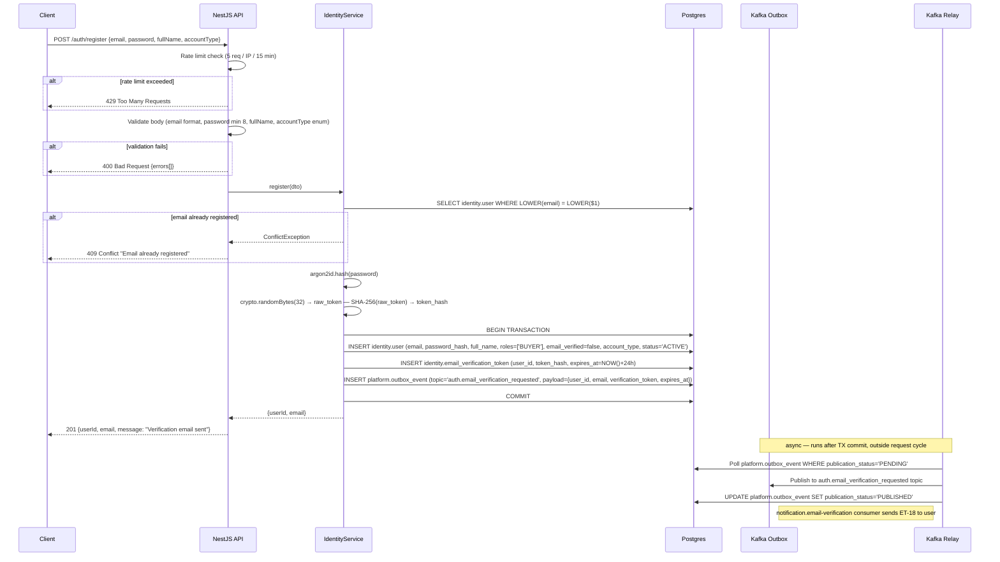

---

### Login (local)

```
POST /auth/login
Tag: Auth
Auth: PUBLIC
Rate limit: 10 attempts per IP per 15 min (lockout after 10 failures)
```
**Request body**
```json
{ "email": "string", "password": "string" }
```
**Response 200**
```json
{
  "accessToken": "string (JWT, 15 min)",
  "refreshToken": "string (opaque, 7 days)",
  "user": {
    "id": "uuid",
    "email": "string",
    "fullName": "string",
    "roles": ["BUYER"],
    "emailVerified": true,
    "accountType": "B2C | B2B"
  }
}
```
**Errors:** 401 invalid credentials, 403 account suspended/banned

#### Sequence

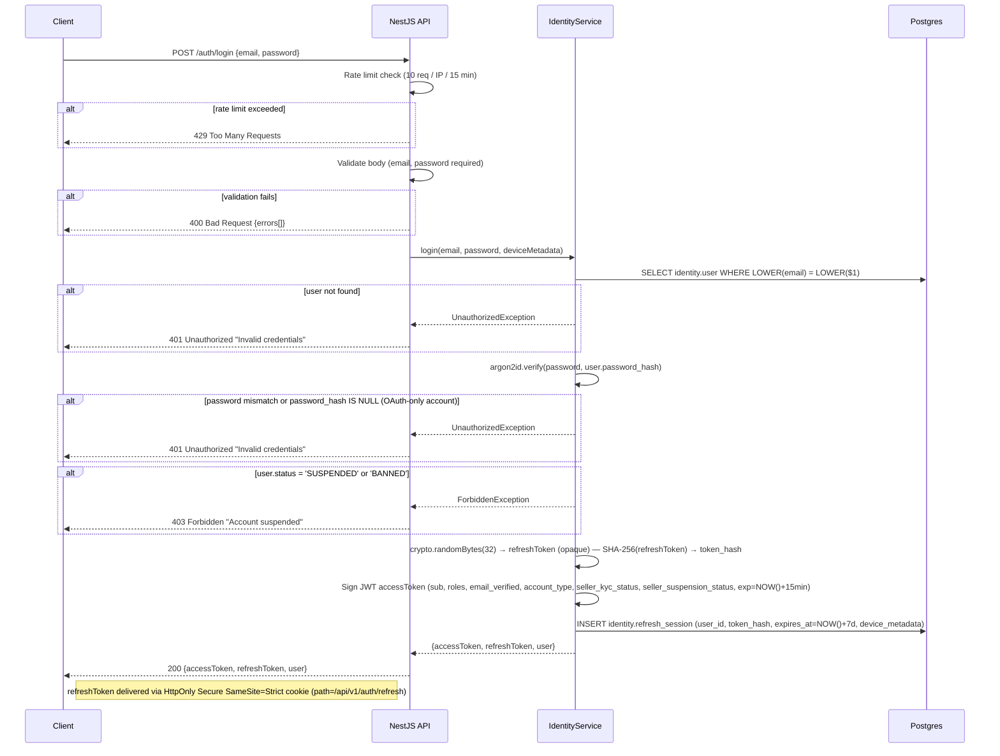

---

### Refresh token

```
POST /auth/refresh
Tag: Auth
Auth: PUBLIC (refresh token in body)
```
**Request body**
```json
{ "refreshToken": "string" }
```
**Response 200** — same shape as login response (new access + refresh token pair). Old refresh token is immediately invalidated.  
**Errors:** 401 token expired/revoked/not found

#### Sequence

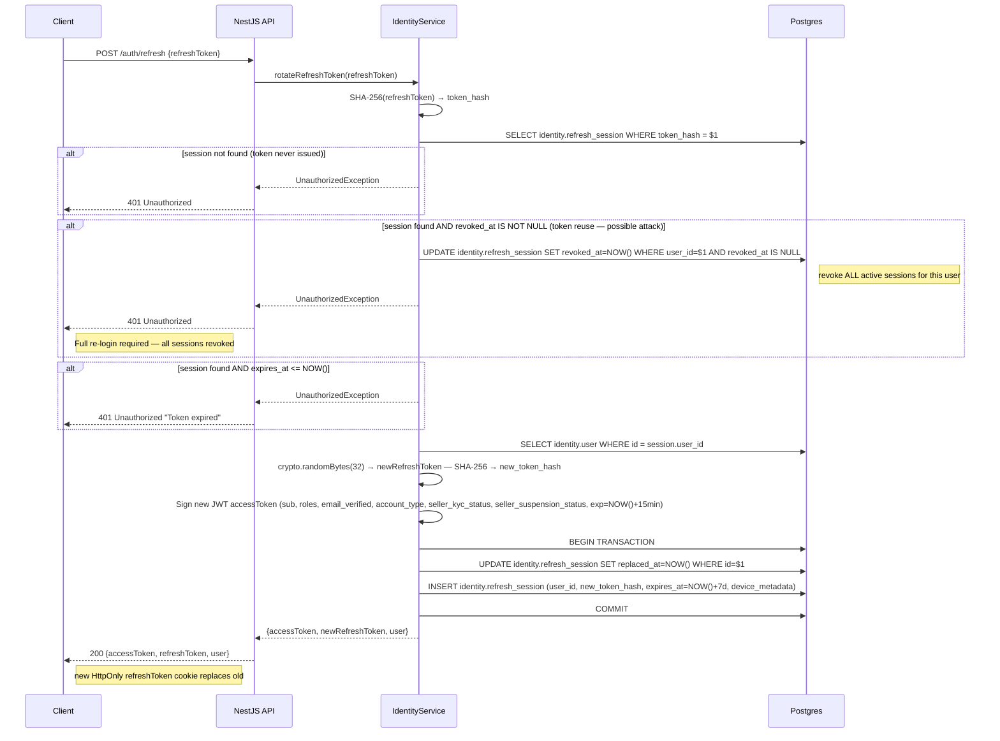

---

### Logout

```
POST /auth/logout
Tag: Auth
Auth: JWT
```
**Request body**
```json
{ "refreshToken": "string" }
```
**Response 204** — revokes the provided refresh token.

#### Sequence

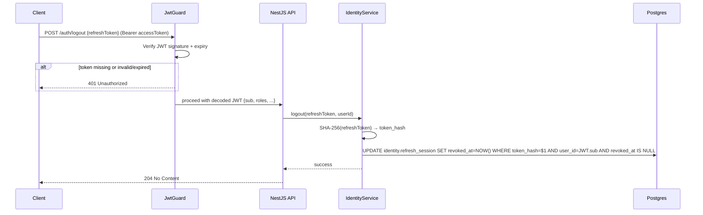

---

### Logout all sessions

```
POST /auth/logout-all
Tag: Auth
Auth: JWT
```
No request body. Invalidates **all** refresh_sessions for the authenticated user.  
**Response 200** `{ "sessionsRevoked": number }`

#### Sequence

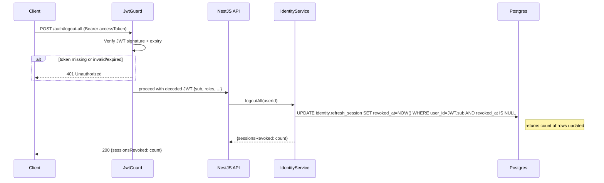

---

### Email verification

```
POST /auth/verify-email
Tag: Auth
Auth: PUBLIC
```
**Request body**
```json
{ "token": "string (single-use, 24h TTL)" }
```
**Response 200** `{ "message": "Email verified" }`  
**Errors:** 400 invalid/expired token, 409 already verified

#### Sequence

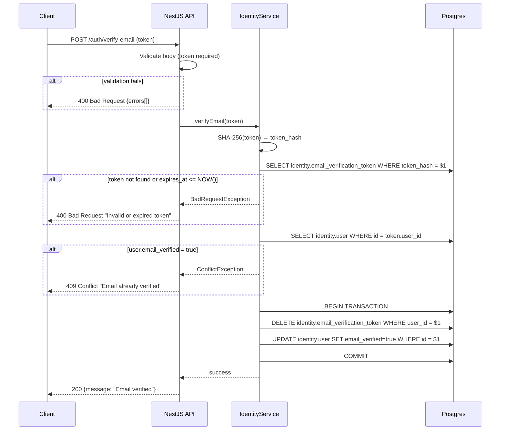

---

### Resend verification email

```
POST /auth/resend-verification
Tag: Auth
Auth: JWT
Rate limit: 3 per hour per email address
```
**Response 202** `{ "message": "Verification email queued" }`  
**Errors:** 409 already verified, 429 rate limited

#### Sequence

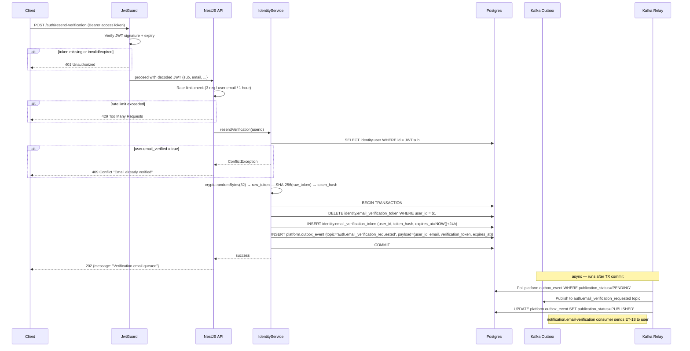

---

### Forgot password

```
POST /auth/forgot-password
Tag: Auth
Auth: PUBLIC
Rate limit: 3 per hour per email address
```
**Request body**
```json
{ "email": "string" }
```
**Response 202** `{ "message": "If the email exists, a reset link has been sent" }` (always 202 to prevent user enumeration)

#### Sequence

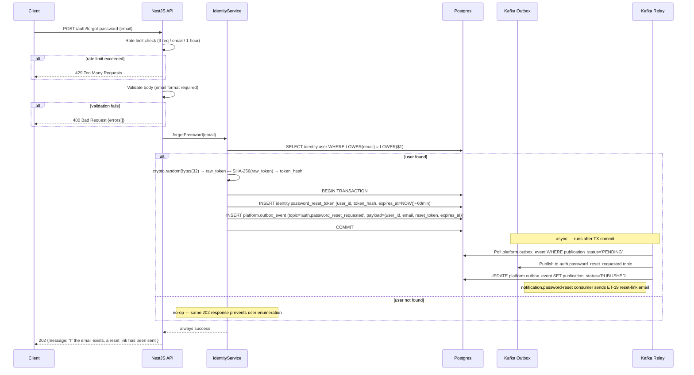

---

### Reset password

```
POST /auth/reset-password
Tag: Auth
Auth: PUBLIC
```
**Request body**
```json
{ "token": "string (single-use, 60 min TTL)", "newPassword": "string (min 8)" }
```
**Response 200** `{ "message": "Password updated. All sessions revoked." }`  
**Errors:** 400 invalid/expired token

#### Sequence

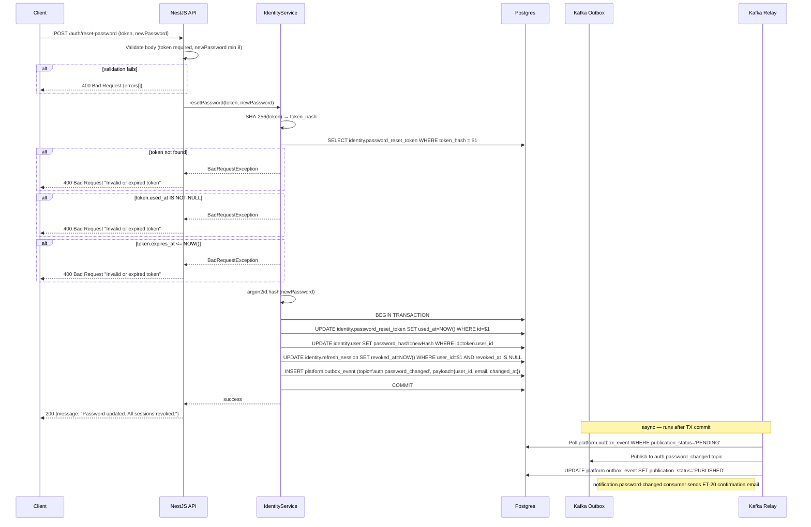

---

### Change password (authenticated)

```
PATCH /auth/change-password
Tag: Auth
Auth: JWT
```
**Request body**
```json
{ "currentPassword": "string", "newPassword": "string (min 8)", "currentRefreshToken": "string" }
```
**Response 200** `{ "message": "Password changed. All other sessions revoked." }`  
**Errors:** 400 validation, 401 current password wrong

#### Sequence

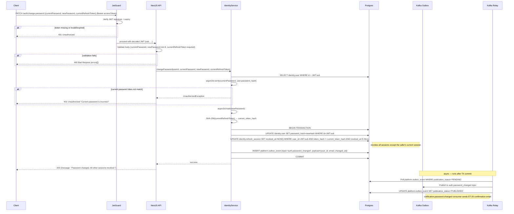

---

### OAuth — Google (buyer only)

```
GET /auth/google
Tag: Auth
Auth: PUBLIC
```
Redirects to Google OAuth consent screen. Passport.js handles the redirect.

```
GET /auth/google/callback
Tag: Auth
Auth: PUBLIC
```
Google redirects here with authorization code. On success, issues JWT pair and redirects to buyer app with tokens in query params or sets a short-lived code that the SPA exchanges.  
**Errors:** 400 OAuth error, 409 email linked to different provider without local password

#### Sequence

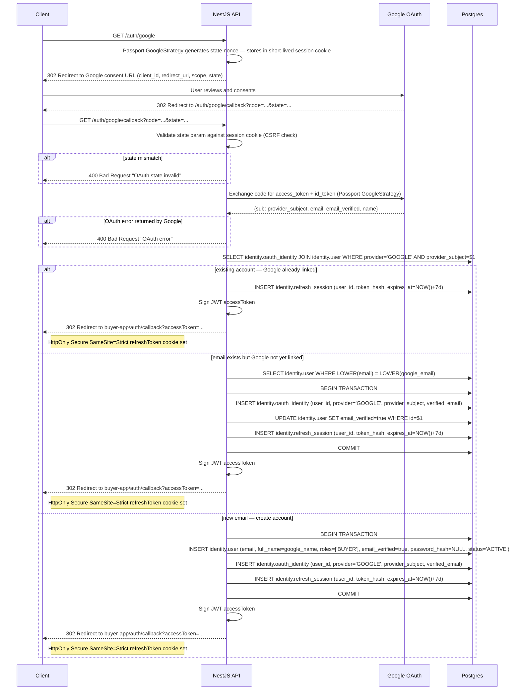

---

### OAuth — Facebook (buyer only)

```
GET /auth/facebook
Tag: Auth
Auth: PUBLIC
```
Redirects to Facebook OAuth consent.

```
GET /auth/facebook/callback
Tag: Auth
Auth: PUBLIC
```
Same exchange flow as Google.

#### Sequence

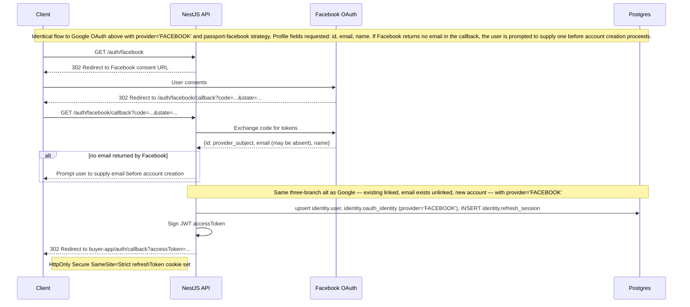

---

### Set local password (OAuth-only account)

Required before an OAuth user can apply as a seller.

```
POST /auth/set-password
Tag: Auth
Auth: JWT
```
**Request body**
```json
{ "newPassword": "string (min 8)" }
```
**Response 200** `{ "message": "Local password linked" }`  
**Errors:** 409 already has local password

#### Sequence

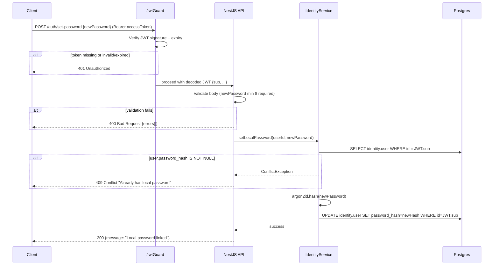
