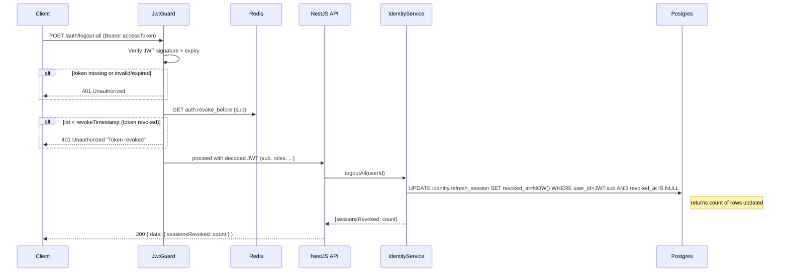
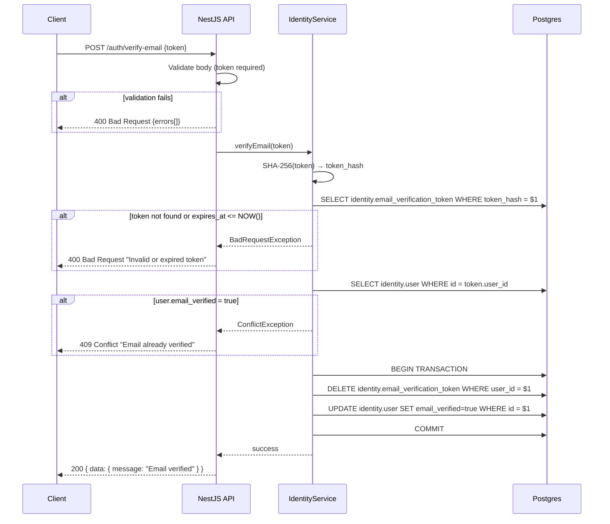
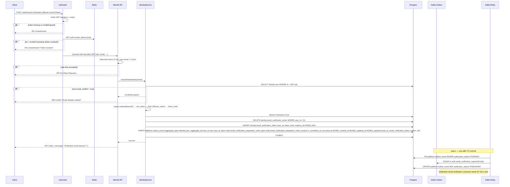
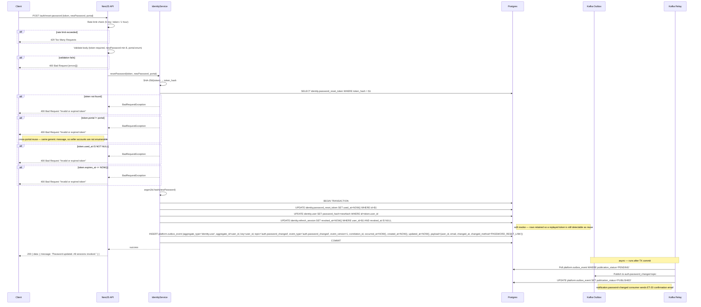
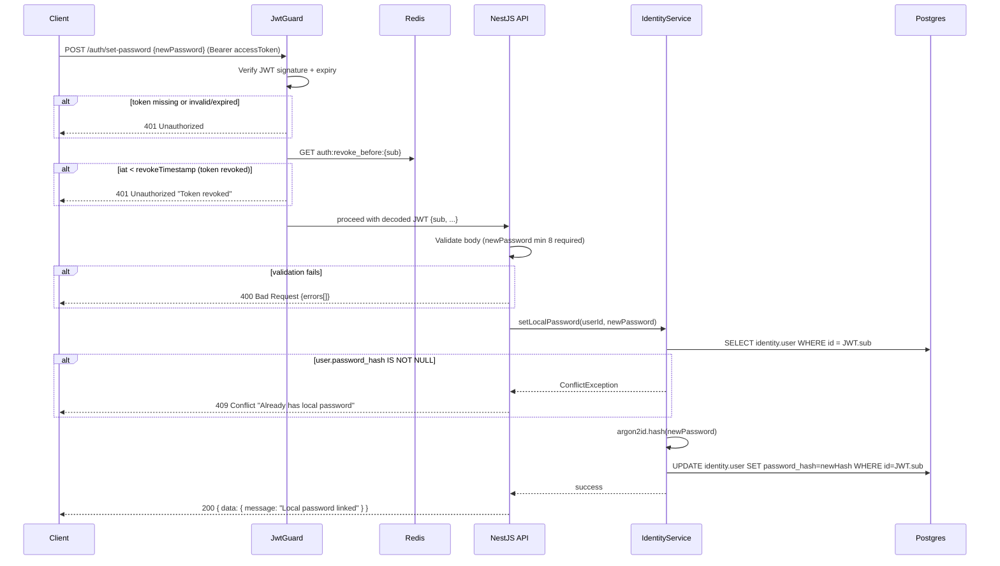

# Auth API — Identity & Auth

**Module:** `Identity` / `Auth`  
**Parent:** [API Design Index](../api-design.md)  
**Source of truth:** [BRD v1.2](../../requirements/BRD.md), [auth-jwt-design](../../../conventions/auth-jwt-design.md), [ERD](../data-model-erd.md)

> **Conventions:** every endpoint below accepts an `X-Correlation-ID` request header, generates a UUIDv7 when it is absent, echoes it on the response, and carries the same value into every log line and into the `correlation_id` of every `platform.outbox_event` row and Kafka envelope it writes — see [observability.md § Correlation ID Propagation](../../../conventions/observability.md#correlation-id). Error bodies use the envelope and code table in [api-conventions.md § Standard Error Shape](../../../conventions/api-conventions.md#standard-error-shape); throttled endpoints return `X-RateLimit-Limit`, `X-RateLimit-Remaining` and, on `429`, `Retry-After`. Passwords, tokens, cookies and authorization headers are masked out of every log line by the sanitizer's `DEFAULT_SENSITIVE_KEYS`.

---

## Summary

- [Portal scoping](#portal-scoping)
- [Endpoint Index](#endpoint-index)
- [DB Mapping](#db-mapping)
- [Endpoints](#endpoints)

<a id="portal-scoping"></a>
## Portal scoping

AliceUT serves three portals from one identity store: buyer (`/login`), seller (`/seller/login`) and admin (`/admin/login`). Separation is enforced **server-side**, not by the UI hiding a button.

Every credential-bearing request carries a `portal` field — `"BUYER" | "SELLER" | "ADMIN"` — in its body. One endpoint per operation, one discriminator, rather than three parallel paths: the role check and the token scope are then identical wherever the operation is invoked from, and a new portal cannot silently inherit an unguarded route.

| Portal | Accepted when the account holds | Auth methods |
|--------|--------------------------------|--------------|
| `BUYER` | `BUYER` | Email/password, Google, Facebook |
| `SELLER` | `SELLER` | Email/password only |
| `ADMIN` | `ADMIN` | Email/password only |

Rules, applied to `POST /auth/login`, `POST /auth/forgot-password` and `POST /auth/reset-password` alike:

- A credential valid for the account but presented at a portal whose role the account does not hold is **`403`**, not `401`. The distinction matters: `401` invites a password retry, while the password was correct and retrying cannot help. Message: "This account cannot sign in from this portal."
- An account holding both `BUYER` and `SELLER` signs in at either portal; the issued token carries both roles, and `portal` does not narrow the `roles` claim. `ADMIN` is never co-held, so an admin account is reachable from `/admin/login` only (US-A-00b).
- OAuth is buyer-only. `GET /auth/google` and `GET /auth/facebook` have no `portal` parameter and always redirect to the buyer app ([diagram 06](../../diagrams/06-auth-portals.md), [auth-jwt-design § 2](../../../conventions/auth-jwt-design.md#seller-portal-auth-constraints)).
- Password-reset tokens are scoped to the portal that issued them and are **not cross-usable**: a token minted at `/seller/forgot-password` opens `/seller/reset-password` and is rejected at `/reset-password`, and the reverse (US-S-12).

---

<a id="endpoint-index"></a>
## Endpoint Index

| Method | Path | Auth | Description |
|--------|------|------|-------------|
| `POST` | [`/auth/register`](#registration) | PUBLIC | Register new buyer account and open a session |
| `POST` | [`/auth/login`](#login-local) | PUBLIC | Portal-scoped login with email + password |
| `POST` | [`/auth/refresh`](#refresh-token) | PUBLIC | Rotate refresh token pair |
| `POST` | [`/auth/logout`](#logout) | JWT | Revoke current session (refresh token read from cookie) |
| `POST` | [`/auth/logout-all`](#logout-all-sessions) | JWT | Revoke all sessions |
| `POST` | [`/auth/verify-email`](#email-verification) | PUBLIC | Consume email verification token |
| `POST` | [`/auth/resend-verification`](#resend-verification-email) | JWT | Re-send verification email |
| `POST` | [`/auth/forgot-password`](#forgot-password) | PUBLIC | Request portal-scoped password reset link |
| `POST` | [`/auth/reset-password`](#reset-password) | PUBLIC | Consume reset token + set new password |
| `PATCH` | [`/auth/change-password`](#change-password-authenticated) | JWT | Change password while authenticated |
| `GET` | [`/auth/google`](#oauth--google-buyer-only) | PUBLIC | Initiate Google OAuth |
| `GET` | [`/auth/google/callback`](#oauth--google-buyer-only) | PUBLIC | Google OAuth callback — redirects with a one-time code |
| `GET` | [`/auth/facebook`](#oauth--facebook-buyer-only) | PUBLIC | Initiate Facebook OAuth |
| `GET` | [`/auth/facebook/callback`](#oauth--facebook-buyer-only) | PUBLIC | Facebook OAuth callback — redirects with a one-time code |
| `POST` | [`/auth/oauth/exchange`](#exchange-oauth-authorization-code) | PUBLIC | Exchange the one-time OAuth code for a session |
| `POST` | [`/auth/set-password`](#set-local-password-oauth-only-account) | JWT | Link local password to OAuth-only account |

### Rate limits

Per [auth-jwt-design § 5](../../../conventions/auth-jwt-design.md#rate-limiting). Each limit is restated on its endpoint below.

| Endpoint | Limit | Window |
|----------|-------|--------|
| `POST /auth/register` | 5 requests | 15 minutes per IP |
| `POST /auth/login` | 10 requests | 15 minutes per IP |
| `POST /auth/forgot-password` | 3 requests | 1 hour per email |
| `POST /auth/resend-verification` | 3 requests | 1 hour per authenticated user |
| `POST /auth/reset-password` | 5 requests | 1 hour per token |
| `GET /auth/google`, `GET /auth/facebook` | 20 requests | 1 minute per IP |
| Everything else | 100 requests | 1 minute per IP (default) |

---

<a id="db-mapping"></a>
## DB Mapping

| Endpoint | Primary DB | Tables / Notes |
|----------|-----------|----------------|
| `POST /auth/register` | Postgres | `identity.user`, `identity.email_verification_token`, `identity.refresh_session` (insert) + `platform.outbox_event` (verification email event) |
| `POST /auth/login` | Postgres | `identity.user` (read), `identity.refresh_session` (insert) |
| `POST /auth/refresh` | Postgres | `identity.refresh_session` (rotate: soft-revoke old, link new) |
| `POST /auth/logout` | Postgres | `identity.refresh_session` (soft-revoke one) |
| `POST /auth/logout-all` | Postgres | `identity.refresh_session` (soft-revoke all for user) |
| `POST /auth/verify-email` | Postgres | `identity.email_verification_token` (consume), `identity.user` (set `email_verified`) |
| `POST /auth/resend-verification` | Postgres | `identity.email_verification_token` (upsert) + `platform.outbox_event` |
| `POST /auth/forgot-password` | Postgres | `identity.password_reset_token` (insert, portal-scoped) + `platform.outbox_event` |
| `POST /auth/reset-password` | Postgres | `identity.password_reset_token` (consume), `identity.user` (hash), `identity.refresh_session` (soft-revoke all) + `platform.outbox_event` |
| `PATCH /auth/change-password` | Postgres | `identity.user` (hash), `identity.refresh_session` (soft-revoke others) + `platform.outbox_event` |
| `GET /auth/google`, `GET /auth/google/callback` | Postgres + **Redis** | `identity.user` (upsert), `identity.oauth_identity` (upsert); callback writes the one-time authorization code to Redis |
| `GET /auth/facebook`, `GET /auth/facebook/callback` | Postgres + **Redis** | `identity.user` (upsert), `identity.oauth_identity` (upsert); callback writes the one-time authorization code to Redis |
| `POST /auth/oauth/exchange` | Redis + Postgres | Consumes the one-time code from Redis; `identity.refresh_session` (insert) |
| `POST /auth/set-password` | Postgres | `identity.user` (`password_hash`) |

> **Guard-layer Redis access:** All JWT-guarded endpoints (marked `JWT` in the Endpoint Index) execute a Redis `GET auth:revoke_before:{userId}` inside `JwtAuthGuard` before the handler runs — not reflected in the Primary DB column above. See [auth-jwt-design § 10](../../../conventions/auth-jwt-design.md#token-revocation).

> **Session rows are retained.** No path in this document deletes an `identity.refresh_session` row. Rotation, logout, password reset and password change all set `revoked_at`; rotation additionally sets `replaced_by_id` on the row it supersedes, so the family stays walkable. Retention is what makes reuse detection possible ([auth-jwt-design § 1.2](../../../conventions/auth-jwt-design.md#jwt-payload-structure)). Rows are pruned only by the scheduled cleanup job in the `workers` service, and only once `revoked_at` is older than the refresh TTL plus a configurable buffer.

> **Outbox rows.** Every `INSERT platform.outbox_event` below is written inside the same Postgres transaction as the domain change and populates all required columns: `aggregate_type`, `aggregate_id`, `topic`, `key` (= `aggregate_id`), `event_type`, `event_version`, `payload`, `correlation_id`, `occurred_at`, `created_at`, `updated_at`, `publication_status='PENDING'`. The sequences abbreviate the argument list to `topic` and `payload` for legibility; the full column set is never optional.

---

<a id="endpoints"></a>
## Endpoints

### Registration

```
POST /auth/register
Tag: Auth
Auth: PUBLIC
Rate limit: 5 attempts per IP per 15 min
```
**Request body**
```json
{
  "email": "string (email)",
  "password": "string (min 8)",
  "fullName": "string",
  "accountType": "B2C | B2B"
}
```
**Response 201**
```json
{
  "data": {
    "accessToken": "string (JWT, 15 min)",
    "user": {
      "id": "uuid",
      "email": "string",
      "fullName": "string",
      "roles": ["BUYER"],
      "emailVerified": false,
      "accountType": "B2C | B2B"
    },
    "message": "Verification email sent"
  }
}
```
**Cookie set:** `Set-Cookie: refreshToken=<opaque>; HttpOnly; Secure; SameSite=Strict; Path=/api/v1/auth; Max-Age=604800`

Registration **opens a session** — US-B-01 requires the account to be created *and* logged in. The account is unverified: it may browse and hold a cart, and `POST /orders` rejects it until `email_verified` is `true` (the `EmailVerifiedGuard` row in the [guard matrix](../api-design.md#11-guard-application-matrix)). Issuing the session at registration is what makes the resend-verification endpoint reachable, since that route is `JWT`-guarded.

**Errors:** 400 validation, 409 Conflict "Email already registered"

#### Sequence


```mermaid
sequenceDiagram
    participant C as Client
    participant A as NestJS API
    participant IS as IdentityService
    participant PG as Postgres
    participant KO as Kafka Outbox
    participant KR as Kafka Relay

    C->>A: POST /auth/register {email, password, fullName, accountType}

    A->>A: Rate limit check (5 req / IP / 15 min)
    alt rate limit exceeded
        A-->>C: 429 Too Many Requests
    end

    A->>A: Validate body (email format, password min 8, fullName, accountType enum)
    alt validation fails
        A-->>C: 400 Bad Request {errors[]}
    end

    A->>IS: register(dto)
    IS->>PG: SELECT identity.user WHERE LOWER(email) = LOWER($1)
    alt email already registered
        IS-->>A: ConflictException
        A-->>C: 409 Conflict "Email already registered"
    end

    IS->>IS: argon2id.hash(password)
    IS->>IS: crypto.randomBytes(32) → raw_token — SHA-256(raw_token) → token_hash
    IS->>IS: crypto.randomBytes(32) → refreshToken (opaque) — SHA-256(refreshToken) → session_token_hash
    IS->>IS: Sign JWT accessToken (sub, roles=['BUYER'], email_verified=false, account_type, seller_kyc_status=null, seller_suspension_status=null, exp=NOW()+15min)

    IS->>PG: BEGIN TRANSACTION
    IS->>PG: INSERT identity.user (email, password_hash, full_name, roles=['BUYER'], email_verified=false, account_type, status='ACTIVE')
    IS->>PG: INSERT identity.email_verification_token (user_id, token_hash, expires_at=NOW()+24h)
    IS->>PG: INSERT identity.refresh_session (user_id, token_hash=session_token_hash, expires_at=NOW()+7d, device_metadata)
    IS->>PG: INSERT platform.outbox_event (aggregate_type='identity.user', aggregate_id=user_id, key=user_id, topic='auth.email_verification_requested', event_type='auth.email_verification_requested', event_version=1, correlation_id, occurred_at=NOW(), created_at=NOW(), updated_at=NOW(), payload={user_id, email, verification_token, expires_at})
    Note over IS,PG: payload carries the raw single-use token — the notification consumer builds the email link from it&#59; the audit consumer masks it before writing MongoDB
    IS->>PG: COMMIT

    IS-->>A: {accessToken, refreshToken, user}
    A-->>C: 201 { data: { accessToken, user, message: "Verification email sent" } } + Set-Cookie: refreshToken (HttpOnly&#59; Secure&#59; SameSite=Strict&#59; Path=/api/v1/auth)

    Note over KO,KR: async — runs after TX commit, outside request cycle
    KR->>PG: Poll platform.outbox_event WHERE publication_status='PENDING'
    KR->>KO: Publish to auth.email_verification_requested topic
    KR->>PG: UPDATE platform.outbox_event SET publication_status='PUBLISHED'
    Note right of KO: notification.email-verification consumer sends ET-18 to user
```

---

### Login (local)

```
POST /auth/login
Tag: Auth
Auth: PUBLIC
Rate limit: 10 attempts per IP per 15 min
```
Rate limiting is the only throttle. There is **no account lockout** in V1 ([auth-jwt-design § 5](../../../conventions/auth-jwt-design.md#rate-limiting)) — a lockout needs a duration, a reset rule and an unlock path, none of which V1 defines, and an unauthenticated lockout is itself a denial-of-service lever against a known email.

**Request body**
```json
{ "email": "string", "password": "string", "portal": "BUYER | SELLER | ADMIN" }
```
`portal` is required and names the portal the credentials were entered at — see [Portal scoping](#portal-scoping). A correct password presented at a portal whose role the account does not hold is `403`, not `401`.
**Response 200**
```json
{
  "data": {
    "accessToken": "string (JWT, 15 min)",
    "user": {
      "id": "uuid",
      "email": "string",
      "fullName": "string",
      "roles": ["BUYER"],
      "emailVerified": true,
      "accountType": "B2C | B2B"
    }
  }
}
```
**Cookie set:** `Set-Cookie: refreshToken=<opaque>; HttpOnly; Secure; SameSite=Strict; Path=/api/v1/auth; Max-Age=604800`  
The refresh token is delivered exclusively as an HttpOnly cookie — it is never present in the JSON response body, and no endpoint ever accepts it in a request body.

**Cookie path is `/api/v1/auth`, not `/api/v1/auth/refresh`.** Logout and change-password both need to identify the caller's session, and a cookie scoped to the refresh path alone is never sent to them — which is what made those two endpoints unimplementable. The path is still narrow enough that the cookie never accompanies a catalog, cart or checkout request, so the CSRF surface stays confined to the five `/auth` routes that read it.

**Errors:** 401 invalid credentials, 403 account suspended/banned, 403 portal/role mismatch

#### Sequence


```mermaid
sequenceDiagram
    participant C as Client
    participant A as NestJS API
    participant IS as IdentityService
    participant PG as Postgres

    C->>A: POST /auth/login {email, password, portal}

    A->>A: Rate limit check (10 req / IP / 15 min)
    alt rate limit exceeded
        A-->>C: 429 Too Many Requests
    end

    A->>A: Validate body (email, password, portal enum required)
    alt validation fails
        A-->>C: 400 Bad Request {errors[]}
    end

    A->>IS: login(email, password, portal, deviceMetadata)
    IS->>PG: SELECT identity.user WHERE LOWER(email) = LOWER($1)
    alt user not found
        IS-->>A: UnauthorizedException
        A-->>C: 401 Unauthorized "Invalid credentials"
    end

    IS->>IS: argon2id.verify(password, user.password_hash)
    alt password mismatch or password_hash IS NULL (OAuth-only account)
        IS-->>A: UnauthorizedException
        A-->>C: 401 Unauthorized "Invalid credentials"
    end

    alt user.status = 'SUSPENDED' or 'BANNED'
        IS-->>A: ForbiddenException
        A-->>C: 403 Forbidden "Account suspended"
    end

    IS->>IS: Check user.roles contains the role required by portal (BUYER / SELLER / ADMIN)
    alt required role not held
        IS-->>A: ForbiddenException
        A-->>C: 403 Forbidden "This account cannot sign in from this portal."
        Note right of C: 403 not 401 — the password was correct&#59; retrying it cannot help
    end

    IS->>IS: crypto.randomBytes(32) → refreshToken (opaque) — SHA-256(refreshToken) → token_hash
    IS->>IS: Sign JWT accessToken (sub, roles, email_verified, account_type, seller_kyc_status, seller_suspension_status, exp=NOW()+15min)
    Note over IS: roles claim carries every role the account holds — portal gates entry, it does not narrow the token

    IS->>PG: INSERT identity.refresh_session (user_id, token_hash, expires_at=NOW()+7d, device_metadata)

    IS-->>A: {accessToken, refreshToken, user}
    A-->>C: 200 { data: { accessToken, user } } + Set-Cookie: refreshToken (HttpOnly&#59; Secure&#59; SameSite=Strict&#59; Path=/api/v1/auth)
```

---

### Refresh token

```
POST /auth/refresh
Tag: Auth
Auth: PUBLIC (refresh token read from HttpOnly cookie)
```
**Request body:** None. The refresh token is read automatically from the `refreshToken` HttpOnly cookie sent by the browser.  
**Response 200** — `{ data: { accessToken, user } }` + new `refreshToken` HttpOnly cookie (replaces prior cookie). Old refresh token immediately invalidated.  
**Errors:** 401 token expired/revoked/not found

#### Sequence


```mermaid
sequenceDiagram
    participant C as Client
    participant A as NestJS API
    participant IS as IdentityService
    participant PG as Postgres
    participant R as Redis

    C->>A: POST /auth/refresh (no body&#59; refreshToken HttpOnly cookie sent automatically by browser)

    A->>IS: rotateRefreshToken(refreshToken from cookie)
    IS->>IS: SHA-256(refreshToken) → token_hash
    IS->>PG: SELECT identity.refresh_session WHERE token_hash = $1

    alt session not found (token never issued)
        IS-->>A: UnauthorizedException
        A-->>C: 401 Unauthorized
    end

    alt session found AND revoked_at IS NOT NULL (token reuse — treated as theft)
        IS->>PG: UPDATE identity.refresh_session SET revoked_at=NOW() WHERE user_id=$1 AND revoked_at IS NULL
        Note right of PG: soft-revoke every remaining active session in the family&#59; no row is deleted, replaced_by_id keeps the chain walkable
        IS->>R: SET auth:revoke_before:{userId} = NOW() EX 960
        Note right of R: access tokens already issued to both the legitimate user and the attacker stop passing JwtAuthGuard on their next request
        IS-->>A: UnauthorizedException
        A-->>C: 401 Unauthorized
        Note right of C: Full re-login required — only the party holding the password gets back in
    end

    alt session found AND expires_at <= NOW()
        IS-->>A: UnauthorizedException
        A-->>C: 401 Unauthorized "Token expired"
    end

    IS->>PG: SELECT identity.user WHERE id = session.user_id
    IS->>IS: crypto.randomBytes(32) → newRefreshToken — SHA-256 → new_token_hash
    IS->>IS: Sign new JWT accessToken (sub, roles, email_verified, account_type, seller_kyc_status, seller_suspension_status, exp=NOW()+15min)

    IS->>PG: BEGIN TRANSACTION
    IS->>PG: INSERT identity.refresh_session (user_id, new_token_hash, expires_at=NOW()+7d, device_metadata) RETURNING id
    IS->>PG: UPDATE identity.refresh_session SET revoked_at=NOW(), replaced_by_id=:newSessionId WHERE id=$1
    Note right of PG: soft revoke — the superseded row is retained and now points at its replacement
    IS->>PG: COMMIT

    IS-->>A: {accessToken, newRefreshToken, user}
    A-->>C: 200 { data: { accessToken, user } } + Set-Cookie: refreshToken (new HttpOnly cookie&#59; replaces old)
```
**Reuse detection:** rotation sets `revoked_at` — the same column reuse detection reads — so presenting a rotated token a second time is unambiguously reuse. The server then soft-revokes every remaining session in that user's family, bumps `auth:revoke_before:{userId}` in Redis so in-flight access tokens stop passing `JwtAuthGuard`, and returns `401`. Both the legitimate user and the attacker must re-login; only the one holding the password succeeds.

Detection depends on the revoked row surviving. **No path deletes it**: rows are pruned only by the scheduled cleanup job in the `workers` service, and only once `revoked_at` is older than the refresh TTL plus a configurable buffer. Reuse of an *expired* revoked session is handled identically — expiry does not make a replayed token benign.

---

### Logout

```
POST /auth/logout
Tag: Auth
Auth: JWT
```
**Request body:** None. The session to revoke is identified **server-side** from the `refreshToken` HttpOnly cookie, which reaches this route because the cookie path is `/api/v1/auth`. The client cannot read the cookie and therefore cannot send its value in a body — which is why the field is gone.

**Response 204** — soft-revokes the caller's own session.

If the cookie is absent (already logged out, or the cookie expired) the response is still `204`: logout is idempotent, and there is nothing for the caller to correct.

#### Sequence


```mermaid
sequenceDiagram
    participant C as Client
    participant G as JwtGuard
    participant R as Redis
    participant A as NestJS API
    participant IS as IdentityService
    participant PG as Postgres

    C->>G: POST /auth/logout (no body&#59; Bearer accessToken + refreshToken HttpOnly cookie)
    G->>G: Verify JWT signature + expiry
    alt token missing or invalid/expired
        G-->>C: 401 Unauthorized
    end
    G->>R: GET auth:revoke_before:{sub}
    alt iat < revokeTimestamp (token revoked)
        G-->>C: 401 Unauthorized "Token revoked"
        Note right of C: Angular interceptor retries via /auth/refresh — new token iat > revokeTimestamp, logout proceeds
    end
    G->>A: proceed with decoded JWT {sub, roles, ...}

    A->>IS: logout(refreshToken from cookie, userId)
    alt refreshToken cookie absent
        Note over IS: nothing to revoke — logout is idempotent
        A-->>C: 204 No Content
    end
    IS->>IS: SHA-256(refreshToken) → token_hash
    IS->>PG: UPDATE identity.refresh_session SET revoked_at=NOW() WHERE token_hash=$1 AND user_id=JWT.sub AND revoked_at IS NULL

    IS-->>A: success
    A-->>C: 204 No Content + Set-Cookie: refreshToken=&#59; Max-Age=0&#59; Path=/api/v1/auth (clears the cookie)
```

---

### Logout all sessions

```
POST /auth/logout-all
Tag: Auth
Auth: JWT
```
No request body. Soft-revokes **all** refresh sessions for the authenticated user, the caller's own included.  
**Response 200** `{ "data": { "sessionsRevoked": number } }`

#### Sequence


```mermaid
sequenceDiagram
    participant C as Client
    participant G as JwtGuard
    participant R as Redis
    participant A as NestJS API
    participant IS as IdentityService
    participant PG as Postgres

    C->>G: POST /auth/logout-all (Bearer accessToken)
    G->>G: Verify JWT signature + expiry
    alt token missing or invalid/expired
        G-->>C: 401 Unauthorized
    end
    G->>R: GET auth:revoke_before:{sub}
    alt iat < revokeTimestamp (token revoked)
        G-->>C: 401 Unauthorized "Token revoked"
    end
    G->>A: proceed with decoded JWT {sub, roles, ...}

    A->>IS: logoutAll(userId)
    IS->>PG: UPDATE identity.refresh_session SET revoked_at=NOW() WHERE user_id=JWT.sub AND revoked_at IS NULL
    Note right of PG: returns count of rows updated

    IS-->>A: {sessionsRevoked: count}
    A-->>C: 200 { data: { sessionsRevoked: count } }
```

---

### Email verification

```
POST /auth/verify-email
Tag: Auth
Auth: PUBLIC
```
**Request body**
```json
{ "token": "string (single-use, 24h TTL)" }
```
**Response 200** `{ "data": { "message": "Email verified" } }`  
**Errors:** 400 invalid/expired token, 409 already verified

#### Sequence


```mermaid
sequenceDiagram
    participant C as Client
    participant A as NestJS API
    participant IS as IdentityService
    participant PG as Postgres

    C->>A: POST /auth/verify-email {token}

    A->>A: Validate body (token required)
    alt validation fails
        A-->>C: 400 Bad Request {errors[]}
    end

    A->>IS: verifyEmail(token)
    IS->>IS: SHA-256(token) → token_hash
    IS->>PG: SELECT identity.email_verification_token WHERE token_hash = $1

    alt token not found or expires_at <= NOW()
        IS-->>A: BadRequestException
        A-->>C: 400 Bad Request "Invalid or expired token"
    end

    IS->>PG: SELECT identity.user WHERE id = token.user_id
    alt user.email_verified = true
        IS-->>A: ConflictException
        A-->>C: 409 Conflict "Email already verified"
    end

    IS->>PG: BEGIN TRANSACTION
    IS->>PG: DELETE identity.email_verification_token WHERE user_id = $1
    IS->>PG: UPDATE identity.user SET email_verified=true WHERE id = $1
    IS->>PG: COMMIT

    IS-->>A: success
    A-->>C: 200 { data: { message: "Email verified" } }
```

---

### Resend verification email

```
POST /auth/resend-verification
Tag: Auth
Auth: JWT
Rate limit: 3 per hour per email address
```
**Response 202** `{ "data": { "message": "Verification email queued" } }`  
**Errors:** 409 already verified, 429 rate limited

#### Sequence


```mermaid
sequenceDiagram
    participant C as Client
    participant G as JwtGuard
    participant R as Redis
    participant A as NestJS API
    participant IS as IdentityService
    participant PG as Postgres
    participant KO as Kafka Outbox
    participant KR as Kafka Relay

    C->>G: POST /auth/resend-verification (Bearer accessToken)
    G->>G: Verify JWT signature + expiry
    alt token missing or invalid/expired
        G-->>C: 401 Unauthorized
    end
    G->>R: GET auth:revoke_before:{sub}
    alt iat < revokeTimestamp (token revoked)
        G-->>C: 401 Unauthorized "Token revoked"
    end
    G->>A: proceed with decoded JWT {sub, email, ...}

    A->>A: Rate limit check (3 req / user email / 1 hour)
    alt rate limit exceeded
        A-->>C: 429 Too Many Requests
    end

    A->>IS: resendVerification(userId)
    IS->>PG: SELECT identity.user WHERE id = JWT.sub
    alt user.email_verified = true
        IS-->>A: ConflictException
        A-->>C: 409 Conflict "Email already verified"
    end

    IS->>IS: crypto.randomBytes(32) → raw_token — SHA-256(raw_token) → token_hash

    IS->>PG: BEGIN TRANSACTION
    IS->>PG: DELETE identity.email_verification_token WHERE user_id = $1
    IS->>PG: INSERT identity.email_verification_token (user_id, token_hash, expires_at=NOW()+24h)
    IS->>PG: INSERT platform.outbox_event (aggregate_type='identity.user', aggregate_id=user_id, key=user_id, topic='auth.email_verification_requested', event_type='auth.email_verification_requested', event_version=1, correlation_id, occurred_at=NOW(), created_at=NOW(), updated_at=NOW(), payload={user_id, email, verification_token, expires_at})
    IS->>PG: COMMIT

    IS-->>A: success
    A-->>C: 202 { data: { message: "Verification email queued" } }

    Note over KO,KR: async — runs after TX commit
    KR->>PG: Poll platform.outbox_event WHERE publication_status='PENDING'
    KR->>KO: Publish to auth.email_verification_requested topic
    KR->>PG: UPDATE platform.outbox_event SET publication_status='PUBLISHED'
    Note right of KO: notification.email-verification consumer sends ET-18 to user
```

---

### Forgot password

```
POST /auth/forgot-password
Tag: Auth
Auth: PUBLIC
Rate limit: 3 per hour per email address
```
**Request body**
```json
{ "email": "string", "portal": "BUYER | SELLER" }
```
`portal` names the forgot-password form the request came from — `/forgot-password` sends `BUYER`, `/seller/forgot-password` sends `SELLER`. It is stored on the token row and decides three things: which role the account must hold for a token to be minted at all, which path the emailed link points at, and which portal will later accept that token.

`ADMIN` is not accepted. V1 has no admin password-reset UI; an admin password is changed by direct database update ([auth-jwt-design § 3](../../../conventions/auth-jwt-design.md#admin-portal-auth-constraints)).

**Response 202** `{ "data": { "message": "If the email exists, a reset link has been sent" } }`

The response is byte-identical whether the email is unregistered, registered but without the portal's role, or registered with it — the three cases must not be distinguishable, or the endpoint enumerates sellers (US-S-12). ET-19 is dispatched only in the third case.

**Link destination**, set by the notification consumer from the event payload:

| `portal` | Link |
|----------|------|
| `BUYER` | `${BUYER_APP_URL}/reset-password?token=<raw>&mode=reset\|set` |
| `SELLER` | `${SELLER_APP_URL}/seller/reset-password?token=<raw>` |

`mode` is a display hint for the buyer portal only, carried so the SPA can render the "Set password" variant for an OAuth-only account without a round trip (US-B-13). It selects a form label, nothing more: the server validates the token and applies the same update either way, so a tampered `mode` changes no behaviour. Seller accounts always have a local password (US-S-12), so the seller link carries no `mode`.

#### Sequence


```mermaid
sequenceDiagram
    participant C as Client
    participant A as NestJS API
    participant IS as IdentityService
    participant PG as Postgres
    participant KO as Kafka Outbox
    participant KR as Kafka Relay

    C->>A: POST /auth/forgot-password {email, portal}

    A->>A: Rate limit check (3 req / email / 1 hour)
    alt rate limit exceeded
        A-->>C: 429 Too Many Requests
    end

    A->>A: Validate body (email format required, portal in {BUYER, SELLER})
    alt validation fails
        A-->>C: 400 Bad Request {errors[]}
    end

    A->>IS: forgotPassword(email, portal)
    IS->>PG: SELECT identity.user WHERE LOWER(email) = LOWER($1)

    alt user found AND user.roles contains the role required by portal
        IS->>IS: crypto.randomBytes(32) → raw_token — SHA-256(raw_token) → token_hash
        IS->>PG: BEGIN TRANSACTION
        IS->>PG: INSERT identity.password_reset_token (user_id, token_hash, portal, expires_at=NOW()+60min)
        IS->>PG: INSERT platform.outbox_event (aggregate_type='identity.user', aggregate_id=user_id, key=user_id, topic='auth.password_reset_requested', event_type='auth.password_reset_requested', event_version=1, correlation_id, occurred_at=NOW(), created_at=NOW(), updated_at=NOW(), payload={user_id, email, reset_token, portal, has_local_password, expires_at})
        Note over IS,PG: payload carries the raw single-use token — the consumer cannot build the link without it&#59; the audit consumer masks it before writing MongoDB
        IS->>PG: COMMIT
        Note over KO,KR: async — runs after TX commit
        KR->>PG: Poll platform.outbox_event WHERE publication_status='PENDING'
        KR->>KO: Publish to auth.password_reset_requested topic
        KR->>PG: UPDATE platform.outbox_event SET publication_status='PUBLISHED'
        Note right of KO: notification.password-reset consumer sends ET-19&#59; link path chosen from payload.portal, mode from payload.has_local_password
    else user not found OR portal role not held
        Note over IS: no-op — the identical 202 prevents both user and seller enumeration
    end

    IS-->>A: always success
    A-->>C: 202 { data: { message: "If the email exists, a reset link has been sent" } }
```

---

### Reset password

```
POST /auth/reset-password
Tag: Auth
Auth: PUBLIC
Rate limit: 5 attempts per token per hour
```
**Request body**
```json
{ "token": "string (single-use, 60 min TTL)", "newPassword": "string (min 8)", "portal": "BUYER | SELLER" }
```
`portal` is the portal the reset form was served from. It must equal the [`portal`](../data-model-erd.md#table-identity-password-reset-token) column recorded on the token row — `portal_type`, `NOT NULL`, written at mint time — so a token minted at the seller portal and presented at `/reset-password`, or the reverse, is rejected as invalid (US-S-12).

**The mismatch response is indistinguishable from the unknown-token and expired-token responses:** same `400`, same `"Invalid or expired token"` message, no portal-specific wording and no distinct error code. A response that singled the mismatch out would be an oracle — it confirms the token exists and names the portal it belongs to, so anyone holding a leaked buyer link could establish that the same address also has a seller account. That is why the check is specified with its response rather than left to the implementation: a portal comparison written without one is naturally coded as its own error branch.

**Response 200** `{ "data": { "message": "Password updated. All sessions revoked." } }`

The endpoint serves both the "Enter new password" and the "Set password" cases. An OAuth-only account has `password_hash IS NULL`; the same update writes the first hash and the account gains local auth alongside its OAuth identity (US-B-13). No separate endpoint and no separate token type: the client's form label came from the link's `mode` hint, and the server's behaviour is identical.

**Errors:** 400 invalid, expired, already-used, or wrong-portal token; 400 password fails complexity; 429 rate limited

#### Sequence


```mermaid
sequenceDiagram
    participant C as Client
    participant A as NestJS API
    participant IS as IdentityService
    participant PG as Postgres
    participant KO as Kafka Outbox
    participant KR as Kafka Relay

    C->>A: POST /auth/reset-password {token, newPassword, portal}

    A->>A: Rate limit check (5 req / token / 1 hour)
    alt rate limit exceeded
        A-->>C: 429 Too Many Requests
    end

    A->>A: Validate body (token required, newPassword min 8, portal enum)
    alt validation fails
        A-->>C: 400 Bad Request {errors[]}
    end

    A->>IS: resetPassword(token, newPassword, portal)
    IS->>IS: SHA-256(token) → token_hash
    IS->>PG: SELECT identity.password_reset_token WHERE token_hash = $1

    alt token not found
        IS-->>A: BadRequestException
        A-->>C: 400 Bad Request "Invalid or expired token"
    end

    alt token.portal != portal
        IS-->>A: BadRequestException
        A-->>C: 400 Bad Request "Invalid or expired token"
        Note right of C: cross-portal reuse — same generic message, so seller accounts are not enumerable
    end

    alt token.used_at IS NOT NULL
        IS-->>A: BadRequestException
        A-->>C: 400 Bad Request "Invalid or expired token"
    end

    alt token.expires_at <= NOW()
        IS-->>A: BadRequestException
        A-->>C: 400 Bad Request "Invalid or expired token"
    end

    IS->>IS: argon2id.hash(newPassword)

    IS->>PG: BEGIN TRANSACTION
    IS->>PG: UPDATE identity.password_reset_token SET used_at=NOW() WHERE id=$1
    IS->>PG: UPDATE identity.user SET password_hash=newHash WHERE id=token.user_id
    IS->>PG: UPDATE identity.refresh_session SET revoked_at=NOW() WHERE user_id=$1 AND revoked_at IS NULL
    Note right of PG: soft revoke — rows retained so a replayed token is still detectable as reuse
    IS->>PG: INSERT platform.outbox_event (aggregate_type='identity.user', aggregate_id=user_id, key=user_id, topic='auth.password_changed', event_type='auth.password_changed', event_version=1, correlation_id, occurred_at=NOW(), created_at=NOW(), updated_at=NOW(), payload={user_id, email, changed_at, changed_method='PASSWORD_RESET_LINK'})
    IS->>PG: COMMIT

    IS-->>A: success
    A-->>C: 200 { data: { message: "Password updated. All sessions revoked." } }

    Note over KO,KR: async — runs after TX commit
    KR->>PG: Poll platform.outbox_event WHERE publication_status='PENDING'
    KR->>KO: Publish to auth.password_changed topic
    KR->>PG: UPDATE platform.outbox_event SET publication_status='PUBLISHED'
    Note right of KO: notification.password-changed consumer sends ET-20 confirmation email
```

---

### Change password (authenticated)

```
PATCH /auth/change-password
Tag: Auth
Auth: JWT
```
**Request body**
```json
{ "currentPassword": "string", "newPassword": "string (min 8)" }
```
The caller's own session is identified **server-side** from the `refreshToken` HttpOnly cookie, which reaches this route because the cookie path is `/api/v1/auth`. The client cannot read that cookie, so it could never have supplied its value in the body — which is why there is no `currentRefreshToken` field, and why the "revoke every session except mine" behaviour below is now executable.

**Response 200** `{ "data": { "message": "Password changed. All other sessions revoked." } }`  
**Errors:** 400 validation, 401 current password wrong, 401 refresh cookie missing or already revoked

#### Sequence


```mermaid
sequenceDiagram
    participant C as Client
    participant G as JwtGuard
    participant R as Redis
    participant A as NestJS API
    participant IS as IdentityService
    participant PG as Postgres
    participant KO as Kafka Outbox
    participant KR as Kafka Relay

    C->>G: PATCH /auth/change-password {currentPassword, newPassword} (Bearer accessToken + refreshToken HttpOnly cookie)
    G->>G: Verify JWT signature + expiry
    alt token missing or invalid/expired
        G-->>C: 401 Unauthorized
    end
    G->>R: GET auth:revoke_before:{sub}
    alt iat < revokeTimestamp (token revoked)
        G-->>C: 401 Unauthorized "Token revoked"
    end
    G->>A: proceed with decoded JWT {sub, ...}

    A->>A: Validate body (currentPassword, newPassword min 8)
    alt validation fails
        A-->>C: 400 Bad Request {errors[]}
    end

    A->>IS: changePassword(userId, currentPassword, newPassword, refreshToken from cookie)
    alt refreshToken cookie absent
        IS-->>A: UnauthorizedException
        A-->>C: 401 Unauthorized "Session cookie missing — sign in again"
    end
    IS->>PG: SELECT identity.user WHERE id = JWT.sub
    IS->>IS: argon2id.verify(currentPassword, user.password_hash)
    alt current password does not match
        IS-->>A: UnauthorizedException
        A-->>C: 401 Unauthorized "Current password is incorrect"
    end

    IS->>IS: argon2id.hash(newPassword)
    IS->>IS: SHA-256(refreshToken from cookie) → current_token_hash

    IS->>PG: BEGIN TRANSACTION
    IS->>PG: UPDATE identity.user SET password_hash=newHash WHERE id=JWT.sub
    IS->>PG: UPDATE identity.refresh_session SET revoked_at=NOW() WHERE user_id=JWT.sub AND token_hash != current_token_hash AND revoked_at IS NULL
    Note right of PG: soft-revokes every session except the caller's own&#59; rows retained
    IS->>PG: INSERT platform.outbox_event (aggregate_type='identity.user', aggregate_id=user_id, key=user_id, topic='auth.password_changed', event_type='auth.password_changed', event_version=1, correlation_id, occurred_at=NOW(), created_at=NOW(), updated_at=NOW(), payload={user_id, email, changed_at, changed_method='ACCOUNT_SETTING'})
    IS->>PG: COMMIT

    IS-->>A: success
    A-->>C: 200 { data: { message: "Password changed. All other sessions revoked." } }

    Note over KO,KR: async — runs after TX commit
    KR->>PG: Poll platform.outbox_event WHERE publication_status='PENDING'
    KR->>KO: Publish to auth.password_changed topic
    KR->>PG: UPDATE platform.outbox_event SET publication_status='PUBLISHED'
    Note right of KO: notification.password-changed consumer sends ET-20 confirmation email
```

---

### OAuth — Google (buyer only)

OAuth is available on the buyer portal only. The seller and admin portals are email/password exclusively ([diagram 06](../../diagrams/06-auth-portals.md), [auth-jwt-design § 2–3](../../../conventions/auth-jwt-design.md#seller-portal-auth-constraints)).

<a id="oauth-code-exchange"></a>
#### No token in the redirect URL

The callback **must not** put an access token in the redirect query string. A URL travels into browser history, into the `Referer` header of the next outbound request, into shared links and into any proxy or server log along the way — `conventions/auth-jwt-design.md` § 6 sets `Referrer-Policy: no-referrer` precisely because URLs leak, and NFR-10 forbids credentials in them.

Instead the callback redirects with a **one-time opaque authorization code**, which the SPA immediately exchanges for the session:

| Property | Value |
|----------|-------|
| Form | `crypto.randomBytes(32).toString('hex')` — opaque, not a JWT, carries no claims |
| Storage | Redis key `auth:oauth_code:{code}` → `{ userId }` |
| TTL | 60 seconds |
| Uses | Exactly one. The exchange deletes the key before issuing anything (`GETDEL`), so a replay finds nothing |

A leaked code is worth far less than a leaked token: it expires in a minute, it is single-use, and it is worthless without a request to the exchange endpoint from an allowed origin. The refresh token never appears in a URL at all — it arrives as a `Set-Cookie` on the exchange response.

```
GET /auth/google
Tag: Auth
Auth: PUBLIC
Rate limit: 20 requests per IP per minute
```
Redirects to Google OAuth consent screen. Passport.js handles the redirect.

```
GET /auth/google/callback
Tag: Auth
Auth: PUBLIC
```
Google redirects here with an authorization code. On success the server upserts the account, mints a one-time code, and redirects to `${BUYER_APP_URL}/auth/callback?code=<one-time-code>`. No token of any kind is present in that URL.  
**Errors:** on failure the redirect carries `?error=<code>` rather than a JSON body, since the caller is a browser mid-redirect: `oauth_state_invalid`, `oauth_error`, `oauth_email_missing`. The buyer app renders the matching message on `/auth/callback`.

#### Sequence

```mermaid
sequenceDiagram
    participant C as Client
    participant A as NestJS API
    participant G as Google OAuth
    participant PG as Postgres
    participant R as Redis

    C->>A: GET /auth/google
    A->>A: Rate limit check (20 req / IP / 1 min)
    A->>A: Passport GoogleStrategy generates state nonce — stores in short-lived session cookie
    A-->>C: 302 Redirect to Google consent URL (client_id, redirect_uri, scope, state)

    C->>G: User reviews and consents
    G-->>C: 302 Redirect to /auth/google/callback?code=...&state=...

    C->>A: GET /auth/google/callback?code=...&state=...
    A->>A: Validate state param against session cookie (CSRF check)
    alt state mismatch
        A-->>C: 302 Redirect to buyer-app/auth/callback?error=oauth_state_invalid
    end

    A->>G: Exchange code for access_token + id_token (Passport GoogleStrategy)
    G-->>A: {sub: provider_subject, email, email_verified, name}

    alt OAuth error returned by Google
        A-->>C: 302 Redirect to buyer-app/auth/callback?error=oauth_error
    end

    A->>PG: SELECT identity.oauth_identity JOIN identity.user WHERE provider='GOOGLE' AND provider_subject=$1

    alt existing account — Google already linked
        Note over A,PG: no write needed — the account and link already exist
    else email exists but Google not yet linked
        A->>PG: SELECT identity.user WHERE LOWER(email) = LOWER(google_email)
        A->>PG: BEGIN TRANSACTION
        A->>PG: INSERT identity.oauth_identity (user_id, provider='GOOGLE', provider_subject, verified_email)
        A->>PG: UPDATE identity.user SET email_verified=true WHERE id=$1
        A->>PG: COMMIT
    else new email — create account
        A->>PG: BEGIN TRANSACTION
        A->>PG: INSERT identity.user (email, full_name=google_name, roles=['BUYER'], email_verified=true, password_hash=NULL, status='ACTIVE')
        A->>PG: INSERT identity.oauth_identity (user_id, provider='GOOGLE', provider_subject, verified_email)
        A->>PG: COMMIT
    end

    A->>A: crypto.randomBytes(32) → one-time code (opaque, no claims)
    A->>R: SET auth:oauth_code:{code} = {userId} EX 60
    A-->>C: 302 Redirect to buyer-app/auth/callback?code=&lt;one-time-code&gt;
    Note right of C: no access token and no refresh token in the URL — the SPA exchanges the code next

    C->>A: POST /auth/oauth/exchange {code}
    Note over C,A: see Exchange OAuth authorization code below
```
**State validation:** the `state` param is a CSRF token stored in a short-lived session cookie; it is validated on callback before anything is written.

**No session is created in the callback.** The refresh session row is inserted by the exchange, not here — so an abandoned callback (the user closes the tab on the redirect) leaves no session behind, only a Redis key that expires in 60 seconds.

---

### OAuth — Facebook (buyer only)

```
GET /auth/facebook
Tag: Auth
Auth: PUBLIC
Rate limit: 20 requests per IP per minute
```
Redirects to Facebook OAuth consent.

```
GET /auth/facebook/callback
Tag: Auth
Auth: PUBLIC
```
Same one-time-code flow as Google. No token appears in the redirect URL.

#### Sequence

```mermaid
sequenceDiagram
    participant C as Client
    participant A as NestJS API
    participant FB as Facebook OAuth
    participant PG as Postgres
    participant R as Redis

    Note over C,R: Identical flow to Google OAuth above with provider='FACEBOOK' and the passport-facebook strategy. Profile fields requested: id, email, name.
    C->>A: GET /auth/facebook
    A-->>C: 302 Redirect to Facebook consent URL

    C->>FB: User consents
    FB-->>C: 302 Redirect to /auth/facebook/callback?code=...&state=...

    C->>A: GET /auth/facebook/callback?code=...&state=...
    A->>FB: Exchange code for tokens
    FB-->>A: {id: provider_subject, email (may be absent), name}

    alt no email returned by Facebook
        A-->>C: 302 Redirect to buyer-app/auth/callback?error=oauth_email_missing
        Note right of C: buyer app prompts for an email and restarts the flow — no account is created without one
    end

    Note over A,PG: Same three-branch alt as Google — existing linked, email exists unlinked, new account — with provider='FACEBOOK'
    A->>PG: upsert identity.user, identity.oauth_identity (provider='FACEBOOK')
    A->>A: crypto.randomBytes(32) → one-time code
    A->>R: SET auth:oauth_code:{code} = {userId} EX 60
    A-->>C: 302 Redirect to buyer-app/auth/callback?code=&lt;one-time-code&gt;
```

---

### Exchange OAuth authorization code

```
POST /auth/oauth/exchange
Tag: Auth
Auth: PUBLIC
```
The SPA calls this immediately on landing at `/auth/callback?code=…`. It is the only place an OAuth session is issued.

**Request body**
```json
{ "code": "string (one-time, 60s TTL)" }
```
**Response 200**
```json
{
  "data": {
    "accessToken": "string (JWT, 15 min)",
    "user": {
      "id": "uuid",
      "email": "string",
      "fullName": "string",
      "roles": ["BUYER"],
      "emailVerified": true,
      "accountType": "B2C | B2B"
    }
  }
}
```
**Cookie set:** `Set-Cookie: refreshToken=<opaque>; HttpOnly; Secure; SameSite=Strict; Path=/api/v1/auth; Max-Age=604800`

The access token arrives in the response **body** and the refresh token as a `Set-Cookie` — the same delivery as `POST /auth/login`. Neither has been in a URL at any point.

`emailVerified` is `true`: an OAuth identity is pre-verified by the provider.

**Errors:** 400 code missing; 401 code unknown, expired, or already used — the three are one response, since distinguishing them tells an attacker whether a guessed code ever existed.

#### Sequence


```mermaid
sequenceDiagram
    participant C as Client
    participant A as NestJS API
    participant IS as IdentityService
    participant R as Redis
    participant PG as Postgres

    C->>A: POST /auth/oauth/exchange {code}

    A->>A: Validate body (code required)
    alt validation fails
        A-->>C: 400 Bad Request {errors[]}
    end

    A->>IS: exchangeOauthCode(code)
    IS->>R: GETDEL auth:oauth_code:{code}
    Note right of R: read and delete in one operation — the code is spent before any token exists, so a concurrent replay finds nothing
    alt key absent (unknown, expired, or already spent)
        IS-->>A: UnauthorizedException
        A-->>C: 401 Unauthorized "Invalid or expired authorization code"
    end

    IS->>PG: SELECT identity.user WHERE id = userId
    IS->>IS: crypto.randomBytes(32) → refreshToken (opaque) — SHA-256(refreshToken) → token_hash
    IS->>IS: Sign JWT accessToken (sub, roles, email_verified=true, account_type, seller_kyc_status, seller_suspension_status, exp=NOW()+15min)
    IS->>PG: INSERT identity.refresh_session (user_id, token_hash, expires_at=NOW()+7d, device_metadata)

    IS-->>A: {accessToken, refreshToken, user}
    A-->>C: 200 { data: { accessToken, user } } + Set-Cookie: refreshToken (HttpOnly&#59; Secure&#59; SameSite=Strict&#59; Path=/api/v1/auth)
```

---

### Set local password (OAuth-only account)

Called from buyer account settings (US-B-15). It is the route out of the one case seller registration cannot resolve on its own: an OAuth-only account has no password to verify, so `POST /seller/register` refuses to link a SELLER role to it and answers `409 PASSWORD_REQUIRED_FOR_LINK` pointing here ([seller.md § Register as seller](seller.md#register-as-seller)). Once a local password exists the seller registration retry succeeds.

```
POST /auth/set-password
Tag: Auth
Auth: JWT
```
**Request body**
```json
{ "newPassword": "string (min 8)" }
```
**Response 200** `{ "data": { "message": "Local password linked" } }`  
**Errors:** 409 already has local password

#### Sequence


```mermaid
sequenceDiagram
    participant C as Client
    participant G as JwtGuard
    participant R as Redis
    participant A as NestJS API
    participant IS as IdentityService
    participant PG as Postgres

    C->>G: POST /auth/set-password {newPassword} (Bearer accessToken)
    G->>G: Verify JWT signature + expiry
    alt token missing or invalid/expired
        G-->>C: 401 Unauthorized
    end
    G->>R: GET auth:revoke_before:{sub}
    alt iat < revokeTimestamp (token revoked)
        G-->>C: 401 Unauthorized "Token revoked"
    end
    G->>A: proceed with decoded JWT {sub, ...}

    A->>A: Validate body (newPassword min 8 required)
    alt validation fails
        A-->>C: 400 Bad Request {errors[]}
    end

    A->>IS: setLocalPassword(userId, newPassword)
    IS->>PG: SELECT identity.user WHERE id = JWT.sub
    alt user.password_hash IS NOT NULL
        IS-->>A: ConflictException
        A-->>C: 409 Conflict "Already has local password"
    end

    IS->>IS: argon2id.hash(newPassword)
    IS->>PG: UPDATE identity.user SET password_hash=newHash WHERE id=JWT.sub

    IS-->>A: success
    A-->>C: 200 { data: { message: "Local password linked" } }
```
