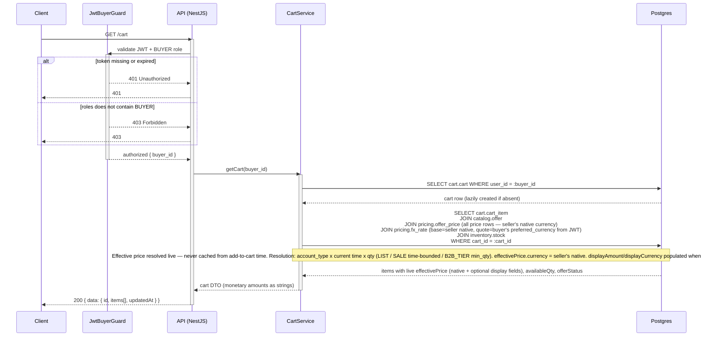
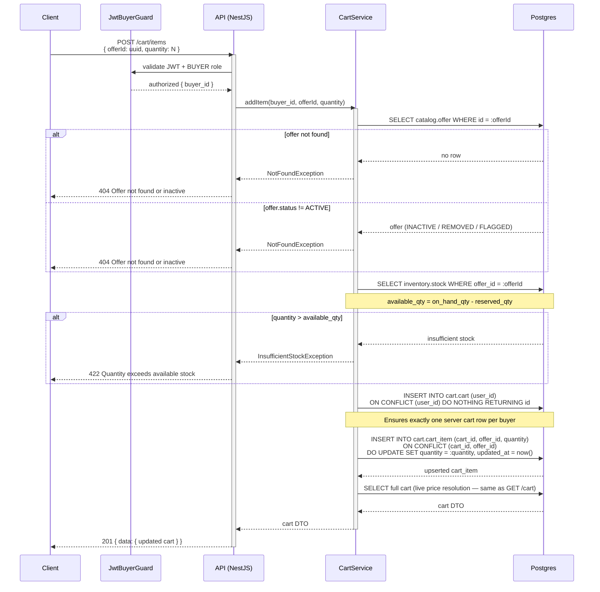
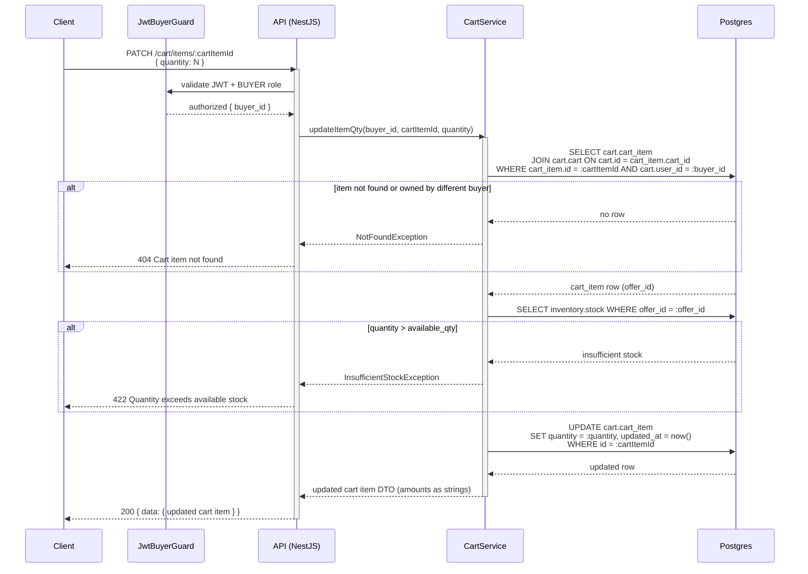
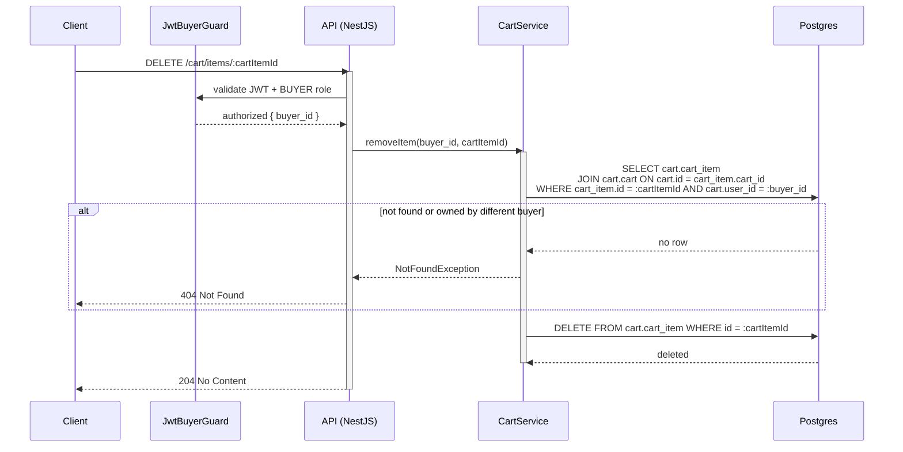
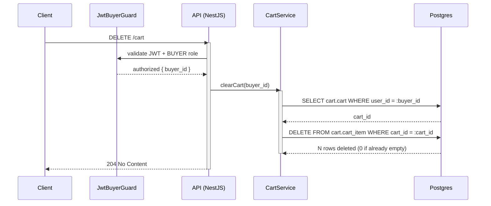
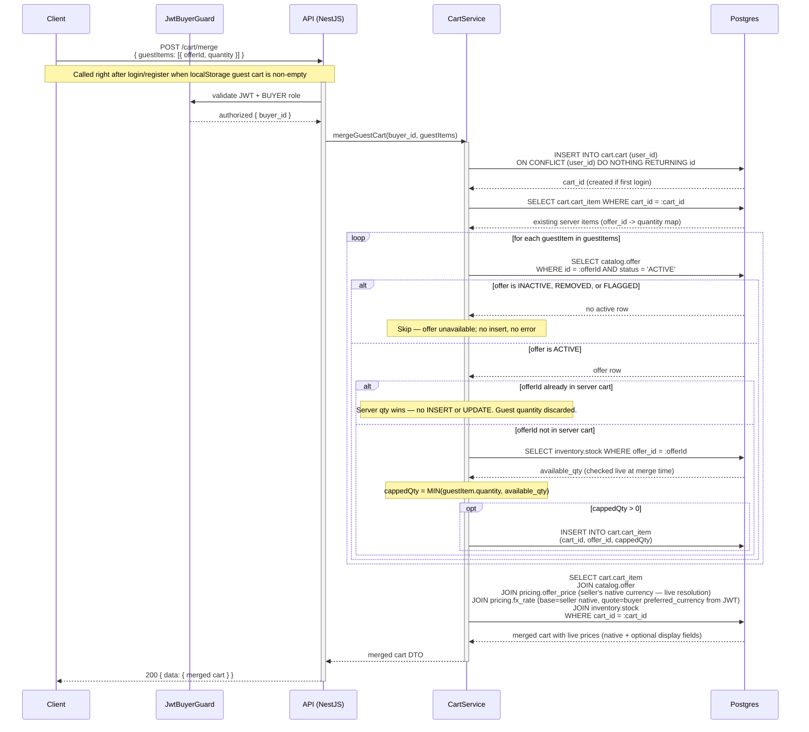

# Cart API

**Module:** `Cart`  
**Parent:** [API Design Index](../api-design.md)  
**Source of truth:** [BRD v1.1](../../requirements/BRD.md), [ERD](../data-model-erd.md)

---

## Endpoint Index

| Method | Path | Auth | Description |
|--------|------|------|-------------|
| `GET` | [`/cart`](#get-cart) | BUYER | Get cart with live-resolved prices |
| `POST` | [`/cart/items`](#add-item) | BUYER | Add item to cart |
| `PATCH` | [`/cart/items/:id`](#update-item-quantity) | BUYER | Update item quantity |
| `DELETE` | [`/cart/items/:id`](#remove-item) | BUYER | Remove item from cart |
| `DELETE` | [`/cart`](#clear-cart) | BUYER | Clear all cart items |
| `POST` | [`/cart/merge`](#merge-guest-cart-on-login) | BUYER | Merge guest localStorage cart on login (server qty wins on conflict) |

---

## DB Mapping

| Endpoint | Primary DB | Tables |
|----------|-----------|--------|
| `GET /cart` | Postgres | `cart.cart`, `cart.cart_item`, `catalog.offer`, `pricing.offer_price`, `inventory.stock` (price resolved live) |
| `POST /cart/items` | Postgres | `cart.cart` (upsert), `cart.cart_item` (insert/update qty), `catalog.offer` (status check), `inventory.stock` (qty check) |
| `PATCH /cart/items/:id` | Postgres | `cart.cart_item` (qty update), `inventory.stock` (qty check) |
| `DELETE /cart/items/:id` | Postgres | `cart.cart_item` (delete) |
| `DELETE /cart` | Postgres | `cart.cart_item` (delete all for cart) |
| `POST /cart/merge` | Postgres | `cart.cart`, `cart.cart_item` (upsert guest items; server qty wins on conflict) |

**Note:** Guest carts live in browser `localStorage`. `POST /cart/merge` is called on login to reconcile guest items into the server cart.

---

## Endpoints

### Get cart

```
GET /cart
Tag: Cart
Auth: BUYER
```
**Response 200**
```json
{
  "data": {
    "id": "uuid",
    "items": [{
      "id": "uuid",
      "offerId": "uuid",
      "productTitle": "string",
      "variantLabel": "string | null",
      "sellerName": "string",
      "quantity": 2,
      "effectivePrice": {
        "amount": "99.99",
        "currency": "USD",
        "displayAmount": "3440.00",
        "displayCurrency": "THB"
      },
      "availableQty": 10,
      "offerStatus": "ACTIVE | INACTIVE | REMOVED"
    }],
    "updatedAt": "ISO8601"
  }
}
```
Effective price is resolved live on GET (not cached from add-to-cart time).

**Field semantics:**
- `effectivePrice.amount` / `effectivePrice.currency` — seller's native pricing currency
- `effectivePrice.displayAmount` / `effectivePrice.displayCurrency` — buyer's display currency, sourced from `buyer.profile.preferred_currency` (from the JWT claims). Omitted when the buyer's preferred currency matches the seller's native currency, or when the FX rate is unavailable.

#### Sequence



---

### Add item

```
POST /cart/items
Tag: Cart
Auth: BUYER
```
**Request body**
```json
{ "offerId": "uuid", "quantity": 1 }
```
**Response 201** — updated cart (`data`-wrapped)  
**Errors:** 400 invalid quantity, 404 offer not found/inactive, 422 quantity exceeds available stock

#### Sequence



---

### Update item quantity

```
PATCH /cart/items/:cartItemId
Tag: Cart
Auth: BUYER
```
**Request body**
```json
{ "quantity": 3 }
```
**Response 200** — updated cart item (`data`-wrapped)  
**Errors:** 400, 404, 422

#### Sequence



---

### Remove item

```
DELETE /cart/items/:cartItemId
Tag: Cart
Auth: BUYER
```
**Response 204**

#### Sequence



---

### Clear cart

```
DELETE /cart
Tag: Cart
Auth: BUYER
```
**Response 204**

#### Sequence



---

### Merge guest cart (on login)

```
POST /cart/merge
Tag: Cart
Auth: BUYER
```
**Request body**
```json
{
  "guestItems": [
    { "offerId": "uuid", "quantity": 1 }
  ]
}
```
Merges guest cart items into the authenticated cart. Duplicate offers: server-side cart quantity is kept (not summed).  
**Response 200** — merged cart (`data`-wrapped)

#### Sequence

**Conflict resolution rule (server qty wins):**
- Guest item whose `offerId` already exists in the server cart: server quantity is kept unchanged; guest quantity is silently discarded.
- Guest item whose `offerId` is absent from the server cart: offer status and available stock are checked live at merge time; item is inserted capped at `available_qty`. Inactive or unavailable offers are silently skipped.


