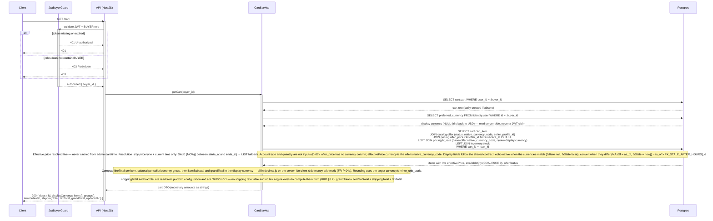
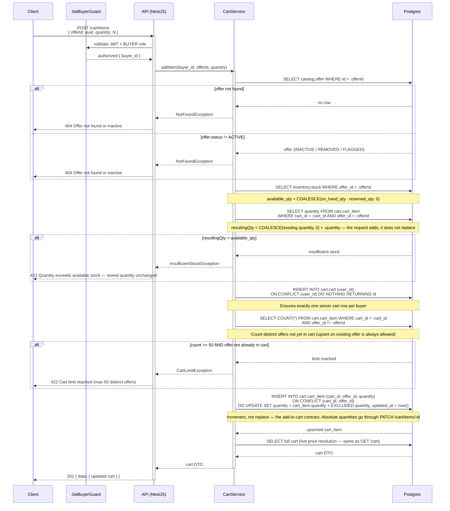
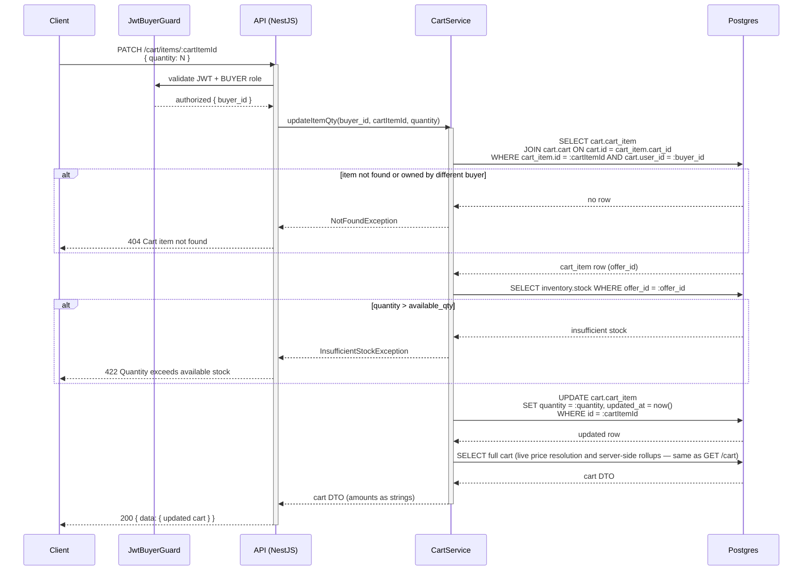
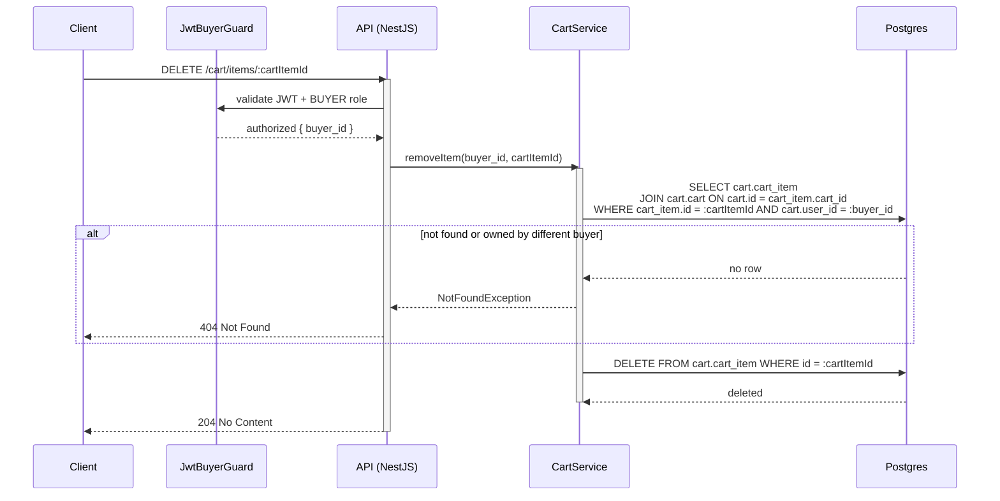
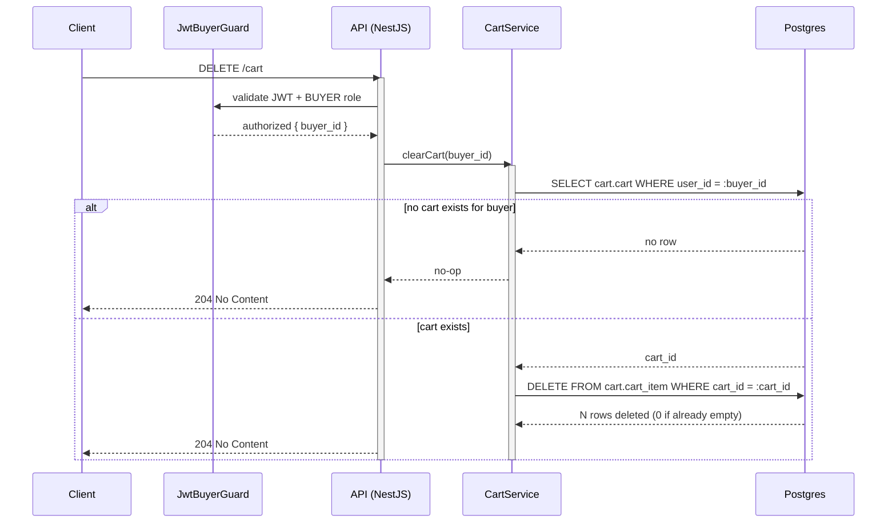

# Cart API

**Status:** Complete  
**Module:** `Cart`  
**Parent:** [API Design Index](../api-design.md)  
**Source of truth:** [BRD v1.3](../../requirements/BRD.md), [ERD](../data-model-erd.md)  
**Conventions:** [api-conventions.md](../../../conventions/api-conventions.md) — `operationId` naming (`<Module>_<verb><Resource>`), response envelope, cursor pagination, error shape, money-as-string  
**Correlation:** every endpoint accepts an `X-Correlation-ID` request header, generates a UUIDv7 when it is absent, echoes it on the response, and carries the same value into every log line and into the `correlation_id` field of every Kafka event envelope and `platform.outbox_event` row it writes — see [observability.md § Correlation ID](../../../conventions/observability.md#correlation-id).

---

## Summary

- [Endpoint Index](#endpoint-index)
- [DB Mapping](#db-mapping)
- [Endpoints](#endpoints)

<a id="endpoint-index"></a>
## Endpoint Index

| Method | Path | Auth | Description |
|--------|------|------|-------------|
| `GET` | [`/cart`](#get-cart) | BUYER | Get cart with live-resolved prices |
| `POST` | [`/cart/items`](#add-item) | BUYER | Add item to cart (quantity increments for an offer already in the cart) |
| `PATCH` | [`/cart/items/:id`](#update-item-quantity) | BUYER | Set item quantity |
| `DELETE` | [`/cart/items/:id`](#remove-item) | BUYER | Remove item from cart |
| `DELETE` | [`/cart`](#clear-cart) | BUYER | Clear all cart items |
| `POST` | [`/cart/merge`](#merge-guest-cart-on-login) | BUYER | Merge guest localStorage cart on login (quantities summed, capped at live stock) |

---

<a id="db-mapping"></a>
## DB Mapping

| Endpoint | Primary DB | Tables |
|----------|-----------|--------|
| `GET /cart` | Postgres | `cart.cart`, `cart.cart_item`, `catalog.offer`, `pricing.offer_price`, `pricing.fx_rate`, `inventory.stock`, `identity.user` (`preferred_currency`) — price resolved live |
| `POST /cart/items` | Postgres | `cart.cart` (upsert), `cart.cart_item` (insert, or increment qty on an existing offer), `catalog.offer` (status check), `inventory.stock` (qty check) |
| `PATCH /cart/items/:id` | Postgres | `cart.cart_item` (qty set), `inventory.stock` (qty check) |
| `DELETE /cart/items/:id` | Postgres | `cart.cart_item` (delete) |
| `DELETE /cart` | Postgres | `cart.cart_item` (delete all for cart) |
| `POST /cart/merge` | Postgres | `cart.cart`, `cart.cart_item` (sum guest and server quantities per offer, capped at live `available_qty`) |

**Note:** Guest carts live in browser `localStorage`. `POST /cart/merge` is called on login to reconcile guest items into the server cart.

**Display currency.** The buyer's display currency is `identity.user.preferred_currency`, read server-side from the authenticated user row. It is **not** an access-token claim — the token carries `sub`, `roles`, `email_verified`, `account_type`, `seller_kyc_status` and `seller_suspension_status` only ([auth-jwt-design](../../../conventions/auth-jwt-design.md)). When the column is `NULL` the display currency falls back to `USD`.

---

<a id="endpoints"></a>
## Endpoints

### Get cart

```
GET /cart
Tag: Cart
Auth: BUYER
```
**Response 200**
```json
{
  "data": {
    "id": "uuid",
    "displayCurrency": "THB",
    "items": [{
      "id": "uuid",
      "offerId": "uuid",
      "productTitle": "string",
      "variantLabel": "string | null",
      "sellerId": "uuid",
      "sellerName": "string",
      "quantity": 2,
      "effectivePrice": {
        "amount": "99.99",
        "currency": "USD",
        "priceType": "LIST | SALE",
        "displayAmount": "3440.00",
        "displayCurrency": "THB",
        "fxRate": "34.40000000",
        "fxAsOf": "ISO8601 | null",
        "fxStale": false
      },
      "lineTotal": { "amount": "199.98", "currency": "USD", "displayAmount": "6880.00", "displayCurrency": "THB", "fxAsOf": "ISO8601 | null", "fxStale": false },
      "availableQty": 10,
      "offerStatus": "ACTIVE | INACTIVE | REMOVED | FLAGGED"
    }],
    "groups": [{
      "sellerId": "uuid",
      "sellerName": "string",
      "currency": "USD",
      "cartItemIds": ["uuid"],
      "subtotal": "199.98",
      "displaySubtotal": "6880.00",
      "displayCurrency": "THB",
      "fxAsOf": "ISO8601 | null",
      "fxStale": false
    }],
    "itemSubtotal": { "displayAmount": "6880.00", "displayCurrency": "THB", "fxAsOf": "ISO8601 | null", "fxStale": false, "complete": true },
    "shippingTotal": { "displayAmount": "0.00", "displayCurrency": "THB" },
    "taxTotal": { "displayAmount": "0.00", "displayCurrency": "THB" },
    "grandTotal": { "displayAmount": "6880.00", "displayCurrency": "THB", "fxAsOf": "ISO8601 | null", "fxStale": false, "complete": true },
    "updatedAt": "ISO8601"
  }
}
```
Effective price is resolved live on GET (not cached from add-to-cart time).

**Field semantics:**
- `effectivePrice.amount` / `effectivePrice.currency` — the amount of the resolved price row and the offer's `native_currency_code`. Each offer has exactly one pricing currency, so no currency selection happens here; resolution picks a `price_type` by current time only (`SALE` if live, else `LIST`) — account type and quantity are not inputs (BRD FR-P-06b, D-02). See [pricing.md § Pricing Constraints](pricing.md#pricing-constraints).
- `effectivePrice.displayAmount` / `displayCurrency` / `fxRate` / `fxAsOf` / `fxStale` — the same amount in the buyer's display currency (`identity.user.preferred_currency`, read server-side). All five keys are always present and follow the single nullability contract documented in [catalog.md § Get product offers](catalog.md#get-product-offers): same currency → display echoes native with `fxRate: null`, `fxStale: false`; FX row present → converted, with the row's `as_of` and a `fxStale` flag; no FX row for the pair → `displayAmount: null`, `fxRate: null`, `fxAsOf: null`, `fxStale: null`.
- `lineTotal` — `unitPrice × quantity`, computed on the server in `decimal.js` and returned as strings in both the offer's native currency and the display currency. **No client ever multiplies or sums money** (FR-P-04a); the browser renders these strings. `fxAsOf` and `fxStale` on `lineTotal` mirror those on `effectivePrice` — same rate used for both. When the offer's currency equals the display currency, `fxAsOf` is `null` and `fxStale` is `false`. The UI must show a visible "estimated" label on any converted `lineTotal` (FR-P-02, BRD:136); `fxStale = true` adds a separate indicative-rate warning but does not gate the label.
- `groups[]` — one entry per seller/currency group, matching the grouping checkout will use, with the group `subtotal` (sum of that group's `lineTotal` values) in the group's own currency plus its display-currency equivalent. `cartItemIds` lets the UI lay the cart out per seller without regrouping client-side. `fxAsOf`/`fxStale` on the group follow the same rules as `effectivePrice`: same currency → `fxAsOf: null, fxStale: false`; converted and rate present → carries the rate's `as_of` and staleness; no rate → `fxAsOf: null, fxStale: null` (and `displaySubtotal` is then `null`). The UI must show a visible "estimated" label on any converted group subtotal (FR-P-02, BRD:136); `fxStale = true` adds a separate indicative-rate warning but does not gate the label.
- `itemSubtotal` — the sum of every group's `displaySubtotal`, in the buyer's display currency, since that is the only currency all groups share. `fxAsOf` is the oldest non-null rate timestamp among all constituent groups (the most stale rate governs the whole total); `fxStale` is `true` when any constituent rate is stale. `complete` is `false` when any group's conversion was unavailable (`displaySubtotal: null` on one group), in which case `displayAmount` covers only the convertible groups and the UI must say so rather than present it as the cart total.
- `shippingTotal` / `taxTotal` — the shipping and tax figures US-B-06:146 requires the cart to show. Both are **structural zeroes in V1**: always `"0.00"`, seeded from platform configuration. Real shipping is out of V1 scope (BRD §3.2) and Phase 1 defines no tax engine, no tax-rate table and no jurisdiction model, so there is nothing to compute from. They are returned rather than omitted so that a later phase changes the value written here, not the shape of this response and of every client bound to it. Neither field carries a `complete` flag — a constant needs no conversion.
- `grandTotal` — `itemSubtotal + shippingTotal + taxTotal`, summed on the server in `decimal.js`. While the two addends are `"0.00"` it equals `itemSubtotal`, and it inherits `itemSubtotal`'s `fxAsOf`, `fxStale`, and `complete` values for the same reason. It exists as its own field because the client must never add the three itself (FR-P-04a).
- `offerStatus` carries the full `offer_status` domain (`ACTIVE`, `INACTIVE`, `REMOVED`, `FLAGGED`); `DRAFT` does not exist — a listing goes live on submit. Any value other than `ACTIVE` marks the line stale: it is labelled "Unavailable", the checkout CTA is disabled while it remains (US-B-06), and checkout excludes it as a skipped item.

**There is no checkout-preview endpoint.** This response *is* the checkout preview: it carries fully resolved, server-computed totals in the buyer's display currency, so a second endpoint recomputing the same figures would only add a second chance for the two to disagree. The buyer sees these numbers before committing (US-B-09:190), and `POST /orders` re-resolves prices at capture and rejects the submission if any of them moved beyond tolerance — see [orders.md § Price revalidation](orders.md#price-revalidation).

#### Sequence


```mermaid
sequenceDiagram
    participant C as Client
    participant G as JwtBuyerGuard
    participant A as API (NestJS)
    participant S as CartService
    participant P as Postgres

    C->>A: GET /cart
    activate A
    A->>G: validate JWT + BUYER role
    activate G
    alt token missing or expired
        G-->>A: 401 Unauthorized
        A-->>C: 401
    else roles does not contain BUYER
        G-->>A: 403 Forbidden
        A-->>C: 403
    end
    G-->>A: authorized { buyer_id }
    deactivate G
    A->>S: getCart(buyer_id)
    activate S
    S->>P: SELECT cart.cart WHERE user_id = :buyer_id
    P-->>S: cart row (lazily created if absent)
    S->>P: SELECT preferred_currency FROM identity.user WHERE id = :buyer_id
    P-->>S: display currency (NULL falls back to USD) — read server-side, never a JWT claim
    S->>P: SELECT cart.cart_item<br/>JOIN catalog.offer (status, native_currency_code, seller_profile_id)<br/>JOIN pricing.offer_price ON offer_id AND inactive_at IS NULL<br/>LEFT JOIN pricing.fx_rate (base=offer.native_currency_code, quote=display currency)<br/>LEFT JOIN inventory.stock<br/>WHERE cart_id = :cart_id
    Note over S,P: Effective price resolved live — never cached from add-to-cart time. Resolution is by price type + current time only: SALE (NOW() between starts_at and ends_at) → LIST fallback. Account type and quantity are not inputs (D-02). offer_price has no currency column#59; effectivePrice.currency is the offer's native_currency_code. Display fields follow the shared contract: echo native when the currencies match (fxRate null, fxStale false), convert when they differ (fxAsOf = as_of, fxStale = now() - as_of > FX_STALE_AFTER_HOURS), displayAmount null only when the pair has no fx_rate row. lineTotal and group displaySubtotal carry the same fxAsOf/fxStale as their constituent effectivePrice rows.
    P-->>S: items with live effectivePrice, availableQty (COALESCE 0), offerStatus
    Note over S: Compute lineTotal per item, subtotal per seller/currency group, then itemSubtotal and grandTotal in the display currency — all in decimal.js on the server. No client-side money arithmetic (FR-P-04a). Rounding uses the target currency's minor_unit_scale.
    Note over S: shippingTotal and taxTotal are read from platform configuration and are "0.00" in V1 — no shipping rate table and no tax engine exists to compute them from (BRD §3.2). grandTotal = itemSubtotal + shippingTotal + taxTotal.
    S-->>A: cart DTO (monetary amounts as strings)
    deactivate S
    A-->>C: 200 { data: { id, displayCurrency, items[], groups[],<br/>itemSubtotal, shippingTotal, taxTotal, grandTotal, updatedAt } }
    deactivate A
```

---

### Add item

```
POST /cart/items
Tag: Cart
Auth: BUYER
```
**Request body**
```json
{ "offerId": "uuid", "quantity": 1 }
```
`quantity` is the amount **added**. For an offer already in the cart the stored quantity is incremented, not replaced (FR-B-06 add semantics) — a second "Add to cart" never silently discards the first. `PATCH /cart/items/:id` is the endpoint that *sets* an absolute quantity. The resulting total is validated against live `available_qty`, so an increment that would exceed stock is a `422` and the stored quantity is left unchanged.

**Response 201** — updated cart (`data`-wrapped, same shape as `GET /cart`)  
**Errors:** 400 invalid quantity, 404 offer not found/inactive, 422 quantity exceeds available stock or 422 cart item limit reached (max 50 distinct offers per cart)

#### Sequence


```mermaid
sequenceDiagram
    participant C as Client
    participant G as JwtBuyerGuard
    participant A as API (NestJS)
    participant S as CartService
    participant P as Postgres

    C->>A: POST /cart/items<br/>{ offerId: uuid, quantity: N }
    activate A
    A->>G: validate JWT + BUYER role
    G-->>A: authorized { buyer_id }
    A->>S: addItem(buyer_id, offerId, quantity)
    activate S
    S->>P: SELECT catalog.offer WHERE id = :offerId
    alt offer not found
        P-->>S: no row
        S-->>A: NotFoundException
        A-->>C: 404 Offer not found or inactive
    else offer.status != ACTIVE
        P-->>S: offer (INACTIVE / REMOVED / FLAGGED)
        S-->>A: NotFoundException
        A-->>C: 404 Offer not found or inactive
    end
    S->>P: SELECT inventory.stock WHERE offer_id = :offerId
    Note over S,P: available_qty = COALESCE(on_hand_qty - reserved_qty, 0)
    S->>P: SELECT quantity FROM cart.cart_item<br/>WHERE cart_id = :cart_id AND offer_id = :offerId
    Note over S,P: resultingQty = COALESCE(existing quantity, 0) + :quantity — the request adds, it does not replace
    alt resultingQty > available_qty
        P-->>S: insufficient stock
        S-->>A: InsufficientStockException
        A-->>C: 422 Quantity exceeds available stock — stored quantity unchanged
    end
    S->>P: INSERT INTO cart.cart (user_id)<br/>ON CONFLICT (user_id) DO NOTHING RETURNING id
    Note over S,P: Ensures exactly one server cart row per buyer
    S->>P: SELECT COUNT(*) FROM cart.cart_item WHERE cart_id = :cart_id<br/>AND offer_id != :offerId
    Note over S,P: Count distinct offers not yet in cart (upsert on existing offer is always allowed)
    alt count >= 50 AND offer not already in cart
        P-->>S: limit reached
        S-->>A: CartLimitException
        A-->>C: 422 Cart limit reached (max 50 distinct offers)
    end
    S->>P: INSERT INTO cart.cart_item (cart_id, offer_id, quantity)<br/>ON CONFLICT (cart_id, offer_id)<br/>DO UPDATE SET quantity = cart_item.quantity + EXCLUDED.quantity, updated_at = now()
    Note over S,P: Increment, not replace — the add-to-cart contract. Absolute quantities go through PATCH /cart/items/:id
    P-->>S: upserted cart_item
    S->>P: SELECT full cart (live price resolution — same as GET /cart)
    P-->>S: cart DTO
    S-->>A: cart DTO
    deactivate S
    A-->>C: 201 { data: { updated cart } }
    deactivate A
```

---

### Update item quantity

```
PATCH /cart/items/:cartItemId
Tag: Cart
Auth: BUYER
```
**Request body**
```json
{ "quantity": 3 }
```
`quantity` is the absolute new value, not a delta.

**Response 200** — the **whole updated cart** (`data`-wrapped, same shape as `GET /cart`), because changing a quantity changes the line total, its group subtotal and the grand total. Returning only the item would force the client either to refetch or to recompute money locally, and client-side money arithmetic is prohibited (FR-P-04a). `POST /cart/items` and `POST /cart/merge` return the same shape.

**Errors:** 400, 404, 422

#### Sequence


```mermaid
sequenceDiagram
    participant C as Client
    participant G as JwtBuyerGuard
    participant A as API (NestJS)
    participant S as CartService
    participant P as Postgres

    C->>A: PATCH /cart/items/:cartItemId<br/>{ quantity: N }
    activate A
    A->>G: validate JWT + BUYER role
    G-->>A: authorized { buyer_id }
    A->>S: updateItemQty(buyer_id, cartItemId, quantity)
    activate S
    S->>P: SELECT cart.cart_item<br/>JOIN cart.cart ON cart.id = cart_item.cart_id<br/>WHERE cart_item.id = :cartItemId AND cart.user_id = :buyer_id
    alt item not found or owned by different buyer
        P-->>S: no row
        S-->>A: NotFoundException
        A-->>C: 404 Cart item not found
    end
    P-->>S: cart_item row (offer_id)
    S->>P: SELECT inventory.stock WHERE offer_id = :offer_id
    alt quantity > available_qty
        P-->>S: insufficient stock
        S-->>A: InsufficientStockException
        A-->>C: 422 Quantity exceeds available stock
    end
    S->>P: UPDATE cart.cart_item<br/>SET quantity = :quantity, updated_at = now()<br/>WHERE id = :cartItemId
    P-->>S: updated row
    S->>P: SELECT full cart (live price resolution and server-side rollups — same as GET /cart)
    P-->>S: cart DTO
    S-->>A: cart DTO (amounts as strings)
    deactivate S
    A-->>C: 200 { data: { updated cart } }
    deactivate A
```

---

### Remove item

```
DELETE /cart/items/:cartItemId
Tag: Cart
Auth: BUYER
```
**Response 204**

#### Sequence


```mermaid
sequenceDiagram
    participant C as Client
    participant G as JwtBuyerGuard
    participant A as API (NestJS)
    participant S as CartService
    participant P as Postgres

    C->>A: DELETE /cart/items/:cartItemId
    activate A
    A->>G: validate JWT + BUYER role
    G-->>A: authorized { buyer_id }
    A->>S: removeItem(buyer_id, cartItemId)
    activate S
    S->>P: SELECT cart.cart_item<br/>JOIN cart.cart ON cart.id = cart_item.cart_id<br/>WHERE cart_item.id = :cartItemId AND cart.user_id = :buyer_id
    alt not found or owned by different buyer
        P-->>S: no row
        S-->>A: NotFoundException
        A-->>C: 404 Not Found
    end
    S->>P: DELETE FROM cart.cart_item WHERE id = :cartItemId
    P-->>S: deleted
    deactivate S
    A-->>C: 204 No Content
    deactivate A
```

---

### Clear cart

```
DELETE /cart
Tag: Cart
Auth: BUYER
```
**Response 204**

#### Sequence


```mermaid
sequenceDiagram
    participant C as Client
    participant G as JwtBuyerGuard
    participant A as API (NestJS)
    participant S as CartService
    participant P as Postgres

    C->>A: DELETE /cart
    activate A
    A->>G: validate JWT + BUYER role
    G-->>A: authorized { buyer_id }
    A->>S: clearCart(buyer_id)
    activate S
    S->>P: SELECT cart.cart WHERE user_id = :buyer_id
    alt no cart exists for buyer
        P-->>S: no row
        S-->>A: no-op
        A-->>C: 204 No Content
    else cart exists
        P-->>S: cart_id
        S->>P: DELETE FROM cart.cart_item WHERE cart_id = :cart_id
        P-->>S: N rows deleted (0 if already empty)
        A-->>C: 204 No Content
    end
    deactivate S
    deactivate A
```

---

### Merge guest cart (on login)

```
POST /cart/merge
Tag: Cart
Auth: BUYER
```
**Request body**
```json
{
  "guestItems": [
    { "offerId": "uuid", "quantity": 1 }
  ]
}
```
Merges guest cart items into the authenticated cart. Quantities are **summed** per offer and capped at live stock.

**Response 200**
```json
{
  "data": {
    "cart": { "...": "same shape as GET /cart" },
    "mergeReport": {
      "addedCount": 2,
      "cappedItems": [{ "offerId": "uuid", "productTitle": "string", "requestedQty": 5, "appliedQty": 3 }],
      "skippedItems": [{ "offerId": "uuid", "productTitle": "string", "reason": "OFFER_UNAVAILABLE | OUT_OF_STOCK | CART_LIMIT_REACHED" }]
    }
  }
}
```

`mergeReport` exists so the buyer can be told what happened — US-B-07:165 requires the toast "N item(s) from your guest session were added to your cart." plus "Some quantities adjusted to match available stock." when anything was capped. Nothing is silently dropped: every guest item that did not arrive at its requested quantity appears in `cappedItems` or `skippedItems`.

#### Sequence

**Conflict resolution rule (quantities summed, capped at live stock — US-B-07:165):**
- Guest item whose `offerId` already exists in the server cart: `appliedQty = MIN(serverQty + guestQty, available_qty)`. The server quantity is never lowered by a merge, so a cap can only hold the total at or above what was already there.
- Guest item whose `offerId` is absent from the server cart: `appliedQty = MIN(guestQty, available_qty)`.
- Offer status and `available_qty` are checked **live at merge time**, not as of when the guest added the item.
- A non-`ACTIVE` offer is skipped with reason `OFFER_UNAVAILABLE`; `available_qty = 0` is skipped with `OUT_OF_STOCK`; a new offer that would exceed the 50-distinct-offer limit is skipped with `CART_LIMIT_REACHED`. Every skip is reported, none is silent.


```mermaid
sequenceDiagram
    participant C as Client
    participant G as JwtBuyerGuard
    participant A as API (NestJS)
    participant S as CartService
    participant P as Postgres

    C->>A: POST /cart/merge<br/>{ guestItems: [{ offerId, quantity }] }
    Note over C,A: Called right after login/register when localStorage guest cart is non-empty
    activate A
    A->>G: validate JWT + BUYER role
    G-->>A: authorized { buyer_id }
    A->>S: mergeGuestCart(buyer_id, guestItems)
    activate S
    S->>P: INSERT INTO cart.cart (user_id)<br/>ON CONFLICT (user_id) DO NOTHING RETURNING id
    P-->>S: cart_id (created if first login)
    S->>P: SELECT cart.cart_item WHERE cart_id = :cart_id
    P-->>S: existing server items (offer_id -> quantity map)

    S->>P: SELECT COUNT(*) FROM cart.cart_item WHERE cart_id = :cart_id
    P-->>S: currentCount

    Note over S: for each guestItem in guestItems:
    S->>P: SELECT catalog.offer<br/>WHERE id = :offerId AND status = 'ACTIVE'
    alt offer is INACTIVE, REMOVED, or FLAGGED
        P-->>S: no active row
        Note over S: skippedItems += { offerId, reason: OFFER_UNAVAILABLE }
    else offer is ACTIVE
        P-->>S: offer row
        S->>P: SELECT inventory.stock WHERE offer_id = :offerId
        P-->>S: available_qty (checked live at merge time, COALESCE 0)
        alt available_qty = 0
            Note over S: skippedItems += { offerId, reason: OUT_OF_STOCK }
        else offerId already in server cart
            Note over S: appliedQty = MIN(serverQty + guestItem.quantity, available_qty)
            S->>P: UPDATE cart.cart_item SET quantity = :appliedQty, updated_at = now()<br/>WHERE cart_id = :cart_id AND offer_id = :offerId
            Note over S: if appliedQty < serverQty + guestItem.quantity: cappedItems += { offerId, requestedQty, appliedQty }
        else offerId not in server cart AND currentCount < 50
            Note over S: appliedQty = MIN(guestItem.quantity, available_qty)
            S->>P: INSERT INTO cart.cart_item (cart_id, offer_id, quantity)<br/>VALUES (:cart_id, :offerId, :appliedQty)
            Note over S: currentCount++&#59; addedCount++&#59; if appliedQty < guestItem.quantity: cappedItems += { offerId, requestedQty, appliedQty }
        else offerId not in server cart AND currentCount >= 50
            Note over S: skippedItems += { offerId, reason: CART_LIMIT_REACHED }
        end
    end

    S->>P: SELECT full cart (live price resolution and server-side rollups — same as GET /cart)
    P-->>S: merged cart with live prices and totals
    S-->>A: merged cart DTO + mergeReport
    deactivate S
    A-->>C: 200 { data: { cart, mergeReport: { addedCount, cappedItems[], skippedItems[] } } }
    deactivate A
```
