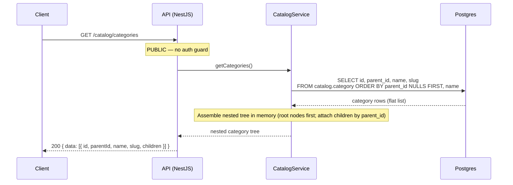
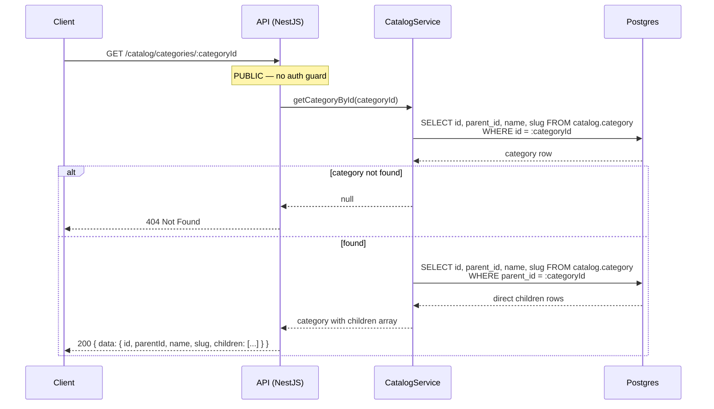
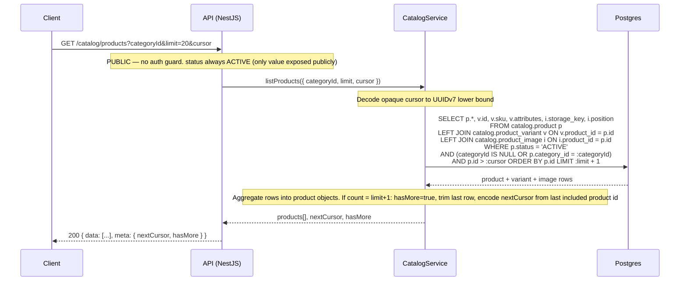
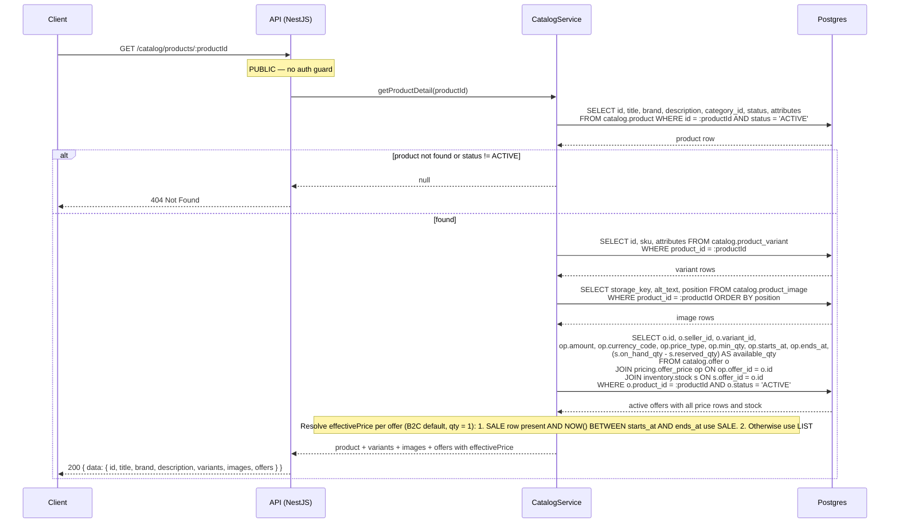
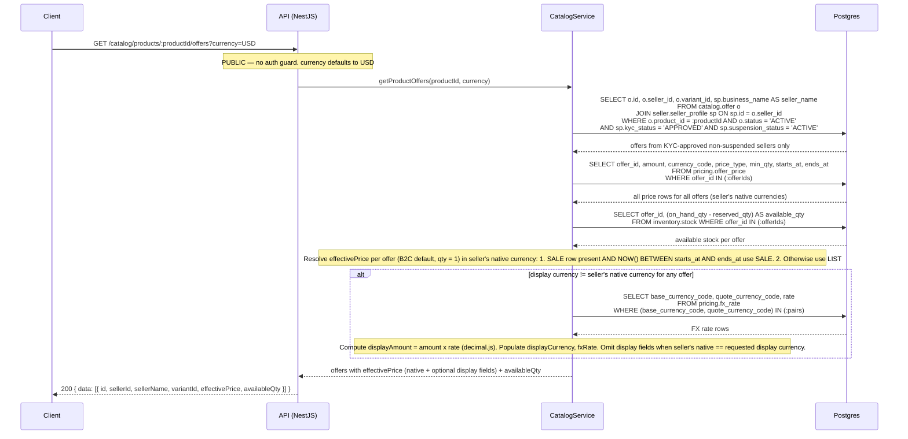

# Catalog API — Public Browse

**Module:** `Catalog`  
**Parent:** [API Design Index](../api-design.md)  
**Source of truth:** [BRD v1.1](../../requirements/BRD.md), [ERD](../data-model-erd.md)

---

## Summary

- [Endpoint Index](#endpoint-index)
- [DB Mapping](#db-mapping)
- [Endpoints](#endpoints)

<a id="endpoint-index"></a>
## Endpoint Index

| Method | Path | Auth | Description |
|--------|------|------|-------------|
| `GET` | [`/catalog/categories`](#list-categories) | PUBLIC | Full category tree |
| `GET` | [`/catalog/categories/:id`](#get-category) | PUBLIC | Single category with children |
| `GET` | [`/catalog/products`](#list-products-public-browse) | PUBLIC | Paginated product list |
| `GET` | [`/catalog/products/:id`](#get-product-detail) | PUBLIC | Product detail with active offers |
| `GET` | [`/catalog/products/:id/offers`](#get-product-offers) | PUBLIC | All active offers for a product |

---

<a id="db-mapping"></a>
## DB Mapping

| Endpoint | Primary DB | Tables |
|----------|-----------|--------|
| `GET /catalog/categories` | Postgres | `catalog.category` (full tree read) |
| `GET /catalog/categories/:id` | Postgres | `catalog.category` (single + children) |
| `GET /catalog/products` | Postgres | `catalog.product`, `catalog.product_variant`, `catalog.product_image` |
| `GET /catalog/products/:id` | Postgres | `catalog.product`, `catalog.product_variant`, `catalog.product_image`, `catalog.offer`, `pricing.offer_price`, `inventory.stock` |
| `GET /catalog/products/:id/offers` | Postgres | `catalog.offer`, `pricing.offer_price`, `pricing.fx_rate`, `inventory.stock`, `seller.seller_profile` |

**Note:** Catalog endpoints are read-only public routes. All writes go through the Seller API (`/seller/products`, `/seller/offers`). Elasticsearch is the search read model — see [search.md](search.md) for `/search/products`.

---

<a id="endpoints"></a>
## Endpoints

### List categories

```
GET /catalog/categories
Tag: Catalog
Auth: PUBLIC
```
**Response 200**
```json
{
  "data": [{
    "id": "uuid",
    "parentId": "uuid | null",
    "name": "Electronics",
    "slug": "electronics",
    "children": [...]
  }]
}
```
Returns the full category tree (nested or flat with `parentId`). No pagination — category count bounded by taxonomy.

#### Sequence



---

### Get category

```
GET /catalog/categories/:categoryId
Tag: Catalog
Auth: PUBLIC
```
**Response 200** — single category with children

#### Sequence



---

### List products (public browse)

```
GET /catalog/products
Tag: Catalog
Auth: PUBLIC
Pagination: cursor
```
**Query params**
- `categoryId`: UUID
- `status`: `ACTIVE` (default, only value exposed publicly)
- `limit`, `cursor`

**Response 200**
```json
{
  "data": [{
    "id": "uuid",
    "title": "string",
    "brand": "string",
    "categoryId": "uuid",
    "status": "ACTIVE",
    "images": [{ "storageKey": "string", "position": 0 }],
    "variants": [{ "id": "uuid", "sku": "string", "attributes": {} }]
  }],
  "meta": { "nextCursor": "string | null", "hasMore": false }
}
```

#### Sequence



---

### Get product detail

```
GET /catalog/products/:productId
Tag: Catalog
Auth: PUBLIC
```
**Response 200**
```json
{
  "data": {
    "id": "uuid",
    "title": "string",
    "brand": "string",
    "description": "string",
    "categoryId": "uuid",
    "status": "ACTIVE",
    "attributes": {},
    "variants": [{ "id": "uuid", "sku": "string", "attributes": {} }],
    "images": [{ "storageKey": "string", "altText": "string | null", "position": 0 }],
    "offers": [
      {
        "offerId": "uuid",
        "sellerId": "uuid",
        "variantId": "uuid | null",
        "variantLabel": "string | null",
        "effectivePrice": {
          "amount": "99.99",
          "currency": "USD",
          "priceType": "LIST | SALE",
          "saleEndsAt": "ISO8601 | null"
        },
        "availableQty": 42,
        "status": "ACTIVE"
      }
    ]
  }
}
```
**Note:** `effectivePrice.amount` is a string (money-as-string convention). No FX display conversion on this endpoint — use `GET /catalog/products/:id/offers?currency=` for buyer display currency.

**Errors:** 404

**Note:** No `currency` query param — `effectivePrice.amount` / `effectivePrice.currency` reflect the seller's native pricing currency only. No FX display conversion. For buyer display currency, use `GET /catalog/products/:id/offers?currency=` or `GET /pricing/offers/:id/effective-price?currency=`.

#### Sequence



---

### Get product offers

```
GET /catalog/products/:productId/offers
Tag: Catalog
Auth: PUBLIC
```
**Query params:** `currency` (ISO 4217, optional — **buyer's display preference currency**, defaults to USD)  
**Response 200**
```json
{
  "data": [{
    "id": "uuid",
    "sellerId": "uuid",
    "sellerName": "string",
    "variantId": "uuid | null",
    "status": "ACTIVE",
    "effectivePrice": {
      "amount": "99.99",
      "currency": "USD",
      "priceType": "LIST | SALE",
      "saleEndsAt": "ISO8601 | null",
      "displayAmount": "3440.00",
      "displayCurrency": "THB",
      "fxRate": "34.40000000"
    },
    "availableQty": 10
  }]
}
```
**Field semantics:**
- `effectivePrice.amount` / `effectivePrice.currency` — seller's native pricing currency (resolved from `pricing.offer_price`)
- `effectivePrice.displayAmount` / `effectivePrice.displayCurrency` / `effectivePrice.fxRate` — buyer's requested display currency (FX-converted from seller's native price using `pricing.fx_rate`). Omitted when `?currency` matches the offer's native currency.

#### Sequence


