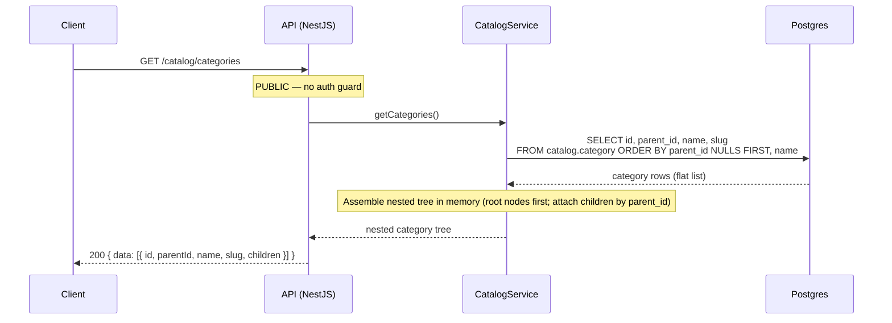
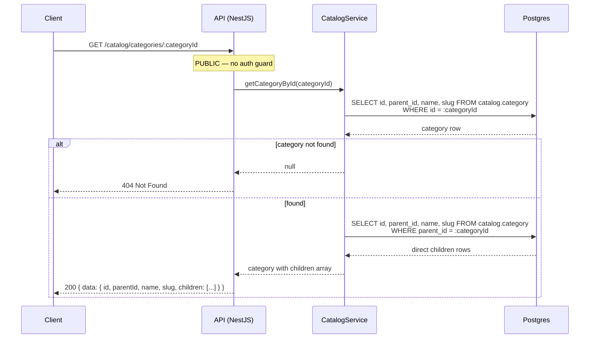
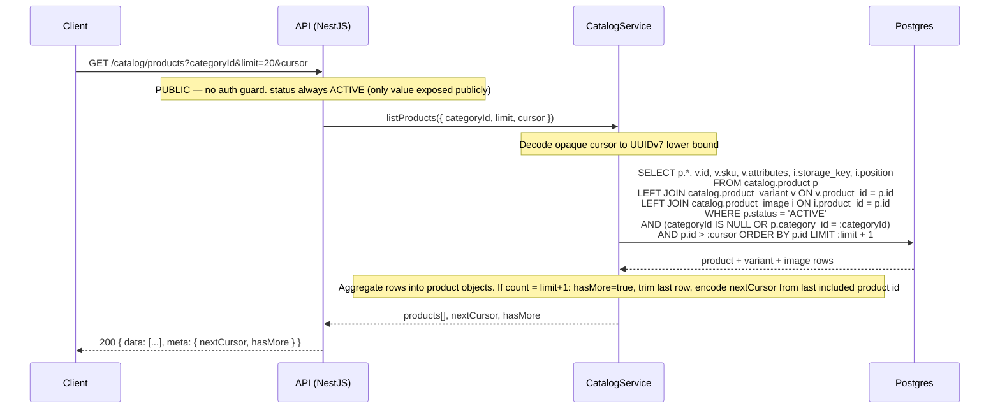

# Catalog API — Public Browse

**Status:** Complete  
**Module:** `Catalog`  
**Parent:** [API Design Index](../api-design.md)  
**Source of truth:** [BRD v1.4](../../requirements/BRD.md), [ERD](../data-model-erd.md)  
**Conventions:** [api-conventions.md](../../../conventions/api-conventions.md) — `operationId` naming (`<Module>_<verb><Resource>`), response envelope, cursor pagination, error shape, money-as-string. Correlation-ID propagation, the error envelope and rate-limit headers apply to every endpoint in this document and are stated once in [api-design.md § 1 Conventions](../api-design.md#conventions).

---

## Summary

- [Endpoint Index](#endpoint-index)
- [DB Mapping](#db-mapping)
- [Endpoints](#endpoints)

<a id="endpoint-index"></a>
## Endpoint Index

| Method | Path | Auth | Description |
|--------|------|------|-------------|
| `GET` | [`/catalog/categories`](#list-categories) | PUBLIC | Full category tree |
| `GET` | [`/catalog/categories/:id`](#get-category) | PUBLIC | Single category with children |
| `GET` | [`/catalog/products`](#list-products-public-browse) | PUBLIC | Paginated product list |
| `GET` | [`/catalog/products/:id`](#get-product-detail) | PUBLIC | Product detail with active offers |
| `GET` | [`/catalog/products/:id/offers`](#get-product-offers) | PUBLIC | All active offers for a product |

---

<a id="db-mapping"></a>
## DB Mapping

| Endpoint | Primary DB | Tables |
|----------|-----------|--------|
| `GET /catalog/categories` | Postgres | `catalog.category` (full tree read) |
| `GET /catalog/categories/:id` | Postgres | `catalog.category` (single + children) |
| `GET /catalog/products` | Postgres | `catalog.product`, `catalog.product_variant`, `catalog.product_image` |
| `GET /catalog/products/:id` | Postgres | `catalog.product`, `catalog.product_variant`, `catalog.product_image`, `catalog.offer`, `pricing.offer_price`, `inventory.stock`, `seller.seller_profile` |
| `GET /catalog/products/:id/offers` | Postgres | `catalog.offer`, `pricing.offer_price`, `pricing.fx_rate`, `inventory.stock`, `seller.seller_profile` |

**Note:** Catalog endpoints are read-only public routes. All writes go through the Seller API (`/seller/products`, `/seller/offers`). Elasticsearch is the search read model — see [search.md](search.md) for `/search/products`.

<a id="offer-currency-and-price-resolution"></a>
**Offer currency and price resolution.** Every offer has exactly one pricing currency, `catalog.offer.native_currency_code` (V1: `USD`, `THB`, `JPY`, `SGD`), and `pricing.offer_price` carries no currency column of its own — a price row's currency is always its parent offer's. There is therefore no currency ambiguity to resolve on a product page: `effectivePrice.currency` is always the offer's `native_currency_code`, and effective-price resolution picks a `price_type` by current time only (BRD FR-P-06b):

1. `SALE` — a live row where `now()` falls between `starts_at` and `ends_at`.
2. `LIST` — the fallback; every offer always has exactly one active `LIST` row.

Rows with a non-null `inactive_at` never participate. Account type and quantity are not inputs to price resolution. `effectivePrice.compareAtAmount` is the offer's live `LIST` amount when the resolved `priceType` is `SALE`, which is what enables the struck-through original price display (US-B-05), and is `null` when `priceType` is `LIST`. `amount` and `compareAtAmount` are strings (money-as-string convention). See [pricing.md](pricing.md#get-effective-price) for the single-offer form of the same resolution.

**Seller eligibility.** Every offer-returning query filters on `seller.seller_profile.kyc_status = 'APPROVED' AND suspension_status = 'ACTIVE'`. Offers from unapproved or suspended sellers are not browsable.

---

<a id="endpoints"></a>
## Endpoints

### List categories

```
GET /catalog/categories
Tag: Catalog
Auth: PUBLIC
```
**Response 200**
```json
{
  "data": [{
    "id": "uuid",
    "parentId": "uuid | null",
    "name": "Electronics",
    "slug": "electronics",
    "children": [...]
  }]
}
```
Returns the full category tree (nested or flat with `parentId`). No pagination — category count bounded by taxonomy.

#### Sequence


```mermaid
sequenceDiagram
    participant Client
    participant API as API (NestJS)
    participant CatalogService
    participant Postgres

    Client->>API: GET /catalog/categories
    Note over API: PUBLIC — no auth guard
    API->>CatalogService: getCategories()
    CatalogService->>Postgres: SELECT id, parent_id, name, slug<br/>FROM catalog.category ORDER BY parent_id NULLS FIRST, name
    Postgres-->>CatalogService: category rows (flat list)
    Note over CatalogService: Assemble nested tree in memory (root nodes first#59; attach children by parent_id)
    CatalogService-->>API: nested category tree
    API-->>Client: 200 { data: [{ id, parentId, name, slug, children }] }
```

---

### Get category

```
GET /catalog/categories/:categoryId
Tag: Catalog
Auth: PUBLIC
```
**Response 200** — single category with children

#### Sequence


```mermaid
sequenceDiagram
    participant Client
    participant API as API (NestJS)
    participant CatalogService
    participant Postgres

    Client->>API: GET /catalog/categories/:categoryId
    Note over API: PUBLIC — no auth guard
    API->>CatalogService: getCategoryById(categoryId)
    CatalogService->>Postgres: SELECT id, parent_id, name, slug FROM catalog.category<br/>WHERE id = :categoryId
    Postgres-->>CatalogService: category row
    alt category not found
        CatalogService-->>API: null
        API-->>Client: 404 Not Found
    else found
        CatalogService->>Postgres: SELECT id, parent_id, name, slug FROM catalog.category<br/>WHERE parent_id = :categoryId
        Postgres-->>CatalogService: direct children rows
        CatalogService-->>API: category with children array
        API-->>Client: 200 { data: { id, parentId, name, slug, children: [...] } }
    end
```

---

### List products (public browse)

```
GET /catalog/products
Tag: Catalog
Auth: PUBLIC
Pagination: cursor
```
**Query params**
- `categoryId`: UUID
- `status`: `ACTIVE` (default, only value exposed publicly)
- `limit`, `cursor`

**Response 200**
```json
{
  "data": [{
    "id": "uuid",
    "title": "string",
    "brand": "string",
    "categoryId": "uuid",
    "status": "ACTIVE",
    "images": [{ "storageKey": "string", "position": 0 }],
    "variants": [{ "id": "uuid", "sku": "string", "attributes": {} }]
  }],
  "meta": { "nextCursor": "string | null", "hasMore": false }
}
```

#### Sequence


```mermaid
sequenceDiagram
    participant Client
    participant API as API (NestJS)
    participant CatalogService
    participant Postgres

    Client->>API: GET /catalog/products?categoryId&limit=20&cursor
    Note over API: PUBLIC — no auth guard. status always ACTIVE (only value exposed publicly)
    API->>CatalogService: listProducts({ categoryId, limit, cursor })
    Note over CatalogService: Decode opaque cursor to UUIDv7 lower bound
    CatalogService->>Postgres: SELECT p.*, v.id, v.sku, v.attributes, i.storage_key, i.position<br/>FROM catalog.product p<br/>LEFT JOIN catalog.product_variant v ON v.product_id = p.id<br/>LEFT JOIN catalog.product_image i ON i.product_id = p.id<br/>WHERE p.status = 'ACTIVE'<br/>AND (categoryId IS NULL OR p.category_id = :categoryId)<br/>AND p.id > :cursor ORDER BY p.id LIMIT :limit + 1
    Postgres-->>CatalogService: product + variant + image rows
    Note over CatalogService: Aggregate rows into product objects. If count = limit+1: hasMore=true, trim last row, encode nextCursor from last included product id
    CatalogService-->>API: products[], nextCursor, hasMore
    API-->>Client: 200 { data: [...], meta: { nextCursor, hasMore } }
```

---

### Get product detail

```
GET /catalog/products/:productId
Tag: Catalog
Auth: PUBLIC (JWT claims are not used for price resolution)
```
**Response 200**
```json
{
  "data": {
    "id": "uuid",
    "title": "string",
    "brand": "string",
    "description": "string",
    "categoryId": "uuid",
    "status": "ACTIVE",
    "attributes": {},
    "variants": [{ "id": "uuid", "sku": "string", "attributes": {} }],
    "images": [{ "storageKey": "string", "altText": "string | null", "position": 0 }],
    "offers": [
      {
        "offerId": "uuid",
        "sellerId": "uuid",
        "variantId": "uuid | null",
        "variantLabel": "string | null",
        "effectivePrice": {
          "amount": "99.99",
          "currency": "USD",
          "priceType": "LIST | SALE",
          "compareAtAmount": "119.99 | null",
          "saleEndsAt": "ISO8601 | null"
        },
        "availableQty": 42,
        "status": "ACTIVE"
      }
    ]
  }
}
```
**Field semantics:**
- `effectivePrice` (`amount`, `currency`, `priceType`, `compareAtAmount`, `saleEndsAt`) — resolved per [Offer currency and price resolution](#offer-currency-and-price-resolution).
- `availableQty` is `COALESCE(on_hand_qty - reserved_qty, 0)` — an offer with no `inventory.stock` row is returned with `availableQty: 0`, not omitted.
- No `currency` query param and no FX conversion on this endpoint. For a buyer display currency use `GET /catalog/products/:id/offers?currency=` or `GET /pricing/offers/:id/effective-price?currency=`.

**Errors:** 404

#### Sequence

```mermaid
sequenceDiagram
    participant Client
    participant API as API (NestJS)
    participant CatalogService
    participant Postgres

    Client->>API: GET /catalog/products/:productId
    Note over API: PUBLIC — optional Bearer token; JWT claims are not used for price resolution
    API->>CatalogService: getProductDetail(productId)
    CatalogService->>Postgres: SELECT id, title, brand, description, category_id, status, attributes<br/>FROM catalog.product WHERE id = :productId AND status = 'ACTIVE'
    Postgres-->>CatalogService: product row
    alt product not found or status != ACTIVE
        CatalogService-->>API: null
        API-->>Client: 404 Not Found
    else found
        CatalogService->>Postgres: SELECT id, sku, attributes FROM catalog.product_variant<br/>WHERE product_id = :productId
        Postgres-->>CatalogService: variant rows
        CatalogService->>Postgres: SELECT storage_key, alt_text, position FROM catalog.product_image<br/>WHERE product_id = :productId ORDER BY position
        Postgres-->>CatalogService: image rows
        CatalogService->>Postgres: SELECT o.id, o.seller_profile_id, o.variant_id, o.native_currency_code,<br/>op.amount, op.price_type, op.starts_at, op.ends_at,<br/>COALESCE(s.on_hand_qty - s.reserved_qty, 0) AS available_qty<br/>FROM catalog.offer o<br/>JOIN seller.seller_profile sp ON sp.id = o.seller_profile_id<br/>JOIN pricing.offer_price op ON op.offer_id = o.id AND op.inactive_at IS NULL<br/>LEFT JOIN inventory.stock s ON s.offer_id = o.id<br/>WHERE o.product_id = :productId AND o.status = 'ACTIVE'<br/>AND sp.kyc_status = 'APPROVED' AND sp.suspension_status = 'ACTIVE'
        Note over CatalogService,Postgres: LEFT JOIN on inventory.stock with COALESCE — an offer with no stock row is returned with available_qty 0, never dropped.<br/>Seller eligibility filtered here, not in the client.
        Postgres-->>CatalogService: eligible active offers with their live price rows and stock
        Note over CatalogService: Resolve effectivePrice per offer in the offer's native_currency_code: SALE (NOW() between starts_at and ends_at) → LIST fallback. Account type and quantity are not inputs. When the resolved type is SALE, read the offer's live LIST row amount into compareAtAmount for strikethrough display.
        CatalogService-->>API: product + variants + images + offers with effectivePrice (amount, currency, priceType, compareAtAmount, saleEndsAt) + availableQty
        API-->>Client: 200 { data: { id, title, brand, description, variants, images, offers } }
    end
```

---

### Get product offers

```
GET /catalog/products/:productId/offers
Tag: Catalog
Auth: PUBLIC
```
**Query params**
- `currency` (ISO 4217, optional — **buyer's display preference currency**; defaults to the caller's `identity.user.preferred_currency` when a Bearer token is supplied and that column is set, otherwise `USD`)

**Response 200**
```json
{
  "data": [{
    "id": "uuid",
    "sellerId": "uuid",
    "sellerName": "string",
    "variantId": "uuid | null",
    "status": "ACTIVE",
    "effectivePrice": {
      "amount": "99.99",
      "currency": "USD",
      "priceType": "LIST | SALE",
      "compareAtAmount": "119.99 | null",
      "saleEndsAt": "ISO8601 | null",
      "displayAmount": "3440.00",
      "displayCurrency": "THB",
      "fxRate": "34.40000000",
      "fxAsOf": "ISO8601 | null",
      "fxStale": false
    },
    "availableQty": 10
  }]
}
```
**Field semantics:**
- `effectivePrice` (`amount`, `currency`, `priceType`, `compareAtAmount`, `saleEndsAt`) — resolved per [Offer currency and price resolution](#offer-currency-and-price-resolution).
- `effectivePrice.displayAmount` / `displayCurrency` / `fxRate` / `fxAsOf` / `fxStale` — the `?currency` rendering of the same amount, a **browse-time estimate only**, per [pricing.md § Display-currency fields](pricing.md#fx-display-fields).
- `availableQty` is `COALESCE(on_hand_qty - reserved_qty, 0)`.

**Errors:** 404 product not found, 422 `currency` not supported

#### Sequence

```mermaid
sequenceDiagram
    participant Client
    participant API as API (NestJS)
    participant CatalogService
    participant Postgres

    Client->>API: GET /catalog/products/:productId/offers?currency=USD
    Note over API: PUBLIC — optional Bearer token. currency falls back to identity.user.preferred_currency, then USD. Account type and quantity are not used for price resolution
    API->>CatalogService: getProductOffers(productId, { currency })
    CatalogService->>Postgres: SELECT o.id, o.seller_profile_id, o.variant_id, o.native_currency_code,<br/>sp.business_name AS seller_name<br/>FROM catalog.offer o<br/>JOIN seller.seller_profile sp ON sp.id = o.seller_profile_id<br/>WHERE o.product_id = :productId AND o.status = 'ACTIVE'<br/>AND sp.kyc_status = 'APPROVED' AND sp.suspension_status = 'ACTIVE'
    Postgres-->>CatalogService: offers from KYC-approved non-suspended sellers only, each with its single pricing currency
    CatalogService->>Postgres: SELECT offer_id, amount, price_type, starts_at, ends_at<br/>FROM pricing.offer_price<br/>WHERE offer_id IN (:offerIds) AND inactive_at IS NULL
    Postgres-->>CatalogService: live price rows per offer (currency is the parent offer's native_currency_code — offer_price has no currency column)
    CatalogService->>Postgres: SELECT offer_id, (on_hand_qty - reserved_qty) AS available_qty<br/>FROM inventory.stock WHERE offer_id IN (:offerIds)
    Note over CatalogService: Offers with no stock row get available_qty 0 (COALESCE on the join result) — never dropped from the response
    Postgres-->>CatalogService: available stock per offer
    Note over CatalogService: Resolve effectivePrice per offer in that offer's native currency: SALE (NOW() between starts_at and ends_at) → LIST fallback; account type and quantity are not inputs. When resolved type is SALE, read the offer's live LIST row amount into compareAtAmount.
    alt display currency != offer's native currency
        CatalogService->>Postgres: SELECT base_currency_code, quote_currency_code, rate, as_of<br/>FROM pricing.fx_rate<br/>WHERE (base_currency_code, quote_currency_code) IN (:pairs)
        Postgres-->>CatalogService: FX rate rows (one row per pair — the table keeps no history)
        Note over CatalogService: Row found: displayAmount = amount x rate (decimal.js, rounded once with the display currency's minor_unit_scale)#59; fxAsOf = as_of#59; fxStale = now() - as_of > FX_STALE_AFTER_HOURS (env, default 24). No row: displayAmount = null, fxRate = null, fxAsOf = null, fxStale = null.
    else display currency == offer's native currency
        Note over CatalogService: displayAmount = amount, displayCurrency = currency, fxRate = null, fxAsOf = null, fxStale = false (no FX fetch needed)
    end
    CatalogService-->>API: offers with effectivePrice (native amount + display fields) + availableQty
    API-->>Client: 200 { data: [{ id, sellerId, sellerName, variantId, effectivePrice, availableQty }] }
```
