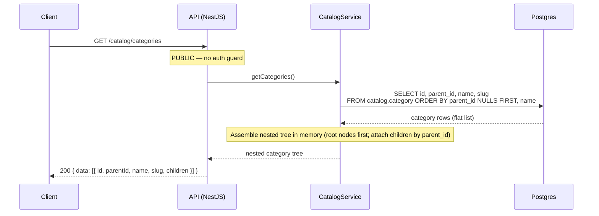
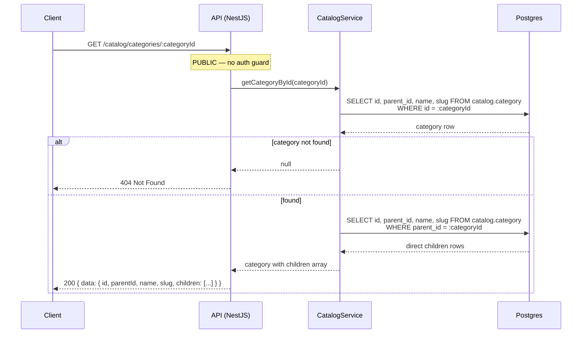
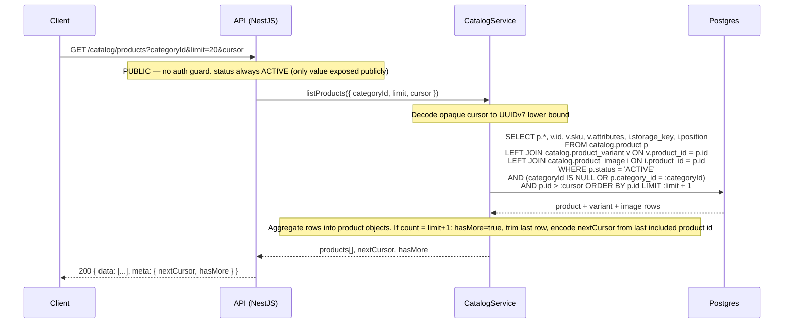
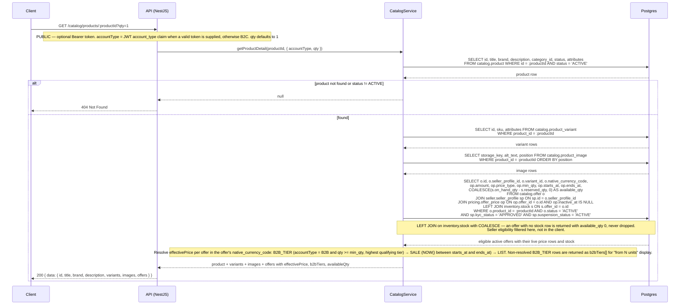
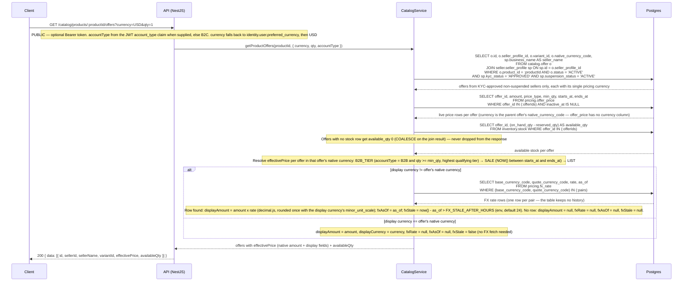

# Catalog API — Public Browse

**Status:** Complete  
**Module:** `Catalog`  
**Parent:** [API Design Index](../api-design.md)  
**Source of truth:** [BRD v1.2](../../requirements/BRD.md), [ERD](../data-model-erd.md)  
**Conventions:** [api-conventions.md](../../../conventions/api-conventions.md) — `operationId` naming (`<Module>_<verb><Resource>`), response envelope, cursor pagination, error shape, money-as-string  
**Correlation:** every endpoint accepts an `X-Correlation-ID` request header, generates a UUIDv7 when it is absent, echoes it on the response, and carries the same value into every log line and into the `correlation_id` field of every Kafka event envelope and `platform.outbox_event` row it writes — see [observability.md § Correlation ID](../../../conventions/observability.md#correlation-id).

---

## Summary

- [Endpoint Index](#endpoint-index)
- [DB Mapping](#db-mapping)
- [Endpoints](#endpoints)

<a id="endpoint-index"></a>
## Endpoint Index

| Method | Path | Auth | Description |
|--------|------|------|-------------|
| `GET` | [`/catalog/categories`](#list-categories) | PUBLIC | Full category tree |
| `GET` | [`/catalog/categories/:id`](#get-category) | PUBLIC | Single category with children |
| `GET` | [`/catalog/products`](#list-products-public-browse) | PUBLIC | Paginated product list |
| `GET` | [`/catalog/products/:id`](#get-product-detail) | PUBLIC | Product detail with active offers (account type read from JWT when supplied) |
| `GET` | [`/catalog/products/:id/offers`](#get-product-offers) | PUBLIC | All active offers for a product |

---

<a id="db-mapping"></a>
## DB Mapping

| Endpoint | Primary DB | Tables |
|----------|-----------|--------|
| `GET /catalog/categories` | Postgres | `catalog.category` (full tree read) |
| `GET /catalog/categories/:id` | Postgres | `catalog.category` (single + children) |
| `GET /catalog/products` | Postgres | `catalog.product`, `catalog.product_variant`, `catalog.product_image` |
| `GET /catalog/products/:id` | Postgres | `catalog.product`, `catalog.product_variant`, `catalog.product_image`, `catalog.offer`, `pricing.offer_price`, `inventory.stock`, `seller.seller_profile` |
| `GET /catalog/products/:id/offers` | Postgres | `catalog.offer`, `pricing.offer_price`, `pricing.fx_rate`, `inventory.stock`, `seller.seller_profile` |

**Note:** Catalog endpoints are read-only public routes. All writes go through the Seller API (`/seller/products`, `/seller/offers`). Elasticsearch is the search read model — see [search.md](search.md) for `/search/products`.

<a id="offer-currency-and-price-resolution"></a>
**Offer currency and price resolution.** Every offer has exactly one pricing currency, `catalog.offer.native_currency_code` (V1: `USD`, `THB`, `JPY`, `SGD`), and `pricing.offer_price` carries no currency column of its own — a price row's currency is always its parent offer's. There is therefore no currency ambiguity to resolve on a product page: `effectivePrice.currency` is always the offer's `native_currency_code`, and effective-price resolution reduces to picking a `price_type` by account type, current time, and quantity:

1. `B2B_TIER` — account type is `B2B` and `qty >= min_qty`; the highest qualifying `min_qty` wins.
2. `SALE` — a live row where `now()` falls between `starts_at` and `ends_at`.
3. `LIST` — the fallback; every offer always has exactly one active `LIST` row.

Rows with a non-null `inactive_at` never participate. Account type comes from the access-token `account_type` claim when a Bearer token is supplied and defaults to `B2C` otherwise; quantity defaults to 1. A B2B tier that a request does not qualify for is surfaced as "from N units" information, never as the effective price. See [pricing.md](pricing.md#get-effective-price) for the single-offer form of the same resolution.

**Seller eligibility.** Every offer-returning query filters on `seller.seller_profile.kyc_status = 'APPROVED' AND suspension_status = 'ACTIVE'`. Offers from unapproved or suspended sellers are not browsable.

---

<a id="endpoints"></a>
## Endpoints

### List categories

```
GET /catalog/categories
Tag: Catalog
Auth: PUBLIC
```
**Response 200**
```json
{
  "data": [{
    "id": "uuid",
    "parentId": "uuid | null",
    "name": "Electronics",
    "slug": "electronics",
    "children": [...]
  }]
}
```
Returns the full category tree (nested or flat with `parentId`). No pagination — category count bounded by taxonomy.

#### Sequence


```mermaid
sequenceDiagram
    participant Client
    participant API as API (NestJS)
    participant CatalogService
    participant Postgres

    Client->>API: GET /catalog/categories
    Note over API: PUBLIC — no auth guard
    API->>CatalogService: getCategories()
    CatalogService->>Postgres: SELECT id, parent_id, name, slug<br/>FROM catalog.category ORDER BY parent_id NULLS FIRST, name
    Postgres-->>CatalogService: category rows (flat list)
    Note over CatalogService: Assemble nested tree in memory (root nodes first#59; attach children by parent_id)
    CatalogService-->>API: nested category tree
    API-->>Client: 200 { data: [{ id, parentId, name, slug, children }] }
```

---

### Get category

```
GET /catalog/categories/:categoryId
Tag: Catalog
Auth: PUBLIC
```
**Response 200** — single category with children

#### Sequence


```mermaid
sequenceDiagram
    participant Client
    participant API as API (NestJS)
    participant CatalogService
    participant Postgres

    Client->>API: GET /catalog/categories/:categoryId
    Note over API: PUBLIC — no auth guard
    API->>CatalogService: getCategoryById(categoryId)
    CatalogService->>Postgres: SELECT id, parent_id, name, slug FROM catalog.category<br/>WHERE id = :categoryId
    Postgres-->>CatalogService: category row
    alt category not found
        CatalogService-->>API: null
        API-->>Client: 404 Not Found
    else found
        CatalogService->>Postgres: SELECT id, parent_id, name, slug FROM catalog.category<br/>WHERE parent_id = :categoryId
        Postgres-->>CatalogService: direct children rows
        CatalogService-->>API: category with children array
        API-->>Client: 200 { data: { id, parentId, name, slug, children: [...] } }
    end
```

---

### List products (public browse)

```
GET /catalog/products
Tag: Catalog
Auth: PUBLIC
Pagination: cursor
```
**Query params**
- `categoryId`: UUID
- `status`: `ACTIVE` (default, only value exposed publicly)
- `limit`, `cursor`

**Response 200**
```json
{
  "data": [{
    "id": "uuid",
    "title": "string",
    "brand": "string",
    "categoryId": "uuid",
    "status": "ACTIVE",
    "images": [{ "storageKey": "string", "position": 0 }],
    "variants": [{ "id": "uuid", "sku": "string", "attributes": {} }]
  }],
  "meta": { "nextCursor": "string | null", "hasMore": false }
}
```

#### Sequence


```mermaid
sequenceDiagram
    participant Client
    participant API as API (NestJS)
    participant CatalogService
    participant Postgres

    Client->>API: GET /catalog/products?categoryId&limit=20&cursor
    Note over API: PUBLIC — no auth guard. status always ACTIVE (only value exposed publicly)
    API->>CatalogService: listProducts({ categoryId, limit, cursor })
    Note over CatalogService: Decode opaque cursor to UUIDv7 lower bound
    CatalogService->>Postgres: SELECT p.*, v.id, v.sku, v.attributes, i.storage_key, i.position<br/>FROM catalog.product p<br/>LEFT JOIN catalog.product_variant v ON v.product_id = p.id<br/>LEFT JOIN catalog.product_image i ON i.product_id = p.id<br/>WHERE p.status = 'ACTIVE'<br/>AND (categoryId IS NULL OR p.category_id = :categoryId)<br/>AND p.id > :cursor ORDER BY p.id LIMIT :limit + 1
    Postgres-->>CatalogService: product + variant + image rows
    Note over CatalogService: Aggregate rows into product objects. If count = limit+1: hasMore=true, trim last row, encode nextCursor from last included product id
    CatalogService-->>API: products[], nextCursor, hasMore
    API-->>Client: 200 { data: [...], meta: { nextCursor, hasMore } }
```

---

### Get product detail

```
GET /catalog/products/:productId
Tag: Catalog
Auth: PUBLIC (optional Bearer token — `account_type` read from JWT claims when one is supplied)
```
**Response 200**
```json
{
  "data": {
    "id": "uuid",
    "title": "string",
    "brand": "string",
    "description": "string",
    "categoryId": "uuid",
    "status": "ACTIVE",
    "attributes": {},
    "variants": [{ "id": "uuid", "sku": "string", "attributes": {} }],
    "images": [{ "storageKey": "string", "altText": "string | null", "position": 0 }],
    "offers": [
      {
        "offerId": "uuid",
        "sellerId": "uuid",
        "variantId": "uuid | null",
        "variantLabel": "string | null",
        "effectivePrice": {
          "amount": "99.99",
          "currency": "USD",
          "priceType": "LIST | SALE | B2B_TIER",
          "saleEndsAt": "ISO8601 | null",
          "minQty": 1
        },
        "b2bTiers": [{ "minQty": 10, "amount": "89.99", "currency": "USD" }],
        "availableQty": 42,
        "status": "ACTIVE"
      }
    ]
  }
}
```
**Query params:** `qty` (integer ≥ 1, default 1) — the quantity the effective price is resolved for, so a B2B buyer sees the tier that applies to the quantity they intend to buy.

**Field semantics:**
- `effectivePrice.currency` is always the offer's `native_currency_code` — see [Offer currency and price resolution](#offer-currency-and-price-resolution). `amount` is a string (money-as-string convention).
- `effectivePrice.minQty` is the `min_qty` of the resolved row: `1` for `LIST` and `SALE`, the tier threshold for `B2B_TIER`.
- `b2bTiers[]` lists the offer's `B2B_TIER` rows that the request did **not** resolve to, so the page can render "from N units" information. Empty for offers with no tiers, and for a B2C caller it lists every tier the seller published.
- `availableQty` is `COALESCE(on_hand_qty - reserved_qty, 0)` — an offer with no `inventory.stock` row is returned with `availableQty: 0`, not omitted.
- No `currency` query param and no FX conversion on this endpoint. For a buyer display currency use `GET /catalog/products/:id/offers?currency=` or `GET /pricing/offers/:id/effective-price?currency=`.

**Errors:** 404

#### Sequence


```mermaid
sequenceDiagram
    participant Client
    participant API as API (NestJS)
    participant CatalogService
    participant Postgres

    Client->>API: GET /catalog/products/:productId?qty=1
    Note over API: PUBLIC — optional Bearer token. accountType = JWT account_type claim when a valid token is supplied, otherwise B2C. qty defaults to 1
    API->>CatalogService: getProductDetail(productId, { accountType, qty })
    CatalogService->>Postgres: SELECT id, title, brand, description, category_id, status, attributes<br/>FROM catalog.product WHERE id = :productId AND status = 'ACTIVE'
    Postgres-->>CatalogService: product row
    alt product not found or status != ACTIVE
        CatalogService-->>API: null
        API-->>Client: 404 Not Found
    else found
        CatalogService->>Postgres: SELECT id, sku, attributes FROM catalog.product_variant<br/>WHERE product_id = :productId
        Postgres-->>CatalogService: variant rows
        CatalogService->>Postgres: SELECT storage_key, alt_text, position FROM catalog.product_image<br/>WHERE product_id = :productId ORDER BY position
        Postgres-->>CatalogService: image rows
        CatalogService->>Postgres: SELECT o.id, o.seller_profile_id, o.variant_id, o.native_currency_code,<br/>op.amount, op.price_type, op.min_qty, op.starts_at, op.ends_at,<br/>COALESCE(s.on_hand_qty - s.reserved_qty, 0) AS available_qty<br/>FROM catalog.offer o<br/>JOIN seller.seller_profile sp ON sp.id = o.seller_profile_id<br/>JOIN pricing.offer_price op ON op.offer_id = o.id AND op.inactive_at IS NULL<br/>LEFT JOIN inventory.stock s ON s.offer_id = o.id<br/>WHERE o.product_id = :productId AND o.status = 'ACTIVE'<br/>AND sp.kyc_status = 'APPROVED' AND sp.suspension_status = 'ACTIVE'
        Note over CatalogService,Postgres: LEFT JOIN on inventory.stock with COALESCE — an offer with no stock row is returned with available_qty 0, never dropped.<br/>Seller eligibility filtered here, not in the client.
        Postgres-->>CatalogService: eligible active offers with their live price rows and stock
        Note over CatalogService: Resolve effectivePrice per offer in the offer's native_currency_code: B2B_TIER (accountType = B2B and qty >= min_qty, highest qualifying tier) → SALE (NOW() between starts_at and ends_at) → LIST. Non-resolved B2B_TIER rows are returned as b2bTiers[] for "from N units" display.
        CatalogService-->>API: product + variants + images + offers with effectivePrice, b2bTiers, availableQty
        API-->>Client: 200 { data: { id, title, brand, description, variants, images, offers } }
    end
```

---

### Get product offers

```
GET /catalog/products/:productId/offers
Tag: Catalog
Auth: PUBLIC
```
**Query params**
- `currency` (ISO 4217, optional — **buyer's display preference currency**; defaults to the caller's `identity.user.preferred_currency` when a Bearer token is supplied and that column is set, otherwise `USD`)
- `qty` (integer ≥ 1, default 1)

**Response 200**
```json
{
  "data": [{
    "id": "uuid",
    "sellerId": "uuid",
    "sellerName": "string",
    "variantId": "uuid | null",
    "status": "ACTIVE",
    "effectivePrice": {
      "amount": "99.99",
      "currency": "USD",
      "priceType": "LIST | SALE | B2B_TIER",
      "saleEndsAt": "ISO8601 | null",
      "minQty": 1,
      "displayAmount": "3440.00",
      "displayCurrency": "THB",
      "fxRate": "34.40000000",
      "fxAsOf": "ISO8601 | null",
      "fxStale": false
    },
    "availableQty": 10
  }]
}
```
**Field semantics:**
- `effectivePrice.amount` / `effectivePrice.currency` — the offer's `native_currency_code` and the amount of the resolved price row. There is one currency per offer, so no selection is required; see [Offer currency and price resolution](#offer-currency-and-price-resolution).
- `effectivePrice.displayAmount` / `displayCurrency` / `fxRate` / `fxAsOf` / `fxStale` — the same amount rendered in the buyer's requested display currency, converted with `pricing.fx_rate`. This is a **browse-time estimate only**; nothing here is ever captured on an order. The five keys are always present, with three cases:

  | Case | `displayAmount` | `displayCurrency` | `fxRate` | `fxAsOf` | `fxStale` |
  |---|---|---|---|---|---|
  | `?currency` equals the offer's native currency | echoes `amount` | echoes `currency` | `null` | `null` | `false` |
  | FX row exists for the pair | converted amount | requested currency | the rate | the row's `as_of` | `true` when `now() - as_of > FX_STALE_AFTER_HOURS` (env, default 24), else `false` |
  | no FX row exists for the pair | `null` | requested currency | `null` | `null` | `null` |

  A stale rate is still returned and still converted — the client labels it an indicative rate rather than hiding it. `displayAmount` is `null` only in the third case, and the client then shows the native amount alone. This is the single nullability contract shared with [`pricing.md`](pricing.md#get-effective-price), [`cart.md`](cart.md#get-cart) and [`search.md`](search.md#product-search).
- `availableQty` is `COALESCE(on_hand_qty - reserved_qty, 0)`.

**Errors:** 404 product not found, 422 `currency` not supported

#### Sequence


```mermaid
sequenceDiagram
    participant Client
    participant API as API (NestJS)
    participant CatalogService
    participant Postgres

    Client->>API: GET /catalog/products/:productId/offers?currency=USD&qty=1
    Note over API: PUBLIC — optional Bearer token. accountType from the JWT account_type claim when supplied, else B2C. currency falls back to identity.user.preferred_currency, then USD
    API->>CatalogService: getProductOffers(productId, { currency, qty, accountType })
    CatalogService->>Postgres: SELECT o.id, o.seller_profile_id, o.variant_id, o.native_currency_code,<br/>sp.business_name AS seller_name<br/>FROM catalog.offer o<br/>JOIN seller.seller_profile sp ON sp.id = o.seller_profile_id<br/>WHERE o.product_id = :productId AND o.status = 'ACTIVE'<br/>AND sp.kyc_status = 'APPROVED' AND sp.suspension_status = 'ACTIVE'
    Postgres-->>CatalogService: offers from KYC-approved non-suspended sellers only, each with its single pricing currency
    CatalogService->>Postgres: SELECT offer_id, amount, price_type, min_qty, starts_at, ends_at<br/>FROM pricing.offer_price<br/>WHERE offer_id IN (:offerIds) AND inactive_at IS NULL
    Postgres-->>CatalogService: live price rows per offer (currency is the parent offer's native_currency_code — offer_price has no currency column)
    CatalogService->>Postgres: SELECT offer_id, (on_hand_qty - reserved_qty) AS available_qty<br/>FROM inventory.stock WHERE offer_id IN (:offerIds)
    Note over CatalogService: Offers with no stock row get available_qty 0 (COALESCE on the join result) — never dropped from the response
    Postgres-->>CatalogService: available stock per offer
    Note over CatalogService: Resolve effectivePrice per offer in that offer's native currency: B2B_TIER (accountType = B2B and qty >= min_qty, highest qualifying tier) → SALE (NOW() between starts_at and ends_at) → LIST
    alt display currency != offer's native currency
        CatalogService->>Postgres: SELECT base_currency_code, quote_currency_code, rate, as_of<br/>FROM pricing.fx_rate<br/>WHERE (base_currency_code, quote_currency_code) IN (:pairs)
        Postgres-->>CatalogService: FX rate rows (one row per pair — the table keeps no history)
        Note over CatalogService: Row found: displayAmount = amount x rate (decimal.js, rounded once with the display currency's minor_unit_scale)#59; fxAsOf = as_of#59; fxStale = now() - as_of > FX_STALE_AFTER_HOURS (env, default 24). No row: displayAmount = null, fxRate = null, fxAsOf = null, fxStale = null.
    else display currency == offer's native currency
        Note over CatalogService: displayAmount = amount, displayCurrency = currency, fxRate = null, fxAsOf = null, fxStale = false (no FX fetch needed)
    end
    CatalogService-->>API: offers with effectivePrice (native amount + display fields) + availableQty
    API-->>Client: 200 { data: [{ id, sellerId, sellerName, variantId, effectivePrice, availableQty }] }
```
