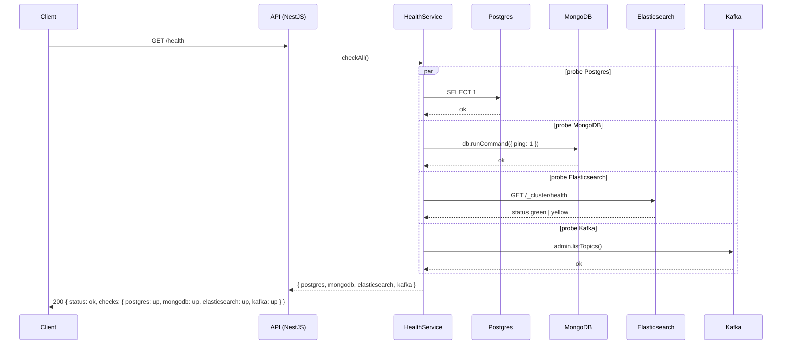

# Health API

**Module:** `Platform`  
**Parent:** [API Design Index](../api-design.md)

---

## Summary

- [Endpoint Index](#endpoint-index)
- [DB Mapping](#db-mapping)
- [Endpoints](#endpoints)

<a id="endpoint-index"></a>
## Endpoint Index

| Method | Path | Auth | Description |
|--------|------|------|-------------|
| `GET` | [`/health`](#health-check) | PUBLIC | Liveness + readiness probe — checks all 4 datastores in parallel |

---

<a id="db-mapping"></a>
## DB Mapping

| Endpoint | Datastores checked |
|----------|--------------------|
| `GET /health` | Postgres, MongoDB, Elasticsearch, Kafka |

---

<a id="endpoints"></a>
## Endpoints

### Health check

```
GET /health
Tag: Platform
Auth: PUBLIC
```
**Response 200**
```json
{
  "status": "ok",
  "checks": {
    "postgres": "up",
    "mongodb": "up",
    "elasticsearch": "up",
    "kafka": "up"
  }
}
```

#### Sequence


