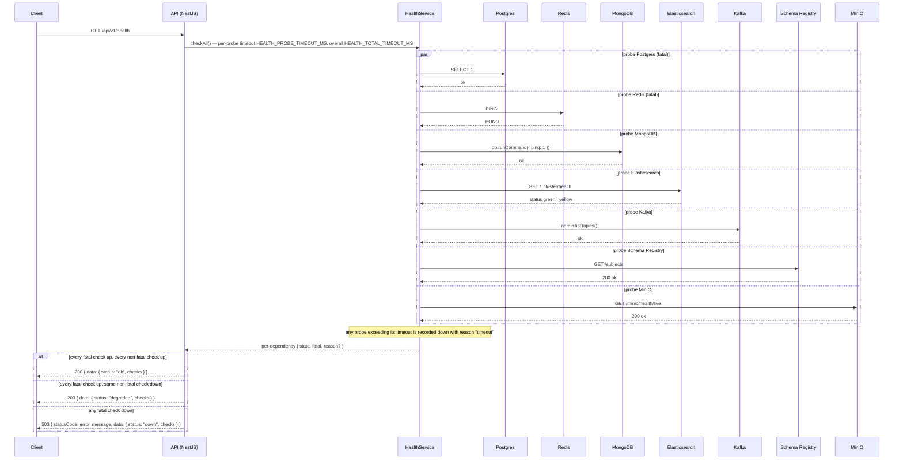

# Health API

**Status:** Complete  
**Module:** `Platform`  
**Parent:** [API Design Index](../api-design.md)  
**Source of truth:** [BRD v1.4](../../requirements/BRD.md), [docker-compose-topology](../docker-compose-topology.md)  
**Conventions:** [api-conventions.md](../../../conventions/api-conventions.md) — response envelope and error shape. Correlation-ID propagation, the error envelope and rate-limit headers apply to every endpoint in this document and are stated once in [api-design.md § 1 Conventions](../api-design.md#conventions). Neither probe is paginated and neither returns a monetary amount.

---

## Summary

- [Endpoint Index](#endpoint-index)
- [DB Mapping](#db-mapping) — [`api`](#api), [`workers`](#workers)
- [Endpoints](#endpoints) — [`api` health check](#health-check), [`workers` health check](#workers-health-check)

<a id="endpoint-index"></a>
## Endpoint Index

| Method | Path | Auth | Description |
|--------|------|------|-------------|
| `GET` | [`/health`](#health-check) | PUBLIC | `api` liveness + readiness probe — probes every runtime dependency in parallel |
| `GET` | [`/health`](#workers-health-check) | PUBLIC | `workers` liveness + readiness probe — dependencies plus scheduler, consumer and relay state |

**Path:** the endpoint is mounted under the global prefix, so the absolute path is `/api/v1/health` — the path the compose healthcheck targets. There is no unversioned alias.

**Two processes, one route name.** `api` and `workers` are separate containers and each answers `/api/v1/health` on its own port — `api` on `PORT` (3000), `workers` on `PORT_WORKERS` (3001), both from [docker-compose-topology.md](../docker-compose-topology.md). Only the `api` route is proxied by nginx; the `workers` route is reachable on the `aliceut_backend` network only, by the compose healthcheck and by Prometheus. They are documented as two endpoints because they assert different things: the `api` probe answers "can this process serve a request", the `workers` probe answers "is this process actually doing its background work".

**Single endpoint, two questions.** One route answers both liveness and readiness; the caller distinguishes them by the `fatal` flag on each check rather than by hitting a second path:

- **Liveness** — is the process itself alive? Answered by the response arriving at all. No dependency can make the process fail this: a container is never restarted because Elasticsearch is down.
- **Readiness** — can the process serve traffic? `status` is `ok` only when every check marked `fatal: true` is `up`. A non-fatal dependency being `down` yields `status: "degraded"` with HTTP `200`, so the container keeps serving the traffic it still can.

---

<a id="db-mapping"></a>
## DB Mapping

### `api`

| Endpoint | Dependency | Probe | Fatal |
|----------|-----------|-------|-------|
| `GET /health` (`api`) | Postgres | `SELECT 1` | Yes — no request can be served without it |
| | Redis | `PING` | Yes — `JwtAuthGuard` reads `auth:revoke_before:{userId}` on every authenticated request ([auth-jwt-design § Auth guards](../../../conventions/auth-jwt-design.md#auth-guards)) |
| | MongoDB | `db.runCommand({ ping: 1 })` | No — only the audit and activity consumers write to it |
| | Elasticsearch | `GET /_cluster/health` | No — search degrades to unavailable; catalog browse still works from Postgres |
| | Kafka | `admin.listTopics()` | No — the outbox relay retries; API writes still commit |
| | Schema Registry | `GET /subjects` | No — same reasoning as Kafka; the relay cannot serialize until it returns |
| | MinIO | `mc ready` equivalent — `GET /minio/health/live` | No — image and document upload fails; the rest of the API is unaffected |

Seven dependencies are probed. The list is maintained against the service list in [docker-compose-topology.md](../docker-compose-topology.md) — do not state a count anywhere else in this document, so the two cannot drift.

### `workers`

| Endpoint | Check | Probe | Fatal |
|----------|-------|-------|-------|
| `GET /health` (`workers`) | Postgres | `SELECT 1` | Yes — every scheduled job, the outbox relay and every consumer's side effect write to it |
| | Kafka | `admin.listTopics()` | Yes — unlike `api`, a worker with no broker has nothing to do; it cannot consume and the relay cannot publish |
| | Schema Registry | `GET /subjects` | Yes — the relay cannot serialize Avro without it, so the outbox drains nowhere |
| | MongoDB | `db.runCommand({ ping: 1 })` | No — the audit and activity consumers stall; the domain consumers keep working |
| | Elasticsearch | `GET /_cluster/health` | No — the search consumer stalls; its offsets are retained and it catches up |
| | MinIO | `GET /minio/health/live` | No — no worker writes objects |
| | SMTP (Mailpit) | TCP connect to `SMTP_HOST:SMTP_PORT` | No — the notification consumer retries; a stalled email queue must not take the process down |
| | Scheduler | last tick of the shortest-interval job within `WORKERS_SCHEDULER_STALE_MS` | Yes — a dead `@nestjs/schedule` timer is invisible from outside, and it is the failure the probe exists to catch |
| | Consumers | every declared consumer group has at least one assigned partition | Yes — an unassigned group is a silently stopped consumer |
| | Outbox relay | `pg_try_advisory_lock` state for the relay's lock id | No — see the note below |

The fatal set differs from `api` deliberately. `api` can serve catalog reads with Kafka down; `workers` exists only to run consumers and scheduled jobs, so the same dependency is fatal there.

**Relay lock is reported, not fatal.** The relay is single-instance by advisory lock. The check reports whether **this** process holds the lock, so at the V1 replica count of 1 a `false` means the relay is not draining. It is non-fatal because the remedy is not to stop answering — a container marked unhealthy is not restarted under `restart: unless-stopped`, and the lock is session-scoped, so the useful signal is the alert and the lag gauge below, not a failed probe. `status` is `degraded` in that state, which is visible in `docker compose ps` and scrapeable.

---

<a id="endpoints"></a>
## Endpoints

### Health check

```
GET /health
Tag: Platform
Auth: PUBLIC
```

**Access:** the route is `PUBLIC` because the container orchestrator probes it without credentials. It is reachable from the internet through the nginx `/api/` proxy, and the response names the platform's datastores. That is accepted for V1: the names are already public in this repository, and no version, host, port or credential is returned. The response body must never grow to include one.

**Probe budget:** every dependency is probed in parallel with a per-probe timeout of `HEALTH_PROBE_TIMEOUT_MS` (env, default 2000 ms) and an overall budget of `HEALTH_TOTAL_TIMEOUT_MS` (env, default 5000 ms) — both inside the 10 s compose healthcheck timeout. A probe that exceeds its timeout is reported `down` with `"reason": "timeout"`; it never leaves the request hanging.

**Response 200** — every fatal check up
```json
{
  "data": {
    "status": "ok",
    "checks": {
      "postgres": { "state": "up", "fatal": true },
      "redis": { "state": "up", "fatal": true },
      "mongodb": { "state": "up", "fatal": false },
      "elasticsearch": { "state": "up", "fatal": false },
      "kafka": { "state": "up", "fatal": false },
      "schemaRegistry": { "state": "up", "fatal": false },
      "minio": { "state": "up", "fatal": false }
    }
  }
}
```

**Response 200** — a non-fatal dependency is down
```json
{
  "data": {
    "status": "degraded",
    "checks": {
      "postgres": { "state": "up", "fatal": true },
      "redis": { "state": "up", "fatal": true },
      "mongodb": { "state": "up", "fatal": false },
      "elasticsearch": { "state": "down", "fatal": false, "reason": "connect ECONNREFUSED" },
      "kafka": { "state": "up", "fatal": false },
      "schemaRegistry": { "state": "up", "fatal": false },
      "minio": { "state": "up", "fatal": false }
    }
  }
}
```

**Response 503** — a fatal dependency is down; the process is alive but not ready
```json
{
  "statusCode": 503,
  "error": "Service Unavailable",
  "message": "One or more required dependencies are unavailable",
  "data": {
    "status": "down",
    "checks": {
      "postgres": { "state": "down", "fatal": true, "reason": "timeout" },
      "redis": { "state": "up", "fatal": true },
      "mongodb": { "state": "up", "fatal": false },
      "elasticsearch": { "state": "up", "fatal": false },
      "kafka": { "state": "up", "fatal": false },
      "schemaRegistry": { "state": "up", "fatal": false },
      "minio": { "state": "up", "fatal": false }
    }
  }
}
```

`reason` carries the probe's error text, truncated to 200 characters. It never carries a connection string, credential, or stack trace.

#### Sequence


```mermaid
sequenceDiagram
    participant C as Client
    participant API as API (NestJS)
    participant HS as HealthService
    participant PG as Postgres
    participant R as Redis
    participant MDB as MongoDB
    participant ES as Elasticsearch
    participant KF as Kafka
    participant SR as Schema Registry
    participant MN as MinIO

    C->>API: GET /api/v1/health
    API->>HS: checkAll() — per-probe timeout HEALTH_PROBE_TIMEOUT_MS, overall HEALTH_TOTAL_TIMEOUT_MS
    par probe Postgres (fatal)
        HS->>PG: SELECT 1
        PG-->>HS: ok
    and probe Redis (fatal)
        HS->>R: PING
        R-->>HS: PONG
    and probe MongoDB
        HS->>MDB: db.runCommand({ ping: 1 })
        MDB-->>HS: ok
    and probe Elasticsearch
        HS->>ES: GET /_cluster/health
        ES-->>HS: status green | yellow
    and probe Kafka
        HS->>KF: admin.listTopics()
        KF-->>HS: ok
    and probe Schema Registry
        HS->>SR: GET /subjects
        SR-->>HS: 200 ok
    and probe MinIO
        HS->>MN: GET /minio/health/live
        MN-->>HS: 200 ok
    end
    Note over HS: any probe exceeding its timeout is recorded down with reason "timeout"

    HS-->>API: per-dependency { state, fatal, reason? }
    alt every fatal check up, every non-fatal check up
        API-->>C: 200 { data: { status: "ok", checks } }
    else every fatal check up, some non-fatal check down
        API-->>C: 200 { data: { status: "degraded", checks } }
    else any fatal check down
        API-->>C: 503 { statusCode, error, message, data: { status: "down", checks } }
    end
```

---

<a id="workers-health-check"></a>
### Workers health check

```
GET /health
Tag: Platform
Auth: PUBLIC
Process: workers (PORT_WORKERS, default 3001)
```

**Path.** The absolute path is `/api/v1/health`, exactly as on `api`: the `workers` bootstrap applies the same global prefix, so the prefix is not something the `api` process adds on its own. The compose healthcheck therefore targets `http://localhost:${PORT_WORKERS}/api/v1/health`, and there is no unversioned alias on this process either. The block above names the route, not the mounted path — the same convention the `api` endpoint follows.

**Why the workers process serves HTTP at all.** It has no API surface, but it needs a listener for two reasons that already exist in the topology: the compose healthcheck has nothing else to call, and Prometheus scrapes `METRICS_PATH` (`/metrics`) on `workers` as well as on `api`. One minimal HTTP server carries both routes. `PORT_WORKERS` is already declared for this container and is not published to the host.

**Access:** `PUBLIC` in the same sense as the `api` probe, and materially narrower in reach — `workers` is on `aliceut_backend` only and is behind no nginx proxy, so the route is not reachable from the internet at all.

**What "healthy" asserts.** A background process that has silently stopped working looks identical from outside to one that is idle because there is nothing to do. The three checks that are unique to `workers` exist to tell those apart:

| Check | Reports | Healthy means |
|---|---|---|
| `scheduler` | `lastTickAt` of the shortest-interval registered job, and the count of registered jobs | A tick landed within `WORKERS_SCHEDULER_STALE_MS` (env, default 3× the shortest configured job interval). The registered-job count is reported so a job silently missing from the registry is visible. It counts `@Cron`/`@Interval`-decorated **methods**, not scheduler files, so it is larger than the file list in [backend-module-architecture.md § Scheduled tasks](../backend-module-architecture.md#scheduled-tasks) — `cleanup.scheduler.ts` carries one method per retention target — and larger than the retention view in [cleanup-jobs.md](../cleanup-jobs.md), which omits the jobs that are not deletes. Compare the reported figure against the scheduled-task list rather than against a number written down here. |
| `consumers` | per consumer group: `assignedPartitions` and `lastEventAt` | Every group the process declares is connected and holds an assignment. `lastEventAt` is reported but never fails the check — a quiet topic is normal and must not read as broken. |
| `outboxRelay` | `lockHeld`, `pendingCount`, `oldestPendingAgeMs` | This process holds the relay advisory lock and the backlog is draining. `pendingCount` is `SELECT count(*) … WHERE publication_status = 'PENDING'`, so it is the same number the gauge exposes. |

Consumer groups are not listed here. The authoritative list is in [backend-module-architecture.md](../backend-module-architecture.md); the probe enumerates whatever the process registered at boot, so a group added there needs no edit in this document.

**Probe budget:** the same two env vars as the `api` probe — `HEALTH_PROBE_TIMEOUT_MS` per probe, `HEALTH_TOTAL_TIMEOUT_MS` overall. The scheduler, consumer and relay checks read in-process state and a single Postgres count, so they cost no network round trip beyond the one.

**Response 200** — every fatal check up
```json
{
  "data": {
    "status": "ok",
    "checks": {
      "postgres": { "state": "up", "fatal": true },
      "kafka": { "state": "up", "fatal": true },
      "schemaRegistry": { "state": "up", "fatal": true },
      "mongodb": { "state": "up", "fatal": false },
      "elasticsearch": { "state": "up", "fatal": false },
      "minio": { "state": "up", "fatal": false },
      "smtp": { "state": "up", "fatal": false },
      "scheduler": { "state": "up", "fatal": true, "registeredJobs": 14, "lastTickAt": "ISO8601" },
      "consumers": { "state": "up", "fatal": true, "groups": [{ "group": "string", "assignedPartitions": 1, "lastEventAt": "ISO8601 | null" }] },
      "outboxRelay": { "state": "up", "fatal": false, "lockHeld": true, "pendingCount": 0, "oldestPendingAgeMs": 0 }
    }
  }
}
```

**Response 200** — the relay is not draining
```json
{
  "data": {
    "status": "degraded",
    "checks": {
      "outboxRelay": { "state": "down", "fatal": false, "lockHeld": false, "pendingCount": 1842, "oldestPendingAgeMs": 92000, "reason": "advisory lock not held" }
    }
  }
}
```
Only the changed check is shown; the response always carries the full set.

**Response 503** — the scheduler has stopped ticking
```json
{
  "statusCode": 503,
  "error": "Service Unavailable",
  "message": "One or more required dependencies are unavailable",
  "data": {
    "status": "down",
    "checks": {
      "scheduler": { "state": "down", "fatal": true, "registeredJobs": 14, "lastTickAt": "ISO8601", "reason": "no tick within WORKERS_SCHEDULER_STALE_MS" }
    }
  }
}
```

`reason` is truncated to 200 characters and never carries a connection string, credential or stack trace — the same rule as the `api` probe.

**Metrics.** The Prometheus gauges the outbox depends on are exposed on `METRICS_PATH` by this process, reading the same values the probe reports:

**`METRICS_PATH` is outside the global prefix**, unlike the health route: the default `/metrics` is the whole path, not `/api/v1/metrics`. The Prometheus scrape config carries the path as a literal and performs no variable substitution ([observability.md § Metrics](../../../conventions/observability.md#metrics)), so the environment variable has to name the route in full — with a prefix silently prepended, setting `METRICS_PATH=/foo` would serve `/api/v1/foo` and the variable would no longer name the path it configures. The health route is versioned because its body is a response contract that can change shape; Prometheus exposition format is not a contract this project versions.

| Metric | Type | Meaning |
|---|---|---|
| `aliceut_outbox_pending` | gauge | Rows in `platform.outbox_event` with `publication_status = 'PENDING'` |
| `aliceut_outbox_oldest_pending_age_seconds` | gauge | Age of the oldest such row — the actual lag signal, since a steady small `pending` count with a growing age means the relay is stuck rather than busy |
| `aliceut_outbox_failed` | gauge | Rows with `publication_status = 'FAILED'` |
| `aliceut_outbox_relay_lock_held` | gauge | `1` when this process holds the relay advisory lock, `0` otherwise |
| `aliceut_consumer_assigned_partitions` | gauge | Labelled by consumer group; `0` is the stopped-consumer signal |

Label cardinality follows [observability.md § Metrics](../../../conventions/observability.md#metrics). Consumer group is a bounded label set; no metric is labelled by user, order, offer or correlation id.

#### Sequence


```mermaid
sequenceDiagram
    participant HC as Compose healthcheck / Prometheus
    participant W as Workers HTTP listener
    participant HS as HealthService
    participant SCH as Scheduler registry
    participant CON as Consumer registry
    participant PG as Postgres
    participant KF as Kafka
    participant SR as Schema Registry
    participant MDB as MongoDB
    participant ES as Elasticsearch
    participant MN as MinIO
    participant SM as SMTP (Mailpit)

    HC->>W: GET /api/v1/health
    W->>HS: checkAll() — per-probe timeout HEALTH_PROBE_TIMEOUT_MS, overall HEALTH_TOTAL_TIMEOUT_MS
    par probe Postgres (fatal)
        HS->>PG: SELECT 1
    and probe Kafka (fatal)
        HS->>KF: admin.listTopics()
    and probe Schema Registry (fatal)
        HS->>SR: GET /subjects
    and probe MongoDB
        HS->>MDB: db.runCommand({ ping: 1 })
    and probe Elasticsearch
        HS->>ES: GET /_cluster/health
    and probe MinIO
        HS->>MN: GET /minio/health/live
    and probe SMTP
        HS->>SM: TCP connect SMTP_HOST:SMTP_PORT
    and check scheduler (fatal)
        HS->>SCH: registeredJobs, lastTickAt of the shortest-interval job
        Note over HS,SCH: down when NOW() - lastTickAt > WORKERS_SCHEDULER_STALE_MS
    and check consumers (fatal)
        HS->>CON: per group assignedPartitions, lastEventAt
        Note over HS,CON: down when any declared group has 0 assigned partitions&#59; a quiet topic is not a failure
    and check outbox relay
        HS->>PG: SELECT count(*), min(created_at) FROM platform.outbox_event WHERE publication_status = 'PENDING'
        HS->>HS: read relay advisory-lock state for this process
    end

    HS-->>W: per-check { state, fatal, reason?, detail }
    alt every fatal check up, every non-fatal check up
        W-->>HC: 200 { data: { status: "ok", checks } }
    else every fatal check up, some non-fatal check down
        W-->>HC: 200 { data: { status: "degraded", checks } }
    else any fatal check down
        W-->>HC: 503 { statusCode, error, message, data: { status: "down", checks } }
    end
```
