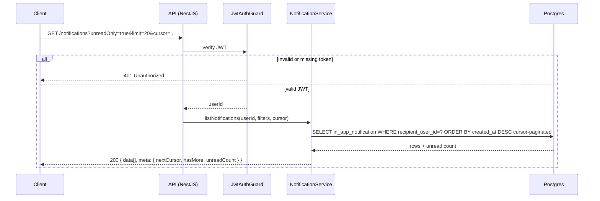
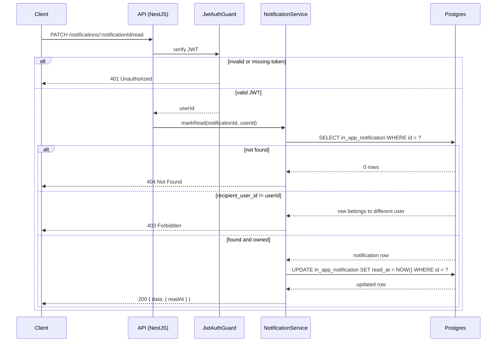
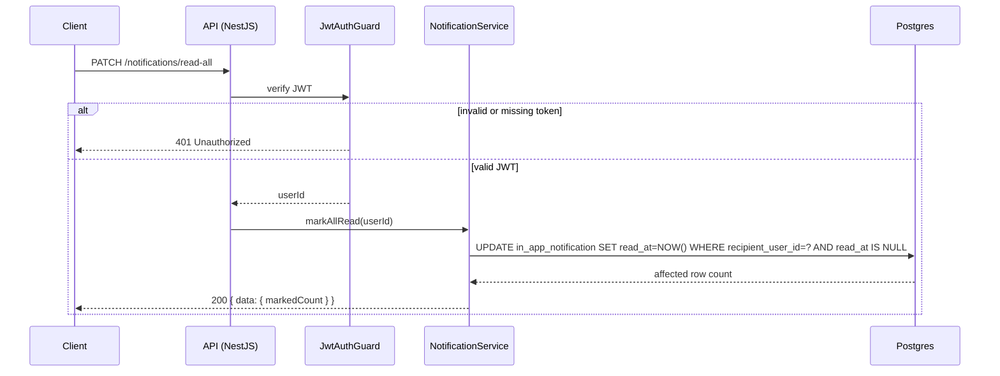
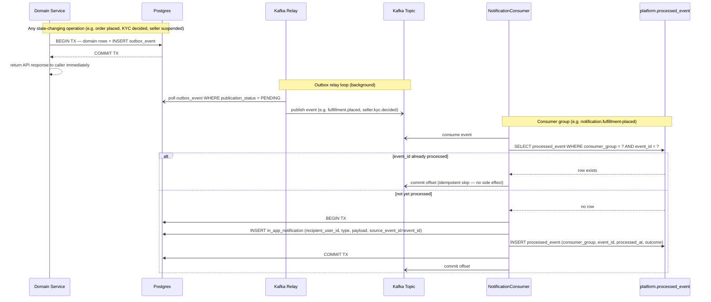

# Notifications API

**Module:** `Notifications`  
**Parent:** [API Design Index](../api-design.md)  
**Source of truth:** [BRD v1.1](../../requirements/BRD.md), [ERD](../data-model-erd.md)

---

## Summary

- [Endpoint Index](#endpoint-index)
- [DB Mapping](#db-mapping)
- [Endpoints](#endpoints)
- [Notification Creation (Async)](#notification-creation-async)

<a id="endpoint-index"></a>
## Endpoint Index

| Method | Path | Auth | Description |
|--------|------|------|-------------|
| `GET` | [`/notifications`](#list-in-app-notifications) | JWT | List notifications (cursor-paginated, optional unread filter) |
| `PATCH` | [`/notifications/:id/read`](#mark-notification-read) | JWT | Mark single notification read |
| `PATCH` | [`/notifications/read-all`](#mark-all-notifications-read) | JWT | Bulk mark all unread notifications read |

See [Notification Creation (Async)](#notification-creation-async) for the Kafka consumer write path — notifications are never written by API handlers.

---

<a id="db-mapping"></a>
## DB Mapping

| Endpoint | Primary DB | Tables / Notes |
|----------|-----------|----------------|
| `GET /notifications` | Postgres | `notifications.in_app_notification` (filter by `recipient_user_id`; index on `(recipient_user_id, read_at)`) |
| `PATCH /notifications/:id/read` | Postgres | `notifications.in_app_notification` (set `read_at`) |
| `PATCH /notifications/read-all` | Postgres | `notifications.in_app_notification` (bulk update `read_at` where `recipient_user_id = ?` and `read_at IS NULL`) |

**Write path (async):** Notification rows are created by Kafka consumers reacting to domain events — never written inline by API handlers. See kafka-events convention for event → notification type mapping.

---

<a id="endpoints"></a>
## Endpoints

### List in-app notifications

```
GET /notifications
Tag: Notifications
Auth: JWT
Pagination: cursor
```
**Query params:** `unreadOnly` (boolean), `limit`, `cursor`  
**Response 200**
```json
{
  "data": [{
    "id": "uuid",
    "type": "ORDER_PLACED | SHIPMENT_UPDATE | DELIVERY_UPDATE | KYC_DECIDED | KYC_SUBMITTED | LOW_STOCK | LISTING_FLAGGED | LISTING_REMOVED | SELLER_SUSPENDED | SELLER_REINSTATED | REFUND_ISSUED | ORDER_COMPLETED | FULFILLMENT_CANCELLED | SUSPENSION_EXPIRED",
    "payload": {},
    "readAt": "ISO8601 | null",
    "createdAt": "ISO8601"
  }],
  "meta": { "nextCursor": "string | null", "hasMore": false, "unreadCount": 3 }
}
```

#### Sequence



---

### Mark notification read

```
PATCH /notifications/:notificationId/read
Tag: Notifications
Auth: JWT
```
**Response 200** `{ "data": { "readAt": "ISO8601" } }`  
**Errors:** 404, 403

#### Sequence



---

### Mark all notifications read

```
PATCH /notifications/read-all
Tag: Notifications
Auth: JWT
```
**Response 200** `{ "data": { "markedCount": 5 } }`

#### Sequence



---

<a id="notification-creation-async"></a>
## Notification Creation (Async)

Notification rows are never written by API handlers. They are created exclusively by Kafka consumers reacting to domain events. The diagram below shows the full async path, including consumer-side idempotency using `platform.processed_event`.



**Notification types and their source events**

| Notification type | Source event |
|---|---|
| `ORDER_PLACED` | `fulfillment.placed` |
| `SHIPMENT_UPDATE` | `fulfillment.shipped` |
| `DELIVERY_UPDATE` | `fulfillment.delivered` |
| `KYC_DECIDED` | `seller.kyc.decided` |
| `KYC_SUBMITTED` | `seller.kyc.submitted` |
| `LOW_STOCK` | `inventory.low_stock` |
| `LISTING_REMOVED` | `moderation.listing.removed` |
| `SELLER_SUSPENDED` | `seller.suspended` |
| `SELLER_REINSTATED` | `seller.reinstated` |
| `REFUND_ISSUED` | `fulfillment.refunded`, `fulfillment.refund_suspended_seller` (§1.17 — distinct topic for auto-refunds triggered by seller suspension) |
| `ORDER_COMPLETED` | `order.completed` |
| `LISTING_FLAGGED` | `listing.flagged` |
| `FULFILLMENT_CANCELLED` | `fulfillment.cancelled` |
| `SUSPENSION_EXPIRED` | `seller.suspension_expired` |
