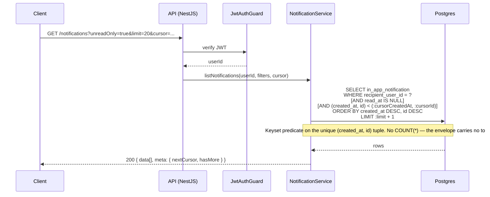
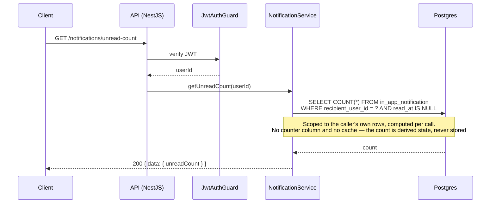
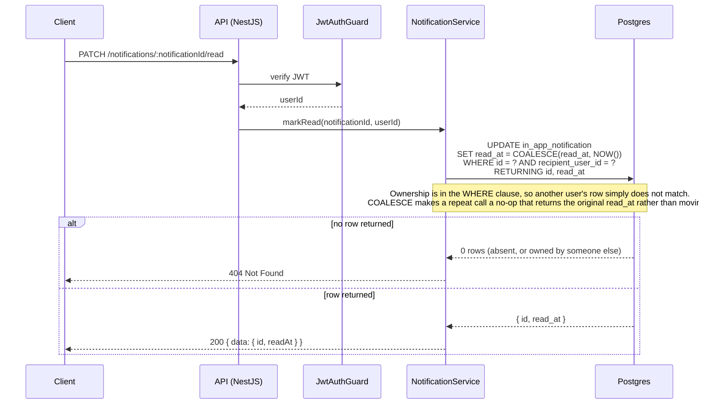
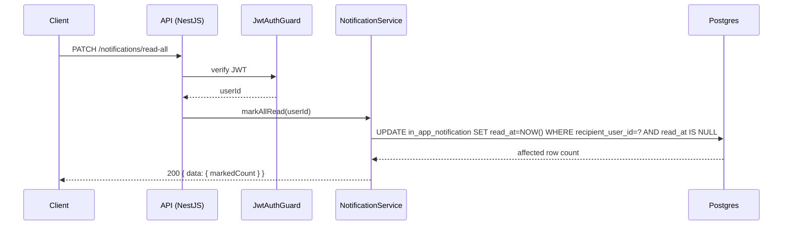
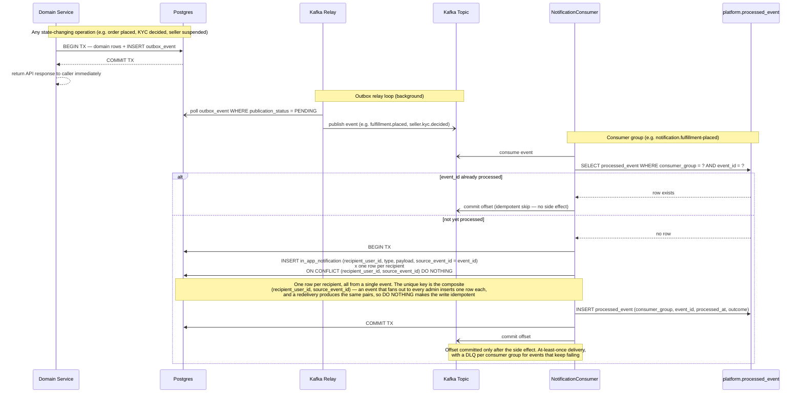

# Notifications API

**Status:** Complete  
**Module:** `Notifications`  
**Parent:** [API Design Index](../api-design.md)  
**Source of truth:** [BRD v1.4](../../requirements/BRD.md), [ERD](../data-model-erd.md)  
**Conventions:** [api-conventions.md](../../../conventions/api-conventions.md) — `operationId` naming (`<Module>_<verb><Resource>`), response envelope, cursor pagination, error shape, money-as-string. Correlation-ID propagation, the error envelope and rate-limit headers apply to every endpoint in this document and are stated once in [api-design.md § 1 Conventions](../api-design.md#conventions). A consumer carries the `correlation_id` of the event it is processing into the log lines it writes.

---

## Summary

- [Endpoint Index](#endpoint-index)
- [DB Mapping](#db-mapping)
- [Endpoints](#endpoints)
- [Notification Creation (Async)](#notification-creation-async)

<a id="endpoint-index"></a>
## Endpoint Index

| Method | Path | Auth | Description |
|--------|------|------|-------------|
| `GET` | [`/notifications`](#list-in-app-notifications) | JWT | List notifications (cursor-paginated, optional unread filter) |
| `GET` | [`/notifications/unread-count`](#get-unread-count) | JWT | Unread count for the header bell badge |
| `PATCH` | [`/notifications/:id/read`](#mark-notification-read) | JWT | Mark single notification read |
| `PATCH` | [`/notifications/read-all`](#mark-all-notifications-read) | JWT | Bulk mark all unread notifications read |

See [Notification Creation (Async)](#notification-creation-async) for the Kafka consumer write path — notifications are never written by API handlers.

---

<a id="db-mapping"></a>
## DB Mapping

| Endpoint | Primary DB | Tables / Notes |
|----------|-----------|----------------|
| `GET /notifications` | Postgres | `notifications.in_app_notification` (filter by `recipient_user_id`; partial index on `(recipient_user_id, read_at) WHERE read_at IS NULL`, plus `(recipient_user_id, created_at, id)` for the cursor sort key) |
| `GET /notifications/unread-count` | Postgres | `notifications.in_app_notification` (`COUNT(*)` over the same partial index) |
| `PATCH /notifications/:id/read` | Postgres | `notifications.in_app_notification` (set `read_at`) |
| `PATCH /notifications/read-all` | Postgres | `notifications.in_app_notification` (bulk update `read_at` where `recipient_user_id = ?` and `read_at IS NULL`) |

**Write path (async):** Notification rows are created by Kafka consumers reacting to domain events — never written inline by API handlers. See kafka-events convention for event → notification type mapping.

**Fan-out and uniqueness.** `notifications.in_app_notification` is unique on the composite **`(recipient_user_id, source_event_id)`**, not on `source_event_id` alone. One event legitimately fans out to several recipients — every admin receives `KYC_SUBMITTED` from a single `seller.kyc.submitted` event — and a unique key on the event id by itself would let only the first recipient's row be inserted. The composite key still gives the consumer all the idempotency it needs, because a redelivered event produces the same `(recipient, event)` pair per recipient. `payload` stays `JSONB`.

---

<a id="endpoints"></a>
## Endpoints

> **`API->>JG: verify JWT` in every sequence below** stands for the same check: a
> missing, invalid or expired access token is `401 Unauthorized` and the handler is
> never reached. No route here is role-scoped — every authenticated user reads their
> own notifications ([auth-jwt-design § 4](../../../conventions/auth-jwt-design.md#auth-guards)).

### List in-app notifications

```
GET /notifications
Tag: Notifications
Auth: JWT
Pagination: cursor
```
**Query params:** `unreadOnly` (boolean), `limit`, `cursor`  
**Response 200**
```json
{
  "data": [{
    "id": "uuid",
    "type": "ORDER_PLACED | SHIPMENT_UPDATE | DELIVERY_UPDATE | KYC_DECIDED | KYC_SUBMITTED | LOW_STOCK | LISTING_FLAGGED | LISTING_REMOVED | SELLER_SUSPENDED | SELLER_REINSTATED | REFUND_ISSUED | ORDER_COMPLETED | FULFILLMENT_CANCELLED | SUSPENSION_EXPIRED",
    "payload": {},
    "readAt": "ISO8601 | null",
    "createdAt": "ISO8601"
  }],
  "meta": { "nextCursor": "string | null", "hasMore": false }
}
```
`meta` carries `nextCursor` and `hasMore` and nothing else — [api-conventions § Pagination](../../../conventions/api-conventions.md#pagination) permits no other key on a list response and no `total`. The sort key is `(created_at, id)` descending; `created_at` alone is not unique, and two notifications written by the same consumer transaction share a timestamp, so a cursor without the id tiebreak can skip or repeat a row.

#### Sequence


```mermaid
sequenceDiagram
    participant C as Client
    participant API as API (NestJS)
    participant JG as JwtAuthGuard
    participant S as NotificationService
    participant PG as Postgres

    C->>API: GET /notifications?unreadOnly=true&limit=20&cursor=...
    API->>JG: verify JWT
    JG-->>API: userId
    API->>S: listNotifications(userId, filters, cursor)
    S->>PG: SELECT in_app_notification<br/>WHERE recipient_user_id = ?<br/>  [AND read_at IS NULL]<br/>  [AND (created_at, id) < (:cursorCreatedAt, :cursorId)]<br/>ORDER BY created_at DESC, id DESC<br/>LIMIT :limit + 1
    Note over S,PG: Keyset predicate on the unique (created_at, id) tuple. No COUNT(*) — the envelope carries no total
    PG-->>S: rows
    S-->>C: 200 { data[], meta: { nextCursor, hasMore } }
```

---

<a id="get-unread-count"></a>
### Get unread count

```
GET /notifications/unread-count
Tag: Notifications
Auth: JWT
```
**Response 200** `{ "data": { "unreadCount": 5 } }`

The header bell badge needs a count that is not bounded by the current page, and [api-conventions § Pagination](../../../conventions/api-conventions.md#pagination) permits no extra `meta` key and no total on `GET /notifications`, so the count is its own read rather than a field smuggled onto the list envelope.

The value is computed on every call — `COUNT(*)` over the caller's own rows where `read_at IS NULL`, served by the partial index on `(recipient_user_id, read_at) WHERE read_at IS NULL`. There is **no denormalized counter column and no cached count**: a stored counter is a second source of truth that drifts the moment a mark-read, a bulk mark-read and a consumer insert interleave, and the count it would replace is a single indexed aggregate over one user's unread rows. The clients that render it are the notification bell in all three portals ([shared-components.md § Notification bell](../../ui-design/shared-components.md)), which caps the displayed figure at `99+` without changing the number returned here.

**Errors:** 401 — missing or invalid token. There is no 404: a user with no notifications has an unread count of `0`.

#### Sequence


```mermaid
sequenceDiagram
    participant C as Client
    participant API as API (NestJS)
    participant JG as JwtAuthGuard
    participant S as NotificationService
    participant PG as Postgres

    C->>API: GET /notifications/unread-count
    API->>JG: verify JWT
    JG-->>API: userId
    API->>S: getUnreadCount(userId)
    S->>PG: SELECT COUNT(*) FROM in_app_notification<br/>WHERE recipient_user_id = ? AND read_at IS NULL
    Note over S,PG: Scoped to the caller's own rows, computed per call.<br/>No counter column and no cache — the count is derived state, never stored
    PG-->>S: count
    S-->>C: 200 { data: { unreadCount } }
```

---

### Mark notification read

```
PATCH /notifications/:notificationId/read
Tag: Notifications
Auth: JWT
```
**Response 200** `{ "data": { "id": "uuid", "readAt": "ISO8601" } }`

`id` is echoed so a client updating an already-rendered list has a key to match the row against; a bare timestamp identifies nothing.

**Errors:** 404 — not found, or the notification belongs to another user. Ownership is part of the lookup predicate rather than a check after the read, so a foreign notification is indistinguishable from a nonexistent one and the endpoint never confirms that someone else's id exists. There is no `403`.

#### Sequence


```mermaid
sequenceDiagram
    participant C as Client
    participant API as API (NestJS)
    participant JG as JwtAuthGuard
    participant S as NotificationService
    participant PG as Postgres

    C->>API: PATCH /notifications/:notificationId/read
    API->>JG: verify JWT
    JG-->>API: userId
    API->>S: markRead(notificationId, userId)
    S->>PG: UPDATE in_app_notification<br/>SET read_at = COALESCE(read_at, NOW())<br/>WHERE id = ? AND recipient_user_id = ?<br/>RETURNING id, read_at
    Note over S,PG: Ownership is in the WHERE clause, so another user's row simply does not match.<br/>COALESCE makes a repeat call a no-op that returns the original read_at rather than moving it
    alt no row returned
        PG-->>S: 0 rows (absent, or owned by someone else)
        S-->>C: 404 Not Found
    else row returned
        PG-->>S: { id, read_at }
        S-->>C: 200 { data: { id, readAt } }
    end
```

---

### Mark all notifications read

```
PATCH /notifications/read-all
Tag: Notifications
Auth: JWT
```
**Response 200** `{ "data": { "markedCount": 5 } }`

#### Sequence


```mermaid
sequenceDiagram
    participant C as Client
    participant API as API (NestJS)
    participant JG as JwtAuthGuard
    participant S as NotificationService
    participant PG as Postgres

    C->>API: PATCH /notifications/read-all
    API->>JG: verify JWT
    JG-->>API: userId
    API->>S: markAllRead(userId)
    S->>PG: UPDATE in_app_notification SET read_at=NOW() WHERE recipient_user_id=? AND read_at IS NULL
    PG-->>S: affected row count
    S-->>C: 200 { data: { markedCount } }
```

---

<a id="notification-creation-async"></a>
## Notification Creation (Async)

Notification rows are never written by API handlers. They are created exclusively by Kafka consumers reacting to domain events. The diagram below shows the full async path, including consumer-side idempotency using `platform.processed_event`.


```mermaid
sequenceDiagram
    participant DS as Domain Service
    participant PG as Postgres
    participant Relay as Kafka Relay
    participant Kafka as Kafka Topic
    participant NC as NotificationConsumer
    participant PE as platform.processed_event

    Note over DS,PG: Any state-changing operation (e.g. order placed, KYC decided, seller suspended)
    DS->>PG: BEGIN TX — domain rows + INSERT outbox_event
    PG-->>DS: COMMIT TX
    DS-->>DS: return API response to caller immediately

    Note over Relay,Kafka: Outbox relay loop (background)
    Relay-)PG: poll outbox_event WHERE publication_status = PENDING
    Relay-)Kafka: publish event (e.g. fulfillment.placed, seller.kyc.decided)

    Note over NC,PE: Consumer group (e.g. notification.fulfillment-placed)
    NC-)Kafka: consume event
    NC->>PE: SELECT processed_event WHERE consumer_group = ? AND event_id = ?
    alt event_id already processed
        PE-->>NC: row exists
        NC-)Kafka: commit offset (idempotent skip — no side effect)
    else not yet processed
        PE-->>NC: no row
        NC->>PG: BEGIN TX
        NC->>PG: INSERT in_app_notification (recipient_user_id, type, payload, source_event_id = event_id)<br/>x one row per recipient<br/>ON CONFLICT (recipient_user_id, source_event_id) DO NOTHING
        Note over NC,PG: One row per recipient, all from a single event. The unique key is the composite<br/>(recipient_user_id, source_event_id) — an event that fans out to every admin inserts one row each,<br/>and a redelivery produces the same pairs, so DO NOTHING makes the write idempotent
        NC->>PE: INSERT processed_event (consumer_group, event_id, processed_at, outcome)
        NC->>PG: COMMIT TX
        NC-)Kafka: commit offset
        Note over NC,Kafka: Offset committed only after the side effect. At-least-once delivery,<br/>with a DLQ per consumer group for events that keep failing
    end
```

**Notification types and their source events**

| Notification type | Source event |
|---|---|
| `ORDER_PLACED` | `fulfillment.placed` |
| `SHIPMENT_UPDATE` | `fulfillment.shipped` |
| `DELIVERY_UPDATE` | `fulfillment.delivered` |
| `KYC_DECIDED` | `seller.kyc.decided` |
| `KYC_SUBMITTED` | `seller.kyc.submitted` |
| `LOW_STOCK` | `inventory.low_stock` |
| `LISTING_REMOVED` | `moderation.listing.removed` |
| `SELLER_SUSPENDED` | `seller.suspended` |
| `SELLER_REINSTATED` | `seller.reinstated` |
| `REFUND_ISSUED` | `fulfillment.refunded`, `fulfillment.refund_suspended_seller` (§1.17 — distinct topic for auto-refunds triggered by seller suspension) |
| `ORDER_COMPLETED` | `order.completed` |
| `LISTING_FLAGGED` | `listing.flagged` |
| `FULFILLMENT_CANCELLED` | `fulfillment.cancelled` |
| `SUSPENSION_EXPIRED` | `seller.suspension_expired` |
