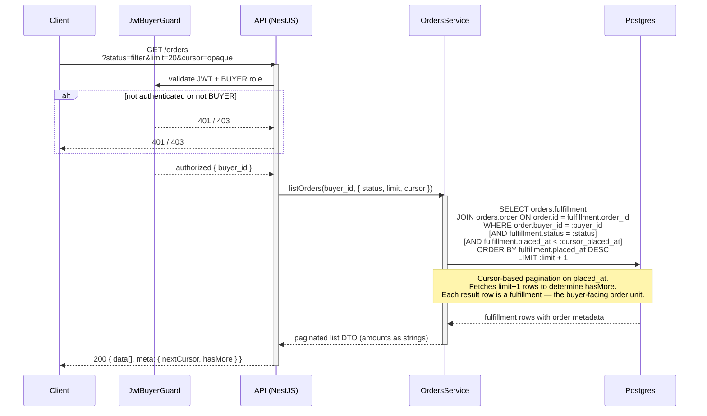
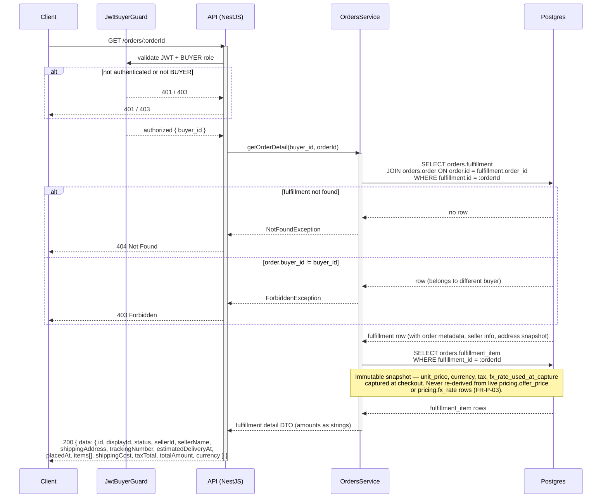

# Orders API — Orders & Checkout

**Module:** `Orders`  
**Parent:** [API Design Index](../api-design.md)  
**Source of truth:** [BRD v1.1](../../requirements/BRD.md), [ERD](../data-model-erd.md)

---

## Endpoint Index

| Method | Path | Auth | Description |
|--------|------|------|-------------|
| `POST` | [`/orders`](#place-order-checkout) | BUYER + EMAIL_VERIFIED | Checkout — single atomic Postgres transaction across 9+ tables |
| `GET` | [`/orders`](#list-orders-buyer) | BUYER | List buyer's fulfillments (cursor-paginated) |
| `GET` | [`/orders/:id`](#get-order-detail-buyer) | BUYER | Fulfillment detail with immutable line-item snapshots |

---

## DB Mapping

| Endpoint | Primary DB | Tables / Notes |
|----------|-----------|----------------|
| `POST /orders` | Postgres (single transaction) | `orders.order`, `orders.fulfillment` (one per seller), `orders.fulfillment_item` (immutable snapshot), `orders.payment_attempt`, `orders.idempotency_key`, `inventory.stock` (lock + decrement), `inventory.stock_reservation` (insert), `pricing.offer_price` + `pricing.fx_rate` (recheck live), `catalog.offer` (status recheck), `platform.outbox_event` (`fulfillment.placed` per seller) |
| `GET /orders` | Postgres | `orders.order`, `orders.fulfillment` (derived status) |
| `GET /orders/:id` | Postgres | `orders.order`, `orders.fulfillment`, `orders.fulfillment_item` |

**Key checkout invariants (ERD §7):**
- Offer status, effective price, and stock are rechecked inside the checkout transaction — cart data alone is never trusted.
- `FulfillmentItem` snapshots are immutable after insert. `fx_rate_used_at_capture` is set only when display-currency conversion was applied.
- Order confirmation is returned after the transaction commits; it never waits for Kafka, Elasticsearch, email, or MongoDB consumers.

---

## Endpoints

### Place order (checkout)

```
POST /orders
Tag: Orders
Auth: BUYER + EMAIL_VERIFIED
Headers: Idempotency-Key: <client-uuid> (required)
```
**Request body**
```json
{
  "shippingAddressId": "uuid",
  "paymentMethod": "FAKE_CARD",
  "paymentDetail": "XXXX-XXXX-XXXX-4242",
  "currency": "USD",
  "cartItems": ["cart-item-uuid"]
}
```
`currency` is the preferred display currency for FX conversion. Actual pricing is captured from offer prices in seller-native currencies.

**Response 201**
```json
{
  "data": {
    "placementOutcome": "FULLY_PLACED | PARTIALLY_PLACED",
    "orders": [{
      "id": "uuid",
      "displayId": "FUL-3F2A1B9C",
      "sellerId": "uuid",
      "sellerName": "string",
      "status": "PENDING",
      "currency": "USD",
      "trackingNumber": "TRK-3F2A1B9C",
      "estimatedDeliveryAt": "ISO8601",
      "placedAt": "ISO8601",
      "items": [{
        "offerId": "uuid",
        "productTitle": "string",
        "variantLabel": "string | null",
        "quantity": 1,
        "unitPrice": "99.99",
        "currency": "USD",
        "tax": "7.00",
        "lineTotal": "106.99"
      }],
      "shippingCost": "5.00",
      "taxTotal": "7.00",
      "totalAmount": "111.99"
    }],
    "failedGroups": [{
      "sellerId": "uuid",
      "reason": "PRICE_CHANGED | OUT_OF_STOCK | OFFER_UNAVAILABLE",
      "items": [{ "offerId": "uuid", "productTitle": "string" }]
    }]
  }
}
```
**Errors:**
- 400 invalid body
- 409 `Idempotency-Key` reused with different body
- 409 price changed beyond tolerance:
  ```json
  { "statusCode": 409, "error": "Conflict", "message": "PRICE_CHANGED", "updatedPrices": [{ "offerId": "uuid", "newAmount": "109.99", "currency": "USD" }] }
  ```
- 422 no purchasable items remain after stale-item exclusion

#### Sequence

The checkout is a **single PostgreSQL transaction** touching 9+ tables. Order confirmation is returned **after `COMMIT`** and **before** any Kafka, email, Elasticsearch, or MongoDB side effects.

**Key invariants enforced inside the transaction:**
- Cart data is never trusted for price or stock — offer status, effective price, and available stock are rechecked with row-level locks.
- `PRICE_CHANGED` aborts the entire transaction and returns HTTP 409. Client must re-submit with confirmed prices.
- `OUT_OF_STOCK` and `OFFER_UNAVAILABLE` produce group-level failures in `failedGroups`; remaining groups are placed (`PARTIALLY_PLACED`).
- `FulfillmentItem` snapshots (`unit_price`, `currency`, `tax`, `fx_rate_used_at_capture`) are immutable after insert and are **never re-derived** from live `pricing.offer_price` or `pricing.fx_rate` rows (FR-P-03).
- `tracking_number` (TRK-uuid8) is assigned at `PENDING` creation; it is never regenerated at the `SHIPPED` transition.

```mermaid
sequenceDiagram
    participant C as Client
    participant G as Guards
    participant A as API (NestJS)
    participant O as OrdersService
    participant P as Postgres
    participant KR as Kafka Relay
    participant KC as Kafka Consumers

    Note over G: JwtBuyerGuard + EmailVerifiedGuard

    C->>A: POST /orders<br/>Idempotency-Key: uuid<br/>{ shippingAddressId, paymentMethod, paymentDetail,<br/>  currency, cartItems[] }
    activate A
    A->>G: validate JWT + BUYER role
    alt not authenticated or not BUYER
        G-->>A: 401 / 403
        A-->>C: 401 / 403
    end
    A->>G: check email_verified
    alt email_verified = false
        G-->>A: 403 EMAIL_NOT_VERIFIED
        A-->>C: 403 Forbidden
    end
    G-->>A: authorized { buyer_id, email_verified: true }
    A->>O: placeOrder(buyer_id, dto, idempotencyKey)
    activate O

    rect rgb(235, 240, 255)
        Note over O,P: Pre-transaction — idempotency guard (read-only)
        O->>P: SELECT orders.idempotency_key<br/>WHERE buyer_id = :buyer_id AND key = :idempotencyKey
        alt key exists AND request_hash MATCHES
            P-->>O: existing order_id (completed checkout)
            O-->>A: cached order response
            A-->>C: 201 (idempotent replay — no new order created)
        else key exists AND request_hash MISMATCH
            P-->>O: hash mismatch
            O-->>A: ConflictException
            A-->>C: 409 Idempotency-Key reused with different body
        end
        P-->>O: key not found — proceed to transaction
    end

    rect rgb(255, 248, 220)
        Note over O,P: BEGIN TRANSACTION — single atomic unit across 9+ tables

        O->>P: INSERT orders.idempotency_key<br/>(buyer_id, key, request_hash, status = PROCESSING)
        Note over O,P: Locked at tx start to prevent concurrent duplicate checkout
        P-->>O: idempotency_key_id

        O->>P: SELECT cart.cart_item<br/>WHERE id IN :cartItems AND cart.user_id = :buyer_id
        P-->>O: requested items (offer_id, quantity)

        O->>P: SELECT identity.address<br/>WHERE id = :shippingAddressId AND user_id = :buyer_id
        alt address not found or not owned by buyer
            P-->>O: no row
            O->>P: ROLLBACK
            A-->>C: 400 / 404
        end
        P-->>O: address row
        Note over O: Snapshot address as JSONB into order.shipping_address_snapshot.<br/>Historical orders are unaffected by future address edits or deletes.

        Note over O: Group items by seller/currency.<br/>Items whose offer.status != ACTIVE are excluded as skipped_items<br/>(stay in cart, shown in confirmation page, not charged).

        Note over O,P: Validation phase — acquire row locks, recheck freshness

        loop for each seller/currency group
            O->>P: SELECT catalog.offer<br/>WHERE id IN :offer_ids FOR UPDATE
            Note over O,P: Row lock prevents concurrent offer status changes.<br/>Cart data never trusted for offer status.
            alt any offer.status != ACTIVE
                Note over O: Mark group FAILED: OFFER_UNAVAILABLE<br/>Cart items for this group remain in cart
            else all offers ACTIVE
                O->>P: SELECT pricing.offer_price<br/>WHERE offer_id IN :offer_ids AND currency_code = :seller_currency<br/>filtered by price_type (LIST / SALE / B2B_TIER) and account_type
                opt seller currency != buyer display currency
                    O->>P: SELECT pricing.fx_rate<br/>WHERE base = :seller_currency AND quote = :buyer_currency
                    P-->>O: fx_rate row (display-only, NUMERIC(19,8))
                end
                alt price changed beyond tolerance (configurable, e.g. +/-0.01 in offer currency)
                    O->>P: ROLLBACK
                    O-->>A: PriceChangedException { updatedPrices[] }
                    A-->>C: 409 PRICE_CHANGED<br/>{ updatedPrices: [{ offerId, newAmount, currency }] }
                else price within tolerance
                    O->>P: SELECT inventory.stock<br/>WHERE offer_id IN :offer_ids FOR UPDATE
                    Note over O,P: Row lock prevents concurrent over-reservation
                    alt available_qty (on_hand_qty - reserved_qty) < requested_qty
                        Note over O: Mark group FAILED: OUT_OF_STOCK<br/>Cart items for this group remain in cart
                    end
                end
            end
        end

        alt no purchasable groups remain after validation
            O->>P: ROLLBACK
            O-->>A: UnprocessableException
            A-->>C: 422 No purchasable items remain
        end

        Note over O,P: Write phase — order row must exist before fulfillment and stock_reservation (FK deps)

        O->>P: INSERT orders.order<br/>(buyer_id, currency_code, placement_outcome,<br/>shipping_address_snapshot, idempotency_key_id,<br/>placed_at, buyer_currency_grand_total, buyer_currency_code)
        Note over O,P: placement_outcome: FULLY_PLACED or PARTIALLY_PLACED. Immutable after set.<br/>order.status is derived at query time from fulfillment states — no stored status column.
        P-->>O: order_id (ORD-xxxxxxxx)

        loop for each SUCCESSFUL seller/currency group
            O->>P: UPDATE inventory.stock<br/>SET reserved_qty = reserved_qty + :qty,<br/>    version = version + 1<br/>WHERE offer_id = :offer_id
            Note over O,P: Optimistic-lock version increment

            O->>P: INSERT inventory.stock_reservation<br/>(offer_id, order_id, quantity,<br/>status = ACTIVE, expires_at = now() + 15 min)
            P-->>O: reservation_id

            O->>P: INSERT orders.fulfillment<br/>(order_id, seller_id, seller_name_snapshot,<br/>currency_code, status = PENDING,<br/>shipping_method, shipping_cost, tax_total, total_amount,<br/>tracking_number = TRK-uuid8,<br/>estimated_delivery_at, placed_at)
            Note over O,P: tracking_number assigned at PENDING creation — never regenerated at SHIPPED.
            P-->>O: fulfillment_id (FUL-xxxxxxxx)

            O->>P: INSERT orders.fulfillment_item x N<br/>(fulfillment_id, offer_id,<br/>product_title_snapshot, variant_label_snapshot,<br/>quantity, unit_price NUMERIC(19,4),<br/>currency_code, tax,<br/>fx_rate_used_at_capture) IMMUTABLE after insert
            Note over O,P: Snapshots unit_price, currency, tax, fx_rate_used_at_capture at this moment.<br/>Historical amounts are NEVER re-derived from live pricing.offer_price<br/>or pricing.fx_rate rows (FR-P-03, order immutability).

            O->>P: INSERT orders.payment_attempt<br/>(fulfillment_id, provider, method,<br/>status = COMPLETED (fake simulation),<br/>masked_payment_detail, amount, currency_code)

            O->>P: INSERT platform.outbox_event<br/>topic = fulfillment.placed<br/>aggregate_type = fulfillment, aggregate_id = fulfillment_id<br/>payload = { order_id, fulfillment_id, display_id, buyer_id,<br/>  seller_id, currency_code, tracking_number,<br/>  items[], shipping_cost, tax_total, total_amount }
            Note over O,P: Outbox write in SAME transaction as domain writes.<br/>Relay guarantees at-least-once delivery to Kafka after commit.

            O->>P: DELETE FROM cart.cart_item<br/>WHERE id IN :placed_cart_item_ids
            Note over O,P: Only placed items cleared. Skipped and failed items remain in cart.
        end

        O->>P: INSERT platform.outbox_event<br/>topic = order.finalized<br/>payload = { idempotency_key_id, buyer_id,<br/>  placement_outcome, placed_fulfillments[], failed_groups[] }

        O->>P: UPDATE orders.idempotency_key<br/>SET order_id = :order_id, status = COMPLETED

        O->>P: COMMIT TRANSACTION
        Note over O,P: Transaction committed.
    end

    Note over O,A: Response built from committed data.<br/>No Kafka, email, ES, or MongoDB side effects have occurred yet.
    O-->>A: order response DTO
    deactivate O
    A-->>C: 201 { data: { placementOutcome, orders[], failedGroups[] } }<br/>(all monetary amounts as strings)
    deactivate A

    rect rgb(220, 245, 230)
        Note over KR,KC: Post-commit async fan-out — Relay polls outbox after COMMIT

        KR->>P: SELECT platform.outbox_event<br/>WHERE publication_status = 'PENDING'
        Note over KR,P: Partial index on publication_status keeps this query fast

        par fulfillment.placed (one event per placed seller group)
            KR->>KC: publish to Kafka — topic: fulfillment.placed
            KC->>KC: notification.fulfillment-placed<br/>in-app notification ORDER_PLACED for buyer
            KC->>KC: notification.fulfillment-seller-alert<br/>ET-17 new order email to seller
            KC->>KC: inventory.fulfillment-placed<br/>mark stock_reservation status = CONSUMED
            KC->>KC: audit.fulfillment-placed<br/>write MongoDB activity_events
        and order.finalized (one event per checkout)
            KR->>KC: publish to Kafka — topic: order.finalized
            KC->>KC: notification.order-summary<br/>ET-01 order summary email to buyer<br/>(placed fulfillments + skipped items + failed groups)
            KC->>KC: audit.order-finalized<br/>write MongoDB activity_events
        end

        KR->>P: UPDATE platform.outbox_event<br/>SET publication_status = 'PUBLISHED', published_at = now()
    end
```



---

### List orders (buyer)

```
GET /orders
Tag: Orders
Auth: BUYER
Pagination: cursor
```
**Query params:** `status` (filter), `limit`, `cursor`  
**Response 200**
```json
{
  "data": [{
    "id": "uuid",
    "displayId": "FUL-3F2A1B9C",
    "sellerName": "string",
    "status": "PENDING | SHIPPED | DELIVERED | REFUNDED | CANCELLED | IN_PROGRESS | PARTIALLY_SHIPPED | PARTIALLY_DELIVERED | PARTIALLY_REFUNDED | COMPLETED",
    "totalAmount": "111.99",
    "currency": "USD",
    "itemCount": 2,
    "placedAt": "ISO8601"
  }],
  "meta": { "nextCursor": "string | null", "hasMore": false }
}
```

> **Note:** Each element in `orders[]` represents one `fulfillment` (a per-seller shipment group), not an order-level row. Buyers see fulfillments as their "orders" in the UI; each has its own `displayId` prefixed `FUL-`.

#### Sequence



---

### Get order detail (buyer)

```
GET /orders/:orderId
Tag: Orders
Auth: BUYER
```
**Response 200**
```json
{
  "data": {
    "id": "uuid",
    "displayId": "FUL-3F2A1B9C",
    "status": "PENDING | SHIPPED | DELIVERED | REFUNDED | CANCELLED | IN_PROGRESS | PARTIALLY_SHIPPED | PARTIALLY_DELIVERED | PARTIALLY_REFUNDED | COMPLETED",
    "sellerId": "uuid",
    "sellerName": "string",
    "shippingAddress": {
      "fullName": "string",
      "addressLine1": "string",
      "city": "string",
      "country": "string",
      "postalCode": "string"
    },
    "trackingNumber": "TRK-... | null",
    "estimatedDeliveryAt": "ISO8601 | null",
    "placedAt": "ISO8601",
    "items": [{
      "offerId": "uuid",
      "productTitle": "string",
      "variantLabel": "string | null",
      "quantity": 1,
      "unitPrice": "99.99",
      "currency": "USD",
      "tax": "7.00",
      "lineTotal": "106.99"
    }],
    "shippingCost": "5.00",
    "taxTotal": "7.00",
    "totalAmount": "111.99",
    "currency": "USD"
  }
}
```
**Errors:** 404, 403 (not this buyer's fulfillment)

#### Sequence

> `:orderId` resolves to a `fulfillment.id` (FUL-xxxxxxxx). Line items are served from the immutable `fulfillment_item` snapshot — never re-derived from live pricing rows (FR-P-03).


