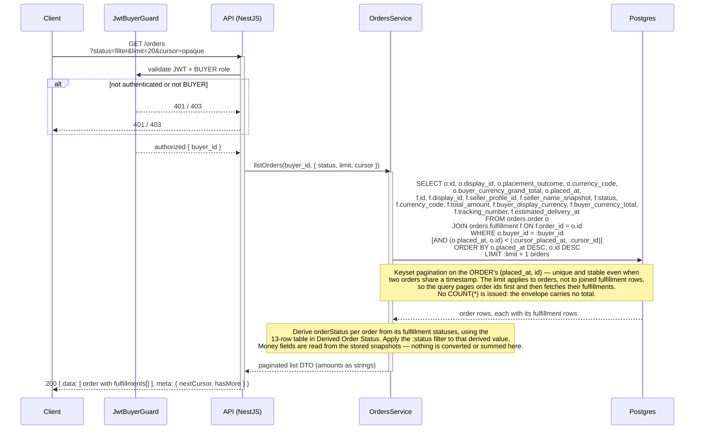
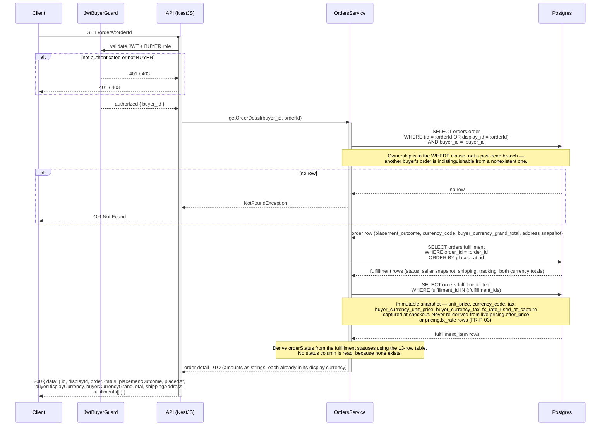

# Orders API — Orders & Checkout

**Status:** Complete  
**Module:** `Orders`  
**Parent:** [API Design Index](../api-design.md)  
**Source of truth:** [BRD v1.3](../../requirements/BRD.md), [ERD](../data-model-erd.md), [user-stories/buyer.md § US-B-09](../../requirements/user-stories/buyer.md)  
**Conventions:** [api-conventions.md](../../../conventions/api-conventions.md) — `operationId` naming (`<Module>_<verb><Resource>`), response envelope, cursor pagination, error shape, money-as-string  
**Correlation:** every endpoint accepts an `X-Correlation-ID` request header, generates a UUIDv7 when it is absent, echoes it on the response, and carries the same value into every log line and into the `correlation_id` field of every Kafka event envelope and `platform.outbox_event` row it writes — see [observability.md § Correlation ID](../../../conventions/observability.md#correlation-id).

---

## Summary

- [Endpoint Index](#endpoint-index)
- [DB Mapping](#db-mapping)
- [The Order Aggregate](#the-order-aggregate)
- [Derived Order Status](#derived-order-status)
- [Endpoints](#endpoints)

<a id="endpoint-index"></a>
## Endpoint Index

| Method | Path | Auth | Description |
|--------|------|------|-------------|
| `POST` | [`/orders`](#place-order-checkout) | BUYER + EMAIL_VERIFIED | Checkout — creates one order containing one fulfillment per seller/currency group |
| `GET` | [`/orders`](#list-orders-buyer) | BUYER | List buyer's orders with nested fulfillments (cursor-paginated) |
| `GET` | [`/orders/:id`](#get-order-detail-buyer) | BUYER | Order detail with its fulfillments and immutable line-item snapshots |

---

<a id="db-mapping"></a>
## DB Mapping

| Endpoint | Primary DB | Tables / Notes |
|----------|-----------|----------------|
| `POST /orders` | Postgres (single transaction) | `orders.order` (the aggregate), `orders.fulfillment` (one per seller/currency group), `orders.fulfillment_item` (immutable snapshot), `orders.payment_attempt`, `orders.idempotency_key`, `inventory.stock` (lock + reserve), `inventory.stock_reservation` (insert, carrying `fulfillment_id`), `pricing.offer_price` + `pricing.fx_rate` (recheck live), `catalog.offer` (status recheck), `platform.outbox_event` (`fulfillment.placed` per group + one `order.finalized`) |
| `GET /orders` | Postgres | `orders.order`, `orders.fulfillment` (order status derived on read) |
| `GET /orders/:id` | Postgres | `orders.order`, `orders.fulfillment`, `orders.fulfillment_item` |

**Key checkout invariants (ERD §7):**
- Offer status, effective price, and stock are rechecked inside the checkout transaction — cart data alone is never trusted.
- `FulfillmentItem` snapshots are immutable after insert. `fx_rate_used_at_capture` is `NOT NULL` and is `1.00000000` when the seller's native currency equals the buyer's display currency, so no reader branches on a null rate.
- Every buyer-currency amount the buyer is shown is itself snapshotted at capture (`fulfillment.buyer_currency_total`, `fulfillment_item.buyer_currency_unit_price`, `fulfillment_item.buyer_currency_tax`, `order.buyer_currency_grand_total`). **No endpoint in this module converts money at read time**, and no client performs monetary arithmetic — every amount is a string already denominated in the currency it will be displayed in, with its currency code beside it (FR-P-03, FR-P-04a).
- Rounding happens once, at capture, using the target currency's `Currency.minor_unit_scale` (JPY 0, BHD 3); storage keeps four fractional digits.
- Order confirmation is returned after the transaction commits; it never waits for Kafka, Elasticsearch, email, or MongoDB consumers.
- The Orders module never writes `inventory.*` outside the checkout transaction. Cancel and refund publish an event and the inventory consumer restores stock; reservation release scopes on `fulfillment_id`, never on `order_id`.

---

<a id="the-order-aggregate"></a>
## The Order Aggregate

`orders.order` is the aggregate root, created once per checkout attempt, and `orders.fulfillment` rows hang off it — one per seller/currency group. The buyer's unit of interaction is the **order**:

| | Order | Fulfillment |
|---|---|---|
| Display id | `ORD-` + 9 zero-padded digits (`ORD-000001042`) | `FUL-` + 9 zero-padded digits (`FUL-000003871`) |
| Source | `orders.order_display_seq` | `orders.fulfillment_display_seq` |
| Status | derived on read, never stored — see [Derived Order Status](#derived-order-status) | stored `fulfillment_status` column |
| Money | `buyer_currency_grand_total` in `currency_code` (the buyer display currency) | `total_amount` in the seller's native `currency_code`, plus `buyer_currency_total` in `buyer_display_currency` |
| Carries | buyer, address snapshot, placement outcome, grand total | seller, shipping, tracking, per-seller totals, line items |

Both display ids come from Postgres sequences (`DEFAULT 'ORD-' || lpad(nextval(...)::text, 9, '0')`), not from UUID hex: hex prefixes of a UUIDv7 are the top timestamp bits and collide inside short windows under a `UNIQUE` constraint. Gaps in the sequence are expected — a rolled-back transaction consumes a value. `tracking_number` follows the same scheme (`TRK-` + 9 digits) and is issued when the fulfillment is created at `PENDING`, never regenerated on ship (US-S-06:132).

`:orderId` in this module always addresses an `orders.order` row, by UUID or by `display_id`. A fulfillment is reached through its parent order, or through the Seller API for the seller who owns it.

---

<a id="derived-order-status"></a>
## Derived Order Status

`orders.order` has **no `status` column** and must not gain one. The order-level status is computed from the statuses of the order's placed fulfillments on every read, and is returned as `orderStatus` — a field distinct from `fulfillment.status`. The two vocabularies never mix:

- `fulfillment.status` is the stored `fulfillment_status` enum: `PENDING`, `SHIPPED`, `DELIVERED`, `REFUNDED`, `CANCELLED`. These are the only values a `status` filter can match against a fulfillment row.
- `orderStatus` is derived and may additionally be `COMPLETED`, `IN_PROGRESS`, `PARTIALLY_SHIPPED`, `PARTIALLY_DELIVERED` or `PARTIALLY_REFUNDED`. No row anywhere stores it.

The table below is reproduced from [`user-stories/buyer.md`](../../requirements/user-stories/buyer.md) § US-B-09 "Order.status (derived from placed Fulfillment states)", which is its source of truth. It is exhaustive, the rows are evaluated in order, and the last row is the fallback.

| Placed fulfillment states | Order Status |
|---|---|
| All `PENDING` | `PENDING` |
| All `SHIPPED` | `SHIPPED` |
| All `DELIVERED` | `COMPLETED` |
| All `REFUNDED` | `REFUNDED` |
| All `CANCELLED` | `CANCELLED` |
| All `REFUNDED` or `CANCELLED` (mix) | `REFUNDED` |
| Any `REFUNDED` + any `PENDING` or `SHIPPED` | `IN_PROGRESS` |
| Any `CANCELLED` + any `PENDING` or `SHIPPED` | `IN_PROGRESS` |
| `DELIVERED` + `REFUNDED` only | `PARTIALLY_REFUNDED` |
| `DELIVERED` + `CANCELLED` only (no `REFUNDED`) | `PARTIALLY_DELIVERED` |
| `DELIVERED` + `REFUNDED` + `CANCELLED` | `PARTIALLY_REFUNDED` |
| Any `DELIVERED` + `PENDING`/`SHIPPED`, no `REFUNDED`, no `CANCELLED` | `PARTIALLY_DELIVERED` |
| `PENDING` + `SHIPPED`, no `DELIVERED`, no `REFUNDED`, no `CANCELLED` | `PARTIALLY_SHIPPED` |
| Any other combination | `IN_PROGRESS` |

**Completion.** `order.completed` fires when **no non-`DELIVERED` fulfillment remains** under the order, whatever the fulfillment count — a single-fulfillment order completes when that fulfillment is delivered, exactly as a five-seller order completes when the last of the five is delivered. There is no minimum-count floor. `REFUNDED` and `CANCELLED` are terminal and are not "still pending", so an order whose fulfillments have all reached a terminal state with at least one `DELIVERED` completes; an order in which every fulfillment ended `CANCELLED` or `REFUNDED` emits no `order.completed` and settles on the derived `CANCELLED` or `REFUNDED` status above. The check belongs to the Orders module and runs on `fulfillment.delivered`; no consumer outside Orders issues a `SELECT COUNT(*)` against `orders.fulfillment`.

**Filtering.** `GET /orders?status=` filters on the derived `orderStatus`, which cannot be pushed into a `WHERE fulfillment.status = :status` predicate. The query loads the buyer's orders with their fulfillment statuses and evaluates the table above; see the endpoint sequence for how this interacts with cursor pagination.

---

<a id="endpoints"></a>
## Endpoints

### Place order (checkout)

```
POST /orders
Tag: Orders
Auth: BUYER + EMAIL_VERIFIED
Headers: Idempotency-Key: <client-uuid> (required)
```
**Request body**
```json
{
  "shippingAddressId": "uuid",
  "paymentMethod": "FAKE_CARD",
  "maskedPaymentDetail": "XXXX-XXXX-XXXX-4242",
  "cartItems": ["cart-item-uuid"],
  "confirmedPrices": [{ "offerId": "uuid", "amount": "109.99", "currency": "USD" }]
}
```
- `maskedPaymentDetail` is the already-masked display string the mock gateway stores in `payment_attempt.masked_payment_detail`. A full card number is never accepted, and the field name is `maskedPaymentDetail` precisely so that an unmasked PAN cannot reach it or the request log.
- There is **no `currency` field**. The buyer's display currency is resolved server-side from `identity.user.preferred_currency` at submission time and stored immutably as `fulfillment.buyer_display_currency` on every fulfillment created (US-B-09:212); a later change to the buyer's preference does not alter historical order display. The client cannot choose the capture currency — each fulfillment captures in its seller's `native_currency_code`.
- There is **no `shippingMethodId`**. V1 has mock shipping only (BRD §3.2): there are no shipping methods to choose between, the mock service name recorded in `fulfillment.shipping_method` comes from seeded platform configuration, and `shipping_cost` is a structural zero — see [Shipping and tax in V1](#shipping-and-tax).
- `confirmedPrices[]` is the wire representation of the buyer's acknowledgement after a `PRICE_CHANGED` response, and is omitted on a first submission. See [Price revalidation](#price-revalidation) below.

**Response 201**
```json
{
  "data": {
    "orderId": "uuid",
    "displayId": "ORD-000001042",
    "placementOutcome": "FULLY_PLACED | PARTIALLY_PLACED",
    "placedAt": "ISO8601",
    "buyerDisplayCurrency": "THB",
    "shippingTotal": "0.00",
    "taxTotal": "0.00",
    "buyerCurrencyGrandTotal": "3439.66",
    "fulfillments": [{
      "id": "uuid",
      "displayId": "FUL-000003871",
      "sellerId": "uuid",
      "sellerName": "string",
      "status": "PENDING",
      "currency": "USD",
      "trackingNumber": "TRK-000003871",
      "estimatedDeliveryAt": "ISO8601",
      "shipBy": "ISO8601",
      "placedAt": "ISO8601",
      "items": [{
        "offerId": "uuid",
        "productTitle": "string",
        "variantLabel": "string | null",
        "quantity": 1,
        "unitPrice": "99.99",
        "tax": "0.00",
        "lineTotal": "99.99",
        "currency": "USD",
        "buyerCurrencyUnitPrice": "3439.66",
        "buyerCurrencyTax": "0.00",
        "buyerCurrencyLineTotal": "3439.66",
        "buyerDisplayCurrency": "THB",
        "fxRateUsedAtCapture": "34.40000000"
      }],
      "shippingCost": "0.00",
      "taxTotal": "0.00",
      "totalAmount": "99.99",
      "buyerCurrencyTotal": "3439.66",
      "buyerDisplayCurrency": "THB"
    }],
    "skippedItems": [{
      "cartItemId": "uuid",
      "offerId": "uuid",
      "productTitle": "string",
      "reason": "OFFER_UNAVAILABLE"
    }],
    "failedGroups": [{
      "sellerId": "uuid",
      "sellerName": "string",
      "reason": "OUT_OF_STOCK | OFFER_UNAVAILABLE",
      "cartItemIds": ["uuid"],
      "items": [{ "offerId": "uuid", "productTitle": "string" }]
    }]
  }
}
```

**Response shape notes**
- One order, one `orderId`, one `ORD-` `displayId`. The fulfillments are nested inside it — this response is not a list of orders.
- `placementOutcome` is `FULLY_PLACED` when every group was placed and `PARTIALLY_PLACED` when at least one failed. A checkout in which **every** group failed is not a `PARTIALLY_PLACED` order: no order row is created and the response is `422` (below).
- `skippedItems[]` are the stale lines excluded before placement — an offer that is no longer `ACTIVE`. They are **not** charged, **not** part of the order, and **remain in the cart** so the buyer can review or remove them (US-B-09:196). **This response is the only place they are reported**: an order contains what was placed, no table holds the items a checkout deliberately left out, and `GET /orders/:id` therefore does not list them. The one other place the list travels is the `order.finalized` payload, because the ET-01 confirmation email has to name what was dropped and a consumer performs no cross-module read: each entry there carries `offer_id`, a `reason`, and exactly the descriptive fields a placed line carries in the same payload — never a price field, since nothing was captured. The Avro record is defined in [kafka-events.md](../kafka-events.md). That `reason` is the internal enum and is finer-grained than the `OFFER_UNAVAILABLE` returned here on purpose: a buyer sees one "Unavailable" state for any offer that is not `ACTIVE`, exactly as the cart labels it ([cart.md § Get cart](cart.md#get-cart)), while the event distinguishes why for the consumers that act on it.
- `failedGroups[]` are groups that failed inventory reservation or an offer status recheck. Their cart items **remain in the cart** (US-B-09:204) and `cartItemIds` tells the client exactly which lines survived, so it does not have to infer them.
- The order-level `shippingTotal` and `taxTotal` are the only amounts in this response that are not read from a column: they are summed over the fulfillments on read, in `buyerDisplayCurrency`, and both are `"0.00"` — see [Shipping and tax in V1](#shipping-and-tax). Everything else, `buyerCurrencyGrandTotal` included, is a stored snapshot.
- Every money field is a string. Fields prefixed `buyerCurrency*` are the snapshots stored at capture in `buyerDisplayCurrency`; the unprefixed fields are the seller-native capture in `currency`. Both are read straight from the row — nothing is converted on read and the client sums nothing (`buyerCurrencyLineTotal` and `lineTotal` are computed once, at capture).
- `shipBy` is `placedAt + fulfillment_window_days`, the platform-configurable ship-by window (default **7** days, US-P-16). It is not a hardcoded 3 days. `estimatedDeliveryAt` is the same arithmetic on the same window and is anchored on `placedAt`, not on a ship timestamp — the order-confirmation email renders the ETA at placement, when no ship timestamp exists.

<a id="shipping-and-tax"></a>
**Shipping and tax in V1.** Every shipping and tax figure on an order is a **structural zero** — always `"0.00"` — and the two levels get them from different places:

- Per fulfillment, `shippingCost` and `taxTotal` are the persisted `fulfillment.shipping_cost` and `tax_total` captures, seeded from platform configuration and snapshotted like any other capture amount; each line's `tax` is the same zero on `fulfillment_item`. These field names follow their columns.
- Per order, `shippingTotal` and `taxTotal` are the sum over that order's fulfillments, expressed in `buyerDisplayCurrency` alongside `buyerCurrencyGrandTotal`. **No column stores them** — `orders.order` has no shipping or tax column and none is to be added — so they are computed on read. While every addend is zero the sum needs no FX; a phase that gives them real values must convert them the way capture already converts line amounts. The names match the cart's `shippingTotal` / `taxTotal` ([cart.md § Get cart](cart.md#get-cart)) so one client component renders the same fields before and after checkout.

Real shipping is out of V1 scope (BRD §3.2) and Phase 1 defines no tax engine, no tax-rate table and no jurisdiction model, so nothing in this design computes either figure. The fields — and, at fulfillment level, their columns — exist so that a later phase changes the value written at capture rather than the shape of the snapshot, the response, and every client bound to them; the zero tax still satisfies FR-P-03 immutability, because what is captured is captured. `fulfillment.total_amount` is therefore the item subtotal in V1, but it is stored as its own column and read as-is, never re-derived by adding the parts back up.

**Errors:**
- 400 invalid body
- 409 `Idempotency-Key` reused with a **different** body. A replay with the *same* body is not an error — see [Idempotency](#idempotency-replay).
- 409 price changed — see [Price revalidation](#price-revalidation):
  ```json
  {
    "statusCode": 409,
    "error": "Conflict",
    "message": "PRICE_CHANGED",
    "updatedPrices": [{ "offerId": "uuid", "productTitle": "string", "shownAmount": "99.99", "newAmount": "109.99", "currency": "USD" }]
  }
  ```
- 422 no purchasable items remain after stale-item exclusion, or every seller/currency group failed reservation. No order row is created in either case.

<a id="idempotency-replay"></a>
**Idempotency.** `Idempotency-Key` is required. Replaying a key whose checkout already completed returns **HTTP 200** with the order's current state — the same body `GET /orders/:id` would serve, re-read at replay time rather than served from a stored response body — and creates nothing (US-B-09:209). Because the read is fresh, a replay can legitimately return a *later* state than the original response did: an order whose fulfillments have since moved to `SHIPPED` replays as `SHIPPED`. `409` is reserved for the genuine conflict: the same key presented with a different `request_hash`. `orders.idempotency_key` has **no `status` column** and no `PROCESSING`/`COMPLETED` lifecycle; the row is inserted inside the checkout transaction with its `request_hash`, `order_id` is filled in once the order row exists, and the unique constraint on `(buyer_id, key)` is what serialises concurrent duplicate submissions — a losing concurrent insert waits on the lock and then reads the winner's order.

<a id="price-revalidation"></a>
**Price revalidation.** Immediately before the order is created, the effective price of every valid line is re-resolved. If any line's price differs from the price the buyer was shown by more than `CHECKOUT_PRICE_TOLERANCE` (env-configurable, e.g. ±0.01 in the offer's currency), the submission is halted with `409 PRICE_CHANGED` listing each changed item with its `shownAmount` and `newAmount`, and **no order is created**. The buyer confirms the new prices and the client re-submits with the same `Idempotency-Key` plus `confirmedPrices[]` carrying the acknowledged amount and currency per offer.

The confirmation is checked against a fresh resolution, not against itself: if a price moved **again** between the confirmation and the re-submission, the re-submission is rejected with another `409 PRICE_CHANGED` and the buyer must confirm again. There is no bound on how many times this can repeat and no "confirm once, accept anything" path — an order is never created at a price the buyer has not seen and confirmed (US-B-09:210-211). A `confirmedPrices[]` entry that matches no re-resolved line, or that is absent for a line whose price moved, is treated as unconfirmed.

#### Sequence

The checkout is a **single PostgreSQL transaction** touching 9+ tables. Order confirmation is returned **after `COMMIT`** and **before** any Kafka, email, Elasticsearch, or MongoDB side effects.

**Key invariants enforced inside the transaction:**
- Cart data is never trusted for price or stock — offer status, effective price, and available stock are rechecked with row-level locks.
- The order row is created **first**, as the container. Each seller/currency group is then processed independently: reserve stock (TTL 15 min) → snapshot prices → insert the fulfillment at `PENDING` → clear **only that group's** cart items. A group's four steps succeed or fail together (US-B-09:198-204).
- `PRICE_CHANGED` aborts the entire transaction and returns HTTP 409; no order row survives. The client re-submits with `confirmedPrices[]`.
- `OUT_OF_STOCK` and `OFFER_UNAVAILABLE` produce group-level failures in `failedGroups` and leave that group's cart items in place; remaining groups are placed (`PARTIALLY_PLACED`). Every group failing is a `422`, not an order.
- `FulfillmentItem` snapshots (`unit_price`, `currency_code`, `tax`, `buyer_currency_unit_price`, `buyer_currency_tax`, `fx_rate_used_at_capture`) are immutable after insert and are **never re-derived** from live `pricing.offer_price` or `pricing.fx_rate` rows (FR-P-03). `fx_rate_used_at_capture` is `NOT NULL` — `1.00000000` when no conversion applied.
- `display_id` on the order and the fulfillment, and `tracking_number`, come from their Postgres sequences as column defaults. `tracking_number` is assigned at `PENDING` creation and never regenerated at the `SHIPPED` transition.


```mermaid
sequenceDiagram
    participant C as Client
    participant G as Guards
    participant A as API (NestJS)
    participant O as OrdersService
    participant P as Postgres
    participant KR as Kafka Relay
    participant KC as Kafka Consumers

    Note over G: JwtBuyerGuard + EmailVerifiedGuard

    C->>A: POST /orders<br/>Idempotency-Key: uuid<br/>{ shippingAddressId, paymentMethod, maskedPaymentDetail,<br/>  cartItems[], confirmedPrices[] }
    activate A
    A->>G: validate JWT + BUYER role
    alt not authenticated or not BUYER
        G-->>A: 401 / 403
        A-->>C: 401 / 403
    end
    A->>G: check email_verified
    alt email_verified = false
        G-->>A: 403 EMAIL_NOT_VERIFIED
        A-->>C: 403 Forbidden
    end
    G-->>A: authorized { buyer_id, email_verified: true }
    A->>O: placeOrder(buyer_id, dto, idempotencyKey)
    activate O

    rect rgb(235, 240, 255)
        Note over O,P: Pre-transaction — idempotency guard (read-only)
        O->>P: SELECT orders.idempotency_key<br/>WHERE buyer_id = :buyer_id AND key = :idempotencyKey
        alt key exists AND request_hash MATCHES AND order_id IS NOT NULL
            P-->>O: existing order_id (completed checkout)
            O->>P: SELECT the order with its fulfillments (same read as GET /orders/:id)
            O-->>A: the existing order
            A-->>C: 200 { data: { orderId, displayId, ... } }<br/>(idempotent replay — returns the current state read above, never a stored body, no new order, no side effects)
        else key exists AND request_hash MISMATCH
            P-->>O: hash mismatch
            O-->>A: ConflictException
            A-->>C: 409 Idempotency-Key reused with different body
        end
        P-->>O: key not found — proceed to transaction
    end

    rect rgb(255, 248, 220)
        Note over O,P: BEGIN TRANSACTION — single atomic unit across 9+ tables

        O->>P: INSERT orders.idempotency_key<br/>(buyer_id, key, request_hash, expires_at, created_at)
        Note over O,P: UNIQUE (buyer_id, key) serialises concurrent duplicate checkouts —<br/>a losing insert blocks on the lock, then reads the winner's order after commit.<br/>There is no status column and no PROCESSING/COMPLETED lifecycle.
        P-->>O: idempotency_key_id

        O->>P: SELECT cart.cart_item<br/>WHERE id IN :cartItems AND cart.user_id = :buyer_id
        P-->>O: requested items (offer_id, quantity)

        O->>P: SELECT preferred_currency FROM identity.user WHERE id = :buyer_id
        P-->>O: buyer display currency (NULL falls back to USD)
        Note over O: Resolved once, here, and stored on every fulfillment as buyer_display_currency —<br/>immutable thereafter (US-B-09:212).

        O->>P: SELECT identity.address<br/>WHERE id = :shippingAddressId AND user_id = :buyer_id
        alt address not found or not owned by buyer
            P-->>O: no row
            O->>P: ROLLBACK
            A-->>C: 400 / 404
        end
        P-->>O: address row
        Note over O: Validate all required fields and that country_code is an allowed ISO 3166-1 alpha-2 code.<br/>Snapshot the address as JSONB into order.shipping_address_snapshot —<br/>historical orders are unaffected by future address edits or deletes.

        Note over O: Group items by seller/currency (the group currency is catalog.offer.native_currency_code,<br/>one currency per offer, so the grouping is well defined).<br/>Items whose offer.status != ACTIVE are excluded as skipped_items —<br/>not charged, not part of the order, and left in the cart.

        Note over O,P: Validation phase — acquire row locks, recheck freshness

        Note over O: for each seller/currency group — validation phase (offer status → price → stock):
        O->>P: SELECT catalog.offer<br/>WHERE id IN :offer_ids FOR UPDATE
        Note over O,P: Row lock prevents concurrent offer status changes.<br/>Cart data never trusted for offer status.
        alt any offer.status != ACTIVE
            Note over O: Mark group FAILED: OFFER_UNAVAILABLE<br/>Cart items for this group remain in cart
        else all offers ACTIVE
            O->>P: SELECT amount, price_type, min_qty, starts_at, ends_at<br/>FROM pricing.offer_price<br/>WHERE offer_id IN :offer_ids AND inactive_at IS NULL
            Note over O,P: No currency predicate — offer_price has no currency column#59; every row is in the offer's native_currency_code. Resolution by price_type: SALE (live window) then LIST. Account type and quantity are not inputs — B2B_TIER is not a V1 price type (D-02)
            O->>P: SELECT rate, as_of FROM pricing.fx_rate<br/>WHERE base_currency_code = :offer_currency<br/>AND quote_currency_code = :buyer_display_currency
            Note over O,P: The capture rate. Read once, here, and written to fulfillment_item.fx_rate_used_at_capture.<br/>1.00000000 when the two currencies are the same. No later read re-derives it.
            alt resolved price differs from the confirmed/shown price beyond CHECKOUT_PRICE_TOLERANCE
                O->>P: ROLLBACK
                O-->>A: PriceChangedException { updatedPrices[] }
                A-->>C: 409 PRICE_CHANGED<br/>{ updatedPrices: [{ offerId, productTitle, shownAmount, newAmount, currency }] }
                Note over O,A: Checked against a fresh resolution every time, including on a re-submission<br/>carrying confirmedPrices[] — the buyer confirms each move (US-B-09:210-211).
            else price confirmed
                O->>P: SELECT inventory.stock<br/>WHERE offer_id IN :offer_ids FOR UPDATE
                Note over O,P: Row lock prevents concurrent over-reservation
                Note over O: if available_qty (on_hand_qty - reserved_qty) < requested_qty:<br/>Mark group FAILED: OUT_OF_STOCK — cart items remain in cart
            end
        end

        alt no purchasable groups remain after validation
            O->>P: ROLLBACK
            O-->>A: UnprocessableException
            A-->>C: 422 No purchasable items remain
            Note over O,A: Every group failing is an error, never a PARTIALLY_PLACED order.<br/>No orders.order row is created.
        end

        Note over O,P: Write phase — the order row is the container and must exist before<br/>fulfillment and stock_reservation (FK deps)

        O->>P: INSERT orders.order<br/>(buyer_id, currency_code, placement_outcome,<br/>shipping_address_snapshot, idempotency_key_id,<br/>placed_at, buyer_currency_grand_total)
        Note over O,P: currency_code IS the buyer display currency for the order as a whole#59;<br/>buyer_currency_grand_total is the sum of the groups' buyer_currency_total values, captured here.<br/>display_id defaults to 'ORD-' || lpad(nextval('orders.order_display_seq'), 9, '0').<br/>placement_outcome: FULLY_PLACED or PARTIALLY_PLACED, immutable after set.<br/>There is no status column — order status is derived on every read.
        P-->>O: order_id, display_id (ORD-000001042)

        loop for each SUCCESSFUL seller/currency group — reserve, snapshot, create, clear (atomically)
            O->>P: UPDATE inventory.stock<br/>SET reserved_qty = reserved_qty + :qty,<br/>    version = version + 1<br/>WHERE offer_id = :offer_id
            Note over O,P: Optimistic-lock version increment. CHECK (reserved_qty <= on_hand_qty) holds.

            O->>P: INSERT orders.fulfillment<br/>(order_id, seller_profile_id, seller_name_snapshot,<br/>currency_code, status = PENDING,<br/>shipping_method, shipping_cost, tax_total, total_amount,<br/>buyer_display_currency, buyer_currency_total,<br/>estimated_delivery_at, placed_at)
            Note over O,P: currency_code = the group's offer native currency#59; shipping_method comes from the platform's seeded<br/>mock-shipping configuration, and shipping_cost and tax_total are captured as 0.0000 from the same configuration —<br/>V1 has no carrier, no buyer choice and no tax engine (BRD §3.2), so neither figure is computed.<br/>total_amount is the group's item subtotal.<br/>buyer_currency_total = total_amount x capture rate, rounded once with the buyer currency's minor_unit_scale.<br/>display_id and tracking_number default from orders.fulfillment_display_seq and orders.tracking_display_seq —<br/>tracking_number is issued here, at PENDING, and never regenerated at SHIPPED.
            P-->>O: fulfillment_id, display_id (FUL-000003871), tracking_number (TRK-000003871)

            O->>P: INSERT inventory.stock_reservation<br/>(offer_id, order_id, fulfillment_id, quantity,<br/>status = ACTIVE, expires_at = now() + 15 min)
            Note over O,P: fulfillment_id is set in this same transaction, so a later release scopes<br/>WHERE fulfillment_id = ? and cancelling one seller's fulfillment cannot release another's stock.<br/>order_id is retained for the expiry sweep of checkouts that never produced a fulfillment.
            P-->>O: reservation_id

            O->>P: INSERT orders.fulfillment_item x N<br/>(fulfillment_id, offer_id,<br/>product_title_snapshot, variant_label_snapshot,<br/>quantity, unit_price, currency_code, tax,<br/>buyer_currency_unit_price, buyer_currency_tax,<br/>fx_rate_used_at_capture) IMMUTABLE after insert
            Note over O,P: Snapshots the seller-native amounts, the buyer-currency amounts, and the capture rate at this moment.<br/>fx_rate_used_at_capture is NOT NULL — 1.00000000 when the currencies match.<br/>tax and buyer_currency_tax capture 0.0000 — V1 has no tax engine to compute a figure from, and<br/>capturing the zero keeps the snapshot immutable without one (FR-P-03).<br/>Historical amounts are NEVER re-derived from live pricing.offer_price or pricing.fx_rate (FR-P-03).

            O->>P: INSERT orders.payment_attempt<br/>(fulfillment_id, provider, method,<br/>status = SIMULATED_SUCCESS,<br/>masked_payment_detail, amount, currency_code,<br/>idempotency_key_id)
            Note over O,P: payment_status has exactly two values, SIMULATED_SUCCESS and SIMULATED_FAILURE —<br/>V1 has no real gateway. amount and currency_code mirror the fulfillment's seller-native capture.

            O->>P: INSERT platform.outbox_event<br/>(aggregate_type = 'order', aggregate_id = order_id,<br/>topic = 'fulfillment.placed', key = order_id::text,<br/>event_type = 'fulfillment.placed', event_version = 1,<br/>payload, correlation_id, occurred_at = now(),<br/>created_at = now(), updated_at = now())
            Note over O,P: payload = { order_id, fulfillment_id, display_id, buyer_id, seller_id, seller_email, seller_name,<br/>currency_code, buyer_display_currency, tracking_number, estimated_delivery_at, placed_at,<br/>ship_by (= placed_at + fulfillment_window_days, platform-configurable, default 7),<br/>items[], shipping_cost, tax_total, total_amount, buyer_currency_total } — the full schema at kafka-events § 2.4.<br/>All eleven NOT NULL outbox columns are populated#59; key is order_id, which is the topic's partition key,<br/>so every fulfillment of one checkout lands on one partition and stays ordered.<br/>The aggregate is the order for the same reason: the outbox contract makes key = aggregate_id,<br/>so keying on fulfillment_id would have split one checkout across partitions.<br/>Written in the SAME transaction as the domain rows — never "publish after commit".

            O->>P: DELETE FROM cart.cart_item<br/>WHERE id IN :this_group_cart_item_ids
            Note over O,P: Only THIS group's placed items are cleared.<br/>Skipped items and failed groups' items stay in the cart.
        end

        O->>P: INSERT platform.outbox_event<br/>(aggregate_type = 'order', aggregate_id = order_id,<br/>topic = 'order.finalized', key = order_id::text,<br/>event_type = 'order.finalized', event_version = 1,<br/>payload, correlation_id, occurred_at = now(),<br/>created_at = now(), updated_at = now())
        Note over O,P: payload = { order_id, display_id, idempotency_key_id, buyer_id, buyer_email, buyer_name,<br/>buyer_business_name, buyer_business_logo_url, placed_at, buyer_display_currency,<br/>buyer_currency_grand_total, placement_outcome, placed_fulfillments[], skipped_items[],<br/>failed_groups[], finalized_at } — the full schema at kafka-events § 2.8.<br/>Each placed_fulfillments[] entry carries its seller, its currency pair, its items[] with per-line<br/>native and buyer-currency amounts, its subtotal, shipping, tax and total in the buyer's currency,<br/>its tracking number and its ETA: ET-01 renders every one of those and the consumer reads no<br/>orders, catalog, seller or identity table (consumer-field-matrix.md § 4.1).<br/>skipped_items is required so ET-01 can list them without reading Orders' tables.<br/>Each entry carries offer_id, reason, and exactly the descriptive fields a placed line carries in this payload —<br/>no price fields, because nothing was captured on a line that was never charged.

        O->>P: UPDATE orders.idempotency_key<br/>SET order_id = :order_id<br/>WHERE id = :idempotency_key_id

        O->>P: COMMIT TRANSACTION
        Note over O,P: Transaction committed.
    end

    Note over O,A: Response built from committed data.<br/>No Kafka, email, ES, or MongoDB side effects have occurred yet.
    O-->>A: order response DTO
    deactivate O
    A-->>C: 201 { data: { orderId, displayId, placementOutcome,<br/>  buyerDisplayCurrency, buyerCurrencyGrandTotal,<br/>  fulfillments[], skippedItems[], failedGroups[] } }<br/>(all monetary amounts as strings, already in their display currency)
    deactivate A

    rect rgb(220, 245, 230)
        Note over KR,KC: Post-commit async fan-out — Relay polls outbox after COMMIT

        KR->>P: SELECT platform.outbox_event<br/>WHERE publication_status = 'PENDING'
        Note over KR,P: Partial index on publication_status keeps this query fast

        par fulfillment.placed (one event per placed seller group)
            KR->>KC: publish to Kafka — topic: fulfillment.placed
            KC->>KC: notification.fulfillment-placed<br/>in-app notification ORDER_PLACED for buyer
            KC->>KC: notification.fulfillment-seller-alert<br/>ET-17 new order email to seller
            KC->>KC: inventory.fulfillment-placed<br/>reservation lifecycle owned by the inventory consumer alone
            KC->>KC: audit.fulfillment-placed<br/>write MongoDB activity_events
        and order.finalized (one event per checkout)
            KR->>KC: publish to Kafka — topic: order.finalized
            KC->>KC: notification.order-summary<br/>ET-01 order summary email to buyer<br/>(placed fulfillments + skipped items + failed groups, all read from the payload)
            KC->>KC: audit.order-finalized<br/>write MongoDB activity_events
        end

        KR->>P: UPDATE platform.outbox_event<br/>SET publication_status = 'PUBLISHED', published_at = now()
    end
```

---

### List orders (buyer)

```
GET /orders
Tag: Orders
Auth: BUYER
Pagination: cursor
```
**Query params:** `status` (filter on the derived `orderStatus`), `limit` (default 20, max 100), `cursor`  
**Response 200**
```json
{
  "data": [{
    "id": "uuid",
    "displayId": "ORD-000001042",
    "orderStatus": "PENDING | SHIPPED | DELIVERED | COMPLETED | REFUNDED | CANCELLED | IN_PROGRESS | PARTIALLY_SHIPPED | PARTIALLY_DELIVERED | PARTIALLY_REFUNDED",
    "placementOutcome": "FULLY_PLACED | PARTIALLY_PLACED",
    "buyerCurrencyGrandTotal": "6879.31",
    "buyerDisplayCurrency": "THB",
    "itemCount": 2,
    "placedAt": "ISO8601",
    "fulfillments": [{
      "id": "uuid",
      "displayId": "FUL-000003871",
      "sellerId": "uuid",
      "sellerName": "string",
      "status": "PENDING | SHIPPED | DELIVERED | REFUNDED | CANCELLED",
      "totalAmount": "199.98",
      "currency": "USD",
      "buyerCurrencyTotal": "6879.31",
      "buyerDisplayCurrency": "THB",
      "itemCount": 2,
      "trackingNumber": "TRK-000003871",
      "estimatedDeliveryAt": "ISO8601 | null"
    }]
  }],
  "meta": { "nextCursor": "string | null", "hasMore": false }
}
```

**Notes**
- Each element of `data[]` is one **order** (`ORD-…`) carrying its per-seller `fulfillments[]`. It is not a flat list of fulfillments.
- `orderStatus` is derived per [Derived Order Status](#derived-order-status) and exists only on the order. `fulfillment.status` is the stored `fulfillment_status` enum and never carries an order-level value such as `PARTIALLY_SHIPPED` — a filter on a fulfillment row could never match one.
- `buyerCurrencyGrandTotal` is the stored `order.buyer_currency_grand_total` snapshot in `order.currency_code`; `buyerCurrencyTotal` is the stored `fulfillment.buyer_currency_total`. Both are read as-is. Nothing is converted or summed on read, and the client renders the strings.
- The list carries **no shipping or tax fields**. They are the structural zeroes at [Shipping and tax in V1](#shipping-and-tax) and an order card renders the grand total only; the detail response carries them for the pages that itemise a total.
- Pagination is cursor-only: sort key `(placed_at, id)` descending, `limit` default 20 / max 100, `meta` carries `nextCursor` and `hasMore` and **no `total`** — see [api-conventions § Pagination](../../../conventions/api-conventions.md#pagination).

#### Sequence


```mermaid
sequenceDiagram
    participant C as Client
    participant G as JwtBuyerGuard
    participant A as API (NestJS)
    participant O as OrdersService
    participant P as Postgres

    C->>A: GET /orders<br/>?status=filter&limit=20&cursor=opaque
    activate A
    A->>G: validate JWT + BUYER role
    alt not authenticated or not BUYER
        G-->>A: 401 / 403
        A-->>C: 401 / 403
    end
    G-->>A: authorized { buyer_id }
    A->>O: listOrders(buyer_id, { status, limit, cursor })
    activate O
    O->>P: SELECT o.id, o.display_id, o.placement_outcome, o.currency_code,<br/>o.buyer_currency_grand_total, o.placed_at,<br/>f.id, f.display_id, f.seller_profile_id, f.seller_name_snapshot, f.status,<br/>f.currency_code, f.total_amount, f.buyer_display_currency, f.buyer_currency_total,<br/>f.tracking_number, f.estimated_delivery_at<br/>FROM orders.order o<br/>JOIN orders.fulfillment f ON f.order_id = o.id<br/>WHERE o.buyer_id = :buyer_id<br/>  [AND (o.placed_at, o.id) < (:cursor_placed_at, :cursor_id)]<br/>ORDER BY o.placed_at DESC, o.id DESC<br/>LIMIT :limit + 1 orders
    Note over O,P: Keyset pagination on the ORDER's (placed_at, id) — unique and stable even when<br/>two orders share a timestamp. The limit applies to orders, not to joined fulfillment rows,<br/>so the query pages order ids first and then fetches their fulfillments.<br/>No COUNT(*) is issued: the envelope carries no total.
    P-->>O: order rows, each with its fulfillment rows
    Note over O: Derive orderStatus per order from its fulfillment statuses, using the<br/>13-row table in Derived Order Status. Apply the :status filter to that derived value.<br/>Money fields are read from the stored snapshots — nothing is converted or summed here.
    O-->>A: paginated list DTO (amounts as strings)
    deactivate O
    A-->>C: 200 { data: [ order with fulfillments[] ], meta: { nextCursor, hasMore } }
    deactivate A
```

---

### Get order detail (buyer)

```
GET /orders/:orderId
Tag: Orders
Auth: BUYER
```
**Response 200**
```json
{
  "data": {
    "id": "uuid",
    "displayId": "ORD-000001042",
    "orderStatus": "PENDING | SHIPPED | DELIVERED | COMPLETED | REFUNDED | CANCELLED | IN_PROGRESS | PARTIALLY_SHIPPED | PARTIALLY_DELIVERED | PARTIALLY_REFUNDED",
    "placementOutcome": "FULLY_PLACED | PARTIALLY_PLACED",
    "placedAt": "ISO8601",
    "buyerDisplayCurrency": "THB",
    "shippingTotal": "0.00",
    "taxTotal": "0.00",
    "buyerCurrencyGrandTotal": "3439.66",
    "shippingAddress": {
      "fullName": "string",
      "addressLine1": "string",
      "addressLine2": "string | null",
      "city": "string",
      "stateProvince": "string | null",
      "countryCode": "TH",
      "postalCode": "string",
      "phone": "string | null"
    },
    "fulfillments": [{
      "id": "uuid",
      "displayId": "FUL-000003871",
      "status": "PENDING | SHIPPED | DELIVERED | REFUNDED | CANCELLED",
      "sellerId": "uuid",
      "sellerName": "string",
      "shippingMethod": "string",
      "trackingNumber": "TRK-000003871",
      "estimatedDeliveryAt": "ISO8601 | null",
      "placedAt": "ISO8601",
      "shippedAt": "ISO8601 | null",
      "deliveredAt": "ISO8601 | null",
      "refundedAt": "ISO8601 | null",
      "cancelledAt": "ISO8601 | null",
      "items": [{
        "offerId": "uuid",
        "productTitle": "string",
        "variantLabel": "string | null",
        "quantity": 1,
        "unitPrice": "99.99",
        "tax": "0.00",
        "lineTotal": "99.99",
        "currency": "USD",
        "buyerCurrencyUnitPrice": "3439.66",
        "buyerCurrencyTax": "0.00",
        "buyerCurrencyLineTotal": "3439.66",
        "buyerDisplayCurrency": "THB",
        "fxRateUsedAtCapture": "34.40000000"
      }],
      "shippingCost": "0.00",
      "taxTotal": "0.00",
      "totalAmount": "99.99",
      "currency": "USD",
      "buyerCurrencyTotal": "3439.66",
      "buyerDisplayCurrency": "THB"
    }]
  }
}
```

**Notes**
- `:orderId` addresses an `orders.order` row by UUID or by `display_id` (`ORD-…`). Fulfillments are nested; there is no top-level fulfillment resource on the buyer API.
- `shippingAddress.countryCode` is the ISO 3166-1 alpha-2 code carried in `order.shipping_address_snapshot`, matching `identity.address.country_code`. The snapshot is immutable, so the order shows the address as it was at checkout even if the buyer has since edited or deleted the saved one.
- Every amount comes from an immutable snapshot column. `fxRateUsedAtCapture` is always present and is `"1.00000000"` when the seller's native currency equals the buyer's display currency.
- **Skipped items are not returned here.** An order contains what was placed. Skipped lines are reported once, in the checkout response, and they remain in the buyer's cart — so the confirmation page renders them from that response, and the cart itself keeps showing them as stale lines for the buyer to retry or remove. Listing them here would require a persisted per-order record of items that were deliberately *not* ordered, and no such table exists or is to be added.
- The order-level `shippingTotal` / `taxTotal` and the per-fulfillment `shippingCost` / `taxTotal` and line `tax` are the `"0.00"` structural zeroes described at [Shipping and tax in V1](#shipping-and-tax). The fulfillment and line figures are read from the snapshot like every other amount; the order-level pair is summed over the fulfillments on read, because no column holds it.

**Errors:** 404 (not found, or the order belongs to another buyer — a foreign order is a `404`, not a `403`, so the endpoint does not confirm that an id exists)

#### Sequence

> Line items are served from the immutable `fulfillment_item` snapshot, and the order-level status is derived from the fulfillment statuses on this read. Neither amounts nor the status are ever re-derived from live pricing, live FX, or a stored status column (FR-P-03).


```mermaid
sequenceDiagram
    participant C as Client
    participant G as JwtBuyerGuard
    participant A as API (NestJS)
    participant O as OrdersService
    participant P as Postgres

    C->>A: GET /orders/:orderId
    activate A
    A->>G: validate JWT + BUYER role
    alt not authenticated or not BUYER
        G-->>A: 401 / 403
        A-->>C: 401 / 403
    end
    G-->>A: authorized { buyer_id }
    A->>O: getOrderDetail(buyer_id, orderId)
    activate O
    O->>P: SELECT orders.order<br/>WHERE (id = :orderId OR display_id = :orderId)<br/>AND buyer_id = :buyer_id
    Note over O,P: Ownership is in the WHERE clause, not a post-read branch —<br/>another buyer's order is indistinguishable from a nonexistent one.
    alt no row
        P-->>O: no row
        O-->>A: NotFoundException
        A-->>C: 404 Not Found
    end
    P-->>O: order row (placement_outcome, currency_code, buyer_currency_grand_total, address snapshot)
    O->>P: SELECT orders.fulfillment<br/>WHERE order_id = :order_id<br/>ORDER BY placed_at, id
    P-->>O: fulfillment rows (status, seller snapshot, shipping, tracking, both currency totals)
    O->>P: SELECT orders.fulfillment_item<br/>WHERE fulfillment_id IN (:fulfillment_ids)
    Note over O,P: Immutable snapshot — unit_price, currency_code, tax,<br/>buyer_currency_unit_price, buyer_currency_tax, fx_rate_used_at_capture<br/>captured at checkout. Never re-derived from live pricing.offer_price<br/>or pricing.fx_rate rows (FR-P-03).
    P-->>O: fulfillment_item rows
    Note over O: Derive orderStatus from the fulfillment statuses using the 13-row table.<br/>No status column is read, because none exists.
    O-->>A: order detail DTO (amounts as strings, each already in its display currency)
    deactivate O
    A-->>C: 200 { data: { id, displayId, orderStatus, placementOutcome, placedAt,<br/>  buyerDisplayCurrency, buyerCurrencyGrandTotal, shippingAddress,<br/>  fulfillments[] } }
    deactivate A
```
