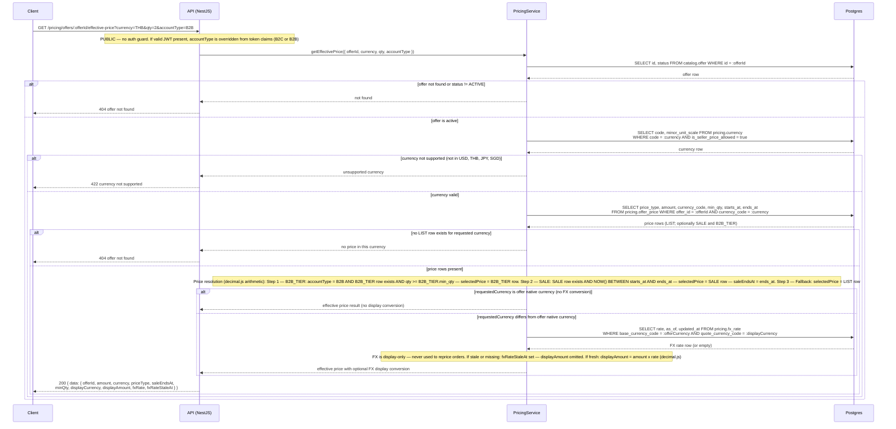
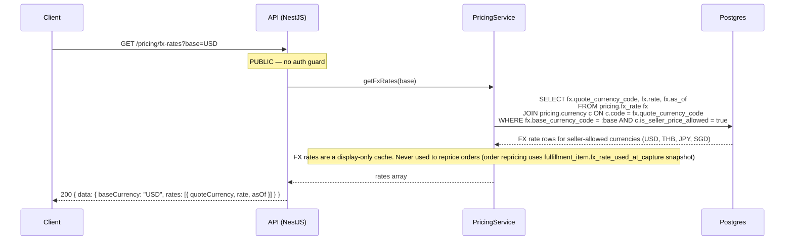

# Pricing API

**Module:** `Pricing`  
**Parent:** [API Design Index](../api-design.md)  
**Source of truth:** [BRD v1.1](../../requirements/BRD.md), [ERD](../data-model-erd.md)

---

## Endpoint Index

| Method | Path | Auth | Description |
|--------|------|------|-------------|
| `GET` | [`/pricing/offers/:id/effective-price`](#get-effective-price) | PUBLIC | Resolve effective price (LIST / SALE / B2B_TIER) with optional FX display |
| `GET` | [`/pricing/fx-rates`](#list-fx-rates) | PUBLIC | Display-only FX rate cache |

---

## DB Mapping

| Endpoint | Primary DB | Tables |
|----------|-----------|--------|
| `GET /pricing/offers/:id/effective-price` | Postgres | `pricing.offer_price` (resolve by account type + time + qty), `pricing.fx_rate` (display conversion), `pricing.currency` |
| `GET /pricing/fx-rates` | Postgres | `pricing.fx_rate`, `pricing.currency` (read-only cache) |

**Note:** FX rates are display-only. They are never used to reprice orders. `fulfillment_item.fx_rate_used_at_capture` is a separate snapshot taken at checkout time.

---

## Endpoints

### Get effective price

```
GET /pricing/offers/:offerId/effective-price
Tag: Pricing
Auth: PUBLIC (buyer account type from JWT if authenticated)
```
**Query params**
- `currency`: `USD | THB | JPY | SGD` (required) — **buyer's requested display currency**
- `qty`: integer ≥ 1 (default 1)
- `accountType`: `B2C | B2B` (default B2C; overridden by JWT if authenticated)

**Response 200**
```json
{
  "data": {
    "offerId": "uuid",
    "amount": "99.99",
    "currency": "USD",
    "priceType": "LIST | SALE | B2B_TIER",
    "saleEndsAt": "ISO8601 | null",
    "minQty": 1,
    "displayCurrency": "THB",
    "displayAmount": "3440.00",
    "fxRate": "34.40000000",
    "fxRateStaleAt": "ISO8601 | null"
  }
}
```
**Field semantics:**
- `amount` / `currency` — seller's native pricing currency (the price row stored in `pricing.offer_price`)
- `displayCurrency` / `displayAmount` / `fxRate` / `fxRateStaleAt` — buyer's requested display currency (FX-converted, display-only). Omitted when `currency` param matches the offer's native currency (no conversion needed). `fxRateStaleAt` is set (and `displayAmount` omitted) when the FX rate is missing or stale.
**Errors:** 404 offer not found, 422 currency not supported

#### Sequence



---

### List FX rates

```
GET /pricing/fx-rates
Tag: Pricing
Auth: PUBLIC
```
**Query params:** `base` (default USD)  
**Response 200**
```json
{
  "data": {
    "baseCurrency": "USD",
    "rates": [
      { "quoteCurrency": "THB", "rate": "34.40000000", "asOf": "ISO8601" }
    ]
  }
}
```

#### Sequence


