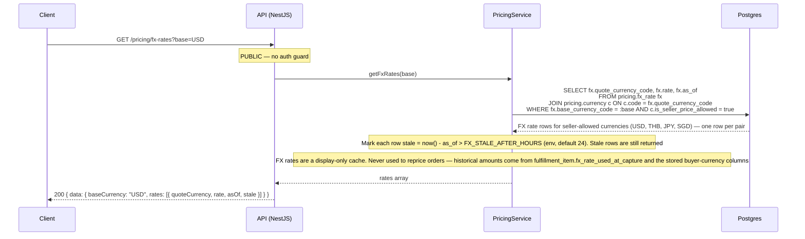

# Pricing API

**Status:** Complete  
**Module:** `Pricing`  
**Parent:** [API Design Index](../api-design.md)  
**Source of truth:** [BRD v1.2](../../requirements/BRD.md), [ERD](../data-model-erd.md)  
**Conventions:** [api-conventions.md](../../../conventions/api-conventions.md) — `operationId` naming (`<Module>_<verb><Resource>`), response envelope, cursor pagination, error shape, money-as-string  
**Correlation:** every endpoint accepts an `X-Correlation-ID` request header, generates a UUIDv7 when it is absent, echoes it on the response, and carries the same value into every log line and into the `correlation_id` field of every Kafka event envelope and `platform.outbox_event` row it writes — see [observability.md § Correlation ID](../../../conventions/observability.md#correlation-id).

---

## Summary

- [Endpoint Index](#endpoint-index)
- [DB Mapping](#db-mapping)
- [Pricing Constraints](#pricing-constraints)
- [Endpoints](#endpoints)

<a id="endpoint-index"></a>
## Endpoint Index

| Method | Path | Auth | Description |
|--------|------|------|-------------|
| `GET` | [`/pricing/offers/:id/effective-price`](#get-effective-price) | PUBLIC | Resolve effective price (LIST / SALE / B2B_TIER) with optional FX display |
| `GET` | [`/pricing/fx-rates`](#list-fx-rates) | PUBLIC | Display-only FX rate cache |

---

<a id="db-mapping"></a>
## DB Mapping

| Endpoint | Primary DB | Tables |
|----------|-----------|--------|
| `GET /pricing/offers/:id/effective-price` | Postgres | `catalog.offer` (`native_currency_code`), `pricing.offer_price` (resolve by account type + time + qty), `pricing.fx_rate` (display conversion), `pricing.currency` |
| `GET /pricing/fx-rates` | Postgres | `pricing.fx_rate`, `pricing.currency` (read-only cache) |

**Note:** FX rates are display-only. They are never used to reprice orders. `fulfillment_item.fx_rate_used_at_capture` is a separate snapshot taken at checkout time, and every buyer-currency amount on an order is stored alongside it, never recomputed on read.

---

<a id="pricing-constraints"></a>
## Pricing Constraints

These are database constraints, not application checks; every write path in [seller.md](seller.md) fails against them rather than re-implementing them.

**One pricing currency per offer.** `pricing.offer_price` carries **no currency column**. A price row's currency is `catalog.offer.native_currency_code` on its parent offer, which is `NOT NULL` and restricted to the V1 seller allowlist (`USD`, `THB`, `JPY`, `SGD`). A seller who wants to sell the same product in a second currency creates a second offer. Currency therefore drops out of every uniqueness key below, and no endpoint has to pick a currency for an offer.

**Uniqueness.** A single unique key over `(offer_id, price_type, min_qty)` cannot be used, because it ignores the time bounds and so makes a scheduled `SALE` alongside a live one impossible (FR-P-06b). Two constraints are used instead, both scoped to live rows (`inactive_at IS NULL`):

- `LIST` and `B2B_TIER` — partial unique index on `(offer_id, price_type, min_qty) WHERE price_type <> 'SALE' AND inactive_at IS NULL`.
- `SALE` — `EXCLUDE USING gist (offer_id WITH =, tstzrange(starts_at, ends_at) WITH &&) WHERE (price_type = 'SALE' AND inactive_at IS NULL)`. This puts US-S-04b:91 ("overlapping SALE periods are rejected") in the database while still permitting any number of sequential, non-overlapping `SALE` rows on one offer.

The `SALE` constraint requires the `btree_gist` extension: `CREATE EXTENSION IF NOT EXISTS btree_gist;`, applied in migration `0001_create_extensions` before the `pricing` migration runs. The `tstzrange … WITH &&` operand is core, but `offer_id WITH =` is not — `offer_id` is `UUID`, PostgreSQL 16 ships no GiST operator class for `uuid`, and `gist_uuid_ops` comes only from `btree_gist`. Without the extension the migration fails with `data type uuid has no default operator class for access method "gist"`. `btree_gist` is a bundled contrib module present in the official `postgres:16-alpine` image and trusted since PG13, so the database owner creates it without superuser and no custom image is needed. The NFR-18 portability caveat is that a managed Postgres which blocks contrib modules blocks this constraint.

**At most one active `LIST` price per offer** follows from the partial unique index, since `LIST` rows always have `min_qty = 1`. US-S-04b:95 words this rule as "one active LIST price per offer per currency", but an offer has exactly one currency, so the per-currency qualifier collapses and the message drops it. A write that would create a second `LIST` row is rejected with:

```
A LIST price already exists for this offer. Edit or delete it before creating a new one.
```

**At least one active `LIST` price per offer** is required for resolution to terminate: it is the fallback price type, so an offer with no live `LIST` row has no effective price and `GET /pricing/offers/:id/effective-price` answers `422`. Seller price deletion refuses to remove the last `LIST` row (US-S-04b:90).

**`B2B_TIER` requires `min_qty >= 2`** (`CHECK (price_type <> 'B2B_TIER' OR min_qty > 1)`), so a tier can never shadow the `LIST` price at quantity 1.

---

<a id="endpoints"></a>
## Endpoints

### Get effective price

```
GET /pricing/offers/:offerId/effective-price
Tag: Pricing
Auth: PUBLIC (buyer account type from JWT if authenticated)
```
**Query params**
- `currency`: `USD | THB | JPY | SGD` (required) — **buyer's requested display currency**
- `qty`: integer ≥ 1 (default 1)
- `accountType`: `B2C | B2B` (default B2C; overridden by the JWT `account_type` claim if authenticated)

**Response 200**
```json
{
  "data": {
    "offerId": "uuid",
    "amount": "99.99",
    "currency": "USD",
    "priceType": "LIST | SALE | B2B_TIER",
    "saleEndsAt": "ISO8601 | null",
    "minQty": 1,
    "displayCurrency": "THB",
    "displayAmount": "3440.00",
    "fxRate": "34.40000000",
    "fxAsOf": "ISO8601 | null",
    "fxStale": false
  }
}
```
**Field semantics:**
- `amount` / `currency` — the resolved price row's amount and the offer's `native_currency_code`. The `currency` **query param plays no part in choosing the row**: an offer has exactly one pricing currency, so resolution is by `price_type` alone — `B2B_TIER` (`accountType = B2B` and `qty >= min_qty`, highest qualifying tier) → `SALE` (live time window) → `LIST`. Rows with a non-null `inactive_at` are excluded. See [Pricing Constraints](#pricing-constraints).
- `minQty` — the `min_qty` of the resolved row: `1` for `LIST` and `SALE`, the tier threshold for `B2B_TIER`.
- `displayCurrency` / `displayAmount` / `fxRate` / `fxAsOf` / `fxStale` — the same amount rendered in the requested display currency, converted with `pricing.fx_rate`. Display-only: nothing here is captured on an order. All five keys are always present, with three cases:

  | Case | `displayAmount` | `displayCurrency` | `fxRate` | `fxAsOf` | `fxStale` |
  |---|---|---|---|---|---|
  | `currency` equals the offer's native currency | echoes `amount` | echoes `currency` | `null` | `null` | `false` |
  | FX row exists for the pair | converted amount | requested currency | the rate | the row's `as_of` | `true` when `now() - as_of > FX_STALE_AFTER_HOURS` (env, default 24), else `false` |
  | no FX row exists for the pair | `null` | requested currency | `null` | `null` | `null` |

  A stale rate is still returned and still converted; the client presents it as an indicative rate rather than hiding it. `displayAmount` is `null` only when the pair has no row at all. This is the single nullability contract shared with [`catalog.md`](catalog.md#get-product-offers), [`cart.md`](cart.md#get-cart) and [`search.md`](search.md#product-search).

**Errors:** 404 offer not found, 422 currency not supported, 422 no active price available for this offer

#### Sequence


```mermaid
sequenceDiagram
    participant Client
    participant API as API (NestJS)
    participant PricingService
    participant Postgres

    Client->>API: GET /pricing/offers/:offerId/effective-price?currency=THB&qty=2&accountType=B2B
    Note over API: PUBLIC — no auth guard. If valid JWT present, accountType is overridden from token claims (B2C or B2B)
    API->>PricingService: getEffectivePrice({ offerId, currency, qty, accountType })

    PricingService->>Postgres: SELECT id, status, native_currency_code FROM catalog.offer WHERE id = :offerId
    Postgres-->>PricingService: offer row (native_currency_code is the offer's only pricing currency)
    alt offer not found or status != ACTIVE
        PricingService-->>API: not found
        API-->>Client: 404 offer not found
    end

    PricingService->>Postgres: SELECT code, minor_unit_scale FROM pricing.currency<br/>WHERE code = :currency AND is_seller_price_allowed = true
    Postgres-->>PricingService: currency row
    alt currency not supported (not in USD, THB, JPY, SGD)
        PricingService-->>API: unsupported currency
        API-->>Client: 422 currency not supported
    end

    PricingService->>Postgres: SELECT price_type, amount, min_qty, starts_at, ends_at<br/>FROM pricing.offer_price<br/>WHERE offer_id = :offerId AND inactive_at IS NULL
    Note over PricingService,Postgres: No currency predicate — offer_price has no currency column. Every row is denominated in offer.native_currency_code
    Postgres-->>PricingService: live price rows (LIST&#59; optionally SALE and B2B_TIER)
    alt no live LIST row exists for this offer
        PricingService-->>API: no active price
        API-->>Client: 422 Unprocessable Entity "No active price available for this offer"
    end

    Note over PricingService: Price resolution (decimal.js), currency-independent: B2B_TIER if accountType=B2B and qty ≥ min_qty (highest qualifying tier) → SALE if NOW() BETWEEN starts_at AND ends_at → LIST fallback
    Note over PricingService: FX display: if requestedCurrency == offer.native_currency_code — displayAmount = amount, displayCurrency = currency, fxRate = null, fxAsOf = null, fxStale = false. If different — read the single pricing.fx_rate row for the pair#59; row present: displayAmount = amount × rate (decimal.js, rounded once with the display currency's minor_unit_scale), fxAsOf = as_of, fxStale = now() - as_of > FX_STALE_AFTER_HOURS (env, default 24)#59; no row: displayAmount = null, fxRate = null, fxAsOf = null, fxStale = null.
    alt requestedCurrency differs from offer.native_currency_code
        PricingService->>Postgres: SELECT rate, as_of FROM pricing.fx_rate<br/>WHERE base_currency_code = :offerCurrency AND quote_currency_code = :displayCurrency
        Postgres-->>PricingService: FX rate row (or empty) — one row per pair, no history
    end

    PricingService-->>API: effective price result
    API-->>Client: 200 { data: { offerId, amount, currency, priceType, saleEndsAt,<br/>minQty, displayCurrency, displayAmount, fxRate, fxAsOf, fxStale } }
```

---

### List FX rates

```
GET /pricing/fx-rates
Tag: Pricing
Auth: PUBLIC
```
**Query params:** `base` (default USD)  
**Response 200**
```json
{
  "data": {
    "baseCurrency": "USD",
    "rates": [
      { "quoteCurrency": "THB", "rate": "34.40000000", "asOf": "ISO8601", "stale": false }
    ]
  }
}
```
**Field semantics:** `pricing.fx_rate` holds exactly one row per currency pair and keeps no history — refresh is an upsert in place, so `asOf` (the provider's timestamp for the current value) is the only field staleness is measured against; there is no `fetchedAt`. `stale` is `true` when `now() - asOf > FX_STALE_AFTER_HOURS` (env, default 24). A stale rate is still returned; the client presents it as an indicative rate. This is not a paginated list — the response is a single `data` object because the row count is bounded by the currency allowlist.

#### Sequence


```mermaid
sequenceDiagram
    participant Client
    participant API as API (NestJS)
    participant PricingService
    participant Postgres

    Client->>API: GET /pricing/fx-rates?base=USD
    Note over API: PUBLIC — no auth guard
    API->>PricingService: getFxRates(base)
    PricingService->>Postgres: SELECT fx.quote_currency_code, fx.rate, fx.as_of<br/>FROM pricing.fx_rate fx<br/>JOIN pricing.currency c ON c.code = fx.quote_currency_code<br/>WHERE fx.base_currency_code = :base AND c.is_seller_price_allowed = true
    Postgres-->>PricingService: FX rate rows for seller-allowed currencies (USD, THB, JPY, SGD) — one row per pair
    Note over PricingService: Mark each row stale = now() - as_of > FX_STALE_AFTER_HOURS (env, default 24). Stale rows are still returned
    Note over PricingService: FX rates are a display-only cache. Never used to reprice orders — historical amounts come from fulfillment_item.fx_rate_used_at_capture and the stored buyer-currency columns
    PricingService-->>API: rates array
    API-->>Client: 200 { data: { baseCurrency: "USD", rates: [{ quoteCurrency, rate, asOf, stale }] } }
```
