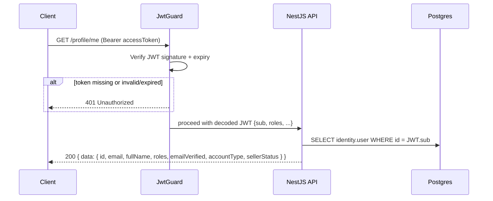
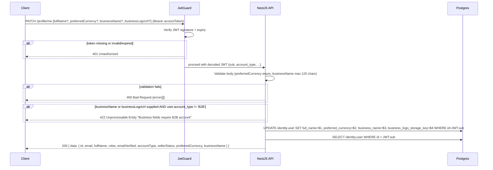
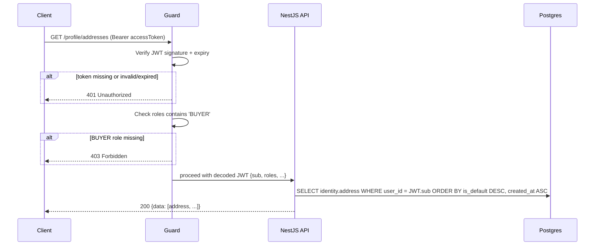
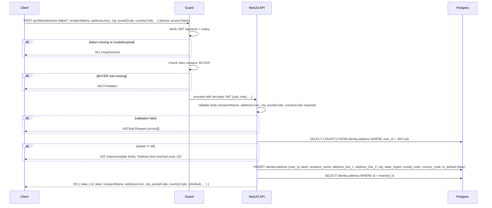
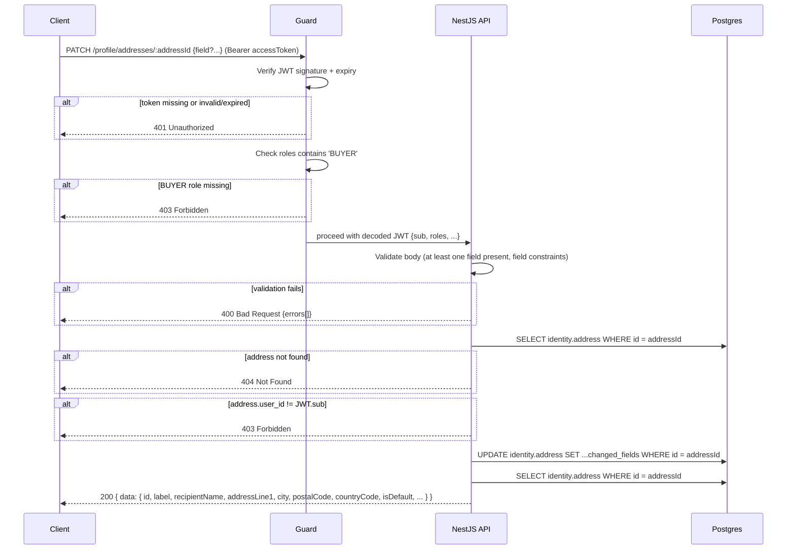
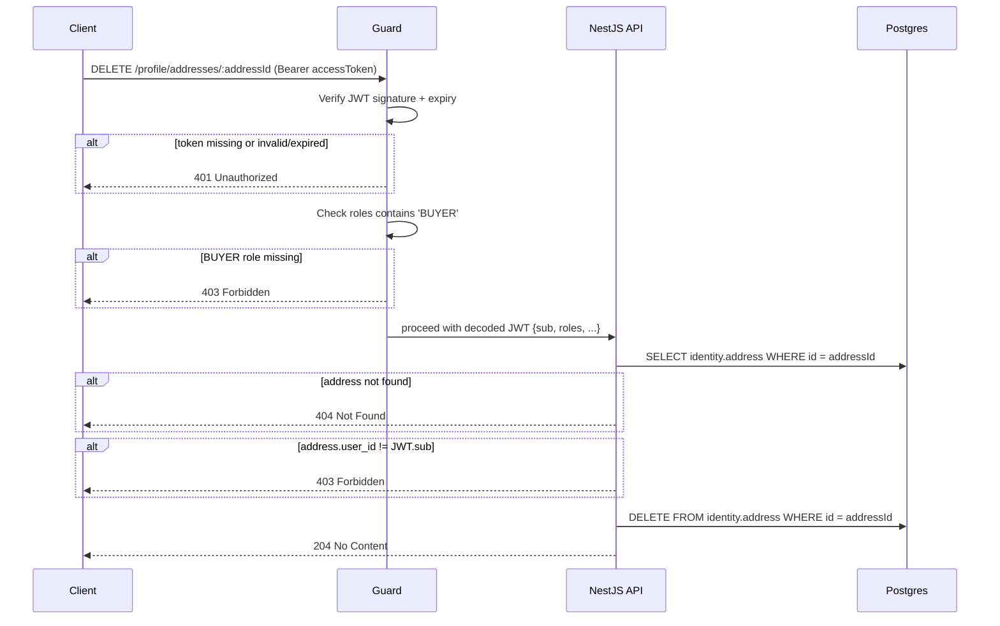
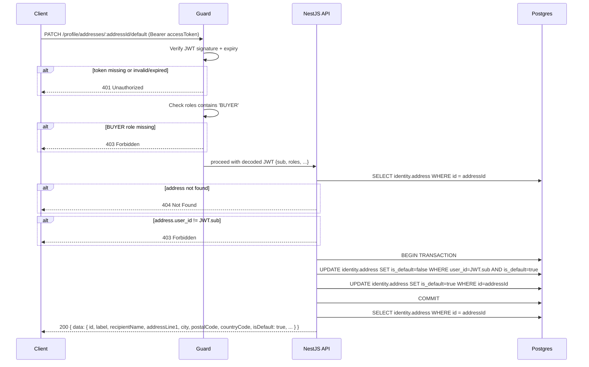

# Profile API

**Module:** `Profile`  
**Parent:** [API Design Index](../api-design.md)  
**Source of truth:** [BRD v1.1](../../requirements/BRD.md), [ERD](../data-model-erd.md)

---

## Summary

- [Endpoint Index](#endpoint-index)
- [DB Mapping](#db-mapping)
- [Endpoints](#endpoints)

<a id="endpoint-index"></a>
## Endpoint Index

| Method | Path | Auth | Description |
|--------|------|------|-------------|
| `GET` | [`/profile/me`](#get-own-profile) | JWT | Get authenticated user's profile |
| `PATCH` | [`/profile/me`](#update-profile) | JWT | Update profile fields |
| `GET` | [`/profile/addresses`](#list-saved-addresses) | BUYER | List saved addresses |
| `POST` | [`/profile/addresses`](#create-address) | BUYER | Add new address (max 10) |
| `PATCH` | [`/profile/addresses/:id`](#update-address) | BUYER | Update address fields |
| `DELETE` | [`/profile/addresses/:id`](#delete-address) | BUYER | Remove address |
| `PATCH` | [`/profile/addresses/:id/default`](#set-default-address) | BUYER | Set address as default |

---

<a id="db-mapping"></a>
## DB Mapping

| Endpoint | Primary DB | Tables |
|----------|-----------|--------|
| `GET /profile/me` | Postgres | `identity.user` (read) |
| `PATCH /profile/me` | Postgres | `identity.user` (update) |
| `GET /profile/addresses` | Postgres | `identity.address` (read list) |
| `POST /profile/addresses` | Postgres | `identity.address` (insert; max 10 per user) |
| `PATCH /profile/addresses/:id` | Postgres | `identity.address` (update) |
| `DELETE /profile/addresses/:id` | Postgres | `identity.address` (hard delete) |
| `PATCH /profile/addresses/:id/default` | Postgres | `identity.address` (toggle `is_default`) |

---

<a id="endpoints"></a>
## Endpoints

### Get own profile

```
GET /profile/me
Tag: Profile
Auth: JWT
```
**Response 200**
```json
{
  "data": {
    "id": "uuid",
    "email": "string",
    "fullName": "string",
    "roles": ["BUYER"],
    "emailVerified": true,
    "accountType": "B2C",
    "sellerStatus": "APPROVED | null"
  }
}
```

#### Sequence



---

### Update profile

```
PATCH /profile/me
Tag: Profile
Auth: JWT
```
**Request body** (all optional)
```json
{
  "fullName": "string",
  "preferredCurrency": "USD | THB | JPY | SGD | AUTO | null",
  "businessName": "string (max 120 chars, B2B accounts only) | null",
  "businessLogoUrl": "string | null"
}
```
**Response 200** — updated profile wrapped in `data`

#### Sequence



---

### List saved addresses

```
GET /profile/addresses
Tag: Profile
Auth: BUYER
Pagination: none (typically small list)
```
**Response 200**
```json
{
  "data": [{
    "id": "uuid",
    "label": "Home",
    "recipientName": "string",
    "addressLine1": "string",
    "addressLine2": "string | null",
    "city": "string",
    "stateRegion": "string | null",
    "postalCode": "string",
    "countryCode": "TH",
    "isDefault": true
  }]
}
```

#### Sequence



---

### Create address

```
POST /profile/addresses
Tag: Profile
Auth: BUYER
```
**Request body** — same fields as list item (minus `id`, `isDefault`)  
**Limit:** Max 10 addresses per user; returns HTTP 422 with message "Address limit reached (max 10)" when exceeded.  
**Response 201** — created address wrapped in `data`  
**Errors:** 422 address limit reached

#### Sequence



---

### Update address

```
PATCH /profile/addresses/:addressId
Tag: Profile
Auth: BUYER
```
**Request body** (all optional) — subset of address fields  
**Errors:** 404 not found, 403 not owner

#### Sequence



---

### Delete address

```
DELETE /profile/addresses/:addressId
Tag: Profile
Auth: BUYER
```
**Response 204**  
**Errors:** 404, 403

#### Sequence



---

### Set default address

```
PATCH /profile/addresses/:addressId/default
Tag: Profile
Auth: BUYER
```
**Response 200** — updated address with `isDefault: true`

#### Sequence


