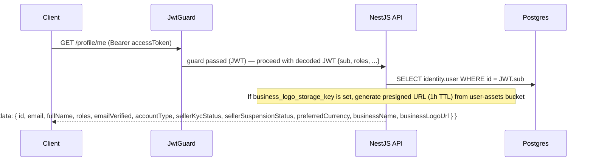
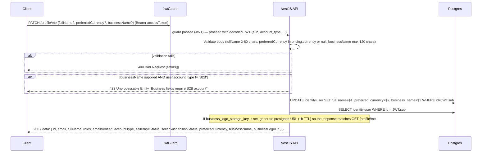
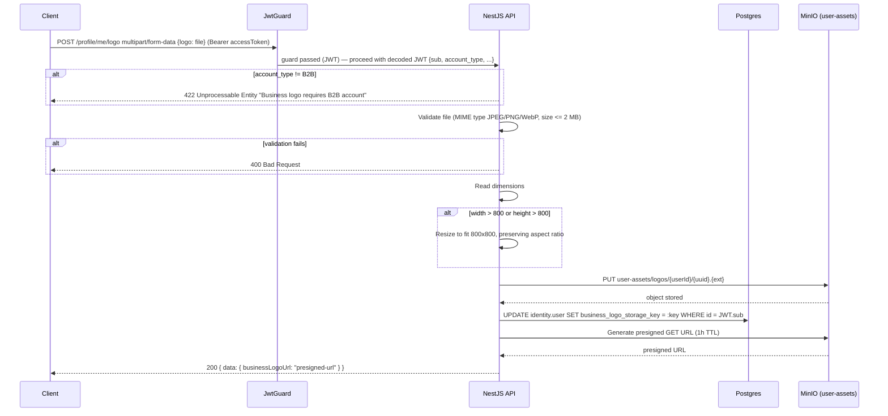
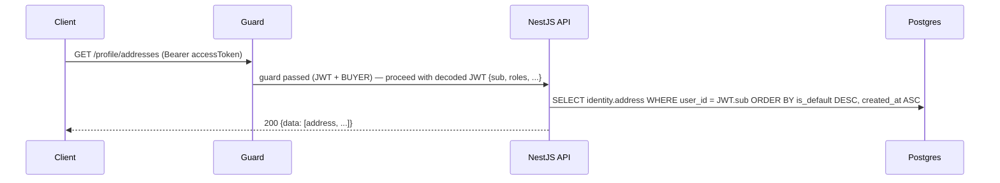
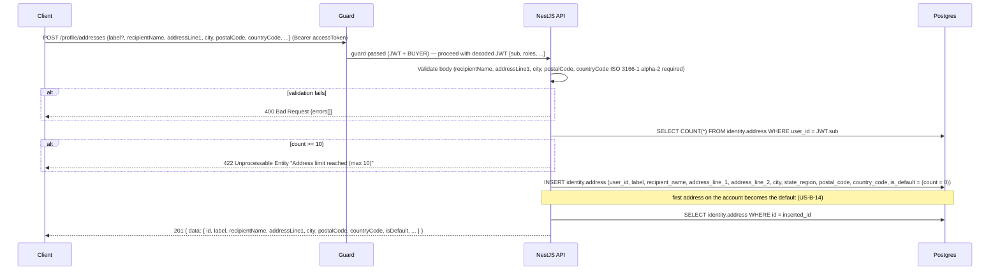
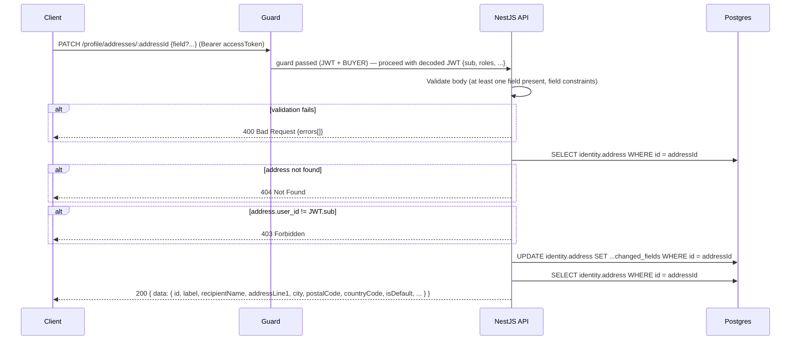
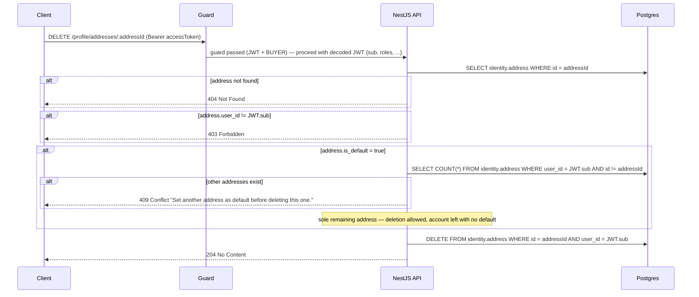
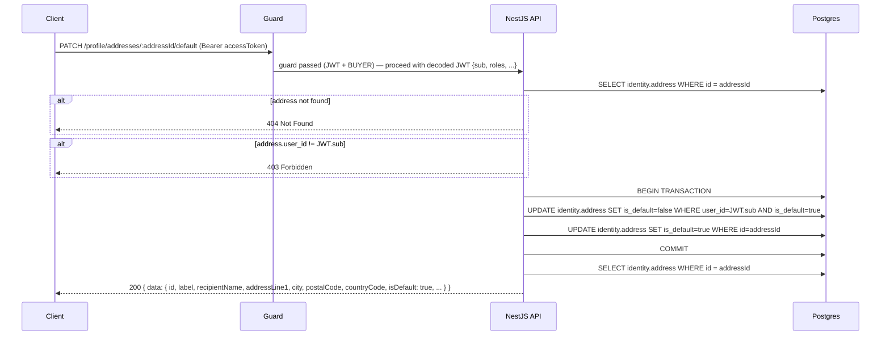

# Profile API

**Status:** Complete  
**Module:** `Profile`  
**Parent:** [API Design Index](../api-design.md)  
**Source of truth:** [BRD v1.4](../../requirements/BRD.md), [ERD](../data-model-erd.md)  
**Conventions:** [api-conventions.md](../../../conventions/api-conventions.md) — `operationId` naming (`<Module>_<verb><Resource>`), response envelope, cursor pagination, error shape, money-as-string. Correlation-ID propagation, the error envelope and rate-limit headers apply to every endpoint in this document and are stated once in [api-design.md § 1 Conventions](../api-design.md#conventions).

---

## Summary

- [Endpoint Index](#endpoint-index)
- [DB Mapping](#db-mapping)
- [Endpoints](#endpoints)

<a id="endpoint-index"></a>
## Endpoint Index

| Method | Path | Auth | Description |
|--------|------|------|-------------|
| `GET` | [`/profile/me`](#get-own-profile) | JWT | Get authenticated user's profile |
| `PATCH` | [`/profile/me`](#update-profile) | JWT | Update profile fields |
| `POST` | [`/profile/me/logo`](#upload-business-logo) | JWT | Upload business logo to MinIO; returns storage key |
| `GET` | [`/profile/addresses`](#list-saved-addresses) | BUYER | List saved addresses |
| `POST` | [`/profile/addresses`](#create-address) | BUYER | Add new address (max 10) |
| `PATCH` | [`/profile/addresses/:addressId`](#update-address) | BUYER | Update address fields |
| `DELETE` | [`/profile/addresses/:addressId`](#delete-address) | BUYER | Remove address |
| `PATCH` | [`/profile/addresses/:addressId/default`](#set-default-address) | BUYER | Set address as default |

---

<a id="db-mapping"></a>
## DB Mapping

| Endpoint | Primary DB | Tables |
|----------|-----------|--------|
| `GET /profile/me` | Postgres | `identity.user` (read) |
| `PATCH /profile/me` | Postgres | `identity.user` (update) |
| `POST /profile/me/logo` | MinIO + Postgres | Upload logo to `user-assets` bucket; store object key in `identity.user.business_logo_storage_key` |
| `GET /profile/addresses` | Postgres | `identity.address` (read list) |
| `POST /profile/addresses` | Postgres | `identity.address` (insert; max 10 per user) |
| `PATCH /profile/addresses/:addressId` | Postgres | `identity.address` (update) |
| `DELETE /profile/addresses/:addressId` | Postgres | `identity.address` (hard delete; refused while the row is the default) |
| `PATCH /profile/addresses/:addressId/default` | Postgres | `identity.address` (toggle `is_default`) |

---

<a id="endpoints"></a>
## Endpoints

> **The guard step in every sequence below is drawn as one line.** It stands for the
> same chain everywhere, evaluated in this order, first failure wins: a missing,
> invalid or expired access token is `401 Unauthorized`; on a `BUYER` route a valid
> token whose `roles` claim does not contain `BUYER` is `403 Forbidden`. Guards compare
> decoded JWT claims and query no table ([auth-jwt-design § 4](../../../conventions/auth-jwt-design.md#auth-guards)).
> Each endpoint's guard is named on its `Auth:` line and in [api-design.md § 1.1](../api-design.md#11-guard-application-matrix).

### Get own profile

```
GET /profile/me
Tag: Profile
Auth: JWT
```
**Response 200**
```json
{
  "data": {
    "id": "uuid",
    "email": "string",
    "fullName": "string",
    "roles": ["BUYER"],
    "emailVerified": true,
    "accountType": "B2C",
    "sellerKycStatus": "PENDING_KYC | APPROVED | REJECTED | null",
    "sellerSuspensionStatus": "ACTIVE | SUSPENDED | null",
    "preferredCurrency": "USD | THB | JPY | SGD | null",
    "businessName": "string | null",
    "businessLogoUrl": "string | null"
  }
}
```

**Notes:**
- `sellerKycStatus` and `sellerSuspensionStatus` mirror the two independent JWT claims of the same names ([auth-jwt-design § 1.1](../../../conventions/auth-jwt-design.md#jwt-payload-structure)) and the two `seller.seller_profile` columns behind them. Both are `null` when the account holds no SELLER role. There is no combined `sellerStatus` field — a seller can be KYC-approved and suspended at once, so one field cannot express the state.
- `preferredCurrency` drives display-currency resolution across the buyer and seller portals. It is an ISO 4217 code from the seller-priceable set, or `null`. **`null` is the "Auto" setting** — the display currency is resolved from `Accept-Language` at request time, falling back to `USD` when the resolved currency is not supported. There is no `"AUTO"` value: the column is `CHAR(3)` with an FK to `pricing.currency(code)` (ERD `identity.user`), and `AUTO` is not a currency.
- `businessName` and `businessLogoUrl` are non-null only for `accountType = B2B`. `businessLogoUrl` is a presigned URL (1-hour TTL) generated from `identity.user.business_logo_storage_key`.

#### Sequence


```mermaid
sequenceDiagram
    participant C as Client
    participant G as JwtGuard
    participant A as NestJS API
    participant PG as Postgres

    C->>G: GET /profile/me (Bearer accessToken)
    G->>A: guard passed (JWT) — proceed with decoded JWT {sub, roles, ...}

    A->>PG: SELECT identity.user WHERE id = JWT.sub
    Note over A: If business_logo_storage_key is set, generate presigned URL (1h TTL) from user-assets bucket

    A-->>C: 200 { data: { id, email, fullName, roles, emailVerified, accountType, sellerKycStatus, sellerSuspensionStatus, preferredCurrency, businessName, businessLogoUrl } }
```

---

### Update profile

```
PATCH /profile/me
Tag: Profile
Auth: JWT
```
**Request body** (all optional)
```json
{
  "fullName": "string (2–80 chars)",
  "preferredCurrency": "USD | THB | JPY | SGD | null",
  "businessName": "string (max 120 chars, B2B accounts only) | null"
}
```
**`preferredCurrency` semantics:**
- ISO 4217 code (`"USD"`, `"THB"`, `"JPY"`, `"SGD"`): display prices are converted to that currency using the **cached display-only FX rates** in `pricing.fx_rate`, refreshed by the scheduled FX job (US-P-02). The API never calls an FX provider inline, and never converts a stored order amount.
- `null` — the "Auto" setting: the display currency is resolved from the `Accept-Language` header on each request, falling back to `USD` when the resolved currency is unsupported.
- A converted amount is an estimate. Responses that carry one also carry the rate's `as_of` timestamp so the client can render the mandated "estimated" label (FR-P-02); when `now() - as_of` exceeds the staleness window the rate is returned marked stale.
- The display currency is resolved at checkout submission time and snapshotted as `orders.fulfillment.buyer_display_currency`, alongside the already-converted `buyer_currency_total` (FR-P-03). Subsequent profile changes do not alter historical order display, and no reader re-derives a historical amount from this setting or from a live rate.

**Response 200** — the updated profile wrapped in `data`, in the same shape as [`GET /profile/me`](#get-own-profile) including `businessLogoUrl`  
**Errors:** 400 validation (`fullName` outside 2–80 chars, `preferredCurrency` not a seller-priceable ISO 4217 code), 422 business field supplied on a non-B2B account

#### Sequence


```mermaid
sequenceDiagram
    participant C as Client
    participant G as JwtGuard
    participant A as NestJS API
    participant PG as Postgres

    C->>G: PATCH /profile/me {fullName?, preferredCurrency?, businessName?} (Bearer accessToken)
    G->>A: guard passed (JWT) — proceed with decoded JWT {sub, account_type, ...}

    A->>A: Validate body (fullName 2-80 chars, preferredCurrency in pricing.currency or null, businessName max 120 chars)
    alt validation fails
        A-->>C: 400 Bad Request {errors[]}
    end

    alt businessName supplied AND user.account_type != 'B2B'
        A-->>C: 422 Unprocessable Entity "Business fields require B2B account"
    end

    A->>PG: UPDATE identity.user SET full_name=$1, preferred_currency=$2, business_name=$3 WHERE id=JWT.sub

    A->>PG: SELECT identity.user WHERE id = JWT.sub
    Note over A: If business_logo_storage_key is set, generate presigned URL (1h TTL) so the response matches GET /profile/me
    A-->>C: 200 { data: { id, email, fullName, roles, emailVerified, accountType, sellerKycStatus, sellerSuspensionStatus, preferredCurrency, businessName, businessLogoUrl } }
```

---

<a id="upload-business-logo"></a>
### Upload business logo

```
POST /profile/me/logo
Tag: Profile
Auth: JWT
```
**Request:** `multipart/form-data` — single file field `logo` (JPEG/PNG/WebP, max 2 MB, max 800 × 800 px).  
**Response 200** — updated profile with new `businessLogoUrl`
```json
{ "data": { "businessLogoUrl": "https://minio.../presigned-url" } }
```
**Errors:** 400 invalid file type or size, 422 non-B2B account

**Notes:**
- Server generates a UUID filename; client-supplied filename is ignored.
- Dimensions are read server-side before storage. An image larger than 800 × 800 px is **resized down** to fit that box, preserving aspect ratio, and the resized image is what gets stored (US-B-15). Oversized dimensions are not a validation failure — only an unsupported MIME type or a file above 2 MB is.
- File stored in `user-assets` bucket under key `user-assets/logos/{userId}/{uuid}.{ext}`.
- After upload, `identity.user.business_logo_storage_key` is updated in the same request.
- Presigned URL in response has 1-hour TTL.

#### Sequence


```mermaid
sequenceDiagram
    participant C as Client
    participant G as JwtGuard
    participant A as NestJS API
    participant PG as Postgres
    participant MinIO as MinIO (user-assets)

    C->>G: POST /profile/me/logo multipart/form-data {logo: file} (Bearer accessToken)
    G->>A: guard passed (JWT) — proceed with decoded JWT {sub, account_type, ...}

    alt account_type != B2B
        A-->>C: 422 Unprocessable Entity "Business logo requires B2B account"
    end

    A->>A: Validate file (MIME type JPEG/PNG/WebP, size <= 2 MB)
    alt validation fails
        A-->>C: 400 Bad Request
    end

    A->>A: Read dimensions
    alt width > 800 or height > 800
        A->>A: Resize to fit 800x800, preserving aspect ratio
    end

    A->>MinIO: PUT user-assets/logos/{userId}/{uuid}.{ext}
    MinIO-->>A: object stored

    A->>PG: UPDATE identity.user SET business_logo_storage_key = :key WHERE id = JWT.sub

    A->>MinIO: Generate presigned GET URL (1h TTL)
    MinIO-->>A: presigned URL
    A-->>C: 200 { data: { businessLogoUrl: "presigned-url" } }
```

---

### List saved addresses

```
GET /profile/addresses
Tag: Profile
Auth: BUYER
Pagination: none
```
**Not paginated.** The list is hard-capped at 10 rows per account (US-B-14), so the cursor envelope of [api-conventions.md § Pagination](../../../conventions/api-conventions.md#pagination) does not apply and no `meta` is returned. Every saved address is returned on every call, default first.

**Response 200**
```json
{
  "data": [{
    "id": "uuid",
    "label": "Home",
    "recipientName": "string",
    "addressLine1": "string",
    "addressLine2": "string | null",
    "city": "string",
    "stateRegion": "string | null",
    "postalCode": "string",
    "countryCode": "TH",
    "isDefault": true
  }]
}
```
`countryCode` is an **ISO 3166-1 alpha-2** code — two characters, stored as `CHAR(2)` (US-B-14). The picker is populated from the full alpha-2 list; no country is restricted in V1.

**Empty state:** an account with no saved addresses returns `{ "data": [] }` — a `200`, not a `404`.

#### Sequence


```mermaid
sequenceDiagram
    participant C as Client
    participant G as Guard
    participant A as NestJS API
    participant PG as Postgres

    C->>G: GET /profile/addresses (Bearer accessToken)
    G->>A: guard passed (JWT + BUYER) — proceed with decoded JWT {sub, roles, ...}

    A->>PG: SELECT identity.address WHERE user_id = JWT.sub ORDER BY is_default DESC, created_at ASC

    A-->>C: 200 {data: [address, ...]}
```

---

### Create address

```
POST /profile/addresses
Tag: Profile
Auth: BUYER
```
**Request body** — same fields as list item (minus `id`, `isDefault`). `countryCode` is ISO 3166-1 alpha-2.  
**Limit:** Max 10 addresses per user; returns HTTP 422 with message "Address limit reached (max 10)" when exceeded.  
**Default:** the **first** address saved on an account is created with `is_default = true`, so a single-address account always has a checkout default (US-B-14). Every subsequent address is created `is_default = false` and must be promoted through [`PATCH /profile/addresses/:addressId/default`](#set-default-address).  
**Response 201** — created address wrapped in `data`  
**Errors:** 400 validation, 422 address limit reached

#### Sequence


```mermaid
sequenceDiagram
    participant C as Client
    participant G as Guard
    participant A as NestJS API
    participant PG as Postgres

    C->>G: POST /profile/addresses {label?, recipientName, addressLine1, city, postalCode, countryCode, ...} (Bearer accessToken)
    G->>A: guard passed (JWT + BUYER) — proceed with decoded JWT {sub, roles, ...}

    A->>A: Validate body (recipientName, addressLine1, city, postalCode, countryCode ISO 3166-1 alpha-2 required)
    alt validation fails
        A-->>C: 400 Bad Request {errors[]}
    end

    A->>PG: SELECT COUNT(*) FROM identity.address WHERE user_id = JWT.sub
    alt count >= 10
        A-->>C: 422 Unprocessable Entity "Address limit reached (max 10)"
    end

    A->>PG: INSERT identity.address (user_id, label, recipient_name, address_line_1, address_line_2, city, state_region, postal_code, country_code, is_default = (count = 0))
    Note over A,PG: first address on the account becomes the default (US-B-14)

    A->>PG: SELECT identity.address WHERE id = inserted_id
    A-->>C: 201 { data: { id, label, recipientName, addressLine1, city, postalCode, countryCode, isDefault, ... } }
```

---

### Update address

```
PATCH /profile/addresses/:addressId
Tag: Profile
Auth: BUYER
```
**Request body** (all optional) — subset of address fields  
**Errors:** 404 not found, 403 not owner

#### Sequence


```mermaid
sequenceDiagram
    participant C as Client
    participant G as Guard
    participant A as NestJS API
    participant PG as Postgres

    C->>G: PATCH /profile/addresses/:addressId {field?...} (Bearer accessToken)
    G->>A: guard passed (JWT + BUYER) — proceed with decoded JWT {sub, roles, ...}

    A->>A: Validate body (at least one field present, field constraints)
    alt validation fails
        A-->>C: 400 Bad Request {errors[]}
    end

    A->>PG: SELECT identity.address WHERE id = addressId
    alt address not found
        A-->>C: 404 Not Found
    end
    alt address.user_id != JWT.sub
        A-->>C: 403 Forbidden
    end

    A->>PG: UPDATE identity.address SET ...changed_fields WHERE id = addressId

    A->>PG: SELECT identity.address WHERE id = addressId
    A-->>C: 200 { data: { id, label, recipientName, addressLine1, city, postalCode, countryCode, isDefault, ... } }
```

---

### Delete address

```
DELETE /profile/addresses/:addressId
Tag: Profile
Auth: BUYER
```
**Default guard:** the current default address cannot be deleted while another saved address exists — the buyer must promote a different address first (US-B-14). The attempt returns `409` with message "Set another address as default before deleting this one." Deleting the **only** address is allowed; the account is then left with no default, and the next address created becomes the default again.

**Response 204**  
**Errors:** 403 not owner, 404 not found, 409 row is the default and other addresses exist

#### Sequence


```mermaid
sequenceDiagram
    participant C as Client
    participant G as Guard
    participant A as NestJS API
    participant PG as Postgres

    C->>G: DELETE /profile/addresses/:addressId (Bearer accessToken)
    G->>A: guard passed (JWT + BUYER) — proceed with decoded JWT {sub, roles, ...}

    A->>PG: SELECT identity.address WHERE id = addressId
    alt address not found
        A-->>C: 404 Not Found
    end
    alt address.user_id != JWT.sub
        A-->>C: 403 Forbidden
    end

    alt address.is_default = true
        A->>PG: SELECT COUNT(*) FROM identity.address WHERE user_id = JWT.sub AND id != addressId
        alt other addresses exist
            A-->>C: 409 Conflict "Set another address as default before deleting this one."
        end
        Note over A: sole remaining address — deletion allowed, account left with no default
    end

    A->>PG: DELETE FROM identity.address WHERE id = addressId AND user_id = JWT.sub

    A-->>C: 204 No Content
```

---

### Set default address

```
PATCH /profile/addresses/:addressId/default
Tag: Profile
Auth: BUYER
```
**Response 200** — updated address with `isDefault: true`

#### Sequence


```mermaid
sequenceDiagram
    participant C as Client
    participant G as Guard
    participant A as NestJS API
    participant PG as Postgres

    C->>G: PATCH /profile/addresses/:addressId/default (Bearer accessToken)
    G->>A: guard passed (JWT + BUYER) — proceed with decoded JWT {sub, roles, ...}

    A->>PG: SELECT identity.address WHERE id = addressId
    alt address not found
        A-->>C: 404 Not Found
    end
    alt address.user_id != JWT.sub
        A-->>C: 403 Forbidden
    end

    A->>PG: BEGIN TRANSACTION
    A->>PG: UPDATE identity.address SET is_default=false WHERE user_id=JWT.sub AND is_default=true
    A->>PG: UPDATE identity.address SET is_default=true WHERE id=addressId
    A->>PG: COMMIT

    A->>PG: SELECT identity.address WHERE id = addressId
    A-->>C: 200 { data: { id, label, recipientName, addressLine1, city, postalCode, countryCode, isDefault: true, ... } }
```
