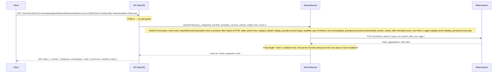
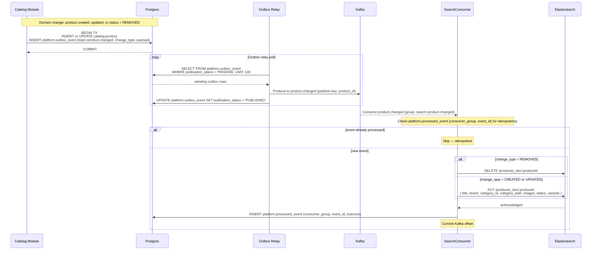
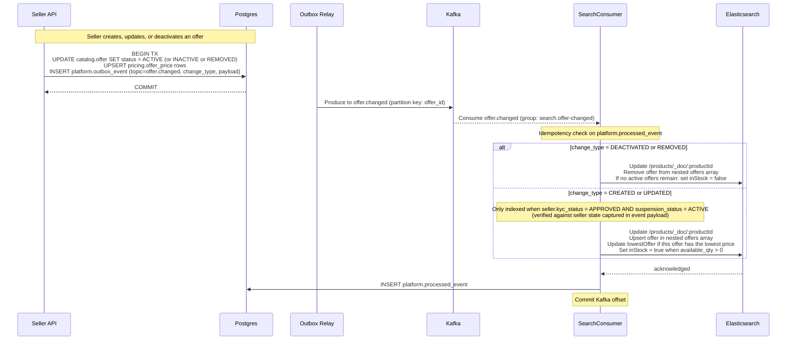
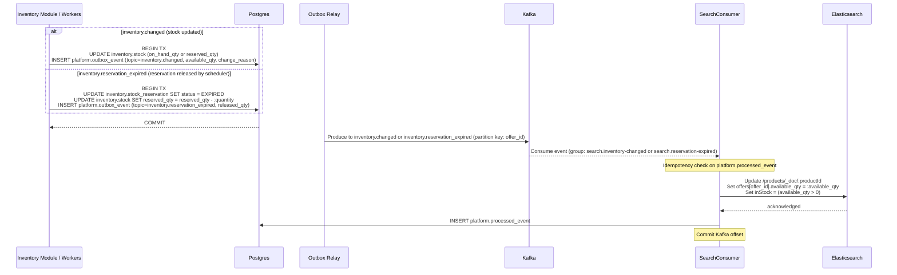
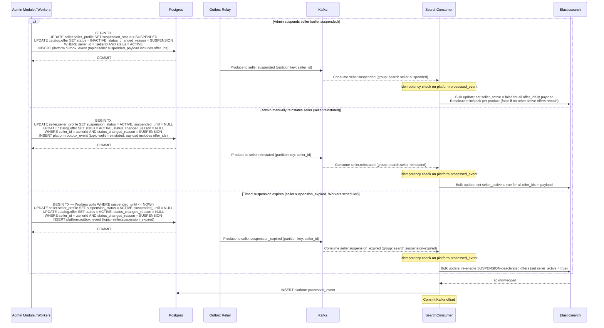
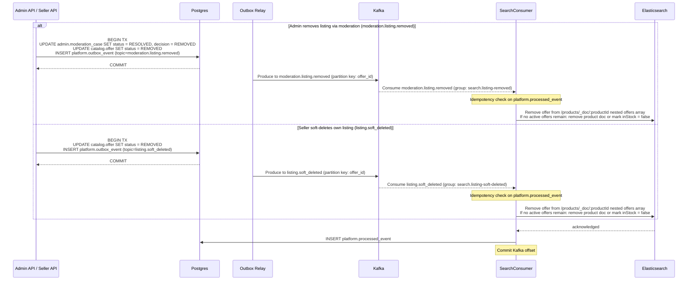
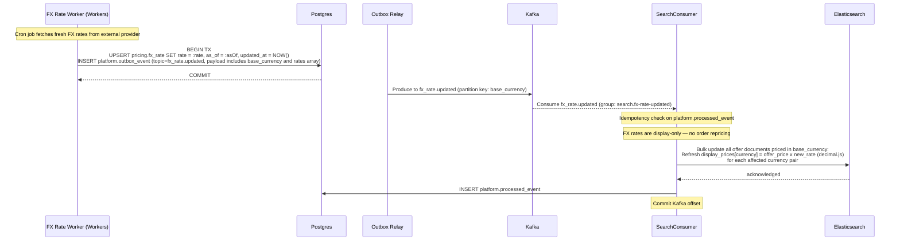

# Search API

**Module:** `Search`  
**Parent:** [API Design Index](../api-design.md)  
**Source of truth:** [BRD v1.1](../../requirements/BRD.md), [ERD](../data-model-erd.md)

---

## Summary

- [Endpoint Index](#endpoint-index)
- [DB Mapping](#db-mapping)
- [Endpoints](#endpoints)
- [ES Index Maintenance](#es-index-maintenance)

<a id="endpoint-index"></a>
## Endpoint Index

| Method | Path | Auth | Description |
|--------|------|------|-------------|
| `GET` | [`/search/products`](#product-search) | PUBLIC | Full-text product search with facets (Elasticsearch `search_after`) |

See [ES Index Maintenance](#es-index-maintenance) for the async Kafka consumer write paths that keep the index current.

---

<a id="db-mapping"></a>
## DB Mapping

| Endpoint | Primary DB | Index / Notes |
|----------|-----------|---------------|
| `GET /search/products` | Elasticsearch | `products` index (read-only, cursor via `search_after`) |

**Write path (async):** The search index is never written by the API. Kafka consumers update it from `catalog`, `offer`, `inventory`, and `seller` events. Offers from non-approved or suspended sellers are excluded at index time — not filtered at query time.

---

<a id="endpoints"></a>
## Endpoints

### Product search

```
GET /search/products
Tag: Search
Auth: PUBLIC
Pagination: cursor (Elasticsearch search_after)
```
**Query params**

| Param | Type | Description |
|-------|------|-------------|
| `q` | string | Full-text query |
| `categoryId` | UUID | Filter by category (includes subcategories) |
| `priceMin` | string (decimal) | Min price in `currency` |
| `priceMax` | string (decimal) | Max price |
| `currency` | ISO 4217 | Currency for price filters (default USD) |
| `inStock` | boolean | Only in-stock offers |
| `sortBy` | `relevance \| priceAsc \| priceDesc \| newest` | Default `relevance` |
| `limit` | int | Default 20, max 100 |
| `cursor` | string | Opaque search_after cursor |

**Response 200**
```json
{
  "data": [{
    "productId": "uuid",
    "title": "string",
    "brand": "string",
    "categoryId": "uuid",
    "categoryPath": ["Electronics", "Cameras"],
    "images": [{ "storageKey": "string" }],
    "lowestOffer": {
      "offerId": "uuid",
      "amount": "99.99",
      "currency": "USD",
      "priceType": "LIST | SALE",
      "displayAmount": "3440.00",
      "displayCurrency": "THB",
      "fxRate": "34.40000000"
    },
    "inStock": true,
    "score": 1.234
  }],
  "facets": {
    "categories": [{ "id": "uuid", "name": "string", "count": 12 }],
    "priceRange": { "min": "9.99", "max": "999.00", "currency": "USD", "displayMin": "344.00", "displayMax": "34400.00", "displayCurrency": "THB" }
  },
  "meta": { "nextCursor": "string | null", "hasMore": true, "total": 250 }
}
```

**Notes:**
- `lowestOffer.amount` / `lowestOffer.currency` = seller's native price. `displayAmount` / `displayCurrency` / `fxRate` = buyer's requested currency, sourced from the pre-computed `display_prices[currency]` map in ES (kept fresh by `fx_rate.updated` consumer). Omitted when `currency` == offer's native currency (no conversion).
- `facets.priceRange` `displayMin` / `displayMax` / `displayCurrency` follow the same rule — omitted when no conversion applies.
- Display prices are for presentation only. Order capture uses `fulfillment_item.fx_rate_used_at_capture` snapshotted at checkout.
- Offers from sellers with `suspension_status = SUSPENDED` or `kyc_status != APPROVED` are excluded from search results. Only offers from KYC-approved, non-suspended sellers appear.

#### Sequence



---

<a id="es-index-maintenance"></a>
## ES Index Maintenance

The `products` Elasticsearch index is a **read model only**. No API handler writes to it directly. All writes are driven by Kafka consumers reacting to domain-change events. Every domain state change commits its domain rows and a `platform.outbox_event` row in a single Postgres transaction; the Outbox Relay polls for unpublished events and produces them to Kafka; SearchConsumer groups consume from Kafka, update Elasticsearch, record a `platform.processed_event` row for idempotency, then commit the Kafka offset (at-least-once delivery, idempotent on `event_id`).

Offers from sellers with `kyc_status != APPROVED` or `suspension_status = SUSPENDED` are excluded **at index time** — the suspension/reinstatement events trigger bulk updates to the `seller_active` field on indexed offer documents; there is no query-time filter.

---

### product.changed — product document upsert and delete

Producers: Catalog module (product create, update, status change to REMOVED).



---

### offer.changed — offer fields update in product document

Producers: Catalog module / Seller module (offer created, activated, updated, deactivated, or removed).



---

### inventory.changed and inventory.reservation_expired — stock availability update

Producers: Inventory module (manual/bulk update, reservation, refund restore); Workers module (reservation expiry scheduler, US-P-17).



---

### seller.suspended and seller.reinstated / seller.suspension_expired — seller active flag

Producers: Admin module (suspend/reinstate); Workers module (timed suspension expiry scheduler, US-P-18).



---

### moderation.listing.removed and listing.soft_deleted — offer and product removal

Producers: Admin module (moderation removal); Catalog module (seller soft-delete, US-P-11).



---

### fx_rate.updated — display price refresh across all offer documents

Producer: Workers module (FX rate refresh cron, US-P-19).


