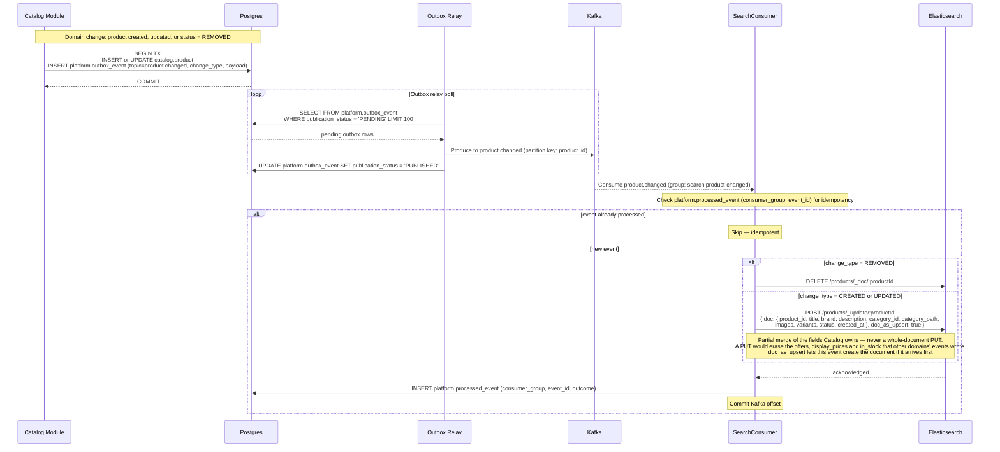
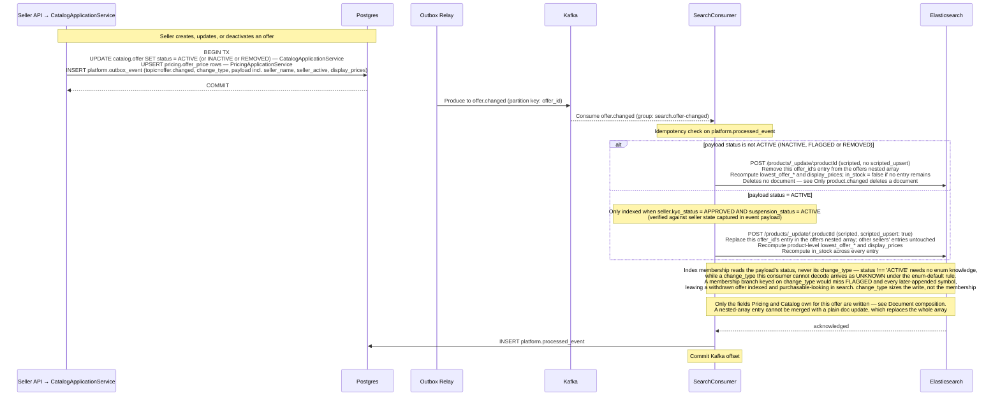
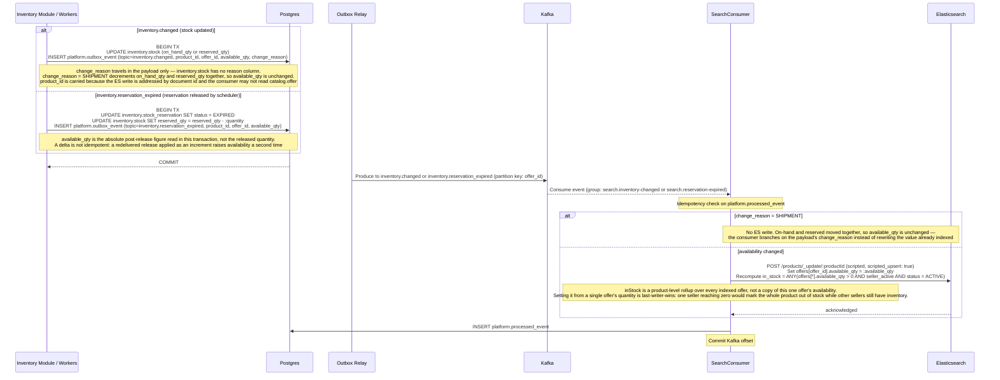
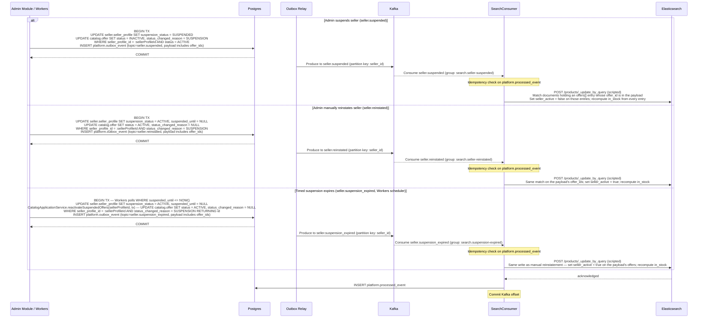
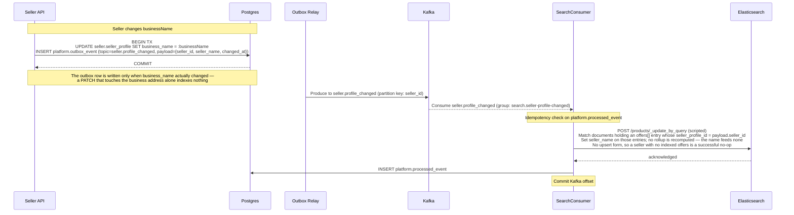
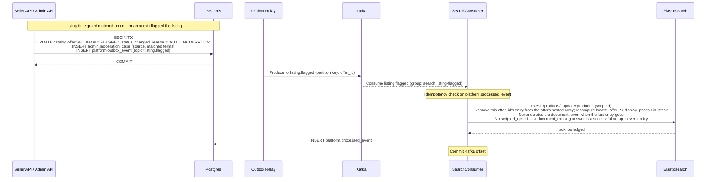
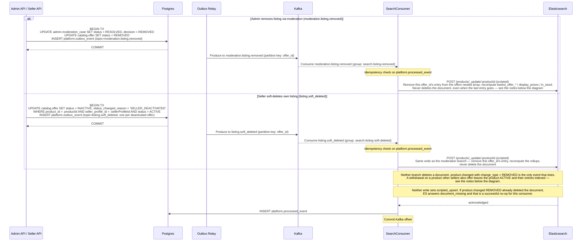
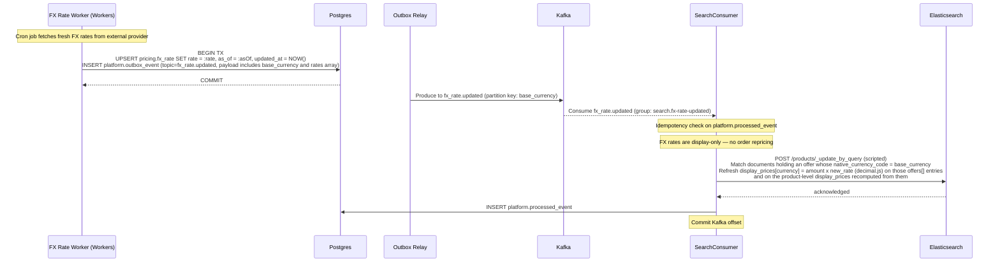

# Search API

**Status:** Complete  
**Module:** `Search`  
**Parent:** [API Design Index](../api-design.md)  
**Source of truth:** [BRD v1.4](../../requirements/BRD.md), [ERD](../data-model-erd.md)  
**Conventions:** [api-conventions.md](../../../conventions/api-conventions.md) — `operationId` naming (`<Module>_<verb><Resource>`), response envelope, cursor pagination, error shape, money-as-string. Correlation-ID propagation, the error envelope and rate-limit headers apply to every endpoint in this document and are stated once in [api-design.md § 1 Conventions](../api-design.md#conventions).

---

## Summary

- [Endpoint Index](#endpoint-index)
- [DB Mapping](#db-mapping)
- [Index Mapping](#index-mapping)
- [Endpoints](#endpoints)
- [ES Index Maintenance](#es-index-maintenance)

<a id="endpoint-index"></a>
## Endpoint Index

| Method | Path | Auth | Description |
|--------|------|------|-------------|
| `GET` | [`/search/products`](#product-search) | PUBLIC | Full-text product search with facets (Elasticsearch `search_after`) |

See [ES Index Maintenance](#es-index-maintenance) for the async Kafka consumer write paths that keep the index current.

---

<a id="db-mapping"></a>
## DB Mapping

| Endpoint | Primary DB | Index / Notes |
|----------|-----------|---------------|
| `GET /search/products` | Elasticsearch | `products` index (read-only, cursor via `search_after`) |

**Write path (async):** The search index is never written by the API. Kafka consumers update it from `catalog`, `offer`, `inventory`, `moderation` and `seller` events — see [ES Index Maintenance](#es-index-maintenance) for the seller-eligibility rule and the per-event paths.

---

<a id="index-mapping"></a>
## Index Mapping

The `products` index mapping is **explicit**, and it is created before any consumer writes to it. Left to dynamic mapping, Elasticsearch types the first price it sees as `float`, which breaks FR-P-04 the moment a query sorts or filters on it: a binary float cannot hold `0.1` exactly, so a `priceMax=9.99` filter silently excludes a `9.99` offer and a price sort transposes neighbouring amounts.

**Monetary fields are `scaled_float` with `scaling_factor: 10000`**, which stores each amount as a `long` of ten-thousandths and so matches `NUMERIC(19,4)` exactly. **No monetary field anywhere in this index is `float` or `double`.** `currency_code` and every other code or identifier is `keyword`. `dynamic` is `strict`, so an unrecognised field is rejected at write time rather than typed by inference — a consumer that starts sending a new field fails loudly instead of quietly creating a `float`.

```json
PUT /products
{
  "settings": { "number_of_shards": 1, "number_of_replicas": 0 },
  "mappings": {
    "dynamic": "strict",
    "properties": {
      "product_id":                 { "type": "keyword" },
      "title":                      { "type": "text", "fields": { "raw": { "type": "keyword" } } },
      "brand":                      { "type": "text", "fields": { "raw": { "type": "keyword" } } },
      "description":                { "type": "text" },
      "category_id":                { "type": "keyword" },
      "category_path":              { "type": "keyword" },
      "status":                     { "type": "keyword" },
      "in_stock":                   { "type": "boolean" },
      "created_at":                 { "type": "date" },
      "images":                     { "type": "object", "enabled": false },
      "variants": {
        "type": "nested",
        "properties": {
          "variant_id":             { "type": "keyword" },
          "sku":                    { "type": "keyword" },
          "attributes":             { "type": "object", "enabled": false }
        }
      },
      "lowest_offer_id":                { "type": "keyword" },
      "lowest_offer_price_type":        { "type": "keyword" },
      "lowest_offer_currency_code":     { "type": "keyword" },
      "lowest_offer_amount":            { "type": "scaled_float", "scaling_factor": 10000 },
      "lowest_offer_compare_at_amount": { "type": "scaled_float", "scaling_factor": 10000 },
      "display_prices": {
        "properties": {
          "USD":                    { "type": "scaled_float", "scaling_factor": 10000 },
          "THB":                    { "type": "scaled_float", "scaling_factor": 10000 },
          "JPY":                    { "type": "scaled_float", "scaling_factor": 10000 },
          "SGD":                    { "type": "scaled_float", "scaling_factor": 10000 }
        }
      },
      "offers": {
        "type": "nested",
        "properties": {
          "offer_id":               { "type": "keyword" },
          "seller_profile_id":      { "type": "keyword" },
          "seller_name":            { "type": "text", "fields": { "raw": { "type": "keyword" } } },
          "seller_active":          { "type": "boolean" },
          "status":                 { "type": "keyword" },
          "native_currency_code":   { "type": "keyword" },
          "amount":                 { "type": "scaled_float", "scaling_factor": 10000 },
          "price_type":             { "type": "keyword" },
          "compare_at_amount":      { "type": "scaled_float", "scaling_factor": 10000 },
          "available_qty":          { "type": "integer" },
          "display_prices": {
            "properties": {
              "USD":                { "type": "scaled_float", "scaling_factor": 10000 },
              "THB":                { "type": "scaled_float", "scaling_factor": 10000 },
              "JPY":                { "type": "scaled_float", "scaling_factor": 10000 },
              "SGD":                { "type": "scaled_float", "scaling_factor": 10000 }
            }
          }
        }
      }
    }
  }
}
```

**Notes on the shape**

- `display_prices` is declared per V1 currency (`USD`, `THB`, `JPY`, `SGD` — the seller-price allowlist) rather than as a dynamic map, so each key gets the money type explicitly. The product-level copy is the lowest indexable offer's converted price and is what `priceMin`/`priceMax`, the price sorts and the `priceRange` aggregation read; the nested copy is per offer.
- There is **no rating, review count or review field**, in keeping with reviews being out of V1 scope (BRD §3.2) and with FR-B-03's 2026-09-14 amendment dropping the rating filter and display. No `minRating` param exists, and `catalog.product.attributes` carries no `rating` key (`data-model-erd.md` § `catalog.product`).
- `price_type` holds `LIST` or `SALE`. There is no third value and no `min_qty` field on an offer entry: `B2B_TIER` is not a V1 price type, and `min_qty` existed only to carry its quantity break, so `offer.changed` no longer publishes one and nothing writes one here.
- Amounts cross the wire to clients as decimal strings, unchanged. `scaled_float` is a storage and comparison type: values are read back and re-rendered with `decimal.js`, and no floating-point arithmetic is performed on a monetary value at any point (FR-P-04a).
- `images` and `variants.attributes` are `enabled: false` — stored in `_source` and returned, never indexed, because nothing queries them.

**Bootstrap owner.** The index is created by the **Search module in the `workers` service**, at worker start-up, before any SearchConsumer group subscribes. It is not an implicit side effect of the first write: a `doc_as_upsert` write against a missing index would create it with dynamic mapping and produce exactly the `float` price this section exists to prevent. The step takes the same Postgres advisory lock every other scheduled worker task takes, so two worker replicas cannot race, and it is idempotent — it creates the index with this mapping when absent and verifies it otherwise. A mapping change that is not backward-compatible is a reindex, not an in-place edit, because Elasticsearch does not retype an existing field.

---

<a id="endpoints"></a>
## Endpoints

### Product search

```
GET /search/products
Tag: Search
Auth: PUBLIC
Pagination: cursor (Elasticsearch search_after)
```
**Query params**

| Param | Type | Description |
|-------|------|-------------|
| `q` | string | Full-text query |
| `category` | string (slug) | Filter by category **slug**, subcategories included: matches every product whose `category_path` contains the slug ([ADR-0005](../../../decisions/0005-search-category-filter-is-a-slug.md)) |
| `priceMin` | string (decimal) | Min price in `currency` |
| `priceMax` | string (decimal) | Max price |
| `currency` | ISO 4217 | Currency for price filters (default USD) |
| `inStock` | boolean | Only in-stock offers |
| `sortBy` | `relevance \| priceAsc \| priceDesc \| newest` | Default `relevance` |
| `limit` | int | Default 20, max 100 |
| `cursor` | string | Opaque search_after cursor |

There is **no `minRating` param and no rating sort**. Reviews and ratings are out of V1 scope (BRD §3.2), so no rating field exists in the `products` mapping, in the ERD, or in any result object — the filter is removed rather than deferred behind a flag.

The story text at US-B-04:112 writes the sort token as `?sort=price_asc`; that phrasing is illustrative. The canonical parameter follows [api-conventions § Naming](../../../conventions/api-conventions.md#naming) — camelCase `sortBy` with camelCase values.

**Response 200**
```json
{
  "data": [{
    "productId": "uuid",
    "title": "string",
    "brand": "string",
    "categoryId": "uuid",
    "categoryPath": ["electronics", "cameras"],
    "images": [{ "storageKey": "string" }],
    "lowestOffer": {
      "offerId": "uuid",
      "amount": "99.99",
      "currency": "USD",
      "priceType": "LIST | SALE",
      "compareAtAmount": "119.99 | null",
      "displayAmount": "3440.00",
      "displayCurrency": "THB",
      "fxRate": "34.40000000",
      "fxAsOf": "ISO8601 | null",
      "fxStale": false
    },
    "inStock": true,
    "score": 1.234
  }],
  "facets": {
    "categories": [{ "id": "uuid", "slug": "string", "name": "string", "count": 12 }],
    "priceRange": { "min": "9.99", "max": "999.00", "currency": "USD", "displayMin": "344.00", "displayMax": "34400.00", "displayCurrency": "THB" }
  },
  "meta": { "nextCursor": "string | null", "hasMore": true }
}
```

**Notes:**
- **The category filter is a slug, not an id** ([ADR-0005](../../../decisions/0005-search-category-filter-is-a-slug.md)). It is a `term` filter on the `category_path` keyword field, which holds the product's category slugs ancestor-to-leaf (`["electronics", "cameras"]`), so `category=electronics` matches a product filed under `electronics/cameras` — subcategories are included because every ancestor is in the path, not by a tree walk at query time. `categoryPath` in each result is that same slug array; a client renders breadcrumb labels from the `GET /catalog/categories` tree, which carries `name` beside `slug`. Slugs are unique among siblings only (`catalog.category` unique index on `(parent_id, slug)`), so a slug reused under two parents matches products under both. `category_id` stays in the mapping and in the result for linking to the catalog, and is not a query parameter.
- `lowestOffer.amount` / `lowestOffer.currency` = the offer's price in its `native_currency_code`. Each offer has exactly one pricing currency, so the "lowest offer" comparison is made on the indexed `display_prices[currency]` value for the requested currency and there is no per-offer currency choice to make.
- `lowestOffer.priceType` is `LIST` or `SALE` only — there is no `B2B_TIER` in V1. `compareAtAmount` is the offer's live `LIST` amount when `priceType = 'SALE'`, enabling struck-through original price display on the search card (US-B-05). It is `null` when `priceType = 'LIST'`. Effective-price resolution is by price type and current time only — account type and quantity are not inputs. See [catalog.md § Offer currency and price resolution](catalog.md#offer-currency-and-price-resolution).
- `displayAmount` / `displayCurrency` / `fxRate` / `fxAsOf` / `fxStale` follow [pricing.md § Display-currency fields](pricing.md#fx-display-fields), against the `currency` query param.
- `facets.priceRange` `displayMin` / `displayMax` / `displayCurrency` follow the same contract, and `displayMin`/`displayMax` are `null` together when the pair has no rate.
- Same-currency shape example (`currency=USD`, offer priced in USD):
  ```json
  "lowestOffer": {
    "offerId": "uuid",
    "amount": "99.99",
    "currency": "USD",
    "priceType": "LIST",
    "compareAtAmount": null,
    "displayAmount": "99.99",
    "displayCurrency": "USD",
    "fxRate": null,
    "fxAsOf": null,
    "fxStale": false
  }
  ```
- Display prices are for presentation only, and no client performs arithmetic on them. Order capture uses `fulfillment_item.fx_rate_used_at_capture` and the buyer-currency columns snapshotted at checkout.
- `meta` carries `nextCursor` and `hasMore` and **no `total`**, per [api-conventions § Pagination](../../../conventions/api-conventions.md#pagination). Elasticsearch's `total.value` is not returned: it is an estimate once the match count passes the default 10 000 tracking limit, and a cursor-paginated envelope cannot carry a count anyway. The UI navigates Previous/Next and states its empty and end-of-list conditions explicitly.
- Seller eligibility is applied **at index time**, not at query time: offers from sellers with `kyc_status != APPROVED` or `suspension_status = SUSPENDED` never appear in the index. The suspension and reinstatement consumers maintain the `seller_active` field — see [ES Index Maintenance](#es-index-maintenance).

#### Sequence


```mermaid
sequenceDiagram
    participant Client
    participant API as API (NestJS)
    participant SearchService
    participant ES as Elasticsearch

    Client->>API: GET /search/products?q=camera&category&priceMin&priceMax&currency=USD&inStock=true&sortBy=relevance&limit=20&cursor
    Note over API: PUBLIC — no auth guard
    API->>SearchService: searchProducts({ q, category, priceMin, priceMax, currency, inStock, sortBy, limit, cursor })
    Note over SearchService: Build ES bool query: must=multi_match(title,brand,description when q present)#59; filter=status ACTIVE, seller_active=true, term category_path=:category, display_prices[currency] range, available_qty>0 (inStock)#59; sort=(chosen sort key, then _id) — score|display_prices[currency].asc|.desc|created_at.desc, always tie-broken on _id so the sort key is unique and search_after cannot skip or repeat a document#59; search_after=decoded cursor#59; size=limit+1#59; aggs=category terms+display_prices[currency] stats
    SearchService->>ES: POST /products/_search { query, sort, search_after, size, aggs, track_total_hits: false }
    ES-->>SearchService: hits[], aggregations
    Note over SearchService: If hits.length = limit+1: hasMore=true, trim last hit. Encode nextCursor from the sort values of the last included hit. No total is requested or returned — track_total_hits is false, which also removes the cost of counting
    SearchService-->>API: result set, facets, pagination meta
    API-->>Client: 200 { data: [...], facets: { categories, priceRange }, meta: { nextCursor, hasMore } }
```

---

<a id="es-index-maintenance"></a>
## ES Index Maintenance

The `products` Elasticsearch index is a **read model only**. No API handler writes to it directly. All writes are driven by Kafka consumers reacting to domain-change events. Every domain state change commits its domain rows and a `platform.outbox_event` row in a single Postgres transaction; the Outbox Relay polls for unpublished events and produces them to Kafka; SearchConsumer groups consume from Kafka, update Elasticsearch, record a `platform.processed_event` row for idempotency, then commit the Kafka offset (at-least-once delivery, idempotent on `event_id`).

Offers from sellers with `kyc_status != APPROVED` or `suspension_status = SUSPENDED` are excluded **at index time** — the suspension/reinstatement events trigger bulk updates to the `seller_active` field on indexed offer documents; there is no query-time filter.

<a id="document-composition"></a>
### Document composition — one domain per event

No single event carries a whole product document, and none is made to. Price lives in Pricing, stock in Inventory, seller standing in Seller: fattening `product.changed` with those fields would mean the producing module reading another module's tables, which the architecture forbids. Each event instead carries **the complete set of fields its own domain owns**, and the consumer applies it as a **partial update** against the product's document id. The document is therefore assembled from several events over time.

Two consequences follow, and both are load-bearing:

- **First-write ordering does not matter.** Every consumer that may legitimately create a document does so on its first write — `doc_as_upsert` on `product.changed`, `scripted_upsert` on `offer.changed`'s `ACTIVE` branch and the inventory topics — so whichever of those arrives first creates it and the rest merge into it. There is no "product must be indexed before its offer" rule to enforce, and no consumer waits for another. The removal consumers are the deliberate exception — they upsert nothing, because a write whose whole purpose is to take a listing out of the index must never put a document back into it ([Removal never creates a document](#removal-never-creates)).
- **A partial document is a normal state.** A product whose `offer.changed` has not yet arrived has no `display_prices` and no `offers`; the search query filters on `status`, `seller_active` and a price range, so such a document simply does not match yet. Nothing renders half a result.

<a id="write-mechanisms"></a>
**The merge mechanism is per consumer, not one for all of them.** What a consumer writes decides how it writes, and the three shapes are not interchangeable:

- **Product-level flat fields, one document by id** — `product.changed` only. A `doc` merge with `doc_as_upsert: true`, which is also the one write that deletes a document.
- **One offer's entry inside `offers[]`, one document by id** — `offer.changed`, `inventory.changed`, `inventory.reservation_expired`, `listing.flagged`, `moderation.listing.removed`, `listing.soft_deleted`. A **scripted** `_update`, because a `doc` merge cannot address a single element of a nested array: a plain `doc` write carrying `offers` replaces the whole array and drops every co-seller's entry. `scripted_upsert: true` appears only where a first-arriving event may legitimately create the document — the `offer.changed` `ACTIVE` branch and the inventory topics — and never on a removal write ([A removal write never creates a document](#removal-never-creates)).
- **Many documents matched by a field rather than by id** — `seller.suspended`, `seller.reinstated`, `seller.suspension_expired`, `seller.profile_changed`, `fx_rate.updated`. A scripted `_update_by_query`, because the payload names offer ids, a seller or a base currency and the consumer holds no product ids to address. `_update_by_query` has no upsert form, so these writes cannot create a document either.

| Event | Fields it owns and merges |
|---|---|
| `product.changed` | `product_id`, `title`, `brand`, `description`, `category_id`, `category_path`, `images`, `variants`, `status`, `created_at`. Every one of them is carried in the payload, `category_path` and `created_at` included — Catalog resolves the path from `catalog.category` inside the producing transaction, because walking the tree here would be a read into another module's schema. Deletes the document on `change_type = REMOVED`, and is the only event that deletes one — on either of its two triggers, a seller withdrawing their last listing on the product or an admin removal emptying it. |
| `offer.changed` | The `offers[]` entry for that one offer — `offer_id`, `seller_profile_id`, `seller_name`, `seller_active`, `status`, `native_currency_code`, `amount`, `price_type`, its `display_prices` — and the product-level `lowest_offer_*` and `display_prices` recomputed across the surviving entries. `seller_name` and `seller_active` come from the payload, composed by Catalog through `SellerApplicationService`; `display_prices` likewise, through `PricingApplicationService`, so a newly published offer is findable by a price filter before the next FX refresh. Removes the entry whenever the payload's `status` is not `ACTIVE`, whatever the `change_type` says. |
| `inventory.changed`, `inventory.reservation_expired` | `offers[].available_qty` for that offer, and the `in_stock` product rollup recomputed from every entry. Both payloads carry `product_id` — the document id this write is addressed to — and an **absolute** `available_qty`, never a delta: a redelivered release applied as an increment would raise availability twice. Writes neither field when `change_reason = SHIPMENT` — see below. |
| `seller.suspended`, `seller.reinstated`, `seller.suspension_expired` | `offers[].seller_active` for every offer id in the payload, and the `in_stock` rollup. All three carry `offer_ids`, including the timed expiry — a set the consumer cannot otherwise obtain, holding no permission to read `catalog.offer`. |
| `seller.profile_changed` | `offers[].seller_name` on every entry whose `seller_profile_id` matches the payload's `seller_id`. Nothing else: the name feeds no rollup. This is the only event that changes an indexed `seller_name` after the entry exists, and without it a seller who renames their business is never corrected — the offer did not change, so no `offer.changed` fires. |
| `listing.flagged`, `moderation.listing.removed`, `listing.soft_deleted` | Removal of the `offers[]` entry and the recomputed `lowest_offer_*` / `display_prices` / `in_stock`. Deletes no document and creates none — see [Only `product.changed` deletes a document](#only-product-changed-deletes). |
| `fx_rate.updated` | `display_prices[<quote currency>]` at both levels, for offers whose `native_currency_code` is the event's base currency. Touches no other field. |

The table is the complete account, not an illustration: every field in the mapping is written by the rows above and by nothing else. It divides into two kinds of field, and the distinction is what keeps concurrent consumers from losing each other's data.

- **Owned fields** appear in exactly one row and are written only from that event's payload: every product-level scalar, and every `offers[]` entry field. Two consumers never write the same owned field.
- **Derived rollups** — `in_stock`, `lowest_offer_id`, `lowest_offer_price_type`, `lowest_offer_currency_code`, `lowest_offer_amount` and the product-level `display_prices` — are owned by no event. They are recomputed by whichever consumer just changed one of their inputs, in the same update, **from the document's own `offers[]` array after the merge**. That is why several rows list them: each is recomputing the same function over the same array, so the result does not depend on which consumer ran last.
- `offers[].seller_active` is the one owned field two rows touch, and only in disjoint scopes. The Seller domain owns its value; `offer.changed` sets it on the single entry it creates or replaces, from the seller state carried in its own payload, because a new entry cannot exist without one. It never writes another entry's value, and the seller events never write anything else on an entry.

Beyond that, the consumer reads **no** other module's tables and makes no enrichment call: whatever it needs is in the payload of the event it is handling, in the document it is updating, or it is not its field to write. Every field in the mapping is matched to the payload field that supplies it, consumer by consumer, in [consumer-field-matrix.md § 3](../consumer-field-matrix.md#search-family) — which is where a new mapping field earns its supplying event before it is added here.

**`inventory.changed` is not synonymous with an availability change.** The consumer branches on the event's `change_reason` — a payload field, not a column, since `inventory.stock` has no reason column and is not to be given one. A reason of `SHIPMENT` moves `on_hand_qty` and `reserved_qty` by the same quantity, so `available = on_hand - reserved` does not move and the consumer **writes no availability field at all** for that event; it is not a write of the same value. No field in the mapping carries the reason, the on-hand figure or the reserved figure, and none is to be added: search filters on availability, and a shipment does not change availability. The seller-portal on-hand figure and the MongoDB audit trail are the consumers that care about the distinction.

**Moderation case state is not projected.** The index holds products and offers only. The moderation events above are read for their effect on an offer's indexability — the entry goes, the rollups recompute — and nothing about the case itself is indexed: no case id, no status, no decision, and no `matched_terms`. There is no ES mapping for those fields, and none is to be added.

**How the merge is issued.** Product-level scalar fields go through an ordinary partial update (`POST /products/_update/:productId` with `doc` and `doc_as_upsert: true`). Entries inside the `offers` nested array cannot: a `doc` merge replaces an array wholesale, which would drop every other seller's offer from the document. Those updates therefore use an idempotent update script that replaces the entry matching the event's `offer_id`, leaves the other entries untouched, recomputes the product-level rollups from the result, and creates the document from the same payload when it is absent (`scripted_upsert: true`). The rule is unchanged — one domain per event, no cross-module reads, order-independent — only the API call differs where the target is inside an array.

---

### product.changed — product document upsert and delete

Producers: Catalog module (product create, update, status change to REMOVED).


```mermaid
sequenceDiagram
    participant Catalog as Catalog Module
    participant Postgres
    participant Relay as Outbox Relay
    participant Kafka
    participant Consumer as SearchConsumer
    participant ES as Elasticsearch

    Note over Catalog,Postgres: Domain change: product created, updated, or status = REMOVED
    Catalog->>Postgres: BEGIN TX<br/>INSERT or UPDATE catalog.product<br/>INSERT platform.outbox_event (topic=product.changed, change_type, payload)
    Postgres-->>Catalog: COMMIT

    loop Outbox relay poll
        Relay->>Postgres: SELECT FROM platform.outbox_event<br/>WHERE publication_status = 'PENDING' LIMIT 100
        Postgres-->>Relay: pending outbox rows
        Relay->>Kafka: Produce to product.changed (partition key: product_id)
        Relay->>Postgres: UPDATE platform.outbox_event SET publication_status = 'PUBLISHED'
    end

    Kafka-->>Consumer: Consume product.changed (group: search.product-changed)
    Note over Consumer: Check platform.processed_event (consumer_group, event_id) for idempotency
    alt event already processed
        Note over Consumer: Skip — idempotent
    else new event
        alt change_type = REMOVED
            Consumer->>ES: DELETE /products/_doc/:productId
        else change_type = CREATED or UPDATED
            Consumer->>ES: POST /products/_update/:productId<br/>{ doc: { product_id, title, brand, description, category_id, category_path,<br/>images, variants, status, created_at }, doc_as_upsert: true }
            Note over Consumer,ES: Partial merge of the fields Catalog owns — never a whole-document PUT.<br/>A PUT would erase the offers, display_prices and in_stock that other domains' events wrote.<br/>doc_as_upsert lets this event create the document if it arrives first
        end
        ES-->>Consumer: acknowledged
        Consumer->>Postgres: INSERT platform.processed_event (consumer_group, event_id, outcome)
        Note over Consumer: Commit Kafka offset
    end
```

---

### offer.changed — offer fields update in product document

Producer: Catalog module (offer created, activated, updated, deactivated, or removed). A seller action reaches it through `CatalogApplicationService`, which writes `catalog.offer` and the outbox row in the caller's transaction — `offer.changed` has one producer, which is the schema owner ([kafka-events.md § 2.11](../kafka-events.md#211-offerchanged)).


```mermaid
sequenceDiagram
    participant SellerAPI as Seller API → CatalogApplicationService
    participant Postgres
    participant Relay as Outbox Relay
    participant Kafka
    participant Consumer as SearchConsumer
    participant ES as Elasticsearch

    Note over SellerAPI,Postgres: Seller creates, updates, or deactivates an offer
    SellerAPI->>Postgres: BEGIN TX<br/>UPDATE catalog.offer SET status = ACTIVE (or INACTIVE or REMOVED) — CatalogApplicationService<br/>UPSERT pricing.offer_price rows — PricingApplicationService<br/>INSERT platform.outbox_event (topic=offer.changed, change_type, payload incl. seller_name, seller_active, display_prices)
    Postgres-->>SellerAPI: COMMIT

    Relay->>Kafka: Produce to offer.changed (partition key: offer_id)

    Kafka-->>Consumer: Consume offer.changed (group: search.offer-changed)
    Note over Consumer: Idempotency check on platform.processed_event

    alt payload status is not ACTIVE (INACTIVE, FLAGGED or REMOVED)
        Consumer->>ES: POST /products/_update/:productId (scripted, no scripted_upsert)<br/>Remove this offer_id's entry from the offers nested array<br/>Recompute lowest_offer_* and display_prices#59; in_stock = false if no entry remains<br/>Deletes no document — see Only product.changed deletes a document
    else payload status = ACTIVE
        Note over Consumer: Only indexed when seller.kyc_status = APPROVED AND suspension_status = ACTIVE<br/>(verified against seller state captured in event payload)
        Consumer->>ES: POST /products/_update/:productId (scripted, scripted_upsert: true)<br/>Replace this offer_id's entry in the offers nested array#59; other sellers' entries untouched<br/>Recompute product-level lowest_offer_* and display_prices<br/>Recompute in_stock across every entry
    end
    Note over Consumer,ES: Index membership reads the payload's status, never its change_type — status !== 'ACTIVE' needs no enum knowledge,<br/>while a change_type this consumer cannot decode arrives as UNKNOWN under the enum-default rule.<br/>A membership branch keyed on change_type would miss FLAGGED and every later-appended symbol,<br/>leaving a withdrawn offer indexed and purchasable-looking in search. change_type sizes the write, not the membership
    Note over Consumer,ES: Only the fields Pricing and Catalog own for this offer are written — see Document composition.<br/>A nested-array entry cannot be merged with a plain doc update, which replaces the whole array
    ES-->>Consumer: acknowledged
    Consumer->>Postgres: INSERT platform.processed_event
    Note over Consumer: Commit Kafka offset
```

---

### inventory.changed and inventory.reservation_expired — stock availability update

Producers: Inventory module (manual/bulk update, reservation, refund restore, and the shipment decrement in consumer group `inventory.fulfillment-shipped`); Workers module (reservation expiry scheduler, US-P-17).

`inventory.changed` carries a `change_reason` in its **payload** — `inventory.stock` has no such column — and this consumer **branches on it** rather than treating every event as an availability change. One value changes nothing: at shipment (`change_reason = 'SHIPMENT'`) the quantity comes off `on_hand_qty` and `reserved_qty` together, so `available = on_hand - reserved` does not move, and the consumer writes **no availability field** for that event. The event still arrives and is still processed — it feeds the MongoDB audit trail and the seller portal's on-hand figure — but nothing indexed depends on it, `in_stock` cannot flip because of it, and no field exists or is to be added to carry the on-hand or reserved figure into the index. A shipment is not the moment stock leaves search; the reservation at checkout already accounted for it.


```mermaid
sequenceDiagram
    participant Inventory as Inventory Module / Workers
    participant Postgres
    participant Relay as Outbox Relay
    participant Kafka
    participant Consumer as SearchConsumer
    participant ES as Elasticsearch

    alt inventory.changed (stock updated)
        Inventory->>Postgres: BEGIN TX<br/>UPDATE inventory.stock (on_hand_qty or reserved_qty)<br/>INSERT platform.outbox_event (topic=inventory.changed, product_id, offer_id, available_qty, change_reason)
        Note over Inventory,Postgres: change_reason travels in the payload only — inventory.stock has no reason column.<br/>change_reason = SHIPMENT decrements on_hand_qty and reserved_qty together, so available_qty is unchanged.<br/>product_id is carried because the ES write is addressed by document id and the consumer may not read catalog.offer
    else inventory.reservation_expired (reservation released by scheduler)
        Inventory->>Postgres: BEGIN TX<br/>UPDATE inventory.stock_reservation SET status = EXPIRED<br/>UPDATE inventory.stock SET reserved_qty = reserved_qty - :quantity<br/>INSERT platform.outbox_event (topic=inventory.reservation_expired, product_id, offer_id, available_qty)
        Note over Inventory,Postgres: available_qty is the absolute post-release figure read in this transaction, not the released quantity.<br/>A delta is not idempotent: a redelivered release applied as an increment raises availability a second time
    end
    Postgres-->>Inventory: COMMIT

    Relay->>Kafka: Produce to inventory.changed or inventory.reservation_expired (partition key: offer_id)

    Kafka-->>Consumer: Consume event (group: search.inventory-changed or search.reservation-expired)
    Note over Consumer: Idempotency check on platform.processed_event
    alt change_reason = SHIPMENT
        Note over Consumer,ES: No ES write. On-hand and reserved moved together, so available_qty is unchanged —<br/>the consumer branches on the payload's change_reason instead of rewriting the value already indexed
    else availability changed
        Consumer->>ES: POST /products/_update/:productId (scripted, scripted_upsert: true)<br/>Set offers[offer_id].available_qty = :available_qty<br/>Recompute in_stock = ANY(offers[*].available_qty > 0 AND seller_active AND status = ACTIVE)
        Note over Consumer: inStock is a product-level rollup over every indexed offer, not a copy of this one offer's availability.<br/>Setting it from a single offer's quantity is last-writer-wins: one seller reaching zero would mark the whole product out of stock while other sellers still have inventory.
        ES-->>Consumer: acknowledged
    end
    Consumer->>Postgres: INSERT platform.processed_event
    Note over Consumer: Commit Kafka offset
```

---

### seller.suspended and seller.reinstated / seller.suspension_expired — seller active flag

Producers: Admin module (suspend/reinstate); Workers module (timed suspension expiry scheduler, US-P-18).


```mermaid
sequenceDiagram
    participant Admin as Admin Module / Workers
    participant Postgres
    participant Relay as Outbox Relay
    participant Kafka
    participant Consumer as SearchConsumer
    participant ES as Elasticsearch

    alt Admin suspends seller (seller.suspended)
        Admin->>Postgres: BEGIN TX<br/>UPDATE seller.seller_profile SET suspension_status = SUSPENDED<br/>UPDATE catalog.offer SET status = INACTIVE, status_changed_reason = SUSPENSION<br/>  WHERE seller_profile_id = :sellerProfileId AND status = ACTIVE<br/>INSERT platform.outbox_event (topic=seller.suspended, payload includes offer_ids)
        Postgres-->>Admin: COMMIT
        Relay->>Kafka: Produce to seller.suspended (partition key: seller_id)
        Kafka-->>Consumer: Consume seller.suspended (group: search.seller-suspended)
        Note over Consumer: Idempotency check on platform.processed_event
        Consumer->>ES: POST /products/_update_by_query (scripted)<br/>Match documents holding an offers[] entry whose offer_id is in the payload<br/>Set seller_active = false on those entries#59; recompute in_stock from every entry
    else Admin manually reinstates seller (seller.reinstated)
        Admin->>Postgres: BEGIN TX<br/>UPDATE seller.seller_profile SET suspension_status = ACTIVE, suspended_until = NULL<br/>UPDATE catalog.offer SET status = ACTIVE, status_changed_reason = NULL<br/>  WHERE seller_profile_id = :sellerProfileId AND status_changed_reason = SUSPENSION<br/>INSERT platform.outbox_event (topic=seller.reinstated, payload includes offer_ids)
        Postgres-->>Admin: COMMIT
        Relay->>Kafka: Produce to seller.reinstated (partition key: seller_id)
        Kafka-->>Consumer: Consume seller.reinstated (group: search.seller-reinstated)
        Note over Consumer: Idempotency check on platform.processed_event
        Consumer->>ES: POST /products/_update_by_query (scripted)<br/>Same match on the payload's offer_ids#59; set seller_active = true#59; recompute in_stock
    else Timed suspension expires (seller.suspension_expired, Workers scheduler)
        Admin->>Postgres: BEGIN TX — Workers polls WHERE suspended_until <= NOW()<br/>UPDATE seller.seller_profile SET suspension_status = ACTIVE, suspended_until = NULL<br/>CatalogApplicationService.reactivateSuspendedOffers(sellerProfileId, tx) — UPDATE catalog.offer SET status = ACTIVE, status_changed_reason = NULL<br/>  WHERE seller_profile_id = :sellerProfileId AND status_changed_reason = SUSPENSION RETURNING id<br/>INSERT platform.outbox_event (topic=seller.suspension_expired, payload includes offer_ids)
        Postgres-->>Admin: COMMIT
        Relay->>Kafka: Produce to seller.suspension_expired (partition key: seller_id)
        Kafka-->>Consumer: Consume seller.suspension_expired (group: search.suspension-expired)
        Note over Consumer: Idempotency check on platform.processed_event
        Consumer->>ES: POST /products/_update_by_query (scripted)<br/>Same write as manual reinstatement — set seller_active = true on the payload's offers#59; recompute in_stock
    end
    ES-->>Consumer: acknowledged
    Consumer->>Postgres: INSERT platform.processed_event
    Note over Consumer: Commit Kafka offset
```

---

### seller.profile_changed — business-name refresh across the seller's offers

Producer: Seller module (`PATCH /seller/profile`, business-name change).

`offers[].seller_name` is written once, by the `offer.changed` that created the entry. A seller renaming their business changes no offer, so no `offer.changed` fires and every indexed copy of the old name would stand indefinitely — for a seller who never edits a listing again, permanently. This consumer is the one write that corrects it.


```mermaid
sequenceDiagram
    participant SellerAPI as Seller API
    participant Postgres
    participant Relay as Outbox Relay
    participant Kafka
    participant Consumer as SearchConsumer
    participant ES as Elasticsearch

    Note over SellerAPI,Postgres: Seller changes businessName
    SellerAPI->>Postgres: BEGIN TX<br/>UPDATE seller.seller_profile SET business_name = :businessName<br/>INSERT platform.outbox_event (topic=seller.profile_changed, payload={seller_id, seller_name, changed_at})
    Postgres-->>SellerAPI: COMMIT
    Note over SellerAPI,Postgres: The outbox row is written only when business_name actually changed —<br/>a PATCH that touches the business address alone indexes nothing
    Relay->>Kafka: Produce to seller.profile_changed (partition key: seller_id)
    Kafka-->>Consumer: Consume seller.profile_changed (group: search.seller-profile-changed)
    Note over Consumer: Idempotency check on platform.processed_event
    Consumer->>ES: POST /products/_update_by_query (scripted)<br/>Match documents holding an offers[] entry whose seller_profile_id = payload.seller_id<br/>Set seller_name on those entries#59; no rollup is recomputed — the name feeds none<br/>No upsert form, so a seller with no indexed offers is a successful no-op
    ES-->>Consumer: acknowledged
    Consumer->>Postgres: INSERT platform.processed_event
    Note over Consumer: Commit Kafka offset
```

---

### listing.flagged — de-index a flagged offer

Producers: Seller module (listing edit whose content trips the keyword blocklist or a prohibited category, US-S-04:74); Admin module (manual flag).

A `FLAGGED` offer must leave search results: the listing is hidden from search pending admin review while the edit itself stays saved. When the case is cleared the offer returns to `ACTIVE` and the `offer.changed` path above re-indexes it; when it is resolved as `REMOVE` the `moderation.listing.removed` path below withdraws its entry for good.


```mermaid
sequenceDiagram
    participant Source as Seller API / Admin API
    participant Postgres
    participant Relay as Outbox Relay
    participant Kafka
    participant Consumer as SearchConsumer
    participant ES as Elasticsearch

    Note over Source,Postgres: Listing-time guard matched on edit, or an admin flagged the listing
    Source->>Postgres: BEGIN TX<br/>UPDATE catalog.offer SET status = FLAGGED, status_changed_reason = 'AUTO_MODERATION'<br/>INSERT admin.moderation_case (source, matched terms)<br/>INSERT platform.outbox_event (topic=listing.flagged)
    Postgres-->>Source: COMMIT
    Relay->>Kafka: Produce to listing.flagged (partition key: offer_id)
    Kafka-->>Consumer: Consume listing.flagged (group: search.listing-flagged)
    Note over Consumer: Idempotency check on platform.processed_event
    Consumer->>ES: POST /products/_update/:productId (scripted)<br/>Remove this offer_id's entry from the offers nested array#59; recompute lowest_offer_* / display_prices / in_stock<br/>Never deletes the document, even when the last entry goes<br/>No scripted_upsert — a document_missing answer is a successful no-op, never a retry
    ES-->>Consumer: acknowledged
    Consumer->>Postgres: INSERT platform.processed_event
    Note over Consumer: Commit Kafka offset
```

---

### moderation.listing.removed and listing.soft_deleted — offer and product removal

Producers: Admin module (moderation removal); Catalog module (seller soft-delete, US-P-11).


```mermaid
sequenceDiagram
    participant Source as Admin API / Seller API
    participant Postgres
    participant Relay as Outbox Relay
    participant Kafka
    participant Consumer as SearchConsumer
    participant ES as Elasticsearch

    alt Admin removes listing via moderation (moderation.listing.removed)
        Source->>Postgres: BEGIN TX<br/>UPDATE admin.moderation_case SET status = RESOLVED, decision = REMOVED<br/>UPDATE catalog.offer SET status = REMOVED<br/>INSERT platform.outbox_event (topic=moderation.listing.removed)
        Postgres-->>Source: COMMIT
        Relay->>Kafka: Produce to moderation.listing.removed (partition key: offer_id)
        Kafka-->>Consumer: Consume moderation.listing.removed (group: search.listing-removed)
        Note over Consumer: Idempotency check on platform.processed_event
        Consumer->>ES: POST /products/_update/:productId (scripted)<br/>Remove this offer_id's entry from the offers nested array#59; recompute lowest_offer_* / display_prices / in_stock<br/>Never deletes the document, even when the last entry goes — see the notes below the diagram
    else Seller soft-deletes own listing (listing.soft_deleted)
        Source->>Postgres: BEGIN TX<br/>UPDATE catalog.offer SET status = INACTIVE, status_changed_reason = 'SELLER_DEACTIVATED'<br/>  WHERE product_id = :productId AND seller_profile_id = :sellerProfileId AND status = ACTIVE<br/>INSERT platform.outbox_event (topic=listing.soft_deleted, one per deactivated offer)
        Postgres-->>Source: COMMIT
        Relay->>Kafka: Produce to listing.soft_deleted (partition key: offer_id)
        Kafka-->>Consumer: Consume listing.soft_deleted (group: search.listing-soft-deleted)
        Note over Consumer: Idempotency check on platform.processed_event
        Consumer->>ES: POST /products/_update/:productId (scripted)<br/>Same write as the moderation branch — remove this offer_id's entry, recompute the rollups,<br/>never delete the document
    end
    Note over Consumer,ES: Neither branch deletes a document. product.changed with change_type = REMOVED is the only event that does.<br/>A withdrawal on a product other sellers also offer leaves the product ACTIVE and their entries indexed —<br/>see the notes below the diagram.
    Note over Consumer,ES: Neither write sets scripted_upsert. If product.changed REMOVED already deleted the document,<br/>ES answers document_missing and that is a successful no-op for this consumer.
    ES-->>Consumer: acknowledged
    Consumer->>Postgres: INSERT platform.processed_event
    Note over Consumer: Commit Kafka offset
```

**A seller's soft-delete is an offer withdrawal, not a product removal.** `DELETE /seller/products/:productId` deactivates the caller's own `ACTIVE` offers — `status = INACTIVE`, `status_changed_reason = SELLER_DEACTIVATED` — deactivates their prices, and emits one `listing.soft_deleted` per deactivated offer. It never sets an offer to `REMOVED`: that status and its `ADMIN_REMOVAL` reason belong to moderation, which is why only the first branch of the diagram shows it. Whether the shared `catalog.product` row follows depends on whether any *other* seller still holds a non-`REMOVED` offer — a test wider than the caller's own `ACTIVE` scope, so an `INACTIVE` or `FLAGGED` co-seller offer still counts as a seller on the product. If one exists the product stays `ACTIVE` and no `product.changed` is emitted; if none does the product goes `REMOVED` and `product.changed` carries `change_type = REMOVED`. The endpoint only ever reaches products the caller created — it answers `403` when `created_by_seller_id` is `NULL` or another seller's — so the `created_by_seller_id` scope on the product update is that check re-asserted, not a second branch this consumer can observe. Either way the write in this consumer is the same one, which is why the branch does not need to know which case it is in. A consumer that deleted the document outright on `listing.soft_deleted` would erase a co-seller's live listing from search on a withdrawal they had no part in. The endpoint's branches are documented in [seller.md](seller.md).

<a id="only-product-changed-deletes"></a>
**Only `product.changed` deletes a document.** Removing the last indexable entry from `offers[]` leaves the document in place, holding the product's own fields and an empty array. That costs one unmatched document and is the safe end of the trade: a buyer-facing query filters on the nested offers, so an entry-less document matches nothing and renders nowhere, while deleting it would strand the product. Two reachable cases show why. A co-seller's `INACTIVE` offer keeps the product `ACTIVE` while nothing on it is indexable, as the paragraph above describes. And a seller deactivating their last offer through `PATCH /seller/offers/:offerId` empties `offers[]` without touching `catalog.product` at all — the path every platform-seeded product takes, since the product-level delete refuses one the caller did not create. In both the product is still catalogued and still meant to return to search the moment an offer is activated, and the event that would bring it back is an `offer.changed` carrying offer fields only. Against a deleted document that event upserts a document with no `title`, `status` or `category_path` — a product permanently invisible to every query that filters them, with no later event obliged to repair it. Deletion therefore stays with the one event that means the product itself is gone.

<a id="removal-never-creates"></a>
**A removal write never creates a document.** `moderation.listing.removed`, `listing.soft_deleted` and `listing.flagged` write their scripted updates **without** `scripted_upsert`, unlike the `offer.changed` and `inventory.changed` consumers above. The reason is the other half of the last-seller case: when the removed offer was the last non-`REMOVED` one on the product — whether the seller withdrew it ([seller.md](./seller.md#delete-product-soft)) or an admin removed it on a moderation decision ([admin.md](./admin.md#decide-moderation-case)) — the product goes `REMOVED` and `product.changed` deletes the whole document — and that event travels on the product's partition key while the per-offer event travels on the offer's, so the two arrive in either order. If a listing event lands after the delete and its write carried an upsert flag, ES would recreate the document from the script's upsert body: a product no longer in the catalogue, back in the index, holding an offers entry and none of the fields a buyer-facing query filters on. Without the flag ES answers `document_missing`, which this consumer treats as a **successful no-op** — the offer it was asked to remove is gone, and so is the document that held it. The message is neither retried nor sent to the DLQ, which exists for writes that a retry could still land; this one never can.

---

### fx_rate.updated — display price refresh across affected product documents

Producer: Workers module (FX rate refresh cron, US-P-19).


```mermaid
sequenceDiagram
    participant FXWorker as FX Rate Worker (Workers)
    participant Postgres
    participant Relay as Outbox Relay
    participant Kafka
    participant Consumer as SearchConsumer
    participant ES as Elasticsearch

    Note over FXWorker: Cron job fetches fresh FX rates from external provider
    FXWorker->>Postgres: BEGIN TX<br/>UPSERT pricing.fx_rate SET rate = :rate, as_of = :asOf, updated_at = NOW()<br/>INSERT platform.outbox_event (topic=fx_rate.updated, payload includes base_currency and rates array)
    Postgres-->>FXWorker: COMMIT

    Relay->>Kafka: Produce to fx_rate.updated (partition key: base_currency)

    Kafka-->>Consumer: Consume fx_rate.updated (group: search.fx-rate-updated)
    Note over Consumer: Idempotency check on platform.processed_event
    Note over Consumer: FX rates are display-only — no order repricing
    Consumer->>ES: POST /products/_update_by_query (scripted)<br/>Match documents holding an offer whose native_currency_code = base_currency<br/>Refresh display_prices[currency] = amount x new_rate (decimal.js) on those offers[] entries<br/>and on the product-level display_prices recomputed from them
    ES-->>Consumer: acknowledged
    Consumer->>Postgres: INSERT platform.processed_event
    Note over Consumer: Commit Kafka offset
```
