# Seller API

**Module:** `Seller`  
**Parent:** [API Design Index](../api-design.md)  
**Source of truth:** [BRD v1.2](../../requirements/BRD.md), [ERD](../data-model-erd.md)

---

## Summary

- [Endpoint Index](#endpoint-index)
- [DB Mapping](#db-mapping)
- [Sequence Diagram Conventions](#sequence-diagram-conventions)
- [Endpoints](#endpoints)

<a id="endpoint-index"></a>
## Endpoint Index

| Group | Method | Path | Auth | Description |
|-------|--------|------|------|-------------|
| KYC | `POST` | [`/seller/register`](#register-as-seller-submit-kyc) | BUYER + EMAIL_VERIFIED | Submit KYC application |
| KYC | `GET` | [`/seller/kyc`](#get-kyc-application-status) | SELLER | Check KYC status |
| KYC | `POST` | [`/seller/kyc/resubmit`](#resubmit-kyc-application) | SELLER (status=REJECTED) | Resubmit KYC after rejection |
| Profile | `GET` | [`/seller/profile`](#get-seller-profile) | SELLER | Get seller profile |
| Profile | `PATCH` | [`/seller/profile`](#update-seller-profile) | SELLER | Update seller profile |
| Offers | `POST` | [`/seller/offers`](#create-offer) | SELLER_APPROVED + ACTIVE | Create offer for a product |
| Offers | `GET` | [`/seller/offers`](#list-offers-seller) | SELLER_APPROVED | List own offers |
| Offers | `GET` | [`/seller/offers/:id`](#get-offer-seller) | SELLER_APPROVED | Get offer detail |
| Offers | `PATCH` | [`/seller/offers/:id`](#update-offer) | SELLER_APPROVED + ACTIVE | Update offer status / stock |
| Pricing | `PUT` | [`/seller/offers/:id/prices/:type`](#addupdate-offer-price) | SELLER_APPROVED + ACTIVE | Set price for currency + type |
| Inventory | `PATCH` | [`/seller/inventory/:offerId`](#update-inventory) | SELLER_APPROVED + ACTIVE | Update stock on-hand quantity |
| Inventory | `POST` | [`/seller/inventory/bulk`](#bulk-inventory-update-csv) | SELLER_APPROVED + ACTIVE | Bulk stock update via CSV |
| Products | `POST` | [`/seller/products`](#create-product) | SELLER_APPROVED + ACTIVE | Create new product |
| Products | `PATCH` | [`/seller/products/:id`](#update-product) | SELLER_APPROVED + ACTIVE | Update product |
| Products | `DELETE` | [`/seller/products/:id`](#delete-product-soft) | SELLER_APPROVED + ACTIVE | Soft-delete product + deactivate offers |
| Orders | `GET` | [`/seller/orders`](#list-seller-orders) | SELLER (suspended OK) | List seller fulfillments |
| Orders | `GET` | [`/seller/orders/:id`](#get-seller-order-detail) | SELLER (suspended OK) | Fulfillment detail |
| Orders | `POST` | [`/seller/orders/:id/ship`](#mark-order-shipped) | SELLER (suspended OK) | Mark fulfillment shipped |
| Orders | `POST` | [`/seller/orders/:id/refund`](#issue-refund) | SELLER_ACTIVE | Issue refund + restore stock |
| Orders | `POST` | [`/seller/orders/:id/cancel`](#cancel-order-seller) | SELLER_ACTIVE | Cancel fulfillment + restore stock |
| Stats | `GET` | [`/seller/dashboard/stats`](#seller-dashboard-stats) | SELLER_APPROVED | Dashboard counts |

---

<a id="db-mapping"></a>
## DB Mapping

| Endpoint | Primary DB | Tables / Notes |
|----------|-----------|----------------|
| `POST /seller/register` | Postgres | `seller.seller_profile` (insert), `seller.kyc_application` (insert), `identity.user` (add SELLER role), `platform.outbox_event` (`seller.kyc.submitted`) |
| `GET /seller/profile` | Postgres | `seller.seller_profile` |
| `PATCH /seller/profile` | Postgres | `seller.seller_profile` |
| `GET /seller/kyc` | Postgres | `seller.kyc_application` |
| `POST /seller/kyc/resubmit` | Postgres | `seller.kyc_application` (insert new), `platform.outbox_event` (`seller.kyc.submitted` with `is_resubmission: true`) |
| `POST /seller/offers` | Postgres | `catalog.offer`, `inventory.stock`, `platform.outbox_event` (`offer.changed`, `inventory.changed`) |
| `GET /seller/offers` | Postgres | `catalog.offer`, `pricing.offer_price`, `inventory.stock` |
| `GET /seller/offers/:id` | Postgres | `catalog.offer`, `pricing.offer_price`, `inventory.stock` |
| `PATCH /seller/offers/:id` | Postgres | `catalog.offer`, `pricing.offer_price`, `inventory.stock`, `platform.outbox_event` |
| `PUT /seller/offers/:id/prices/:type` | Postgres | `pricing.offer_price`, `platform.outbox_event` (`offer.changed`) |
| `PATCH /seller/inventory/:offerId` | Postgres | `inventory.stock`, `platform.outbox_event` (`inventory.changed`, `inventory.low_stock` if below threshold) |
| `POST /seller/inventory/bulk` | Postgres | `inventory.stock` (batch update), `platform.outbox_event` (per changed offer) |
| `GET /seller/orders` | Postgres | `orders.fulfillment` (where `seller_id = seller.id`) |
| `GET /seller/orders/:id` | Postgres | `orders.fulfillment`, `orders.fulfillment_item` |
| `POST /seller/orders/:id/ship` | Postgres | `orders.fulfillment`, `platform.outbox_event` (`fulfillment.shipped`) |
| `POST /seller/orders/:id/refund` | Postgres | `orders.fulfillment`, `inventory.stock_reservation` (release), `platform.outbox_event` (`fulfillment.refunded`) |
| `POST /seller/products` | Postgres | `catalog.product`, `catalog.product_variant`, `catalog.product_image`, `platform.outbox_event` (`product.changed`) |
| `PATCH /seller/products/:id` | Postgres | `catalog.product`, `catalog.product_variant`, `catalog.product_image` |
| `DELETE /seller/products/:id` | Postgres | `catalog.product` (soft: set `deleted_at`), `catalog.offer` (deactivate active offers), `platform.outbox_event` (`product.changed`, `listing.soft_deleted`) |
| `POST /seller/orders/:id/cancel` | Postgres | `orders.fulfillment`, `inventory.stock_reservation` (release), `inventory.stock` (restore `available_qty`), `platform.outbox_event` (`fulfillment.cancelled`) |
| `GET /seller/dashboard/stats` | Postgres | `orders.fulfillment`, `catalog.offer` (counts only) |

---

<a id="sequence-diagram-conventions"></a>
## Sequence Diagram Conventions

> **Outbox pattern:** Every `INSERT platform.outbox_event` in a sequence diagram is written in the **same Postgres transaction** as the domain change (`BEGIN TRANSACTION` / `COMMIT` notes mark the boundary). `Kafka Relay` polls `platform.outbox_event WHERE publication_status = 'PENDING'` asynchronously after the transaction commits, serializes with Avro, publishes to the Kafka broker, then marks the event `PUBLISHED`.
>
> **Suspended-seller access restriction:** Sellers with `suspension_status = SUSPENDED` may only access `GET /seller/orders`, `GET /seller/orders/:id`, and `POST /seller/orders/:id/ship`. All other seller endpoints return `403 Forbidden` for suspended sellers regardless of the declared guard level.
>
> **Money:** All monetary amounts in API JSON are decimal strings (`"99.99"`). Stored as `NUMERIC(19,4)` in Postgres. Never JS `number`.

---

<a id="endpoints"></a>
## Endpoints

### Register as seller (submit KYC)

```
POST /seller/register
Tag: Seller
Auth: BUYER (EMAIL_VERIFIED; no active seller profile)
```
**Request body** (multipart/form-data)
```
businessName: string
taxId: string
submittedData: JSON string (business address, contact, registration number)
documents[]: file[] (encrypted in object storage)
```
**Response 201**
```json
{
  "data": {
    "sellerId": "uuid",
    "status": "PENDING_KYC",
    "message": "KYC application submitted"
  }
}
```
Side effect: `SELLER` role added to user; `seller.kyc.submitted` Kafka event emitted.  
**Errors:** 409 already has a seller profile

#### Sequence

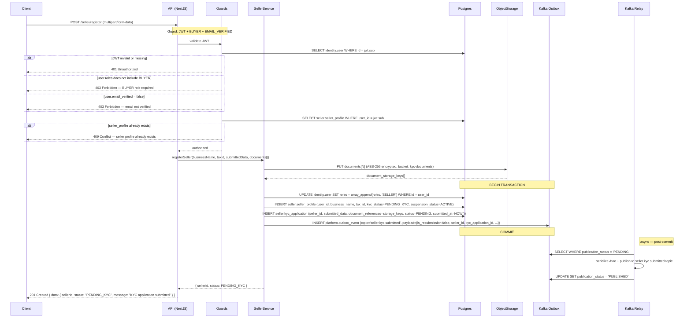
```mermaid
sequenceDiagram
    participant C as Client
    participant A as API (NestJS)
    participant G as Guards
    participant SS as SellerService
    participant P as Postgres
    participant ObjS as ObjectStorage
    participant KO as Kafka Outbox
    participant KR as Kafka Relay

    C->>A: POST /seller/register (multipart/form-data)
    Note over A,G: Guard: JWT + BUYER + EMAIL_VERIFIED
    A->>G: validate JWT
    G->>P: SELECT identity.user WHERE id = jwt.sub
    alt JWT invalid or missing
        G-->>C: 401 Unauthorized
    else user.roles does not include BUYER
        G-->>C: 403 Forbidden — BUYER role required
    else user.email_verified = false
        G-->>C: 403 Forbidden — email not verified
    end
    G->>P: SELECT seller.seller_profile WHERE user_id = jwt.sub
    alt seller_profile already exists
        G-->>C: 409 Conflict — seller profile already exists
    end
    G-->>A: authorized

    A->>SS: registerSeller(businessName, taxId, submittedData, documents[])
    SS->>ObjS: PUT documents[N] (AES-256 encrypted, bucket: kyc-documents)
    ObjS-->>SS: document_storage_keys[]

    Note over P,KO: BEGIN TRANSACTION
    SS->>P: UPDATE identity.user SET roles = array_append(roles, 'SELLER') WHERE id = user_id
    SS->>P: INSERT seller.seller_profile (user_id, business_name, tax_id, kyc_status=PENDING_KYC, suspension_status=ACTIVE)
    SS->>P: INSERT seller.kyc_application (seller_id, submitted_data, document_references=storage_keys, status=PENDING, submitted_at=NOW())
    SS->>KO: INSERT platform.outbox_event (topic='seller.kyc.submitted', payload={is_resubmission:false, seller_id, kyc_application_id, ...})
    Note over P,KO: COMMIT

    Note right of KR: async — post-commit
    KR->>KO: SELECT WHERE publication_status = 'PENDING'
    KR->>KR: serialize Avro + publish to seller.kyc.submitted topic
    KR->>KO: UPDATE SET publication_status = 'PUBLISHED'

    SS-->>A: { sellerId, status: PENDING_KYC }
    A-->>C: 201 Created { data: { sellerId, status: "PENDING_KYC", message: "KYC application submitted" } }
```

---

### Get seller profile

```
GET /seller/profile
Tag: Seller
Auth: SELLER
```
**Response 200**
```json
{
  "data": {
    "id": "uuid",
    "businessName": "string",
    "kycStatus": "PENDING_KYC | APPROVED | REJECTED",
    "suspensionStatus": "ACTIVE | SUSPENDED",
    "rejectionReason": "string | null",
    "createdAt": "ISO8601"
  }
}
```

#### Sequence

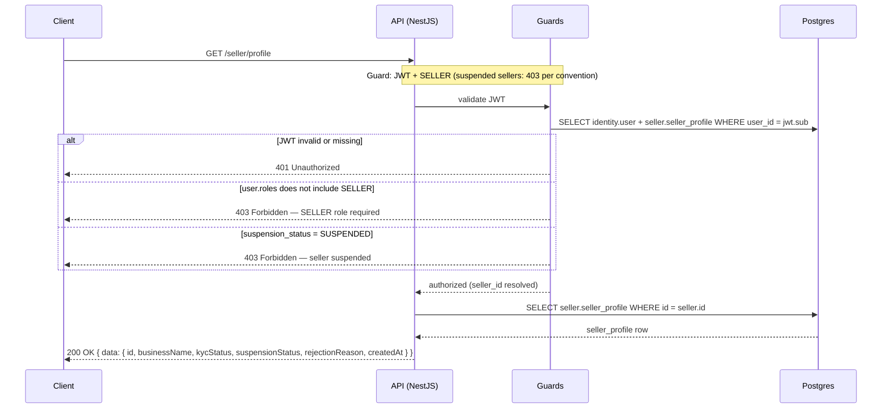
```mermaid
sequenceDiagram
    participant C as Client
    participant A as API (NestJS)
    participant G as Guards
    participant P as Postgres

    C->>A: GET /seller/profile
    Note over A,G: Guard: JWT + SELLER (suspended sellers: 403 per convention)
    A->>G: validate JWT
    G->>P: SELECT identity.user + seller.seller_profile WHERE user_id = jwt.sub
    alt JWT invalid or missing
        G-->>C: 401 Unauthorized
    else user.roles does not include SELLER
        G-->>C: 403 Forbidden — SELLER role required
    else suspension_status = SUSPENDED
        G-->>C: 403 Forbidden — seller suspended
    end
    G-->>A: authorized (seller_id resolved)

    A->>P: SELECT seller.seller_profile WHERE id = seller.id
    P-->>A: seller_profile row

    A-->>C: 200 OK { data: { id, businessName, kycStatus, suspensionStatus, rejectionReason, createdAt } }
```

---

### Get KYC application status

```
GET /seller/kyc
Tag: Seller
Auth: SELLER
```
**Response 200**
```json
{
  "data": {
    "id": "uuid",
    "status": "PENDING | APPROVED | REJECTED",
    "submittedAt": "ISO8601",
    "decidedAt": "ISO8601 | null",
    "decisionReason": "string | null"
  }
}
```

#### Sequence

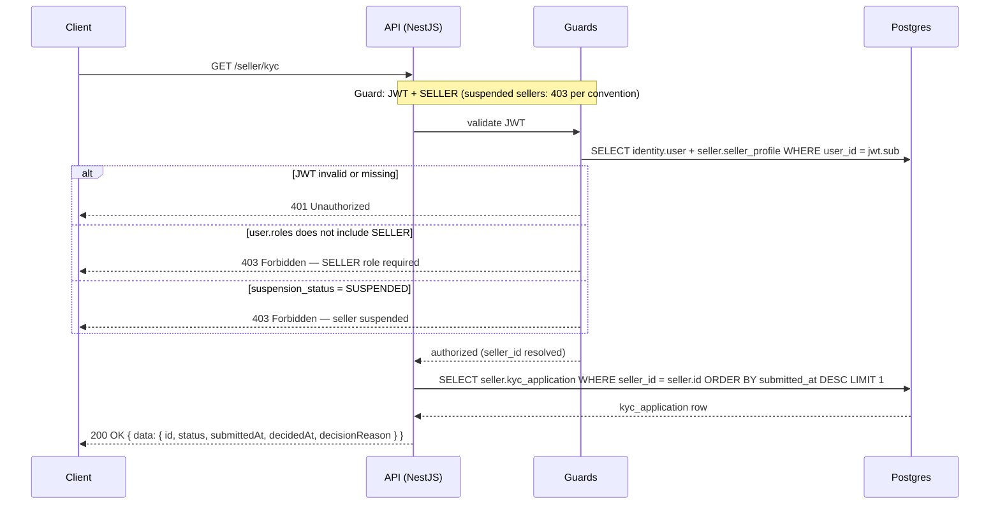
```mermaid
sequenceDiagram
    participant C as Client
    participant A as API (NestJS)
    participant G as Guards
    participant P as Postgres

    C->>A: GET /seller/kyc
    Note over A,G: Guard: JWT + SELLER (suspended sellers: 403 per convention)
    A->>G: validate JWT
    G->>P: SELECT identity.user + seller.seller_profile WHERE user_id = jwt.sub
    alt JWT invalid or missing
        G-->>C: 401 Unauthorized
    else user.roles does not include SELLER
        G-->>C: 403 Forbidden — SELLER role required
    else suspension_status = SUSPENDED
        G-->>C: 403 Forbidden — seller suspended
    end
    G-->>A: authorized (seller_id resolved)

    A->>P: SELECT seller.kyc_application WHERE seller_id = seller.id ORDER BY submitted_at DESC LIMIT 1
    P-->>A: kyc_application row

    A-->>C: 200 OK { data: { id, status, submittedAt, decidedAt, decisionReason } }
```

---

### Update seller profile

```
PATCH /seller/profile
Tag: Seller
Auth: SELLER
```
**Request body**
```json
{
  "businessName": "string (optional)",
  "submittedData": "object (optional — business address, contact)"
}
```
**Response 200** — updated seller profile (`data`-wrapped, same shape as GET /seller/profile)  
**Errors:** 400 validation

#### Sequence

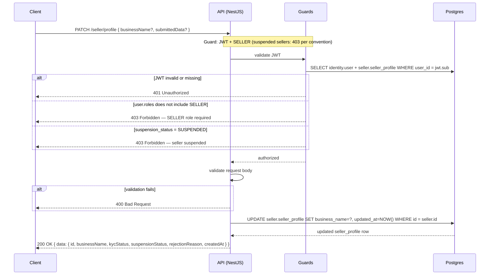
```mermaid
sequenceDiagram
    participant C as Client
    participant A as API (NestJS)
    participant G as Guards
    participant P as Postgres

    C->>A: PATCH /seller/profile { businessName?, submittedData? }
    Note over A,G: Guard: JWT + SELLER (suspended sellers: 403 per convention)
    A->>G: validate JWT
    G->>P: SELECT identity.user + seller.seller_profile WHERE user_id = jwt.sub
    alt JWT invalid or missing
        G-->>C: 401 Unauthorized
    else user.roles does not include SELLER
        G-->>C: 403 Forbidden — SELLER role required
    else suspension_status = SUSPENDED
        G-->>C: 403 Forbidden — seller suspended
    end
    G-->>A: authorized

    A->>A: validate request body
    alt validation fails
        A-->>C: 400 Bad Request
    end

    A->>P: UPDATE seller.seller_profile SET business_name=?, updated_at=NOW() WHERE id = seller.id
    P-->>A: updated seller_profile row

    A-->>C: 200 OK { data: { id, businessName, kycStatus, suspensionStatus, rejectionReason, createdAt } }
```

---

### Resubmit KYC application

```
POST /seller/kyc/resubmit
Tag: Seller
Auth: SELLER (KYC status must be REJECTED)
```
**Request body** (multipart/form-data) — same fields as `POST /seller/register`:
```
businessName: string
country: string (ISO 3166-1 alpha-2)
taxId: string
submittedData: JSON string (business address, contact, registration number)
documents[]: file[] (encrypted in object storage)
```
**Response 201**
```json
{ "data": { "applicationId": "uuid" } }
```
Side effect: `seller.kyc.submitted` Kafka event with `is_resubmission: true` via outbox.  
**Errors:** 409 KYC status is not REJECTED

#### Sequence

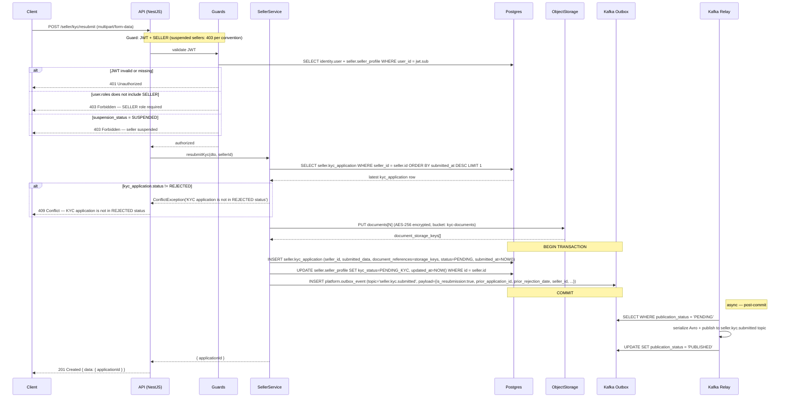
```mermaid
sequenceDiagram
    participant C as Client
    participant A as API (NestJS)
    participant G as Guards
    participant SS as SellerService
    participant P as Postgres
    participant ObjS as ObjectStorage
    participant KO as Kafka Outbox
    participant KR as Kafka Relay

    C->>A: POST /seller/kyc/resubmit (multipart/form-data)
    Note over A,G: Guard: JWT + SELLER (suspended sellers: 403 per convention)
    A->>G: validate JWT
    G->>P: SELECT identity.user + seller.seller_profile WHERE user_id = jwt.sub
    alt JWT invalid or missing
        G-->>C: 401 Unauthorized
    else user.roles does not include SELLER
        G-->>C: 403 Forbidden — SELLER role required
    else suspension_status = SUSPENDED
        G-->>C: 403 Forbidden — seller suspended
    end
    G-->>A: authorized

    A->>SS: resubmitKyc(dto, sellerId)
    SS->>P: SELECT seller.kyc_application WHERE seller_id = seller.id ORDER BY submitted_at DESC LIMIT 1
    P-->>SS: latest kyc_application row
    alt kyc_application.status != REJECTED
        SS-->>A: ConflictException('KYC application is not in REJECTED status')
        A-->>C: 409 Conflict — KYC application is not in REJECTED status
    end

    SS->>ObjS: PUT documents[N] (AES-256 encrypted, bucket: kyc-documents)
    ObjS-->>SS: document_storage_keys[]

    Note over P,KO: BEGIN TRANSACTION
    SS->>P: INSERT seller.kyc_application (seller_id, submitted_data, document_references=storage_keys, status=PENDING, submitted_at=NOW())
    SS->>P: UPDATE seller.seller_profile SET kyc_status=PENDING_KYC, updated_at=NOW() WHERE id = seller.id
    SS->>KO: INSERT platform.outbox_event (topic='seller.kyc.submitted', payload={is_resubmission:true, prior_application_id, prior_rejection_date, seller_id, ...})
    Note over P,KO: COMMIT

    Note right of KR: async — post-commit
    KR->>KO: SELECT WHERE publication_status = 'PENDING'
    KR->>KR: serialize Avro + publish to seller.kyc.submitted topic
    KR->>KO: UPDATE SET publication_status = 'PUBLISHED'

    SS-->>A: { applicationId }
    A-->>C: 201 Created { data: { applicationId } }
```

---

### Create offer

```
POST /seller/offers
Tag: Seller
Auth: SELLER_APPROVED + SELLER_ACTIVE
```
**Request body**
```json
{
  "productId": "uuid",
  "variantId": "uuid | null",
  "status": "DRAFT | ACTIVE",
  "prices": [{
    "currencyCode": "USD",
    "amount": "99.99",
    "priceType": "LIST",
    "minQty": 1,
    "startsAt": null,
    "endsAt": null
  }],
  "initialStock": 50
}
```
**Response 201**
```json
{
  "data": {
    "id": "uuid",
    "productId": "uuid",
    "variantId": "uuid | null",
    "status": "DRAFT",
    "prices": [...],
    "stock": { "onHandQty": 50, "availableQty": 50 }
  }
}
```
Side effects: `offer.changed` event, `inventory.changed` event via outbox.  
**Errors:** 400, 404 product not found, 422 prohibited category, 409 offer already exists for this product+variant

#### Sequence

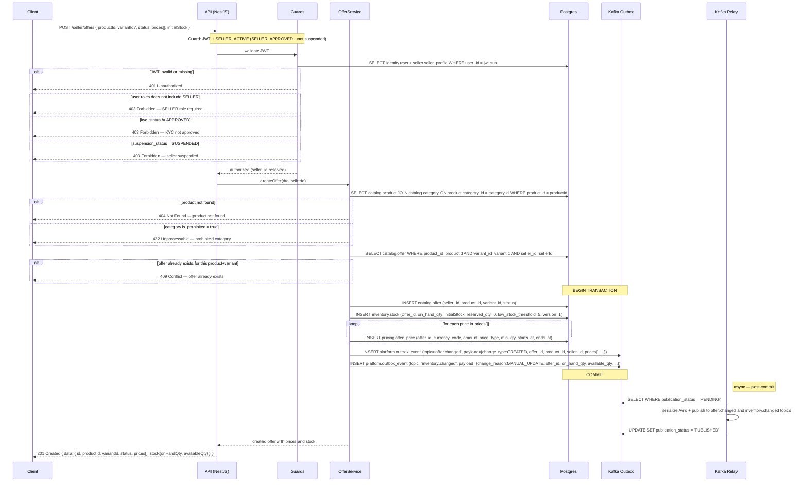
```mermaid
sequenceDiagram
    participant C as Client
    participant A as API (NestJS)
    participant G as Guards
    participant OS as OfferService
    participant P as Postgres
    participant KO as Kafka Outbox
    participant KR as Kafka Relay

    C->>A: POST /seller/offers { productId, variantId?, status, prices[], initialStock }
    Note over A,G: Guard: JWT + SELLER_ACTIVE (SELLER_APPROVED + not suspended)
    A->>G: validate JWT
    G->>P: SELECT identity.user + seller.seller_profile WHERE user_id = jwt.sub
    alt JWT invalid or missing
        G-->>C: 401 Unauthorized
    else user.roles does not include SELLER
        G-->>C: 403 Forbidden — SELLER role required
    else kyc_status != APPROVED
        G-->>C: 403 Forbidden — KYC not approved
    else suspension_status = SUSPENDED
        G-->>C: 403 Forbidden — seller suspended
    end
    G-->>A: authorized (seller_id resolved)

    A->>OS: createOffer(dto, sellerId)
    OS->>P: SELECT catalog.product JOIN catalog.category ON product.category_id = category.id WHERE product.id = productId
    alt product not found
        OS-->>C: 404 Not Found — product not found
    else category.is_prohibited = true
        OS-->>C: 422 Unprocessable — prohibited category
    end
    OS->>P: SELECT catalog.offer WHERE product_id=productId AND variant_id=variantId AND seller_id=sellerId
    alt offer already exists for this product+variant
        OS-->>C: 409 Conflict — offer already exists
    end

    Note over P,KO: BEGIN TRANSACTION
    OS->>P: INSERT catalog.offer (seller_id, product_id, variant_id, status)
    OS->>P: INSERT inventory.stock (offer_id, on_hand_qty=initialStock, reserved_qty=0, low_stock_threshold=5, version=1)
    loop for each price in prices[]
        OS->>P: INSERT pricing.offer_price (offer_id, currency_code, amount, price_type, min_qty, starts_at, ends_at)
    end
    OS->>KO: INSERT platform.outbox_event (topic='offer.changed', payload={change_type:CREATED, offer_id, product_id, seller_id, prices[], ...})
    OS->>KO: INSERT platform.outbox_event (topic='inventory.changed', payload={change_reason:MANUAL_UPDATE, offer_id, on_hand_qty, available_qty, ...})
    Note over P,KO: COMMIT

    Note right of KR: async — post-commit
    KR->>KO: SELECT WHERE publication_status = 'PENDING'
    KR->>KR: serialize Avro + publish to offer.changed and inventory.changed topics
    KR->>KO: UPDATE SET publication_status = 'PUBLISHED'

    OS-->>A: created offer with prices and stock
    A-->>C: 201 Created { data: { id, productId, variantId, status, prices[], stock{onHandQty, availableQty} } }
```

---

### List offers (seller)

```
GET /seller/offers
Tag: Seller
Auth: SELLER_APPROVED
Pagination: cursor
```
**Query params:** `status` (`DRAFT | ACTIVE | INACTIVE | FLAGGED`), `moderationStatus` (`NONE | FLAGGED | CLEARED | REMOVED`), `limit`, `cursor`  
**Response 200** — paginated list with price summary, stock, and moderation status
```json
{
  "data": [{
    "id": "uuid",
    "productId": "uuid",
    "variantId": "uuid | null",
    "status": "DRAFT | ACTIVE | INACTIVE | FLAGGED",
    "moderationStatus": "NONE | FLAGGED | CLEARED | REMOVED",
    "prices": [...],
    "stock": { "onHandQty": 0, "availableQty": 0 }
  }],
  "meta": { "nextCursor": "string | null", "hasMore": false }
}
```

#### Sequence

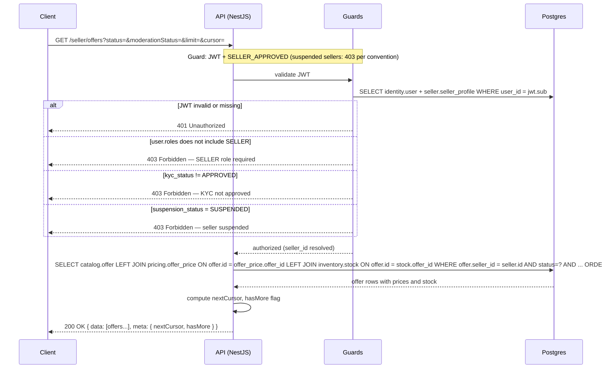
```mermaid
sequenceDiagram
    participant C as Client
    participant A as API (NestJS)
    participant G as Guards
    participant P as Postgres

    C->>A: GET /seller/offers?status=&moderationStatus=&limit=&cursor=
    Note over A,G: Guard: JWT + SELLER_APPROVED (suspended sellers: 403 per convention)
    A->>G: validate JWT
    G->>P: SELECT identity.user + seller.seller_profile WHERE user_id = jwt.sub
    alt JWT invalid or missing
        G-->>C: 401 Unauthorized
    else user.roles does not include SELLER
        G-->>C: 403 Forbidden — SELLER role required
    else kyc_status != APPROVED
        G-->>C: 403 Forbidden — KYC not approved
    else suspension_status = SUSPENDED
        G-->>C: 403 Forbidden — seller suspended
    end
    G-->>A: authorized (seller_id resolved)

    A->>P: SELECT catalog.offer LEFT JOIN pricing.offer_price ON offer.id = offer_price.offer_id LEFT JOIN inventory.stock ON offer.id = stock.offer_id WHERE offer.seller_id = seller.id AND status=? AND ... ORDER BY created_at cursor-paginated LIMIT limit+1
    P-->>A: offer rows with prices and stock

    A->>A: compute nextCursor, hasMore flag
    A-->>C: 200 OK { data: [offers...], meta: { nextCursor, hasMore } }
```

---

### Get offer (seller)

```
GET /seller/offers/:offerId
Tag: Seller
Auth: SELLER_APPROVED
```
**Response 200** — full offer detail with all prices and stock  
**Errors:** 404, 403

#### Sequence

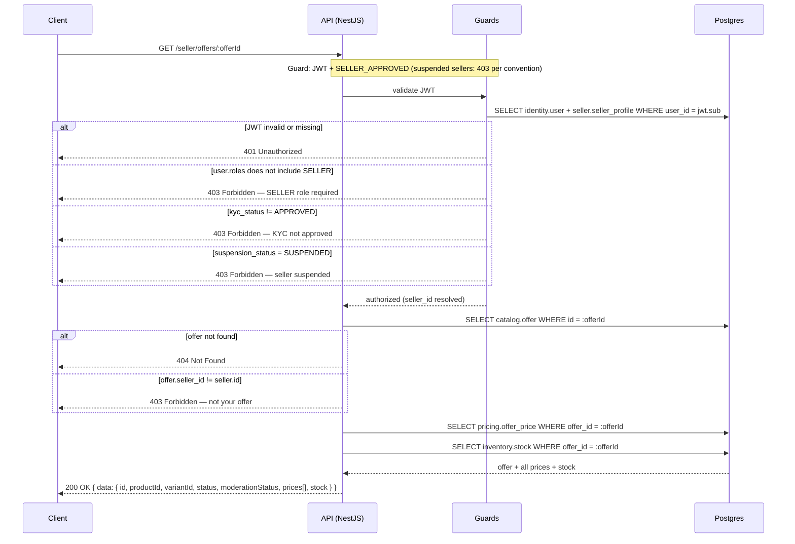
```mermaid
sequenceDiagram
    participant C as Client
    participant A as API (NestJS)
    participant G as Guards
    participant P as Postgres

    C->>A: GET /seller/offers/:offerId
    Note over A,G: Guard: JWT + SELLER_APPROVED (suspended sellers: 403 per convention)
    A->>G: validate JWT
    G->>P: SELECT identity.user + seller.seller_profile WHERE user_id = jwt.sub
    alt JWT invalid or missing
        G-->>C: 401 Unauthorized
    else user.roles does not include SELLER
        G-->>C: 403 Forbidden — SELLER role required
    else kyc_status != APPROVED
        G-->>C: 403 Forbidden — KYC not approved
    else suspension_status = SUSPENDED
        G-->>C: 403 Forbidden — seller suspended
    end
    G-->>A: authorized (seller_id resolved)

    A->>P: SELECT catalog.offer WHERE id = :offerId
    alt offer not found
        A-->>C: 404 Not Found
    else offer.seller_id != seller.id
        A-->>C: 403 Forbidden — not your offer
    end
    A->>P: SELECT pricing.offer_price WHERE offer_id = :offerId
    A->>P: SELECT inventory.stock WHERE offer_id = :offerId
    P-->>A: offer + all prices + stock

    A-->>C: 200 OK { data: { id, productId, variantId, status, moderationStatus, prices[], stock } }
```

---

### Update offer

```
PATCH /seller/offers/:offerId
Tag: Seller
Auth: SELLER_APPROVED + SELLER_ACTIVE
```
**Request body** (all optional)
```json
{
  "status": "ACTIVE | INACTIVE",
  "prices": [
    {
      "priceType": "LIST | SALE | B2B_TIER",
      "currencyCode": "USD | THB | JPY | SGD",
      "amount": "99.99",
      "minQty": 1,
      "saleStartsAt": "ISO8601 | null",
      "saleEndsAt": "ISO8601 | null"
    }
  ],
  "stockAdjustment": { "onHandQty": 100 }
}
```
**Response 200** — updated offer (`data`-wrapped)  
Side effects: `offer.changed` and/or `inventory.changed` events.

#### Sequence

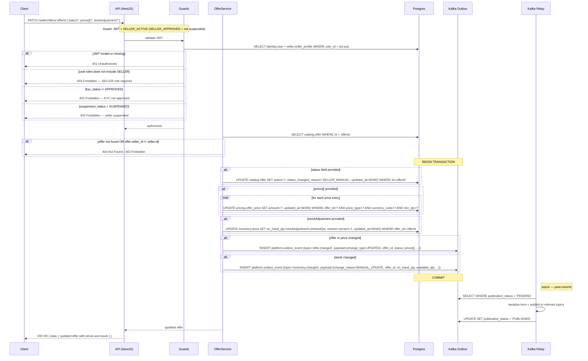
```mermaid
sequenceDiagram
    participant C as Client
    participant A as API (NestJS)
    participant G as Guards
    participant OS as OfferService
    participant P as Postgres
    participant KO as Kafka Outbox
    participant KR as Kafka Relay

    C->>A: PATCH /seller/offers/:offerId { status?, prices[]?, stockAdjustment? }
    Note over A,G: Guard: JWT + SELLER_ACTIVE (SELLER_APPROVED + not suspended)
    A->>G: validate JWT
    G->>P: SELECT identity.user + seller.seller_profile WHERE user_id = jwt.sub
    alt JWT invalid or missing
        G-->>C: 401 Unauthorized
    else user.roles does not include SELLER
        G-->>C: 403 Forbidden — SELLER role required
    else kyc_status != APPROVED
        G-->>C: 403 Forbidden — KYC not approved
    else suspension_status = SUSPENDED
        G-->>C: 403 Forbidden — seller suspended
    end
    G-->>A: authorized

    OS->>P: SELECT catalog.offer WHERE id = :offerId
    alt offer not found OR offer.seller_id != seller.id
        OS-->>C: 404 Not Found / 403 Forbidden
    end

    Note over P,KO: BEGIN TRANSACTION
    alt status field provided
        OS->>P: UPDATE catalog.offer SET status=?, status_changed_reason='SELLER_MANUAL', updated_at=NOW() WHERE id=:offerId
    end
    alt prices[] provided
        loop for each price entry
            OS->>P: UPDATE pricing.offer_price SET amount=?, updated_at=NOW() WHERE offer_id=? AND price_type=? AND currency_code=? AND min_qty=?
        end
    end
    alt stockAdjustment provided
        OS->>P: UPDATE inventory.stock SET on_hand_qty=stockAdjustment.onHandQty, version=version+1, updated_at=NOW() WHERE offer_id=:offerId
    end
    alt offer or price changed
        OS->>KO: INSERT platform.outbox_event (topic='offer.changed', payload={change_type:UPDATED, offer_id, status, prices[], ...})
    end
    alt stock changed
        OS->>KO: INSERT platform.outbox_event (topic='inventory.changed', payload={change_reason:MANUAL_UPDATE, offer_id, on_hand_qty, available_qty, ...})
    end
    Note over P,KO: COMMIT

    Note right of KR: async — post-commit
    KR->>KO: SELECT WHERE publication_status = 'PENDING'
    KR->>KR: serialize Avro + publish to relevant topics
    KR->>KO: UPDATE SET publication_status = 'PUBLISHED'

    OS-->>A: updated offer
    A-->>C: 200 OK { data: { updated offer with prices and stock } }
```

---

### Add/update offer price

```
PUT /seller/offers/:offerId/prices/:priceType
Tag: Seller
Auth: SELLER_APPROVED + SELLER_ACTIVE
```
**Request body**
```json
{
  "currencyCode": "USD",
  "amount": "89.99",
  "minQty": 1,
  "startsAt": "ISO8601 | null",
  "endsAt": "ISO8601 | null"
}
```
**Response 200** — updated price row (`data`-wrapped)  
**Errors:** 422 currency not in allowed set, 422 SALE price missing time bounds

#### Sequence

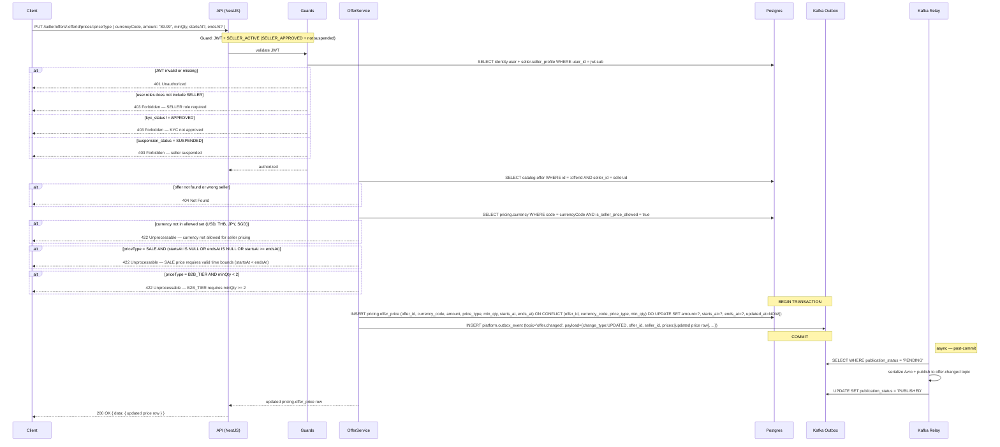
```mermaid
sequenceDiagram
    participant C as Client
    participant A as API (NestJS)
    participant G as Guards
    participant OS as OfferService
    participant P as Postgres
    participant KO as Kafka Outbox
    participant KR as Kafka Relay

    C->>A: PUT /seller/offers/:offerId/prices/:priceType { currencyCode, amount: "89.99", minQty, startsAt?, endsAt? }
    Note over A,G: Guard: JWT + SELLER_ACTIVE (SELLER_APPROVED + not suspended)
    A->>G: validate JWT
    G->>P: SELECT identity.user + seller.seller_profile WHERE user_id = jwt.sub
    alt JWT invalid or missing
        G-->>C: 401 Unauthorized
    else user.roles does not include SELLER
        G-->>C: 403 Forbidden — SELLER role required
    else kyc_status != APPROVED
        G-->>C: 403 Forbidden — KYC not approved
    else suspension_status = SUSPENDED
        G-->>C: 403 Forbidden — seller suspended
    end
    G-->>A: authorized

    OS->>P: SELECT catalog.offer WHERE id = :offerId AND seller_id = seller.id
    alt offer not found or wrong seller
        OS-->>C: 404 Not Found
    end
    OS->>P: SELECT pricing.currency WHERE code = currencyCode AND is_seller_price_allowed = true
    alt currency not in allowed set (USD, THB, JPY, SGD)
        OS-->>C: 422 Unprocessable — currency not allowed for seller pricing
    end
    alt priceType = SALE AND (startsAt IS NULL OR endsAt IS NULL OR startsAt >= endsAt)
        OS-->>C: 422 Unprocessable — SALE price requires valid time bounds (startsAt < endsAt)
    end
    alt priceType = B2B_TIER AND minQty < 2
        OS-->>C: 422 Unprocessable — B2B_TIER requires minQty >= 2
    end

    Note over P,KO: BEGIN TRANSACTION
    OS->>P: INSERT pricing.offer_price (offer_id, currency_code, amount, price_type, min_qty, starts_at, ends_at) ON CONFLICT (offer_id, currency_code, price_type, min_qty) DO UPDATE SET amount=?, starts_at=?, ends_at=?, updated_at=NOW()
    OS->>KO: INSERT platform.outbox_event (topic='offer.changed', payload={change_type:UPDATED, offer_id, seller_id, prices:[updated price row], ...})
    Note over P,KO: COMMIT

    Note right of KR: async — post-commit
    KR->>KO: SELECT WHERE publication_status = 'PENDING'
    KR->>KR: serialize Avro + publish to offer.changed topic
    KR->>KO: UPDATE SET publication_status = 'PUBLISHED'

    OS-->>A: updated pricing.offer_price row
    A-->>C: 200 OK { data: { updated price row } }
```

---

### Update inventory

```
PATCH /seller/inventory/:offerId
Tag: Seller
Auth: SELLER_APPROVED + SELLER_ACTIVE
```
**Request body**
```json
{ "onHandQty": 75 }
```
**Response 200** `{ "data": { "offerId": "uuid", "onHandQty": 75, "reservedQty": 5, "availableQty": 70 } }`  
Side effect: `inventory.changed` event; `inventory.low_stock` if below threshold.

#### Sequence

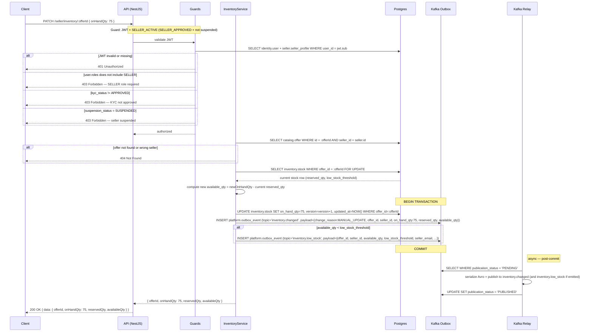
```mermaid
sequenceDiagram
    participant C as Client
    participant A as API (NestJS)
    participant G as Guards
    participant IS as InventoryService
    participant P as Postgres
    participant KO as Kafka Outbox
    participant KR as Kafka Relay

    C->>A: PATCH /seller/inventory/:offerId { onHandQty: 75 }
    Note over A,G: Guard: JWT + SELLER_ACTIVE (SELLER_APPROVED + not suspended)
    A->>G: validate JWT
    G->>P: SELECT identity.user + seller.seller_profile WHERE user_id = jwt.sub
    alt JWT invalid or missing
        G-->>C: 401 Unauthorized
    else user.roles does not include SELLER
        G-->>C: 403 Forbidden — SELLER role required
    else kyc_status != APPROVED
        G-->>C: 403 Forbidden — KYC not approved
    else suspension_status = SUSPENDED
        G-->>C: 403 Forbidden — seller suspended
    end
    G-->>A: authorized

    IS->>P: SELECT catalog.offer WHERE id = :offerId AND seller_id = seller.id
    alt offer not found or wrong seller
        IS-->>C: 404 Not Found
    end
    IS->>P: SELECT inventory.stock WHERE offer_id = :offerId FOR UPDATE
    P-->>IS: current stock row (reserved_qty, low_stock_threshold)
    IS->>IS: compute new available_qty = newOnHandQty - current reserved_qty

    Note over P,KO: BEGIN TRANSACTION
    IS->>P: UPDATE inventory.stock SET on_hand_qty=75, version=version+1, updated_at=NOW() WHERE offer_id=:offerId
    IS->>KO: INSERT platform.outbox_event (topic='inventory.changed', payload={change_reason:MANUAL_UPDATE, offer_id, seller_id, on_hand_qty:75, reserved_qty, available_qty})
    alt available_qty < low_stock_threshold
        IS->>KO: INSERT platform.outbox_event (topic='inventory.low_stock', payload={offer_id, seller_id, available_qty, low_stock_threshold, seller_email, ...})
    end
    Note over P,KO: COMMIT

    Note right of KR: async — post-commit
    KR->>KO: SELECT WHERE publication_status = 'PENDING'
    KR->>KR: serialize Avro + publish to inventory.changed (and inventory.low_stock if emitted)
    KR->>KO: UPDATE SET publication_status = 'PUBLISHED'

    IS-->>A: { offerId, onHandQty: 75, reservedQty, availableQty }
    A-->>C: 200 OK { data: { offerId, onHandQty: 75, reservedQty, availableQty } }
```

---

### Bulk inventory update (CSV)

```
POST /seller/inventory/bulk
Tag: Seller
Auth: SELLER_APPROVED + SELLER_ACTIVE
Content-Type: multipart/form-data
```
**Form fields:** `file` (CSV, max 5 MB, ≤ 10k rows). CSV format: `sku,on_hand,low_stock_threshold`  
**Response 202**
```json
{
  "data": {
    "accepted": 98,
    "rejected": 2,
    "errors": [{ "row": 3, "sku": "SKU-001", "reason": "SKU not found" }]
  }
}
```

#### Sequence

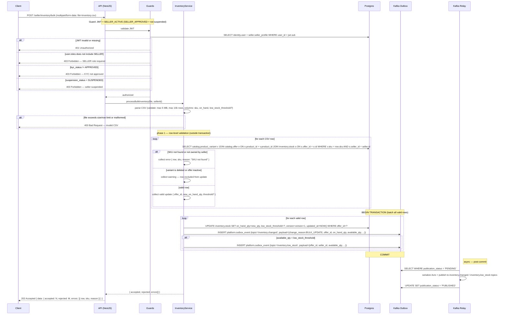
```mermaid
sequenceDiagram
    participant C as Client
    participant A as API (NestJS)
    participant G as Guards
    participant IS as InventoryService
    participant P as Postgres
    participant KO as Kafka Outbox
    participant KR as Kafka Relay

    C->>A: POST /seller/inventory/bulk (multipart/form-data: file=inventory.csv)
    Note over A,G: Guard: JWT + SELLER_ACTIVE (SELLER_APPROVED + not suspended)
    A->>G: validate JWT
    G->>P: SELECT identity.user + seller.seller_profile WHERE user_id = jwt.sub
    alt JWT invalid or missing
        G-->>C: 401 Unauthorized
    else user.roles does not include SELLER
        G-->>C: 403 Forbidden — SELLER role required
    else kyc_status != APPROVED
        G-->>C: 403 Forbidden — KYC not approved
    else suspension_status = SUSPENDED
        G-->>C: 403 Forbidden — seller suspended
    end
    G-->>A: authorized

    A->>IS: processBulkInventory(file, sellerId)
    IS->>IS: parse CSV (validate: max 5 MB, max 10k rows, columns: sku, on_hand, low_stock_threshold?)
    alt file exceeds size/row limit or malformed
        IS-->>C: 400 Bad Request — invalid CSV
    end

    Note over IS: phase 1 — row-level validation (outside transaction)
    loop for each CSV row
        IS->>P: SELECT catalog.product_variant v JOIN catalog.offer o ON o.product_id = v.product_id JOIN inventory.stock s ON s.offer_id = o.id WHERE v.sku = row.sku AND o.seller_id = seller.id
        alt SKU not found or not owned by seller
            IS->>IS: collect error { row, sku, reason: "SKU not found" }
        else variant is deleted or offer inactive
            IS->>IS: collect warning — row excluded from update
        else valid row
            IS->>IS: collect valid update { offer_id, new_on_hand_qty, threshold? }
        end
    end

    Note over P,KO: BEGIN TRANSACTION (batch all valid rows)
    loop for each valid row
        IS->>P: UPDATE inventory.stock SET on_hand_qty=new_qty, low_stock_threshold=?, version=version+1, updated_at=NOW() WHERE offer_id=?
        IS->>KO: INSERT platform.outbox_event (topic='inventory.changed', payload={change_reason:BULK_UPDATE, offer_id, on_hand_qty, available_qty, ...})
        alt available_qty < low_stock_threshold
            IS->>KO: INSERT platform.outbox_event (topic='inventory.low_stock', payload={offer_id, seller_id, available_qty, ...})
        end
    end
    Note over P,KO: COMMIT

    Note right of KR: async — post-commit
    KR->>KO: SELECT WHERE publication_status = 'PENDING'
    KR->>KR: serialize Avro + publish to inventory.changed / inventory.low_stock topics
    KR->>KO: UPDATE SET publication_status = 'PUBLISHED'

    IS-->>A: { accepted, rejected, errors[] }
    A-->>C: 202 Accepted { data: { accepted: N, rejected: M, errors: [{ row, sku, reason }] } }
```

---

### List seller orders

```
GET /seller/orders
Tag: Seller
Auth: SELLER (suspended sellers may also access)
Pagination: offset
```
**Query params:** `status` (`PENDING | SHIPPED | DELIVERED | CANCELLED | REFUNDED`), `page` (1-based, default 1), `limit` (default 20, max 100)  
**Response 200**
```json
{
  "data": [
    {
      "id": "uuid",
      "displayId": "FUL-XXXXXXXX",
      "status": "PENDING | SHIPPED | DELIVERED | CANCELLED | REFUNDED",
      "placedAt": "ISO8601",
      "totalAmount": "99.99",
      "currency": "THB",
      "itemCount": 2
    }
  ],
  "total": 42,
  "page": 1,
  "limit": 20
}
```

#### Sequence

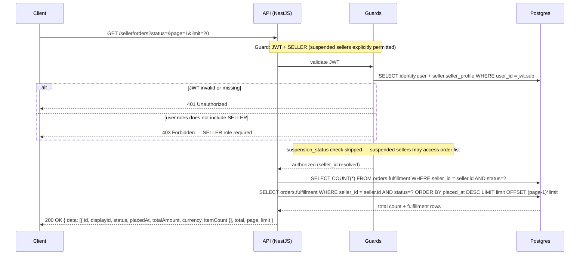
```mermaid
sequenceDiagram
    participant C as Client
    participant A as API (NestJS)
    participant G as Guards
    participant P as Postgres

    C->>A: GET /seller/orders?status=&page=1&limit=20
    Note over A,G: Guard: JWT + SELLER (suspended sellers explicitly permitted)
    A->>G: validate JWT
    G->>P: SELECT identity.user + seller.seller_profile WHERE user_id = jwt.sub
    alt JWT invalid or missing
        G-->>C: 401 Unauthorized
    else user.roles does not include SELLER
        G-->>C: 403 Forbidden — SELLER role required
    end
    Note over G: suspension_status check skipped — suspended sellers may access order list
    G-->>A: authorized (seller_id resolved)

    A->>P: SELECT COUNT(*) FROM orders.fulfillment WHERE seller_id = seller.id AND status=?
    A->>P: SELECT orders.fulfillment WHERE seller_id = seller.id AND status=? ORDER BY placed_at DESC LIMIT limit OFFSET (page-1)*limit
    P-->>A: total count + fulfillment rows

    A-->>C: 200 OK { data: [{ id, displayId, status, placedAt, totalAmount, currency, itemCount }], total, page, limit }
```

---

### Get seller order detail

```
GET /seller/orders/:orderId
Tag: Seller
Auth: SELLER (suspended sellers may also access)
```
**Response 200**
```json
{
  "data": {
    "id": "uuid",
    "displayId": "FUL-3F2A1B9C",
    "status": "PENDING | SHIPPED | DELIVERED | CANCELLED | REFUNDED",
    "buyerName": "string",
    "shippingAddress": { ... },
    "trackingNumber": "TRK-...",
    "estimatedDeliveryAt": "ISO8601",
    "placedAt": "ISO8601",
    "items": [
      {
        "offerId": "uuid",
        "productTitle": "string",
        "variantLabel": "string | null",
        "quantity": 2,
        "unitPrice": "49.99",
        "currency": "THB",
        "tax": "3.50",
        "lineTotal": "103.48"
      }
    ],
    "totalAmount": "111.99",
    "currency": "USD"
  }
}
```

#### Sequence

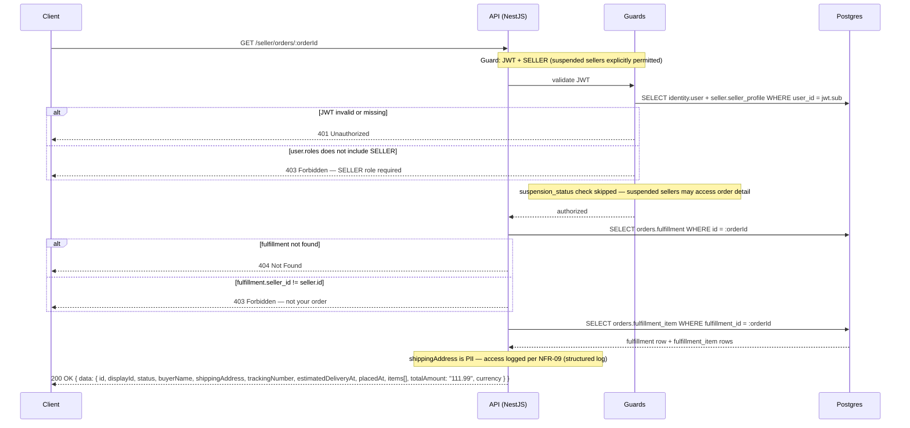
```mermaid
sequenceDiagram
    participant C as Client
    participant A as API (NestJS)
    participant G as Guards
    participant P as Postgres

    C->>A: GET /seller/orders/:orderId
    Note over A,G: Guard: JWT + SELLER (suspended sellers explicitly permitted)
    A->>G: validate JWT
    G->>P: SELECT identity.user + seller.seller_profile WHERE user_id = jwt.sub
    alt JWT invalid or missing
        G-->>C: 401 Unauthorized
    else user.roles does not include SELLER
        G-->>C: 403 Forbidden — SELLER role required
    end
    Note over G: suspension_status check skipped — suspended sellers may access order detail
    G-->>A: authorized

    A->>P: SELECT orders.fulfillment WHERE id = :orderId
    alt fulfillment not found
        A-->>C: 404 Not Found
    else fulfillment.seller_id != seller.id
        A-->>C: 403 Forbidden — not your order
    end
    A->>P: SELECT orders.fulfillment_item WHERE fulfillment_id = :orderId
    P-->>A: fulfillment row + fulfillment_item rows
    Note over A: shippingAddress is PII — access logged per NFR-09 (structured log)

    A-->>C: 200 OK { data: { id, displayId, status, buyerName, shippingAddress, trackingNumber, estimatedDeliveryAt, placedAt, items[], totalAmount: "111.99", currency } }
```

---

### Mark order shipped

```
POST /seller/orders/:orderId/ship
Tag: Seller
Auth: SELLER (suspended sellers may also access; order must be PENDING)
```
**Response 200** `{ "data": { "status": "SHIPPED" } }`  
Side effect: `fulfillment.shipped` Kafka event  
**Errors:** 409 order not in PENDING state

#### Sequence

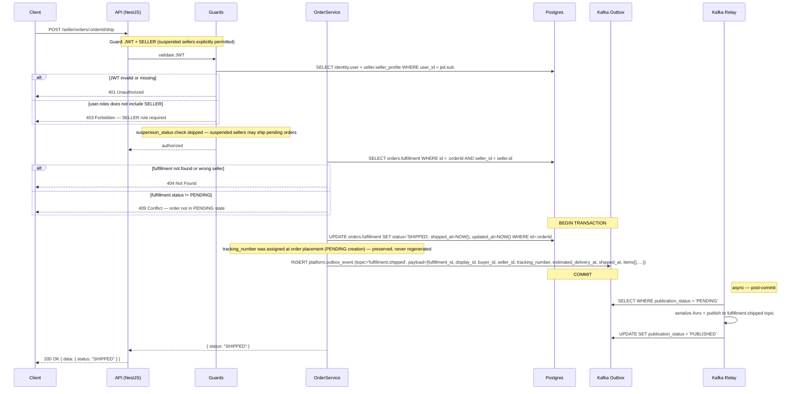
```mermaid
sequenceDiagram
    participant C as Client
    participant A as API (NestJS)
    participant G as Guards
    participant OrdS as OrderService
    participant P as Postgres
    participant KO as Kafka Outbox
    participant KR as Kafka Relay

    C->>A: POST /seller/orders/:orderId/ship
    Note over A,G: Guard: JWT + SELLER (suspended sellers explicitly permitted)
    A->>G: validate JWT
    G->>P: SELECT identity.user + seller.seller_profile WHERE user_id = jwt.sub
    alt JWT invalid or missing
        G-->>C: 401 Unauthorized
    else user.roles does not include SELLER
        G-->>C: 403 Forbidden — SELLER role required
    end
    Note over G: suspension_status check skipped — suspended sellers may ship pending orders
    G-->>A: authorized

    OrdS->>P: SELECT orders.fulfillment WHERE id = :orderId AND seller_id = seller.id
    alt fulfillment not found or wrong seller
        OrdS-->>C: 404 Not Found
    else fulfillment.status != PENDING
        OrdS-->>C: 409 Conflict — order not in PENDING state
    end

    Note over P,KO: BEGIN TRANSACTION
    OrdS->>P: UPDATE orders.fulfillment SET status='SHIPPED', shipped_at=NOW(), updated_at=NOW() WHERE id=:orderId
    Note over OrdS: tracking_number was assigned at order placement (PENDING creation) — preserved, never regenerated
    OrdS->>KO: INSERT platform.outbox_event (topic='fulfillment.shipped', payload={fulfillment_id, display_id, buyer_id, seller_id, tracking_number, estimated_delivery_at, shipped_at, items[], ...})
    Note over P,KO: COMMIT

    Note right of KR: async — post-commit
    KR->>KO: SELECT WHERE publication_status = 'PENDING'
    KR->>KR: serialize Avro + publish to fulfillment.shipped topic
    KR->>KO: UPDATE SET publication_status = 'PUBLISHED'

    OrdS-->>A: { status: "SHIPPED" }
    A-->>C: 200 OK { data: { status: "SHIPPED" } }
```

---

### Issue refund

```
POST /seller/orders/:orderId/refund
Tag: Seller
Auth: SELLER_ACTIVE (order must be PENDING or SHIPPED)
```
**Response 200** `{ "data": { "status": "REFUNDED" } }`  
Side effect: `fulfillment.refunded` event; if refunding from PENDING: restores `available_qty`  
**Errors:** 409 order not in PENDING or SHIPPED state

#### Sequence

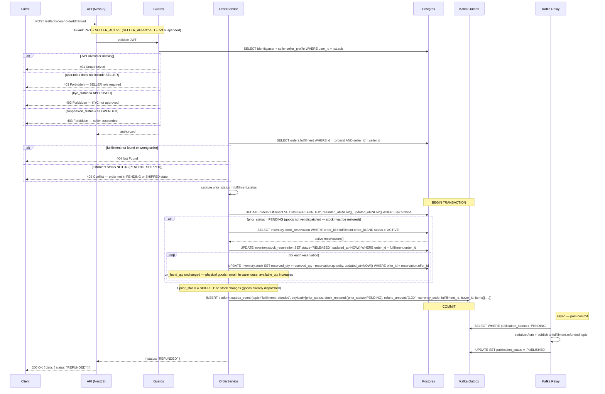
```mermaid
sequenceDiagram
    participant C as Client
    participant A as API (NestJS)
    participant G as Guards
    participant OrdS as OrderService
    participant P as Postgres
    participant KO as Kafka Outbox
    participant KR as Kafka Relay

    C->>A: POST /seller/orders/:orderId/refund
    Note over A,G: Guard: JWT + SELLER_ACTIVE (SELLER_APPROVED + not suspended)
    A->>G: validate JWT
    G->>P: SELECT identity.user + seller.seller_profile WHERE user_id = jwt.sub
    alt JWT invalid or missing
        G-->>C: 401 Unauthorized
    else user.roles does not include SELLER
        G-->>C: 403 Forbidden — SELLER role required
    else kyc_status != APPROVED
        G-->>C: 403 Forbidden — KYC not approved
    else suspension_status = SUSPENDED
        G-->>C: 403 Forbidden — seller suspended
    end
    G-->>A: authorized

    OrdS->>P: SELECT orders.fulfillment WHERE id = :orderId AND seller_id = seller.id
    alt fulfillment not found or wrong seller
        OrdS-->>C: 404 Not Found
    else fulfillment.status NOT IN (PENDING, SHIPPED)
        OrdS-->>C: 409 Conflict — order not in PENDING or SHIPPED state
    end
    OrdS->>OrdS: capture prior_status = fulfillment.status

    Note over P,KO: BEGIN TRANSACTION
    OrdS->>P: UPDATE orders.fulfillment SET status='REFUNDED', refunded_at=NOW(), updated_at=NOW() WHERE id=:orderId
    alt prior_status = PENDING (goods not yet dispatched — stock must be restored)
        OrdS->>P: SELECT inventory.stock_reservation WHERE order_id = fulfillment.order_id AND status = 'ACTIVE'
        P-->>OrdS: active reservations[]
        OrdS->>P: UPDATE inventory.stock_reservation SET status='RELEASED', updated_at=NOW() WHERE order_id = fulfillment.order_id
        loop for each reservation
            OrdS->>P: UPDATE inventory.stock SET reserved_qty = reserved_qty - reservation.quantity, updated_at=NOW() WHERE offer_id = reservation.offer_id
            Note over OrdS: on_hand_qty unchanged — physical goods remain in warehouse. available_qty increases
        end
    end
    Note over OrdS: if prior_status = SHIPPED: no stock changes (goods already dispatched)
    OrdS->>KO: INSERT platform.outbox_event (topic='fulfillment.refunded', payload={prior_status, stock_restored:(prior_status=PENDING), refund_amount:"X.XX", currency_code, fulfillment_id, buyer_id, items[], ...})
    Note over P,KO: COMMIT

    Note right of KR: async — post-commit
    KR->>KO: SELECT WHERE publication_status = 'PENDING'
    KR->>KR: serialize Avro + publish to fulfillment.refunded topic
    KR->>KO: UPDATE SET publication_status = 'PUBLISHED'

    OrdS-->>A: { status: "REFUNDED" }
    A-->>C: 200 OK { data: { status: "REFUNDED" } }
```

---

### Create product

```
POST /seller/products
Tag: Seller
Auth: SELLER_APPROVED + SELLER_ACTIVE
```
**Request body**
```json
{
  "title": "string",
  "description": "string",
  "categoryId": "uuid",
  "images": ["string (storage key)"],
  "attributes": {},
  "variants": [{ "sku": "string", "variantLabel": "string", "attributes": {} }]
}
```
**Response 201**
```json
{ "data": { "productId": "uuid" } }
```
**Errors:** 400 validation, 404 category not found, 422 prohibited category

#### Sequence

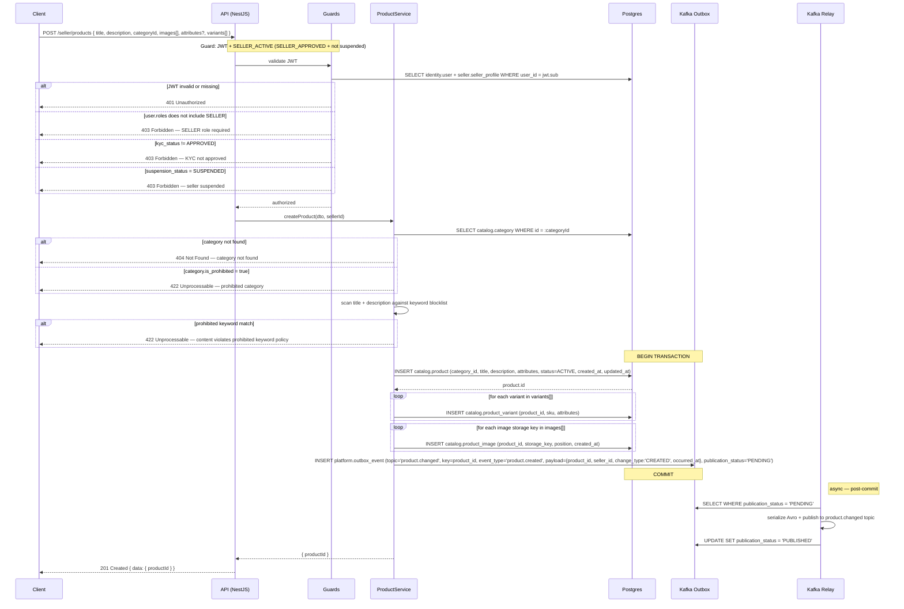
```mermaid
sequenceDiagram
    participant C as Client
    participant A as API (NestJS)
    participant G as Guards
    participant PS as ProductService
    participant P as Postgres
    participant KO as Kafka Outbox
    participant KR as Kafka Relay

    C->>A: POST /seller/products { title, description, categoryId, images[], attributes?, variants[] }
    Note over A,G: Guard: JWT + SELLER_ACTIVE (SELLER_APPROVED + not suspended)
    A->>G: validate JWT
    G->>P: SELECT identity.user + seller.seller_profile WHERE user_id = jwt.sub
    alt JWT invalid or missing
        G-->>C: 401 Unauthorized
    else user.roles does not include SELLER
        G-->>C: 403 Forbidden — SELLER role required
    else kyc_status != APPROVED
        G-->>C: 403 Forbidden — KYC not approved
    else suspension_status = SUSPENDED
        G-->>C: 403 Forbidden — seller suspended
    end
    G-->>A: authorized

    A->>PS: createProduct(dto, sellerId)
    PS->>P: SELECT catalog.category WHERE id = :categoryId
    alt category not found
        PS-->>C: 404 Not Found — category not found
    else category.is_prohibited = true
        PS-->>C: 422 Unprocessable — prohibited category
    end
    PS->>PS: scan title + description against keyword blocklist
    alt prohibited keyword match
        PS-->>C: 422 Unprocessable — content violates prohibited keyword policy
    end

    Note over P,KO: BEGIN TRANSACTION
    PS->>P: INSERT catalog.product (category_id, title, description, attributes, status=ACTIVE, created_at, updated_at)
    P-->>PS: product.id
    loop for each variant in variants[]
        PS->>P: INSERT catalog.product_variant (product_id, sku, attributes)
    end
    loop for each image storage key in images[]
        PS->>P: INSERT catalog.product_image (product_id, storage_key, position, created_at)
    end
    PS->>KO: INSERT platform.outbox_event (topic='product.changed', key=product_id, event_type='product.created', payload={product_id, seller_id, change_type:'CREATED', occurred_at}, publication_status='PENDING')
    Note over P,KO: COMMIT

    Note right of KR: async — post-commit
    KR->>KO: SELECT WHERE publication_status = 'PENDING'
    KR->>KR: serialize Avro + publish to product.changed topic
    KR->>KO: UPDATE SET publication_status = 'PUBLISHED'

    PS-->>A: { productId }
    A-->>C: 201 Created { data: { productId } }
```

---

### Update product

```
PATCH /seller/products/:productId
Tag: Seller
Auth: SELLER_APPROVED + SELLER_ACTIVE (must be product owner)
```
**Request body** (all optional) — same fields as `POST /seller/products`  
**Response 200** — updated product  
**Errors:** 400, 403 not owner, 404

#### Sequence

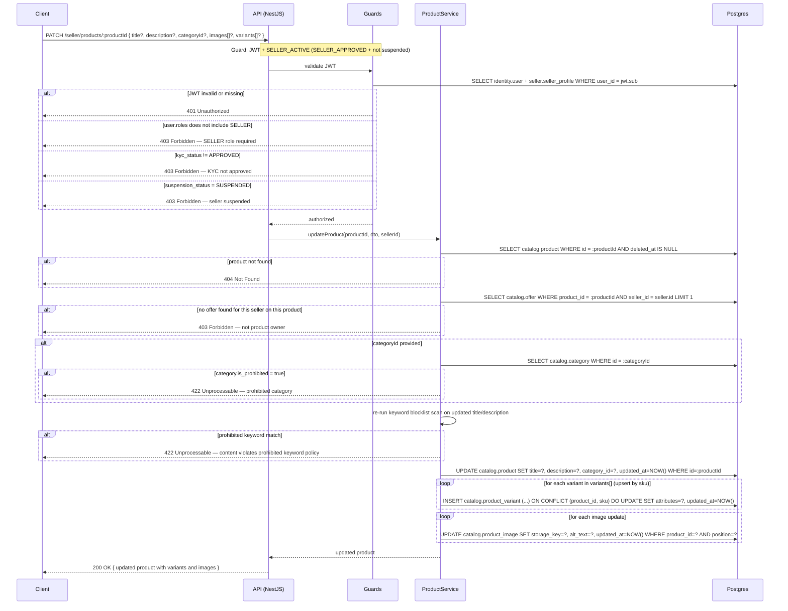
```mermaid
sequenceDiagram
    participant C as Client
    participant A as API (NestJS)
    participant G as Guards
    participant PS as ProductService
    participant P as Postgres

    C->>A: PATCH /seller/products/:productId { title?, description?, categoryId?, images[]?, variants[]? }
    Note over A,G: Guard: JWT + SELLER_ACTIVE (SELLER_APPROVED + not suspended)
    A->>G: validate JWT
    G->>P: SELECT identity.user + seller.seller_profile WHERE user_id = jwt.sub
    alt JWT invalid or missing
        G-->>C: 401 Unauthorized
    else user.roles does not include SELLER
        G-->>C: 403 Forbidden — SELLER role required
    else kyc_status != APPROVED
        G-->>C: 403 Forbidden — KYC not approved
    else suspension_status = SUSPENDED
        G-->>C: 403 Forbidden — seller suspended
    end
    G-->>A: authorized

    A->>PS: updateProduct(productId, dto, sellerId)
    PS->>P: SELECT catalog.product WHERE id = :productId AND deleted_at IS NULL
    alt product not found
        PS-->>C: 404 Not Found
    end
    PS->>P: SELECT catalog.offer WHERE product_id = :productId AND seller_id = seller.id LIMIT 1
    alt no offer found for this seller on this product
        PS-->>C: 403 Forbidden — not product owner
    end
    alt categoryId provided
        PS->>P: SELECT catalog.category WHERE id = :categoryId
        alt category.is_prohibited = true
            PS-->>C: 422 Unprocessable — prohibited category
        end
    end
    PS->>PS: re-run keyword blocklist scan on updated title/description
    alt prohibited keyword match
        PS-->>C: 422 Unprocessable — content violates prohibited keyword policy
    end

    PS->>P: UPDATE catalog.product SET title=?, description=?, category_id=?, updated_at=NOW() WHERE id=:productId
    loop for each variant in variants[] (upsert by sku)
        PS->>P: INSERT catalog.product_variant (...) ON CONFLICT (product_id, sku) DO UPDATE SET attributes=?, updated_at=NOW()
    end
    loop for each image update
        PS->>P: UPDATE catalog.product_image SET storage_key=?, alt_text=?, updated_at=NOW() WHERE product_id=? AND position=?
    end

    PS-->>A: updated product
    A-->>C: 200 OK { updated product with variants and images }
```

---

### Delete product (soft)

```
DELETE /seller/products/:productId
Tag: Seller
Auth: SELLER_APPROVED + SELLER_ACTIVE (must be product owner)
```
Sets `deleted_at` on the product. Active offers for this product are also deactivated.  
**Response 204**  
Side effect: `listing.soft_deleted` Kafka event via outbox.  
**Errors:** 403 not owner, 404

#### Sequence

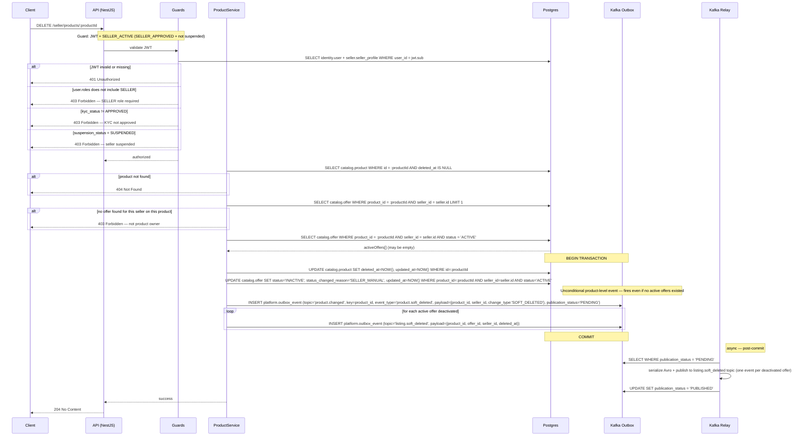
```mermaid
sequenceDiagram
    participant C as Client
    participant A as API (NestJS)
    participant G as Guards
    participant PS as ProductService
    participant P as Postgres
    participant KO as Kafka Outbox
    participant KR as Kafka Relay

    C->>A: DELETE /seller/products/:productId
    Note over A,G: Guard: JWT + SELLER_ACTIVE (SELLER_APPROVED + not suspended)
    A->>G: validate JWT
    G->>P: SELECT identity.user + seller.seller_profile WHERE user_id = jwt.sub
    alt JWT invalid or missing
        G-->>C: 401 Unauthorized
    else user.roles does not include SELLER
        G-->>C: 403 Forbidden — SELLER role required
    else kyc_status != APPROVED
        G-->>C: 403 Forbidden — KYC not approved
    else suspension_status = SUSPENDED
        G-->>C: 403 Forbidden — seller suspended
    end
    G-->>A: authorized

    PS->>P: SELECT catalog.product WHERE id = :productId AND deleted_at IS NULL
    alt product not found
        PS-->>C: 404 Not Found
    end
    PS->>P: SELECT catalog.offer WHERE product_id = :productId AND seller_id = seller.id LIMIT 1
    alt no offer found for this seller on this product
        PS-->>C: 403 Forbidden — not product owner
    end
    PS->>P: SELECT catalog.offer WHERE product_id = :productId AND seller_id = seller.id AND status = 'ACTIVE'
    P-->>PS: activeOffers[] (may be empty)

    Note over P,KO: BEGIN TRANSACTION
    PS->>P: UPDATE catalog.product SET deleted_at=NOW(), updated_at=NOW() WHERE id=:productId
    PS->>P: UPDATE catalog.offer SET status='INACTIVE', status_changed_reason='SELLER_MANUAL', updated_at=NOW() WHERE product_id=:productId AND seller_id=seller.id AND status='ACTIVE'
    Note over KO: Unconditional product-level event — fires even if no active offers existed
    PS->>KO: INSERT platform.outbox_event (topic='product.changed', key=product_id, event_type='product.soft_deleted', payload={product_id, seller_id, change_type:'SOFT_DELETED'}, publication_status='PENDING')
    loop for each active offer deactivated
        PS->>KO: INSERT platform.outbox_event (topic='listing.soft_deleted', payload={product_id, offer_id, seller_id, deleted_at})
    end
    Note over P,KO: COMMIT

    Note right of KR: async — post-commit
    KR->>KO: SELECT WHERE publication_status = 'PENDING'
    KR->>KR: serialize Avro + publish to listing.soft_deleted topic (one event per deactivated offer)
    KR->>KO: UPDATE SET publication_status = 'PUBLISHED'

    PS-->>A: success
    A-->>C: 204 No Content
```

---

### Cancel order (seller)

```
POST /seller/orders/:orderId/cancel
Tag: Seller
Auth: SELLER_ACTIVE (fulfillment must be in PENDING status)
```
**Request body**
```json
{ "reason": "string (max 500 chars)" }
```
**Response 200** `{ "data": { "fulfillmentId": "uuid", "status": "CANCELLED" } }`  
Side effect: `fulfillment.cancelled` Kafka event via outbox; restores `available_qty`.  
**Errors:** 409 fulfillment not in PENDING state

#### Sequence

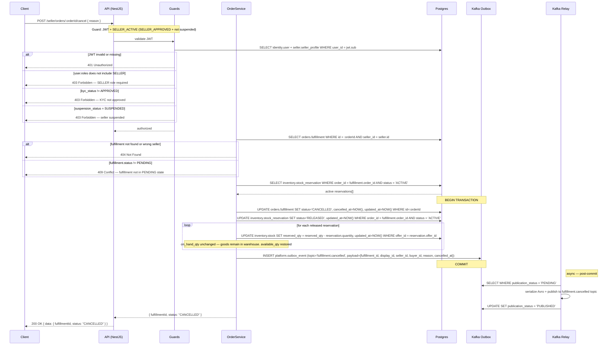
```mermaid
sequenceDiagram
    participant C as Client
    participant A as API (NestJS)
    participant G as Guards
    participant OrdS as OrderService
    participant P as Postgres
    participant KO as Kafka Outbox
    participant KR as Kafka Relay

    C->>A: POST /seller/orders/:orderId/cancel { reason }
    Note over A,G: Guard: JWT + SELLER_ACTIVE (SELLER_APPROVED + not suspended)
    A->>G: validate JWT
    G->>P: SELECT identity.user + seller.seller_profile WHERE user_id = jwt.sub
    alt JWT invalid or missing
        G-->>C: 401 Unauthorized
    else user.roles does not include SELLER
        G-->>C: 403 Forbidden — SELLER role required
    else kyc_status != APPROVED
        G-->>C: 403 Forbidden — KYC not approved
    else suspension_status = SUSPENDED
        G-->>C: 403 Forbidden — seller suspended
    end
    G-->>A: authorized

    OrdS->>P: SELECT orders.fulfillment WHERE id = :orderId AND seller_id = seller.id
    alt fulfillment not found or wrong seller
        OrdS-->>C: 404 Not Found
    else fulfillment.status != PENDING
        OrdS-->>C: 409 Conflict — fulfillment not in PENDING state
    end
    OrdS->>P: SELECT inventory.stock_reservation WHERE order_id = fulfillment.order_id AND status = 'ACTIVE'
    P-->>OrdS: active reservations[]

    Note over P,KO: BEGIN TRANSACTION
    OrdS->>P: UPDATE orders.fulfillment SET status='CANCELLED', cancelled_at=NOW(), updated_at=NOW() WHERE id=:orderId
    OrdS->>P: UPDATE inventory.stock_reservation SET status='RELEASED', updated_at=NOW() WHERE order_id = fulfillment.order_id AND status = 'ACTIVE'
    loop for each released reservation
        OrdS->>P: UPDATE inventory.stock SET reserved_qty = reserved_qty - reservation.quantity, updated_at=NOW() WHERE offer_id = reservation.offer_id
        Note over OrdS: on_hand_qty unchanged — goods remain in warehouse. available_qty restored
    end
    OrdS->>KO: INSERT platform.outbox_event (topic='fulfillment.cancelled', payload={fulfillment_id, display_id, seller_id, buyer_id, reason, cancelled_at})
    Note over P,KO: COMMIT

    Note right of KR: async — post-commit
    KR->>KO: SELECT WHERE publication_status = 'PENDING'
    KR->>KR: serialize Avro + publish to fulfillment.cancelled topic
    KR->>KO: UPDATE SET publication_status = 'PUBLISHED'

    OrdS-->>A: { fulfillmentId, status: "CANCELLED" }
    A-->>C: 200 OK { data: { fulfillmentId, status: "CANCELLED" } }
```

---

### Seller dashboard stats

```
GET /seller/dashboard/stats
Tag: Seller
Auth: SELLER_APPROVED
```
**Response 200**
```json
{
  "data": {
    "pendingOrders": 0,
    "activeListings": 0,
    "flaggedListings": 0,
    "lowStockAlerts": 0
  }
}
```

#### Sequence

```mermaid
sequenceDiagram
    participant C as Client
    participant A as API (NestJS)
    participant G as Guards
    participant P as Postgres

    C->>A: GET /seller/dashboard/stats
    Note over A,G: Guard: JWT + SELLER_APPROVED (suspended sellers: 403 per convention)
    A->>G: validate JWT
    G->>P: SELECT identity.user + seller.seller_profile WHERE user_id = jwt.sub
    alt JWT invalid or missing
        G-->>C: 401 Unauthorized
    else user.roles does not include SELLER
        G-->>C: 403 Forbidden — SELLER role required
    else kyc_status != APPROVED
        G-->>C: 403 Forbidden — KYC not approved
    else suspension_status = SUSPENDED
        G-->>C: 403 Forbidden — seller suspended
    end
    G-->>A: authorized (seller_id resolved)

    A->>P: SELECT COUNT(*) FROM orders.fulfillment WHERE seller_id = seller.id AND status = 'PENDING'
    A->>P: SELECT COUNT(*) FROM catalog.offer WHERE seller_id = seller.id AND status = 'ACTIVE' AND deleted_at IS NULL
    A->>P: SELECT COUNT(*) FROM catalog.offer WHERE seller_id = seller.id AND status = 'FLAGGED' AND deleted_at IS NULL
    A->>P: SELECT COUNT(*) FROM inventory.stock s JOIN catalog.offer o ON s.offer_id = o.id WHERE o.seller_id = seller.id AND o.status = 'ACTIVE' AND (s.on_hand_qty - s.reserved_qty) < s.low_stock_threshold
    P-->>A: four count results

    A-->>C: 200 OK { data: { pendingOrders, activeListings, flaggedListings, lowStockAlerts } }
```
