# Seller API

**Status:** Complete  
**Module:** `Seller`  
**Parent:** [API Design Index](../api-design.md)  
**Source of truth:** [BRD v1.4](../../requirements/BRD.md), [ERD](../data-model-erd.md)  
**Conventions:** [api-conventions.md](../../../conventions/api-conventions.md) — `operationId` naming (`<Module>_<verb><Resource>`), response envelope, cursor pagination, error shape, money-as-string. Correlation-ID propagation, the error envelope and rate-limit headers apply to every endpoint in this document and are stated once in [api-design.md § 1 Conventions](../api-design.md#conventions). Every list endpoint below uses the cursor envelope of [api-conventions.md § Pagination](../../../conventions/api-conventions.md#pagination) — `cursor` + `limit` (default 20, max 100), `meta: { nextCursor, hasMore }`, and **no `total`**.

---

## Summary

- [Endpoint Index](#endpoint-index)
- [DB Mapping](#db-mapping)
- [Sequence Diagram Conventions](#sequence-diagram-conventions)
- [Endpoints](#endpoints)

<a id="endpoint-index"></a>
## Endpoint Index

Guard names are the ones defined in [api-conventions.md § Auth Guard Legend](../../../conventions/api-conventions.md#auth-guard-legend): `SELLER_APPROVED` is SELLER + KYC approved, and `SELLER_ACTIVE` is `SELLER_APPROVED` + not suspended. There is no ad-hoc "SELLER_APPROVED + ACTIVE" composite.

| Group | Method | Path | Auth | Description |
|-------|--------|------|------|-------------|
| Onboarding | `POST` | [`/seller/register`](#register-as-seller) | **PUBLIC** | Create a seller account, or link SELLER to an existing account |
| Onboarding | `POST` | [`/seller/kyc`](#submit-kyc-application) | SELLER | Submit the KYC application |
| Onboarding | `GET` | [`/seller/kyc`](#get-kyc-application-status) | SELLER (suspended OK) | Check KYC status |
| Onboarding | `POST` | [`/seller/kyc/resubmit`](#resubmit-kyc-application) | SELLER (KYC = REJECTED) | Resubmit KYC after rejection |
| Profile | `GET` | [`/seller/profile`](#get-seller-profile) | SELLER (suspended OK) | Get seller profile |
| Profile | `PATCH` | [`/seller/profile`](#update-seller-profile) | SELLER (not suspended) | Update seller profile |
| Offers | `POST` | [`/seller/offers`](#create-offer) | SELLER_ACTIVE | Create offer for a product |
| Offers | `GET` | [`/seller/offers`](#list-offers-seller) | SELLER_ACTIVE | List own offers |
| Offers | `GET` | [`/seller/offers/:offerId`](#get-offer-seller) | SELLER_ACTIVE | Get offer detail |
| Offers | `PATCH` | [`/seller/offers/:offerId`](#update-offer) | SELLER_ACTIVE | Update offer status |
| Pricing | `PUT` | [`/seller/offers/:offerId/prices/:priceType`](#addupdate-offer-price) | SELLER_ACTIVE | Set a price row by type |
| Pricing | `DELETE` | [`/seller/offers/:offerId/prices/:priceId`](#delete-offer-price) | SELLER_ACTIVE | Withdraw a non-LIST price row |
| Inventory | `PATCH` | [`/seller/inventory/:offerId`](#update-inventory) | SELLER_ACTIVE | Update on-hand quantity and threshold |
| Inventory | `POST` | [`/seller/inventory/bulk`](#bulk-inventory-update-csv) | SELLER_ACTIVE | Bulk stock update via CSV |
| Products | `POST` | [`/seller/products/images`](#upload-product-image) | SELLER_ACTIVE | Upload one product image, returns its storage key |
| `POST` | [`/seller/products`](#create-product) | SELLER_ACTIVE | Create new product |
| Products | `PATCH` | [`/seller/products/:productId`](#update-product) | SELLER_ACTIVE + creator | Update a product this seller created |
| Products | `DELETE` | [`/seller/products/:productId`](#delete-product-soft) | SELLER_ACTIVE + creator | Withdraw the caller's offers; remove the product only if no other seller lists it |
| Fulfillments | `GET` | [`/seller/orders`](#list-seller-orders) | SELLER (suspended OK) | List seller fulfillments |
| Fulfillments | `GET` | [`/seller/orders/:fulfillmentId`](#get-seller-order-detail) | SELLER (suspended OK) | Fulfillment detail |
| Fulfillments | `POST` | [`/seller/orders/:fulfillmentId/ship`](#mark-order-shipped) | SELLER (suspended OK) | Mark fulfillment shipped |
| Fulfillments | `POST` | [`/seller/orders/:fulfillmentId/refund`](#issue-refund) | SELLER_ACTIVE | Issue refund |
| Fulfillments | `POST` | [`/seller/orders/:fulfillmentId/cancel`](#cancel-order-seller) | SELLER_ACTIVE | Cancel a PENDING fulfillment |
| Dashboard | `GET` | [`/seller/dashboard/summary`](#seller-dashboard-summary) | SELLER_ACTIVE | The four US-S-00 counts |

**A `/seller/orders` row is a fulfillment.** The path keeps the seller-facing word "orders", but every row, id and action under it addresses one `orders.fulfillment` — one seller's group within a buyer's checkout — which is why the path parameter is `:fulfillmentId` and the ids returned are `FUL-`, not `ORD-`.

**Onboarding is two steps and starts public** (US-S-01, [diagram 06](../../diagrams/06-auth-portals.md)):

1. `POST /seller/register` — **no token.** A prospective seller may hold no account at all. One who already holds a buyer account proves it with their password in the request body, not with a buyer JWT.
2. `POST /seller/kyc` — SELLER token, obtained from step 1. It does **not** require KYC approval, which it is the means of obtaining, and it does not require a verified email: the KYC documents are the identity check, and blocking on email verification would leave a seller who mistyped nothing to do.

---

<a id="db-mapping"></a>
## DB Mapping

| Endpoint | Primary DB | Tables / Notes |
|----------|-----------|----------------|
| `POST /seller/register` | Postgres | `identity.user` (insert, or add SELLER role to an existing row), `seller.seller_profile` (insert) |
| `POST /seller/kyc` | Postgres | `seller.kyc_application` (insert), `platform.outbox_event` (`seller.kyc.submitted`) |
| `GET /seller/profile` | Postgres | `seller.seller_profile` |
| `PATCH /seller/profile` | Postgres | `seller.seller_profile`, `platform.outbox_event` (`seller.profile_changed`, only when `business_name` changed) |
| `GET /seller/kyc` | Postgres | `seller.kyc_application` |
| `POST /seller/kyc/resubmit` | Postgres | `seller.kyc_application` (insert new), `platform.outbox_event` (`seller.kyc.submitted` with `is_resubmission: true`) |
| `POST /seller/offers` | Postgres | `CatalogApplicationService` (`catalog.offer` + `offer.changed`), `PricingApplicationService` (`pricing.offer_price`), `InventoryApplicationService` (`inventory.stock` + `inventory.changed`) |
| `GET /seller/offers` | Postgres | `CatalogApplicationService`, `PricingApplicationService`, `InventoryApplicationService`, `ModerationApplicationService` (open case per offer) |
| `GET /seller/offers/:offerId` | Postgres | `CatalogApplicationService`, `PricingApplicationService`, `InventoryApplicationService`, `ModerationApplicationService` |
| `PATCH /seller/offers/:offerId` | Postgres | `CatalogApplicationService` (`catalog.offer` + `offer.changed`) |
| `PUT /seller/offers/:offerId/prices/:priceType` | Postgres | `PricingApplicationService` (`pricing.offer_price`), `CatalogApplicationService` (`offer.changed`) |
| `DELETE /seller/offers/:offerId/prices/:priceId` | Postgres | `PricingApplicationService` (`pricing.offer_price`, set `inactive_at`), `CatalogApplicationService` (`offer.changed`) |
| `PATCH /seller/inventory/:offerId` | Postgres | `InventoryApplicationService` (`inventory.stock` + `inventory.changed`, + `inventory.low_stock` on a threshold crossing) |
| `POST /seller/inventory/bulk` | Postgres | `InventoryApplicationService` (`inventory.stock` batch + one event set per changed offer) |
| `GET /seller/orders` | Postgres | `orders.fulfillment` (where `seller_profile_id = :sellerProfileId`) |
| `GET /seller/orders/:fulfillmentId` | Postgres | `orders.fulfillment`, `orders.fulfillment_item`, `orders.order` (shipping snapshot), `platform.outbox_event` (`pii.accessed`) |
| `POST /seller/orders/:fulfillmentId/ship` | Postgres | `orders.fulfillment`, `platform.outbox_event` (`fulfillment.shipped`) — no inventory write; the shipment stock movement is the `inventory.fulfillment-shipped` consumer's |
| `POST /seller/orders/:fulfillmentId/refund` | Postgres | `orders.fulfillment`, `platform.outbox_event` (`fulfillment.refunded`) — no inventory write |
| `POST /seller/orders/:fulfillmentId/cancel` | Postgres | `orders.fulfillment`, `platform.outbox_event` (`fulfillment.cancelled`) — no inventory write |
| `POST /seller/products` | Postgres | `CatalogApplicationService` (`catalog.product` incl. `created_by_seller_id`, `catalog.product_variant`, `catalog.product_image`, + `product.changed`) |
| `PATCH /seller/products/:productId` | Postgres | `CatalogApplicationService` (`catalog.product` scoped `WHERE created_by_seller_id = :sellerProfileId`, `catalog.product_variant`, `catalog.product_image`, `catalog.offer` → `FLAGGED` on a guard hit, + `product.changed` and `offer.changed`), `ModerationApplicationService` (dismissed-term screening, `admin.moderation_case` insert + `listing.flagged` on a guard hit) |
| `DELETE /seller/products/:productId` | Postgres | `CatalogApplicationService` (deactivate the caller's `catalog.offer` rows + `listing.soft_deleted` per offer; `catalog.product` → `REMOVED` + `product.changed` **only when no other seller holds a non-`REMOVED` offer**), `PricingApplicationService` (`pricing.offer_price` → `inactive_at`) |
| `GET /seller/dashboard/summary` | Postgres | `orders.fulfillment`, `CatalogApplicationService`, `InventoryApplicationService` (counts only) |

**No row above writes a table outside the `seller` schema.** Every write into `catalog`, `pricing`, `inventory` or `admin` is reached through that module's application service, which writes its own rows *and its own outbox row* inside the caller's transaction — so `catalog.offer` and `offer.changed` move together and the producer of every topic stays its schema owner. This is the sole-writer rule: each Postgres schema has exactly one module that writes it, which is what keeps the Phase 2 extraction of a module possible at all (BRD §12 microservice-readiness). The service list and the method signatures are in [backend-module-architecture.md § Ownership boundaries](../backend-module-architecture.md#ownership-boundaries).

**The claim is scoped to `catalog`, `pricing`, `inventory` and `admin`, and two groups of rows sit outside it.** The five `/seller/orders/*` rows name `orders.fulfillment`, `orders.fulfillment_item` and `orders.order` directly, and `POST /seller/register` names `identity.user`. The sole-writer pass applied here covered only the `catalog`, `pricing`, `inventory` and `admin` access named above — the `catalog.offer`, `catalog.product`, `catalog.product_variant`, `catalog.product_image`, `pricing.offer_price` and `inventory.stock` writes and the `admin.moderation_case` read — and not these two, so routing them was not part of it — the rows are written as they were. They are **not** an exemption from the rule: `orders` and `identity` each have exactly one owning module, and the ship, refund and cancel routes writing `orders.fulfillment` and its outbox rows from a seller handler is the same shape as the writes that were routed. Whoever closes them gets `OrdersApplicationService` and `IdentityApplicationService` methods for the five order routes and for registration, on the pattern above. Until then, the rows here state what the document specifies rather than what the rule requires, and an implementer should not read the absence of a service call as permission.

---

<a id="sequence-diagram-conventions"></a>
## Sequence Diagram Conventions

> **Guards read claims, not tables.** Every `Guards` participant below performs a signature-and-expiry check, one Redis `GET auth:revoke_before:{sub}` for revocation, and then pure comparisons against the decoded JWT claims `roles`, `seller_kyc_status` and `seller_suspension_status` ([auth-jwt-design § 4](../../../conventions/auth-jwt-design.md#auth-guards)). No guard queries Postgres: the claims exist precisely so authorization costs no round trip, and a status change reaches the token within one request via the Redis revocation key rather than by re-reading a row every time. The `sellerProfileId` a handler needs is resolved **once, in the service layer**, from `jwt.sub`; the guard never resolves it.
>
> **The guard chain is identical on every endpoint and is drawn as one step.** Each diagram shows `A->>G: run the guard chain named above`, where "above" is that diagram's `Guard:` note naming the guard set. The chain it stands for is the same everywhere, evaluated in this order, first failure wins:
>
> | Condition | Response |
> |---|---|
> | JWT missing, invalid, expired, or revoked (`iat < revoke_before`) | `401 Unauthorized` |
> | `jwt.roles` does not include `SELLER` | `403 Forbidden — SELLER role required` |
> | `jwt.seller_kyc_status != APPROVED`, where the guard set includes `SELLER_APPROVED` | `403 Forbidden — KYC not approved` |
> | `jwt.seller_suspension_status = SUSPENDED`, where the guard set includes `SELLER_ACTIVE` or "not suspended" | `403 Forbidden — seller suspended` |
>
> An endpoint whose `Guard:` note omits a row does not evaluate it — `POST /seller/kyc` runs neither status check, and the three suspended-seller routes below run no suspension check. The per-endpoint guard set is also in the [Endpoint Index](#endpoint-index) and in [api-design.md § 1.1](../api-design.md#11-guard-application-matrix).
>
> **Foreign schemas are reached through application services, never by SQL.** A diagram step drawn as `CatalogApplicationService`, `PricingApplicationService`, `InventoryApplicationService` or `ModerationApplicationService` is a call into the module that owns those tables, taking the caller's transaction handle; the `seller` module writes `seller.seller_profile` and `seller.kyc_application` and nothing else. The service that owns a table also writes that table's outbox row, which is why `offer.changed` appears in a Catalog step and `inventory.changed` in an Inventory one rather than both in a `SellerService` step. Where a sequence writes three schemas — listing creation — the transaction boundary belongs to the seller module and each write inside it belongs to its owner. Signatures: [backend-module-architecture.md § Ownership boundaries](../backend-module-architecture.md#ownership-boundaries).
>
> **Ownership scoping.** Every seller-scoped read and mutation filters on the authenticated seller explicitly — `WHERE offer.seller_profile_id = :sellerProfileId`, `WHERE fulfillment.seller_profile_id = :sellerProfileId`. The predicate is stated in each specification rather than left implied, because an unscoped `WHERE id = ?` on a shared table reaches another seller's rows. `seller_profile_id` is the column name everywhere a seller is referenced from a non-`identity` table (ERD § conventions); it is never shortened to `seller_id`.
>
> **Outbox pattern:** Every `INSERT platform.outbox_event` in a sequence diagram is written in the **same Postgres transaction** as the domain change (`BEGIN TRANSACTION` / `COMMIT` notes mark the boundary) and populates every required column: `aggregate_type`, `aggregate_id`, `topic`, `key` (= `aggregate_id`, so per-aggregate ordering holds), `event_type`, `event_version`, `payload`, `correlation_id`, `occurred_at`, `created_at`, `updated_at`, `publication_status='PENDING'`. The diagrams abbreviate the argument list for legibility; the full column set is never optional. `Kafka Relay` then polls `WHERE publication_status = 'PENDING'` asynchronously after commit, serializes with Avro, publishes, and marks the row `PUBLISHED`.
>
> **Suspended-seller access restriction:** Sellers with `suspension_status = SUSPENDED` may access `GET /seller/orders`, `GET /seller/orders/:fulfillmentId` and `POST /seller/orders/:fulfillmentId/ship` — the obligation to fulfil orders placed before the suspension survives it (US-A-05:106) — plus the read-only `GET /seller/profile` and `GET /seller/kyc` that supply the suspension reason, duration and `suspended_until` the locked dashboard has to display (US-S-02:42). Withholding those two reads would blank the only screen a suspended seller can see. Every other seller endpoint returns `403 Forbidden`.
>
> **Money:** All monetary amounts in API JSON are decimal strings (`"99.99"`), never JS `number`, and every amount is accompanied by its currency code. Stored as `NUMERIC(19,4)` in Postgres. **No response in this document converts or recomputes an amount:** offer and price amounts are in the offer's `native_currency_code`, and fulfillment amounts are the values snapshotted at capture, returned exactly as stored (FR-P-03, FR-P-04a).
>
> **Inventory is written by the inventory consumer.** Refund and cancel change fulfillment status and write the outbox event; neither touches `inventory.stock` or `inventory.stock_reservation`. The `inventory.*` Kafka consumer is the single writer of stock restoration, keyed on `fulfillment_id` and idempotent on `event_id` ([kafka-events.md](../kafka-events.md)). Restoration is therefore eventually consistent — normally sub-second, bounded by consumer lag — and an available-stock read may briefly lag a cancellation.

---

<a id="endpoints"></a>
## Endpoints

### Register as seller

```
POST /seller/register
Tag: Seller
Auth: PUBLIC
Rate limit: 5 attempts per IP per 15 min
```

**No token.** A prospective seller reaches `/seller/register` with no AliceUT account of any kind, and the seller portal has no OAuth buttons ([diagram 06](../../diagrams/06-auth-portals.md)) — so requiring a buyer JWT here made the entire seller funnel unreachable. The endpoint is step 1 of two: it settles the *account*, and [`POST /seller/kyc`](#submit-kyc-application) submits the documents.

**Request body** (`application/json`)
```json
{
  "email": "string (email)",
  "password": "string (min 8, >= 1 letter, >= 1 number)",
  "fullName": "string (2–80 chars)"
}
```

**Three cases, decided by whether the email is already known** (US-S-01:25):

| Case | Behaviour |
|---|---|
| Email unknown | A new `identity.user` is created with `roles = ['SELLER']` and the supplied password. `password` is the new account's password. |
| Email known, account **has** a local password | `password` is **verified against the existing hash**, and on success `SELLER` is appended to that account's roles. This is the account-linking path, and the password is the proof of ownership that a buyer JWT was standing in for. A wrong password is `401`. |
| Email known, account is **OAuth-only** (`password_hash IS NULL`) | `409` with code **`PASSWORD_REQUIRED_FOR_LINK`**. There is no password to verify, so ownership cannot be proven here. The response points the seller at the buyer-portal password-set flow (US-B-15, [`POST /auth/set-password`](auth.md#set-local-password-oauth-only-account)); once a local password exists, the registration retry takes the linking path above. **A second account is never created for an email that already exists** — that would split one person's orders, cart and addresses across two identities that can never be merged. |

**No "business account" checkbox.** The seller form does not offer one, and a seller account is not `BUYER` or B2B by default. A seller who also wants B2B buyer status registers or updates a separate buyer account (US-S-01:29).

**Response 201**
```json
{
  "data": {
    "accessToken": "string (JWT, 15 min)",
    "sellerProfileId": "uuid",
    "user": {
      "id": "uuid",
      "email": "string",
      "fullName": "string",
      "roles": ["SELLER"],
      "emailVerified": false
    },
    "kycStatus": "PENDING_KYC",
    "nextStep": "SUBMIT_KYC"
  }
}
```
**Cookie set:** `Set-Cookie: refreshToken=<opaque>; HttpOnly; Secure; SameSite=Strict; Path=/api/v1/auth; Max-Age=604800`

The response opens a SELLER session, because step 2 needs one. `roles` carries every role the account holds — an existing buyer that just linked SELLER returns `["BUYER","SELLER"]`.

**Errors:** 400 validation, 401 password does not match the existing account, 409 `PASSWORD_REQUIRED_FOR_LINK`, 409 the account already holds a seller profile

#### Sequence

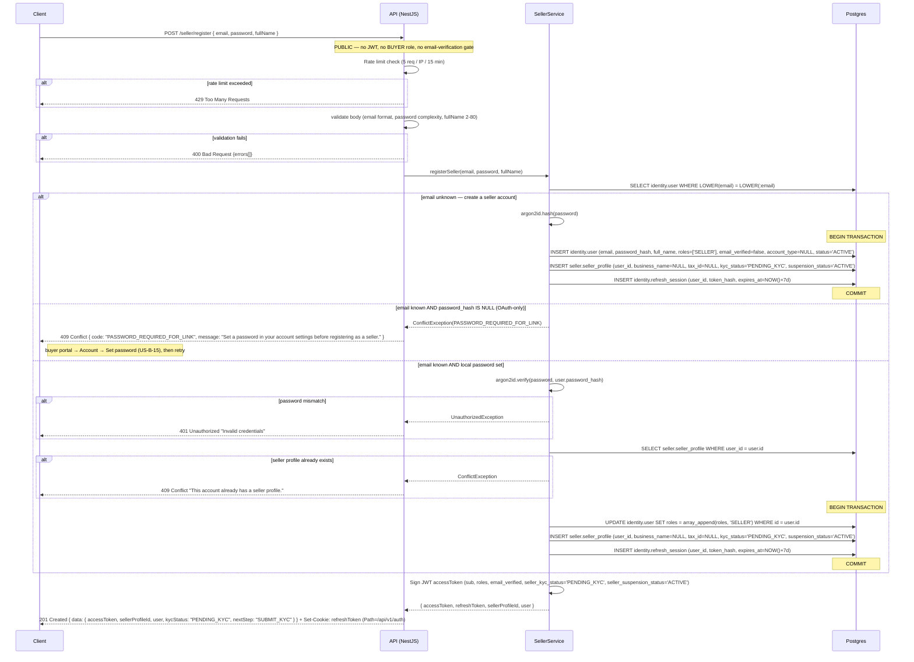

---

<a id="submit-kyc-application"></a>
### Submit KYC application

```
POST /seller/kyc
Tag: Seller
Auth: SELLER
```

Step 2 of onboarding. Requires the SELLER token issued by [`POST /seller/register`](#register-as-seller) and **nothing else**: not KYC approval, which this endpoint is the means of obtaining, and not a verified email, since the uploaded documents are the identity check.

**Request body** (multipart/form-data)
```
businessName: string
businessType: string (LLC | SOLE_PROP | CORP)
taxId: string
country: string (ISO 3166-1 alpha-2, e.g. "TH")
submittedData: JSON string (business address, phone, registration number)
documents[]: file[] (business licence PDF, ID document, proof of address — encrypted in object storage)
```
`country` is a two-character ISO 3166-1 alpha-2 code, matching every other address and KYC field in the system.

**Response 201**
```json
{
  "data": {
    "applicationId": "uuid",
    "sellerProfileId": "uuid",
    "status": "PENDING",
    "kycStatus": "PENDING_KYC",
    "submittedAt": "ISO8601"
  }
}
```
Side effect: `seller.kyc.submitted` event via the outbox — the notification consumer sends ET-14 to the seller and ET-21 to the admin.  
**Errors:** 400 validation, 409 an application is already `PENDING` or `APPROVED` (a rejected one is resubmitted through [`POST /seller/kyc/resubmit`](#resubmit-kyc-application)), 413 a file exceeds `KYC_UPLOAD_MAX_BYTES`, 415 a file fails the type allowlist

<a id="kyc-upload-validation"></a>
**Upload validation.** Each file is checked three ways before it reaches object storage, and all three must pass:

| Check | Rule |
|---|---|
| Extension | `.pdf`, `.jpg`, `.jpeg`, `.png` only |
| Sniffed MIME type | The magic bytes must be `application/pdf`, `image/jpeg` or `image/png`, and must agree with the extension. A declared `Content-Type` from the client is not trusted. |
| Size | At most `KYC_UPLOAD_MAX_BYTES` (env, default 10 MB) per file, at most `KYC_UPLOAD_MAX_FILES` (env, default 5) per application |

A file failing the extension or MIME check is `415`; one over the size limit is `413`. Neither is stored, and a rejected file fails the whole request rather than being silently dropped — a seller who believes they uploaded a licence that never arrived waits out the review SLA for nothing.

**No malware scanning in V1 — accepted risk.** An antivirus sidecar is infrastructure V1 does not carry, so an uploaded document is stored unscanned. The mitigations that reduce the blast radius are the three above plus:

- The `kyc-documents` bucket is private. There is no public URL and no anonymous presigned read; the only read path is [`GET /admin/kyc/:applicationId`](./admin.md#get-kyc-application-detail), which is ADMIN-only and issues a 5-minute presigned GET.
- The admin portal **downloads** documents rather than rendering them inline, so no uploaded bytes are executed or parsed by a viewer in a session holding an admin token.

The remedy in V2 is a scanner sidecar that the upload path awaits before the object is made readable. Until then the residual risk is a malicious file sitting in a private bucket, reachable only by an admin who chose to download it.

#### Sequence

```mermaid
sequenceDiagram
    participant C as Client
    participant A as API (NestJS)
    participant G as Guards
    participant SS as SellerService
    participant P as Postgres
    participant ObjS as ObjectStorage
    participant KO as Kafka Outbox
    participant KR as Kafka Relay

    C->>A: POST /seller/kyc (multipart/form-data)
    Note over A,G: Guard: JWT + SELLER. No SellerApproved (circular) and no EmailVerified.
    A->>G: run the guard chain named above
    G-->>A: authorized (claims only — no DB read)

    A->>SS: submitKyc(dto, jwt.sub)
    SS->>P: SELECT seller.seller_profile WHERE user_id = jwt.sub
    SS->>P: SELECT seller.kyc_application WHERE seller_profile_id = :sellerProfileId ORDER BY submitted_at DESC LIMIT 1
    alt latest application status IN (PENDING, UNDER_REVIEW, APPROVED)
        SS-->>A: ConflictException
        A-->>C: 409 Conflict — an application is already pending or approved
    end

    SS->>ObjS: PUT documents[N] (AES-256 encrypted, bucket: kyc-documents)
    ObjS-->>SS: document_storage_keys[]

    Note over P,KO: BEGIN TRANSACTION
    SS->>P: UPDATE seller.seller_profile SET business_name=:businessName, tax_id=:taxId, updated_at=NOW() WHERE id = :sellerProfileId
    SS->>P: INSERT seller.kyc_application (seller_profile_id, submitted_data, document_references=storage_keys, status='PENDING', submitted_at=NOW())
    SS->>KO: INSERT platform.outbox_event (topic='seller.kyc.submitted', aggregate_type='seller.seller_profile', aggregate_id=sellerProfileId, key=sellerProfileId, payload={is_resubmission:false, seller_id:sellerProfileId, seller_user_id:jwt.sub, kyc_application_id, business_name, seller_email, seller_name, submitted_at})
    Note over P,KO: The aggregate is the seller profile, not the application: the topic's partition key is seller_id (kafka-events § 2.1) and the outbox contract makes key = aggregate_id, so keying on applicationId would put a resubmission on a different partition from the application it supersedes and let ET-14 and the audit record arrive out of order. seller_user_id addresses the per-admin in-app fan-out&#59; seller_name is the person's name ET-14 greets and ET-21 lists
    Note over P,KO: COMMIT

    Note right of KR: async — post-commit
    KR->>KO: SELECT WHERE publication_status = 'PENDING'
    KR->>KR: serialize Avro + publish to seller.kyc.submitted topic
    KR->>KO: UPDATE SET publication_status = 'PUBLISHED'
    Note right of KO: notification consumer sends ET-14 to seller and ET-21 to admin (SLA deadline = submitted_at + 72h)

    SS-->>A: { applicationId, sellerProfileId, status: PENDING }
    A-->>C: 201 Created { data: { applicationId, sellerProfileId, status: "PENDING", kycStatus: "PENDING_KYC", submittedAt } }
```

---

### Get seller profile

```
GET /seller/profile
Tag: Seller
Auth: SELLER
```
**Response 200**
```json
{
  "data": {
    "id": "uuid",
    "businessName": "string | null",
    "kycStatus": "PENDING_KYC | APPROVED | REJECTED",
    "suspensionStatus": "ACTIVE | SUSPENDED",
    "suspendedUntil": "ISO8601 | null",
    "suspensionReason": "string | null",
    "rejectionReason": "string | null",
    "createdAt": "ISO8601"
  }
}
```

`suspendedUntil` and `suspensionReason` are what the locked seller dashboard renders: the reason, and the date the suspension lifts (US-S-02:42, US-A-05:107). A `null` `suspendedUntil` while `suspensionStatus = 'SUSPENDED'` means the suspension is permanent.

**A suspended seller may read this.** This endpoint and [`GET /seller/kyc`](#get-kyc-application-status) are the two reads exempted from the suspension block, because they supply the only content the suspended seller's dashboard has to show. Returning `403` here blanked exactly the screen the suspension is supposed to explain, leaving the seller with no reason, no duration and no route to appeal.

#### Sequence

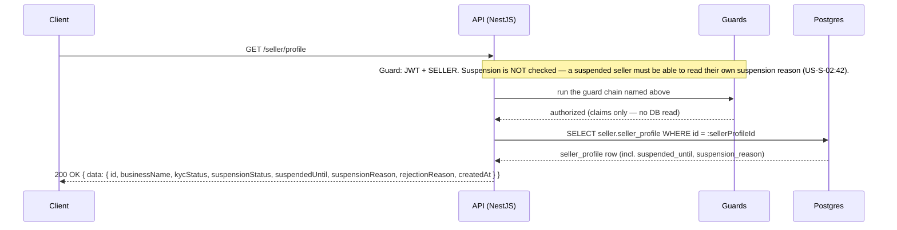

---

### Get KYC application status

```
GET /seller/kyc
Tag: Seller
Auth: SELLER (suspended sellers may also access)
```
Returns the seller's most recent application. **A suspended seller may read it** — the same exemption as `GET /seller/profile`, for the same reason.

**Response 200**
```json
{
  "data": {
    "id": "uuid",
    "status": "PENDING | UNDER_REVIEW | APPROVED | REJECTED",
    "submittedAt": "ISO8601",
    "decidedAt": "ISO8601 | null",
    "decisionReason": "string | null",
    "isResubmission": false,
    "priorRejectionReason": "string | null"
  }
}
```
`status` is the `kyc_status` enum, complete. `priorRejectionReason` carries the reason the previous application was refused, so the resubmission form can show the seller what to fix (US-S-02:41).

**Errors:** 404 no application submitted yet — the seller registered but has not completed [`POST /seller/kyc`](#submit-kyc-application)

#### Sequence

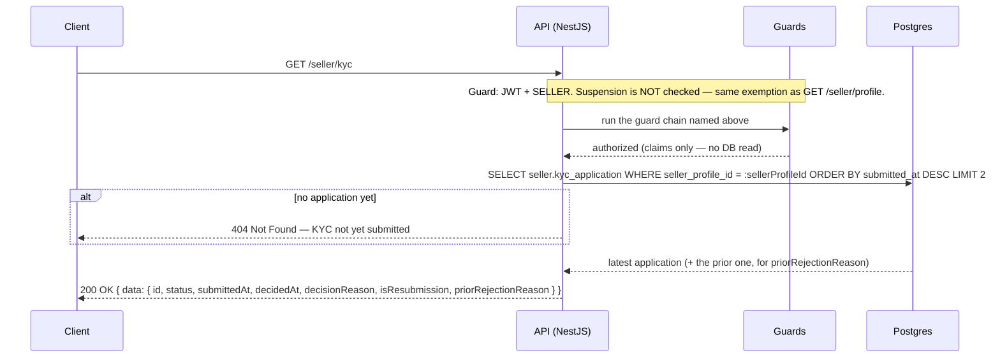

---

### Update seller profile

```
PATCH /seller/profile
Tag: Seller
Auth: SELLER (not suspended)
```
**Request body** (all optional)
```json
{
  "businessName": "string (max 200 chars)",
  "submittedData": "object (business address, contact, phone; countryCode is ISO 3166-1 alpha-2)"
}
```
A suspended seller may **read** the profile but not write it — editing a business identity while the account is under suspension is exactly the change an admin has paused.

**Response 200** — updated seller profile (`data`-wrapped, same shape as [`GET /seller/profile`](#get-seller-profile))  
Side effect: `seller.profile_changed` via the outbox, **only when `businessName` changed** ([kafka-events.md § 2.28](../kafka-events.md#228-sellerprofile_changed)).  
**Errors:** 400 validation, 403 seller suspended

**A rename has to reach the search index.** `business_name` is copied onto every one of the seller's `offers[]` entries as `seller_name` when the entry is created, and no `offer.changed` follows a profile edit — the offers did not change. Without an event here the index would serve the old name for as long as the seller left their listings alone, which for a seller who never edits one is permanently, and no later event would be obliged to repair it. The event is emitted on a `business_name` change only: a `submittedData`-only edit touches nothing indexed, and publishing on every `PATCH` would reindex every listing the seller holds to write the value already there.

#### Sequence

```mermaid
sequenceDiagram
    participant C as Client
    participant A as API (NestJS)
    participant G as Guards
    participant P as Postgres
    participant KO as Kafka Outbox
    participant KR as Kafka Relay

    C->>A: PATCH /seller/profile { businessName?, submittedData? }
    Note over A,G: Guard: JWT + SELLER + not suspended (writes are blocked while suspended&#59; the matching read is not)
    A->>G: run the guard chain named above
    G-->>A: authorized (claims only — no DB read)

    A->>A: validate request body
    alt validation fails
        A-->>C: 400 Bad Request
    end

    Note over P,KO: BEGIN TRANSACTION
    A->>P: SELECT business_name FROM seller.seller_profile WHERE id = :sellerProfileId FOR UPDATE
    A->>P: UPDATE seller.seller_profile SET business_name=?, submitted_data=?, updated_at=NOW() WHERE id = :sellerProfileId
    alt business_name changed
        A->>KO: INSERT platform.outbox_event (topic='seller.profile_changed', aggregate_type='seller.seller_profile', aggregate_id=:sellerProfileId, key=:sellerProfileId, payload={seller_id:sellerProfileId, seller_name:newBusinessName, changed_at:NOW()})
        Note over A,KO: Emitted on a business_name change only. offers[].seller_name is a copy of this value and no offer.changed follows a profile edit, so this is the one event that corrects it
    end
    Note over P,KO: COMMIT
    P-->>A: updated seller_profile row

    Note right of KR: async — post-commit
    KR->>KO: SELECT WHERE publication_status = 'PENDING'
    KR->>KR: serialize Avro + publish to seller.profile_changed topic
    KR->>KO: UPDATE SET publication_status = 'PUBLISHED'
    Note right of KO: search.seller-profile-changed sets seller_name on every offers[] entry whose seller_profile_id matches, by _update_by_query

    A-->>C: 200 OK { data: { id, businessName, kycStatus, suspensionStatus, suspendedUntil, suspensionReason, rejectionReason, createdAt } }
```

---

### Resubmit KYC application

```
POST /seller/kyc/resubmit
Tag: Seller
Auth: SELLER (KYC status must be REJECTED)
```
**Request body** (multipart/form-data) — the same fields as [`POST /seller/kyc`](#submit-kyc-application):
```
businessName: string
businessType: string (LLC | SOLE_PROP | CORP)
taxId: string
country: string (ISO 3166-1 alpha-2, e.g. "TH")
submittedData: JSON string (business address, phone, registration number)
documents[]: file[] (encrypted in object storage)
```
**Response 201**
```json
{ "data": { "applicationId": "uuid", "status": "PENDING", "kycStatus": "PENDING_KYC", "submittedAt": "ISO8601" } }
```
A resubmission creates a **new** application row whose `supersedes_application_id` points at the rejected one; the rejected row is retained untouched, which is what lets the admin queue show a "Resubmit" badge with the previous reason and date (US-A-01:42). `kyc_application.status` is immutable once decided, while `seller_profile.kyc_status` moves back to `PENDING_KYC` in the same transaction — the two columns are deliberately distinct and neither is derivable from the other. The type names are close enough to invite a misread: the application's column is `status` of type `kyc_status`, and the profile's column is `kyc_status` of type `seller_kyc_status` ([`kyc_application`](../data-model-erd.md#table-seller-kyc-application), [`seller_profile`](../data-model-erd.md#table-seller-seller-profile)).

Uploads are validated and stored exactly as in [`POST /seller/kyc`](#kyc-upload-validation), including the accepted V1 risk that documents are not scanned for malware.

Side effect: `seller.kyc.submitted` event with `is_resubmission: true` via the outbox.  
**Errors:** 400 validation, 409 the latest application is not `REJECTED`, 413 a file exceeds `KYC_UPLOAD_MAX_BYTES`, 415 a file fails the type allowlist

#### Sequence

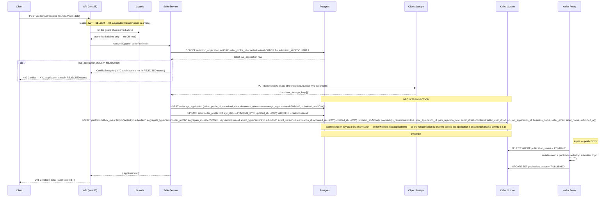

---

### Create offer

```
POST /seller/offers
Tag: Seller
Auth: SELLER_ACTIVE
```
**Request body**
```json
{
  "productId": "uuid",
  "variantId": "uuid | null",
  "nativeCurrencyCode": "USD | THB | JPY | SGD",
  "prices": [{
    "amount": "99.99",
    "priceType": "LIST",
    "minQty": 1,
    "startsAt": null,
    "endsAt": null
  }],
  "initialStock": 50,
  "lowStockThreshold": 5
}
```

**One currency per offer.** `nativeCurrencyCode` is the offer's pricing currency and every price row inherits it — which is why the individual price entries carry no `currencyCode`. A seller who wants to sell the same product in a second currency creates a second offer. This is what makes an effective price unambiguous on the PDP and makes the per-seller/per-currency checkout grouping well-defined.

**No `status` field, and no `DRAFT`.** A listing goes live on successful submit; the offer is created `ACTIVE` (US-S-10:190), or `FLAGGED` when the content trips the soft moderation tier — [see below](#offer-create-screening). Either way the status is the server's to decide and the request body carries no way to ask for one. `offer_status` is `ACTIVE | INACTIVE | REMOVED | FLAGGED` — a save-as-draft workflow is deferred, so accepting a `DRAFT` value here would create rows in a state no other endpoint, guard or consumer handles.

At least one `LIST` price is required (US-S-03:53).

**Response 201**
```json
{
  "data": {
    "id": "uuid",
    "productId": "uuid",
    "variantId": "uuid | null",
    "nativeCurrencyCode": "USD",
    "status": "ACTIVE",
    "prices": [{
      "id": "uuid",
      "priceType": "LIST",
      "amount": "99.99",
      "currencyCode": "USD",
      "minQty": 1,
      "startsAt": null,
      "endsAt": null
    }],
    "stock": { "onHandQty": 50, "reservedQty": 0, "availableQty": 50, "lowStockThreshold": 5 }
  }
}
```
Every amount is a string, and each carries the `currencyCode` it is denominated in — the offer's native currency. Nothing here is converted.

Side effects: `offer.changed` event, `inventory.changed` event via outbox; on a soft-tier screening hit also a `moderation_case` row and a `listing.flagged` event.  
**Errors:** 400 validation or no LIST price, 404 product not found, 409 offer already exists for this product+variant, 422 prohibited category, 422 currency not in the seller-priceable set, 422 hard-blocklist (`BLOCK`) hit

<a id="offer-create-screening"></a>
**This is where the two prohibited-content tiers produce a listing.** The offer is the listing: it is what a buyer sees, what search indexes, and what `admin.moderation_case.offer_id` points at. The content being screened is the product's stored `title` and `description` — the seller authored it at [`POST /seller/products`](#two-tier-moderation-guard), or another seller did on a shared product — so the screen runs again here rather than trusting the earlier pass, because the blocklist may have gained a term since.

| Screening outcome | Result |
|---|---|
| Prohibited taxonomy node, or a matched term with `enforcement = 'BLOCK'` | **`422`.** No offer, no price rows, no stock row, no case, no event. |
| Matched terms, all with `enforcement = 'FLAG'` | **`201`** with `status: "FLAGGED"` and a `LISTING_AUTO_FLAGGED` warning. In the same transaction: `catalog.offer.status = 'FLAGGED'` with `status_changed_reason = 'AUTO_MODERATION'`, an `admin.moderation_case` row with `source = 'KEYWORD_MATCH'` and the tripped terms in `matched_terms`, a `listing.flagged` outbox row with `admin_user_id = null`, and the `offer.changed` row carrying `status: 'FLAGGED'`. |
| No match | `201` with `status: "ACTIVE"`. |

The `FLAGGED` offer is created, priced and stocked exactly as an `ACTIVE` one — the status is the only difference, and it is what keeps the listing out of the index: `search.offer-changed` removes the `offers[]` entry whenever the payload's `status` is not `ACTIVE` ([search.md](./search.md#write-mechanisms)), so the flagged listing is invisible to buyers while the case is open without a second mechanism. An admin DISMISS returns it to `ACTIVE` and republishes; a REMOVE terminates it.

**The case row is written by Admin, not here.** `admin` is the admin module's schema, so the insert and its `listing.flagged` outbox row both go through `ModerationApplicationService.flagListing(offerId, source, matchedTerms, tx)` inside this transaction — the same seam the edit path uses ([backend-module-architecture § Ownership boundaries](../backend-module-architecture.md#ownership-boundaries)).

**The soft tier does not suppress the dismissed-term rule.** A term already dismissed on this offer cannot flag it again ([dismissed-term suppression](#dismissed-term-suppression)) — but a brand-new offer has no dismissal history, so on create the rule never fires and every `FLAG` term that matches counts.

#### Sequence

```mermaid
sequenceDiagram
    participant C as Client
    participant A as API (NestJS)
    participant G as Guards
    participant OS as SellerService (offers)
    participant CAS as CatalogApplicationService
    participant PAS as PricingApplicationService
    participant IAS as InventoryApplicationService
    participant MAS as ModerationApplicationService
    participant P as Postgres
    participant KO as Kafka Outbox
    participant KR as Kafka Relay

    C->>A: POST /seller/offers { productId, variantId?, nativeCurrencyCode, prices[], initialStock, lowStockThreshold? }
    Note over A,G: Guard: JWT + SELLER_ACTIVE (SELLER_APPROVED + not suspended)
    A->>G: run the guard chain named above
    G-->>A: authorized (claims only — no DB read)

    A->>OS: createOffer(dto, sellerProfileId)
    OS->>PAS: assertSellerPriceableCurrency(nativeCurrencyCode)
    PAS->>P: SELECT pricing.currency WHERE code = :nativeCurrencyCode AND is_seller_price_allowed = true
    alt currency not in the allowed set (USD, THB, JPY, SGD)
        PAS-->>C: 422 Unprocessable — currency not allowed for seller pricing
    end
    OS->>CAS: getProductForListing(productId)
    CAS->>P: SELECT catalog.product JOIN catalog.category ON product.category_id = category.id WHERE product.id = productId AND product.status = 'ACTIVE'
    alt product not found
        CAS-->>C: 404 Not Found — product not found
    else category.is_prohibited = true
        CAS-->>C: 422 Unprocessable — prohibited category
    end
    OS->>MAS: screenListingContent({ title, description, categoryId }) — the product's stored content, rescanned because the blocklist may have gained a term since it was written
    MAS-->>OS: { outcome: CLEAN | FLAG | BLOCK, matchedTerms[], prohibitedCategory }
    alt outcome = BLOCK
        OS-->>C: 422 Unprocessable — content violates prohibited keyword policy
        Note right of C: hard tier — no offer, no price rows, no stock row, no case, no event
    end
    OS->>OS: validate prices[] — at least one LIST, SALE time bounds
    alt validation fails
        OS-->>C: 400 / 422
    end
    OS->>CAS: getOfferForSeller({ productId, variantId }, sellerProfileId)
    CAS->>P: SELECT catalog.offer WHERE product_id=productId AND variant_id=variantId AND seller_profile_id = :sellerProfileId
    alt offer already exists for this product+variant
        CAS-->>C: 409 Conflict — offer already exists
    end

    Note over P,KO: BEGIN TRANSACTION — owned by SellerService, orchestrating three modules' application services
    OS->>CAS: createOffer({ productId, variantId, nativeCurrencyCode }, sellerProfileId, tx, status = outcome = FLAG ? 'FLAGGED' : 'ACTIVE')
    CAS->>P: INSERT catalog.offer (seller_profile_id, product_id, variant_id, native_currency_code, status, status_changed_reason = 'AUTO_MODERATION' when FLAGGED else NULL)
    alt outcome = FLAG
        OS->>MAS: flagListing(offer_id, 'KEYWORD_MATCH', matchedTerms, tx)
        MAS->>P: INSERT admin.moderation_case (offer_id, source='KEYWORD_MATCH', matched_terms=matchedTerms, reason, status='OPEN')
        MAS->>KO: INSERT platform.outbox_event (topic='listing.flagged', aggregate_type='catalog.offer', aggregate_id=offer_id, key=offer_id, payload={offer_id, product_id, product_title, seller_id, seller_user_id, seller_email, seller_name, moderation_case_id, source:'KEYWORD_MATCH', matched_terms:matchedTerms, flag_reason, admin_user_id:null, flagged_at})
        Note over MAS,KO: admin owns the admin schema, so admin writes both the case row and this outbox row (backend-module-architecture § Ownership boundaries). admin_user_id is null: the platform raised the flag, not a person
    end
    loop for each price in prices[]
        OS->>PAS: upsertOfferPrice(offer_id, price.priceType, price, tx)
        PAS->>P: INSERT pricing.offer_price (offer_id, amount, price_type, min_qty, starts_at, ends_at)
        Note over PAS,P: no currency_code column — the currency is offer.native_currency_code
    end
    OS->>IAS: openStock(offer_id, initialStock, lowStockThreshold, tx)
    IAS->>P: INSERT inventory.stock (offer_id, on_hand_qty=initialStock, reserved_qty=0, low_stock_threshold=COALESCE(lowStockThreshold, 5), version=1)
    CAS->>KO: INSERT platform.outbox_event (topic='offer.changed', aggregate_type='catalog.offer', aggregate_id=offer_id, key=offer_id, payload={change_type:CREATED, offer_id, product_id, seller_id:sellerProfileId, seller_name, seller_active:true, currency_code, status, prices[], display_prices})
    Note over CAS,KO: status is the offer's actual status — 'FLAGGED' on a soft-tier hit, in which case search.offer-changed removes the offers[] entry instead of writing it, so the flagged listing never becomes visible
    Note over CAS,KO: Catalog owns catalog.offer, so Catalog writes this row — one producer per topic, which is the schema owner. seller_name and seller_active come from SellerApplicationService and display_prices from PricingApplicationService.toDisplayPrices(), both inside this transaction: the search consumer indexes all three and may read no table to get them
    IAS->>KO: INSERT platform.outbox_event (topic='inventory.changed', aggregate_type='inventory.stock', aggregate_id=offer_id, key=offer_id, payload={change_reason:MANUAL_UPDATE, delta:+initialOnHandQty, offer_id, product_id, seller_id:sellerProfileId, on_hand_qty, reserved_qty, available_qty})
    Note over IAS,KO: delta is the signed change to on_hand_qty — the whole opening quantity here, since the row did not exist before. product_id is the Elasticsearch document id the search consumer's write is addressed to
    Note over P,KO: COMMIT

    Note right of KR: async — post-commit
    KR->>KO: SELECT WHERE publication_status = 'PENDING'
    KR->>KR: serialize Avro + publish to offer.changed, inventory.changed and — on a soft-tier hit — listing.flagged
    KR->>KO: UPDATE SET publication_status = 'PUBLISHED'

    OS-->>A: created offer with prices and stock
    A-->>C: 201 Created { data: { id, productId, variantId, nativeCurrencyCode, status: "ACTIVE" | "FLAGGED", prices[], stock{onHandQty, reservedQty, availableQty, lowStockThreshold} }, warnings: [ LISTING_AUTO_FLAGGED ] when FLAGGED }
```

---

### List offers (seller)

```
GET /seller/offers
Tag: Seller
Auth: SELLER_ACTIVE
Pagination: cursor
```
**Query params:** `status` (`ACTIVE | INACTIVE | REMOVED | FLAGGED`), `caseStatus` (`OPEN | RESOLVED | DISMISSED`), `limit`, `cursor`

Default sort `created_at DESC`; sort key `(created_at, id)`.

**One status vocabulary.** `status` is the `offer_status` enum, complete — the same four values the ERD defines, on the filter and on the row alike. There is no second `moderationStatus` field: moderation state is the offer's `status` (`FLAGGED`, `REMOVED`) plus the `moderationCase` object below, which is the actual row in `admin.moderation_case`. A parallel `NONE | FLAGGED | CLEARED | REMOVED` enum described the same facts in different words and belonged to no table.

**Response 200** — paginated list with price summary, stock, and moderation detail
```json
{
  "data": [{
    "id": "uuid",
    "productId": "uuid",
    "productTitle": "string",
    "variantId": "uuid | null",
    "nativeCurrencyCode": "USD",
    "status": "ACTIVE | INACTIVE | REMOVED | FLAGGED",
    "statusChangedReason": "SUSPENSION | ADMIN_REMOVAL | SELLER_DEACTIVATED | SELLER_MANUAL | AUTO_MODERATION | null",
    "moderationCase": {
      "id": "uuid",
      "source": "KEYWORD_MATCH | PROHIBITED_CATEGORY | ADMIN_MANUAL",
      "status": "OPEN | RESOLVED | DISMISSED",
      "decision": "REMOVE | DISMISS | null",
      "reason": "string",
      "createdAt": "ISO8601",
      "decidedAt": "ISO8601 | null",
      "decidedByRole": "ADMIN | PLATFORM"
    },
    "prices": [{ "id": "uuid", "priceType": "LIST", "amount": "99.99", "currencyCode": "USD", "minQty": 1, "startsAt": null, "endsAt": null }],
    "stock": { "onHandQty": 0, "reservedQty": 0, "availableQty": 0, "lowStockThreshold": 5 }
  }],
  "meta": { "nextCursor": "string | null", "hasMore": false }
}
```

`moderationCase` is `null` for an offer that has never been flagged, and carries the most recent case otherwise — which is what supplies the flag reason, the removal reason, the date and the acting party US-S-10:191-192 requires the seller to see. `decidedByRole` is `ADMIN` for a human decision and `PLATFORM` for an automatic flag; the admin's user id is not exposed to the seller, only the role (US-S-10:192 asks for "name or role").

A `REMOVED` listing cannot be reactivated by the seller; the removal is final and they may create a new compliant listing instead.

#### Sequence

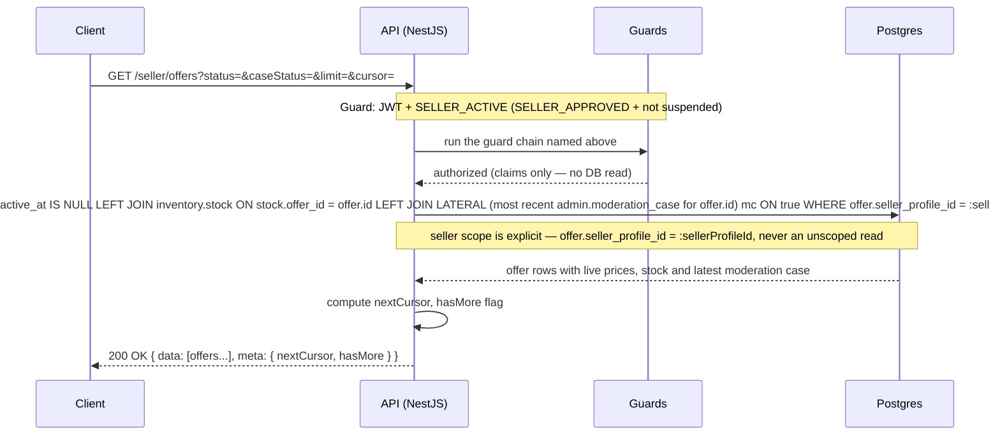

---

### Get offer (seller)

```
GET /seller/offers/:offerId
Tag: Seller
Auth: SELLER_ACTIVE
```
**Response 200** — the same object shape as a [list](#list-offers-seller) row, with every price row rather than only the live ones (withdrawn rows carry `inactiveAt`), and the full moderation-case history in `moderationCases[]` newest first.  
**Errors:** 404 offer not found or not owned by the caller

**404, not 403, for another seller's offer.** The lookup is scoped — `WHERE id = :offerId AND seller_profile_id = :sellerProfileId` — so a miss is indistinguishable from a non-existent id. A `403` would confirm that the offer exists and belongs to someone else, which is an enumeration oracle over the whole offer table.

#### Sequence

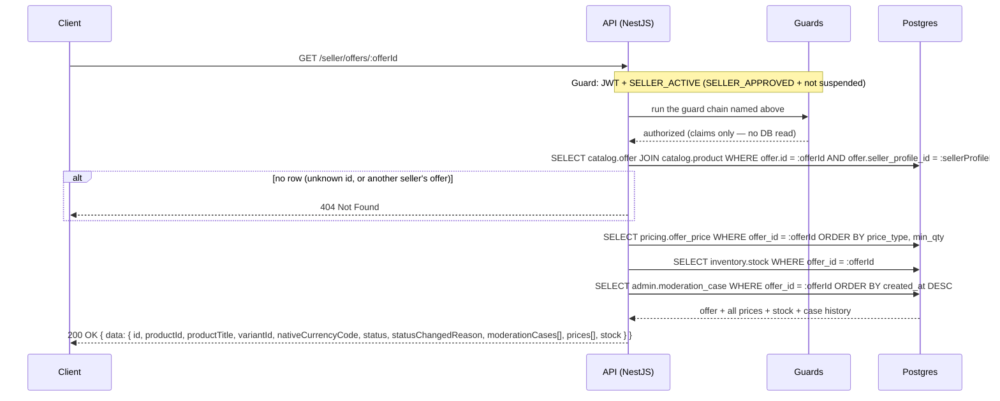

---

### Update offer

```
PATCH /seller/offers/:offerId
Tag: Seller
Auth: SELLER_ACTIVE
```
**Request body**
```json
{ "status": "ACTIVE | INACTIVE" }
```

**One path per state change.** This endpoint changes the offer's own status and nothing else. Prices are written through [`PUT /seller/offers/:offerId/prices/:priceType`](#addupdate-offer-price) and withdrawn through [`DELETE …/prices/:priceId`](#delete-offer-price); stock is written through [`PATCH /seller/inventory/:offerId`](#update-inventory). Carrying prices and a `stockAdjustment` here duplicated both of those, and the duplicate stock path took no row lock and emitted no `inventory.low_stock` — so the same seller action produced different events depending on which endpoint they happened to use.

`REMOVED` and `FLAGGED` are not settable by a seller: `REMOVED` is an admin decision (US-A-04) and `FLAGGED` is raised by the moderation guards or an admin. Attempting either is `422`. An offer currently `FLAGGED` or `REMOVED` cannot be flipped to `ACTIVE` here either — that is `409`, since it would let a seller undo a moderation outcome.

**Response 200** — updated offer (`data`-wrapped), same shape as the detail read  
Side effects: `offer.changed` event via the outbox; the search consumer replaces or withdraws this offer's entry in the product document, keyed on the payload's `status`, and touches nothing else in it — see [`search.md`](search.md#offerchanged--offer-fields-update-in-product-document).  
**Errors:** 404 offer not found or not owned by the caller, 409 offer is `FLAGGED` or `REMOVED`, 422 target status not settable by a seller

#### Sequence

```mermaid
sequenceDiagram
    participant C as Client
    participant A as API (NestJS)
    participant G as Guards
    participant OS as SellerService (offers)
    participant CAS as CatalogApplicationService
    participant P as Postgres
    participant KO as Kafka Outbox
    participant KR as Kafka Relay

    C->>A: PATCH /seller/offers/:offerId { status }
    Note over A,G: Guard: JWT + SELLER_ACTIVE (SELLER_APPROVED + not suspended)
    A->>G: run the guard chain named above
    G-->>A: authorized (claims only — no DB read)

    OS->>CAS: getOfferForSeller(:offerId, sellerProfileId)
    CAS->>P: SELECT catalog.offer WHERE id = :offerId AND seller_profile_id = :sellerProfileId
    alt no row (unknown id, or another seller's offer)
        CAS-->>C: 404 Not Found
    end
    alt requested status NOT IN (ACTIVE, INACTIVE)
        OS-->>C: 422 Unprocessable — status not settable by a seller
    else current status IN (FLAGGED, REMOVED)
        OS-->>C: 409 Conflict — listing is under moderation
    end

    Note over P,KO: BEGIN TRANSACTION
    OS->>CAS: setOfferStatus(:offerId, :status, sellerProfileId, tx)
    CAS->>P: UPDATE catalog.offer SET status=:status, status_changed_reason=(CASE :status WHEN 'INACTIVE' THEN 'SELLER_DEACTIVATED' ELSE 'SELLER_MANUAL' END), updated_at=NOW() WHERE id=:offerId AND seller_profile_id = :sellerProfileId
    CAS->>KO: INSERT platform.outbox_event (topic='offer.changed', aggregate_type='catalog.offer', aggregate_id=:offerId, key=:offerId, payload={change_type:(CASE :status WHEN 'INACTIVE' THEN 'DEACTIVATED' ELSE 'UPDATED' END), offer_id, product_id, seller_id:sellerProfileId, seller_name, seller_active, currency_code, status, prices:[current live rows], display_prices})
    Note over P,KO: change_type mirrors the status_changed_reason above — INACTIVE is the DEACTIVATED transition (kafka-events § 2.11). Reactivation to ACTIVE has no symbol of its own and rides as UPDATED&#59; status carries the truth either way
    Note over P,KO: COMMIT

    Note right of KR: async — post-commit
    KR->>KO: SELECT WHERE publication_status = 'PENDING'
    KR->>KR: serialize Avro + publish to offer.changed topic
    KR->>KO: UPDATE SET publication_status = 'PUBLISHED'

    OS-->>A: updated offer
    A-->>C: 200 OK { data: { updated offer with prices and stock } }
```

---

### Add/update offer price

```
PUT /seller/offers/:offerId/prices/:priceType
Tag: Seller
Auth: SELLER_ACTIVE
```
**Request body**
```json
{
  "amount": "89.99",
  "minQty": 1,
  "startsAt": "ISO8601 | null",
  "endsAt": "ISO8601 | null"
}
```

**No `currencyCode`.** The price row's currency is the parent offer's `native_currency_code`; `pricing.offer_price` has no currency column, so there is nothing here to disagree with the offer.

**Three pricing rules are enforced** (US-S-04b:90-95, US-P-01):

| Rule | Enforcement |
|---|---|
| At most one active `LIST` price per offer | The partial unique index on `(offer_id, price_type, min_qty) WHERE price_type = 'LIST' AND inactive_at IS NULL`. A second active `LIST` is `409` with the message "A LIST price already exists for this offer. Edit or delete it before creating a new one." — never a silent overwrite. |
| `SALE` periods may not overlap | The `EXCLUDE USING gist` constraint on `(offer_id, tstzrange(starts_at, ends_at))` for live `SALE` rows. An overlapping window is `409`. Non-overlapping sequential SALE rows are allowed and are how a scheduled future sale coexists with a live one. |
| At least one `LIST` price must always remain | Checked here on edit and on [delete](#delete-offer-price). |

A `PUT` therefore **updates the addressed row in place** and creates one only where none exists — it does not upsert over a uniqueness key that ignores the time bounds, which is what made a second `SALE` row impossible and let a duplicate `LIST` overwrite the live price without a word.

**Response 200** — the written price row (`data`-wrapped), with `currencyCode` echoed from the offer  
**Errors:** 404 offer not found or not owned by the caller, 409 duplicate active `LIST`, 409 overlapping `SALE` window, 422 `SALE` without valid time bounds, 422 unknown `priceType` (`LIST` and `SALE` are the V1 price types)

Price changes take effect immediately and do **not** affect in-flight orders: a `PENDING` fulfillment carries the unit price snapshotted at checkout (FR-P-03). The seller portal shows that warning on save (US-S-04b:93).

#### Sequence

```mermaid
sequenceDiagram
    participant C as Client
    participant A as API (NestJS)
    participant G as Guards
    participant OS as SellerService (pricing)
    participant CAS as CatalogApplicationService
    participant PAS as PricingApplicationService
    participant P as Postgres
    participant KO as Kafka Outbox
    participant KR as Kafka Relay

    C->>A: PUT /seller/offers/:offerId/prices/:priceType { amount: "89.99", minQty, startsAt?, endsAt? }
    Note over A,G: Guard: JWT + SELLER_ACTIVE (SELLER_APPROVED + not suspended)
    A->>G: run the guard chain named above
    G-->>A: authorized (claims only — no DB read)

    OS->>CAS: getOfferForSeller(:offerId, sellerProfileId)
    CAS->>P: SELECT catalog.offer WHERE id = :offerId AND seller_profile_id = :sellerProfileId
    alt no row (unknown id, or another seller's offer)
        CAS-->>C: 404 Not Found
    end
    Note over OS,P: currency comes from offer.native_currency_code — it was validated against pricing.currency at offer creation and is not re-supplied here
    alt priceType = SALE AND (startsAt IS NULL OR endsAt IS NULL OR startsAt >= endsAt)
        OS-->>C: 422 Unprocessable — SALE price requires valid time bounds (startsAt < endsAt)
    end

    Note over P,KO: BEGIN TRANSACTION
    OS->>PAS: upsertOfferPrice(:offerId, :priceType, dto, tx)
    PAS->>P: SELECT pricing.offer_price WHERE offer_id=:offerId AND price_type=:priceType AND min_qty=:minQty AND inactive_at IS NULL FOR UPDATE
    alt live row exists
        PAS->>P: UPDATE pricing.offer_price SET amount=?, starts_at=?, ends_at=?, updated_at=NOW() WHERE id=:existingPriceId
    else no live row
        PAS->>P: INSERT pricing.offer_price (offer_id, amount, price_type, min_qty, starts_at, ends_at)
        Note over PAS,P: partial unique index rejects a second live LIST → 409&#59; the SALE EXCLUDE constraint rejects an overlapping window → 409. Neither surfaces as a 500.
    end
    OS->>CAS: republishOffer(:offerId, tx)
    CAS->>KO: INSERT platform.outbox_event (topic='offer.changed', aggregate_type='catalog.offer', aggregate_id=:offerId, key=:offerId, payload={change_type:UPDATED, offer_id, product_id, seller_id:sellerProfileId, seller_name, seller_active, currency_code, status, prices:[current live rows], display_prices})
    Note over CAS,KO: A price change publishes offer.changed, and Catalog publishes it: the topic has one producer and it is catalog.offer's owner. Pricing supplies the price rows and the converted display_prices through its own service rather than writing a payload against a schema it does not own
    Note over P,KO: COMMIT

    Note right of KR: async — post-commit
    KR->>KO: SELECT WHERE publication_status = 'PENDING'
    KR->>KR: serialize Avro + publish to offer.changed topic
    KR->>KO: UPDATE SET publication_status = 'PUBLISHED'

    OS-->>A: written pricing.offer_price row
    A-->>C: 200 OK { data: { id, priceType, amount, currencyCode, minQty, startsAt, endsAt } }
```

---

<a id="delete-offer-price"></a>
### Delete offer price

```
DELETE /seller/offers/:offerId/prices/:priceId
Tag: Seller
Auth: SELLER_ACTIVE
```
US-S-04b:90 lets a seller remove a `SALE` row without touching the product or the LIST price. `SALE` is the only non-`LIST` price type in V1; there is no `B2B_TIER`.

**Withdrawal, not deletion.** The handler sets `inactive_at = now()`; the row stays. A withdrawn row never participates in effective-price resolution and is excluded from both uniqueness constraints, so the slot it occupied is immediately reusable — while any historical reference to it remains readable. `:priceId` is the row's own `pricing.offer_price.id`, since price type and `min_qty` alone do not identify one row once sequential SALE windows exist.

**At least one LIST price must always remain.** Deleting the offer's only live `LIST` row is `409` — an offer with no LIST price has no price the PDP can fall back to when a SALE window closes.

**Response 200** `{ "data": { "id": "uuid", "priceType": "SALE", "inactiveAt": "ISO8601" } }`  
Side effect: `offer.changed` event via the outbox.  
**Errors:** 404 offer or price not found, or not owned by the caller; 409 the row is the last live `LIST` price

#### Sequence

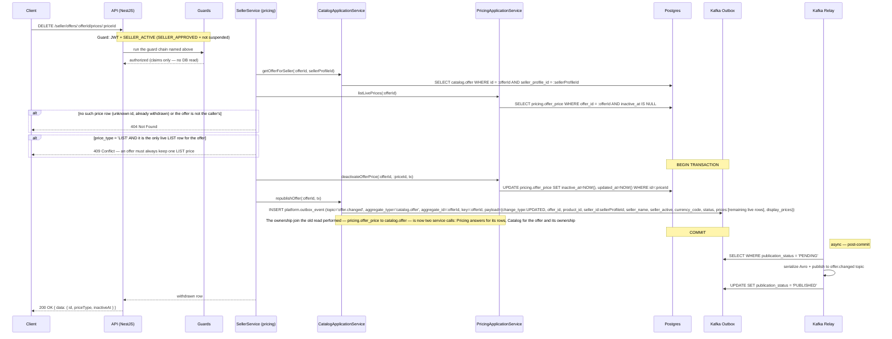

---

### Update inventory

```
PATCH /seller/inventory/:offerId
Tag: Seller
Auth: SELLER_ACTIVE
```
**Request body** (at least one field)
```json
{
  "onHandQty": 75,
  "lowStockThreshold": 10,
  "reason": "string (optional, max 500 chars)"
}
```
`lowStockThreshold` is configurable per offer (US-S-08:162); it was previously reachable only through the CSV import, which left the single-row UI unable to set it at all. `reason` is the adjustment note US-S-08:164 requires to be logged — free text, optional, at most 500 characters like every other operator-supplied reason in this spec. It is carried in the `inventory.changed` payload as `adjustment_reason` and lands in `audit_logs` via the audit consumer, not in a column. A human-caused change routes to `audit_logs` and is retained two years; system stock movements (reservation, shipment, restore) route to `activity_events` and are retained ninety days, and a stock figure a seller disputes has to remain reconcilable for longer than a quarter.

**The payload is the only route the reason has.** `inventory.stock` has no reason column and FR-P-11 forbids the handler from writing the audit record itself, so a reason omitted from the event is not logged in a less convenient place — it is not logged anywhere. `adjustment_reason` is therefore nullable on the payload (`["null","string"]`, default `null`) rather than absent, and the audit consumer writes it through **unmasked**: it is text the operator wrote about their own stock, not a secret. The [bulk CSV path](#bulk-inventory-update-csv) carries no reason and sets it `null` — `BULK_UPDATE` already says how the change arrived.

**Response 200** `{ "data": { "offerId": "uuid", "onHandQty": 75, "reservedQty": 5, "availableQty": 70, "lowStockThreshold": 10 } }`  
Side effects: `inventory.changed` event; `inventory.low_stock` **only on a downward crossing** of the threshold.  
**Errors:** 404 offer not found or not owned by the caller, 422 `onHandQty` below the currently reserved quantity

**Reserved units cannot be written away.** `inventory.stock` carries `CHECK (reserved_qty <= on_hand_qty)`: reserved units are physically held for `PENDING` orders, so on-hand can never drop below them. A request that would violate it is `422` naming the held quantity — never a `500`, and never a silently negative available count.

**Low-stock alerts are edge-triggered** (US-S-08:163). The event fires exactly once, on the transition from `available >= threshold` to `available < threshold`, and re-arms when available rises back to or above the threshold. Both the old and the new available quantity are known inside the transaction, so the crossing is computed rather than inferred: emitting on every write below the line produced one email per keystroke while a seller drew down stock.

#### Sequence

```mermaid
sequenceDiagram
    participant C as Client
    participant A as API (NestJS)
    participant G as Guards
    participant IS as SellerService (inventory)
    participant CAS as CatalogApplicationService
    participant IAS as InventoryApplicationService
    participant P as Postgres
    participant KO as Kafka Outbox
    participant KR as Kafka Relay

    C->>A: PATCH /seller/inventory/:offerId { onHandQty: 75 }
    Note over A,G: Guard: JWT + SELLER_ACTIVE (SELLER_APPROVED + not suspended)
    A->>G: run the guard chain named above
    G-->>A: authorized (claims only — no DB read)

    IS->>CAS: getOfferForSeller(:offerId, sellerProfileId)
    CAS->>P: SELECT catalog.offer WHERE id = :offerId AND seller_profile_id = :sellerProfileId
    alt no row (unknown id, or another seller's offer)
        CAS-->>C: 404 Not Found
    end

    Note over P,KO: BEGIN TRANSACTION
    IS->>IAS: adjustStock(:offerId, { onHandQty, lowStockThreshold, reason }, sellerProfileId, tx)
    IAS->>P: SELECT inventory.stock WHERE offer_id = :offerId FOR UPDATE
    P-->>IAS: current row (on_hand_qty, reserved_qty, low_stock_threshold)
    IAS->>IAS: priorAvailable = on_hand_qty - reserved_qty&#59; newAvailable = newOnHandQty - reserved_qty&#59; newThreshold = COALESCE(:lowStockThreshold, low_stock_threshold)
    alt newOnHandQty < reserved_qty
        IAS->>P: ROLLBACK
        IAS-->>C: 422 Unprocessable — cannot set on-hand below the 5 units reserved by pending orders
    end
    IAS->>P: UPDATE inventory.stock SET on_hand_qty=:newOnHandQty, low_stock_threshold=:newThreshold, version=version+1, updated_at=NOW() WHERE offer_id=:offerId
    IAS->>KO: INSERT platform.outbox_event (topic='inventory.changed', aggregate_type='inventory.stock', aggregate_id=:offerId, key=:offerId, payload={change_reason:MANUAL_UPDATE, delta:(newOnHandQty - on_hand_qty), offer_id, product_id, seller_id:sellerProfileId, on_hand_qty, reserved_qty, available_qty:newAvailable, low_stock_threshold:newThreshold, adjustment_reason:reason})
    Note over IAS,KO: delta is the signed change to on_hand_qty, negative on a drawdown — an audit reader must not have to diff consecutive documents to learn what changed. product_id is the Elasticsearch document id the search consumer's _update is addressed to (kafka-events § 2.12)
    alt priorAvailable >= newThreshold AND newAvailable < newThreshold
        IAS->>KO: INSERT platform.outbox_event (topic='inventory.low_stock', aggregate_type='inventory.stock', aggregate_id=:offerId, key=:offerId, payload={offer_id, seller_id:sellerProfileId, seller_user_id, product_title, sku_label, sku_id, available_qty:newAvailable, low_stock_threshold:newThreshold, on_hand_qty:newOnHandQty, reserved_qty, seller_email, seller_name})
        Note over IAS,KO: edge-triggered — fires only on the downward crossing, re-arms when available rises back to the threshold (US-S-08:163). Eleven fields, because ET-15 renders eleven: the product title, the variant label and the SKU come from CatalogApplicationService and the seller's name, email and user id from SellerApplicationService, both inside this transaction — the notification consumer may read neither schema (kafka-events § 2.13)
    end
    Note over P,KO: COMMIT

    Note right of KR: async — post-commit
    KR->>KO: SELECT WHERE publication_status = 'PENDING'
    KR->>KR: serialize Avro + publish to inventory.changed (and inventory.low_stock if emitted)
    KR->>KO: UPDATE SET publication_status = 'PUBLISHED'

    IS-->>A: { offerId, onHandQty, reservedQty, availableQty, lowStockThreshold }
    A-->>C: 200 OK { data: { offerId, onHandQty, reservedQty, availableQty, lowStockThreshold } }
```

---

### Bulk inventory update (CSV)

```
POST /seller/inventory/bulk
Tag: Seller
Auth: SELLER_ACTIVE
Content-Type: multipart/form-data
```
**Form fields:** `file` (CSV, max 5 MB, ≤ 10k rows). CSV format: `sku,on_hand,low_stock_threshold` (last column optional).

**Response 200** — the work is committed before the response returns, so the status is `200`, not `202`. A `202` promises a job the caller can poll for, and there is none.
```json
{
  "data": {
    "accepted": 96,
    "rejected": 2,
    "skipped": 2,
    "errors": [
      { "row": 3, "sku": "SKU-001", "code": "SKU_NOT_FOUND", "message": "SKU not found or not yours" },
      { "row": 8, "sku": "SKU-042", "code": "BELOW_RESERVED", "message": "on_hand 2 is below the 5 units reserved by pending orders" }
    ],
    "warnings": [
      { "row": 11, "sku": "SKU-077", "code": "OFFER_INACTIVE", "message": "Offer is inactive — row excluded" }
    ]
  }
}
```

`warnings[]` is returned, not discarded: the validation pass already computes it, and US-S-09:181 requires the seller to see which rows were skipped and why. `errors[]` rows are rejected; `warnings[]` rows are excluded from the update but are not failures. A row naming a SKU the authenticated seller does not own is always an error and is never processed, whatever the seller confirms (US-S-09:180).

A row whose new `on_hand` would fall below the reserved quantity is reported as a row-level error and the remaining rows still commit — the `CHECK (reserved_qty <= on_hand_qty)` violation is caught per row, never surfaced as a `500`.

**There is no per-row reason field, and the CSV format does not accept one.** Each row's `inventory.changed` carries `adjustment_reason: null` with `change_reason = BULK_UPDATE`, which already tells an audit reader how the change arrived; the [single-row path](#update-inventory) is where a seller explains an individual adjustment. Adding a reason column to the CSV would ask for the same sentence ten thousand times.

**Errors:** 400 malformed CSV, file over 5 MB, or more than 10k rows

#### Sequence

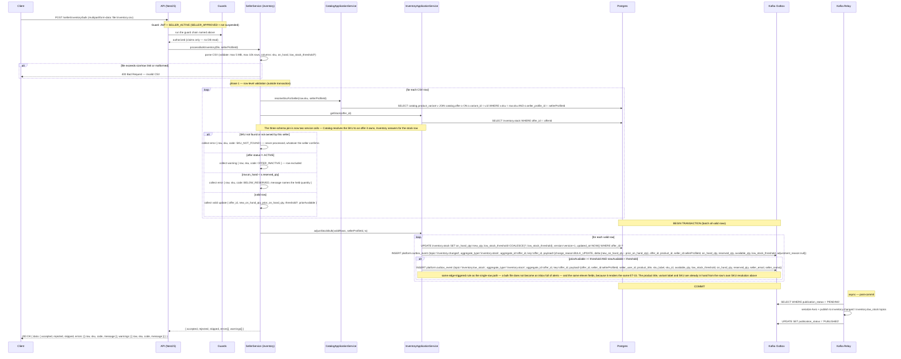

---

### List seller orders

```
GET /seller/orders
Tag: Seller
Auth: SELLER (suspended sellers may also access)
Pagination: cursor
```
**Query params:** `status` (`PENDING | SHIPPED | DELIVERED | REFUNDED | CANCELLED`), `placedFrom` / `placedTo` (ISO 8601 date range), `q` (search on `display_id`), `limit`, `cursor`

Default sort `placed_at DESC`; sort key `(placed_at, id)`. The date-range filter and the order-id search are the two the fulfillment dashboard needs to be usable past the first page (US-S-05:107).

**Response 200**
```json
{
  "data": [
    {
      "id": "uuid",
      "displayId": "FUL-000003871",
      "orderDisplayId": "ORD-000001042",
      "status": "PENDING | SHIPPED | DELIVERED | REFUNDED | CANCELLED",
      "placedAt": "ISO8601",
      "buyerNameMasked": "J. Doe",
      "itemCount": 2,
      "hasRemovedListing": false,
      "totalAmount": "99.98",
      "currencyCode": "USD",
      "buyerCurrencyTotal": "3201.36",
      "buyerDisplayCurrency": "THB"
    }
  ],
  "meta": { "nextCursor": "string | null", "hasMore": true }
}
```

| Field | Note |
|-------|------|
| `displayId` | `FUL-` + 9 digits from `orders.fulfillment_display_seq`. Not UUID hex — the old 8-hex-char derivation was the top timestamp bits of a UUIDv7 and collided inside ~65 s windows under a `UNIQUE` constraint. |
| `orderDisplayId` | `ORD-` + 9 digits — the buyer's order this fulfillment belongs to, so the seller can quote the id the buyer sees. |
| `buyerNameMasked` | Masked to initial-plus-surname (US-S-05:105). The unmasked name appears only on the detail view, whose PII read is audited. |
| `hasRemovedListing` | `true` when any line references an offer now `REMOVED` or `FLAGGED` — the "Listing removed" badge (US-S-05:108). The order stays in its tab and the seller remains responsible for fulfilling it. |
| `totalAmount` + `currencyCode` | The snapshot in the **seller's native currency**, returned as stored. |
| `buyerCurrencyTotal` + `buyerDisplayCurrency` | The snapshot in the currency the **buyer** was charged in, converted once at capture. Both pairs are stored values; neither is recomputed, and no live FX rate is read (FR-P-03). |

**Empty state** per tab (US-S-05:110): an empty `data[]` with `hasMore: false`. The portal renders "No pending orders — new orders appear here" for the Pending tab and "No orders in this status." for the others.

#### Sequence

```mermaid
sequenceDiagram
    participant C as Client
    participant A as API (NestJS)
    participant G as Guards
    participant P as Postgres

    C->>A: GET /seller/orders?status=&placedFrom=&placedTo=&q=&limit=&cursor=
    Note over A,G: Guard: JWT + SELLER (suspended sellers explicitly permitted)
    A->>G: run the guard chain named above
    G-->>A: authorized (claims only — no DB read)
    Note over G: suspension_status check skipped — suspended sellers may access order list

    A->>P: SELECT orders.fulfillment f JOIN orders.order o ON o.id = f.order_id JOIN identity.user b ON b.id = o.buyer_id WHERE f.seller_profile_id = :sellerProfileId AND f.status = COALESCE(:status, f.status) AND f.placed_at >= COALESCE(:placedFrom, f.placed_at) AND f.placed_at <= COALESCE(:placedTo, f.placed_at) AND (:q IS NULL OR f.display_id ILIKE :q OR o.display_id ILIKE :q) AND (f.placed_at, f.id) < (:cursorPlacedAt, :cursorId) ORDER BY f.placed_at DESC, f.id DESC LIMIT limit+1
    A->>P: SELECT COUNT(*), BOOL_OR(offer.status IN ('REMOVED','FLAGGED')) FROM orders.fulfillment_item JOIN catalog.offer USING (offer_id) GROUP BY fulfillment_id
    Note over A,P: no COUNT(*) over the whole result set — cursor pagination returns no total (api-conventions)
    P-->>A: fulfillment rows (limit+1 to decide hasMore) + per-row item count and removed-listing flag

    A->>A: mask buyer name to initial + surname&#59; compute nextCursor
    A-->>C: 200 OK { data: [{ id, displayId, orderDisplayId, status, placedAt, buyerNameMasked, itemCount, hasRemovedListing, totalAmount, currencyCode, buyerCurrencyTotal, buyerDisplayCurrency }], meta: { nextCursor, hasMore } }
```

---

### Get seller order detail

```
GET /seller/orders/:fulfillmentId
Tag: Seller
Auth: SELLER (suspended sellers may also access)
```
**Response 200**
```json
{
  "data": {
    "id": "uuid",
    "displayId": "FUL-000003871",
    "orderDisplayId": "ORD-000001042",
    "status": "PENDING | SHIPPED | DELIVERED | REFUNDED | CANCELLED",
    "buyerName": "string",
    "shippingAddress": {
      "recipientName": "string",
      "addressLine1": "string",
      "addressLine2": "string | null",
      "city": "string",
      "stateRegion": "string | null",
      "postalCode": "string",
      "countryCode": "TH"
    },
    "trackingNumber": "TRK-000003871",
    "estimatedDeliveryAt": "ISO8601",
    "placedAt": "ISO8601",
    "shippedAt": "ISO8601 | null",
    "items": [
      {
        "offerId": "uuid",
        "productTitle": "string",
        "variantLabel": "string | null",
        "listingStatus": "ACTIVE | INACTIVE | FLAGGED | REMOVED",
        "quantity": 2,
        "unitPrice": "49.99",
        "tax": "0.00",
        "lineTotal": "99.98",
        "currencyCode": "USD",
        "buyerCurrencyUnitPrice": "1600.68",
        "buyerCurrencyTax": "0.00",
        "fxRateUsedAtCapture": "32.02000000"
      }
    ],
    "shippingTotal": "0.00",
    "taxTotal": "0.00",
    "totalAmount": "99.98",
    "currencyCode": "USD",
    "buyerCurrencyTotal": "3201.36",
    "buyerDisplayCurrency": "THB"
  }
}
```

**One capture currency per fulfillment.** `currencyCode` is the offer's `native_currency_code`, and it is the currency of every item amount, `shippingTotal`, `taxTotal` and `totalAmount` on this fulfillment — a fulfillment is by definition one seller's items in one currency, which is what makes the checkout grouping well-defined. An item priced in THB alongside a total labelled USD described a fulfillment that cannot exist.

The `buyerCurrency*` fields are the amounts the buyer was actually charged, converted **once at capture** and stored. `fxRateUsedAtCapture` is `1.00000000` when the two currencies are the same, never null, so no reader has to branch. `shippingTotal` and `taxTotal` are returned because `totalAmount` cannot otherwise be reconciled from the line items.

**Shipping and tax are structural zeroes.** `shippingTotal` and `taxTotal` are the stored `orders.fulfillment.shipping_cost` and `tax_total`, and every `tax` and `buyerCurrencyTax` on a line item is the stored `fulfillment_item` snapshot. All of them capture `"0.00"` in V1: real shipping is out of scope (BRD §3.2) and Phase 1 defines no tax engine, rate table or jurisdiction model, so there is nothing to compute a figure from. The fields exist so that adding either later changes the value written rather than the shape of the response.

**Nothing on this response is computed.** Every amount, `lineTotal` included, is read from `orders.fulfillment` / `orders.fulfillment_item` as stored. No live FX rate and no current price row is consulted (FR-P-03).

`listingStatus` surfaces the "Listing removed" marker per line (US-S-05:108); a removed listing does not release the seller from fulfilling the order.

**Errors:** 404 fulfillment not found or not owned by the caller

**404, not 403, for another seller's fulfillment** — the lookup is scoped, so a `403` would confirm the id exists and let a seller enumerate the platform's order volume.

**The buyer's unmasked shipping address is PII (NFR-09).** Reading it emits a `pii.accessed` outbox row — `resource_type = BUYER_ADDRESS`, `resource_id` = the fulfillment id, `subject_user_id` = the buyer, `accessor_user_id` = the seller's user id, `accessor_role = SELLER` — written in the transaction that serves the request; the `platform.audit` consumer writes the `pii_access_logs` document ([kafka-events.md § 2.26](../kafka-events.md#226-piiaccessed)). The handler does not write MongoDB, and the event carries no address data: the record is *that* the address was read, by whom, and when.

#### Sequence

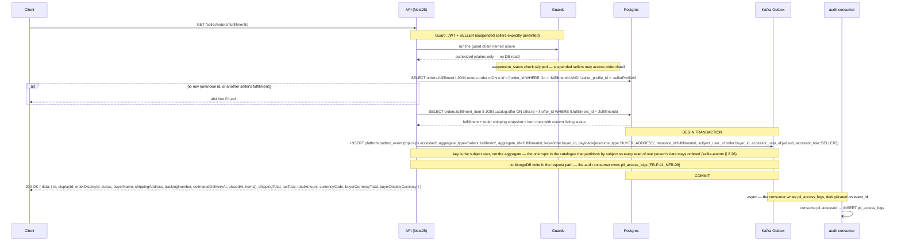

---

### Mark order shipped

```
POST /seller/orders/:fulfillmentId/ship
Tag: Seller
Auth: SELLER (suspended sellers may also access)
```
No request body.

**Response 200** — the fulfillment as it now stands
```json
{
  "data": {
    "id": "uuid",
    "displayId": "FUL-000003871",
    "status": "SHIPPED",
    "trackingNumber": "TRK-000003871",
    "shippedAt": "ISO8601",
    "estimatedDeliveryAt": "ISO8601"
  }
}
```

**A replay is not a conflict** (US-S-06:133). A ship action against a fulfillment already `SHIPPED` returns `200` with the current resource and produces no second event, no second tracking number and no second buyer email. `409` is reserved for a genuine conflict — a source status from which shipping is not a legal transition (`DELIVERED`, `REFUNDED`, `CANCELLED`). Returning `409` on a replay made the retry the client already performs on a timeout look like a failure and left the seller unable to tell a lost response from a rejected action.

Where the client sends an `Idempotency-Key` header, the same key with the same body replays; the same key with a **different** body is `409` ([api-conventions § Idempotency](../../../conventions/api-conventions.md#idempotency)). The key is stored in `orders.idempotency_key`, keyed `(actor_user_id, key)` against the seller's own user id — the same table checkout uses, because a seller mutation needs the same protection and a second table would only duplicate the cleanup job ([`data-model-erd.md`](../data-model-erd.md#table-orders-idempotency-key)).

**A replay returns the current state of the fulfillment, re-read at replay time — never a stored response body.** No row in `orders.idempotency_key` holds a response; the `409` on a different body is decided from the stored `request_hash`, and the body of a successful replay is re-serialised from the fulfillment the path already names. That is also why a replay may legitimately return a *later* state than the original call did: a ship replayed after the delivery mock has run reports `DELIVERED`, which is the truth about the resource rather than a stale echo of the first response. The key row needs no `fulfillment_id` for this — unlike checkout, whose request names no resource, the resource is in the path on every call including the replay.

**The tracking number is not generated here.** It was issued when the fulfillment row was created at `PENDING` and is immutable (US-S-06:132) — `TRK-` plus 9 digits from `orders.tracking_display_seq`. This transition must not mint a second one; the buyer has already been shown the first.

**This handler does not touch inventory.** It writes the fulfillment status change and the outbox row in one transaction, and nothing else — it does not decrement `on_hand_qty`, does not decrement `reserved_qty`, and does not update `inventory.stock_reservation`. All three belong to the `inventory.fulfillment-shipped` consumer, which is their single writer: in one transaction it sets this fulfillment's `ACTIVE` reservations to `CONSUMED` scoped `WHERE fulfillment_id = ?`, decrements `on_hand_qty` and `reserved_qty` by the shipped quantity, and writes the `inventory.changed` row with `change_reason = SHIPMENT` ([kafka-events.md § fulfillment.shipped](../kafka-events.md#25-fulfillmentshipped)). On-hand and reserved fall by the same quantity, so `available = on_hand_qty - reserved_qty` does not move at shipment and no buyer-facing availability figure changes. Doing any of it inline would give the movement two writers and make a redelivered event double-decrement.

Side effect: `fulfillment.shipped` event via the outbox — ET-02 to the buyer, and the stock movement above.  
**Errors:** 404 fulfillment not found or not owned by the caller, 409 fulfillment is `DELIVERED`, `REFUNDED` or `CANCELLED`

#### Sequence

```mermaid
sequenceDiagram
    participant C as Client
    participant A as API (NestJS)
    participant G as Guards
    participant OrdS as OrderService
    participant P as Postgres
    participant KO as Kafka Outbox
    participant KR as Kafka Relay

    C->>A: POST /seller/orders/:fulfillmentId/ship
    Note over A,G: Guard: JWT + SELLER (suspended sellers explicitly permitted)
    A->>G: run the guard chain named above
    G-->>A: authorized (claims only — no DB read)
    Note over G: suspension_status check skipped — suspended sellers may ship pending orders

    OrdS->>P: SELECT orders.fulfillment WHERE id = :fulfillmentId AND seller_profile_id = :sellerProfileId FOR UPDATE
    alt no row (unknown id, or another seller's fulfillment)
        OrdS-->>C: 404 Not Found
    else fulfillment.status = 'SHIPPED' (replay)
        Note over OrdS: already in the target status — no event, no second tracking number, no second email
        OrdS-->>C: 200 OK { data: current fulfillment }
    else fulfillment.status IN ('DELIVERED', 'REFUNDED', 'CANCELLED')
        OrdS-->>C: 409 Conflict — cannot ship from a terminal status
    end

    Note over P,KO: BEGIN TRANSACTION
    OrdS->>P: UPDATE orders.fulfillment SET status='SHIPPED', shipped_at=NOW(), updated_at=NOW() WHERE id=:fulfillmentId AND seller_profile_id = :sellerProfileId AND status='PENDING'
    Note over OrdS: tracking_number was issued at fulfillment creation (PENDING) — preserved, never regenerated
    OrdS->>KO: INSERT platform.outbox_event (topic='fulfillment.shipped', aggregate_type='orders.fulfillment', aggregate_id=:fulfillmentId, key=order_id, payload={fulfillment_id, display_id, order_id, buyer_id, buyer_email, buyer_name, seller_id:sellerProfileId, seller_name, tracking_number, estimated_delivery_at, shipped_at, items[]})
    Note over OrdS,KO: buyer_email and buyer_name are snapshots the checkout captured on orders.order — ET-02 is addressed to the one and greets with the other, and the notification consumer may not read identity.user (kafka-events § 2.5)
    Note over P,KO: COMMIT

    Note right of KR: async — post-commit
    KR->>KO: SELECT WHERE publication_status = 'PENDING'
    KR->>KR: serialize Avro + publish to fulfillment.shipped topic
    KR->>KO: UPDATE SET publication_status = 'PUBLISHED'
    Note right of KO: inventory.fulfillment-shipped consumer sets this fulfillment's reservations CONSUMED WHERE fulfillment_id = ? and decrements on_hand_qty and reserved_qty by the shipped quantity&#59; idempotent on event_id. notification consumer sends ET-02.

    OrdS-->>A: updated fulfillment
    A-->>C: 200 OK { data: { id, displayId, status: "SHIPPED", trackingNumber, shippedAt, estimatedDeliveryAt } }
```

---

### Issue refund

```
POST /seller/orders/:fulfillmentId/refund
Tag: Seller
Auth: SELLER_ACTIVE
```
**Request body**
```json
{ "reason": "string (required, max 500 chars)" }
```
`reason` is mandatory (US-S-07:144) — the buyer is told why their order was refunded, so there has to be something to tell them. The cancel endpoint already required one; refund did not, and had nowhere to put it.

**Response 200**
```json
{
  "data": {
    "id": "uuid",
    "displayId": "FUL-000003871",
    "status": "REFUNDED",
    "priorStatus": "PENDING | SHIPPED",
    "refundedAt": "ISO8601",
    "refundAmount": "99.98",
    "currencyCode": "USD",
    "buyerCurrencyRefundAmount": "3201.36",
    "buyerDisplayCurrency": "THB",
    "stockRestored": true
  }
}
```

Refund is full-item only in V1; partial refunds are deferred (US-S-07:150). `refundAmount` is `fulfillment.total_amount` **as stored** — the snapshotted unit prices times quantities plus the snapshotted tax and shipping, both `0.0000` in V1 (FR-P-03) — and `buyerCurrencyRefundAmount` is the stored `buyer_currency_total`. Neither is recomputed from a live price row or a live FX rate.

**Where the client sends an `Idempotency-Key` header**, the same key with the same body replays and the same key with a **different** body is `409`, exactly as on [`ship`](#mark-order-shipped) — including the rule that a replay returns the fulfillment's **current** state, re-read at replay time, never a stored response body. The key is stored in `orders.idempotency_key` against the seller's own user id — the table is keyed `(actor_user_id, key)`, so one table protects buyer checkout and the seller ship, refund and cancel actions alike ([`data-model-erd.md`](../data-model-erd.md#table-orders-idempotency-key)).

**Nothing is written on the payment side.** Payment is simulated in V1 and `orders.payment_attempt` is a log of simulated charge attempts, not a ledger: `payment_status` holds `SIMULATED_SUCCESS` or `SIMULATED_FAILURE` and gains no refund value, no reversal row is written, and no record claims money moved back. A refund is a `fulfillment.status` transition, the outbox event, and the buyer email — that is the whole of it. Real gateway refunds arrive with the real gateway (BRD §3.2).

**A replay is not a conflict** (US-S-07:151). A refund against a fulfillment already `REFUNDED` returns `200` with the current resource: no second status transition, no second stock movement, no second buyer email. `409` is reserved for a source status from which a refund is not legal — `DELIVERED` (post-delivery returns are out of V1 scope per BRD §3.2) and `CANCELLED`.

**Stock is restored only from `PENDING`** (US-S-07:148): the goods never left the warehouse. Refunding a `SHIPPED` fulfillment restores nothing, because the units are gone. `stockRestored` reports which case applied.

**This handler does not touch inventory.** It writes the fulfillment status and the outbox event; the `inventory.*` consumer releases the reservations and adjusts `reserved_qty`, scoped on `fulfillment_id`. Restoration is therefore eventually consistent, and available stock may lag the refund by the consumer's delay.

Side effect: `fulfillment.refunded` event via the outbox — ET-04 to the buyer, and the inventory consumer restores stock when `stock_restored` is true.  
**Errors:** 400 reason missing or over 500 chars, 404 fulfillment not found or not owned by the caller, 409 fulfillment is `DELIVERED` or `CANCELLED`

#### Sequence

```mermaid
sequenceDiagram
    participant C as Client
    participant A as API (NestJS)
    participant G as Guards
    participant OrdS as OrderService
    participant P as Postgres
    participant KO as Kafka Outbox
    participant KR as Kafka Relay

    C->>A: POST /seller/orders/:fulfillmentId/refund { reason }
    Note over A,G: Guard: JWT + SELLER_ACTIVE (SELLER_APPROVED + not suspended)
    A->>G: run the guard chain named above
    G-->>A: authorized (claims only — no DB read)

    A->>A: validate body (reason required, max 500 chars)
    alt validation fails
        A-->>C: 400 Bad Request {errors[]}
    end

    OrdS->>P: SELECT orders.fulfillment WHERE id = :fulfillmentId AND seller_profile_id = :sellerProfileId FOR UPDATE
    alt no row (unknown id, or another seller's fulfillment)
        OrdS-->>C: 404 Not Found
    else fulfillment.status = 'REFUNDED' (replay)
        Note over OrdS: already in the target status — no second reversal, no second stock movement, no second email
        OrdS-->>C: 200 OK { data: current fulfillment }
    else fulfillment.status IN ('DELIVERED', 'CANCELLED')
        OrdS-->>C: 409 Conflict — refund not permitted from this status
    end
    OrdS->>OrdS: capture prior_status = fulfillment.status (PENDING or SHIPPED)

    Note over P,KO: BEGIN TRANSACTION
    OrdS->>P: UPDATE orders.fulfillment SET status='REFUNDED', refunded_at=NOW(), updated_at=NOW() WHERE id=:fulfillmentId AND seller_profile_id = :sellerProfileId
    Note over OrdS,P: no inventory write here — stock restoration belongs to the inventory consumer, keyed on fulfillment_id. Writing it in this transaction as well restored the stock twice.
    OrdS->>KO: INSERT platform.outbox_event (topic='fulfillment.refunded', aggregate_type='orders.fulfillment', aggregate_id=:fulfillmentId, key=order_id, payload={fulfillment_id, display_id, order_id, buyer_id, buyer_email, buyer_name, seller_id:sellerProfileId, seller_name, prior_status, stock_restored:(prior_status='PENDING'), refunded_at, refund_amount, currency_code, buyer_currency_total, buyer_display_currency, items[]})
    Note over OrdS,KO: Field names are the schema's (kafka-events § 2.7): buyer_currency_total, not buyer_currency_refund_amount — the refunded total is the captured fulfillment total and the payload calls it what orders.fulfillment calls it. buyer_email and buyer_name address and greet ET-04
    Note over OrdS,KO: stock_restored is false when prior_status = SHIPPED — the goods have left the warehouse (US-S-07:148)
    Note over P,KO: COMMIT

    Note right of KR: async — post-commit
    KR->>KO: SELECT WHERE publication_status = 'PENDING'
    KR->>KR: serialize Avro + publish to fulfillment.refunded topic
    KR->>KO: UPDATE SET publication_status = 'PUBLISHED'
    Note right of KO: inventory consumer releases reservations WHERE fulfillment_id = ? (never WHERE order_id) and decrements reserved_qty&#59; idempotent on event_id. notification consumer sends ET-04.

    OrdS-->>A: updated fulfillment
    A-->>C: 200 OK { data: { id, displayId, status: "REFUNDED", priorStatus, refundedAt, refundAmount, currencyCode, buyerCurrencyRefundAmount, buyerDisplayCurrency, stockRestored } }
```

---

<a id="upload-product-image"></a>
### Upload product image

```
POST /seller/products/images
Tag: Seller
Auth: SELLER_ACTIVE
Content-Type: multipart/form-data
```

**Request:** one `file` part. JPEG, PNG or WebP, at most 5 MB — both validated here, which is why [`POST /seller/products`](#create-product) validates only the shape of the key it is given.

**One file per request, not a batch.** The "partial success" state US-S-03:59-64 specifies is then an ordinary per-request failure the client retries for that one file, with no partial-batch response shape to define, and no way for a half-failed upload to leave the client unsure which images landed.

**Response 201**
```json
{ "data": { "storageKey": "products/<sellerProfileId>/<uuidv7>.jpg" } }
```

Pass the keys to `POST /seller/products` in `images[]`, in the order they should display — `images[0]` is the primary image. The key, not a URL, is what the API returns and what `catalog.product_image.storage_key` stores; the `product-images` bucket is anonymous-readable, so the client resolves a key against the media base URL.

The seller profile id in the prefix keeps one seller's uploads together and is **not** an authorization check — create-product accepts a key because it is well-formed, not because of where it sits.

**Errors:** 400 no file, unsupported format, or larger than 5 MB

See [ADR-0003](../../../decisions/0003-product-image-upload-endpoint.md) for why this endpoint exists, and for the two gaps it leaves: orphaned objects from uploads never referenced, and create-product not verifying that a key exists.

---

### Create product

```
POST /seller/products
Tag: Seller
Auth: SELLER_ACTIVE
```
**Request body**
```json
{
  "title": "string (10–200 chars)",
  "description": "string (Markdown, max 5000 chars)",
  "categoryId": "uuid",
  "images": ["string (storage key)"],
  "variants": [{ "sku": "string", "variantLabel": "string", "attributes": {} }]
}
```

| Field | Constraint | Source |
|---|---|---|
| `title` | 10–200 characters | US-S-03:51 |
| `description` | Markdown, ≤ 5000 characters | US-S-03:51 |
| `images` | 1–10 storage keys, ordered — `images[0]` is the primary image shown in search results and as the PDP hero | US-S-03:51-52 |
| `variants` | At least one; `sku` unique within the product | ERD `catalog.product_variant` |
| `variants[].variantLabel` | Optional, max 200 chars. Persisted as `attributes.variantLabel` — the table has no column of its own ([ADR-0002](../../../decisions/0002-variant-label-lives-in-attributes.md)) | ERD `catalog.product_variant` |

**No `attributes` on the product.** `catalog.product.attributes` is populated once at seed-import time and has no mutation path in V1 — accepting it here would have given a seller a writable channel into a field the catalog treats as read-only seed data.

<a id="product-authorization"></a>
**The creating seller is recorded, and only they may edit the product.** The insert stamps `catalog.product.created_by_seller_id` with the caller's profile id ([`data-model-erd.md`](../data-model-erd.md#table-catalog-product)). [`PATCH`](#update-product) and [`DELETE`](#delete-product-soft) require an ADMIN caller or a `created_by_seller_id` equal to the calling seller's profile; any other seller gets `403`. The 100 seeded products carry `created_by_seller_id = NULL`, meaning platform-owned, and are therefore ADMIN-only to edit. Creating an **offer** against a product someone else created stays open to every approved seller — the column is an authorization predicate, not ownership of the catalogue entry, and the shared catalogue is unchanged.

**Images are uploaded before this call** and referenced by storage key. Each file is JPEG, PNG or WebP and at most 5 MB, validated at upload time (US-S-03:51). The per-image error states US-S-03:59-64 specifies — retryable upload failure, unsupported format, partial success, and "at least 1 image is required" — belong to that upload step, not to this endpoint.

That upload step is [`POST /seller/products/images`](#upload-product-image), one file per request ([ADR-0003](../../../decisions/0003-product-image-upload-endpoint.md)).

**Response 201**
```json
{
  "data": { "productId": "uuid", "status": "ACTIVE" },
  "warnings": [{ "code": "LISTING_PENDING_REVIEW", "matchedTerms": ["string"] }]
}
```
`warnings[]` is present only on a soft-tier screening hit — see below — and absent otherwise.

<a id="two-tier-moderation-guard"></a>
**A moderation guard hit on create has two outcomes, not one.** The tiers are defined on [`admin.keyword_blocklist.enforcement`](../data-model-erd.md#table-admin-keyword-blocklist); `ModerationApplicationService.screenListingContent()` returns the strictest one that matched ([backend-module-architecture § Ownership boundaries](../backend-module-architecture.md#ownership-boundaries)).

| Screening outcome | Result |
|---|---|
| Prohibited taxonomy node, or a matched term with `enforcement = 'BLOCK'` | **`422`, and no product row is written.** Nothing is created, so there is nothing to flag or review. |
| Matched terms, all with `enforcement = 'FLAG'` | **`201`, product created.** The product row is written normally and the response carries a `LISTING_PENDING_REVIEW` warning naming the matched terms. |
| No match | `201`, no warning. |

**The soft tier opens no case at this endpoint, because there is no listing yet.** `admin.moderation_case.offer_id` is a required FK to `catalog.offer` ([data-model-erd.md](../data-model-erd.md#table-admin-moderation-case)) and this endpoint creates no offer — a product with no offer is not listed, is not returned by catalog list or search, and is not something an admin can be asked to decide on. The screen runs again at [`POST /seller/offers`](#create-offer), which is the moment the content becomes a listing, and that is where the `FLAGGED` offer and the `moderation_case` row are written. Flagging here instead would have put a case in the admin's queue pointing at nothing a buyer could see, and left the queue holding products that may never get an offer at all.

**Errors:** 400 validation, 404 category not found, 422 prohibited category, 422 hard-blocklist (`BLOCK`) hit — a `FLAG`-only match is not an error

#### Sequence

```mermaid
sequenceDiagram
    participant C as Client
    participant A as API (NestJS)
    participant G as Guards
    participant PS as SellerService (products)
    participant CAS as CatalogApplicationService
    participant MAS as ModerationApplicationService
    participant P as Postgres
    participant KO as Kafka Outbox
    participant KR as Kafka Relay

    C->>A: POST /seller/products { title, description, categoryId, images[], variants[] }
    Note over A,G: Guard: JWT + SELLER_ACTIVE (SELLER_APPROVED + not suspended)
    A->>G: run the guard chain named above
    G-->>A: authorized (claims only — no DB read)

    A->>PS: createProduct(dto, sellerProfileId)
    PS->>PS: validate title 10-200, description <= 5000, images 1-10, variants >= 1 with unique sku
    alt validation fails
        PS-->>C: 400 Bad Request {errors[]}
    end
    CAS->>P: SELECT catalog.category WHERE id = :categoryId
    alt category not found
        PS-->>C: 404 Not Found — category not found
    else category.is_prohibited = true
        PS-->>C: 422 Unprocessable — prohibited category
    end
    PS->>MAS: screenListingContent({ title, description, categoryId })
    MAS->>MAS: scan title + description against the in-process keyword-blocklist cache (admin.keyword_blocklist active terms, TTL KEYWORD_BLOCKLIST_CACHE_TTL) — admin owns the blocklist, so admin owns the scan
    MAS-->>PS: { outcome: CLEAN | FLAG | BLOCK, matchedTerms[], prohibitedCategory }
    Note over PS,MAS: outcome is the strictest enforcement among the matched terms — one BLOCK term outranks any number of FLAG ones
    alt outcome = BLOCK
        PS-->>C: 422 Unprocessable — content violates prohibited keyword policy
        Note right of C: hard tier — no product row, no moderation case, no event
    end
    Note over PS,MAS: outcome = FLAG falls through: the product is created below and the response carries LISTING_PENDING_REVIEW with matchedTerms. No moderation case opens here — admin.moderation_case.offer_id is required and this endpoint creates no offer

    Note over P,KO: BEGIN TRANSACTION
    CAS->>P: INSERT catalog.product (category_id, title, description, status='ACTIVE', created_by_seller_id=:sellerProfileId, created_at, updated_at)
    P-->>PS: product.id
    loop for each variant in variants[]
        CAS->>P: INSERT catalog.product_variant (product_id, sku, attributes)
    end
    loop for each image storage key in images[] (position = array index, 0 = primary)
        CAS->>P: INSERT catalog.product_image (product_id, storage_key, position, created_at)
    end
    CAS->>KO: INSERT platform.outbox_event (topic='product.changed', aggregate_type='catalog.product', aggregate_id=product_id, key=product_id, event_type='product.changed', event_version=1, correlation_id, occurred_at=NOW(), created_at=NOW(), updated_at=NOW(), payload={product_id, change_type:'CREATED', category_id, category_path, title, brand, description, status:'ACTIVE', created_at, variants[], images[]}, publication_status='PENDING')
    Note over PS,KO: The payload is the whole set of fields Catalog owns on the product document, not an id and a change type: the search consumer writes title, brand, description, category_id, category_path, status, created_at, variants and images, and may read no catalog table to obtain them (api-design/search.md § Document composition). category_path is resolved from catalog.category in this transaction — the consumer cannot walk the tree
    Note over P,KO: COMMIT

    Note right of KR: async — post-commit
    KR->>KO: SELECT WHERE publication_status = 'PENDING'
    KR->>KR: serialize Avro + publish to product.changed topic
    KR->>KO: UPDATE SET publication_status = 'PUBLISHED'

    PS-->>A: { productId, screening }
    A-->>C: 201 Created { data: { productId, status: "ACTIVE" }, warnings: [ LISTING_PENDING_REVIEW with matchedTerms ] when outcome was FLAG }
```

---

### Update product

```
PATCH /seller/products/:productId
Tag: Seller
Auth: SELLER_ACTIVE
```
**Request body** (all optional) — the same fields as [`POST /seller/products`](#create-product), with the same constraints.

**Scope.** The seller may edit only a product they created: the mutation is guarded by `catalog.product.created_by_seller_id = :sellerProfileId`, and the predicate is stated on the `UPDATE` itself rather than being checked earlier and trusted afterwards. Selling an offer on a product is not permission to rewrite its content — a shared product carries other sellers' offers, so an edit by a co-seller would change what everyone else is selling. An ADMIN caller may edit any product; a seller who did not create it gets `403`, and a `created_by_seller_id` of `NULL` is a platform-owned product, which includes all 100 seeded ones, so no seller may edit those. See [`POST /seller/products`](#product-authorization).

**`403`, not `404`, for a product the caller did not create.** Products are public catalogue entries — the id is visible to anyone browsing — so there is nothing to conceal and a `404` would tell a seller their own product had vanished. Only an id that resolves to no `ACTIVE` product is `404`.

**Response 200** — the updated product, `data`-wrapped, plus `warnings[]` when a moderation guard fired
```json
{
  "data": {
    "id": "uuid",
    "title": "string",
    "description": "string",
    "categoryId": "uuid",
    "status": "ACTIVE",
    "variants": [],
    "images": []
  },
  "warnings": [
    {
      "code": "LISTING_AUTO_FLAGGED",
      "message": "Listing saved but hidden from search pending admin review."
    }
  ]
}
```

<a id="auto-flag-on-edit"></a>
**Auto-flag on edit: the edit commits, then the listing is flagged.**

Where the keyword blocklist or the prohibited-category guard matches on an edit, the save **succeeds** — `200` with the updated resource — and the listing is flagged in the same transaction (US-S-04:74, [diagram 04](../../diagrams/04-admin-moderation.md)). Refusing the save with a `422` was the wrong shape: the story says the listing "is flagged and hidden from search pending admin review", which presupposes the edit was persisted, and rejecting it left the seller with no way to see what the moderator would be reviewing.

Inside the one transaction:

1. The product row is updated.
2. Every one of **this seller's** offers on the product moves to `status = 'FLAGGED'` with `status_changed_reason = 'AUTO_MODERATION'`. Another seller's offers on a shared product are untouched — they did not write the content.
3. An `admin.moderation_case` row opens per flagged offer with `source = 'KEYWORD_MATCH'` or `'PROHIBITED_CATEGORY'`. The terms that tripped the scan go into `matched_terms TEXT[]`, one element per term, and `reason` carries the same information written for a human reader; a `PROHIBITED_CATEGORY` case names the category in `reason` and leaves `matched_terms` `NULL`. The array is the machine-readable copy, because the suppression rule below has to query it and free text cannot be queried.
4. A `listing.flagged` outbox row is written per flagged offer, with `admin_user_id = null` — the platform raised the flag, not a person — and `matched_terms` copied into the payload, empty for a category match.
5. The response carries the `LISTING_AUTO_FLAGGED` warning so the portal can show the banner and flip the status badge without a second request.

The consumers then de-index the offer from Elasticsearch (`search.listing-flagged`) and send ET-08 to the seller with a CC to the admin (`notification.listing-flagged`).

<a id="dismissed-term-suppression"></a>
**A dismissed term never flags that offer again** (US-A-04b:95). The scan skips any `(offer_id, term)` pair for which a `DISMISSED` `admin.moderation_case` already records that term in `matched_terms`, and raises a case only for terms not previously dismissed on that offer. Without the skip, an admin clearing a false positive would see the same case reopen on the seller's next edit, forever. Suppression is per term, not per offer: a term the admin has never dismissed still flags normally, so a seller cannot use one cleared word as cover for adding another. A `REMOVE` decision suppresses nothing — the offer is terminal.

**An edit flags on both tiers; only create distinguishes them.** The hard tier's rule is "no listing is created", and on an edit the listing already exists, so the `422` has nothing to prevent — refusing the save would leave live content unchanged and unreviewed, which is strictly worse than persisting it flagged and de-indexed. A `BLOCK` match and a `FLAG` match therefore produce the same outcome here: `200`, the edit saved, the offer `FLAGGED`, a case open. The distinction is recorded rather than discarded — the case's `matched_terms` holds the terms, and the moderation queue can see that a hard-tier term was among them. Create is where the tiers diverge, at [`POST /seller/products`](#two-tier-moderation-guard) and [`POST /seller/offers`](#offer-create-screening).

**Errors:** 400 validation, 403 the caller did not create this product, 404 product not found or already removed, 422 prohibited category on create-equivalent content — see the note above for why an edit does not `422`

#### Sequence

```mermaid
sequenceDiagram
    participant C as Client
    participant A as API (NestJS)
    participant G as Guards
    participant PS as SellerService (products)
    participant CAS as CatalogApplicationService
    participant MAS as ModerationApplicationService
    participant P as Postgres
    participant KO as Kafka Outbox
    participant KR as Kafka Relay

    C->>A: PATCH /seller/products/:productId { title?, description?, categoryId?, images[]?, variants[]? }
    Note over A,G: Guard: JWT + SELLER_ACTIVE (SELLER_APPROVED + not suspended)
    A->>G: run the guard chain named above
    G-->>A: authorized (claims only — no DB read)

    A->>PS: updateProduct(productId, dto, sellerProfileId)
    CAS->>P: SELECT catalog.product p WHERE p.id = :productId AND p.status = 'ACTIVE'
    alt no row (unknown id, or already removed)
        PS-->>C: 404 Not Found
    else p.created_by_seller_id IS NULL (platform-owned, including every seeded product)
        PS-->>C: 403 Forbidden — platform-owned product, ADMIN only
    else p.created_by_seller_id != :sellerProfileId
        PS-->>C: 403 Forbidden — another seller created this product
        Note over PS,P: selling an offer on a shared product is not permission to rewrite its content
    end
    alt categoryId provided
        CAS->>P: SELECT catalog.category WHERE id = :categoryId
        alt category not found
            PS-->>C: 404 Not Found — category not found
        end
    end
    PS->>MAS: screenListingContent({ title, description, categoryId }) — re-run the keyword-blocklist and prohibited-category guards on the updated content
    MAS->>P: SELECT DISTINCT unnest(matched_terms) FROM admin.moderation_case WHERE offer_id IN (this seller's offers on the product) AND status = 'DISMISSED'
    P-->>PS: dismissedTerms[]
    PS->>PS: matchedTerms = scan hits MINUS dismissedTerms&#59; guardHit = matchedTerms non-empty OR category.is_prohibited

    Note over P,KO: BEGIN TRANSACTION
    CAS->>P: UPDATE catalog.product SET title=?, description=?, category_id=?, updated_at=NOW() WHERE id=:productId AND created_by_seller_id = :sellerProfileId
    Note over PS,P: the edit commits even when a guard fired — the flag follows the save, it does not replace it (US-S-04:74)
    loop for each variant in variants[] (upsert by sku)
        CAS->>P: INSERT catalog.product_variant (...) ON CONFLICT (product_id, sku) DO UPDATE SET attributes=?, updated_at=NOW()
    end
    loop for each image update
        CAS->>P: UPDATE catalog.product_image SET storage_key=?, alt_text=?, updated_at=NOW() WHERE product_id=? AND position=?
    end

    alt guardHit
        CAS->>P: UPDATE catalog.offer SET status='FLAGGED', status_changed_reason='AUTO_MODERATION', updated_at=NOW() WHERE product_id=:productId AND seller_profile_id = :sellerProfileId AND status='ACTIVE' RETURNING id
        Note over PS,P: only this seller's offers — a co-seller on a shared product did not write the content
        loop for each flagged offer
            MAS->>P: INSERT admin.moderation_case (offer_id, source=('KEYWORD_MATCH' | 'PROHIBITED_CATEGORY'), matched_terms=(matchedTerms for a keyword hit, NULL for a category hit), reason=the same detail written for a human reader, status='OPEN')
            MAS->>KO: INSERT platform.outbox_event (topic='listing.flagged', aggregate_type='catalog.offer', aggregate_id=offer_id, key=offer_id, payload={offer_id, product_id, product_title, seller_id:sellerProfileId, seller_user_id, seller_email, seller_name, moderation_case_id, source, matched_terms:(matchedTerms, or [] for a category hit), flag_reason, admin_user_id:null, flagged_at})
            CAS->>KO: INSERT platform.outbox_event (topic='offer.changed', aggregate_type='catalog.offer', aggregate_id=offer_id, key=offer_id, payload={offer_id, product_id, seller_id:sellerProfileId, seller_name, seller_active, change_type:'UPDATED', currency_code, status:'FLAGGED', prices:[current live rows], display_prices})
        end
    end
    CAS->>KO: INSERT platform.outbox_event (topic='product.changed', aggregate_type='catalog.product', aggregate_id=:productId, key=:productId, payload={product_id, change_type:'UPDATED', category_id, category_path, title, brand, description, status, created_at, variants[], images[]})
    Note over PS,KO: The full owned field set on every change, not a diff: the consumer applies a partial document merge and writes whatever the payload carries, so a field left out of an UPDATE keeps whatever the last event left in the index — including a title the seller has just replaced
    Note over PS,KO: the product event is unconditional — without it an edit never reaches Elasticsearch, so the 5s reindex requirement (NFR-13) went unmet on every update
    Note over P,KO: COMMIT

    Note right of KR: async — post-commit
    KR->>KO: SELECT WHERE publication_status = 'PENDING'
    KR->>KR: serialize Avro + publish to product.changed (and listing.flagged / offer.changed when flagged)
    KR->>KO: UPDATE SET publication_status = 'PUBLISHED'
    Note right of KO: product.changed reindexes the product document&#59; offer.changed withdraws the flagged offer's entry from that document and leaves the rest of it in place&#59; notification consumer sends ET-08 to the seller with a CC to the admin

    PS-->>A: updated product (+ LISTING_AUTO_FLAGGED warning when guardHit)
    A-->>C: 200 OK { data: { updated product with variants and images }, warnings: [ { code: "LISTING_AUTO_FLAGGED", ... } ] }
```

---

### Delete product (soft)

```
DELETE /seller/products/:productId
Tag: Seller
Auth: SELLER_ACTIVE
```
Soft delete: the listing becomes invisible to buyers while historical order data is preserved (US-S-04:77). Two writes always happen, in one transaction:

1. Every one of **this seller's** `ACTIVE` offers on the product moves to `INACTIVE` with `status_changed_reason = 'SELLER_DEACTIVATED'`.
2. Every `pricing.offer_price` row on those offers is deactivated with `inactive_at = now()` (US-S-04:78). Leaving them live meant the SALE scheduler and the PDP price resolver kept resolving prices for a listing no buyer could reach.

**Whether the product row is also removed depends on whether another seller is still on it.** `catalog.product` is a shared catalogue entry with no per-seller state — its status is `ACTIVE | REMOVED` and nothing else — while what a seller actually owns is their `offer`. So the handler first asks whether any **other** seller holds a non-`REMOVED` offer on this product, and branches:

- **No other seller** — the product row moves to `REMOVED` as well. `product.changed` with `change_type = REMOVED` is emitted alongside one `listing.soft_deleted` per deactivated offer. The `change_type` names the status the row reached, not the operation the seller performed: `ProductChangeType` is `CREATED | UPDATED | REMOVED | UNKNOWN` and has no soft-delete symbol, and `REMOVED` is exactly the `product_status` the row now holds ([kafka-events.md § 2.10](../kafka-events.md#210-productchanged)). There is **no `deleted_at` column** on `catalog.product`; the lifecycle state is the status column, and reads filter on it.
- **Another seller is present** — the product row is **untouched and stays `ACTIVE`**. Only the caller's offers and prices are withdrawn, and only `listing.soft_deleted` is emitted, once per offer. No `product.changed`, because nothing about the product changed. A repeat call on this branch finds none of the caller's offers still `ACTIVE`, writes nothing, emits nothing and returns `204`; on the first branch a repeat call is `404`, because the product is now `REMOVED`.

Both branches return `204` and both are a single transaction. This is not a special case bolted on: removing a shared product row would strand a co-seller's `ACTIVE` offers behind a `REMOVED` product — reachable in their own portal, unreachable in the catalogue — and refusing the delete with a `409` instead would hand any co-seller a veto the caller has no way to clear. Withdrawing exactly the caller's listings has neither problem, and no offer ever points at a `REMOVED` product. Because the seller's portal lists offers rather than catalogue products, both branches look identical to the caller: what they asked to delete is gone.

**Scope.** Same authorization as the edit: `catalog.product.created_by_seller_id = :sellerProfileId`, with `403` for a product the caller did not create and for a platform-owned one ([`POST /seller/products`](#product-authorization)). The offer and price updates stay scoped by `seller_profile_id`, so a co-seller's rows are never touched in either branch. In practice the second branch only arises where a seller-created product acquired a second seller, since the seeded 100 are platform-owned and cannot be deleted from here at all.

**Variant deletion with pending orders is blocked.** If any of the caller's offers on this product has a `PENDING` fulfillment, the request is `409`: those orders must be shipped, refunded or cancelled first (US-S-04:76).

**Response 204**  
Side effects: one `listing.soft_deleted` per deactivated offer via the outbox, plus `product.changed` (`change_type: REMOVED`) **only when the product row was removed** — that is, only when no other seller held a non-`REMOVED` offer on it.  
**Errors:** 403 the caller did not create this product, 404 product not found or already removed, 409 a `PENDING` fulfillment exists on one of the caller's offers

#### Sequence

```mermaid
sequenceDiagram
    participant C as Client
    participant A as API (NestJS)
    participant G as Guards
    participant PS as SellerService (products)
    participant CAS as CatalogApplicationService
    participant MAS as ModerationApplicationService
    participant PAS as PricingApplicationService
    participant OAS as OrdersApplicationService
    participant P as Postgres
    participant KO as Kafka Outbox
    participant KR as Kafka Relay

    C->>A: DELETE /seller/products/:productId
    Note over A,G: Guard: JWT + SELLER_ACTIVE (SELLER_APPROVED + not suspended)
    A->>G: run the guard chain named above
    G-->>A: authorized (claims only — no DB read)

    CAS->>P: SELECT catalog.product p WHERE p.id = :productId AND p.status = 'ACTIVE'
    alt no row (unknown id, or already removed)
        PS-->>C: 404 Not Found
    else p.created_by_seller_id IS NULL OR p.created_by_seller_id != :sellerProfileId
        PS-->>C: 403 Forbidden — the caller did not create this product
    end
    PS->>OAS: hasPendingFulfillmentsForProduct(:productId, sellerProfileId)
    OAS->>P: SELECT 1 FROM orders.fulfillment f JOIN orders.fulfillment_item fi ON fi.fulfillment_id = f.id WHERE fi.offer_id IN (the caller's offers on this product) AND f.status = 'PENDING'
    Note over PS,OAS: Orders answers for its own tables. The old form joined orders.fulfillment_item to catalog.offer in one statement, which is a join across two modules' schemas — Catalog supplies the offer ids, Orders matches on them
    alt a PENDING fulfillment exists
        PS-->>C: 409 Conflict — refund, cancel or ship the pending orders on this listing first (US-S-04:76)
    end
    CAS->>P: SELECT catalog.offer WHERE product_id = :productId AND seller_profile_id = :sellerProfileId AND status = 'ACTIVE'
    P-->>CAS: activeOffers[] (may be empty)
    CAS->>P: SELECT EXISTS (SELECT 1 FROM catalog.offer WHERE product_id = :productId AND seller_profile_id != :sellerProfileId AND status != 'REMOVED')
    P-->>CAS: otherSellerPresent (true / false)
    Note over CAS,P: the co-seller test is non-REMOVED, wider than the caller's own ACTIVE scope — an INACTIVE or FLAGGED co-seller offer is still a seller on this product

    Note over P,KO: BEGIN TRANSACTION
    PS->>CAS: withdrawSellerListings(:productId, sellerProfileId, tx)
    CAS->>P: UPDATE catalog.offer SET status='INACTIVE', status_changed_reason='SELLER_DEACTIVATED', updated_at=NOW() WHERE product_id=:productId AND seller_profile_id = :sellerProfileId AND status='ACTIVE'
    PS->>PAS: deactivateOfferPrices(activeOffers, tx)
    PAS->>P: UPDATE pricing.offer_price SET inactive_at=NOW(), updated_at=NOW() WHERE offer_id IN (activeOffers) AND inactive_at IS NULL
    Note over PAS,P: all price_types deactivated (US-S-04:78) — the SALE scheduler and the PDP resolver skip rows with a non-null inactive_at
    loop for each active offer deactivated
        CAS->>KO: INSERT platform.outbox_event (topic='listing.soft_deleted', aggregate_type='catalog.offer', aggregate_id=offer_id, key=offer_id, payload={product_id, offer_id, seller_id:sellerProfileId, deleted_at})
    end
    alt otherSellerPresent = false — the caller was the last seller on this product
        CAS->>P: UPDATE catalog.product SET status='REMOVED', updated_at=NOW() WHERE id=:productId AND created_by_seller_id = :sellerProfileId
        CAS->>KO: INSERT platform.outbox_event (topic='product.changed', aggregate_type='catalog.product', aggregate_id=product_id, key=product_id, event_type='product.changed', event_version=1, correlation_id, occurred_at=NOW(), created_at=NOW(), updated_at=NOW(), payload={product_id, change_type:'REMOVED', category_id, category_path, title, brand, description, status:'REMOVED', created_at, variants[], images[]}, publication_status='PENDING')
        Note over PS,KO: The owned field set travels on REMOVED too, even though the consumer deletes the document and reads none of it: one payload shape per topic keeps the Avro record single and the audit document complete
        Note over PS,KO: product-level event fires even when the caller had no offers left to deactivate. change_type is REMOVED — the row's new status, and the only ProductChangeType symbol for this transition
        Note over PS,P: the created_by_seller_id predicate re-asserts the authorization already enforced at the 403 above&#59; it is defence in depth, not a live branch — a product the caller did not create never reaches this transaction
    else otherSellerPresent = true — another seller still lists this product
        Note over PS,P: catalog.product is NOT written and stays ACTIVE&#59; no product.changed. Only the caller's listings were withdrawn, so no offer is left pointing at a REMOVED product
    end
    Note over P,KO: COMMIT

    Note right of KR: async — post-commit
    KR->>KO: SELECT WHERE publication_status = 'PENDING'
    KR->>KR: serialize Avro + publish to listing.soft_deleted topic (one event per deactivated offer), and product.changed only if the product row was removed
    KR->>KO: UPDATE SET publication_status = 'PUBLISHED'

    PS-->>A: success
    A-->>C: 204 No Content
```

---

### Cancel order (seller)

```
POST /seller/orders/:fulfillmentId/cancel
Tag: Seller
Auth: SELLER_ACTIVE
```
**Request body**
```json
{ "reason": "string (required, max 500 chars)" }
```
**Response 200**
```json
{
  "data": {
    "id": "uuid",
    "displayId": "FUL-000003871",
    "status": "CANCELLED",
    "cancelledAt": "ISO8601",
    "refundAmount": "99.98",
    "currencyCode": "USD",
    "buyerCurrencyRefundAmount": "3201.36",
    "buyerDisplayCurrency": "THB",
    "stockRestored": true
  }
}
```

Cancel applies only to a `PENDING` fulfillment (US-S-11:202) — the seller cannot fulfil it, so the buyer is refunded in full and the stock comes back.

**Replay is a no-op** (US-S-11:208). A cancel against a fulfillment already `CANCELLED` returns `200` with the current resource and produces no second event, no second status transition and no second stock restoration. `409` is reserved for a source status from which cancel is not legal — `SHIPPED`, `DELIVERED` and `REFUNDED`.

**Where the client sends an `Idempotency-Key` header**, the semantics are those of [`refund`](#issue-refund): same key and same body replays and returns the fulfillment's current state, same key with a different body is `409`, stored in `orders.idempotency_key` keyed `(actor_user_id, key)`.

**Nothing is written on the payment side**, for the reason given under [`refund`](#issue-refund): the simulated `payment_attempt` log records charge attempts only and takes no reversal row.

**This handler does not touch inventory.** It writes the fulfillment status and the outbox event; the `inventory.*` consumer releases the reservations for **this fulfillment** and decrements `reserved_qty`. `stockRestored` is always `true` for a cancel: a `PENDING` fulfillment's goods never shipped.

Side effect: `fulfillment.cancelled` event via the outbox — ET-16 to the buyer with the reason, and the inventory consumer restores the stock.  
**Errors:** 400 reason missing or over 500 chars, 404 fulfillment not found or not owned by the caller, 409 fulfillment is `SHIPPED`, `DELIVERED` or `REFUNDED`

#### Sequence

```mermaid
sequenceDiagram
    participant C as Client
    participant A as API (NestJS)
    participant G as Guards
    participant OrdS as OrderService
    participant P as Postgres
    participant KO as Kafka Outbox
    participant KR as Kafka Relay

    C->>A: POST /seller/orders/:fulfillmentId/cancel { reason }
    Note over A,G: Guard: JWT + SELLER_ACTIVE (SELLER_APPROVED + not suspended)
    A->>G: run the guard chain named above
    G-->>A: authorized (claims only — no DB read)

    A->>A: validate body (reason required, max 500 chars)
    alt validation fails
        A-->>C: 400 Bad Request {errors[]}
    end

    OrdS->>P: SELECT orders.fulfillment WHERE id = :fulfillmentId AND seller_profile_id = :sellerProfileId FOR UPDATE
    alt no row (unknown id, or another seller's fulfillment)
        OrdS-->>C: 404 Not Found
    else fulfillment.status = 'CANCELLED' (replay)
        Note over OrdS: already in the target status — no-op (US-S-11:208), no second event and no second stock restoration
        OrdS-->>C: 200 OK { data: current fulfillment }
    else fulfillment.status IN ('SHIPPED', 'DELIVERED', 'REFUNDED')
        OrdS-->>C: 409 Conflict — only a PENDING fulfillment can be cancelled
    end

    Note over P,KO: BEGIN TRANSACTION
    OrdS->>P: UPDATE orders.fulfillment SET status='CANCELLED', cancelled_at=NOW(), updated_at=NOW() WHERE id=:fulfillmentId AND seller_profile_id = :sellerProfileId AND status='PENDING'
    Note over OrdS,P: no inventory write here — the inventory consumer is the sole writer of stock restoration. Releasing reservations in this transaction as well released them twice, and the old release was scoped WHERE order_id, which freed every other seller's reserved stock in the same checkout.
    OrdS->>KO: INSERT platform.outbox_event (topic='fulfillment.cancelled', aggregate_type='orders.fulfillment', aggregate_id=:fulfillmentId, key=order_id, payload={fulfillment_id, display_id, order_id, seller_id:sellerProfileId, seller_name, buyer_id, buyer_email, buyer_name, reason, cancelled_at, total_amount, currency_code, buyer_currency_total, buyer_display_currency, items[]})
    Note over OrdS,KO: Field names are the schema's (kafka-events § 2.16): the cancelled figure is the captured total_amount with its buyer_currency_total, not a refund_amount — there is no separate refund capture, and no stock_restored field, because a cancel always restores. buyer_email and buyer_name address and greet ET-16
    Note over P,KO: COMMIT

    Note right of KR: async — post-commit
    KR->>KO: SELECT WHERE publication_status = 'PENDING'
    KR->>KR: serialize Avro + publish to fulfillment.cancelled topic
    KR->>KO: UPDATE SET publication_status = 'PUBLISHED'
    Note right of KO: inventory consumer releases reservations WHERE fulfillment_id = ? — never WHERE order_id — and decrements reserved_qty&#59; idempotent on event_id. notification consumer sends ET-16.

    OrdS-->>A: updated fulfillment
    A-->>C: 200 OK { data: { id, displayId, status: "CANCELLED", cancelledAt, refundAmount, currencyCode, buyerCurrencyRefundAmount, buyerDisplayCurrency, stockRestored } }
```

---

<a id="seller-dashboard-summary"></a>
### Seller dashboard summary

```
GET /seller/dashboard/summary
Tag: Seller
Auth: SELLER_ACTIVE
```

The four live counts US-S-00 requires on the seller's landing screen, and nothing else.

**These counts are not seller analytics.** BRD §3.2 places *seller analytics* out of V1 scope — trend charts, revenue reporting, conversion metrics, time series. This endpoint returns four current-state counts that exist only so the seller can triage today's work without opening four sections in turn (US-S-00). It adds no aggregate over time, no revenue figure and no comparison, and it must not grow one: a fifth field is a scope question, not a detail.

**Response 200**
```json
{
  "data": {
    "pendingOrders": 0,
    "lowStockSkus": 0,
    "activeListings": 0,
    "flaggedOrRemovedListings": 0
  }
}
```

| Count | Meaning |
|-------|---------|
| `pendingOrders` | Fulfillments awaiting shipment |
| `lowStockSkus` | Offers whose available quantity (`on_hand_qty - reserved_qty`) is below their `low_stock_threshold` |
| `activeListings` | Offers with `status = 'ACTIVE'` |
| `flaggedOrRemovedListings` | Offers with `status IN ('FLAGGED','REMOVED')` — one count, matching the single "flagged/removed listings" item in US-S-00:12 |

Counts are computed on request; no real-time push is required in V1 (US-S-00:14). Each links to its section in the portal.

#### Sequence

```mermaid
sequenceDiagram
    participant C as Client
    participant A as API (NestJS)
    participant G as Guards
    participant P as Postgres

    C->>A: GET /seller/dashboard/summary
    Note over A,G: Guard: JWT + SELLER_ACTIVE (SELLER_APPROVED + not suspended)
    A->>G: run the guard chain named above
    G-->>A: authorized (claims only — no DB read)

    par four counts, seller-scoped
        A->>P: SELECT COUNT(*) FROM orders.fulfillment WHERE seller_profile_id = :sellerProfileId AND status = 'PENDING'
    and
        A->>P: SELECT COUNT(*) FROM inventory.stock s JOIN catalog.offer o ON s.offer_id = o.id WHERE o.seller_profile_id = :sellerProfileId AND o.status = 'ACTIVE' AND (s.on_hand_qty - s.reserved_qty) < s.low_stock_threshold
    and
        A->>P: SELECT COUNT(*) FROM catalog.offer WHERE seller_profile_id = :sellerProfileId AND status = 'ACTIVE'
    and
        A->>P: SELECT COUNT(*) FROM catalog.offer WHERE seller_profile_id = :sellerProfileId AND status IN ('FLAGGED', 'REMOVED')
    end
    Note over A,P: catalog.offer has no deleted_at column — lifecycle state is the status column
    P-->>A: four count results

    A-->>C: 200 OK { data: { pendingOrders, lowStockSkus, activeListings, flaggedOrRemovedListings } }
```
