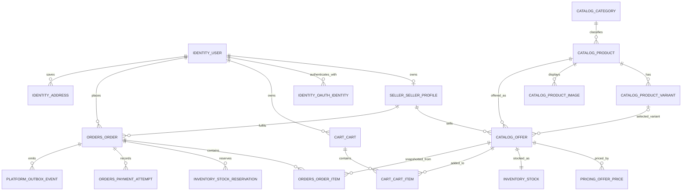

# Phase 1 Data Model and ERD

**Status:** Draft  
**Source of truth:** [BRD v1.1](../requirements/BRD.md), [architecture overview](../../architecture-overview.md), and Phase 1 user stories.  
**Scope:** Logical data design for V1. It defines ownership and constraints; physical indexes and migration order follow in the database-migration design.

---

## 1. Modelling conventions

- PostgreSQL 18+ is required. Every application-generated entity and event identifier uses a UUIDv7 generated by PostgreSQL with `DEFAULT uuidv7()`. UUIDv7 is time-ordered, but `created_at TIMESTAMPTZ` remains the authoritative audit timestamp.
- MongoDB document `_id` values use UUIDv7 in standard UUID binary representation; do not use `ObjectId` for domain/audit documents. Composite and natural keys remain where noted.
- All mutable domain tables include `created_at TIMESTAMPTZ` and `updated_at TIMESTAMPTZ`.
- Money is `NUMERIC(19,4)` plus an ISO 4217 `CHAR(3)` currency code. Application/API values are decimal strings; JavaScript `number` is never used for money.
- Module tables use singular, snake-case names and qualified references (for example, `catalog.offer`). No domain table is created in `public`.
- A module is the only writer to its schema. Cross-schema foreign keys are limited to essential transactional references and are listed below; non-transactional integration uses Kafka events.
- Soft deletion is used only where history must remain visible. Catalog offers are status-driven; orders and audit records are immutable.
- Every event-producing transaction writes `platform.outbox_event` in the same PostgreSQL transaction.

## 2. PostgreSQL schema map

| Schema | Tables | Purpose |
|---|---|---|
| `identity` | `user`, `oauth_identity`, `refresh_session`, `address` | Accounts, reusable buyer addresses, login identities, and refresh-token rotation. |
| `catalog` | `category`, `product`, `product_variant`, `product_image`, `offer` | Buyer-visible product catalogue and seller offers. |
| `pricing` | `currency`, `offer_price`, `fx_rate` | Multi-currency price rows and display-only FX cache. |
| `inventory` | `stock`, `stock_reservation` | Available stock and checkout reservations. |
| `cart` | `cart`, `cart_item` | Server-side authenticated carts. Guest carts remain in browser local storage. |
| `orders` | `order`, `order_item`, `payment_attempt`, `idempotency_key` | Checkout records, immutable snapshots, and retry safety. |
| `seller` | `seller_profile`, `kyc_application` | Seller identity and KYC lifecycle. |
| `admin` | `moderation_case` | Listing moderation decisions. |
| `notifications` | `in_app_notification` | Buyer/seller/admin notification read model. |
| `platform` | `outbox_event`, `processed_event` | Event relay and consumer idempotency. |

## 3. Core relationship diagram

The diagram deliberately omits audit, notification, refresh-session, and event-consumer implementation links to keep product-to-order ownership readable.

## 4. Schema-level table design

### `identity`

#### `identity.user`

| Column | Type | Constraints / purpose |
|---|---|---|
| `id` | `UUID` | PK; `DEFAULT uuidv7()` |
| `email` | `TEXT` | Required; unique index on `LOWER(email)` |
| `full_name` | `TEXT` | Required |
| `role` | `user_role` | Required: `CONSUMER`, `SELLER`, or `ADMIN` |
| `buyer_account_type` | `buyer_account_type` | Required: `B2C` or `B2B`; a B2B buyer remains `role=CONSUMER` |
| `password_hash` | `TEXT` | Nullable for OAuth-only accounts; never plaintext |
| `status` | `user_status` | Required account lifecycle state |
| `created_at`, `updated_at` | `TIMESTAMPTZ` | Required audit timestamps |

#### `identity.oauth_identity`

| Column | Type | Constraints / purpose |
|---|---|---|
| `id` | `UUID` | PK; `DEFAULT uuidv7()` |
| `user_id` | `UUID` | Required FK → `identity.user(id)` |
| `provider` | `oauth_provider` | Required: `GOOGLE` or `FACEBOOK` |
| `provider_subject` | `TEXT` | Required provider-issued identifier; unique with `provider` |
| `verified_email` | `TEXT` | Verified email returned by the provider |
| `created_at`, `updated_at` | `TIMESTAMPTZ` | Required audit timestamps |

Unique constraint: `(provider, provider_subject)`.

#### `identity.refresh_session`

| Column | Type | Constraints / purpose |
|---|---|---|
| `id` | `UUID` | PK; `DEFAULT uuidv7()` |
| `user_id` | `UUID` | Required FK → `identity.user(id)` |
| `token_hash` | `TEXT` | Required; store only a hash of the refresh token |
| `expires_at` | `TIMESTAMPTZ` | Required |
| `revoked_at`, `replaced_at` | `TIMESTAMPTZ` | Nullable refresh-token rotation/revocation state |
| `device_metadata` | `JSONB` | Nullable client/device context |
| `created_at`, `updated_at` | `TIMESTAMPTZ` | Required audit timestamps |

#### `identity.address`

| Column | Type | Constraints / purpose |
|---|---|---|
| `id` | `UUID` | PK; `DEFAULT uuidv7()` |
| `user_id` | `UUID` | Required FK → `identity.user(id)` |
| `label` | `TEXT` | Nullable buyer label, for example `Home` or `Office` |
| `recipient_name` | `TEXT` | Required |
| `address_line_1`, `address_line_2` | `TEXT` | First line required; second line nullable |
| `city`, `state_region`, `postal_code` | `TEXT` | Required location fields except state/region when country validation permits it |
| `country_code` | `CHAR(2)` | Required allowed delivery country |
| `is_default` | `BOOLEAN` | Required, default `false` |
| `created_at`, `updated_at` | `TIMESTAMPTZ` | Required audit timestamps |

Identity owns the reusable buyer address book. A buyer can query and select a saved address for a later checkout.

### `catalog`

#### `catalog.category`

| Column | Type | Constraints / purpose |
|---|---|---|
| `id` | `UUID` | PK; `DEFAULT uuidv7()` |
| `parent_id` | `UUID` | Nullable self-FK → `catalog.category(id)` |
| `name` | `TEXT` | Required display name |
| `slug` | `TEXT` | Required URL-safe name; unique among siblings |
| `is_prohibited` | `BOOLEAN` | Required, default `false`; flags blocked taxonomy branches |
| `created_at`, `updated_at` | `TIMESTAMPTZ` | Required audit timestamps |

#### `catalog.product`

| Column | Type | Constraints / purpose |
|---|---|---|
| `id` | `UUID` | PK; `DEFAULT uuidv7()` |
| `category_id` | `UUID` | Required FK → `catalog.category(id)` |
| `title`, `description`, `brand` | `TEXT` | Buyer-visible catalog attributes; `title` required |
| `status` | `product_status` | Required catalog lifecycle state |
| `source_reference` | `TEXT` | Nullable seed-dataset traceability |
| `created_at`, `updated_at` | `TIMESTAMPTZ` | Required audit timestamps |

`catalog.product` has no price and no seller owner.

#### `catalog.product_variant`

| Column | Type | Constraints / purpose |
|---|---|---|
| `id` | `UUID` | PK; `DEFAULT uuidv7()` |
| `product_id` | `UUID` | Required FK → `catalog.product(id)` |
| `sku` | `TEXT` | Required; unique with `product_id` |
| `attributes` | `JSONB` | Required normalized buyer-facing attributes, such as colour and size |
| `created_at`, `updated_at` | `TIMESTAMPTZ` | Required audit timestamps |

#### `catalog.product_image`

| Column | Type | Constraints / purpose |
|---|---|---|
| `id` | `UUID` | PK; `DEFAULT uuidv7()` |
| `product_id` | `UUID` | Required FK → `catalog.product(id)` |
| `storage_key` | `TEXT` | Required object-storage key or URL |
| `alt_text` | `TEXT` | Nullable accessibility text |
| `position` | `SMALLINT` | Required display order; unique with `product_id` |
| `created_at`, `updated_at` | `TIMESTAMPTZ` | Required audit timestamps |

#### `catalog.offer`

| Column | Type | Constraints / purpose |
|---|---|---|
| `id` | `UUID` | PK; `DEFAULT uuidv7()` |
| `seller_id` | `UUID` | Required FK → `seller.seller_profile(id)` |
| `product_id` | `UUID` | Required FK → `catalog.product(id)` |
| `variant_id` | `UUID` | Nullable FK → `catalog.product_variant(id)` when a product has variants |
| `status` | `offer_status` | Required: `DRAFT`, `ACTIVE`, `INACTIVE`, or `REMOVED` |
| `created_at`, `updated_at` | `TIMESTAMPTZ` | Required audit timestamps |

An offer is the seller-scoped listing and the only product reference used by carts and order items.

`offer.variant_id`, when present, must belong to `offer.product_id`; enforce this in the application transaction and a composite database constraint/index introduced in the physical migration design.

### `pricing`

#### `pricing.currency`

| Column | Type | Constraints / purpose |
|---|---|---|
| `code` | `CHAR(3)` | PK; ISO 4217 code |
| `minor_unit_scale` | `SMALLINT` | Required display scale |
| `is_seller_price_allowed` | `BOOLEAN` | Required; V1 true only for `USD`, `THB`, `JPY`, and `SGD` |

#### `pricing.offer_price`

| Column | Type | Constraints / purpose |
|---|---|---|
| `id` | `UUID` | PK; `DEFAULT uuidv7()` |
| `offer_id` | `UUID` | Required FK → `catalog.offer(id)` |
| `currency_code` | `CHAR(3)` | Required FK → `pricing.currency(code)` |
| `amount` | `NUMERIC(19,4)` | Required; `CHECK (amount >= 0)` |
| `price_type` | `price_type` | Required: `LIST`, `SALE`, or `B2B_TIER` |
| `min_qty` | `INT` | Required, default `1`; `B2B_TIER` requires value `> 1` |
| `starts_at`, `ends_at` | `TIMESTAMPTZ` | Required bounded valid interval for `SALE`; null for other price types |
| `created_at`, `updated_at` | `TIMESTAMPTZ` | Required audit timestamps |

Unique constraint: `(offer_id, currency_code, price_type, min_qty)`.

The V1 `SALE` row already supports a seller's time-bounded, no-code discount. Coupon-code promotions are a future-phase capability defined below and are not part of the V1 migration.

#### `pricing.fx_rate`

| Column | Type | Constraints / purpose |
|---|---|---|
| `base_currency_code` | `CHAR(3)` | PK component; FK → `pricing.currency(code)` |
| `quote_currency_code` | `CHAR(3)` | PK component; FK → `pricing.currency(code)` |
| `rate` | `NUMERIC(19,8)` | Required positive cached exchange rate |
| `as_of` | `TIMESTAMPTZ` | Required source timestamp |
| `updated_at` | `TIMESTAMPTZ` | Required cache refresh timestamp |

Primary key: `(base_currency_code, quote_currency_code)`. This table is display-only and never reprices an order.

### `inventory`

#### `inventory.stock`

| Column | Type | Constraints / purpose |
|---|---|---|
| `offer_id` | `UUID` | PK and FK → `catalog.offer(id)` |
| `on_hand_qty` | `INT` | Required; `CHECK (on_hand_qty >= 0)` |
| `reserved_qty` | `INT` | Required; `CHECK (reserved_qty >= 0 AND reserved_qty <= on_hand_qty)` |
| `version` | `BIGINT` | Required optimistic-lock counter |
| `created_at`, `updated_at` | `TIMESTAMPTZ` | Required audit timestamps |

Available quantity is `on_hand_qty - reserved_qty`.

#### `inventory.stock_reservation`

| Column | Type | Constraints / purpose |
|---|---|---|
| `id` | `UUID` | PK; `DEFAULT uuidv7()` |
| `offer_id` | `UUID` | Required FK → `inventory.stock(offer_id)` |
| `order_id` | `UUID` | Required FK → `orders.order(id)` |
| `quantity` | `INT` | Required; `CHECK (quantity > 0)` |
| `status` | `reservation_status` | Required: `ACTIVE`, `CONSUMED`, `RELEASED`, or `EXPIRED` |
| `expires_at` | `TIMESTAMPTZ` | Required; active reservations expire after 15 minutes |
| `created_at`, `updated_at` | `TIMESTAMPTZ` | Required audit timestamps |

### `cart`

#### `cart.cart`

| Column | Type | Constraints / purpose |
|---|---|---|
| `id` | `UUID` | PK; `DEFAULT uuidv7()` |
| `user_id` | `UUID` | Required FK → `identity.user(id)`; unique for one authenticated cart per user |
| `created_at`, `updated_at` | `TIMESTAMPTZ` | Required audit timestamps |

#### `cart.cart_item`

| Column | Type | Constraints / purpose |
|---|---|---|
| `id` | `UUID` | PK; `DEFAULT uuidv7()` |
| `cart_id` | `UUID` | Required FK → `cart.cart(id)` |
| `offer_id` | `UUID` | Required FK → `catalog.offer(id)` |
| `quantity` | `INT` | Required; `CHECK (quantity > 0)` |
| `created_at`, `updated_at` | `TIMESTAMPTZ` | Required audit timestamps |

Unique constraint: `(cart_id, offer_id)`. No price is persisted; the server alone recalculates the effective price during checkout. Client-supplied prices, discounts, totals, and FX values are ignored.

### `orders`

#### `orders.order`

| Column | Type | Constraints / purpose |
|---|---|---|
| `id` | `UUID` | PK; `DEFAULT uuidv7()` |
| `display_id` | `TEXT` | Required; `UNIQUE`; format `ORD-<first 8 uppercase hex chars of id>` (e.g. `ORD-3F2A1B9C`); generated at insert time |
| `buyer_id` | `UUID` | Required FK → `identity.user(id)` |
| `seller_id` | `UUID` | Required FK → `seller.seller_profile(id)` |
| `currency_code` | `CHAR(3)` | Required FK → `pricing.currency(code)` |
| `status` | `order_status` | Required: `PENDING`, `SHIPPED`, `DELIVERED`, or `REFUNDED` |
| `shipping_address_snapshot` | `JSONB` | Required immutable address copy captured at checkout |
| `shipping_method` | `TEXT` | Required fake-shipping service identifier |
| `shipping_cost`, `tax_total`, `total_amount` | `NUMERIC(19,4)` | Required order-level monetary snapshots |
| `tracking_number` | `TEXT` | Required generated mock tracking number |
| `estimated_delivery_at` | `TIMESTAMPTZ` | Required mock ETA |
| `placed_at` | `TIMESTAMPTZ` | Required order creation time |
| `created_at`, `updated_at` | `TIMESTAMPTZ` | Required audit timestamps |

Checkout creates one order per seller and currency.

#### `orders.order_item`

| Column | Type | Constraints / purpose |
|---|---|---|
| `id` | `UUID` | PK; `DEFAULT uuidv7()` |
| `order_id` | `UUID` | Required FK → `orders.order(id)` |
| `offer_id` | `UUID` | Required FK → `catalog.offer(id)`; identifies source offer, not price source |
| `product_title_snapshot`, `variant_label_snapshot` | `TEXT` | Required product title; variant label nullable |
| `quantity` | `INT` | Required; `CHECK (quantity > 0)` |
| `unit_price` | `NUMERIC(19,4)` | Required immutable captured unit price |
| `currency_code` | `CHAR(3)` | Required captured ISO 4217 code |
| `tax` | `NUMERIC(19,4)` | Required captured line tax |
| `fx_rate_used_at_capture` | `NUMERIC(19,8)` | Nullable; only when display conversion informs capture |
| `created_at` | `TIMESTAMPTZ` | Required snapshot creation time; no `updated_at` |

#### `orders.payment_attempt`

| Column | Type | Constraints / purpose |
|---|---|---|
| `id` | `UUID` | PK; `DEFAULT uuidv7()` |
| `order_id` | `UUID` | Required FK → `orders.order(id)` |
| `provider`, `method` | `TEXT` | Required fake-payment identifiers |
| `status` | `payment_status` | Required simulated payment result |
| `masked_payment_detail` | `TEXT` | Required safe display detail; never PAN or CVV |
| `amount` | `NUMERIC(19,4)` | Required captured payment amount |
| `currency_code` | `CHAR(3)` | Required captured payment currency |
| `idempotency_key_id` | `UUID` | Nullable FK → `orders.idempotency_key(id)` |
| `created_at` | `TIMESTAMPTZ` | Required; attempts are append-only |

#### `orders.idempotency_key`

| Column | Type | Constraints / purpose |
|---|---|---|
| `id` | `UUID` | PK; `DEFAULT uuidv7()` |
| `buyer_id` | `UUID` | Required FK → `identity.user(id)` |
| `key` | `TEXT` | Required client-supplied idempotency key |
| `request_hash` | `TEXT` | Required; rejects reuse with a different request body |
| `order_id` | `UUID` | Nullable while processing, then FK → `orders.order(id)` |
| `expires_at` | `TIMESTAMPTZ` | Required retention limit |
| `created_at` | `TIMESTAMPTZ` | Required |

Unique constraint: `(buyer_id, key)`. Replaying a completed key returns its original order.

At checkout, the buyer may select an `identity.address` record. The checkout service reads it through the Identity application interface and copies it into `order.shipping_address_snapshot`; it does not retain a foreign key to the mutable address. Historical orders are therefore not changed when a buyer updates or deletes a saved address. All order money columns are snapshots and never recalculated from `pricing.offer_price` or live FX rates.

### `seller` and `admin`

#### `seller.seller_profile`

| Column | Type | Constraints / purpose |
|---|---|---|
| `id` | `UUID` | PK; `DEFAULT uuidv7()` |
| `user_id` | `UUID` | Required FK → `identity.user(id)`; unique |
| `business_name` | `TEXT` | Required |
| `tax_id` | `TEXT` | Required; access-restricted sensitive business data |
| `status` | `seller_status` | Required: `PENDING_KYC`, `APPROVED`, `REJECTED`, or `SUSPENDED` |
| `created_at`, `updated_at` | `TIMESTAMPTZ` | Required audit timestamps |

#### `seller.kyc_application`

| Column | Type | Constraints / purpose |
|---|---|---|
| `id` | `UUID` | PK; `DEFAULT uuidv7()` |
| `seller_id` | `UUID` | Required FK → `seller.seller_profile(id)` |
| `submitted_data` | `JSONB` | Required submitted business/tax data; access-restricted |
| `document_references` | `JSONB` | Required encrypted-object-storage references; never document content |
| `status` | `kyc_status` | Required application lifecycle state |
| `reviewer_user_id` | `UUID` | Nullable FK → `identity.user(id)` until reviewed |
| `decision_reason` | `TEXT` | Nullable until a decision is made |
| `submitted_at`, `decided_at` | `TIMESTAMPTZ` | Submission required; decision nullable |
| `created_at`, `updated_at` | `TIMESTAMPTZ` | Required audit timestamps |

#### `admin.moderation_case`

| Column | Type | Constraints / purpose |
|---|---|---|
| `id` | `UUID` | PK; `DEFAULT uuidv7()` |
| `offer_id` | `UUID` | Required FK → `catalog.offer(id)` |
| `reason`, `source` | `TEXT` | Required reason and detection/report source |
| `status` | `moderation_status` | Required case lifecycle state |
| `decision` | `moderation_decision` | Nullable until resolved |
| `decided_by_user_id` | `UUID` | Nullable FK → `identity.user(id)` until resolved |
| `created_at`, `decided_at`, `updated_at` | `TIMESTAMPTZ` | Required creation/update; decision nullable |

A removal changes offer status and emits a moderation event.

### `notifications` and `platform`

#### `notifications.in_app_notification`

| Column | Type | Constraints / purpose |
|---|---|---|
| `id` | `UUID` | PK; `DEFAULT uuidv7()` |
| `recipient_user_id` | `UUID` | Required FK → `identity.user(id)` |
| `type` | `TEXT` | Required notification type |
| `payload` | `JSONB` | Required safe display payload |
| `source_event_id` | `UUID` | Required idempotency source; unique |
| `read_at` | `TIMESTAMPTZ` | Nullable |
| `created_at` | `TIMESTAMPTZ` | Required |

#### `platform.outbox_event`

| Column | Type | Constraints / purpose |
|---|---|---|
| `id` | `UUID` | PK and event ID; `DEFAULT uuidv7()` |
| `aggregate_type`, `aggregate_id` | `TEXT`, `UUID` | Required origin aggregate reference |
| `topic` | `TEXT` | Required Kafka destination topic |
| `event_type`, `event_version` | `TEXT`, `INT` | Required versioned event identity |
| `payload` | `JSONB` | Required source payload for Avro serialization |
| `correlation_id` | `UUID` | Required request/workflow correlation ID; UUIDv7 |
| `occurred_at` | `TIMESTAMPTZ` | Required domain event time |
| `publication_status`, `attempt_count`, `published_at` | status, `INT`, `TIMESTAMPTZ` | Relay delivery state; published time nullable |
| `created_at`, `updated_at` | `TIMESTAMPTZ` | Required audit timestamps |

Inserted in the same transaction as the originating state change.

#### `platform.processed_event`

| Column | Type | Constraints / purpose |
|---|---|---|
| `consumer_group` | `TEXT` | PK component; Kafka consumer identity |
| `event_id` | `UUID` | PK component; UUIDv7 event ID |
| `processed_at` | `TIMESTAMPTZ` | Required successful-processing time |
| `outcome` | `TEXT` | Required idempotent processing result |

## 5. Essential cross-schema references

These are allowed in V1 because they preserve a single transactional invariant. They are migration dependencies and must be documented in the owning module's migration.

| Referencing table | Referenced table | Why it is essential |
|---|---|---|
| `catalog.offer` | `seller.seller_profile` | An offer cannot exist without its selling profile. |
| `pricing.offer_price`, `inventory.stock`, `cart.cart_item`, `orders.order_item` | `catalog.offer` | Price, stock, cart, and order items must identify the precise seller offer. |
| `orders.order` | `seller.seller_profile`, `identity.user`, `pricing.currency` | The order requires immutable buyer, seller, and currency accountability. |
| `inventory.stock_reservation` | `orders.order` | Reservation release/consumption must be tied to one checkout order. |
| `platform.outbox_event` | no foreign key to aggregate | Allows a single generic outbox table and avoids coupling every aggregate migration to Platform. Aggregate identity is validated by its originating transaction. |

When a module is extracted later, its schema migrates with it and its service becomes the sole writer. Existing consumers replace cross-schema reads with an API call or a Kafka projection before the foreign-key dependency is removed.

## 6. MongoDB collections

MongoDB is event-fed, append-oriented storage; it is not an order, catalog, or inventory source of truth.

| Collection | Core fields | Indexes / retention |
|---|---|---|
| `activity_events` | `_id` UUIDv7, `event_id` UUIDv7, `correlation_id` UUIDv7, actor, event type, aggregate type/id, occurred-at, metadata | Unique `event_id`; indexes on aggregate and occurred-at; retention policy defined before implementation. |
| `audit_logs` | `_id` UUIDv7, `event_id` UUIDv7, actor, action, entity before/after metadata, request/correlation ID, occurred-at | Unique `event_id`; append-only; indexes on entity, actor, and occurred-at. |

Kafka consumers write these documents idempotently using the event ID. Sensitive data is redacted before persistence; password hashes, refresh-token hashes, payment details, and KYC document content are never copied into activity metadata.

## 7. Critical transactional rules

1. A catalog, price, inventory, KYC, moderation, or order state change commits its domain rows and outbox event together.
2. Checkout locks/updates inventory using the stock `version` (or equivalent row lock), creates orders and immutable item snapshots, records reservations/payment simulation, and inserts `order.placed` in one transaction.
3. An order confirmation is returned after that transaction commits; it never waits for Kafka, Elasticsearch, email, or MongoDB consumers.
4. Search documents are rebuilt from catalog/offer/inventory events. They are a read model and may lag the PostgreSQL source of truth by up to the defined NFR target.
5. The order service rechecks offer status, effective price, availability, and idempotency inside the checkout transaction; cart data alone is never trusted as a price or stock reservation.

## 8. Future-phase seller promotions

Seller-managed promotions are explicitly deferred from Phase 1. When approved, they belong in a dedicated `promotion` module and PostgreSQL schema rather than being added as more columns to `pricing.offer_price`. This keeps the V1 effective-price model simple while allowing future code-based and scheduled campaigns.

### `promotion.promotion`

| Column | Type | Constraints / purpose |
|---|---|---|
| `id` | `UUID` | PK; `DEFAULT uuidv7()` |
| `seller_id` | `UUID` | Required FK → `seller.seller_profile(id)` |
| `name` | `TEXT` | Required seller-facing campaign name |
| `status` | `promotion_status` | Required: `DRAFT`, `SCHEDULED`, `ACTIVE`, `PAUSED`, `EXPIRED`, or `CANCELLED` |
| `promotion_type` | `promotion_type` | Required: `AUTOMATIC` or `CODE` |
| `discount_type` | `discount_type` | Required: `PERCENTAGE`, `FIXED_AMOUNT`, or `FIXED_PRICE` |
| `discount_value` | `NUMERIC(19,4)` | Required non-negative value; percentage is limited to `0 < value <= 100` |
| `currency_code` | `CHAR(3)` | Required for fixed amount/price; null for percentage |
| `starts_at`, `ends_at` | `TIMESTAMPTZ` | Required valid campaign period; `starts_at < ends_at` |
| `stacking_policy`, `priority` | enum, `SMALLINT` | Required conflict-resolution rule and seller-defined ordering |
| `created_at`, `updated_at` | `TIMESTAMPTZ` | Required audit timestamps |

### `promotion.promotion_offer`

| Column | Type | Constraints / purpose |
|---|---|---|
| `promotion_id` | `UUID` | PK component; FK → `promotion.promotion(id)` |
| `offer_id` | `UUID` | PK component; FK → `catalog.offer(id)` |
| `created_at` | `TIMESTAMPTZ` | Required |

The application must enforce that every attached offer belongs to the promotion's seller. A seller cannot promote another seller's offer.

### `promotion.promotion_code`

| Column | Type | Constraints / purpose |
|---|---|---|
| `id` | `UUID` | PK; `DEFAULT uuidv7()` |
| `promotion_id` | `UUID` | Required FK → `promotion.promotion(id)`; requires `promotion_type=CODE` |
| `code_normalized` | `TEXT` | Required case-normalized buyer-entered code; globally unique |
| `max_redemptions`, `max_redemptions_per_buyer` | `INT` | Nullable positive limits; null means no limit |
| `redemption_count` | `INT` | Required, default `0`; updated transactionally |
| `created_at`, `updated_at` | `TIMESTAMPTZ` | Required audit timestamps |

### `orders.order_promotion_redemption` (future migration)

| Column | Type | Constraints / purpose |
|---|---|---|
| `id` | `UUID` | PK; `DEFAULT uuidv7()` |
| `order_id` | `UUID` | Required FK → `orders.order(id)` |
| `promotion_id`, `promotion_code_id` | `UUID` | Required promotion FK; code FK nullable for automatic promotions |
| `promotion_name_snapshot`, `code_snapshot` | `TEXT` | Required campaign name; code nullable for automatic promotions |
| `discount_amount` | `NUMERIC(19,4)` | Required immutable captured discount |
| `currency_code` | `CHAR(3)` | Required captured ISO 4217 code |
| `created_at` | `TIMESTAMPTZ` | Required; append-only |

### Future checkout rules

1. At checkout, validate promotion status, time window, seller ownership, offer eligibility, code limits, and stacking policy inside the order transaction.
2. Lock/update the code redemption count atomically with the order, promotion-redemption snapshot, and outbox event. Idempotent retries must not redeem twice.
3. Snapshot the applied promotion and discount on the order. Historical orders never recalculate a promotion from the current campaign configuration.
4. Publish promotion lifecycle and redemption events through the existing outbox/Kafka pattern; reindex changed effective-price fields asynchronously for search.

## 9. Follow-on design decisions

1. Define physical SQL migrations, enum strategy, indexing, and row-lock/optimistic-lock approach.
2. Define the OpenAPI schemas for these transport DTOs, pagination, errors, JWT security, and idempotency headers.
3. Define Avro records and topic ownership for each outbox event.
4. Decide object storage and encryption/retention rules for KYC documents and product images.
