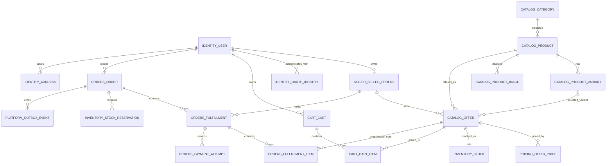

# Phase 1 Data Model and ERD

**Status:** Draft  
**Source of truth:** [BRD v1.1](../requirements/BRD.md), [architecture overview](../../architecture-overview.md), and Phase 1 user stories.  
**Scope:** Logical data design for V1. It defines ownership and constraints; physical indexes and migration order follow in the database-migration design.

---

**Last reviewed:** 2026-08-29 (updated to align with api-design.md, auth-jwt-design.md, and implementation-specs.md)

## Summary

- [1. Modelling conventions](#modelling-conventions)
- [2. PostgreSQL schema map](#postgresql-schema-map)
- [3. Core relationship diagram](#core-relationship-diagram)
- [4. PostgreSQL custom enum types](#postgresql-enum-types)
- [5. Schema-level table design](#schema-level-table-design)
- [6. Essential cross-schema references](#essential-cross-schema-references)
- [7. Critical transactional rules](#critical-transactional-rules)
- [8. Future-phase seller promotions](#future-phase-seller-promotions)

## 1. Modelling conventions

- PostgreSQL 16+ is required. Every application-generated entity and event identifier uses a UUIDv7 generated by PostgreSQL with `DEFAULT uuidv7()`. UUIDv7 is time-ordered, but `created_at TIMESTAMPTZ` remains the authoritative audit timestamp.
- MongoDB document `_id` values use UUIDv7 in standard UUID binary representation; do not use `ObjectId` for domain/audit documents. Composite and natural keys remain where noted.
- All mutable domain tables include `created_at TIMESTAMPTZ` and `updated_at TIMESTAMPTZ`.
- Money is `NUMERIC(19,4)` plus an ISO 4217 `CHAR(3)` currency code. Application/API values are decimal strings; JavaScript `number` is never used for money.
- Module tables use singular, snake-case names and qualified references (for example, `catalog.offer`). No domain table is created in `public`.
- A module is the only writer to its schema. Cross-schema foreign keys are limited to essential transactional references and are listed below; non-transactional integration uses Kafka events.
- Soft deletion is used only where history must remain visible. Catalog offers are status-driven; orders and audit records are immutable.
- Every event-producing transaction writes `platform.outbox_event` in the same PostgreSQL transaction.
- **V1 scope marker:** tables and columns marked `[V1]` are in scope for Phase 1. Items marked `[FUTURE]` are documented for context but must not be implemented until scope is approved.

## 2. PostgreSQL schema map

| Schema | Tables | Purpose |
|---|---|---|
| `identity` | `user`, `oauth_identity`, `refresh_session`, `address`, `email_verification_token`, `password_reset_token` | Accounts, reusable buyer addresses, login identities, refresh-token rotation, and single-use credential tokens. |
| `catalog` | `category`, `product`, `product_variant`, `product_image`, `offer` | Buyer-visible product catalogue and seller offers. |
| `pricing` | `currency`, `offer_price`, `fx_rate` | Multi-currency price rows and display-only FX cache. |
| `inventory` | `stock`, `stock_reservation` | Available stock and checkout reservations. |
| `cart` | `cart`, `cart_item` | Server-side authenticated carts. Guest carts remain in browser local storage. |
| `orders` | `order`, `fulfillment`, `fulfillment_item`, `payment_attempt`, `idempotency_key` | Checkout records, per-seller fulfillment groups, immutable line-item snapshots, and retry safety. |
| `seller` | `seller_profile`, `kyc_application` | Seller identity and KYC lifecycle. |
| `admin` | `moderation_case` | Listing moderation decisions. |
| `notifications` | `in_app_notification`, `email_template`, `pending_listing_removal_digest` | Buyer/seller/admin notification read model, email template store, and staging table for daily listing-removal digest. |
| `platform` | `outbox_event`, `processed_event` | Event relay and consumer idempotency. |

## 3. Core relationship diagram

The diagram deliberately omits audit, notification, refresh-session, and event-consumer implementation links to keep product-to-order ownership readable.

## 4. PostgreSQL custom enum types

All application enums are defined as PostgreSQL custom types before any schema migration runs. Named here so every column definition can reference the correct type.

| Type name | Schema | Values |
|---|---|---|
| `account_type` | `identity` | `B2C`, `B2B` |
| `user_status` | `identity` | `ACTIVE`, `SUSPENDED`, `BANNED` |
| `oauth_provider` | `identity` | `GOOGLE`, `FACEBOOK` |
| `product_status` | `catalog` | `ACTIVE`, `REMOVED` |
| `offer_status` | `catalog` | `DRAFT`, `ACTIVE`, `INACTIVE`, `REMOVED`, `FLAGGED` |
| `price_type` | `pricing` | `LIST`, `SALE`, `B2B_TIER` |
| `reservation_status` | `inventory` | `ACTIVE`, `CONSUMED`, `RELEASED`, `EXPIRED` |
| `placement_outcome` | `orders` | `FULLY_PLACED`, `PARTIALLY_PLACED` |
| `fulfillment_status` | `orders` | `PENDING`, `SHIPPED`, `DELIVERED`, `REFUNDED`, `CANCELLED` |
| `payment_status` | `orders` | `SIMULATED_SUCCESS`, `SIMULATED_FAILURE` |
| `seller_kyc_status` | `seller` | `PENDING_KYC`, `APPROVED`, `REJECTED` |
| `seller_suspension_status` | `seller` | `ACTIVE`, `SUSPENDED` |
| `kyc_status` | `seller` | `PENDING`, `UNDER_REVIEW`, `APPROVED`, `REJECTED` |
| `moderation_status` | `admin` | `OPEN`, `RESOLVED` |
| `moderation_decision` | `admin` | `REMOVE`, `DISMISS` |
| `outbox_publication_status` | `platform` | `PENDING`, `PUBLISHED`, `FAILED` |

## 5. Schema-level table design

### `identity`

#### `identity.user` [V1]

| Column | Type | Constraints / purpose |
|---|---|---|
| `id` | `UUID` | PK; `DEFAULT uuidv7()` |
| `email` | `TEXT` | Required; unique index on `LOWER(email)` |
| `full_name` | `TEXT` | Required |
| `roles` | `TEXT[]` | Required array; values `BUYER`, `SELLER`, `ADMIN`. One user may hold `BUYER` + `SELLER` simultaneously; `ADMIN` is never co-held with others. Default: `ARRAY['BUYER']`. |
| `email_verified` | `BOOLEAN` | Required, default `false`. OAuth logins set to `true` immediately. |
| `account_type` | `account_type` | Required: `B2C` or `B2B`; orthogonal to roles. |
| `password_hash` | `TEXT` | Nullable for OAuth-only accounts; argon2id hash; never plaintext. |
| `status` | `user_status` | Required: `ACTIVE`, `SUSPENDED`, `BANNED`. |
| `preferred_currency` | `CHAR(3)` | Nullable FK → `pricing.currency(code)`; display preference only. |
| `business_name` | `VARCHAR(120)` | Nullable; B2B buyer only (`account_type = B2B`). Max 120 chars. |
| `business_logo_storage_key` | `TEXT` | Nullable; B2B buyer only. Object storage key for uploaded business logo; URL derived at serve time. |
| `created_at`, `updated_at` | `TIMESTAMPTZ` | Required audit timestamps |

**Note on roles change (2026-08-29):** The original ERD used a single `role` column (`user_role` enum: `CONSUMER`, `SELLER`, `ADMIN`). This has been corrected to `roles TEXT[]` to support the multi-role requirement (BUYER + SELLER simultaneously). The value `CONSUMER` is renamed to `BUYER` throughout to match implementation-specs terminology.

#### `identity.oauth_identity`

| Column | Type | Constraints / purpose |
|---|---|---|
| `id` | `UUID` | PK; `DEFAULT uuidv7()` |
| `user_id` | `UUID` | Required FK → `identity.user(id)` |
| `provider` | `oauth_provider` | Required: `GOOGLE` or `FACEBOOK` |
| `provider_subject` | `TEXT` | Required provider-issued identifier; unique with `provider` |
| `verified_email` | `TEXT` | Verified email returned by the provider |
| `created_at`, `updated_at` | `TIMESTAMPTZ` | Required audit timestamps |

Unique constraint: `(provider, provider_subject)`.

#### `identity.refresh_session`

| Column | Type | Constraints / purpose |
|---|---|---|
| `id` | `UUID` | PK; `DEFAULT uuidv7()` |
| `user_id` | `UUID` | Required FK → `identity.user(id)` |
| `token_hash` | `TEXT` | Required; store only a hash of the refresh token |
| `expires_at` | `TIMESTAMPTZ` | Required |
| `revoked_at`, `replaced_at` | `TIMESTAMPTZ` | Nullable refresh-token rotation/revocation state |
| `device_metadata` | `JSONB` | Nullable client/device context |
| `created_at`, `updated_at` | `TIMESTAMPTZ` | Required audit timestamps |

#### `identity.address`

| Column | Type | Constraints / purpose |
|---|---|---|
| `id` | `UUID` | PK; `DEFAULT uuidv7()` |
| `user_id` | `UUID` | Required FK → `identity.user(id)` |
| `label` | `TEXT` | Nullable buyer label, for example `Home` or `Office` |
| `recipient_name` | `TEXT` | Required |
| `address_line_1`, `address_line_2` | `TEXT` | First line required; second line nullable |
| `city`, `state_region`, `postal_code` | `TEXT` | Required location fields except state/region when country validation permits it |
| `country_code` | `CHAR(2)` | Required allowed delivery country |
| `is_default` | `BOOLEAN` | Required, default `false` |
| `created_at`, `updated_at` | `TIMESTAMPTZ` | Required audit timestamps |

Identity owns the reusable buyer address book. A buyer can query and select a saved address for a later checkout.

#### `identity.email_verification_token` [V1]

| Column | Type | Constraints / purpose |
|---|---|---|
| `id` | `UUID` | PK; `DEFAULT uuidv7()` |
| `user_id` | `UUID` | Required FK → `identity.user(id)`; unique (one active token per user) |
| `token_hash` | `TEXT` | Required SHA-256 of the raw token; raw token is never stored |
| `expires_at` | `TIMESTAMPTZ` | Required; TTL 24 hours from creation |
| `created_at` | `TIMESTAMPTZ` | Required |

One active token per user enforced by unique index on `user_id`. Insert-on-create replaces the previous token.

#### `identity.password_reset_token` [V1]

| Column | Type | Constraints / purpose |
|---|---|---|
| `id` | `UUID` | PK; `DEFAULT uuidv7()` |
| `user_id` | `UUID` | Required FK → `identity.user(id)` |
| `token_hash` | `TEXT` | Required SHA-256 of the raw token |
| `expires_at` | `TIMESTAMPTZ` | Required; TTL 60 minutes from creation |
| `used_at` | `TIMESTAMPTZ` | Nullable; set on successful use; used tokens are rejected |
| `created_at` | `TIMESTAMPTZ` | Required |

### `catalog`

#### `catalog.category` [V1]

| Column | Type | Constraints / purpose |
|---|---|---|
| `id` | `UUID` | PK; `DEFAULT uuidv7()` |
| `parent_id` | `UUID` | Nullable self-FK → `catalog.category(id)` |
| `name` | `TEXT` | Required display name |
| `slug` | `TEXT` | Required URL-safe name; unique among siblings |
| `is_prohibited` | `BOOLEAN` | Required, default `false`; flags blocked taxonomy branches |
| `created_at`, `updated_at` | `TIMESTAMPTZ` | Required audit timestamps |

#### `catalog.product`

| Column | Type | Constraints / purpose |
|---|---|---|
| `id` | `UUID` | PK; `DEFAULT uuidv7()` |
| `category_id` | `UUID` | Required FK → `catalog.category(id)` |
| `title`, `description`, `brand` | `TEXT` | Buyer-visible catalog attributes; `title` required |
| `status` | `product_status` | Required catalog lifecycle state |
| `source_reference` | `TEXT` | Nullable seed-dataset traceability |
| `attributes` | `JSONB` | Nullable; V1 only: `{ "rating": 4.3 }` populated at seed import time. No mutation endpoint exists in V1 — rating display is read-only from seed data. |
| `created_at`, `updated_at` | `TIMESTAMPTZ` | Required audit timestamps |

`catalog.product` has no price and no seller owner.

#### `catalog.product_variant`

| Column | Type | Constraints / purpose |
|---|---|---|
| `id` | `UUID` | PK; `DEFAULT uuidv7()` |
| `product_id` | `UUID` | Required FK → `catalog.product(id)` |
| `sku` | `TEXT` | Required; unique with `product_id` |
| `attributes` | `JSONB` | Required normalized buyer-facing attributes, such as colour and size |
| `created_at`, `updated_at` | `TIMESTAMPTZ` | Required audit timestamps |

#### `catalog.product_image`

| Column | Type | Constraints / purpose |
|---|---|---|
| `id` | `UUID` | PK; `DEFAULT uuidv7()` |
| `product_id` | `UUID` | Required FK → `catalog.product(id)` |
| `storage_key` | `TEXT` | Required object-storage key or URL |
| `alt_text` | `TEXT` | Nullable accessibility text |
| `position` | `SMALLINT` | Required display order; unique with `product_id` |
| `created_at`, `updated_at` | `TIMESTAMPTZ` | Required audit timestamps |

#### `catalog.offer`

| Column | Type | Constraints / purpose |
|---|---|---|
| `id` | `UUID` | PK; `DEFAULT uuidv7()` |
| `seller_id` | `UUID` | Required FK → `seller.seller_profile(id)` |
| `product_id` | `UUID` | Required FK → `catalog.product(id)` |
| `variant_id` | `UUID` | Nullable FK → `catalog.product_variant(id)` when a product has variants |
| `status` | `offer_status` | Required: `DRAFT`, `ACTIVE`, `INACTIVE`, `REMOVED`, or `FLAGGED`. `FLAGGED` means the offer has an open `admin.moderation_case`. Transitions: `ACTIVE → FLAGGED` (on case open), `FLAGGED → ACTIVE` (on case cleared), `FLAGGED → REMOVED` (on case removed). |
| `status_changed_reason` | `TEXT` | Nullable; tracks why status last changed. Values: `SUSPENSION`, `ADMIN_REMOVAL`, `SELLER_DEACTIVATED`, `SELLER_MANUAL`. Required to distinguish suspension-deactivated offers from other inactive offers on reinstatement (US-A-05b, US-P-18). |
| `created_at`, `updated_at` | `TIMESTAMPTZ` | Required audit timestamps |

An offer is the seller-scoped listing and the only product reference used by carts and order items.

`offer.variant_id`, when present, must belong to `offer.product_id`; enforce this in the application transaction and a composite database constraint/index introduced in the physical migration design.

### `pricing`

#### `pricing.currency`

| Column | Type | Constraints / purpose |
|---|---|---|
| `code` | `CHAR(3)` | PK; ISO 4217 code |
| `minor_unit_scale` | `SMALLINT` | Required display scale |
| `is_seller_price_allowed` | `BOOLEAN` | Required; V1 true only for `USD`, `THB`, `JPY`, and `SGD` |
| `created_at`, `updated_at` | `TIMESTAMPTZ` | Required audit timestamps |

#### `pricing.offer_price`

| Column | Type | Constraints / purpose |
|---|---|---|
| `id` | `UUID` | PK; `DEFAULT uuidv7()` |
| `offer_id` | `UUID` | Required FK → `catalog.offer(id)` |
| `currency_code` | `CHAR(3)` | Required FK → `pricing.currency(code)`; **seller's native pricing currency** |
| `amount` | `NUMERIC(19,4)` | Required; `CHECK (amount >= 0)` |
| `price_type` | `price_type` | Required: `LIST`, `SALE`, or `B2B_TIER` |
| `min_qty` | `INT` | Required; `DEFAULT 1`; `CHECK (min_qty >= 1)`; `B2B_TIER` requires value `> 1` |
| `starts_at`, `ends_at` | `TIMESTAMPTZ` | Required bounded valid interval for `SALE`; null for other price types |
| `created_at`, `updated_at` | `TIMESTAMPTZ` | Required audit timestamps |

Unique constraint: `(offer_id, currency_code, price_type, min_qty)`.

The V1 `SALE` row already supports a seller's time-bounded, no-code discount. Coupon-code promotions are a future-phase capability defined below and are not part of the V1 migration.

#### `pricing.fx_rate`

| Column | Type | Constraints / purpose |
|---|---|---|
| `base_currency_code` | `CHAR(3)` | PK component; FK → `pricing.currency(code)`; **seller's native pricing currency** (one of USD, THB, JPY, SGD) |
| `quote_currency_code` | `CHAR(3)` | PK component; FK → `pricing.currency(code)`; **buyer's display/target currency** |
| `rate` | `NUMERIC(19,8)` | Required; `CHECK (rate > 0)`; cached exchange rate (`base_currency_code` → `quote_currency_code`) |
| `as_of` | `TIMESTAMPTZ` | Required source timestamp |
| `created_at` | `TIMESTAMPTZ` | Required; when this rate row was first inserted |
| `updated_at` | `TIMESTAMPTZ` | Required cache refresh timestamp |

Primary key: `(base_currency_code, quote_currency_code)`. This table is display-only and never reprices an order.

### `inventory`

#### `inventory.stock`

| Column | Type | Constraints / purpose |
|---|---|---|
| `offer_id` | `UUID` | PK and FK → `catalog.offer(id)` |
| `on_hand_qty` | `INT` | Required; `CHECK (on_hand_qty >= 0)` |
| `reserved_qty` | `INT` | Required; `CHECK (reserved_qty >= 0 AND reserved_qty <= on_hand_qty)` |
| `low_stock_threshold` | `SMALLINT` | Required; `DEFAULT 5`; `CHECK (low_stock_threshold > 0)`; threshold for `inventory.low_stock` event; configurable per offer via CSV import |
| `version` | `BIGINT` | Required optimistic-lock counter |
| `created_at`, `updated_at` | `TIMESTAMPTZ` | Required audit timestamps |

Available quantity is `on_hand_qty - reserved_qty`.

#### `inventory.stock_reservation`

| Column | Type | Constraints / purpose |
|---|---|---|
| `id` | `UUID` | PK; `DEFAULT uuidv7()` |
| `offer_id` | `UUID` | Required FK → `inventory.stock(offer_id)` |
| `order_id` | `UUID` | Required FK → `orders.order(id)` |
| `quantity` | `INT` | Required; `CHECK (quantity > 0)` |
| `status` | `reservation_status` | Required: `ACTIVE`, `CONSUMED`, `RELEASED`, or `EXPIRED` |
| `expires_at` | `TIMESTAMPTZ` | Required; active reservations expire after 15 minutes |
| `created_at`, `updated_at` | `TIMESTAMPTZ` | Required audit timestamps |

### `cart`

#### `cart.cart`

| Column | Type | Constraints / purpose |
|---|---|---|
| `id` | `UUID` | PK; `DEFAULT uuidv7()` |
| `user_id` | `UUID` | Required FK → `identity.user(id)`; unique for one authenticated cart per user |
| `created_at`, `updated_at` | `TIMESTAMPTZ` | Required audit timestamps |

#### `cart.cart_item`

| Column | Type | Constraints / purpose |
|---|---|---|
| `id` | `UUID` | PK; `DEFAULT uuidv7()` |
| `cart_id` | `UUID` | Required FK → `cart.cart(id)` |
| `offer_id` | `UUID` | Required FK → `catalog.offer(id)` |
| `quantity` | `INT` | Required; `CHECK (quantity > 0)` |
| `created_at`, `updated_at` | `TIMESTAMPTZ` | Required audit timestamps |

Unique constraint: `(cart_id, offer_id)`. No price is persisted; the server alone recalculates the effective price during checkout. Client-supplied prices, discounts, totals, and FX values are ignored.

### `orders`

#### `orders.order` [V1]

One `order` is created per checkout attempt. It may contain multiple `fulfillment` rows — one per seller/currency group. The `display_id` and `placement_outcome` belong here; per-seller shipping, tracking, and status live on `orders.fulfillment`.

| Column | Type | Constraints / purpose |
|---|---|---|
| `id` | `UUID` | PK; `DEFAULT uuidv7()` |
| `display_id` | `TEXT` | Required; `UNIQUE`; format `ORD-<first 8 uppercase hex chars of id>` (e.g. `ORD-3F2A1B9C`); generated at insert time |
| `buyer_id` | `UUID` | Required FK → `identity.user(id)` |
| `currency_code` | `CHAR(3)` | Required FK → `pricing.currency(code)`; buyer's display currency (used for `buyer_currency_grand_total`) |
| `placement_outcome` | `placement_outcome` | Required: `FULLY_PLACED` or `PARTIALLY_PLACED`; immutable after set |
| `shipping_address_snapshot` | `JSONB` | Required immutable address copy captured at checkout |
| `idempotency_key_id` | `UUID` | Nullable FK → `orders.idempotency_key(id)` |
| `placed_at` | `TIMESTAMPTZ` | Required order creation time |
| `buyer_currency_grand_total` | `NUMERIC(19,4)` | Required; total order amount in `currency_code` at checkout time. Snapshot per FR-P-03. |
| `created_at`, `updated_at` | `TIMESTAMPTZ` | Required audit timestamps |

**Order aggregate status (derived):** `orders.order` has no stored `status` column. The displayed order status is derived from its fulfillments:

| Derived status | Rule |
|---|---|
| `PENDING` | All fulfillments `PENDING` |
| `IN_PROGRESS` | Mixed states, at least one `SHIPPED` |
| `PARTIALLY_SHIPPED` | Some `SHIPPED`, some `PENDING` |
| `PARTIALLY_DELIVERED` | Some `DELIVERED`, some `PENDING` or `SHIPPED` |
| `PARTIALLY_REFUNDED` | Some `REFUNDED`, others in non-refunded terminal state |
| `COMPLETED` | All fulfillments `DELIVERED` |
| `REFUNDED` | All fulfillments `REFUNDED` |
| `CANCELLED` | All fulfillments `CANCELLED` |

#### `orders.fulfillment` [V1]

One fulfillment per seller/currency group within a checkout. Carries the per-seller status, shipping details, and monetary totals. State machine: `PENDING → SHIPPED → DELIVERED`; `PENDING → CANCELLED` (seller cancel, US-S-11); `PENDING → REFUNDED` (auto-refund monitor for suspended-seller orders, US-P-16); `SHIPPED → REFUNDED`.

| Column | Type | Constraints / purpose |
|---|---|---|
| `id` | `UUID` | PK; `DEFAULT uuidv7()` |
| `display_id` | `TEXT` | Required; `UNIQUE`; format `FUL-<first 8 uppercase hex chars of id>` (e.g. `FUL-3F2A1B9C`); generated at insert time; buyer-facing per-seller fulfillment identifier |
| `order_id` | `UUID` | Required FK → `orders.order(id)` |
| `seller_id` | `UUID` | Required FK → `seller.seller_profile(id)` |
| `seller_name_snapshot` | `VARCHAR(200)` | Required; `seller.seller_profile.business_name` captured at order placement. Immutable after creation. Snapshot required by FR-P-03 — seller may rename business after order. |
| `currency_code` | `CHAR(3)` | Required FK → `pricing.currency(code)`; the offer's native currency used for capture |
| `status` | `fulfillment_status` | Required: `PENDING`, `SHIPPED`, `DELIVERED`, `REFUNDED`, or `CANCELLED` |
| `shipping_method` | `TEXT` | Required fake-shipping service identifier |
| `shipping_cost` | `NUMERIC(19,4)` | Required snapshot in `currency_code` (seller's native); `CHECK (shipping_cost >= 0)` |
| `tax_total` | `NUMERIC(19,4)` | Required snapshot in `currency_code` (seller's native); `CHECK (tax_total >= 0)` |
| `total_amount` | `NUMERIC(19,4)` | Required snapshot in `currency_code` (seller's native); `CHECK (total_amount >= 0)` |
| `tracking_number` | `TEXT` | Required mock tracking number; format `TRK-<uuid8>`; generated at `PENDING`, immutable |
| `estimated_delivery_at` | `TIMESTAMPTZ` | Required mock ETA (today + 3–7 days, deterministic) |
| `placed_at` | `TIMESTAMPTZ` | Required fulfillment creation time |
| `shipped_at`, `delivered_at`, `refunded_at` | `TIMESTAMPTZ` | Nullable state-transition timestamps |
| `cancelled_at` | `TIMESTAMPTZ` | Nullable; set when fulfillment transitions to `CANCELLED`. |
| `created_at`, `updated_at` | `TIMESTAMPTZ` | Required audit timestamps |

The `order.completed` event fires when all fulfillments under the same `order_id` reach `DELIVERED` (and the count ≥ 2). The delivery-tracker consumer queries `SELECT COUNT(*) FROM orders.fulfillment WHERE order_id = ? AND status != 'DELIVERED'` after each delivery event.

#### `orders.fulfillment_item` [V1]

Immutable line-item snapshot created at reservation time. Never updated after insert.

| Column | Type | Constraints / purpose |
|---|---|---|
| `id` | `UUID` | PK; `DEFAULT uuidv7()` |
| `fulfillment_id` | `UUID` | Required FK → `orders.fulfillment(id)` |
| `offer_id` | `UUID` | Required FK → `catalog.offer(id)`; identifies source offer, not price source |
| `product_title_snapshot` | `TEXT` | Required immutable product title at time of purchase |
| `variant_label_snapshot` | `TEXT` | Nullable immutable variant label |
| `quantity` | `INT` | Required; `CHECK (quantity > 0)` |
| `unit_price` | `NUMERIC(19,4)` | Required immutable captured unit price in seller's native currency (`currency_code`); `CHECK (unit_price >= 0)` |
| `currency_code` | `CHAR(3)` | Required captured ISO 4217 code; **seller's native pricing currency** (matches `fulfillment.currency_code`) |
| `tax` | `NUMERIC(19,4)` | Required captured line tax in seller's native currency (`currency_code`); `CHECK (tax >= 0)` |
| `fx_rate_used_at_capture` | `NUMERIC(19,8)` | Nullable; `base=currency_code` (seller's native) → `quote=buyer's display currency`; `NULL` when no FX conversion was applied (buyer display currency == seller native) |
| `created_at` | `TIMESTAMPTZ` | Required snapshot creation time; no `updated_at` |

#### `orders.payment_attempt`

| Column | Type | Constraints / purpose |
|---|---|---|
| `id` | `UUID` | PK; `DEFAULT uuidv7()` |
| `fulfillment_id` | `UUID` | Required FK → `orders.fulfillment(id)`; payment is per seller/currency group |
| `provider`, `method` | `TEXT` | Required fake-payment identifiers |
| `status` | `payment_status` | Required simulated payment result |
| `masked_payment_detail` | `TEXT` | Required safe display detail; never PAN or CVV |
| `amount` | `NUMERIC(19,4)` | Required captured payment amount in seller's native currency (`currency_code`) |
| `currency_code` | `CHAR(3)` | Required captured payment currency; **seller's native** (mirrors `fulfillment.currency_code`) |
| `idempotency_key_id` | `UUID` | Nullable FK → `orders.idempotency_key(id)` |
| `created_at` | `TIMESTAMPTZ` | Required; attempts are append-only |

#### `orders.idempotency_key`

| Column | Type | Constraints / purpose |
|---|---|---|
| `id` | `UUID` | PK; `DEFAULT uuidv7()` |
| `buyer_id` | `UUID` | Required FK → `identity.user(id)` |
| `key` | `TEXT` | Required client-supplied idempotency key |
| `request_hash` | `TEXT` | Required; rejects reuse with a different request body |
| `order_id` | `UUID` | Nullable while processing, then FK → `orders.order(id)` |
| `expires_at` | `TIMESTAMPTZ` | Required retention limit |
| `created_at` | `TIMESTAMPTZ` | Required |

Unique constraint: `(buyer_id, key)`. Replaying a completed key returns its original order.

At checkout, the buyer may select an `identity.address` record. The checkout service reads it through the Identity application interface and copies it into `order.shipping_address_snapshot`; it does not retain a foreign key to the mutable address. Historical orders are therefore not changed when a buyer updates or deletes a saved address. All fulfillment and fulfillment_item money columns are snapshots and never recalculated from `pricing.offer_price` or live FX rates.

### `seller` and `admin`

#### `seller.seller_profile`

| Column | Type | Constraints / purpose |
|---|---|---|
| `id` | `UUID` | PK; `DEFAULT uuidv7()` |
| `user_id` | `UUID` | Required FK → `identity.user(id)`; unique |
| `business_name` | `TEXT` | Required |
| `tax_id` | `TEXT` | Required; access-restricted sensitive business data |
| `kyc_status` | `seller_kyc_status` | Required: `PENDING_KYC`, `APPROVED`, or `REJECTED`; immutable after final decision. |
| `suspension_status` | `seller_suspension_status` | Required: `ACTIVE` or `SUSPENDED`; default `ACTIVE`; only applicable after KYC approval; independent of `kyc_status`. |
| `suspended_until` | `TIMESTAMPTZ` | Nullable; `NULL` means permanent suspension when `suspension_status = SUSPENDED`; non-null means timed suspension expiring at this timestamp. Polled by US-P-18 suspension expiry scheduler. |
| `suspension_reason` | `TEXT` | Nullable; free text reason recorded by admin at suspension time. |
| `created_at`, `updated_at` | `TIMESTAMPTZ` | Required audit timestamps |

#### `seller.kyc_application`

| Column | Type | Constraints / purpose |
|---|---|---|
| `id` | `UUID` | PK; `DEFAULT uuidv7()` |
| `seller_id` | `UUID` | Required FK → `seller.seller_profile(id)` |
| `submitted_data` | `JSONB` | Required submitted business/tax data; access-restricted |
| `document_references` | `JSONB` | Required encrypted-object-storage references; never document content |
| `status` | `kyc_status` | Required application lifecycle state |
| `reviewer_user_id` | `UUID` | Nullable FK → `identity.user(id)` until reviewed |
| `decision_reason` | `TEXT` | Nullable until a decision is made |
| `submitted_at`, `decided_at` | `TIMESTAMPTZ` | Submission required; decision nullable |
| `created_at`, `updated_at` | `TIMESTAMPTZ` | Required audit timestamps |

#### `admin.moderation_case`

| Column | Type | Constraints / purpose |
|---|---|---|
| `id` | `UUID` | PK; `DEFAULT uuidv7()` |
| `offer_id` | `UUID` | Required FK → `catalog.offer(id)` |
| `reason`, `source` | `TEXT` | Required reason and detection/report source |
| `status` | `moderation_status` | Required case lifecycle state |
| `decision` | `moderation_decision` | Nullable until resolved |
| `decided_by_user_id` | `UUID` | Nullable FK → `identity.user(id)` until resolved |
| `created_at`, `decided_at`, `updated_at` | `TIMESTAMPTZ` | Required creation/update; decision nullable |

A removal changes offer status and emits a moderation event.

### `notifications` and `platform`

#### `notifications.email_template` [V1]

| Column | Type | Constraints / purpose |
|---|---|---|
| `id` | `UUID` | PK; `DEFAULT uuidv7()` |
| `template_key` | `TEXT` | Required; unique; e.g. `checkout.summary`, `fulfillment.shipped` |
| `subject` | `TEXT` | Required email subject line (Handlebars template) |
| `body_html` | `TEXT` | Required HTML body with inline CSS (Handlebars) |
| `body_text` | `TEXT` | Required plain-text fallback (Handlebars) |
| `created_at`, `updated_at` | `TIMESTAMPTZ` | Required audit timestamps |

Notification consumers render emails by loading the template row by `template_key`, substituting Handlebars variables, and dispatching via SMTP adapter.

#### `notifications.in_app_notification` [V1]

| Column | Type | Constraints / purpose |
|---|---|---|
| `id` | `UUID` | PK; `DEFAULT uuidv7()` |
| `recipient_user_id` | `UUID` | Required FK → `identity.user(id)` |
| `type` | `TEXT` | Required notification type |
| `payload` | `JSONB` | Required safe display payload |
| `source_event_id` | `UUID` | Required idempotency source; unique |
| `read_at` | `TIMESTAMPTZ` | Nullable |
| `created_at` | `TIMESTAMPTZ` | Required |

#### `notifications.pending_listing_removal_digest` [V1]

Staging table for the daily listing-removal email digest (ET-09). The `notification.listing-removed` Kafka consumer writes rows here; it does **not** send email immediately. The daily digest cron at 23:00 UTC aggregates rows per seller, renders ET-09, sends email, and deletes processed rows.

| Column | Type | Constraints / purpose |
|---|---|---|
| `id` | `BIGSERIAL` | PK |
| `seller_id` | `UUID` | Required FK → `identity.user(id)` |
| `product_title` | `TEXT` | Required; captured at removal time |
| `removal_category` | `TEXT` | Required; e.g. `PROHIBITED_CATEGORY`, `ADMIN_MANUAL` |
| `removal_reason_text` | `TEXT` | Required; admin-provided or system reason |
| `removed_at` | `TIMESTAMPTZ` | Required; when the listing was removed |
| `created_at` | `TIMESTAMPTZ` | Required; `DEFAULT NOW()` |

Index: `(seller_id, removed_at)`. Rows are deleted after digest send — no retention needed beyond one digest cycle.

#### `platform.outbox_event`

| Column | Type | Constraints / purpose |
|---|---|---|
| `id` | `UUID` | PK and event ID; `DEFAULT uuidv7()` |
| `aggregate_type`, `aggregate_id` | `TEXT`, `UUID` | Required origin aggregate reference |
| `topic` | `TEXT` | Required Kafka destination topic |
| `key` | `TEXT` | Required Kafka partition key (typically `aggregate_id` as string; ensures per-aggregate message ordering) |
| `event_type`, `event_version` | `TEXT`, `INT` | Required versioned event identity |
| `payload` | `JSONB` | Required source payload for Avro serialization |
| `correlation_id` | `UUID` | Required request/workflow correlation ID; UUIDv7 |
| `occurred_at` | `TIMESTAMPTZ` | Required domain event time |
| `publication_status` | `outbox_publication_status` | Required relay delivery state; `DEFAULT 'PENDING'` |
| `attempt_count` | `INT` | Required; `DEFAULT 0` |
| `published_at` | `TIMESTAMPTZ` | Nullable; set when `publication_status` transitions to `PUBLISHED` |
| `created_at`, `updated_at` | `TIMESTAMPTZ` | Required audit timestamps |

Inserted in the same transaction as the originating state change.

#### `platform.processed_event`

| Column | Type | Constraints / purpose |
|---|---|---|
| `consumer_group` | `TEXT` | PK component; Kafka consumer identity |
| `event_id` | `UUID` | PK component; UUIDv7 event ID |
| `processed_at` | `TIMESTAMPTZ` | Required successful-processing time |
| `outcome` | `TEXT` | Required idempotent processing result |

## 6. Essential cross-schema references

These are allowed in V1 because they preserve a single transactional invariant. They are migration dependencies and must be documented in the owning module's migration.

| Referencing table | Referenced table | Why it is essential |
|---|---|---|
| `catalog.offer` | `seller.seller_profile` | An offer cannot exist without its selling profile. |
| `pricing.offer_price`, `inventory.stock`, `cart.cart_item`, `orders.fulfillment_item` | `catalog.offer` | Price, stock, cart, and fulfillment line items must identify the precise seller offer. |
| `orders.order` | `identity.user`, `pricing.currency` | The order requires immutable buyer and display-currency accountability. |
| `orders.fulfillment` | `orders.order`, `seller.seller_profile`, `pricing.currency` | Each fulfillment group must identify its parent order, selling profile, and capture currency. |
| `orders.fulfillment_item`, `orders.payment_attempt` | `orders.fulfillment` | Line items and payment records belong to a fulfillment group; they cannot exist without it. |
| `inventory.stock_reservation` | `orders.order` | Reservation release/consumption must be tied to one checkout order. |
| `identity.user` (`preferred_currency`) | `pricing.currency` | Buyer display-currency preference must reference a valid currency. |
| `admin.moderation_case` (`offer_id`) | `catalog.offer` | A moderation case targets a specific offer; cannot exist without it. |
| `admin.moderation_case` (`decided_by_user_id`) | `identity.user` | Audit accountability: the deciding admin must be an identity record. |
| `seller.kyc_application` (`reviewer_user_id`) | `identity.user` | Audit accountability: the reviewing admin must be an identity record. |
| `notifications.in_app_notification` (`recipient_user_id`) | `identity.user` | Notifications must target a valid user. |
| `platform.outbox_event` | no foreign key to aggregate | Allows a single generic outbox table and avoids coupling every aggregate migration to Platform. Aggregate identity is validated by its originating transaction. |

When a module is extracted later, its schema migrates with it and its service becomes the sole writer. Existing consumers replace cross-schema reads with an API call or a Kafka projection before the foreign-key dependency is removed.

## 7. Critical transactional rules

1. A catalog, price, inventory, KYC, moderation, or order state change commits its domain rows and outbox event together.
2. Checkout locks/updates inventory using the stock `version` (or equivalent row lock), creates the order and per-seller fulfillment groups with immutable item snapshots, records reservations/payment simulation, and inserts `fulfillment.placed` events (one per fulfillment) in one transaction.
3. An order confirmation is returned after that transaction commits; it never waits for Kafka, Elasticsearch, email, or MongoDB consumers.
4. Search documents are rebuilt from catalog/offer/inventory events. They are a read model and may lag the PostgreSQL source of truth by up to the defined NFR target.
5. The order service rechecks offer status, effective price, availability, and idempotency inside the checkout transaction; cart data alone is never trusted as a price or stock reservation.

## 8. Future-phase seller promotions

Seller-managed promotions are explicitly deferred from Phase 1. When approved, they belong in a dedicated `promotion` module and PostgreSQL schema rather than being added as more columns to `pricing.offer_price`. This keeps the V1 effective-price model simple while allowing future code-based and scheduled campaigns.

### `promotion.promotion`

| Column | Type | Constraints / purpose |
|---|---|---|
| `id` | `UUID` | PK; `DEFAULT uuidv7()` |
| `seller_id` | `UUID` | Required FK → `seller.seller_profile(id)` |
| `name` | `TEXT` | Required seller-facing campaign name |
| `status` | `promotion_status` | Required: `DRAFT`, `SCHEDULED`, `ACTIVE`, `PAUSED`, `EXPIRED`, or `CANCELLED` |
| `promotion_type` | `promotion_type` | Required: `AUTOMATIC` or `CODE` |
| `discount_type` | `discount_type` | Required: `PERCENTAGE`, `FIXED_AMOUNT`, or `FIXED_PRICE` |
| `discount_value` | `NUMERIC(19,4)` | Required non-negative value; percentage is limited to `0 < value <= 100` |
| `currency_code` | `CHAR(3)` | Required for fixed amount/price; null for percentage |
| `starts_at`, `ends_at` | `TIMESTAMPTZ` | Required valid campaign period; `starts_at < ends_at` |
| `stacking_policy`, `priority` | enum, `SMALLINT` | Required conflict-resolution rule and seller-defined ordering |
| `created_at`, `updated_at` | `TIMESTAMPTZ` | Required audit timestamps |

### `promotion.promotion_offer`

| Column | Type | Constraints / purpose |
|---|---|---|
| `promotion_id` | `UUID` | PK component; FK → `promotion.promotion(id)` |
| `offer_id` | `UUID` | PK component; FK → `catalog.offer(id)` |
| `created_at` | `TIMESTAMPTZ` | Required |

The application must enforce that every attached offer belongs to the promotion's seller. A seller cannot promote another seller's offer.

### `promotion.promotion_code`

| Column | Type | Constraints / purpose |
|---|---|---|
| `id` | `UUID` | PK; `DEFAULT uuidv7()` |
| `promotion_id` | `UUID` | Required FK → `promotion.promotion(id)`; requires `promotion_type=CODE` |
| `code_normalized` | `TEXT` | Required case-normalized buyer-entered code; globally unique |
| `max_redemptions`, `max_redemptions_per_buyer` | `INT` | Nullable positive limits; null means no limit |
| `redemption_count` | `INT` | Required, default `0`; updated transactionally |
| `created_at`, `updated_at` | `TIMESTAMPTZ` | Required audit timestamps |

### `orders.order_promotion_redemption` (future migration)

| Column | Type | Constraints / purpose |
|---|---|---|
| `id` | `UUID` | PK; `DEFAULT uuidv7()` |
| `order_id` | `UUID` | Required FK → `orders.order(id)` |
| `promotion_id`, `promotion_code_id` | `UUID` | Required promotion FK; code FK nullable for automatic promotions |
| `promotion_name_snapshot`, `code_snapshot` | `TEXT` | Required campaign name; code nullable for automatic promotions |
| `discount_amount` | `NUMERIC(19,4)` | Required immutable captured discount |
| `currency_code` | `CHAR(3)` | Required captured ISO 4217 code |
| `created_at` | `TIMESTAMPTZ` | Required; append-only |

### Future checkout rules

1. At checkout, validate promotion status, time window, seller ownership, offer eligibility, code limits, and stacking policy inside the order transaction.
2. Lock/update the code redemption count atomically with the order, promotion-redemption snapshot, and outbox event. Idempotent retries must not redeem twice.
3. Snapshot the applied promotion and discount on the order. Historical orders never recalculate a promotion from the current campaign configuration.
4. Publish promotion lifecycle and redemption events through the existing outbox/Kafka pattern; reindex changed effective-price fields asynchronously for search.
