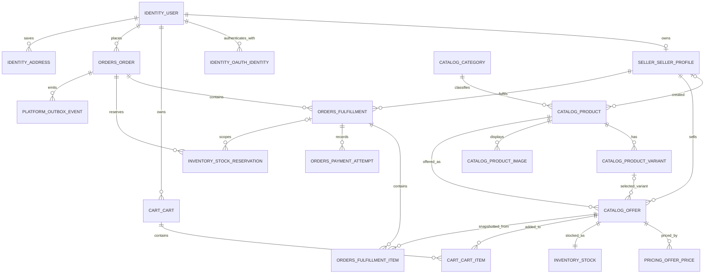

# Phase 1 Data Model and ERD

**Status:** Complete  
**Version:** 1.1  
**Last updated:** 2026-09-14  
**Source of truth:** [BRD v1.4](../requirements/BRD.md), [architecture overview](../../architecture-overview.md), and Phase 1 user stories.  
**Scope:** Logical data design for V1. It defines ownership and constraints; physical indexes and migration order follow in the database-migration design.

---

## Summary

- [1. Modelling conventions](#modelling-conventions)
- [2. PostgreSQL schema map](#postgresql-schema-map)
- [3. Core relationship diagram](#core-relationship-diagram)
- [4. PostgreSQL custom enum types](#postgresql-enum-types)
- [5. Schema-level table design](#schema-level-table-design)
- [6. Essential cross-schema references](#essential-cross-schema-references)
- [7. Critical transactional rules](#critical-transactional-rules)
- [8. Future-phase seller promotions](#future-phase-seller-promotions)

## 1. Modelling conventions

- PostgreSQL 16+ is required. Every application-generated entity and event identifier uses a UUIDv7 generated by PostgreSQL with `DEFAULT uuidv7()`. UUIDv7 is time-ordered, but `created_at TIMESTAMPTZ` remains the authoritative audit timestamp. Two tables are deliberately outside that rule and use `BIGSERIAL`: `notifications.pending_listing_removal_digest`, a staging table drained and emptied every day, and `admin.keyword_blocklist`, admin configuration rather than a domain aggregate. Neither identifier appears in an event payload or a snapshot.
- MongoDB document `_id` values use UUIDv7 in standard UUID binary representation; do not use `ObjectId` for domain/audit documents. Composite and natural keys remain where noted.
- All mutable domain tables include `created_at TIMESTAMPTZ` and `updated_at TIMESTAMPTZ`.
- Money is `NUMERIC(19,4)` plus an ISO 4217 `CHAR(3)` currency code. Application/API values are decimal strings; JavaScript `number` is never used for money.
- Module tables use singular, snake-case names and qualified references (for example, `catalog.offer`). No domain table is created in `public`.
- A reference to a seller from any table outside `identity` is named `seller_profile_id` and targets `seller.seller_profile(id)`. A seller is never addressed by its `identity.user` id from a domain table, and the column is never shortened to `seller_id`.
- Country codes are ISO 3166-1 alpha-2 (`CHAR(2)`) in every column and in every JSONB address snapshot.
- A module is the only writer to its schema. Cross-schema foreign keys are limited to essential transactional references and are listed below; non-transactional integration uses Kafka events.
- Soft deletion is used only where history must remain visible. Catalog offers are status-driven; orders and audit records are immutable.
- Every event-producing transaction writes `platform.outbox_event` in the same PostgreSQL transaction.
- **V1 scope marker:** tables and columns marked `[V1]` are in scope for Phase 1. Items marked `[FUTURE]` are documented for context but must not be implemented until scope is approved.

## 2. PostgreSQL schema map

| Schema | Tables | Purpose |
|---|---|---|
| [`identity`](#schema-identity) | [`user`](#table-identity-user), [`oauth_identity`](#table-identity-oauth-identity), [`refresh_session`](#table-identity-refresh-session), [`address`](#table-identity-address), [`email_verification_token`](#table-identity-email-verification-token), [`password_reset_token`](#table-identity-password-reset-token) | Accounts, reusable buyer addresses, login identities, refresh-token rotation, and single-use credential tokens. |
| [`catalog`](#schema-catalog) | [`category`](#table-catalog-category), [`product`](#table-catalog-product), [`product_variant`](#table-catalog-product-variant), [`product_image`](#table-catalog-product-image), [`offer`](#table-catalog-offer) | Buyer-visible product catalogue and seller offers. |
| [`pricing`](#schema-pricing) | [`currency`](#table-pricing-currency), [`offer_price`](#table-pricing-offer-price), [`fx_rate`](#table-pricing-fx-rate) | Per-offer price rows and display-only FX cache. |
| [`inventory`](#schema-inventory) | [`stock`](#table-inventory-stock), [`stock_reservation`](#table-inventory-stock-reservation) | Available stock and checkout reservations. |
| [`cart`](#schema-cart) | [`cart`](#table-cart-cart), [`cart_item`](#table-cart-cart-item) | Server-side authenticated carts. Guest carts remain in browser local storage. |
| [`orders`](#schema-orders) | [`order`](#table-orders-order), [`fulfillment`](#table-orders-fulfillment), [`fulfillment_item`](#table-orders-fulfillment-item), [`payment_attempt`](#table-orders-payment-attempt), [`idempotency_key`](#table-orders-idempotency-key) | Checkout records, per-seller fulfillment groups, immutable line-item snapshots, and retry safety. |
| [`seller`](#schema-seller) | [`seller_profile`](#table-seller-seller-profile), [`kyc_application`](#table-seller-kyc-application) | Seller identity and KYC lifecycle. |
| [`admin`](#schema-admin) | [`moderation_case`](#table-admin-moderation-case), [`keyword_blocklist`](#table-admin-keyword-blocklist) | Listing moderation decisions and the admin-maintained listing-time keyword blocklist. |
| [`notifications`](#schema-notifications) | [`in_app_notification`](#table-notifications-in-app-notification), [`email_template`](#table-notifications-email-template), [`pending_listing_removal_digest`](#table-notifications-pending-listing-removal-digest) | Buyer/seller/admin notification read model, email template store, and staging table for daily listing-removal digest. |
| [`platform`](#schema-platform) | [`outbox_event`](#table-platform-outbox-event), [`processed_event`](#table-platform-processed-event) | Event relay and consumer idempotency. |

## 3. Core relationship diagram

```mermaid
erDiagram
    IDENTITY_USER ||--o| SELLER_SELLER_PROFILE : owns
    IDENTITY_USER ||--o{ IDENTITY_OAUTH_IDENTITY : authenticates_with
    IDENTITY_USER ||--o{ CART_CART : owns
    IDENTITY_USER ||--o{ ORDERS_ORDER : places
    IDENTITY_USER ||--o{ IDENTITY_ADDRESS : saves

    CATALOG_CATEGORY ||--o{ CATALOG_PRODUCT : classifies
    CATALOG_PRODUCT ||--o{ CATALOG_PRODUCT_VARIANT : has
    CATALOG_PRODUCT ||--o{ CATALOG_PRODUCT_IMAGE : displays
    CATALOG_PRODUCT ||--o{ CATALOG_OFFER : offered_as
    CATALOG_PRODUCT_VARIANT o|--o{ CATALOG_OFFER : selected_variant
    SELLER_SELLER_PROFILE o|--o{ CATALOG_PRODUCT : created
    SELLER_SELLER_PROFILE ||--o{ CATALOG_OFFER : sells
    CATALOG_OFFER ||--o{ PRICING_OFFER_PRICE : priced_by
    CATALOG_OFFER ||--|| INVENTORY_STOCK : stocked_as
    CATALOG_OFFER ||--o{ CART_CART_ITEM : added_to
    CATALOG_OFFER ||--o{ ORDERS_FULFILLMENT_ITEM : snapshotted_from

    CART_CART ||--o{ CART_CART_ITEM : contains
    ORDERS_ORDER ||--o{ ORDERS_FULFILLMENT : contains
    ORDERS_FULFILLMENT ||--o{ ORDERS_FULFILLMENT_ITEM : contains
    SELLER_SELLER_PROFILE ||--o{ ORDERS_FULFILLMENT : fulfils
    ORDERS_FULFILLMENT ||--o{ ORDERS_PAYMENT_ATTEMPT : records
    ORDERS_ORDER ||--o{ INVENTORY_STOCK_RESERVATION : reserves
    ORDERS_FULFILLMENT o|--o{ INVENTORY_STOCK_RESERVATION : scopes
    ORDERS_ORDER ||--o{ PLATFORM_OUTBOX_EVENT : emits
```

The diagram deliberately omits audit, notification, refresh-session, and event-consumer implementation links to keep product-to-order ownership readable.

## 4. PostgreSQL custom enum types

All application enums are defined as PostgreSQL custom types before any schema migration runs. Named here so every column definition can reference the correct type.

| Type name | Schema | Values |
|---|---|---|
| `account_type` | `identity` | `B2C`, `B2B` |
| `user_status` | `identity` | `ACTIVE`, `SUSPENDED`, `BANNED` |
| `oauth_provider` | `identity` | `GOOGLE`, `FACEBOOK` |
| `portal_type` | `identity` | `BUYER`, `SELLER`, `ADMIN` |
| `product_status` | `catalog` | `ACTIVE`, `REMOVED` |
| `offer_status` | `catalog` | `ACTIVE`, `INACTIVE`, `REMOVED`, `FLAGGED` |
| `price_type` | `pricing` | `LIST`, `SALE` — two values only; `B2B_TIER` is not a V1 price type (BRD § Amendments) |
| `reservation_status` | `inventory` | `ACTIVE`, `CONSUMED`, `RELEASED`, `EXPIRED` |
| `placement_outcome` | `orders` | `FULLY_PLACED`, `PARTIALLY_PLACED` |
| `fulfillment_status` | `orders` | `PENDING`, `SHIPPED`, `DELIVERED`, `REFUNDED`, `CANCELLED` |
| `payment_status` | `orders` | `SIMULATED_SUCCESS`, `SIMULATED_FAILURE` |
| `seller_kyc_status` | `seller` | `PENDING_KYC`, `APPROVED`, `REJECTED` |
| `seller_suspension_status` | `seller` | `ACTIVE`, `SUSPENDED` |
| `kyc_status` | `seller` | `PENDING`, `UNDER_REVIEW`, `APPROVED`, `REJECTED` |
| `moderation_status` | `admin` | `OPEN`, `RESOLVED`, `DISMISSED` |
| `moderation_decision` | `admin` | `REMOVE`, `DISMISS` |
| `moderation_source` | `admin` | `KEYWORD_MATCH`, `PROHIBITED_CATEGORY`, `ADMIN_MANUAL` |
| `removal_category` | `admin` | `PROHIBITED_CATEGORY`, `IP_VIOLATION`, `MISLEADING`, `OTHER` |
| `blocklist_enforcement` | `admin` | `BLOCK`, `FLAG` |
| `outbox_publication_status` | `platform` | `PENDING`, `PUBLISHED`, `FAILED` |

The `promotion_status`, `promotion_type`, `discount_type`, and `stacking_policy` types referenced in [§8](#future-phase-seller-promotions) are deliberately absent from this table: it lists only the types created by the V1 migration. They are defined with the `promotion` schema when that scope is approved.

## 5. Schema-level table design

### `identity`

#### `identity.user` [V1]

| Column | Type | Constraints / purpose |
|---|---|---|
| `id` | `UUID` | PK; `DEFAULT uuidv7()` |
| `email` | `TEXT` | Required; unique index on `LOWER(email)` |
| `full_name` | `TEXT` | Required |
| `roles` | `TEXT[]` | Required array; values `BUYER`, `SELLER`, `ADMIN`. One user may hold `BUYER` + `SELLER` simultaneously; `ADMIN` is never co-held with others. Default: `ARRAY['BUYER']`. |
| `email_verified` | `BOOLEAN` | Required, default `false`. OAuth logins set to `true` immediately. |
| `account_type` | `account_type` | Required: `B2C` or `B2B`; orthogonal to roles. |
| `password_hash` | `TEXT` | Nullable for OAuth-only accounts; argon2id hash; never plaintext. |
| `status` | `user_status` | Required: `ACTIVE`, `SUSPENDED`, `BANNED`. |
| `preferred_currency` | `CHAR(3)` | Nullable FK → `pricing.currency(code)`; display preference only. |
| `business_name` | `VARCHAR(120)` | Nullable; B2B buyer only (`account_type = B2B`). Max 120 chars. |
| `business_logo_storage_key` | `TEXT` | Nullable; B2B buyer only. Object storage key for uploaded business logo; URL derived at serve time. |
| `created_at`, `updated_at` | `TIMESTAMPTZ` | Required audit timestamps |

**Note on roles change (2026-08-29):** The original ERD used a single `role` column (`user_role` enum: `BUYER`, `SELLER`, `ADMIN`). This has been corrected to `roles TEXT[]` to support the multi-role requirement (BUYER + SELLER simultaneously).

#### `identity.oauth_identity`

| Column | Type | Constraints / purpose |
|---|---|---|
| `id` | `UUID` | PK; `DEFAULT uuidv7()` |
| `user_id` | `UUID` | Required FK → `identity.user(id)` |
| `provider` | `oauth_provider` | Required: `GOOGLE` or `FACEBOOK` |
| `provider_subject` | `TEXT` | Required provider-issued identifier; unique with `provider` |
| `verified_email` | `TEXT` | Verified email returned by the provider |
| `created_at`, `updated_at` | `TIMESTAMPTZ` | Required audit timestamps |

Unique constraint: `(provider, provider_subject)`.

#### `identity.refresh_session`

| Column | Type | Constraints / purpose |
|---|---|---|
| `id` | `UUID` | PK; `DEFAULT uuidv7()` |
| `user_id` | `UUID` | Required FK → `identity.user(id)` |
| `token_hash` | `TEXT` | Required; store only a hash of the refresh token |
| `expires_at` | `TIMESTAMPTZ` | Required |
| `revoked_at` | `TIMESTAMPTZ` | Nullable; set to `now()` on rotation and on logout. A non-null value is the single test for "this session may no longer be used". |
| `replaced_by_id` | `UUID` | Nullable self-FK → `identity.refresh_session(id)`; the session issued by the rotation that revoked this row. Chains the token family. |
| `device_metadata` | `JSONB` | Nullable client/device context |
| `created_at`, `updated_at` | `TIMESTAMPTZ` | Required audit timestamps |

Session rows are **soft-revoked and retained**: rotation and logout never delete a row. Rotation sets `revoked_at = now()` and `replaced_by_id` to the newly issued session, so the whole family remains walkable. Presenting a refresh token whose session already has `revoked_at IS NOT NULL` is therefore detectable as reuse (token theft), and the reuse handler revokes every session in that user's family. Retained rows are removed only by the session-cleanup job, once `revoked_at` is older than the refresh TTL plus a configurable buffer.

#### `identity.address`

| Column | Type          | Constraints / purpose |
|---|---------------|---|
| `id` | `UUID`        | PK; `DEFAULT uuidv7()` |
| `user_id` | `UUID`        | Required FK → `identity.user(id)` |
| `label` | `TEXT`        | Nullable buyer label, for example `Home` or `Office` |
| `recipient_name` | `TEXT`        | Required |
| `address_line_1`, `address_line_2` | `TEXT`        | First line required; second line nullable |
| `city`, `state_region`, `postal_code` | `TEXT`        | Required location fields except state/region when country validation permits it |
| `country_code` | `CHAR(2)`     | Required ISO 3166-1 alpha-2 delivery country code. No country is restricted in V1 (US-B-14). |
| `is_default` | `BOOLEAN`     | Required, default `false` |
| `created_at`, `updated_at` | `TIMESTAMPTZ` | Required audit timestamps |

Identity owns the reusable buyer address book. A buyer can query and select a saved address for a later checkout.

#### `identity.email_verification_token` [V1]

| Column | Type | Constraints / purpose |
|---|---|---|
| `id` | `UUID` | PK; `DEFAULT uuidv7()` |
| `user_id` | `UUID` | Required FK → `identity.user(id)`; unique (one active token per user) |
| `token_hash` | `TEXT` | Required SHA-256 of the raw token; raw token is never stored |
| `expires_at` | `TIMESTAMPTZ` | Required; TTL 24 hours from creation |
| `created_at` | `TIMESTAMPTZ` | Required |

One active token per user enforced by unique index on `user_id`. Insert-on-create replaces the previous token.

Storing only `token_hash` is a **PostgreSQL storage rule**, and it applies equally to `identity.password_reset_token` below. It does not govern transient event payloads: the `auth.email_verification_requested` and `auth.password_reset_requested` events carry the raw single-use token, because the notification consumer cannot build the email link otherwise. Those payloads are masked to `"***"` by the audit consumer before insert into MongoDB, and their topics carry a shortened retention, so the raw token is never durably stored anywhere.

#### `identity.password_reset_token` [V1]

| Column | Type | Constraints / purpose |
|---|---|---|
| `id` | `UUID` | PK; `DEFAULT uuidv7()` |
| `user_id` | `UUID` | Required FK → `identity.user(id)` |
| `token_hash` | `TEXT` | Required SHA-256 of the raw token |
| `portal` | `portal_type` | Required, no default; the portal that issued the token. A token is valid only on the portal it was issued from — a reset link mailed to a seller cannot be redeemed on the buyer portal. Redeem compares this column against the requesting portal and, on mismatch, returns the **same generic failure as an unknown or expired token**, never a portal-specific message, so the response never reveals that the token exists or which portal it belongs to. |
| `expires_at` | `TIMESTAMPTZ` | Required; TTL 60 minutes from creation |
| `used_at` | `TIMESTAMPTZ` | Nullable; set on successful use; used tokens are rejected |
| `created_at` | `TIMESTAMPTZ` | Required |

### `catalog`

#### `catalog.category` [V1]

| Column | Type | Constraints / purpose |
|---|---|---|
| `id` | `UUID` | PK; `DEFAULT uuidv7()` |
| `parent_id` | `UUID` | Nullable self-FK → `catalog.category(id)` |
| `name` | `TEXT` | Required display name |
| `slug` | `TEXT` | Required URL-safe name; unique among siblings |
| `is_prohibited` | `BOOLEAN` | Required, default `false`; flags blocked taxonomy branches |
| `created_at`, `updated_at` | `TIMESTAMPTZ` | Required audit timestamps |

#### `catalog.product`

| Column | Type | Constraints / purpose |
|---|---|---|
| `id` | `UUID` | PK; `DEFAULT uuidv7()` |
| `category_id` | `UUID` | Required FK → `catalog.category(id)` |
| `created_by_seller_id` | `UUID` | Nullable FK → `seller.seller_profile(id)`; the selling profile that created this product record. `NULL` means platform-owned, which is every one of the 100 seeded products. Exists for authorization, not for ownership of the catalogue entry. |
| `title`, `description`, `brand` | `TEXT` | Buyer-visible catalog attributes; `title` required |
| `status` | `product_status` | Required catalog lifecycle state |
| `source_reference` | `TEXT` | Nullable seed-dataset traceability |
| `attributes` | `JSONB` | Nullable; flat key/value catalog attributes imported at seed time (e.g. `{ "material": "aluminium", "weight": "250 g" }`), rendered as a read-only list on the PDP. **No `rating` key** — the rating filter and display were dropped from V1 on 2026-09-14 (BRD § Amendments, FR-B-03); nothing writes one and nothing reads one. No mutation endpoint exists in V1 (`api-design/seller.md` § No `attributes` on the product). |
| `created_at`, `updated_at` | `TIMESTAMPTZ` | Required audit timestamps |

`catalog.product` has no price. It is a **shared catalogue entry**: one product carries offers from many sellers, and that sharing is deliberate and unchanged.

`created_by_seller_id` records who created the record so that product mutations have an authorization predicate to check. `PATCH` and `DELETE` on a product require an ADMIN caller, or a `created_by_seller_id` equal to the calling seller's profile; any other seller receives `403`. Creating an **offer** against a product someone else created stays open to every approved seller — that is the shared-catalogue design and this column does not narrow it. The column must not be read as per-seller ownership of the product: a `NULL` value is normal, it means platform-owned, and every seeded product carries it.

#### `catalog.product_variant`

| Column | Type | Constraints / purpose |
|---|---|---|
| `id` | `UUID` | PK; `DEFAULT uuidv7()` |
| `product_id` | `UUID` | Required FK → `catalog.product(id)` |
| `sku` | `TEXT` | Required; unique with `product_id` |
| `attributes` | `JSONB` | Required normalized buyer-facing attributes, such as colour and size |
| `created_at`, `updated_at` | `TIMESTAMPTZ` | Required audit timestamps |

#### `catalog.product_image`

| Column | Type | Constraints / purpose |
|---|---|---|
| `id` | `UUID` | PK; `DEFAULT uuidv7()` |
| `product_id` | `UUID` | Required FK → `catalog.product(id)` |
| `storage_key` | `TEXT` | Required object-storage key or URL |
| `alt_text` | `TEXT` | Nullable accessibility text |
| `position` | `SMALLINT` | Required display order; unique with `product_id` |
| `created_at`, `updated_at` | `TIMESTAMPTZ` | Required audit timestamps |

#### `catalog.offer`

| Column | Type | Constraints / purpose |
|---|---|---|
| `id` | `UUID` | PK; `DEFAULT uuidv7()` |
| `seller_profile_id` | `UUID` | Required FK → `seller.seller_profile(id)` |
| `product_id` | `UUID` | Required FK → `catalog.product(id)` |
| `variant_id` | `UUID` | Nullable FK → `catalog.product_variant(id)` when a product has variants |
| `native_currency_code` | `CHAR(3)` | Required FK → `pricing.currency(code)`; the seller's pricing currency for this offer. Restricted to currencies where `pricing.currency.is_seller_price_allowed = true` (V1: `USD`, `THB`, `JPY`, `SGD`). Immutable in practice: a seller wanting a second currency creates a second offer. |
| `status` | `offer_status` | Required: `ACTIVE`, `INACTIVE`, `REMOVED`, or `FLAGGED`. A new listing is created `ACTIVE` — all listings go live on successful submit (US-S-10), so there is no draft state in V1. `FLAGGED` means the offer has an open `admin.moderation_case`. |
| `status_changed_reason` | `TEXT` | Nullable; tracks why status last changed. Values: `SUSPENSION`, `ADMIN_REMOVAL`, `SELLER_DEACTIVATED`, `SELLER_MANUAL`, `AUTO_MODERATION`. Required to distinguish suspension-deactivated offers from other inactive offers on reinstatement (US-A-05b, US-P-18). |
| `created_at`, `updated_at` | `TIMESTAMPTZ` | Required audit timestamps |

An offer is the seller-scoped listing and the only product reference used by carts and order items.

Status transitions, each paired with the `status_changed_reason` it records:

| From → To | Trigger | `status_changed_reason` |
|---|---|---|
| (insert) → `ACTIVE` | Seller submits a listing that passes the listing-time guards | `NULL` |
| `ACTIVE → INACTIVE` | Seller deactivates the listing | `SELLER_DEACTIVATED` |
| `INACTIVE → ACTIVE` | Seller reactivates the listing | `SELLER_MANUAL` |
| `ACTIVE → INACTIVE` | Seller is suspended (US-P-18) | `SUSPENSION` |
| `INACTIVE → ACTIVE` | Suspension lifted or seller reinstated (US-A-05b) — only offers whose reason is `SUSPENSION` are restored | cleared to `NULL` |
| `ACTIVE → FLAGGED` | Moderation case opened | `AUTO_MODERATION` for a keyword/category match, `ADMIN_REMOVAL` for an admin manual flag |
| `FLAGGED → ACTIVE` | Case cleared | previous reason cleared to `NULL` |
| `FLAGGED → REMOVED` | Case resolved with decision `REMOVE` | `ADMIN_REMOVAL` |
| `ACTIVE → REMOVED` | Admin removes a listing without a prior flag | `ADMIN_REMOVAL` |

`REMOVED` is terminal: a seller cannot reactivate a removed listing and must create a new compliant one (US-S-10).

`offer.variant_id`, when present, must belong to `offer.product_id`; enforce this in the application transaction and with a composite database constraint introduced by the database-migration design named in this document's scope.

### `pricing`

#### `pricing.currency`

| Column | Type | Constraints / purpose |
|---|---|---|
| `code` | `CHAR(3)` | PK; ISO 4217 code |
| `minor_unit_scale` | `SMALLINT` | Required display scale |
| `is_seller_price_allowed` | `BOOLEAN` | Required; V1 true only for `USD`, `THB`, `JPY`, and `SGD` |
| `created_at`, `updated_at` | `TIMESTAMPTZ` | Required audit timestamps |

#### `pricing.offer_price`

| Column | Type | Constraints / purpose |
|---|---|---|
| `id` | `UUID` | PK; `DEFAULT uuidv7()` |
| `offer_id` | `UUID` | Required FK → `catalog.offer(id)` |
| `amount` | `NUMERIC(19,4)` | Required; `CHECK (amount >= 0)` |
| `price_type` | `price_type` | Required: `LIST` or `SALE` |
| `min_qty` | `INT` | Required; `DEFAULT 1`; `CHECK (min_qty = 1)`. V1 writes nothing but `1` — the column carried `B2B_TIER` quantity breaks, which are deferred to Phase 2. It is kept because the `LIST` uniqueness index below is declared on it; relaxing the `CHECK` is the only schema change a future quantity break needs. |
| `starts_at`, `ends_at` | `TIMESTAMPTZ` | Required bounded valid interval for `SALE`; null for other price types |
| `inactive_at` | `TIMESTAMPTZ` | Nullable; set when a price row is superseded or withdrawn. A row with a non-null value never participates in effective-price resolution and is excluded from the uniqueness constraints below. |
| `created_at`, `updated_at` | `TIMESTAMPTZ` | Required audit timestamps |

**`offer_price` carries no currency column.** The currency of every price row is `catalog.offer.native_currency_code` on its parent offer — there is exactly one pricing currency per offer, so a per-row currency could only ever duplicate it or disagree with it. Readers join the offer to obtain the currency; the API returns it as `currencyCode` beside each amount.

Uniqueness is enforced by two constraints, both scoped to live rows, because a unique key that ignores the time bounds would make a scheduled `SALE` alongside a live one impossible (FR-P-06b):

- `LIST` — partial unique index on `(offer_id, price_type, min_qty) WHERE price_type = 'LIST' AND inactive_at IS NULL`. Since `min_qty` is always `1`, the key is effectively `(offer_id)` for this price type, so at most one active `LIST` row exists per offer. Matches `api-design/pricing.md` § Uniqueness.
- `SALE` — `EXCLUDE USING gist (offer_id WITH =, tstzrange(starts_at, ends_at) WITH &&) WHERE (price_type = 'SALE' AND inactive_at IS NULL)`. This puts US-S-04b ("overlapping SALE periods are rejected") in the database rather than in application code, while still permitting any number of sequential, non-overlapping SALE rows.

The `EXCLUDE` constraint requires the `btree_gist` extension, created by `CREATE EXTENSION IF NOT EXISTS btree_gist;` in migration `0001_create_extensions`, which runs before the `pricing` migration. `offer_id` is a `uuid`, core PostgreSQL 16 ships no GiST operator class for that type, and `gist_uuid_ops` arrives only with `btree_gist` — without the extension the migration fails outright with `data type uuid has no default operator class for access method "gist"`. The extension is bundled contrib, present in the official image and trusted from PostgreSQL 13 onwards, so it needs no custom image and no superuser. The NFR-18 portability caveat is that a managed PostgreSQL forbidding contrib extensions also forbids this constraint.

The V1 `SALE` row already supports a seller's time-bounded, no-code discount. Coupon-code promotions are a future-phase capability defined below and are not part of the V1 migration.

#### `pricing.fx_rate`

| Column | Type | Constraints / purpose |
|---|---|---|
| `base_currency_code` | `CHAR(3)` | PK component; FK → `pricing.currency(code)`; **seller's native pricing currency** (one of USD, THB, JPY, SGD) |
| `quote_currency_code` | `CHAR(3)` | PK component; FK → `pricing.currency(code)`; **buyer's display/target currency** |
| `rate` | `NUMERIC(19,8)` | Required; `CHECK (rate > 0)`; cached exchange rate (`base_currency_code` → `quote_currency_code`) |
| `as_of` | `TIMESTAMPTZ` | Required; the timestamp the rate provider attributes to this rate. Overwritten on every refresh, and the only column staleness is measured against. |
| `provider` | `TEXT` | Required identifier of the rate source the current value came from. |
| `created_at` | `TIMESTAMPTZ` | Required; set once when the pair is first inserted and never updated afterwards. |
| `updated_at` | `TIMESTAMPTZ` | Required; set to `now()` on every refresh of this pair. |

Primary key: `(base_currency_code, quote_currency_code)`. This table is display-only and never reprices an order.

The table holds **exactly one row per currency pair and keeps no history**. Refresh is an upsert in place — `INSERT … ON CONFLICT (base_currency_code, quote_currency_code) DO UPDATE SET rate, as_of, provider, updated_at` — so the table is fixed-size and has nothing to prune. There is no insert-per-poll and no `fetched_at` column.

Staleness is a read-time concern, not a stored state: when `now() - as_of` exceeds the configured `FX_STALE_AFTER_HOURS` window (a whole number of hours, default `24`) the API still returns the cached rate, marked as stale, and the UI presents it as an indicative rate. Historical order amounts never read this table — every converted amount a buyer has already been shown is snapshotted on `orders.fulfillment` and `orders.fulfillment_item` at capture (FR-P-03).

### `inventory`

#### `inventory.stock`

| Column | Type | Constraints / purpose |
|---|---|---|
| `offer_id` | `UUID` | PK and FK → `catalog.offer(id)` |
| `on_hand_qty` | `INT` | Required; `CHECK (on_hand_qty >= 0)`; the physical warehouse quantity, decremented when a fulfillment ships and never at reservation time |
| `reserved_qty` | `INT` | Required; `CHECK (reserved_qty >= 0 AND reserved_qty <= on_hand_qty)`; units held by placed fulfillments that have not yet shipped, covering the checkout-to-ship gap (US-S-08) |
| `low_stock_threshold` | `SMALLINT` | Required; `DEFAULT 5`; `CHECK (low_stock_threshold > 0)`; threshold compared against available quantity for the `inventory.low_stock` event; configurable per offer via CSV import |
| `version` | `BIGINT` | Required optimistic-lock counter |
| `created_at`, `updated_at` | `TIMESTAMPTZ` | Required audit timestamps |

Available quantity is `on_hand_qty - reserved_qty`. It is always derived at read time and never stored in a column of its own. Because that subtraction already removes a reserved unit from the available count, the reservation — not the decrement — is what protects stock between checkout and shipment; decrementing `on_hand_qty` at reservation time would remove the same unit twice and understate availability.

The `CHECK (reserved_qty >= 0 AND reserved_qty <= on_hand_qty)` constraint is **retained**: reserved units are physically held units, so on-hand can never fall below them. A seller lowering `on_hand_qty` below the currently reserved quantity is therefore a rejected write, not a silently negative available count. The manual and CSV bulk-update paths (US-S-09) must surface that rejection as a per-row result in the upload response, naming the offer and the held quantity, while the remaining valid rows still apply — a constraint violation must never surface as a `500`. There is no staged preview and no staging table: the file is validated and applied in one request.

The table carries no adjustment trail: there is no `reason` column, no actor column, and no `stock_adjustment` table in PostgreSQL. Every adjustment — a manual inline edit or a CSV row (US-S-08, US-S-09) — emits a domain event, and the audit consumer writes the actor, the source (`CSV` or `MANUAL`), the delta, and the seller's stated reason to the MongoDB `audit_logs` collection. This follows the project's PostgreSQL-transactional / MongoDB-audit split. The accepted cost is stated here rather than left implicit: reconciling a disputed stock figure is a cross-database lookup against `audit_logs`, not a PostgreSQL join, so no query against this schema alone can explain how a quantity reached its current value.

The `inventory.low_stock` event is edge-triggered rather than level-triggered (US-S-08). The transaction that writes a stock change compares the available quantity before the write against the available quantity after it, and writes the `inventory.low_stock` outbox row only when that write moves availability from at-or-above `low_stock_threshold` to below it. A write that leaves an already-low offer still low emits nothing, which makes the event rare by construction: no `low_stock_notified_at` marker column is required, and the notifications consumer needs no dedupe beyond its normal `event_id` idempotency. A later write lifting availability back to at-or-above the threshold re-arms the edge, so a subsequent dip fires the event again.

#### `inventory.stock_reservation`

| Column | Type | Constraints / purpose |
|---|---|---|
| `id` | `UUID` | PK; `DEFAULT uuidv7()` |
| `offer_id` | `UUID` | Required FK → `inventory.stock(offer_id)` |
| `order_id` | `UUID` | Required FK → `orders.order(id)`; retained and required so the expiry sweep can find reservations belonging to a checkout that never produced a fulfillment |
| `fulfillment_id` | `UUID` | Nullable FK → `orders.fulfillment(id)`; set in the same checkout transaction once the fulfillment row for that seller group exists. `NULL` means the group has not been placed yet. |
| `quantity` | `INT` | Required; `CHECK (quantity > 0)` |
| `status` | `reservation_status` | Required: `ACTIVE`, `CONSUMED`, `RELEASED`, or `EXPIRED` |
| `expires_at` | `TIMESTAMPTZ` | Required; active reservations expire after 15 minutes |
| `created_at`, `updated_at` | `TIMESTAMPTZ` | Required audit timestamps |

Index: `(fulfillment_id)`.

Release is scoped on `fulfillment_id`, never on `order_id`: a checkout spanning several sellers holds one reservation set per seller group, and cancelling or refunding one seller's fulfillment must release only that seller's reservations. The expiry sweep is the one path that works from `order_id` — it releases `ACTIVE` reservations past `expires_at` that never acquired a fulfillment (`fulfillment_id IS NULL`), which is exactly the abandoned-checkout case.

Lifecycle: `ACTIVE` → `CONSUMED` when the fulfillment ships, `RELEASED` on seller cancel or on refund of a `PENDING` fulfillment, `EXPIRED` when the TTL sweep reclaims it. The transitions out of `ACTIVE` are written by the inventory Kafka consumers alone, never by the Orders module — stock restoration is eventually consistent and idempotent on `event_id`.

The shipment transition belongs to the `inventory.fulfillment-shipped` consumer group on `fulfillment.shipped`. In one transaction it sets that fulfillment's `ACTIVE` reservations to `CONSUMED` scoped on `fulfillment_id`, decrements `inventory.stock.on_hand_qty` by the shipped quantity, decrements `reserved_qty` by the same quantity, and writes an `inventory.changed` outbox row with `change_reason = 'SHIPMENT'`. Because on-hand and reserved fall together, `available = on_hand_qty - reserved_qty` is unchanged by shipment and buyer-facing availability does not move — the availability drop already happened at reservation. The event is still emitted: the stock trail lives in the MongoDB audit stream, which is fed by events, so omitting it would leave the on-hand decrement with no audit record anywhere, and the seller portal's on-hand display reads it.

### `cart`

#### `cart.cart`

| Column | Type | Constraints / purpose |
|---|---|---|
| `id` | `UUID` | PK; `DEFAULT uuidv7()` |
| `user_id` | `UUID` | Required FK → `identity.user(id)`; unique for one authenticated cart per user |
| `created_at`, `updated_at` | `TIMESTAMPTZ` | Required audit timestamps |

#### `cart.cart_item`

| Column | Type | Constraints / purpose |
|---|---|---|
| `id` | `UUID` | PK; `DEFAULT uuidv7()` |
| `cart_id` | `UUID` | Required FK → `cart.cart(id)` |
| `offer_id` | `UUID` | Required FK → `catalog.offer(id)` |
| `quantity` | `INT` | Required; `CHECK (quantity > 0)` |
| `created_at`, `updated_at` | `TIMESTAMPTZ` | Required audit timestamps |

Unique constraint: `(cart_id, offer_id)`. No price is persisted; the server alone recalculates the effective price during checkout. Client-supplied prices, discounts, totals, and FX values are ignored.

`cart_item` carries no `variant_id` and needs none: the offer *is* the sellable unit, so the selected variant is `catalog.offer.variant_id` on the referenced offer. Inventory is grained per offer for the same reason (`inventory.stock` is keyed on `offer_id`), and V1 introduces no separate SKU entity.

### `orders`

Human-facing identifiers in this schema come from dedicated PostgreSQL sequences, one per identifier type, created by the `orders` migration before the tables that default from them:

| Sequence | Feeds | Format | Example |
|---|---|---|---|
| `orders.order_display_seq` | `orders.order.display_id` | `ORD-` + 9 digits, zero-padded | `ORD-000001042` |
| `orders.fulfillment_display_seq` | `orders.fulfillment.display_id` | `FUL-` + 9 digits, zero-padded | `FUL-000003871` |
| `orders.tracking_display_seq` | `orders.fulfillment.tracking_number` | `TRK-` + 9 digits, zero-padded | `TRK-000003871` |

Each is declared `CREATE SEQUENCE orders.<name> START 1000 INCREMENT 1` so the first identifier issued is not trivially recognisable as the platform's first order. Identifiers are **not** derived from the row's UUID: the leading hex characters of a UUIDv7 are its millisecond timestamp, so any prefix of it collides for rows created close together and would leak the key's internal structure. Gaps in the resulting sequence are expected and acceptable — a rolled-back transaction consumes its value and does not return it.

#### `orders.order` [V1]

One `order` is created per checkout attempt. It may contain multiple `fulfillment` rows — one per seller/currency group. The `display_id` and `placement_outcome` belong here; per-seller shipping, tracking, and status live on `orders.fulfillment`.

| Column | Type | Constraints / purpose |
|---|---|---|
| `id` | `UUID` | PK; `DEFAULT uuidv7()` |
| `display_id` | `TEXT` | Required; `UNIQUE`; `DEFAULT 'ORD-' \|\| lpad(nextval('orders.order_display_seq')::text, 9, '0')` (e.g. `ORD-000001042`) |
| `buyer_id` | `UUID` | Required FK → `identity.user(id)` |
| `currency_code` | `CHAR(3)` | Required FK → `pricing.currency(code)`; the buyer display currency for the order as a whole, resolved at checkout submission and immutable thereafter. `buyer_currency_grand_total` is denominated in it. |
| `placement_outcome` | `placement_outcome` | Required: `FULLY_PLACED` or `PARTIALLY_PLACED`; immutable after set |
| `shipping_address_snapshot` | `JSONB` | Required immutable address copy captured at checkout; its country field carries the same ISO 3166-1 alpha-2 code as `identity.address.country_code` |
| `idempotency_key_id` | `UUID` | Nullable FK → `orders.idempotency_key(id)` |
| `placed_at` | `TIMESTAMPTZ` | Required order creation time |
| `buyer_currency_grand_total` | `NUMERIC(19,4)` | Required; the sum of the order's `fulfillment.buyer_currency_total` values, in `currency_code`, as captured at checkout. A stored snapshot per FR-P-03, not a view and never recomputed from live FX. |
| `created_at`, `updated_at` | `TIMESTAMPTZ` | Required audit timestamps |

**Order aggregate status (derived):** `orders.order` has no stored `status` column and must not gain one. The order-level status is computed from the states of the order's placed fulfillments on every read. The table below is reproduced verbatim from [`user-stories/buyer.md`](../requirements/user-stories/buyer.md) §US-B-09 "Order.status (derived from placed Fulfillment states)", which is its source of truth; it is exhaustive and the rows are evaluated in order, with the final row as the fallback.

| Placed fulfillment states | Order Status |
|---|---|
| All `PENDING` | `PENDING` |
| All `SHIPPED` | `SHIPPED` |
| All `DELIVERED` | `COMPLETED` |
| All `REFUNDED` | `REFUNDED` |
| All `CANCELLED` | `CANCELLED` |
| All `REFUNDED` or `CANCELLED` (mix) | `REFUNDED` |
| Any `REFUNDED` + any `PENDING` or `SHIPPED` | `IN_PROGRESS` |
| Any `CANCELLED` + any `PENDING` or `SHIPPED` | `IN_PROGRESS` |
| `DELIVERED` + `REFUNDED` only | `PARTIALLY_REFUNDED` |
| `DELIVERED` + `CANCELLED` only (no `REFUNDED`) | `PARTIALLY_DELIVERED` |
| `DELIVERED` + `REFUNDED` + `CANCELLED` | `PARTIALLY_REFUNDED` |
| Any `DELIVERED` + `PENDING`/`SHIPPED`, no `REFUNDED`, no `CANCELLED` | `PARTIALLY_DELIVERED` |
| `PENDING` + `SHIPPED`, no `DELIVERED`, no `REFUNDED`, no `CANCELLED` | `PARTIALLY_SHIPPED` |
| Any other combination | `IN_PROGRESS` |

Only fulfillments that were actually placed are considered — a seller group that failed inventory reservation produced no fulfillment row and contributes nothing to the derivation. The derived value is exposed on API responses as `orderStatus`; it is a distinct vocabulary from `fulfillment.status` and the two must never be conflated.

#### `orders.fulfillment` [V1]

One fulfillment per seller/currency group within a checkout. Carries the per-seller status, shipping details, and monetary totals. State machine: `PENDING → SHIPPED → DELIVERED`; `PENDING → CANCELLED` (seller cancel, US-S-11); `PENDING → REFUNDED` (seller refund, or the auto-refund monitor for suspended-seller orders, US-P-16); `SHIPPED → REFUNDED` (seller refund). `DELIVERED`, `REFUNDED`, and `CANCELLED` are terminal — the absence of `DELIVERED → REFUNDED` is deliberate, since post-delivery returns are out of V1 scope (US-B-09).

| Column | Type | Constraints / purpose |
|---|---|---|
| `id` | `UUID` | PK; `DEFAULT uuidv7()` |
| `display_id` | `TEXT` | Required; `UNIQUE`; `DEFAULT 'FUL-' \|\| lpad(nextval('orders.fulfillment_display_seq')::text, 9, '0')` (e.g. `FUL-000003871`); buyer-facing per-seller fulfillment identifier |
| `order_id` | `UUID` | Required FK → `orders.order(id)` |
| `seller_profile_id` | `UUID` | Required FK → `seller.seller_profile(id)` |
| `seller_name_snapshot` | `VARCHAR(200)` | Required; `seller.seller_profile.business_name` captured at order placement. Immutable after creation. Snapshot required by FR-P-03 — seller may rename business after order. |
| `currency_code` | `CHAR(3)` | Required FK → `pricing.currency(code)`; the `catalog.offer.native_currency_code` of every offer in this group — one offer currency per fulfillment is what makes the per-seller/per-currency grouping well-defined |
| `status` | `fulfillment_status` | Required: `PENDING`, `SHIPPED`, `DELIVERED`, `REFUNDED`, or `CANCELLED` |
| `shipping_method` | `TEXT` | Required fake-shipping service identifier |
| `shipping_cost` | `NUMERIC(19,4)` | Required snapshot in `currency_code` (seller's native); `CHECK (shipping_cost >= 0)` |
| `tax_total` | `NUMERIC(19,4)` | Required snapshot in `currency_code` (seller's native); `CHECK (tax_total >= 0)` |
| `total_amount` | `NUMERIC(19,4)` | Required snapshot in `currency_code` (seller's native); `CHECK (total_amount >= 0)` |
| `buyer_display_currency` | `CHAR(3)` | Required FK → `pricing.currency(code)`; the buyer's currency resolved at checkout submission, immutable thereafter. A later change to the buyer's preferred-currency setting does not alter historical order display (US-B-09). |
| `buyer_currency_total` | `NUMERIC(19,4)` | Required; `total_amount` converted into `buyer_display_currency` at capture; `CHECK (buyer_currency_total >= 0)`. Rounded once, at capture, using the buyer currency's `minor_unit_scale`; storage keeps four fractional digits. |
| `tracking_number` | `TEXT` | Required mock tracking number; `DEFAULT 'TRK-' \|\| lpad(nextval('orders.tracking_display_seq')::text, 9, '0')`; issued when the fulfillment is created at `PENDING` (US-S-06), immutable |
| `estimated_delivery_at` | `TIMESTAMPTZ` | Required mock ETA; `placed_at + fulfillment_window_days`, the platform-configured ship-by window with a seeded default of 7 days (US-P-16). No randomisation and no per-fixture rule — the same fulfillment always yields the same ETA. |
| `placed_at` | `TIMESTAMPTZ` | Required fulfillment creation time |
| `shipped_at`, `delivered_at`, `refunded_at` | `TIMESTAMPTZ` | Nullable state-transition timestamps |
| `cancelled_at` | `TIMESTAMPTZ` | Nullable; set when fulfillment transitions to `CANCELLED`. |
| `created_at`, `updated_at` | `TIMESTAMPTZ` | Required audit timestamps |

`shipping_cost` and `tax_total` are structural zeroes in V1. Real shipping is out of scope (BRD §3.2) and Phase 1 defines no tax engine, no tax-rate table, and no jurisdiction model, so both columns are seeded from platform configuration and always capture `0.0000`. The columns exist so that adding real shipping or tax in a later phase is a change of the value written, not a reshaping of the schema and the API around it. Nothing in this design computes a tax figure, and no document may describe a tax calculation that has no configuration behind it.

The `order.completed` event fires when **no non-`DELIVERED` fulfillment remains** under the `order_id`, whatever the fulfillment count. There is no minimum-count floor: an order with a single fulfillment completes when that fulfillment is delivered, exactly as a five-seller order completes when the last of the five is delivered.

`REFUNDED` and `CANCELLED` fulfillments are terminal and are not "still pending". An order whose fulfillments have all reached a terminal state, with at least one `DELIVERED`, therefore completes. An order in which every fulfillment ended `CANCELLED` or `REFUNDED` emits no `order.completed` at all — it settles on the derived `CANCELLED` or `REFUNDED` status from the table above.

The completion check belongs to the Orders module and runs on `fulfillment.delivered`. No consumer outside Orders reads `orders.fulfillment` directly; the delivery tracker publishes the delivery event and Orders evaluates the condition against its own tables inside the transaction that writes the `order.completed` outbox row.

#### `orders.fulfillment_item` [V1]

Immutable line-item snapshot created inside the checkout transaction, alongside the fulfillment row it belongs to (see [§7](#critical-transactional-rules) rule 2). Never updated after insert.

| Column | Type | Constraints / purpose |
|---|---|---|
| `id` | `UUID` | PK; `DEFAULT uuidv7()` |
| `fulfillment_id` | `UUID` | Required FK → `orders.fulfillment(id)` |
| `offer_id` | `UUID` | Required FK → `catalog.offer(id)`; identifies source offer, not price source |
| `product_title_snapshot` | `TEXT` | Required immutable product title at time of purchase |
| `variant_label_snapshot` | `TEXT` | Nullable immutable variant label |
| `quantity` | `INT` | Required; `CHECK (quantity > 0)` |
| `unit_price` | `NUMERIC(19,4)` | Required immutable captured unit price in seller's native currency (`currency_code`); `CHECK (unit_price >= 0)` |
| `currency_code` | `CHAR(3)` | Required captured ISO 4217 code; **seller's native pricing currency** (matches `fulfillment.currency_code`) |
| `tax` | `NUMERIC(19,4)` | Required captured line tax in seller's native currency (`currency_code`); `CHECK (tax >= 0)` |
| `buyer_currency_unit_price` | `NUMERIC(19,4)` | Required; `unit_price` converted into `fulfillment.buyer_display_currency` at capture; `CHECK (buyer_currency_unit_price >= 0)` |
| `buyer_currency_tax` | `NUMERIC(19,4)` | Required; `tax` converted into `fulfillment.buyer_display_currency` at capture; `CHECK (buyer_currency_tax >= 0)` |
| `fx_rate_used_at_capture` | `NUMERIC(19,8)` | Required; `DEFAULT 1.00000000`; `CHECK (fx_rate_used_at_capture > 0)`; `base=currency_code` (seller's native) → `quote=fulfillment.buyer_display_currency`. Set to `1.00000000` when the two currencies are the same, so no reader has to branch on a null rate. |
| `created_at` | `TIMESTAMPTZ` | Required snapshot creation time; no `updated_at` |

The buyer-currency columns exist because the buyer is shown a converted amount and FR-P-03 forbids re-deriving any amount a buyer has already seen. Conversion happens once, at capture, and is rounded using the buyer currency's `minor_unit_scale`; storage keeps four fractional digits. No API response and no UI component ever converts money — every amount is returned as a string already denominated in the currency it will be displayed in, with its currency code beside it.

#### `orders.payment_attempt`

| Column | Type | Constraints / purpose |
|---|---|---|
| `id` | `UUID` | PK; `DEFAULT uuidv7()` |
| `fulfillment_id` | `UUID` | Required FK → `orders.fulfillment(id)`; payment is per seller/currency group |
| `provider`, `method` | `TEXT` | Required fake-payment identifiers |
| `status` | `payment_status` | Required simulated payment result: `SIMULATED_SUCCESS` means the mock gateway accepted the amount and the fulfillment was placed; `SIMULATED_FAILURE` means it declined and no fulfillment was created for that group. V1 has no real gateway, so no other outcome exists. |
| `masked_payment_detail` | `TEXT` | Required safe display detail; never PAN or CVV |
| `amount` | `NUMERIC(19,4)` | Required captured payment amount in seller's native currency (`currency_code`) |
| `currency_code` | `CHAR(3)` | Required captured payment currency; **seller's native** (mirrors `fulfillment.currency_code`) |
| `idempotency_key_id` | `UUID` | Nullable FK → `orders.idempotency_key(id)` |
| `created_at` | `TIMESTAMPTZ` | Required; attempts are append-only |

This table is a log of simulated charge attempts, **not a ledger**. A refund is a change of `orders.fulfillment.status` to `REFUNDED` and nothing more: no reversal row is written here, and `payment_status` has no refund value. There is therefore no payment-side record that money went back to the buyer. That is acceptable only while payments are mocked — BRD §3.2 excludes a real gateway from V1 — and must be revisited if V2 introduces one, at which point a reversal record becomes mandatory.

#### `orders.idempotency_key`

| Column | Type | Constraints / purpose |
|---|---|---|
| `id` | `UUID` | PK; `DEFAULT uuidv7()` |
| `actor_user_id` | `UUID` | Required FK → `identity.user(id)`; the user performing the mutation, whether buyer, seller, or admin |
| `key` | `TEXT` | Required client-supplied idempotency key |
| `request_hash` | `TEXT` | Required; rejects reuse with a different request body |
| `order_id` | `UUID` | Nullable while processing, then FK → `orders.order(id)` |
| `expires_at` | `TIMESTAMPTZ` | Required retention limit; the window is env-configurable and its value is recorded beside the idempotency-key cleanup job in the cleanup-jobs design, not fixed here |
| `created_at` | `TIMESTAMPTZ` | Required |

Unique constraint: `(actor_user_id, key)`. Replaying a completed key returns its original order.

The key is scoped to the acting user rather than to a buyer, so one table protects every mutation that must not be applied twice: buyer checkout, and the seller ship, refund, and cancel actions. Buyer behaviour is unchanged — a checkout still resolves through `order_id` — while a seller mutation stores its key against the seller's own user id. There is no second idempotency table.

At checkout, the buyer may select an `identity.address` record. The checkout service reads it through the Identity application interface and copies it into `order.shipping_address_snapshot`; it does not retain a foreign key to the mutable address. Historical orders are therefore not changed when a buyer updates or deletes a saved address. All fulfillment and fulfillment_item money columns are snapshots and never recalculated from `pricing.offer_price` or live FX rates.

### `seller` and `admin`

#### `seller.seller_profile`

| Column | Type | Constraints / purpose |
|---|---|---|
| `id` | `UUID` | PK; `DEFAULT uuidv7()` |
| `user_id` | `UUID` | Required FK → `identity.user(id)`; unique |
| `business_name` | `TEXT` | Required |
| `tax_id` | `TEXT` | Required; access-restricted sensitive business data |
| `address_line_1`, `address_line_2` | `TEXT` | First line required; second line nullable |
| `city`, `state_region`, `postal_code` | `TEXT` | Required location fields except state/region when country validation permits it |
| `country_code` | `CHAR(2)` | Required ISO 3166-1 alpha-2 business country code |
| `kyc_status` | `seller_kyc_status` | Required: `PENDING_KYC`, `APPROVED`, or `REJECTED`; the profile's current standing. Mutable, and always reflects the seller's most recent application — a resubmission after rejection moves it back to `PENDING_KYC`. This is not the same field as `seller.kyc_application.status`, which records the outcome of one individual application and never changes once decided. |
| `suspension_status` | `seller_suspension_status` | Required: `ACTIVE` or `SUSPENDED`; default `ACTIVE`; only applicable after KYC approval; independent of `kyc_status`. |
| `suspended_until` | `TIMESTAMPTZ` | Nullable; `NULL` means permanent suspension when `suspension_status = SUSPENDED`; non-null means timed suspension expiring at this timestamp. Polled by US-P-18 suspension expiry scheduler. |
| `suspension_reason` | `TEXT` | Nullable; free text reason recorded by admin at suspension time. |
| `created_at`, `updated_at` | `TIMESTAMPTZ` | Required audit timestamps |

The business address is held as columns here rather than as a foreign key to `identity.address`: the seller schema owns its own business data, and no cross-schema FK is introduced. The price is that the address shape defined by `identity.address` is restated, which is accepted deliberately. Invoice and order-confirmation rendering read these columns — never `seller.kyc_application.submitted_data`, which holds the unvalidated JSONB the seller typed at application time and is not the seller's current address of record.

#### `seller.kyc_application`

| Column | Type | Constraints / purpose |
|---|---|---|
| `id` | `UUID` | PK; `DEFAULT uuidv7()` |
| `seller_profile_id` | `UUID` | Required FK → `seller.seller_profile(id)` |
| `supersedes_application_id` | `UUID` | Nullable self-FK → `seller.kyc_application(id)`; the rejected application this submission replaces. `NULL` on a seller's first application. Chains the review history without mutating any decided row. |
| `submitted_data` | `JSONB` | Required submitted business/tax data; access-restricted |
| `document_references` | `JSONB` | Required encrypted-object-storage references; never document content |
| `status` | `kyc_status` | Required lifecycle state of this one application: `PENDING`, `UNDER_REVIEW`, `APPROVED`, or `REJECTED`. Immutable once a decision is recorded. This is not the same field as `seller.seller_profile.kyc_status`, which tracks the profile's standing across every application; the two carry different enum types because one profile has many applications and the two lifecycles do not coincide. |
| `reviewer_user_id` | `UUID` | Nullable FK → `identity.user(id)` until reviewed |
| `decision_reason` | `TEXT` | Nullable until a decision is made |
| `submitted_at`, `decided_at` | `TIMESTAMPTZ` | Submission required; decision nullable |
| `review_due_at` | `TIMESTAMPTZ` | Required; the review SLA deadline, computed once when the row is inserted and never recomputed (BRD §12 #14 — 3 business days, Mon–Fri `Asia/Bangkok`, 17:00 cutoff). Every SLA badge, dashboard count and email reads this column instead of deriving an interval from `submitted_at`, so the business-day rule and its cutoff have exactly one owner. |
| `created_at`, `updated_at` | `TIMESTAMPTZ` | Required audit timestamps |

A rejected seller resubmits by inserting a new `kyc_application` row whose `supersedes_application_id` points at the rejected one; the same transaction sets `seller.seller_profile.kyc_status` back to `PENDING_KYC`. The rejected row keeps its `status`, `decision_reason`, `reviewer_user_id`, and `decided_at` untouched, so the audit trail of what was refused and why survives every resubmission, and the review history reads back as a chain from the newest application to the first.

#### `admin.moderation_case`

| Column | Type | Constraints / purpose |
|---|---|---|
| `id` | `UUID` | PK; `DEFAULT uuidv7()` |
| `offer_id` | `UUID` | Required FK → `catalog.offer(id)` |
| `source` | `moderation_source` | Required: `KEYWORD_MATCH`, `PROHIBITED_CATEGORY`, or `ADMIN_MANUAL`. An enum rather than free text because the moderation queue filters on it (US-A-03). Buyer reports are deferred to V2 and add a value then. |
| `reason` | `TEXT` | Required free-text detail, written for a human reader: the matched term(s) for `KEYWORD_MATCH`, the offending category for `PROHIBITED_CATEGORY`, the admin's typed reason for `ADMIN_MANUAL` |
| `matched_terms` | `TEXT[]` | Nullable; the blocklist terms that triggered the case, one array element per term. Populated for `KEYWORD_MATCH` and `NULL` for every other source. Machine-readable, unlike `reason` — the keyword scan queries it. |
| `status` | `moderation_status` | Required case lifecycle state |
| `decision` | `moderation_decision` | Nullable until resolved |
| `removal_category` | `removal_category` | Nullable; the category the admin removed the listing under, chosen at decision time and carried by `moderation.listing.removed`. `CHECK ((decision IS NOT DISTINCT FROM 'REMOVE') = (removal_category IS NOT NULL))` — present exactly when the decision is `REMOVE`, and null while the case is open or once it is dismissed. Written `IS NOT DISTINCT FROM` rather than `=` because a plain comparison against the null `decision` of an open case evaluates to null, which a `CHECK` accepts, and the constraint would then let an undecided case carry a removal category. |
| `decided_by_user_id` | `UUID` | Nullable FK → `identity.user(id)` until resolved |
| `created_at`, `decided_at`, `updated_at` | `TIMESTAMPTZ` | Required creation/update; decision nullable |

Opening a case sets the offer to `FLAGGED` and emits `listing.flagged`. Resolving a case with decision `REMOVE` sets the offer to `REMOVED` and emits `moderation.listing.removed`; both events are written to the outbox in the same transaction as the case and offer rows.

**`source` and `removal_category` are two enums and neither substitutes for the other.** `source` is why the case was opened, written by the system or by the flagging admin, and it is what the moderation queue filters on. `removal_category` is what the removing admin judged the listing to be, written only on a `REMOVE` decision, and it is what the seller is told — ET-09 renders it as the removal's "Category". The two share the symbol `PROHIBITED_CATEGORY` and nothing else: a case opened under `KEYWORD_MATCH` is routinely removed as `IP_VIOLATION`, and `ADMIN_MANUAL` is not a category any seller can be given as a reason. Assigning one column's value to the other type-checks in neither Postgres nor Avro, and must not be done by copying through an event payload either — `moderation.listing.removed` carries `removal_category` and `listing.flagged` carries `source`, each mirroring the one type named here.

A `DISMISS` decision suppresses re-flagging on the same word. The keyword scan runs at listing and update time rather than continuously, so dismissing a case does not cause an immediate re-flag, but the seller's next edit would otherwise trip the same term again and put the admin in a loop. The scan therefore skips any `(offer_id, term)` pair for which a `DISMISSED` case already records that term in `matched_terms`, and raises a new case only for terms not previously dismissed on that offer. A term the admin has never dismissed still flags normally, and a `REMOVE` decision suppresses nothing, since the offer is terminal.

#### `admin.keyword_blocklist` [V1]

The listing-time keyword blocklist required by FR-P-06c. Admin-maintained rather than hardcoded, so a new prohibited term does not require a deployment.

| Column | Type | Constraints / purpose |
|---|---|---|
| `id` | `BIGSERIAL` | PK |
| `term` | `TEXT` | Required blocked term |
| `match_type` | `TEXT` | Required; `SUBSTRING`, `WORD`, or `REGEX` |
| `enforcement` | `blocklist_enforcement` | Required, no default; `BLOCK` or `FLAG`. **This column is the two prohibited-content tiers.** `BLOCK` is the hard blocklist: a listing submit whose content matches is refused `422` and no row is written anywhere. `FLAG` is keyword suspicion: the listing is created, its offer goes `FLAGGED`, and a `moderation_case` opens for review. Requiring a value rather than defaulting one is deliberate — the tier is the whole consequence of adding a term, so an admin adding one chooses it explicitly. |
| `category` | `TEXT` | Required; `WEAPONS`, `DRUGS`, `ADULT`, or `OTHER` |
| `is_active` | `BOOLEAN` | Required; `DEFAULT true` |
| `created_by` | `UUID` | Required FK → `identity.user(id)`; the admin who added the term |
| `created_at` | `TIMESTAMPTZ` | Required; `DEFAULT now()` |
| `updated_at` | `TIMESTAMPTZ` | Required; `DEFAULT now()` |

Unique constraint: `(term, match_type)`.

Terms are deactivated (`is_active = false`), never hard-deleted, so the audit trail behind a past flag remains readable. Every mutation of this table is audited. The listing-time guard loads the active terms into an in-process cache with a configurable TTL and must not query this table per save.

**`enforcement` and `match_type` are independent, and conflating them is the mistake to avoid.** `match_type` is how the scanner recognises the term — `WORD` for a whole-word hit, `SUBSTRING` for an embedded one, `REGEX` for a pattern. `enforcement` is what happens when it does. A slang term for a controlled substance is `SUBSTRING` and `BLOCK`; a word that is usually innocent and occasionally not is `WORD` and `FLAG`. Deriving the tier from the match type — treating an exact match as hard and a pattern as soft — would mean an admin could not add a precisely-spelled term they only wanted reviewed, and could not hard-block a pattern that has no single exact spelling. The two columns answer different questions and the guard reads both: it resolves the tier from the strictest `enforcement` among the terms that matched, so one `BLOCK` hit refuses the submit regardless of how many `FLAG` terms matched alongside it.

The seed loads the three FR-P-06c classes — `WEAPONS`, `DRUGS`, `ADULT` — as `BLOCK`, and `OTHER` as `FLAG`. That is seed policy, not a constraint: an admin may set either value on any category.

Prohibited **categories** are a separate mechanism and are unchanged: they live on the taxonomy as `catalog.category.is_prohibited`. A prohibited node is always the hard tier — it is a deliberate structural choice by an admin, not a word that happened to appear — so it behaves as `BLOCK` and has no `FLAG` counterpart.

### `notifications` and `platform`

#### `notifications.email_template` [V1]

| Column | Type | Constraints / purpose |
|---|---|---|
| `id` | `UUID` | PK; `DEFAULT uuidv7()` |
| `template_key` | `TEXT` | Required; unique; e.g. `checkout.summary`, `fulfillment.shipped` |
| `subject` | `TEXT` | Required email subject line (Handlebars template) |
| `body_html` | `TEXT` | Required HTML body with inline CSS (Handlebars) |
| `body_text` | `TEXT` | Required plain-text fallback (Handlebars) |
| `created_at`, `updated_at` | `TIMESTAMPTZ` | Required audit timestamps |

Notification consumers render emails by loading the template row by `template_key`, substituting Handlebars variables, and dispatching via SMTP adapter.

#### `notifications.in_app_notification` [V1]

| Column | Type | Constraints / purpose |
|---|---|---|
| `id` | `UUID` | PK; `DEFAULT uuidv7()` |
| `recipient_user_id` | `UUID` | Required FK → `identity.user(id)` |
| `type` | `TEXT` | Required notification type |
| `payload` | `JSONB` | Required safe display payload |
| `source_event_id` | `UUID` | Required; the `event_id` of the Kafka event that produced this notification |
| `read_at` | `TIMESTAMPTZ` | Nullable |
| `created_at` | `TIMESTAMPTZ` | Required |

Unique constraint: `(recipient_user_id, source_event_id)`. The uniqueness must be composite, not on `source_event_id` alone: one event legitimately fans out to several recipients — every admin receives `KYC_SUBMITTED` from a single event — and a unique key on the event id alone would let only the first recipient's row be inserted. The composite key still gives the consumer the idempotency it needs, since a redelivered event produces the same `(recipient, event)` pair per recipient.

Partial index: `(recipient_user_id, read_at) WHERE read_at IS NULL`. The unread badge is a `COUNT(*)` over this index with no counter column and no cached total, and the predicate is what makes that count cheap: the index holds only unread rows, so it stays small no matter how much read history the table accumulates, and a read notification leaves the index the moment `read_at` is set. It is deliberately not a plain composite index on the same two columns — that would index every row ever created and grow without bound.

#### `notifications.pending_listing_removal_digest` [V1]

Staging table for the daily listing-removal email digest (ET-09). The `notification.listing-removed` Kafka consumer writes rows here; it does **not** send email immediately. A scheduled job in the `workers` service — not a database cron — aggregates rows per selling profile at 23:00 UTC, renders ET-09, sends the email, and deletes the processed rows. It takes a Postgres advisory lock before doing work so that running more than one worker replica cannot send a seller two digests.

`removal_category` is copied from `admin.moderation_case.removal_category` and `removal_reason_text` from `admin.moderation_case.reason` on the removal event, so both required columns always have a source. Not from `moderation_case.source` — that is the case's origin, a different enum, and it is not what ET-09 shows the seller ([`admin.moderation_case`](#table-admin-moderation-case)).

| Column | Type | Constraints / purpose |
|---|---|---|
| `id` | `BIGSERIAL` | PK |
| `seller_profile_id` | `UUID` | Required FK → `seller.seller_profile(id)`; the digest is aggregated per selling profile, matching every other table that references a seller |
| `product_title` | `TEXT` | Required; captured at removal time |
| `removal_category` | `TEXT` | Required; the `admin.removal_category` value the listing was removed under, taken from the event. `TEXT` rather than the enum type deliberately: this is a rendering snapshot captured for one digest cycle, like `product_title`, and the `notifications` schema takes no type dependency on `admin`. The type discipline therefore lives in the consumer — an `UNKNOWN` decoded off the topic is routed to the DLQ, never written here. |
| `removal_reason_text` | `TEXT` | Required; admin-provided or system reason |
| `removed_at` | `TIMESTAMPTZ` | Required; when the listing was removed |
| `created_at` | `TIMESTAMPTZ` | Required; `DEFAULT NOW()` |

Index: `(seller_profile_id, removed_at)`. Rows are deleted after digest send — no retention needed beyond one digest cycle.

#### `platform.outbox_event`

| Column | Type | Constraints / purpose |
|---|---|---|
| `id` | `UUID` | PK and event ID; `DEFAULT uuidv7()` |
| `aggregate_type`, `aggregate_id` | `TEXT`, `UUID` | Required origin aggregate reference |
| `topic` | `TEXT` | Required Kafka destination topic |
| `key` | `TEXT` | Required Kafka partition key; it **is** `aggregate_id` rendered as a string, so every event about one aggregate lands on one partition and per-aggregate ordering holds |
| `event_type`, `event_version` | `TEXT`, `INT` | Required versioned event identity |
| `payload` | `JSONB` | Required source payload for Avro serialization |
| `correlation_id` | `UUID` | Required request/workflow correlation ID. It originates from the inbound `X-Correlation-ID` request header, which is accepted in any valid UUID version; the API generates a UUIDv7 when the header is absent or malformed. Scheduled work with no inbound request generates its own. |
| `occurred_at` | `TIMESTAMPTZ` | Required domain event time |
| `publication_status` | `outbox_publication_status` | Required relay delivery state; `DEFAULT 'PENDING'` |
| `attempt_count` | `INT` | Required; `DEFAULT 0` |
| `published_at` | `TIMESTAMPTZ` | Nullable; set when `publication_status` transitions to `PUBLISHED` |
| `created_at`, `updated_at` | `TIMESTAMPTZ` | Required audit timestamps |

Inserted in the same transaction as the originating state change — always, with no "publish after commit" variant.

The relay that ships these rows to Kafka runs as a single publisher, and that is enforced by the database rather than assumed from the deployment: the relay takes a `pg_advisory_lock` before each polling pass, exactly as every other scheduled job in the `workers` service does, so a second instance finds the lock held and does nothing. There is no lease or claim column on the table. Should a publish still be duplicated — a relay crashing between the Kafka acknowledgement and the `publication_status` update, for instance — every consumer dedupes on `event_id` through `platform.processed_event`, so the duplicate is absorbed at the consumer rather than applied twice.

Every outbox `INSERT` populates all of `aggregate_type`, `aggregate_id`, `topic`, `key`, `event_type`, `event_version`, `payload`, `correlation_id`, `occurred_at`, `created_at`, and `updated_at`. All eleven are `NOT NULL` and only `publication_status`, `attempt_count`, and `id` carry defaults, so an insert that names only a topic and a payload fails at the database, not at the relay. The `correlation_id` written here is the same value carried in the published event envelope and in every log line for the request, which is what makes an event traceable back to the API call that produced it.

#### `platform.processed_event`

| Column | Type | Constraints / purpose |
|---|---|---|
| `consumer_group` | `TEXT` | PK component; Kafka consumer identity |
| `event_id` | `UUID` | PK component; UUIDv7 event ID |
| `processed_at` | `TIMESTAMPTZ` | Required successful-processing time |
| `outcome` | `TEXT` | Required idempotent processing result |

The dedupe window required by BRD §9 is enforced by age rather than by a stored TTL column: the scheduled cleanup job deletes rows whose `processed_at` is older than the configured retention, which must exceed the longest topic retention so a replayed event is still recognised as processed. The same applies to `notifications.in_app_notification`, which has no per-row expiry and is pruned by age. Both retention values are env-configurable and are recorded with their jobs in the cleanup-jobs design.

## 6. Essential cross-schema references

These are allowed in V1 because they preserve a single transactional invariant. They are migration dependencies and must be documented in the owning module's migration.

| Referencing table | Referenced table | Why it is essential |
|---|---|---|
| `catalog.offer` | `seller.seller_profile` | An offer cannot exist without its selling profile. |
| `catalog.product` (`created_by_seller_id`) | `seller.seller_profile` | Authorization: product mutation is restricted to ADMIN or the creating profile, so the creator must resolve to a real profile. Nullable — platform-owned products carry `NULL`. |
| `catalog.offer` (`native_currency_code`) | `pricing.currency` | The offer's single pricing currency must be a valid, seller-permitted currency; every price row and every capture inherits it. |
| `pricing.offer_price`, `inventory.stock`, `cart.cart_item`, `orders.fulfillment_item` | `catalog.offer` | Price, stock, cart, and fulfillment line items must identify the precise seller offer. |
| `orders.order` | `identity.user`, `pricing.currency` | The order requires immutable buyer and display-currency accountability. |
| `orders.fulfillment` | `orders.order`, `seller.seller_profile`, `pricing.currency` | Each fulfillment group must identify its parent order, selling profile, and capture currency. |
| `orders.fulfillment_item`, `orders.payment_attempt` | `orders.fulfillment` | Line items and payment records belong to a fulfillment group; they cannot exist without it. |
| `inventory.stock_reservation` (`order_id`) | `orders.order` | The expiry sweep must reclaim reservations belonging to a checkout that never produced a fulfillment. |
| `inventory.stock_reservation` (`fulfillment_id`) | `orders.fulfillment` | Release and consumption are scoped to one seller's fulfillment, not to the whole checkout. |
| `identity.user` (`preferred_currency`) | `pricing.currency` | Buyer display-currency preference must reference a valid currency. |
| `admin.moderation_case` (`offer_id`) | `catalog.offer` | A moderation case targets a specific offer; cannot exist without it. |
| `admin.moderation_case` (`decided_by_user_id`) | `identity.user` | Audit accountability: the deciding admin must be an identity record. |
| `admin.keyword_blocklist` (`created_by`) | `identity.user` | Audit accountability: the admin who added a blocked term must be an identity record. |
| `seller.kyc_application` (`reviewer_user_id`) | `identity.user` | Audit accountability: the reviewing admin must be an identity record. |
| `seller.kyc_application` (`supersedes_application_id`) | `seller.kyc_application` | Self-reference; the resubmission chain must point at a real prior application so a rejected decision stays reachable without being mutated. |
| `notifications.in_app_notification` (`recipient_user_id`) | `identity.user` | Notifications must target a valid user. |
| `notifications.pending_listing_removal_digest` (`seller_profile_id`) | `seller.seller_profile` | The digest is aggregated and addressed per selling profile. |
| `platform.outbox_event` | no foreign key to aggregate | Allows a single generic outbox table and avoids coupling every aggregate migration to Platform. Aggregate identity is validated by its originating transaction. |

When a module is extracted later, its schema migrates with it and its service becomes the sole writer. Existing consumers replace cross-schema reads with an API call or a Kafka projection before the foreign-key dependency is removed.

## 7. Critical transactional rules

1. A catalog, price, inventory, KYC, moderation, or order state change commits its domain rows and outbox event together.
2. Checkout locks/updates inventory using the stock `version` (or equivalent row lock), creates the order and per-seller fulfillment groups with immutable item snapshots, records reservations/payment simulation, and inserts `fulfillment.placed` events (one per fulfillment) in one transaction.
3. An order confirmation is returned after that transaction commits; it never waits for Kafka, Elasticsearch, email, or MongoDB consumers.
4. Search documents are rebuilt from catalog/offer/inventory events. They are a read model and may lag the PostgreSQL source of truth by up to the defined NFR target.
5. The order service rechecks offer status, effective price, availability, and idempotency inside the checkout transaction; cart data alone is never trusted as a price or stock reservation.
6. Partial placement is per seller/currency group, and each group's outcome is independent (US-B-09). Items whose offer is stale or inactive are excluded from the checkout before grouping and recorded as skipped items; they are **not** deleted from the cart. A group whose reservation fails produces no fulfillment row, and its cart items also remain in the cart. `order.placement_outcome` is `FULLY_PLACED` when every group succeeded and `PARTIALLY_PLACED` when at least one failed while at least one succeeded; a checkout in which no group succeeded creates no order at all and is returned as an error.

## 8. Future-phase seller promotions

Seller-managed promotions are explicitly deferred from Phase 1. When approved, they belong in a dedicated `promotion` module and PostgreSQL schema rather than being added as more columns to `pricing.offer_price`. This keeps the V1 effective-price model simple while allowing future code-based and scheduled campaigns.

### `promotion.promotion`

| Column | Type | Constraints / purpose |
|---|---|---|
| `id` | `UUID` | PK; `DEFAULT uuidv7()` |
| `seller_profile_id` | `UUID` | Required FK → `seller.seller_profile(id)` |
| `name` | `TEXT` | Required seller-facing campaign name |
| `status` | `promotion_status` | Required: `DRAFT`, `SCHEDULED`, `ACTIVE`, `PAUSED`, `EXPIRED`, or `CANCELLED` |
| `promotion_type` | `promotion_type` | Required: `AUTOMATIC` or `CODE` |
| `discount_type` | `discount_type` | Required: `PERCENTAGE`, `FIXED_AMOUNT`, or `FIXED_PRICE` |
| `discount_value` | `NUMERIC(19,4)` | Required non-negative value; percentage is limited to `0 < value <= 100` |
| `currency_code` | `CHAR(3)` | Required for fixed amount/price; null for percentage |
| `starts_at`, `ends_at` | `TIMESTAMPTZ` | Required valid campaign period; `starts_at < ends_at` |
| `stacking_policy`, `priority` | enum, `SMALLINT` | Required conflict-resolution rule and seller-defined ordering |
| `created_at`, `updated_at` | `TIMESTAMPTZ` | Required audit timestamps |

### `promotion.promotion_offer`

| Column | Type | Constraints / purpose |
|---|---|---|
| `promotion_id` | `UUID` | PK component; FK → `promotion.promotion(id)` |
| `offer_id` | `UUID` | PK component; FK → `catalog.offer(id)` |
| `created_at` | `TIMESTAMPTZ` | Required |

The application must enforce that every attached offer belongs to the promotion's seller. A seller cannot promote another seller's offer.

### `promotion.promotion_code`

| Column | Type | Constraints / purpose |
|---|---|---|
| `id` | `UUID` | PK; `DEFAULT uuidv7()` |
| `promotion_id` | `UUID` | Required FK → `promotion.promotion(id)`; requires `promotion_type=CODE` |
| `code_normalized` | `TEXT` | Required case-normalized buyer-entered code; globally unique |
| `max_redemptions`, `max_redemptions_per_buyer` | `INT` | Nullable positive limits; null means no limit |
| `redemption_count` | `INT` | Required, default `0`; updated transactionally |
| `created_at`, `updated_at` | `TIMESTAMPTZ` | Required audit timestamps |

### `orders.order_promotion_redemption` (future migration)

| Column | Type | Constraints / purpose |
|---|---|---|
| `id` | `UUID` | PK; `DEFAULT uuidv7()` |
| `order_id` | `UUID` | Required FK → `orders.order(id)` |
| `promotion_id`, `promotion_code_id` | `UUID` | Required promotion FK; code FK nullable for automatic promotions |
| `promotion_name_snapshot`, `code_snapshot` | `TEXT` | Required campaign name; code nullable for automatic promotions |
| `discount_amount` | `NUMERIC(19,4)` | Required immutable captured discount |
| `currency_code` | `CHAR(3)` | Required captured ISO 4217 code |
| `created_at` | `TIMESTAMPTZ` | Required; append-only |

### Future checkout rules

1. At checkout, validate promotion status, time window, seller ownership, offer eligibility, code limits, and stacking policy inside the order transaction.
2. Lock/update the code redemption count atomically with the order, promotion-redemption snapshot, and outbox event. Idempotent retries must not redeem twice.
3. Snapshot the applied promotion and discount on the order. Historical orders never recalculate a promotion from the current campaign configuration.
4. Publish promotion lifecycle and redemption events through the existing outbox/Kafka pattern; reindex changed effective-price fields asynchronously for search.
